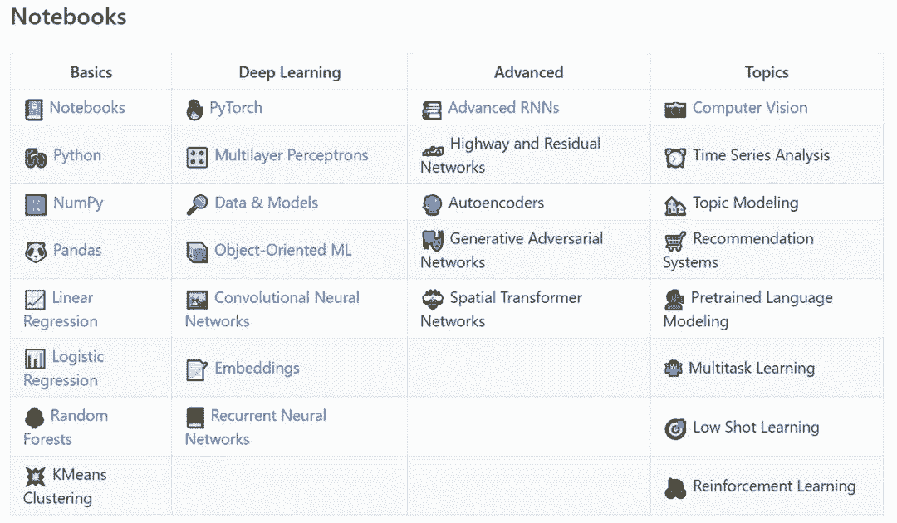
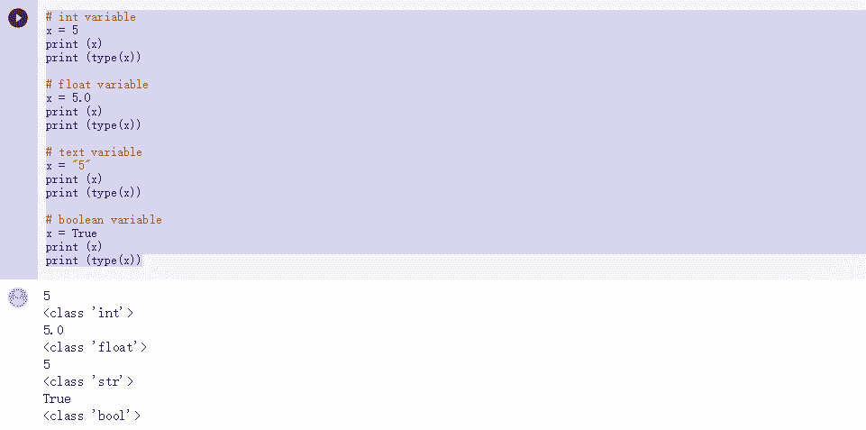
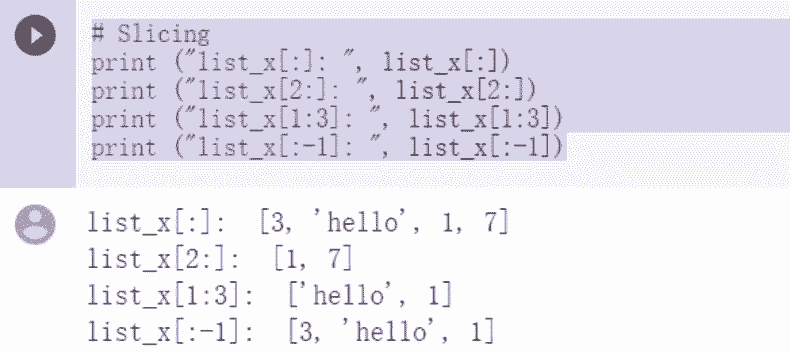
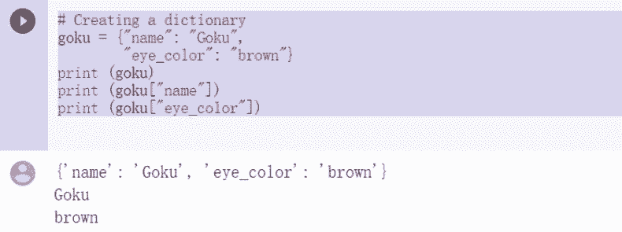
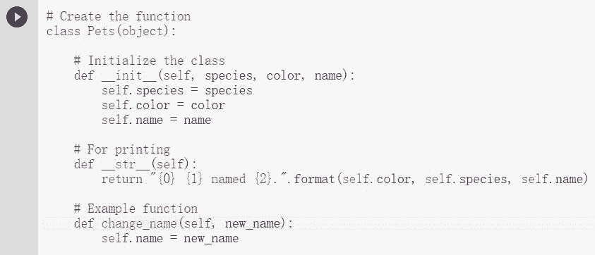
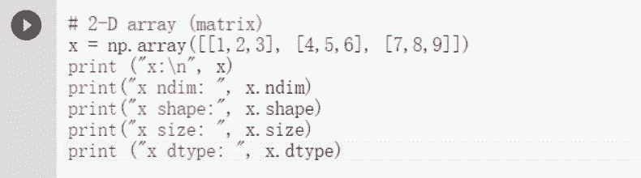

# 想要自学深度学习？不用 GPU，浏览器就够了

机器之心整理

**参与：刘晓坤、思源**

> 今天要介绍一个近期开源的自学深度学习 GitHub 项目，作者为每种具体算法提供了 Jupyter notebook 实现，可以轻易地在 Google Colab 上运行（免费提供云端 GPU 或 TPU）。所以想自学深度学习，不需要价格几千美元的 GPU，有一个 Chrome 浏览器就够了。

项目地址：https://github.com/GokuMohandas/practicalAI

该项目作者是 Goku Mohandas，是一名硅谷的 AI 研究员，曾就职于苹果公司，并在 O'Reilly Media 从事过教学工作。他开发的这个 GitHub 项目——PracticalAI 目前已经有大约 2500 的收藏量，覆盖了 Jupyter Notebook 和 Google Colab 的使用教程、Python 编程基础、深度学习基础（PyTorch 框架和 CNN、RNN 等算法），以及更高层次的算法和 AI 研究课题。

作者指出，他开发这个教程的目的是让人们能学习到目标导向、产品导向的机器学习思维，而不会停留在课堂。

**课程简介**

下表概括了整个项目的课程大纲，分成 4 个主要部分：基础、深度学习、高级深度学习算法和 AI 研究课题（蓝色是已经写好 notebook 的部分，可以直接链接到 Colab 页面，黑色是尚未写的部分）。

**基础：**包括 Jupyter Notebooks 简介、Python 编程基础和基础机器学习算法。作者会介绍 Jupyter Notebooks 的单元格编程界面和操作、执行单元格的方法；然后是 Python 以及两个重要的 Python 库——NumPy、Pandas 的入门；最后是线性回归、逻辑回归等基础 ML 算法的讲解，这些算法覆盖面很窄，不包含 SVM、朴素贝叶斯、隐马尔科夫模型等更复杂的算法。但该项目并不是为经典机器学习而设计的课程，读者可以在学习这些简单算法的过程中了解到 AI 算法的训练、数据集、评估、推理、正则化等基本概念，然后进入深度学习课程。

**深度学习：**包括 PyTorch 框架介绍和多种经典的深度学习算法。PyTorch 的介绍主要涉及张量计算和梯度计算。深度学习算法涉及多层感知机、CNN、RNN、词嵌入等，作者还写了两个较高层面的主题，分别是数据和模型的关系，以及目标导向的机器学习，让读者对如何利用这些算法有个基本理解。每种算法针对的任务都比较单一，也没有涉及生成模型，但通过深入的理解单个模型应用的每一个过程，可以让你在进阶学习时不被细节拖后腿。

**高级深度学习算法：**包括高级 RNN 模型、残差网络、自编码器、生成对抗网络、空间变换网络等。这些算法的模型架构设计建立在基础的深度网络之上。作者目前只写了高级 RNN 模型，涉及条件 RNN、编码器-解码器架构以及注意力机制等，其它模型还需等作者更新。或许作者还可以考虑加上基于流的模型、图神经网络等高级算法。

**AI 研究课题：**包括计算机视觉、时间序列分析、主题建模、推荐系统、预训练语言模型、多任务学习、小样本学习、强化学习等。这些课题不对应具体的模型架构，但会随当前研究现状有所偏好，如计算机视觉领域的主要模型架构就是 CNN 和编码器-解码器，作者目前只写了计算机视觉部分。要把握这些课题，需要读者对要解决的问题本身有很好的理解，从而不限于方法层面的视角。或许作者还可以考虑加上 AutoML、自监督学习、迁移学习、AI 游戏等课题。

**可以跑的教程**

这一套实践教程都能直接在 Colab 上运行，因此结合解释与代码，我们能更好地入门机器学习。那么小白是不是也能看得懂这个教程？我们可以从最基础的 Python 和 NumPy 出发，看看它们都介绍了些什么，纯小白是不是能在较短的篇幅里了解最核心的思想与技术。

在 Pyhon 实践中，作者给出了一个非常精简的教程，其仅涉及 Python 最核心的模块，包括变量、数据结构、基本语句与结构等。即使没有什么基础的小白，了解这些核心模块后至少能看懂大部分代码，剩下困难的只需要在遇到时谷歌一下就行了。

首先对于最基础的变量，它们就像函数中的自变量一样传递不同的值。如下所示，Python 中的变量可以传递整数、浮点数、字符串和布尔值，它们可以用于不同的运算：

而对于 Python 中主要的数据结构，即组织整数、浮点数、字符串和布尔值的结构，主要可以分为列表、元组和字典。其中列表是最常见的数据结构，我们可以想象为一个表格中的一行，表格每一个单元格都是列表中的一个元素，这样的元素不论存放数值、列表还是字典都没问题，它相当于一个容器。

以下展示了如何取列表中存储的元素，第一个表示取列表中所有元素，第二个表示从第三个元素开始取后面所有的元素：

元组和列表非常类似，只不过元组里面的元素不能修改。最后是字典，字典中每一个元素都由 Key 和 Value 组成，即一个键值对。在字典中，我们需要使用 Key 才能取到对应的 Value。

如下所示字典的构建与索引，它会通过「name」这一个键取对应的值 Goku：

随后对于基础语句，例如条件和循环语句，该教程也给出了很直观的解释。最后，如果我们利用数据结构组织变量、利用基础语句组织数据结构，再用函数或类等程序逻辑组织基础语句，那么我们就能得到完整的程序。

如下所示为基础的类，它能将函数和变量统一在一起，并构建完整的流程。在类中，赋值的变量可以称为属性，而函数则称为方法。下图构建了一个 Pets 类，当我们使用狗或猫实例化这个类时，就能直接调用 change_name 方法以实现改名。入门者跑一跑这几段代码就能知道类的大概作用了：

当然除了这些最基础的 Pyhon 语句，机器学习另外一个很重要的基础就是数值计算。我们需要计算大量的数据以获得最终的分析结果，这就少不了 NumPy，可以说入门机器学习第一个学习的包就是 NumPy。

我们可以使用 NumPy 实现大多数机器学习算法，现在很多深度学习框架都继承了 NumPy 的核心概念或数据结构等。了解了它，学习 DL 框架就没什么阻碍了。在 NumPy 中，最重要的是多维数组这个数据结构，它能以向量、矩阵或高阶张量的形式组织大量的数值，并实现高效的运算。此外，NumPy 还有很多针对多维数组所构建的运算，例如索引、矩阵乘法、矩阵转置或广播机制等。

入门读者首先需要了解多维数组，尤其是矩阵的概念，当然要是数学上不了解矩阵，NumPy 也就爱莫能助了。以下代码构建了一个 3×3 矩阵，并输出它的元素类型、矩阵维度形状和矩阵大小等。所有机器学习中的数据都是以多为数组存储的，它们的计算流也都以数组为媒介，所以先搞定最基础的 NumPy 数组吧！

关于理论基础的学习，只跑这些算法肯定是不够的，小编还是建议结合经典教材和课程视频一起学习。但先在浏览器上跑一跑，或许能让你更快体验到 AI 的魅力所在，并带来学习的动力。学习这个课程并不能让你了解深度学习的现状，但可以快速上手具体的项目，这或许正是作者说的「目标导向、产品导向」的意义所在。********

点击阅读原文，进入大赛官网报名参与 JDD-2018 京东数字科技全球探索者大赛。

