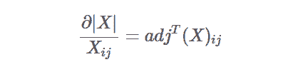
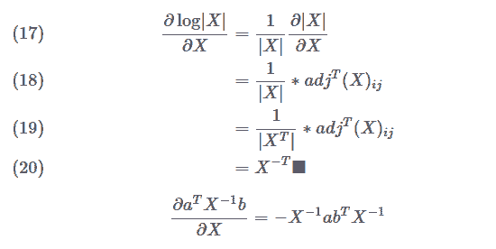

# 生成模型学习笔记：从高斯判别分析到朴素贝叶斯

机器之心专栏

****作者：张威****

****翻译：******燕子石**

> 本文是哥伦比亚大学研究生张威在生成模型上的学习笔记，由毕业于新西兰奥克兰理工大学的燕子石翻译。机器之心之前曾介绍过张威所写的[吴恩达《机器学习》课程的学习笔记](http://mp.weixin.qq.com/s?__biz=MzA3MzI4MjgzMw==&mid=2650752922&idx=2&sn=7ee3962b266b695e330a409325dcbe43&chksm=871a83e4b06d0af257d89e302ee09aaf7a985e7b33e89830d87f5f42ad6f50bae8fbbb920237&scene=21#wechat_redirect)。

*   英文原版地址：https://wei2624.github.io/MachineLearning/sv_generative_model/

*   中文翻译地址：https://air-yan.github.io/machine%20learning/Generative-Learning-Algorithm/

**1 判别模型**

判别模型是一种对观测数据进行直接分类的模型，常见的模型有逻辑回归和感知机学习算法等。此模型仅对数据进行分类，并不能具象化或者量化数据本身的分布状态，因此也无法根据分类生成可观测的图像。

定义上，判别模型通过构建条件概率分布 p(y|x;θ) 预测 y，即在特征 x 出现的情况下标记 y 出现的概率。此处 p 可以是逻辑回归模型。

**2 生成模型**

与判别模型不同，生成模型首先了解数据本身分布情况，并进一步根据输入 x，给出预测分类 y 的概率。该模型有着研究数据分布形态的概念，可以根据历史数据生成新的可观测图像。

贝叶斯分类就是一个典型的例子。在这个例子中，我们有一个先验分类，根据这个先验分类，我们可以使用贝叶斯原理计算每个分类的概率，然后取概率最高的概率。同时，我们还可以根据特定的先验生成特征。这就是一个生成过程。

**3 高斯判别分析**

高斯判别分析（GDA）是一个生成模型，其中 p(x|y) 是多元高斯正态分布。

3.1 多元高斯正态分布

在多元正态分布中，一个随机变量是一个在维度为 n 的 Rn 空间中的矢量值。因此，多元高斯的均值向量 μ∈Rn，协方差矩阵Σ∈Rn x n，其中$ \ Sigma 是对称的半正定矩阵。其概率密度函数为：

如上所述，μ是期望值。

向量值随机变量 Z 的协方差为：

下图显示了均值为零但不同协方差的几个密度函数。

以下为上图的协方差（从左到右）：

**4 高斯判别分析和逻辑回归**

**4.1 高斯判别分析**

我们再来谈谈二元分类的问题，我们可以用多元高斯模型对 p(x|y) 进行建模。总的来讲，我们有：

其中φ，μ0，μ1，Σ是我们想要找出的参数。请注意，虽然我们对不同的类有不同的均值，但我们在不同的类之间有着共享的协方差。

为什么它是一个生成模型？简而言之，我们有一个类的先验概率，这个类是伯努利分布。生成过程是（1）从伯努利分布中抽样。（2）基于类标签，我们从相应的分布中抽取 x。

所以，该数据的对数似然函数值是：

在上面的等式中，我们插入各个分布而不指明任何类，我们仅将它们抽象为 k。所以我们有：

现在，我们需要对每个参数进行取导，然后将它们设为零找到 argmax（函数值最大时对应的输入值 x）。一些可能对推导有用的公式列举如下：

（如果 A 是对称的并且与 x 相互独立）

**证明**： 矩阵 A 是对称矩阵，所以 A= AT 并假设空间维度为 n。

雅可比公式：

**证明：**

**证明：**

这个证明有些复杂。你应该事先了解克罗内克函数和 Frobenius 内部乘积。对于矩阵 X，我们可以写成：

你可以将 H 视为 Frobenius 内积的标识元素。在开始证明之前，让我们准备好去找逆矩阵的导数。也就是说，∂X-1/∂X。

所以我们可以这么解：

接着，让我们回到正题：

其中 F 表示 Frobenius 内积。

接着，带回到原始公式：

现在，我们已经有足够的准备去找到每个参数的梯度了。

对ϕ取导并设为 0：

对 μk 取导并设为 0：

对 Σ 取导并设为 0:

结果如图所示：

请注意，由于有着共享协方差，因此上图两个轮廓的形状是相同的，但均值则不同。在边界线上（自左上到右下的直线），每个类的概率为 50%。

**4.2 高斯判别分析（GDA）和逻辑回归**

高斯判别分析是如何与逻辑回归相关联的呢？我们可以发现如果上述 p(x|y) 是具有共享协方差的多元高斯，我们就可以计算 p(x|y) 然后发现它是遵循逻辑函数的。要证明这一点，我们可以：

由于高斯属于指数族，我们最终可以将分母中的比率转换为 exp（θTx），其中 θ 是φ，μ0，μ1，Σ的函数。

同样的，如果 p(x|y) 是具有不同 λ 的泊松分布，则 p(x|y) 也遵循逻辑函数。这意味着 GDA 模型本身有一个强假设，即每个类的数据都可以用具有共享协方差的高斯模型建模。但是，如果这个假设是正确的话，GDA 将可以更好并且更快地训练模型。

另一方面，如果不能做出假设，逻辑回归就不那么敏感了。因此，你可以直接使用逻辑回归，而无需接触高斯假设或 Possion 假设。

**5 朴素贝叶斯**

在高斯判别分析中，随机变量应使用具有连续值特征的数据。而朴素贝叶斯则用于学习离散值随机变量，如文本分类。在文本分类中，模型基于文本中的单词将文本标记为二进制类，单词被向量化并用于模型训练。一个单词向量就像一本字典一样，其长度是字典中单词储存的数量，其二进度值则代表着是否为某个词。一个单词在单词向量中由 1 表示「是」，而单词向量中的其他位置则是 0。

然而，这可能并不起作用。比方说，如果我们有 50,000 个单词并尝试将其建模为多项式，则参数的维数为 250,000-1,250,000-1，这太大了。因此，为了解决这个问题，我们做出了

**朴素贝叶斯假设：**

基于给定分类下，每个词彼此间条件独立。

于是，我们有： 

我们对第一步应用**概率论中的链式法则**，对第二步应用朴素贝叶斯假设。

找到对数似然函数值的最大值：

其中 ϕj|y=1 = P (xj=1|y=1)，ϕ j|y=1 = P(xj=1|y=1), ϕj|y=0 = P(xj=1|y=0) 并且 ϕy= p(y=1)。这些是我们需要训练的参数。

我们可以对其求导:

为了预测新样本，我们可以使用**贝叶斯法则**来计算 P（y = 1 | x）并比较哪个更高。

**延伸:** 在这种情况下，因为 y 是二进制值（0，1），我们将 P（xi | y）建模为伯努利分布。也就是说，它可以是「有那个词」或「没有那个词」。伯努利将类标签作为输入并对其概率进行建模，前提是它必须是二进制的。如果是处理非二进制值 Xi，我们可以将其建模为多项式分布，多项式分布可以对多个类进行参数化。

**总结:** 朴素贝叶斯适用于离散空间，高斯判别分析适用于连续空间。我们任何时候都能将其离散化。

**6 拉普拉斯平滑处理**

上面的示例通常是好的，不过当新邮件中出现过去训练样本中不存在的单词时，该模型将会预测失败。在这种情况下，它会因为模型从未看到过这个词而导致两个类的φ变为零，以至于无法进行预测。

这时我们则需要另一个解决方案，其名为拉普拉斯平滑，它将每个参数设置为：

其中 k 是类的数量。在实际操作中，拉普拉斯平滑并没有太大的区别，因为我们的模型中通常包含了所有的单词，但有一个备用计划总是极好的！**********

****本文为机器之心专栏，**转载请联系本公众号获得授权****。**

✄------------------------------------------------

**加入机器之心（全职记者 / 实习生）：hr@jiqizhixin.com**

**投稿或寻求报道：**content**@jiqizhixin.com**

**广告 & 商务合作：bd@jiqizhixin.com**