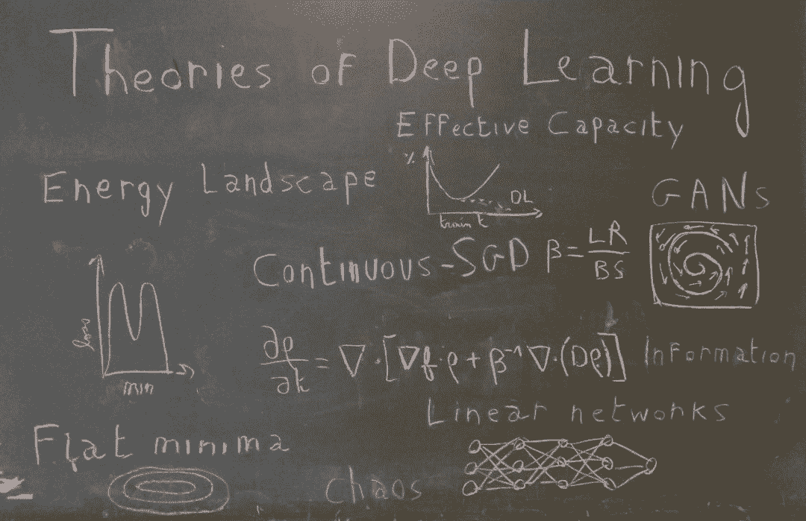
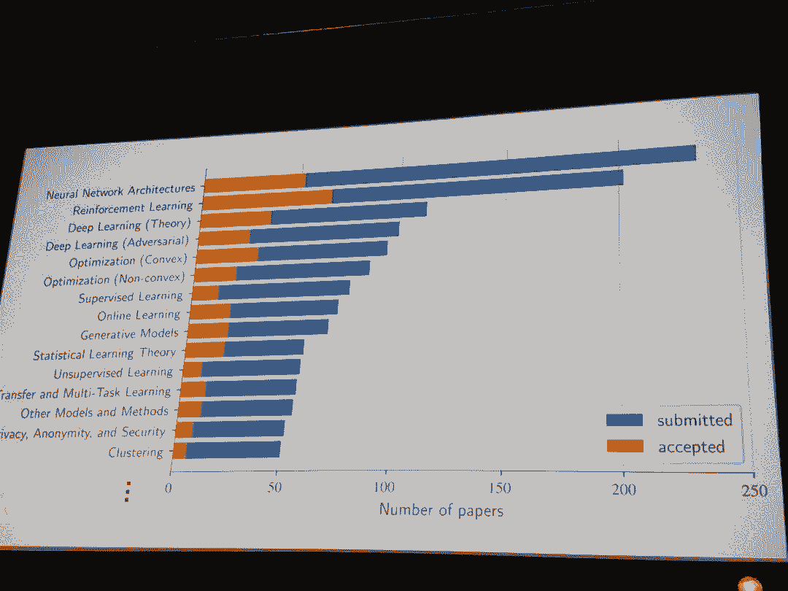
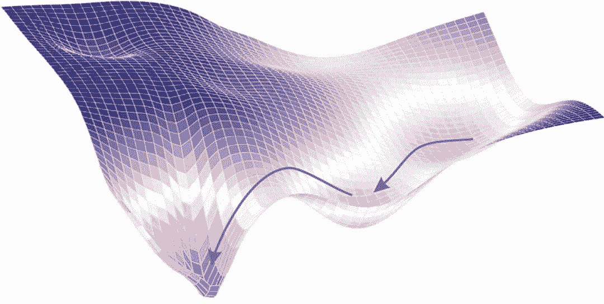
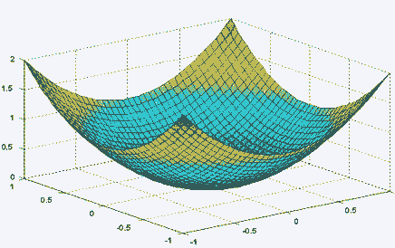
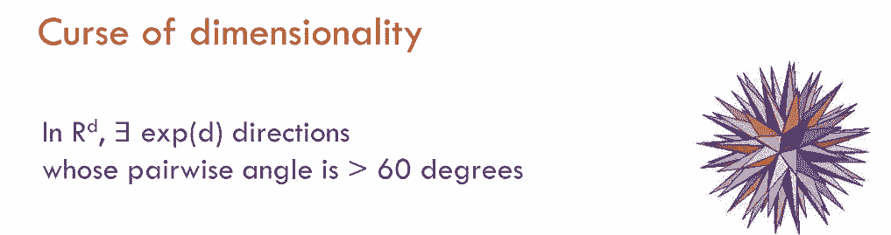
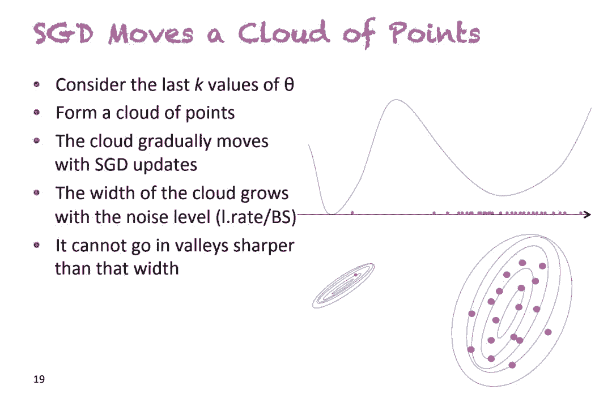
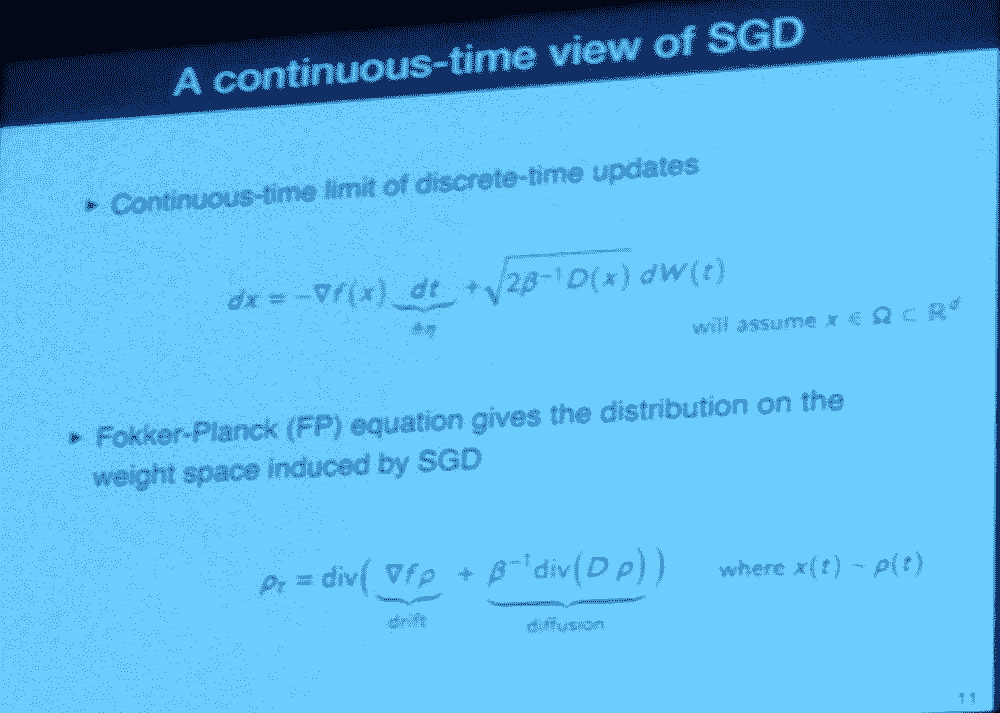
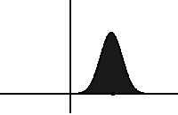
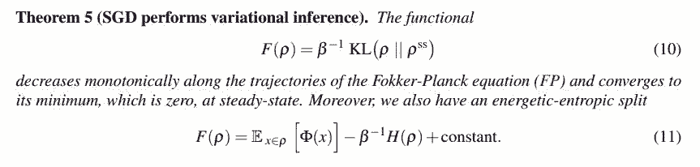
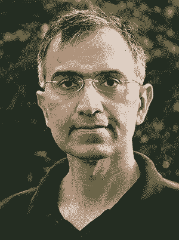

# 观点 | 如何优雅地从四个方面加深对深度学习的理解

选自 towardsdatascience

**作****者：****Arthur Pesah**

**机器之心编译**

**参与：高璇、王淑婷**

> 在今年的 ICML 上，深度学习理论成为最大的主题之一。会议第一天，Sanjeev Arora 就展开了关于深度学习理论理解的教程，并从四个方面分析了关于该领域的研究：非凸优化、超参数和泛化、深度的意义以及生成模型。

2017 年 12 月 NIPS 的 Test-of-Time Award 颁奖典礼上，Ali Rahimi 这样呼吁人们加深对深度学习的理解：

> 我希望生活在这样的一个世界，它的系统是建立在严谨可靠而且可证实的知识之上，而非炼金术。[……] 简单的实验和定理是帮助理解复杂大现象的基石。

Ali 的目标不是解散各个领域，而是「展开对话」。这个目标已经实现了，但对于目前的深度学习应被视为炼金术还是工程或科学，人们仍存在分歧。

7 个月后，在斯德哥尔摩举行的国际机器学习会议 (ICML) 上，机器学习社区又聚焦了这个问题。此次大会与会者有 5000 多名，并累计发表论文 629 篇，这是基础机器学习研究的「年度大戏」。而**深度学习理论**已成为此次会议的最大主题之一。

会议第一天，最大的房间里就挤满了机器学习相关人员，他们准备聆听 Sanjeev Arora 关于深度学习理论理解的教程。这位普林斯顿大学计算机科学教授在演讲中总结了目前的深度学习理论研究领域，并将其分成四类：

*   非凸优化：如何理解与深度神经网络相关的高度非凸损失函数？为什么随机梯度下降法会收敛？

*   超参数和泛化：在经典统计理论中，为什么泛化依赖于参数的数量而非深度学习？存在其它较好的泛化方法吗？

*   深度的意义：深度如何帮助神经网络收敛？深度和泛化之间的联系是什么？

*   生成模型：为什么生成对抗网络（GAN）效果非常好？有什么理论特性能使模型稳定或者避免模式崩溃？

在这一系列的文章中，我们将根据最新的论文（尤其是 ICML2018 的论文），帮助大家直观理解这四个方面。

第一篇文章将重点讨论深度网络的非凸优化问题。

**非凸优化**

> 我敢打赌，你们很多人都曾尝试过训练自己的「深度网络」，结果却因为无法让它发挥作用而陷入自我怀疑。这不是你的错。我认为都是梯度下降的错。

Ali Rahimi 在 NIPS 演讲中曾说，随机梯度下降 (SGD) 的确是深度学习的基石，它应该解决高度非凸优化问题。理解它何时起作用，以及为什么起作用，是我们在深度学习的基本理论中一定会提出的最基本问题之一。具体来说，对于深度神经网络的非凸优化研究可以分为两个问题：

*   损失函数是什么样的？

*   SGD 为什么收敛？

**损失函数是什么样的？**

如果让你想象一个全局最小值，很可能你脑海中出现的第一幅图是这样的：

二维世界中的全局最小值附近，函数是严格凸的（这意味着 hessian 矩阵的两个特征值都是正数）。但在一个有着数十亿参数的世界里，就像在深度学习中，全局最小值附近的方向都不平坦的可能性有多大？或者 hessian 中一个为零（或近似为零）的特征值都没有的概率有多大？

Sanjeev Arora 在教程中写的第一个评论是：损失函数的可能方向数量会随着维度的增长呈指数增长。

直观上看，全局最小值似乎不是一个点而是一个连接管（connected manifold）。这意味着如果找到了全局最小值，你就能够穿过一条平坦的路径，在这条道路上，所有的点都是最小值。海德堡大学的一个研究团队在论文《Essentially No Barriers in Neural Network Energy Landscape》中证明了这一点。他们提出了一个更常规的说法，即任何两个全局最小值都可以通过一条平坦的路径连接。

在 MNIST 上的 CNN 或在 PTB 上的 RNN 已经是这样的情况，但是该项研究将这种认知扩展到了在更高级的数据集（CIFAR10 和 CIFAR100）上训练的更大网络（一些 DenseNet 和 ResNet）上。为了找到这条路径，他们使用了一种来自分子统计力学的启发式方法，叫做 AutoNEB。其思想是在两个极小值之间创建一个初始路径（例如线性），并在该路径上设置中心点。然后迭代地调整中心点的位置，以最小化每个中心点的损失，并确保中心点之间的距离保持不变（通过用弹簧建模中心点之间的空间）。

虽然他们没有从理论上证明这个结果，但他们对为什么存在这样的路径给出了一些直观的解释：

> 如果我们扰乱单个参数，比如添加一个小常数，然后让其它部分去自适应这种变化，仍然可以使损失最小化。因此可以认为，通过微调，无数其它参数可以「弥补」强加在一个参数上的改变。

因此，本文的结果可以帮助我们通过超参数化和高维空间，以不同的方式看待极小值。

通俗来说，当考虑神经网络的损失函数时，你应该牢记一个给定的点周围可能有非常多的方向。由此得出另一个结论，鞍点肯定比局部最小值多得多：在给定的关键点上，在数十亿个可能的方向中，很可能会找到一个向下的方向（如果不是在全局最小值上）。这种认知在 NIPS 2014 年发表的论文《Identifying and attacking the saddle point problem in high-dimensional non-convex optimization》中被严格规范化，并得到了实证证明。

**为什么 SGD 收敛（或不收敛）？**

深度神经网络优化的第二个重要问题与 SGD 的收敛性有关。虽然这种算法长期以来被看做是一种快速的近似版梯度下降，但我们现在可以证明 SGD 实际上收敛于更好、更一般的最小值。但我们能否将其规范化并定量地解释 SGD 脱离局部极小值或鞍点的能力？

**SGD 修改了损失函数**

论文《An Alternative View: When Does SGD Escape Local Minima?》表明，实施 SGD 相当于在卷积（所以平滑）的损失函数上进行常规梯度下降。根据这一观点并在某些假设下，他们证明了 SGD 将设法脱离局部最小值，并收敛到全局最小值附近的一个小区域。

**SGD 由随机微分方程控制**

连续 SGD 彻底改变了我对这个算法的看法。在 ICML 2018 关于非凸优化的研讨会上，Yoshua Bengio 在他关于随机梯度下降、平滑和泛化的演讲中提出了这个想法。SGD 不是在损失函数上移动一个点，而是一片点云或者说一个分布。

*幻灯片摘自 Y. Bengio 在 ICML 2018 发表的演讲。他提出用分布（或点云）代替点来看待 SGD。*

这个点云的大小（即相关分布的方差）与 learning_rate / batch_size 因子成正比。Pratik Chaudhari 和 Stefano Soatto 在论文《Stochastic gradient descent performs variational inference, converges to limit cycles for deep networks》中证明了这一点。这个公式非常直观：较低的 batch size 意味着梯度非常混乱（因为要在数据集一个非常小的子集上计算），高学习率意味着步骤混乱。

将 SGD 视为随时间变化的分布可以得出：控制下降的方程现在是随机偏微分方程。更准确地说，在某些假设下，论文表明控制方程实际上是一个 Fokker-Planck 方程。

*幻灯片摘自 P. Chaudhari 和 S. Soatto 在 ICML 2018 发表的演讲——《High-dimensional Geometry and Dynamics of Stochastic Gradient Descent for Deep Networks》。他们展示了如何从离散系统过渡到 Fokker-Plank 方程所描述的连续系统。*

在统计物理学中，这种类型的方程描述了暴露在曳力 (使分布推移，即改变平均值) 和随机力 (使分布扩散，即增加方差) 下的粒子的演化。在 SGD 中，曳力由真实梯度建模，而随机力则对应算法的内在噪声。正如上面的幻灯片所示，扩散项与温度项 T = 1 /β= learning_rate /(2 * batch_size) 成正比，这再次显示了该比值的重要性！

*Fokker-Planck 方程下分布的演化。它向左漂移，随时间扩散。图源：维基百科*

通过这个框架，Chaudhari 和 Soatto 证明了我们的分布将单调地收敛于某个稳定的分布（从 KL 散度的意义来说）：

Pratik Chaudhari 和 Stefano Soatto 论文的一个主要定理，证明了分布的单调会收敛到稳定状态（在 KL 散度意义中）。第二个方程表明，使 F 最小化相当于最小化某个潜在的ϕ以及扩大熵的分布（温度 1 /β控制的权衡）。

在上面的定理中有几个有趣的观点：

*   SGD 最小化的函数可以写成两项之和（Eq. 11）：潜在Φ和熵的分布。温度 1 /β控制这两项的权衡。

*   潜在Φ只取决于数据和网络的架构（而非优化过程）。如果它等于损失函数，SGD 将收敛到全局最小值。然而, 本文表明这种情况比较少见。而如果知道Φ与损失函数的距离，你将可以知道 SGD 收敛的概率。

*   最终分布的熵取决于 learning_rate/batch_size（温度）的比例。直观上看，熵与分布的大小有关，而高温会导致分布具有更大的方差，这意味着一个平坦的极小值。平坦极小值的泛化能力更好，这与高学习率和低 batch size 能得到更优最小值的经验是一致的。

因此，将 SGD 看作是一个随时间变化的分布表明，在收敛性和泛化方面，learning_rate/batch_size 比每个独立的超参数更有意义。此外，它还引入了与收敛相关的网络潜力，为架构搜索提供了一个很好的度量。

**结论**

探索深度学习理论的过程可以分为两部分：首先，通过简单的模型和实验，建立起关于深度学习理论如何及其为什么起作用的认知，然后将这些理念以数学形式呈现，以帮助我们解释当前的结论并得到新的结果。

在第一篇文章中，我们试图传达更多关于神经网络高维损失函数和 SGD 解说的直观认知，同时表明新的形式主义正在建立，目的是建立一个关于深层神经网络优化的真正数学理论。

然而，虽然非凸优化是深度学习的基石并且拥有大量的层数和参数，但它取得的成功大部分源于其优秀的泛化能力。这将是下一篇文章将分享的内容。

Sanjeev Arora：印度裔美国理论计算机科学家，他以研究概率可检验证明，尤其是 PCP 定理而闻名。研究兴趣包括计算复杂度理论、计算随机性、概率可检验证明等。他于 2018 年 2 月被推选为美国国家科学院院士，目前是普林斯顿大学计算机科学系教授。

原文链接：https://towardsdatascience.com/recent-advances-for-a-better-understanding-of-deep-learning-part-i-5ce34d1cc914

****本文为机器之心编译，**转载请联系本公众号获得授权****。**

✄------------------------------------------------

**加入机器之心（全职记者 / 实习生）：hr@jiqizhixin.com**

**投稿或寻求报道：**content**@jiqizhixin.com**

**广告 & 商务合作：bd@jiqizhixin.com**