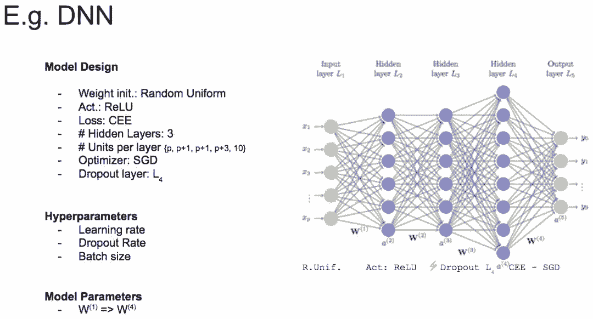

# 超参数搜索不够高效？这几大策略了解一下

选自 floydhub

**作者：Alessio Gozzoli**

**机器之心编译**

**参与：朱乾树、张倩**

> 整天 babysitting 深度学习模型是不是很心累？这篇文章或许能帮到你。本文讨论了高效搜索深度学习模型最佳超参数集的动机和策略。作者在 FloydHub 上演示了如何完成这项工作以及研究的导向。读完这篇文章后，你的数据科学工具库将添加一些强大的新工具，帮助你为自己的深度学习模型自动找到最佳配置。

与机器学习模型不同，深度学习模型实际上充满了超参数。

当然，并非所有变量对模型的学习过程都一样重要，但是，鉴于这种额外的复杂性，在这样一个高维空间中找到这些变量的最佳配置显然是一个不小的挑战。

幸运的是，我们有不同的策略和工具来解决搜索问题。开始深入！

**我们的目的**

**怎么做？**

我们希望找到最佳的超参数配置，帮助我们在验证/测试集的关键度量上得到最佳分数。

**为何？**

在计算力、金钱和时间资源有限的情况下，每个科学家和研究员都希望获得最佳模型。但是我们缺少有效的超参数搜索来实现这一目标。

**何时？**

*   研究员和深度学习爱好者在最后的开发阶段尝试其中一种搜索策略很常见。这有助于从经过几个小时的训练获得的最佳模型中获得可能的提升。

*   超参数搜索作为半/全自动深度学习网络中的阶段或组件也很常见。显然，这在公司的数据科学团队中更为常见。

等等，究竟何谓超参数？

我们从最简单的定义开始，

> 超参数是你在构建机器/深度学习模型时可以调整的「旋钮」。


*将超参数比作「旋钮」或「拨号盘」*

或者：

> 超参数是在开始训练之前手动设置的具有预定值的训练变量。

我们可能会同意学习率和 Dropout 率是超参数，但模型设计变量呢？模型设计变量包括嵌入，层数，激活函数等。我们应该将这些变量视为超参数吗？


*模型设计变量+超参数→模型参数*

简单起见，我们也可以将模型设计组件视为超参数集的一部分。

最后，从训练过程中获得的参数（即从数据中学习的变量）算超参数吗？这些权重称为模型参数。我们不将它们算作超参数。

好的，让我们看一个真实的例子。请看下面的图片，仅以此图说明深度学习模型中变量的不同分类。



*变量类别示例图*

**下一个问题：搜索代价高昂**

我们已经知道，我们的目标是搜索超参数的最佳配置，但超参数搜索本质上是一个受计算能力、金钱和时间约束的迭代过程。


*超参数搜索周期*

一切都以猜测一个不错的配置开始（步骤 1），然后我们需要等到训练完毕（步骤 2）以获得对相关度量标准的实际评估（步骤 3）。我们将跟踪搜索过程的进度（步骤 4），然后根据我们的搜索策略选择一个新的猜测参数（步骤 1）。

我们一直这样做，直到达到终止条件（例如用完时间或金钱）。

我们有四种主要的策略可用于搜索最佳配置。

*   照看（babysitting，又叫试错）

*   网格搜索

*   随机搜索

*   贝叶斯优化

**照看**

照看法被称为试错法或在学术领域称为研究生下降法。这种方法 100％ 手动，是研究员、学生和业余爱好者最广泛采用的方法。

该端到端的工作流程非常简单：学生设计一个新实验，遵循学习过程的所有步骤（从数据收集到特征图可视化），然后她按顺序迭代超参数，直到她耗尽时间（通常是到截止日期）或动机。


*照看（babysitting）*

如果你已经注册了 deeplearning.ai 课程，那么你一定熟悉这种方法 - 这是由 Andrew Ng 教授提出的熊猫工作流程。

这种方法非常有教育意义，但它不能在时间宝贵的数据科学家的团队或公司内部施展。

因此，我们遇到这个问题：

> 有更好的方式来增值我的时间吗？

肯定有！我们可以定义一个自动化的超参数搜索程序来节约你的时间。

**网格搜索**

取自命令式指令「Just try everything！」的网格搜索——一种简单尝试每种可能配置的朴素方法。

工作流如下：

*   定义一个 n 维的网格，其中每格都有一个超参数映射。例如 n = (learning_rate, dropout_rate, batch_size)

*   对于每个维度，定义可能的取值范围：例如 batch_size = [4,8,16,32,64,128,256 ]

*   搜索所有可能的配置并等待结果去建立最佳配置：例如 C1 = (0.1, 0.3, 4) -> acc = 92%, C2 = (0.1, 0.35, 4) -> acc = 92.3% 等...

下图展示了包含 Dropout 和学习率的二维简单网格搜索。

**

*两变量并发执行的网格搜索*

这种平行策略令人尴尬，因为它忽略了计算历史（我们很快就会对此进行扩展）。但它的本意是，你拥有的计算资源越多，你可以同时尝试的猜测就越多！

这种方法的真正痛点称为 curse of dimensionality（维数灾难）。这意味着我们添加的维数越多，搜索在时间复杂度上会增加得越多（通常是指数级增长），最终使这个策略变得不可行！

当超参数维度小于或等于 4 时，通常使用这种方法。但实际上，即使它保证在最后找到最佳配置，它仍然不是首选方案。相反，最好使用随机搜索——我们将在下面讨论。

现在试试网格搜索！

单击以下链接可在 FloydHub 上打开 Workspace：https://www.floydhub.com/signup?source=run。你可以使用工作区在完全配置的云服务器上运行以下代码（使用 Scikit-learn 和 Keras 进行网格搜索）。

```py
# Load the dataset
x, y = load_dataset()

# Create model for KerasClassifier
def create_model(hparams1=dvalue,
                 hparams2=dvalue,
                 ...
                 hparamsn=dvalue):
    # Model definition
    ...

model = KerasClassifier(build_fn=create_model) 

# Define the range
hparams1 = [2, 4, ...]
hparams2 = ['elu', 'relu', ...]
...
hparamsn = [1, 2, 3, 4, ...]

# Prepare the Grid
param_grid = dict(hparams1=hparams1, 
                  hparams2=hparams2, 
                  ...
                  hparamsn=hparamsn)

# GridSearch in action
grid = GridSearchCV(estimator=model, 
                    param_grid=param_grid, 
                    n_jobs=, 
                    cv=,
                    verbose=)
grid_result = grid.fit(x, y)

# Show the results
print("Best: %f using %s" % (grid_result.best_score_, grid_result.best_params_))
means = grid_result.cv_results_['mean_test_score']
stds = grid_result.cv_results_['std_test_score']
params = grid_result.cv_results_['params']
for mean, stdev, param in zip(means, stds, params):
    print("%f (%f) with: %r" % (mean, stdev, param)) 
```

**随机搜索**

几年前，Bergstra 和 Bengio 发表了一篇惊人的论文 (http://www.jmlr.org/papers/volume13/bergstra12a/bergstra12a.pdf)，证明了网格搜索的低效率。

网格搜索和随机搜索之间唯一真正的区别在于策略周期的第 1 步 - 随机搜索从配置空间中随机选取点。

让我们使用下面的图片（论文中提供）来展示研究员的证明。


*网格搜索 vs 随机搜索*

图像通过在两个超参数空间上搜索最佳配置来比较两种方法。它还假设一个参数比另一个参数更重要。这是一个安全的假设，因为开头提到的深度学习模型确实充满了超参数，并且研究员/科学家/学生一般都知道哪些超参数对训练影响最大。

在网格搜索中，很容易注意到，即使我们已经训练了 9 个模型，但我们每个变量只使用了 3 个值！然而，使用随机布局，我们不太可能多次选择相同的变量。结果是，通过第二种方法，我们将为每个变量使用 9 个不同的值训练 9 个模型。

从每个图像布局顶部的曲线图可以看出，我们使用随机搜索可以更广泛地探索超参数空间（特别是对于更重要的变量）。这将有助于我们在更少的迭代中找到最佳配置。

总结：如果搜索空间包含 3 到 4 个以上的维度，请不要使用网格搜索。相反，使用随机搜索，它为每个搜索任务提供了非常好的基准。


*网格搜索和随机搜索的优缺点*

现在试试随机搜索！

单击以下链接可在 FloydHub 上打开 Workspace：https://www.floydhub.com/signup?source=run。你可以使用工作区在完全配置的云服务器上运行以下代码（使用 Scikit-learn 和 Keras 进行随机搜索）。

```py
# Load the dataset
X, Y = load_dataset()

# Create model for KerasClassifier
def create_model(hparams1=dvalue,
                 hparams2=dvalue,
                 ...
                 hparamsn=dvalue):
    # Model definition
    ...

model = KerasClassifier(build_fn=create_model) 

# Specify parameters and distributions to sample from
hparams1 = randint(1, 100)
hparams2 = ['elu', 'relu', ...]
...
hparamsn = uniform(0, 1)

# Prepare the Dict for the Search
param_dist = dict(hparams1=hparams1, 
                  hparams2=hparams2, 
                  ...
                  hparamsn=hparamsn)

# Search in action!
n_iter_search = 16 # Number of parameter settings that are sampled.
random_search = RandomizedSearchCV(estimator=model, 
                                   param_distributions=param_dist,
                                   n_iter=n_iter_search,
                                   n_jobs=, 
                                   cv=, 
                                   verbose=)
random_search.fit(X, Y)

# Show the results
print("Best: %f using %s" % (random_search.best_score_, random_search.best_params_))
means = random_search.cv_results_['mean_test_score']
stds = random_search.cv_results_['std_test_score']
params = random_search.cv_results_['params']
for mean, stdev, param in zip(means, stds, params):
    print("%f (%f) with: %r" % (mean, stdev, param)) 
```

**后退一步，前进两步**

另外，当你需要为每个维度设置空间时，每个变量使用正确的比例非常重要。


*常用的批大小和学习率的比例空间*

例如，通常使用 2 的幂作为批大小的值，并在对数尺度上对学习率进行采样。


*放大！*

从上面的布局之一开始进行一定数量的迭代也很常见，然后通过在每个变量范围内更密集地采样并放大到有希望的子空间，然后甚至用相同或不同的搜索策略开始新的搜索。

**还有一个问题：独立猜测！**

不幸的是，网格和随机搜索都有共同的缺点：

> 每一次新猜测都独立于之前的训练！

这听起来可能有些奇怪、令人意外，尽管需要大量时间，但令照看法起效的是科学家有效推动搜索和实验的能力，他们通过使用过去的实验结果作为资源来改进下一次训练。

等一下，这些好像在哪儿听过...... 尝试将超参数搜索问题建模为机器学习任务会怎么样？！

请允许我介绍下贝叶斯优化。

**贝叶斯优化**

此搜索策略构建一个代理模型，该模型试图从超参数配置中预测我们关注的指标。

在每次新的迭代中，代理人将越来越自信哪些新的猜测可以带来改进。就像其他搜索策略一样，它也有相同的终止条件。


*贝叶斯优化工作流*

如果听起来有点困惑，请不要担心——是时候参考另一个图例了。

**高斯过程在起作用**

我们可以将高斯过程定义为代理，它将学习从超参数配置到相关度量的映射。它不仅会将预测转化为一个值，还会为我们提供不确定性的范围（均值和方差）。

我们来深入研究这个伟大教程 (https://www.iro.umontreal.ca/~bengioy/cifar/NCAP2014-summerschool/slides/Ryan_adams_140814_bayesopt_ncap.pdf) 提供的示例。


*有 2 个点的高斯过程的优化过程*

在上图中，我们遵循单变量（在水平轴上）的高斯过程优化的第一步。在我们想象的例子中，这可以代表学习率或 dropout 率。

在垂直轴上，我们绘制了相关度量作为单个超参数的函数。因为我们正在寻找尽可能低的值，所以可以将其视为损失函数。

黑点代表训练到当前阶段的模型。红线是 ground truth，换句话说，就是我们正在努力学习的函数。黑线表示我们对 ground truth 函数的实际假设的平均值，灰色区域表示空间中的相关不确定性或方差。

我们可以注意到，点周围的不确定性有所减少，因为我们对这些点的结果非常有信心（因为我们已经在这里训练了模型）。同时，在我们拥有较少信息的领域，不确定性会增加。

现在我们已经定义了起点，准备好选择下一个有希望的变量来训练一个模型。为此，我们需要定义一个采集函数，它将告诉我们在哪里采样下一个参数。

在此示例中，我们使用了 Expected Improvement：这个函数旨在在我们使用不确定性区域中的建议配置时找到尽可能低的值。上面的 Expected Improvement 图表中的蓝点即为下一次训练选择的点。


*3 点高斯过程*

我们训练的模型越多，代理人对下一个有希望采样的点就越有信心。以下是模型经过 8 次训练后的图表：


*8 点高斯过程*

高斯过程属于基于序列模型的优化（SMBO）类别的算法。正如我们刚看到的，这些算法为开始搜索最佳超参数配置提供了非常好的基准。但是，跟所有工具一样，它们也有缺点：

*   根据定义，该过程是有顺序的

*   它只能处理数值参数

*   即使训练表现不佳，它也不提供任何停止训练的机制

请注意，我们只是简单地谈到了这个话题，如果你对细节部分以及如何扩展 SMBO 感兴趣，那么请看一下这篇论文 (https://www.cs.ubc.ca/~hutter/papers/10-TR-SMAC.pdf)。

**现在试试贝叶斯优化！**

单击以下链接可在 FloydHub 上打开 Workspace：https://www.floydhub.com/signup?source=run。你可以使用工作区在完全配置的云服务器上运行以下代码（使用 Hyperas 进行贝叶斯优化（SMBO-TPE））。

```py
def data():
    """
    Data providing function:
    This function is separated from model() so that hyperopt
    won't reload data for each evaluation run.
    """
    # Load / Cleaning / Preprocessing
    ...
    return x_train, y_train, x_test, y_test

def model(x_train, y_train, x_test, y_test):
    """
    Model providing function:
    Create Keras model with double curly brackets dropped-in as needed.
    Return value has to be a valid python dictionary with two customary keys:
        - loss: Specify a numeric evaluation metric to be minimized
        - status: Just use STATUS_OK and see hyperopt documentation if not feasible
    The last one is optional, though recommended, namely:
        - model: specify the model just created so that we can later use it again.
    """
    # Model definition / hyperparameters space definition / fit / eval
    return {'loss': <metrics_to_minimize>, 'status': STATUS_OK, 'model': model}

# SMBO - TPE in action
best_run, best_model = optim.minimize(model=model,
                                      data=data,
                                      algo=tpe.suggest,
                                      max_evals=,
                                      trials=Trials())

# Show the results
x_train, y_train, x_test, y_test = data()
print("Evalutation of best performing model:")
print(best_model.evaluate(x_test, y_test))
print("Best performing model chosen hyper-parameters:")
print(best_run) 
```

**搜索策略对比**

现在让我们来总结一下到目前为止所涵盖的策略，以了解每个策略的优缺点。


*总结*

如果你或你的团队有足够的资源，贝叶斯 SMBO 可能是首选，但是你也应该考虑建立一个随机搜索的基准。

另一方面，如果你还在训练或处于设计阶段，即使在空间探索方面不切实际，照看法也是可以一试的。

正如我在上一节中提到的，如果一个训练表现不佳，我们必须等到计算结束，因为这些策略都不能提供节省资源的机制。

因此，我们得出了最后一个问题：

> 我们能优化训练时间吗？

我们来试试看。

**提前终止的力量**

提前终止不仅是一项著名的正则化技术，而且在训练错误时，它还是一种能够防止资源浪费的机制。

下面是最常用的终止训练标准的图表：


*终止标准*

前三个标准显而易见，所以我们把注意力集中在最后一个标准上。

通常情况下，研究人员会根据实验类别来限定训练时间。这样可以优化团队内部的资源。通过这种方式，我们能够将更多资源分配给最有希望的实验。

floyd-cli（我们的用户用来与 FloydHub 通信的软件，已经在 Github 上开源）为此提供了一个标准：我们的高级用户正在大规模使用它来调节他们的实验。

这些标准可以在照看学习过程时手动应用，或者你可以通过常见框架中提供的钩子/回调在实验中集成这些规则来做得更好：

*   Keras 提供了一个很好的提前终止功能，甚至还有一套回调组件。由于 Keras 最近已经整合到 Tensorflow 中，你也可以使用 Tensorflow 代码中的回调组件。

*   Tensorflow 提供了训练钩子，这些钩子可能不像 Keras 回调那样直观，但是它们能让你对执行状态有更多的控制。

*   Pytorch 还没有提供钩子或回调组件，但是你可以在论坛上查看 TorchSample 仓库。我不太清楚 Pytorch 1.0 的功能列表（该团队可能会在 PyTorch 开发者大会上发布一些内容），这个功能可能会随新版本一起发布。

*   Fast.ai 库也提供回调组件，即使它目前没有提供任何形式的文档（WIP），你也可以去找一个不错的教程。幸运的是，他们有一个很棒的社区。

*   Ignite（Pytorch 的高级库）提供类似于 Keras 的回调，虽然还在开发阶段，但它看起来确实是一个不错的选择。

名单就这么多了，我的讨论只涉及最常用/最流行的框架。-（我希望不会损害其他框架作者的玻璃心。如果是这样，你可以将你的意见转发给我，我会很乐意更新列表！）

还没有结束。

机器学习有一个子领域叫做「AutoML」（Automatic Machine Learning，自动机器学习），目的是实现模型选择、特征提取和/或超参数优化的自动化。

这就引出了最后一个问题（我保证是最后一个！）：

> 我们能了解整个过程吗？

你可以认为，AutoML 是一个解决了另一个机器学习任务的机器学习任务，类似于我们利用贝叶斯优化完成的任务，本质上是元机器学习。

**研究：AutoML 和 PBT**

你很可能听说过谷歌的 AutoML，这是他们对神经架构搜索的品牌重塑。请记住，在本文开头，我们决定将模型设计组件合并到超参数变量中。那么，神经架构搜索是 AutoML 的子领域，旨在为给定任务找到最佳模型。关于这个主题的全面讨论需要一系列文章。幸运的是，来自 fast.ai 的 Rachel Thomas 博士做了一项了不起的工作，我们很乐意提供链接：http://www.fast.ai/2018/07/12/auto-ml-1/。

我想和大家分享另一个来自 DeepMind 的有趣的研究成果，他们使用进化策略算法的一种变体来执行超参数搜索，称为基于群体的训练（Population Based Training，PBT）。PBT 也是 DeepMind 的另一项研究（《Capture the Flag: the emergence of complex cooperative agents》）的基础，新闻报道并不完全，我强烈建议你去看看。引自 DeepMind：

> 就像随机搜索一样，PBT 首先需要以随机挑选超参数的方式训练许多并行的神经网络。但是这些网络并不是独立训练的，而是使用其它网络的训练信息来修正这些超参数，并将计算资源分配到那些有希望的模型上。这种方法的灵感来自于遗传算法：其中一个群体中的每个个体（被称为 worker）可以利用除自身外其余个体的信息。例如，一个个体可能会从表现较好的个体那里复制模型参数，它还能通过随机改变当前的值来探索新的超参数集。

当然，这一领域可能还有许多其他有趣的研究。在这里，我只是和大家分享了最近得到媒体关注的一些研究。

**在 FloydHub 上管理你的实验**

FloydHub 最大的特点之一是能够在训练时比较使用不同的超参数集的不同模型。

下图展示了 FloydHub 项目中的作业列表。你可以看到此用户正在使用作业的消息字段（例如，floyd run --message "SGD, lr=1e-3, l1_drop=0.3" ...）以突出显示在每个作业上使用的超参数。

此外，你还可以查看每项作业的训练指标。这些提供了快速浏览，帮助你了解哪些作业表现最佳，以及使用的机器类型和总训练时间。


*项目主页*

FloydHub 仪表板为你提供了一种简单的方法来比较你在超参数搜索中做的所有训练——并且实时更新。

我们建议你为每个必须解决的任务/问题创建一个不同的 FloydHub 项目。通过这种方式，你可以更轻松地组织工作并与团队协作。

**训练指标**

如上所述，你可以轻松地在 FloydHub 上为你的作业发布训练指标。当你在 FloydHub 仪表板上查看作业时，你将找到你定义的每个指标的实时图表。

此功能无意替代 Tensorboard（我们也提供此功能），而是旨在突出显示你已选择的超参数配置的训练走势。

例如，如果你正在监督训练过程，那么训练指标肯定会帮助你确定和应用停止标准。


*训练指标*

*原文链接：https://blog.floydhub.com/guide-to-hyperparameters-search-for-deep-learning-models/*

****本文为机器之心编译，**转载请联系本公众号获得授权****。**

✄------------------------------------------------

**加入机器之心（全职记者 / 实习生）：hr@jiqizhixin.com**

**投稿或寻求报道：**content**@jiqizhixin.com**

**广告 & 商务合作：bd@jiqizhixin.com**