# 教程 | 如何使用 Kubernetes 轻松部署深度学习模型

选自 Medium

**作者：****Gus Cavanaugh**

**机器之心编译**

**参与：****Geek AI、路**

> 本文介绍了如何使用 Python、Keras、Flask 和 Docker 在 Kubernetes 上部署深度学习模型。


**这简直太容易了，连你的老板都能做到！**

本文展示了如何用 Keras 构建深度学习模型的简单示例，将其作为一个用 Flask 实现的 REST API，并使用 Docker 和 Kubernetes 进行部署。本文给出的并不是一个鲁棒性很好的能够用于生产的示例，它只是为那些听说过 Kubernetes 但没有动手尝试过的人编写的快速上手指南。

为此，我在这个过程的每个步骤中都使用了 Google Cloud。这样做的原因很简单——我并不想在我的 Windows 10 家用笔记本上安装 Docker 和 Kubernetes。而谷歌云能很好地支持这二者的工作。此外，你可以准确地按照我接下来所使用的规范流程进行操作，这可以帮助你更容易地复现我的步骤。而且，你也不用担心实践这篇文章的成本。谷歌为新账户提供了几百美金的免费额度，而实现本文示例所需的费用只不过是九牛一毛。

**为什么要将 Kubernetes 用于机器学习和数据科学？**

Kubernetes 及其从属的流行概念「云原生」（cloud-native）正席卷全球。别担心——你有所怀疑是对的。我们都见证过铺天盖地的「人工智能」、「大数据」、「云计算」等术语的技术泡沫。Kubernetes 是否也会发生相同的情况，还有待观察。

但是，如今许多对数据科学一知半解的人会误导我们，所以我对转而使用 Kubernetes 的原因并不感兴趣也不理解。我的动机很简单，我希望部署、扩展、管理一个能够提供预测能力的 REST API。在下文中，你会看到 Kubernetes 会使这一切非常容易。

让我们开始吧！

**大纲**

1\. 使用 Google Cloud 创建你的环境。

2\. 使用 Keras、Flask 和 Docker 提供深度学习模型接口。

3\. 使用 Kubernetes 部署上述模型。

4\. 享受你所掌握的新知识吧！

**步骤 1：使用 Google Cloud 创建你的环境**

我在谷歌计算引擎上使用一个小型虚拟机来构建、部署、docker 化深度学习模型。你并不一定非要这么做。我曾试过在我的 Windows 10 笔记本上安装最新版本的 Docker CE（Community Edition），但是失败了。因此我决定直接使用免费的 Google Cloud 额度，这比弄清如何安装 Docker 能更好地利用我的时间。你可以选择是否要这样做。

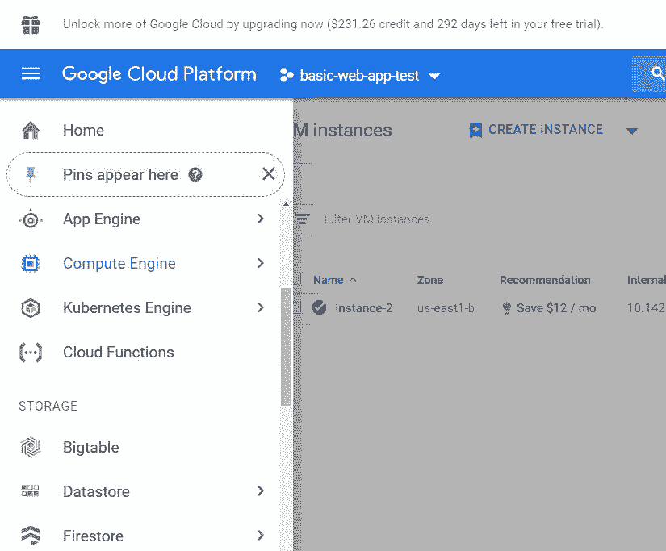

要想启动一台 Google Cloud 虚拟机，你可以打开屏幕左侧的工具栏。选择 Compute Engine。接着，选择「Create Instance」。如下图所示，我已经拥有了一个正在工作的虚拟机实例。

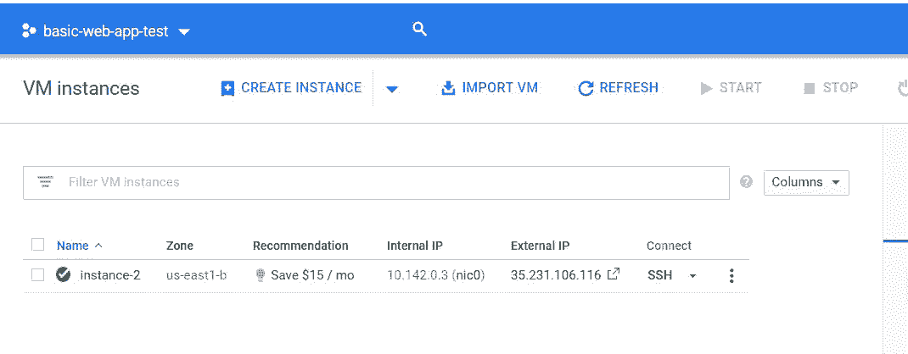

下一步，你需要选择你想要使用的计算规模。默认的（最便宜的）机器设置也可以很好地工作，但是考虑到我们最多只需要使用这个虚拟机大约 1 小时，我选择了内存为 15GB 的 4vCPU 配置。

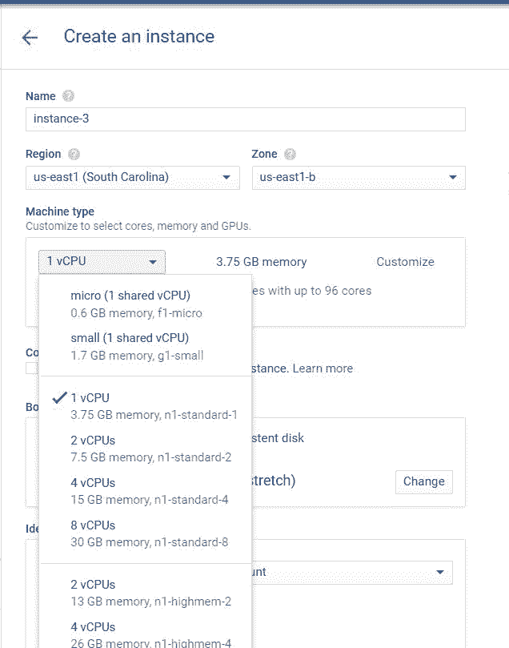

接下来，我将选择要使用的操作系统和磁盘空间。选择「Boot Disk」来编辑默认值。这里我选择了 Centos 7 作为操作系统，并将磁盘的大小从 10GB 增加到了 100GB。实际上，并不一定要像我一样选择 Centos 操作系统。但是，我建议将磁盘大小增加到 10GB 以上，因为我们创建的每个 Docker 容器的大小都大约为 1GB。

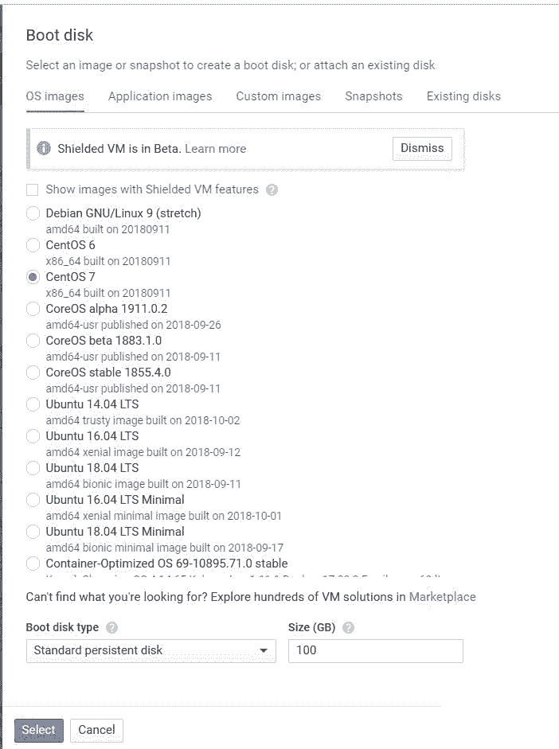

创建虚拟机的最后一步是设置防火墙允许使用 HTTP/S。诚然，我并不知道是否需要这个步骤。在部署 Kubernetes 之前，我将展示如何编辑防火墙设置以在虚拟机上测试我们的 API。因此，仅仅查看这些对话框是不够的，我们还有更多的工作要做。以前我并没有查看这些对话框，现在我重新试试按照这个教程去做。

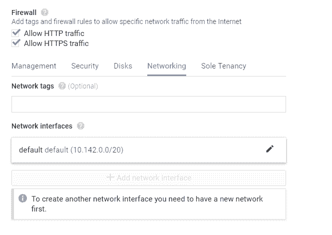

我并不确定是否需要此步骤。

现在单击「Creat」按钮。很好，困难的部分基本上已经完成了。

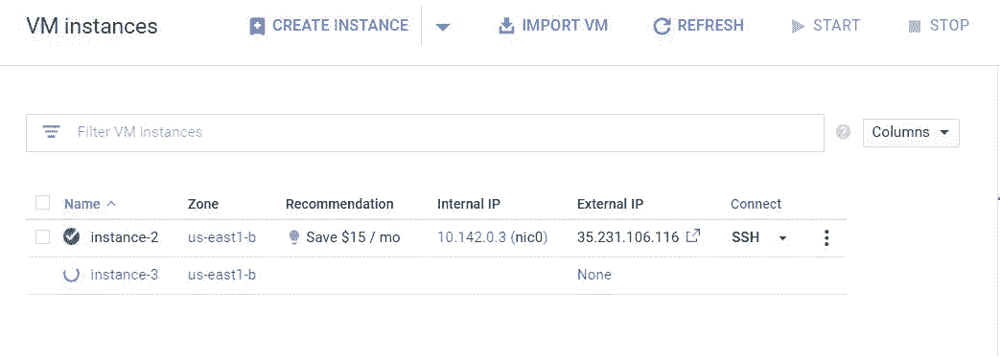

**步骤 2：使用 Keras 构建深度学习模型**

现在，让我们使用 SSH 连接到虚拟机，并开始构建模型。最简单的方法是单击下图所示的虚拟机旁边的 SSH 图标。这个操作会在你的浏览器中打开一个终端。

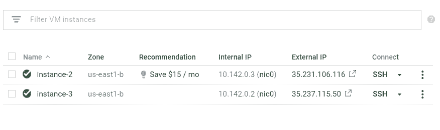

**1\. 卸载已有的 Docker 版本**

```py
sudo yum remove docker docker-client docker-client-latest docker-common docker-latest docker-latest-logrotate docker-logrotate docker-selinux docker-engine-selinux docker-engine 
```

请注意，如果你使用的操作系统不是 Centos 7，指令可能不同。

**2\. 安装最新版 Docker**

```py
sudo yum install -y yum-utils device-mapper-persistent-data lvm2
sudo yum-config-manager — add-repo https://download.docker.com/linux/centos/docker-ce.repo
sudo yum install docker-ce 
```

**3\. 启动 Docker 并运行测试脚本**

```py
sudo systemctl start docker
sudo docker run hello-world 
```

如果你看到下图所示的返回结果，你就完成了 Docker 的部署。

```py
Hello from Docker!
This message shows that your installation appears to be working correctly.To generate this message, Docker took the following steps: 1. The Docker client contacted the Docker daemon. 2. The Docker daemon pulled the "hello-world" image from the Docker Hub. (amd64) 3. The Docker daemon created a new container from that image which runs the executable that produces the output you are currently reading. 4. The Docker daemon streamed that output to the Docker client, which sent it to your terminal.
```

**4\. 创建我们的深度学习模型**

我们将复制一段 Adrian Rosebrock 写的脚本。Adrian 写了一篇很棒的教程，关于如何利用 Keras 构建深度学习模型并使用 Flask 部署它。教程参见：https://blog.keras.io/building-a-simple-keras-deep-learning-rest-api.html

我们需要对 Adrian 的脚本进行两处关键的修改，才能使其运行。如果你不关心 Docker 和 TensorFlow 的技术细节，请跳过下面两段。

我们要修改的第一个地方与 Docker 有关。在本地运行应用程序时，默认的 flask behavior 会在本地主机（127.0.0...）上提供应用程序服务。在 Docker 容器内运行时，这可能会产生一些问题。解决的方法很简单。当调用 app.run() 时，使用 app.run(host='0.0.0.0') 将 URL 设置为 0.0.0.0。这样，我们的应用就可以在本地主机和外部 IP 上同时使用了。

下一个问题涉及 TensorFlow。当我运行 Adrian 的原始脚本时，我无法成功调用模型。于是，我阅读了下面这个 Github issue（https://github.com/tensorflow/tensorflow/issues/14356），并对代码进行了修改。

```py
global graph
graph = tf.get_default_graph()
...
with graph.as_default():
 preds = model.predict(image)
```

说实话，我也不知道为什么这样做就行得通。但它确实做到了。所以就这样运行吧。

首先，创建一个名为 keras-app 的新文件夹，并将当前的路径移动到该文件夹中。

```py
mkdir keras-app
cd keras-app
```

现在我们创建一个名为 app.py 的文件。你可以自己选择要使用的编辑器。我在这里选用 vim，输入下面的指令创建并打开 app.py：

```py
vim app.py 
```

打开文件后，敲击键盘上的「i」键，进入插入模式。现在你可以把下面的代码粘贴进去：

```py
# USAGE
# Start the server:
# python app.py
# Submit a request via cURL:
# curl -X POST -F image=@dog-fs8.png 'http://localhost:5000/predict'

# import the necessary packages
from keras.applications import ResNet50
from keras.preprocessing.image import img_to_array
from keras.applications import imagenet_utils
from PIL import Image
import numpy as np
import flask
import io
import tensorflow as tf

# initialize our Flask application and the Keras model
app = flask.Flask(__name__)
model = None

def load_model():
 # load the pre-trained Keras model (here we are using a model
 # pre-trained on ImageNet and provided by Keras, but you can
 # substitute in your own networks just as easily)
 global model
 model = ResNet50(weights="imagenet")
 global graph
 graph = tf.get_default_graph()

def prepare_image(image, target):
 # if the image mode is not RGB, convert it
 if image.mode != "RGB":
 image = image.convert("RGB")

 # resize the input image and preprocess it
 image = image.resize(target)
 image = img_to_array(image)
 image = np.expand_dims(image, axis=0)
 image = imagenet_utils.preprocess_input(image)

 # return the processed image
 return image

@app.route("/predict", methods=["POST"])
def predict():
 # initialize the data dictionary that will be returned from the
 # view
 data = {"success": False}

 # ensure an image was properly uploaded to our endpoint
 if flask.request.method == "POST":
 if flask.request.files.get("image"):
 # read the image in PIL format
 image = flask.request.files["image"].read()
 image = Image.open(io.BytesIO(image))

 # preprocess the image and prepare it for classification
 image = prepare_image(image, target=(224, 224))

 # classify the input image and then initialize the list
 # of predictions to return to the client
 with graph.as_default():
 preds = model.predict(image)
 results = imagenet_utils.decode_predictions(preds)
 data["predictions"] = []

 # loop over the results and add them to the list of
 # returned predictions
 for (imagenetID, label, prob) in results[0]:
 r = {"label": label, "probability": float(prob)}
 data["predictions"].append(r)

 # indicate that the request was a success
 data["success"] = True

 # return the data dictionary as a JSON response
 return flask.jsonify(data)

# if this is the main thread of execution first load the model and
# then start the server
if __name__ == "__main__":
 print(("* Loading Keras model and Flask starting server..."
 "please wait until server has fully started"))
 load_model()
 app.run(host='0.0.0.0') 
```

当你复制以上代码后，敲击「Esc」键退出插入模式。

然后输入 :x，保存并关闭文件。

**5\. 创建一个 requirements.txt 文件**

现在回到正题。我们将在 Docker 容器中运行这段代码。为了做到这一点，我们首先要创建一个 requirements.txt 文件。这个文件将包含代码需要运行的程序包（如 keras、flask 等）。这样一来，无论我们将 Docker 容器装载在哪里，底层的服务器都能够安装代码所需的依赖。

```py
keras
tensorflow
flask
gevent
pillow
requests
```

**6\. 创建 Dockerfile**

很好！现在让我们创建 Dockerfile。这是 Docker 将要读取的文件，用它来构建和运行我们的项目。

```py
FROM python:3.6
WORKDIR /app
COPY requirements.txt /app
RUN pip install -r ./requirements.txt
COPY app.py /app
CMD ["python", "app.py"]~
```

现在，我们正引导 Docker 下载一个 Python 3 的基础镜像。然后，要求 Docker 使用 Python 程序包管理器 pip 安装 requirements.txt 文件中详细指定的包。

接着，我们让 Docker 通过 python app.py 指令运行我们的脚本。

**7\. 创建 Docker 容器**

目前一切进展顺利，现在让我们构建并测试我们的应用程序。

为了构建我们的 Docker 容器，我们需要运行如下指令：

```py
sudo docker build -t keras-app:latest . 
```

该指令将引导 Docker 为我们当前工作空间的文件夹 keras-app 中的代码构建一个容器。

这个指令需要一到两分钟才能运行完成。在此过程中，Docker 会下载一个 python 3.6 的镜像并且安装 requirements.txt 中列出的包。

**8\. 运行 Docker 容器**

现在，让我们运行 Docker 容器来测试我们的应用程序。

```py
sudo docker run -d -p 5000:5000 keras-app 
```

注：通过上面的指令中的数字 5000:5000，我们告诉 Docker 让端口 5000 处于外部可用状态，并把我们的本地应用程序指向该端口（它也在端口 5000 上本地运行）。

你可以通过运行 sudo docker ps -a 查看 Docker 容器的状态。你应该看到如下图所示的结果：

```py
[gustafcavanaugh@instance-3 ~]$ sudo docker ps -a
CONTAINER ID IMAGE COMMAND CREATED STATUS PORTS NAMES
d82f65802166 keras-app "python app.py" About an hour ago Up About an hour 0.0.0.0:5000->5000/tcp nervous_northcutt 
```

**9\. 测试模型**

我们的模型能够成功运行后，是时候测试一下它的性能了。该模型将狗的图片作为输入，并返回狗的品种。在 Adrian 的 repo 中，他提供了一个示例图片，我们在这里也将使用它。

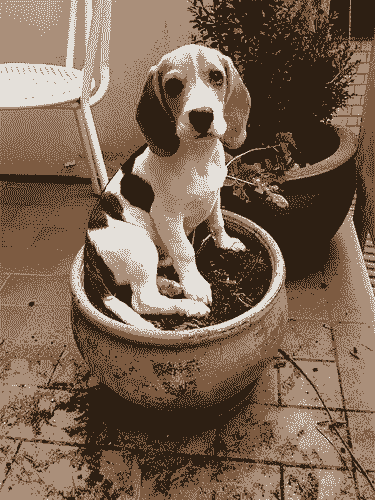

在终端中运行：

```py
curl -X POST -F image=@dog-fs8.png 'http://localhost:5000/predict' 
```

确保你当前的文件夹中有狗狗的图片「dog-fs8.png」（或提供正确的文件路径），你会看到下面的运行结果：

```py
{"predictions":[{"label":"beagle","probability":0.987775444984436},{"label":"pot","probability":0.0020967808086425066},{"label":"Cardigan","probability":0.001351703773252666},{"label":"Walker_hound","probability":0.0012711131712421775},{"label":"Brittany_spaniel","probability":0.0010085132671520114}],"success":true} 
```

我们可以看到，模型正确地将狗狗分类为小猎犬。太棒了！你已经成功地用 Keras 运行了一个预训练好的深度学习模型，并且使用 Flask 部署其服务、用 Docker 将其封装了起来。至此，我们已经完成了困难的部分。现在让我们用 Kubernetes 部署该容器。

**步骤 3：用 Kubernetes 部署我们的模型**

**1\. 创建一个 Docker Hub 账户（如果你没有的话）**

我们要做的第一件事是将模型上传到 Docker Hub 上。如果你还没有 Docker 账户，请创建一个，别担心，这是免费的。我们这样做的原因是，我们不会将容器物理移动到 Kubernetes 集群上，而是引导 Kubernetes 在集中托管服务器（即 Docker Hub）上安装我们的容器。

**2\. 登录 Docker Hub 账户**

创建好 Docker Hub 账户后，你可以通过 sudo docker login 指令从命令行登录。你需要提供用户名、密码，就像你登录网站一样。

如果你看到下面的信息：

```py
Login Succeeded
```

那么你就成功登录了。现在让我们进行下一步。

**3\. 对容器命名**

在上传容器之前，我们需要为容器打标签。你可以将此步骤看做为容器命名。

首先，运行 sudo docker images，并定位 keras-app 容器的镜像 id。

输出应该如下所示：

```py
REPOSITORY TAG IMAGE ID CREATED SIZE keras-app latest ddb507b8a017 About an hour ago 1.61GB 
```

现在，我们可以为 keras-app 打标签了。请务必遵循我的格式，并将镜像 id 和 docker hub id 的值替换为你自己指定的值。

```py
#Format
sudo docker tag <your image id> <your docker hub id>/<app name>
#My Exact Command - Make Sure To Use Your Inputs
sudo docker tag ddb507b8a017 gcav66/keras-app
```

**4\. 将容器 push 到 Docker Hub 上**

现在可以 push 我们的容器了。在 shell 中运行以下行：

```py
#Format
sudo docker push <your docker hub name>/<app-name>
#My exact command
sudo docker push gcav66/keras-app
```

现在，如果你返回到 Docker Hub 网站，你就可以看到你的 keras-app repo 了。很好，接下来，我们将进入最后一步。

**5\. 创建一个 Kubernetes 集群**

在 Google Cloud 的主页上选择 Kubernetes Engine：

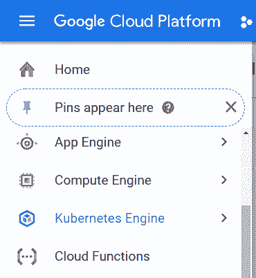

接着创建一个新的 Kubernetes 集群：

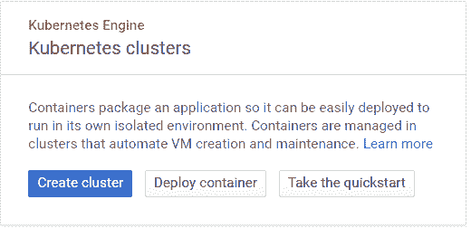

接下来，我们将自定义该集群中节点的规模。我选择了内存为 15GB、4vCPU 的配置。你可以在更小的集群上进行尝试。请记住，默认设置包含 3 个节点，所以整个集群会拥有 3 倍于你所选择的资源（即，在本例中为 45GB 内存）。我在这里偷个懒，选择了更大的规模，这样我们的 Kubernetes 集群不会运行太长时间。

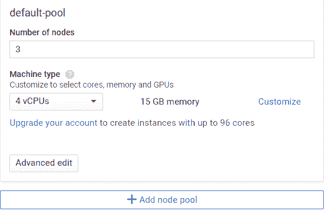

接着，只需点击 Creat。等上一两分钟，你的集群就能运转了。

现在让我们连接到集群。点击 Run in Cloud Shell，就可以为 Kubernetes 集群提供控制台。请注意，这是虚拟机中的一个单独 shell 环境，你在这里可以创建并测试 Docker 容器。我们可以在虚拟机上安装 Kubernetes，谷歌的 Kubernetes 服务会自动为我们完成这个步骤。

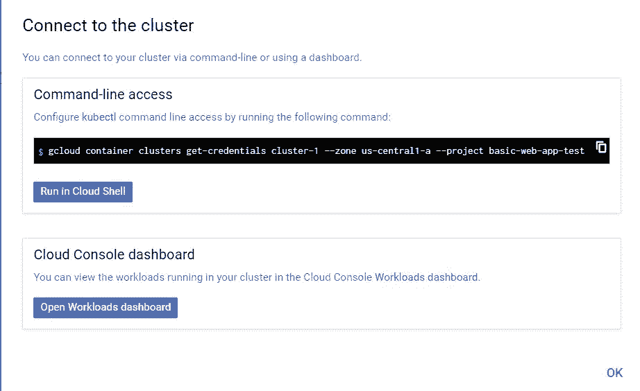

现在，在 Kubernetes 上运行我们的 docker 容器。请注意，镜像标签仅指向我们在 Docker Hub 上托管的 docker 镜像。此外，我们通过——port 指定我们想在端口 5000 上运行应用。

```py
kubectl run keras-app --image=gcav66/keras-app --port 5000 
```

在 Kubernetes 中，容器都在 pod（容器集合）中运行。我们可以输入 kubectl get pods 来验证我们的 pod 是否正在运行。如果你看到下面的结果，你就完成了配置。

```py
gustafcavanaugh@cloudshell:~ (basic-web-app-test)$ kubectl get pods
NAME READY STATUS RESTARTS AGE
keras-app-79568b5f57-5qxqk 1/1 Running 0 1m
```

此时，我们的 pod 正在运行，我们需要将我们的 pod 暴露给 80 端口从而与外界相连。这意味着任何访问我们部署的 IP 地址的人都可以访问我们的 API。这也意味着我们不必在 URL 后面指定一个麻烦的端口号（与 :5000 说再见！）。

```py
kubectl expose deployment keras-app --type=LoadBalancer --port 80 --target-port 5000 
```

就要完成了！现在，运行 kubectl get service 来确定我们的部署（以及我们调用 API 所需的 URL）的状态。同样地，如果命令的输出结果和下图所示的结果类似，你就完成了这一步！

```py
gustafcavanaugh@cloudshell:~ (basic-web-app-test)$ kubectl get service
NAME TYPE CLUSTER-IP EXTERNAL-IP PORT(S) AGE
keras-app LoadBalancer 10.11.250.71 35.225.226.94 80:30271/TCP 4m
kubernetes ClusterIP 10.11.240.1 <none> 443/TCP 18m
```

现在是关键时刻了！请获取 keras 应用程序的 cluster-ip。打开本地终端（或者存有狗狗照片的地方），运行 curl -X POST -F image=@dog-fs8.png 'http://<your service IP>/predict' 指令调用 API。

**享受你的实验结果吧！**

如下所示，API 正确地为该图返回了「小猎犬」的标签。

```py
$ curl -X POST -F image=@dog-fs8.png 'http://35.225.226.94/predict'
{"predictions":[{"label":"beagle","probability":0.987775444984436},{"label":"pot","probability":0.0020967808086425066},{"label":"Cardigan","probability":0.001351703773252666},{"label":"Walker_hound","probability":0.0012711131712421775},{"label":"Brittany_spaniel","probability":0.0010085132671520114}],"success":true}
```

**步骤 4：封装**

在本教程中，我们使用 Keras 和 Flask 实现了一个深度学习模型，并将其部署为 REST API。然后我们把这个应用程序放在 Docker 容器中，将该容器上传至 Docker Hub，并且使用 Kubernetes 对其进行部署。

只需要两个指令，Kubernetes 就部署好了我们的应用程序并向外部提供服务。你应该为此而感到自豪。

现在，我们可以对这个项目做出很多改进。首先，我们应该将运行 flask 应用程序的 python web 服务器从本地 python 服务器替换为 gunicorn 这样的生产级服务器。我们还应该探索 Kubernetes 的扩展和管理特性，这是本文中几乎没有涉及到的。最后，我们可以尝试从头开始创建一个 kuberenetes 环境。

*原文链接：https://medium.com/analytics-vidhya/deploy-your-first-deep-learning-model-on-kubernetes-with-python-keras-flask-and-docker-575dc07d9e76*

****本文为机器之心编译，**转载请联系本公众号获得授权****。**

✄------------------------------------------------

**加入机器之心（全职记者 / 实习生）：hr@jiqizhixin.com**

**投稿或寻求报道：**content**@jiqizhixin.com**

**广告 & 商务合作：bd@jiqizhixin.com**