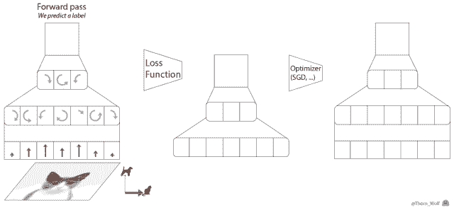

# GPU 捉襟见肘还想训练大批量模型？谁说不可以

选自 Medium

**机器之心编译**

> 深度学习模型和数据集的规模增长速度已经让 GPU 算力也开始捉襟见肘，如果你的 GPU 连一个样本都容不下，你要如何训练大批量模型？通过本文介绍的方法，我们可以在训练批量甚至单个训练样本大于 GPU 内存时，在单个或多个 GPU 服务器上训练模型。

<mp-miniprogram class="miniprogram_element" data-miniprogram-appid="wxf424e2f3e2f94500" data-miniprogram-path="pages/technology/technology?id=dab8c09a-f8c8-4748-bf6d-0006f1b3c197&amp;from=weapp" data-miniprogram-nickname="机器之心 Synced" data-miniprogram-avatar="http://mmbiz.qpic.cn/mmbiz_png/f3g058loLBj0Pib4UhuCFagffSB1RHImwskFzvic6mSp2LDhuerbXxeqqv0b63wSt2Pas7MicNWIcia358rlnhiaVag/0?wx_fmt=png" data-miniprogram-title="分布式计算" data-miniprogram-imageurl="http://mmbiz.qpic.cn/mmbiz_jpg/KmXPKA19gWib8XMiabvFmXNLnFKrZBicicMlqVqo11iaMvUBkPz21lic0NgKrOj0ziadAN8jIHEibGguLUkSkSeDlMHTJw/0?wx_fmt=jpeg"></mp-miniprogram>

2018 年的大部分时间我都在试图训练神经网络时克服 GPU 极限。无论是在含有 1.5 亿个参数的语言模型（如 OpenAI 的[大型生成预训练 Transformer](http://mp.weixin.qq.com/s?__biz=MzA3MzI4MjgzMw==&mid=2650743644&idx=3&sn=749f5bc0e6f68771ac0bcbfc4b5d2202&chksm=871ae722b06d6e349db992087129d1975f12814e16e3e57d7f39f76269dccd84d7420520b495&scene=21#wechat_redirect) 或最近类似的 [BERT](http://mp.weixin.qq.com/s?__biz=MzA3MzI4MjgzMw==&mid=2650749886&idx=1&sn=87080bc474d144b286d4673383f4b6d6&chksm=871affc0b06d76d6ab49b2828a8b795b18e3d762b3978a83704a01dd60fb6dbcde2ed00e163d&scene=21#wechat_redirect) 模型）还是馈入 3000 万个元素输入的元学习神经网络（如我们在一篇 ICLR 论文《[Meta-Learning a Dynamical Language Model](http://mp.weixin.qq.com/s?__biz=MzA3MzI4MjgzMw==&mid=2650741875&idx=3&sn=4ca1768cb48270ad8b43fe995d926552&chksm=871ad80db06d511ba3fc049adcb11e8d01e541610fc7b01f1ae75d5685abb9ff8c6e60ef9a59&scene=21#wechat_redirect)》中提到的模型），我都只能在 GPU 上处理很少的训练样本。

但在多数情况下，随机梯度下降算法需要很大批量才能得出不错的结果。

> 如果你的 GPU 只能处理很少的样本，你要如何训练大批量模型？

有几个工具、技巧可以帮助你解决上述问题。在本文中，我将自己用过、学过的东西整理出来供大家参考。

在这篇文章中，我将主要讨论 PyTorch 框架。有部分工具尚未包括在 PyTorch（1.0 版本）中，因此我也写了自定义代码。

我们将着重探讨以下问题：

*   在训练批量甚至单个训练样本大于 GPU 内存，要如何在单个或多个 GPU 服务器上训练模型；

*   如何尽可能高效地利用多 GPU 机器；

*   在分布式设备上使用多个机器的最简单训练方法。

**在一个或多个 GPU 上训练大批量模型**

你建的模型不错，在这个简洁的任务中可能成为新的 SOTA，但每次尝试在一个批量处理更多样本时，你都会得到一个 CUDA RuntimeError：内存不足。


*这位网友指出了你的问题！*

但你很确定将批量加倍可以优化结果。

> 你要怎么做呢？

这个问题有一个简单的解决方法：梯度累积。



梯度下降优化算法的五个步骤。

与之对等的 PyTorch 代码也可以写成以下五行：

```py
predictions = model(inputs)               # Forward pass
loss = loss_function(predictions, labels) # Compute loss function
loss.backward()                           # Backward pass
optimizer.step()                          # Optimizer step
predictions = model(inputs)               # Forward pass with new parameters 
```

在 loss.backward() 运算期间，为每个参数计算梯度，并将其存储在与每个参数相关联的张量——parameter.grad 中。

累积梯度意味着，在调用 optimizer.step() 实施一步梯度下降之前，我们会对 parameter.grad 张量中的几个反向运算的梯度求和。在 PyTorch 中这一点很容易实现，因为梯度张量在不调用 model.zero_grad() 或 optimizer.zero_grad() 的情况下不会重置。如果损失在训练样本上要取平均，我们还需要除以累积步骤的数量。

以下是使用梯度累积训练模型的要点。在这个例子中，我们可以用一个大于 GPU 最大容量的 accumulation_steps 批量进行训练：

```py
model.zero_grad()                                   # Reset gradients tensors
for i, (inputs, labels) in enumerate(training_set):
    predictions = model(inputs)                     # Forward pass
    loss = loss_function(predictions, labels)       # Compute loss function
    loss = loss / accumulation_steps                # Normalize our loss (if averaged)
    loss.backward()                                 # Backward pass
    if (i+1) % accumulation_steps == 0:             # Wait for several backward steps
        optimizer.step()                            # Now we can do an optimizer step
        model.zero_grad()                           # Reset gradients tensors
        if (i+1) % evaluation_steps == 0:           # Evaluate the model when we...
            evaluate_model()                        # ...have no gradients accumulated 
```

**扩展到极致**

你可以在 GPU 上训练连一个样本都无法加载的模型吗？

如果你的架构没有太多跳过连接，这就是可能的！解决方案是使用梯度检查点（gradient-checkpointing）来节省计算资源。

基本思路是沿着模型将梯度在小组件中进行反向传播，以额外的前馈传递为代价，节约存储完整的反向传播图的内存。这个方法比较慢，因为我们需要添加额外的计算来减少内存要求，但在某些设置中挺有意思，比如在非常长的序列上训练 RNN 模型（示例参见 https://medium.com/huggingface/from-zero-to-research-an-introduction-to-meta-learning-8e16e677f78a）。

这里不再赘述，读者可以查看以下链接：

*   TensorFlow：https://github.com/openai/gradient-checkpointing

*   PyTorch 文档：https://pytorch.org/docs/stable/checkpoint.html


*「节约内存」（Memory-poor）策略需要 O(1) 的内存（但是要求 O(n²) 的计算步）。*

**充分利用多 GPU 机器**

现在我们具体来看如何在多 GPU 上训练模型。

在多 GPU 服务器上训练 PyTorch 模型的首选策略是使用 torch.nn.DataParallel。该容器可以在多个指定设备上分割输入，按照批维度（batch dimension）分割，从而实现模块应用的并行化。

DataParallel 非常容易使用，我们只需添加一行来封装模型：

```py
parallel_model = torch.nn.DataParallel(model) # Encapsulate the model

predictions = parallel_model(inputs)          # Forward pass on multi-GPUs
loss = loss_function(predictions, labels)     # Compute loss function
loss.backward()                               # Backward pass
optimizer.step()                              # Optimizer step
predictions = parallel_model(inputs)          # Forward pass with new parameters 
```

但是，DataParallel 有一个问题：GPU 使用不均衡。

> 在一些设置下，GPU-1 会比其他 GPU 使用率高得多。

这个问题从何而来呢？下图很好地解释了 DataParallel 的行为：


*使用 torch.nn.DataParallel 的前向和后向传播。*

在前向传播的第四步（右上），所有并行计算的结果都聚集在 GPU-1 上。这对很多分类问题来说是件好事，但如果你在大批量上训练语言模型时，这就会成为问题。

我们可以快速计算语言模型输出的大小：


*语言模型输出中的元素数量。*

假设我们的数据集有 4 万词汇，每一条序列有 250 个 token、每个 batch 中有 32 条序列，那么序列中的每一个元素需要 4 个字节的内存空间，模型的输出大概为 1.2GB。要储存相关的梯度张量，我们就需要把这个内存翻倍，因此我们的模型输出需要 2.4GB 的内存。

这是典型 10GB GPU 内存的主要部分，意味着相对于其它 GPU，GPU - 1 会被过度使用，从而限制了并行化的效果。

如果不调整模型和／或优化方案，我们就无法轻易减少输出中的元素数量。但我们可以确保内存负载在 GPU 中更均匀地分布。

**多 GPU 机器上的均衡负载**

解决办法是把每部分输出保留在其 GPU 上，而不是将它们聚集到 GPU-1 上。我们也需要分配损失标准计算，计算损失并进行反向传播。

幸而，张航开源了一个名为 PyTorch-Encoding 的 PyTorch 包，它包含了这些定制的并行化功能。

我提取并稍稍改动了这个模块，你可以从以下地址下载 gist（parallel.py）来纳入并调用你的代码。它主要包括两个模块：DataParallelModel 和 DataParallelCriterion，它们的用途如下：

下载地址：https://gist.github.com/thomwolf/7e2407fbd5945f07821adae3d9fd1312

```py
from parallel import DataParallelModel, DataParallelCriterion

parallel_model = DataParallelModel(model)             # Encapsulate the model
parallel_loss  = DataParallelCriterion(loss_function) # Encapsulate the loss function

predictions = parallel_model(inputs)      # Parallel forward pass
                                          # "predictions" is a tuple of n_gpu tensors
loss = parallel_loss(predictions, labels) # Compute loss function in parallel
loss.backward()                           # Backward pass
optimizer.step()                          # Optimizer step
predictions = parallel_model(inputs)      # Parallel forward pass with new parameters 
```

DataParallelModel 和 torch.nn.DataParallel 的区别在于，前向传播的输出（predictions）没有聚集在 GPU-1 上，而是作为 n_gpu 张量的元组，每个张量分布在相应的 GPU 上。

DataParallelCriterion 容器封装了损失函数，并把 n_gpu 张量元组和目标标签张量作为输入。它在每个 GPU 上并行计算损失函数，像 DataParallel 分割模型输入一样分割目标标签张量。

下图说明了 DataParallelModel/DataParallelCriterion 的内部情况：


*使用 DataParallelModel 和 DataParallelCriterion。*

以下是你可能会遇到的两个特定案例的解决办法：

*   你的模型输出几个张量：你可能想分解它们：output_1, output_2 = zip(*predictions)

*   有时候你并不想使用并行损失函数：收集 CPU 上的所有张量：gathered_predictions = parallel.gather(predictions)

**分布式训练：在多台机器上训练**

在更大的批量上训练时，我们要如何控制多个服务器的算力呢？

最简单的选择是使用 PyTorch 的 DistributedDataParallel，它几乎可以说是以上讨论的 DataParallel 的直接替代元件。

但要注意：尽管代码看起来很相似，但在分布式设定中训练模型要改变工作流程，因为你必须在每个节点上启动一个独立的 Python 训练脚本。正如我们将看到的，一旦启动，这些训练脚本可以通过使用 PyTorch 分布式后端一起同步化。

在实践中，这意味着每个训练脚本将拥有：

*   它自己的优化器，并在每次迭代中执行一个完整的优化步骤，不需要进行参数传播（DataParallel 中的步骤 2）；

*   一个独立的 Python 解释器：这也将避免 GIL-freeze，这是在单个 Python 解释器上驱动多个并行执行线程时会出现的问题。

> 当多个并行前向调用由单个解释器驱动时，在前向传播中大量使用 Python 循环/调用的模型可能会被 Python 解释器的 GIL 放慢速度。通过这种设置，DistributedDataParallel 甚至在单台机器设置中也能很方便地替代 DataParallel。

现在我们直接讨论代码和用途。

DistributedDataParallel 是建立在 torch.distributed 包之上的，这个包可以为同步分布式运算提供低级原语，并能以不同的性能使用多种后端（tcp、gloo、mpi、nccl）。在这篇文章中，我将选择一种简单的开箱即用的方式来使用它，但你应该阅读文档和 Séb Arnold 写的教程来深入理解这个模块。

*   文档：https://pytorch.org/docs/stable/distributed.html

*   教程：https://pytorch.org/tutorials/intermediate/dist_tuto.html

我们将考虑使用具有两个 4 - GPU 服务器（节点）的简单但通用的设置：


*主服务器（服务器 1）拥有一个可访问的 IP 地址和一个用于通信的开放端口。*

**改写 Python 训练脚本以适应分布式训练**

首先我们需要改写脚本，从而令其可以在每台机器（节点）上独立运行。我们将实现完全的分布式训练，并在每个节点的每块 GPU 上运行一个独立的进程，因此总共需要 8 个进程。

我们的训练脚本有点长，因为需要为同步化初始化分布式后端，封装模型并准备数据，以在数据的一个子集上来训练每个进程（每个进程都是独立的，因此我们需要自行处理）。以下是更新后的代码：

```py
from torch.utils.data.distributed import DistributedSampler
from torch.utils.data import DataLoader

# Each process runs on 1 GPU device specified by the local_rank argument.
parser = argparse.ArgumentParser()
parser.add_argument("--local_rank", type=int)
args = parser.parse_args()

# Initializes the distributed backend which will take care of sychronizing nodes/GPUs
torch.distributed.init_process_group(backend='nccl')

# Encapsulate the model on the GPU assigned to the current process
device = torch.device('cuda', arg.local_rank)
model = model.to(device)
distrib_model = torch.nn.parallel.DistributedDataParallel(model,
                                                          device_ids=[args.local_rank],
                                                          output_device=args.local_rank)

# Restricts data loading to a subset of the dataset exclusive to the current process
sampler = DistributedSampler(dataset)

dataloader = DataLoader(dataset, sampler=sampler)
for inputs, labels in dataloader:
    predictions = distrib_model(inputs.to(device))         # Forward pass
    loss = loss_function(predictions, labels.to(device))   # Compute loss function
    loss.backward()                                        # Backward pass
    optimizer.step()                                       # Optimizer step 
```

**启动 Python 训练脚本的多个实例**

我们就快完成了，只需要在每个服务器上启动训练脚本的一个实例。

为了运行脚本，我们将使用 PyTorch 的 torch.distributed.launch 工具。它将用来设置环境变量，并用正确的 local_rank 参数调用每个脚本。

第一台机器是最主要的，它应该对于所有其它机器都是可访问的，因此拥有一个可访问的 IP 地址（我们的案例中是 192.168.1.1）以及一个开放端口（在我们的案例中是 1234）。在第一台机器上，我们使用 torch.distributed.launch 来运行训练脚本：

```py
python -m torch.distributed.launch --nproc_per_node=4 --nnodes=2 --node_rank=0 --master_addr="192.168.1.1" --master_port=1234 OUR_TRAINING_SCRIPT.py (--arg1 --arg2 --arg3 and all other arguments of our training script)                                     # Optimizer step 
```

在第二台机器上，我们类似地启动脚本：

```py
python -m torch.distributed.launch --nproc_per_node=4 --nnodes=2 --node_rank=1 --master_addr="192.168.1.1" --master_port=1234 OUR_TRAINING_SCRIPT.py (--arg1 --arg2 --arg3 and all other arguments of our training script) 
```

这两个命令是相同的，除了—node_rank 参数，其在第一台机器上被设为 0，在第二台机器上被设为 1（如果再加一台机器，则设为 2，以此类推…）。

点击阅读原文报名 INTERFACE，探索微软小冰全双工语音对话技术。

