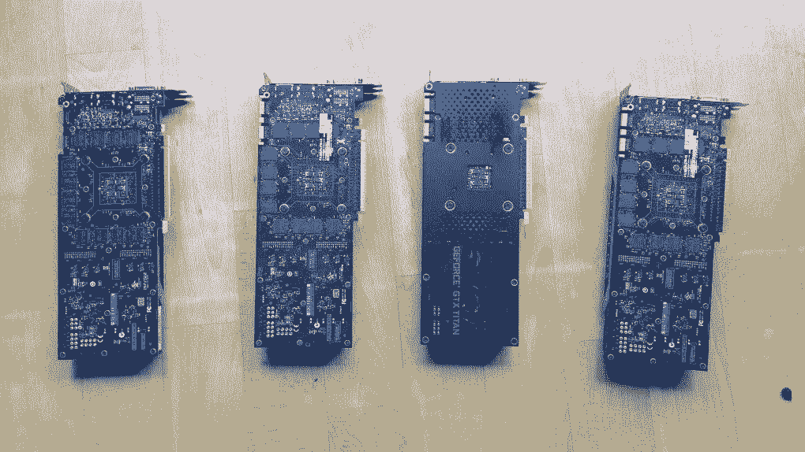
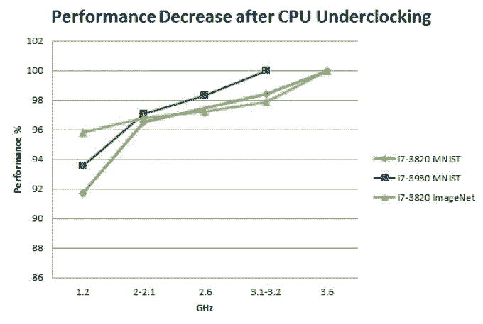

# RTX 2080 时代，如何打造属于自己的深度学习机器

选自 timdettmers

**作者：****Tim Dettmers**

****机器之心编译****

> 深度学习是计算密集型的领域，搭建深度学习系统时，最糟糕的事情之一就是把钱浪费在并非必需的硬件上。本文中，华盛顿大学博士生 Tim Dettmers 将一步步带你了解搭建一个高性能经济系统所需的硬件。

作者曾在 2015 年写过一版深度学习硬件推荐的文章，但如今计算机硬件的迭代速度非常快，因此作者在近期将原来的文章进行了大幅改动，写出了第二版深度学习硬件推荐。

参见：[深度 | 史上最全面的深度学习硬件指南](http://mp.weixin.qq.com/s?__biz=MzA3MzI4MjgzMw==&mid=402261356&idx=1&sn=f66ee62b002b8a9879d3c428f846e440&scene=21#wechat_redirect)

以下是博客原文的编译，机器之心摘取了 GPU、RAM、CPU、硬盘、主板部分的全部内容，并简单总结了剩余部分（包括电源、散热、机箱和显示器），同时在最后给出了结论清单，具体细节还请参阅原文。

> **深度学习硬件推荐第二版：**研究并行化深度学习过程中，我搭建了 7 个深度学习工作站，为此，我需要仔细挑选硬件。尽管经过了仔细的研究和逻辑推理，但是，挑选硬件时，我还是会犯相当多的错误，当我在实践中应用集群时，错误就会显现出来。下面就是我想分享的所得，希望你们不会再掉入同样的陷阱。

**GPU**

在这篇博文中，我们假设你会利用 GPU 来进行深度学习。如果你正在构建或升级你的深度学习系统，忽视 GPU 是不理智的。GPU 正是深度学习应用的核心要素——计算性能提升，收获巨大，不可忽视。

我在另一篇博客中讨论了 GPU 选择推荐，对于深度学习系统而言，GPU 的选择可能是最关键的部分。在选择 GPU 的时候，人们最可能犯的三个错误是：（1）性价比低；（2）没有足够内存；（3）散热效果差。

博客地址：http://timdettmers.com/2018/11/05/which-gpu-for-deep-learning/

对于性价比高的 GPU，我一般推荐 RTX 2070 或 RTX 2080 Ti。如果你使用了这些显卡，你应该使用 16 位的模型。否则，在 eBay 上购买 GTX 1070、GTX 1080 和 GTX 1080 Ti 会更合适，你可以在这些显卡上使用 32 位模型（但不能是 16 位模型）。

在选择 GPU 的时候，要注意内存需求问题。RTX 显卡可以运行 16 位模型，相比 GTX 显卡，可以用相同的内存训练两倍大的模型。由于其内存优势，学会如何使用 RTX 显卡高效运行 16 位模型可以带给你很多好处。一般而言，内存需求状况如下所示：

*   追求当前最佳结果（SOTA）的 AI 实验研究：≥11GB；

*   探究有趣架构的 AI 实验研究：≥8GB；

*   任何其它研究：8GB；

*   Kaggle：4-8GB；

*   初创公司：8GB（但需根据模型尺寸的具体用例做调整）；

*   公司：8GB 用于原型设计，11GB 用于训练。

另一个需要注意的问题是冷却，尤其当你购买 RTX 显卡的时候。如果你想将 GPU 放入 PCIe 插槽中，让它们彼此相邻放置，确保能为 GPU 提供鼓风式风扇。否则你可能会遇到温度问题，你的 GPU 将变慢（约 30%），而且会更早报废。

*你能否识别出因性能不佳而出现故障的硬件部分？是其中一个 GPU？或者其实是 CPU 出现故障？*

**RAM**

选择 RAM 时会犯的最大错误是 RAM 的时钟频率太高。第二个错误是选择的 RAM 不够，导致不能获得连续的原型设计经验。

**所需 RAM 时钟频率**

RAM 时钟频率只是一种营销手段，RAM 生产公司想以此诱惑你购买「更快的」RAM，但实际上这并不能带来多少性能增益。可以在「Does RAM speed REALLY matter?」这个视频中看到最佳的解释。此外，你要知道 RAM 速度与快速 CPU RAM->GPU RAM 传输几乎无关。这是因为（1）如果你使用了固定内存，模型的样本批量不需要 CPU 参与就可以被转移到 GPU，以及（2）如果你不使用固定内存，快速 RAM 相对于慢速 RAM 的性能提升约为 0-3％，所以把钱花在别的地方！

**RAM 大小**

RAM 大小不会影响深度学习性能。但是，它可能会阻碍你轻松运行 GPU 代码（无需交换到磁盘）。你需要有足够的内存来使用 GPU。这意味着你应该至少拥有与最大 GPU 匹配的 RAM 量。例如，如果你有一个 24 GB 内存的 Titan RTX，你应该至少有 24 GB 的 RAM。但是，如果你有多块 GPU，则不一定需要更多 RAM。

这种「在 RAM 中匹配最大 GPU 内存」策略的问题在于，如果处理大型数据集，你的 RAM 可能仍然不够。所以最好的策略是匹配你的 GPU，如果觉得 RAM 不够，再买多些就是了。

心理学告诉我们，注意力是一种随着时间推移而耗尽的资源。RAM 是为数不多的可以让你节省集中资源以解决更困难的编程问题的硬件之一。如果你有更多的 RAM，你可以将注意力集中在更紧迫的问题上，而不是花费大量时间来解决 RAM 瓶颈。有了足够的 RAM，你可以避免这些瓶颈，节省时间并提高效率，解决更紧迫的问题。特别是在 Kaggle 比赛中，我发现额外的 RAM 对于特征工程非常有用。因此，如果你有钱并需要进行大量预处理，那么额外的 RAM 可能是一个不错的选择。因此，根据此策略，你需要现在就购买更多、更便宜的 RAM，而不是等以后。

**CPU**

人们通常犯的主要错误是将太多的注意力放在了 CPU 的 PCIe 通道上。你不用太在意 PCIe 通道。你应该查看 CPU 和主板的组合能否支持你想要安装的 GPU 数量。第二个常见错误是选择太强大的 CPU。

**CPU 和 PCI-Express**

人们对 PCIe 通道过于执着。然而，事实上它对深度学习的性能几乎没有影响。如果你有单个 GPU，PCIe 通道只是用来快速把数据从 CPU RAM 转移到 GPU RAM。用 16 个通道传输批量为 32 张图像（32x225x225x3）的 ImageNet 到 32 位模型需要 1.1 毫秒，用 8 个通道需要 2.3 毫秒，用 4 个通道需要 4.5 毫秒。这些都只是理论数字，在实践中 PCIe 通道传输数据的速度通常只有一半，但这仍然很快！PCIe 通道的延迟通常在纳秒范围内，因此可以忽略不计。

综合起来，将批量为 32 的 ImageNet 图像传输到 ResNet-152 的时间如下所示：

正向传递和反向传递：216 毫秒

*   16 个 PCIe 通道的 CPU->GPU 传输：大约 2 毫秒（理论上为 1.1 毫秒）

*   8 个 PCIe 通道的 CPU->GPU 传输：大约 5 毫秒（理论上为 2.3 毫秒）

*   4 个 PCIe 通道的 CPU->GPU 传输：大约 9 毫秒（理论上为 4.5 毫秒）

因此，将 PCIe 通道从 4 个增加到 16 个将会带来大约 3.2% 的性能提升。但是，如果你使用固定内存来运行 PyTorch 的数据加载器，那你将获得 0% 的性能提升。所以，如果你使用的是单个 GPU，就不要把钱浪费在 PCIe 通道上了。

当你选择 CPU PCIe 通道和主板 PCIe 通道时，确定你选择的组合能够支持你想要安装的 GPU 数量。如果你买的主板支持 2 个 GPU，而你最终也想安装 2 个 GPU，那就确保你买的 CPU 支持你安装 2 个 GPU，但无需查看 PCIe 通道数。

**PCIe 通道和多 GPU 并行化**

如果你使用数据并行化在多 GPU 上训练网络，PCIe 通道是否重要？关于这个我在 ICLR2016 年发表过论文《Title:8-Bit Approximations for Parallelism in Deep Learning》。我可以告诉你，如果你有 96 个 GPU，那 PCIe 通道数真的很重要。但是，如果你有不超过 4 个 GPU，那 PCIe 通道数就没那么重要了。如果在 2-3 个 GPU 上进行并行化处理，那你完全不必在意 PCIe 通道。如果你有 4 个 GPU，则每个 GPU 需要 8 个 PCIe 通道的支持（总共需要 32 个 PCIe 通道）。根据以往的经验，几乎没有人会运行超过 4 个 GPU，所以完全没必要额外花钱获得更多的 PCIe 通道，那不值当！

**所需 CPU 核心数**

为了更好地选择 CPU，首先要了解它以及它与深度学习的关系。CPU 能为深度学习做什么？当你在 GPU 上运行深度网络时，CPU 几乎不做计算。它主要干两件事：1）启动 GPU 函数调用；2）执行 CPU 函数。

到目前为止，CPU 最有用的应用是数据预处理。有两种不同的通用数据处理策略，它们有不同的 CPU 需求。

第一种策略是在训练网络时进行预处理：

循环：

1\. 加载小批量

2\. 预处理小批量

3\. 在小批量上训练

第二种策略是在开始任何训练之前进行预处理：

1\. 预处理数据

2\. 循环：

  a. 加载预处理的小批量

  b. 在小批量上训练

对于第一种策略，具有多核的高性能 CPU 可以显著提升性能。对于第二种策略，你不需要非常好的 CPU。至于第一个策略，我推荐每个 GPU 至少 4 个线程——通常每个 GPU 两个核心。对此我还没有做硬件测试，但每增加一个核心/GPU，你估计会获得 0-5% 的性能提升。

至于第二个策略，我建议每个 GPU 最少 2 个线程——通常每个 GPU 一个核心。如果你采用第二个策略，当你增加核心时，性能不会显著提升。

**所需 CPU 时钟频率（频率）**

当人们想到快速的 CPU 时，他们一般最先想到其时钟频率（clock rate）。4GHz 比 3.5GHz 快，是这样吗？在比较具有相同架构的处理器时，这一般是对的，例如「第三代酷睿处理器」（Ivy Bridge）。但在比较不同架构的处理器时，这个想法却没那么准确。而且这也并非一直是测量性能的最好指标。

在深度学习中，只有很少一部分的计算会用 CPU 来完成：增值几个变量、评估几个布尔表达式、在 GPU 或在编程里面调用几个函数——所有这些会取决于 CPU 核的频率。

这种推理似乎是合理的，但当我运行深度学习编程的时候，CPU 会有 100% 的使用率，那这是怎么回事儿？为了找出原因，我做了一些 CPU 核频率降频的实验。

*CPU 降频后在 MNIST 及 ImageNet 的表现：使用不同的 CPU 核频率，将 MNIST 数据集运行 200 遍或遍历 1/4 的 ImageNet 数据集运行作为测量时间，我们测量 CPU 的性能，其中每个 CPU 的最高频率被定为参照线。对于比较：在性能上，GTX Titan 比 GTX 680 提升了 15%；GTX 980 比 GTX Titan 提升了 20%；GPU 超频比任何 GPU 提升了 5%。*

请注意，这些实验是在过时的硬件上进行的，但是，这些结果对现在的 CPU/GPU 来说应该同样适用。

**硬盘/SSD**

硬盘通常不是深度学习的瓶颈。但是，也有例外：如果你在需要数据时直接从磁盘读取，那么一个 100 MB / s 的硬盘驱动器在批量为 32 的 ImageNet 上花费大约 185 毫秒！但是，如果你在使用数据之前异步获取数据（例如 torch vision loaders），那么你可以在 185 毫秒内加载批量，而在 ImageNet 上大多数深度神经网络的计算时间约为 200 毫秒。因此，在当前仍处于计算状态时加载下一个批量，你将不会面临任何性能损失。

但是，我推荐使用 SSD 来提高舒适度和工作效率：程序启动和响应速度更快，使用大文件进行预处理要快得多。你可以购买 NVMe SSD，与普通 SSD 相比，你将获得更加流畅的体验。

因此，理想的配置是为数据集提供大而缓慢的硬盘驱动器，并使用 SSD 提高生产率和舒适度。

**主板**

你的主板应该拥有足够的 PCIe 端口来支持你想运行的 GPU 数量（通常最多 4 块 GPU，即使你有更多的 PCIe 端口）；记住大多数 GPU 有两个 PCIe 端口的宽度，因此如果你想使用多块 GPU，确保在 PCIe 端口之间有足够的空间。确保你的主板不仅有 PCIe 端口，同时还支持你想运行的 GPU 的设置。如果你在 newegg 上搜索选择的主板并查看规格页面上的 PCIe 部分，通常可以找到相关信息。

**其它设备**

后面作者还介绍了供电单元、冷却设备和机箱等，不过限于篇幅这里只做简要的总结，更详细的内容请查看 Tim Dettmers 的原博客。

**1\. 电源供应设备（PSU）**

一般说来，你需要一个给你未来所有 GPU 充足供应的 PSU。随着时间的推移，GPU 通常会更加高效节能；因此，尽管其它组件会需要更换，PSU 会用很久，一个好的 PSU 是一个好的投资。CPU 加上 GPU 所需瓦特，再加上其它组件额外所需的功率（约 10%），我们就能计算出电力峰值所需瓦特数，再加 10% 作为缓冲就行了。

例如如果你有 4 块 GPU，每块 250 瓦特，一块 CPU 150 瓦特，那么我们至少需要 4×250 + 150 + 100 = 1250 瓦特的 PSU。而我们一般会再加 10% 左右以作为缓冲，即选择 1400 瓦特 PSU。

**2.CPU 和 GPU 散热**

GPU 空气散热：对于单个 GPU 或者彼此之间具有空隙的多个 GPU（如可以安装 3-4 个 GPU 的情况下安装了 2 个）来说，空气散热既安全又稳定。但是，当你冷却 3-4 个 GPU 时，可能会犯一个很大的错误。在这种情况下空气散热的冷却效果不太好，你要仔细考虑自己的选择。

GPU 水冷散热：对于多块 GPU，水冷能确保最强劲的 4 块 GPU 集群设置中保持温度。但相对而言更贵一些，水冷每块 GPU 需要花费大约 100 美元和一些额外的前期成本（大约 50 美元）。水冷还需要一些额外的工作来组装计算机，不过现在有很多详细的指南。

所以最后的散热策略很简单，对于单块 GPU，空气散热是最好的，当然也可以添加水冷以提升硬件性能。对于多块 GPU，尤其是 GPU 间空隙比较小的设备，比较建议使用水冷，且你可以尝试为 GPU 找到一体化（AIO）水冷解决方案。

**3\. 机箱**

当你选择机箱时，要确保它能满足你 GPU 的长度要求，这样它才能在主板上放稳。多数机箱都能满足要求，但如果你选的是一个小机箱，就需要多加留心。要核查它的面积和规格，你也可以尝试用 google 的图片搜索引擎，看看能不能找到 GPU 放在上面的图片。此外，如果你使用定制化的水冷设备，你需要确保机箱的空间足够装下散热器。

**4\. 显示器**

我在我的 3'27 英寸显示器上付出了可能是我从未有过的大代价，买了几个显示器后，效率提高了很多。如果我只能用一台显示器，那我的效率肯定会大打折扣。别在这上面和自己过不去，如果你不能有效的运转一个快速的深度学习系统，那它又有什么用？

**总结**

**GPU：**RTX 2070 、RTX 2080 Ti、GTX 1070、GTX 1080 和 GTX 1080 Ti。

**CPU：**每个 GPU 1-2 核，这取决于你的数据预处理。只要主频大于 2GHz，那 CPU 就应该支持我们想要运行的大量 GPU，PCIe 通道并不是太重要。

**RAM：**

*   时钟频率无关紧要，买更便宜的 RAM；

*   购入至少和你已有 GPU 内存大小相同的 CPU 内存；

*   只有更需要时才买更多的 RAM；

*   如果要使用超大规模的数据集，那么需要更多的内存。

**硬盘驱动器/SSD：**

*   用于存储数据的硬盘驱动器至少需要 3TB；

*   使用 SSD 预处理小数据集。

**PSU：**

*   GPU+CPU+10% 就是你必需的电源供应量，再将总电量乘以 110% 而获得最终所需要的电源功率；

*   如果使用多块 GPU，还要增加一些额外的电源供应量；

*   确保 PSU 有足够的 PCIe 连接器（6+8pins）。

**散热：**

*   CPU，使用标准的 CPU 散热器或一体化的水冷解决方案；

*   GPU，使用空气散热、使用鼓风机式的散热器、配置风扇的速度。

**主板：**

尽可能获得更多的 PCIe 插槽，为未来增加 GPU 做好准备。

*原文地址：http://timdettmers.com/2018/12/16/deep-learning-hardware-guide/*

****本文为机器之心编译，**转载请联系本公众号获得授权****。**

✄------------------------------------------------

**加入机器之心（全职记者 / 实习生）：hr@jiqizhixin.com**

**投稿或寻求报道：**content**@jiqizhixin.com**

**广告 & 商务合作：bd@jiqizhixin.com**