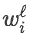
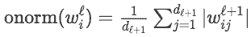
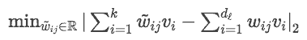
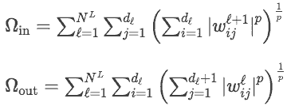

# 教程 | 从超参数到架构，一文简述模型优化策略

选自 GitHub

**作者：****Naomi Saphra**

**机器之心编译**

**参与：****高璇、路** 

> 本文从动态超参数、自适应架构和教师学生方法三个方面介绍了模型优化策略。

模型可以在训练过程中通过修正超参数而逐步建立。这在迁移学习中最为常见，在这种环境中，我们试图将现有模型的知识应用到新领域或新任务中。这是持续学习中更常见的问题，也是一个显而易见的应用。然而，即使有预置的数据集，网络拓扑的递增约束也会为正则化带来益处。

**动态超参数**

在每个 epoch 中超参数都被更新的模型最容易被修改。在这种情况下，我们指的不是那些与网络拓扑相关的超参数，例如层数或维度。在训练过程中有许多机会调整拓扑，但是模型为了再次得到合理的架构通常需要大量的再训练，这在记忆网络（memory network）中已得到清晰的证明 [1]。如果我们转而关注与正则化项和门相关的权重，我们就可以逐步学习到架构，无需频繁的再训练来适应出现根本改变的拓扑。

**Dropout 设置**

Hinton 等人 [2] 将 dropout 描述为：通过防止完美拟合数据的特征检测器的共适应（co-adaptation）来减少过拟合。在这种解释中，共适应的神经元簇同时被激活。随机抑制这些神经元迫使它们各自发展。

在标准 dropout 中，这些共适应神经元在所有训练阶段都有相同的问题。然而，Morerio 等人 [3] 设想在训练初期，共适应可能是网络的最优自组织的开端。从这个角度看，这些结构是训练后期出现过拟合的一大威胁。因此作者介绍了一个增加 dropout 率的超参数调度（hyperparameter schedule）。据我所知，这是唯一发表的自适应正则化提议。

**缓和网络（Mollifying network）**

缓和网络 [4] 是目前将增量控制数据分配的技术和增量控制模型表示能力的技术结合起来的唯一尝试。缓和网络通过模拟退火来逐渐降低数据温度，同时修改各种超参数以实现更长距离的依赖。在 LSTM 中，将输出门设置为 1，输入门为 1/t，遗忘门为 1−1/t，t 是退火时间步。通过这个系统，LSTM 最初表现为词袋模型，逐渐增加了在每个时间步处理更多上下文的能力。

缓和网络对每一层使用不同的数据调度，较低层的噪声退火快于较高的层，因为较低层的表示被设定为学得更快。

**自适应架构**

训练期间最难修正的超参数可能是模型架构本身的拓扑超参数。尽管如此，深度学习文献包含了在训练期间适应模型架构的技术的悠久历史，这些技术通常是对学到参数的回应。这些方法可以通过在训练之初平滑函数来最优化搜索；通过从更简单的模型出发来加快学习速度；或者压缩模型使其更适用于手机或嵌入式设备。这些方法大都可分为两类：通过在训练中增加参数来塑造模型、通过修剪边或节点来压缩模型。

**架构生长**

最近的一些迁移学习策略依赖于不断生长的架构，这些架构通过为与现有网络 [5、6] 有关的新任务创建全新模块而得到。如果我们的目标是通过添加少量参数来扩大现有网络，那么这个问题就类似传统的非参数学习了，因为我们不需要一开始就明确限制模型空间。

经典的神经网络技术（例如级联相关网络（Cascade Correlation Network）[7] 和动态节点创建（Dynamic Node Creation）[8]）随机逐个添加新节点并分别训练。在当今的大型架构和问题上，这种做法非常复杂。此外，这类方法的主要优点是它们适用于小型模型，由于几十年来计算能力的飞跃，现代深度学习开发者不再看重这一目标。用于渐进增长网络的现代技术必须做出两个决定：1) 何时（以及在何处）添加新参数？2) 如何训练新参数？

Warde-Farley 等人 [9] 提出在完整训练完网络后将参数大批量加入。增加的形式是将专门的辅助层并行加入现有网络。这些层在类边界（class boundary）上进行训练，而这正是最初的通用模型试图解决的问题。对留出数据集的混淆矩阵进行谱聚类，并将类划分为具有挑战性的子问题，从而选择类边界。

辅助层与原始通用系统并行随机初始化，然后每个辅助层仅基于指定的类分区中的样本进行训练。除了对最后的分类层进行微调外，原始通用网络是固定的。由此产生的网络就是多专家网络，该网络被证明可以改善图像分类问题的结果。

同时 Neurogenesis Deep Learning (NDL) [10] 使自编码器拥有终身学习的能力。这种策略通过在模型遇到异常值时添加神经元来更新自编码器的拓扑结构，模型在异常值处性能较差。这些新参数仅在异常值上进行训练，使得现有的解码器参数以更小的步长进行更新。现有的编码器参数只有在直接连接到新神经元时才会更新。

在引入和训练这些新神经元之后，NDL 使用一种被作者称为「intrinsic replay」的方法稳定网络的现有结构。他们重建了之前见过样本的近似值，并在重建结果上进行训练。

另一个允许终身学习的系统是无穷受限玻尔兹曼机 (RBM) [11]。这一经典 RBM 的扩展通过独特的索引将隐藏单元参数化，表示成一个序列。这些指令通过支持旧节点直到收敛来增强网络增长的顺序，允许系统任意增长。这个方法很有趣，但如何将类似的修改应用到 RBM 的特殊生成结构以外的网络还未可知。

这些增强技术都不支持循环架构。在现代自然语言处理设置中，这是一个致命的限制。然而，这些技术中有一些可能适用于 RNN，尤其是近期训练专门子系统的问题已得到解决 [12]。

**架构修剪**

最近的许多研究都集中在从训练好的网络中修剪边或整个神经元。这种方法不仅可用于压缩，还有可能提高网络的泛化能力。

修剪边

修剪边而非整个神经元的步骤可能不会减少网络的维度类型。但是会使网络更稀疏，从而有可能节约内存。稀疏网络占用的参数空间更小，因此可能更通用。

Han 等人 [13] 采取的基本方法是，如果权重低于特定阈值，则将其设为 0。这种方法对于压缩非常有效，因为待删除的权重数量很容易通过阈值进行修改。

LeCun 等人 [14] 和 Hassibi 等人 [15] 都基于修剪误差变化的泰勒级数近似（Taylor series approximation）来选择权重。虽然这些方法在较老的浅层网络上是成功的，但是在整个网络上执行这些操作则需要对所有参数计算 Hessian 矩阵，这对于现代的深层架构来说比较麻烦。Dong 等人 [16] 提出了一个更有效的替代方案——在各个层上执行 optimal brain surgery。

修剪节点

修剪全部节点能够减少网络的维数。它可能比选择单独修剪边更快，因为节点数量多于边，这减少了修剪时需要考虑的候选者数量。

He 等人 [17] 通过计算每个节点的重要性，选择从宽度为 d_ℓ的层ℓ上修剪神经元。他们测试了几个重要指标，发现使用「onorm」（即节点激活模式的平均 L1 范数）可以获得最好性能：

Net-trim [18] 同样依赖 L1 范数来增加稀疏性。

Wolfe 等人 [19] 将基于重要性的修剪方法的结果与蛮力法进行对比，蛮力法基于节点对性能的影响而贪婪地选择要牺牲的节点。在蛮力法中，他们在没有每个节点的情况下在测试数据上重新运行了网络，并根据得到网络的误差对节点进行排序。它们的重要性指标是基于节点对性能影响的神经元级泰勒级数近似 [15]。

在测试的第一个算法中，他们根据节点的重要性对所有节点进行排名，然后连续删除每个节点。在第二种算法中，它们在每次节点移除后对剩余节点重新排序，以解释生成然后又被取消的子网络的影响。在第二种情况下，他们发现在 mnist 上训练的网络中可以修剪多达 60％的节点而不会显著降低性能。这与早期观察结果 [20] 相符——网络中的大多数参数是不必要的，它们的影响仅限于生成然后取消它们自己的噪声。这一结果支持这样的观点：反向传播隐性地为给定的任务训练最小网络。

Srinivas 和 Babu [21] 为了减少网络的冗余而进行了修剪，因此他们根据其权重与同层其他神经元的相似度来移除节点。而 Diversity networks [22] 根据其激活模式的多样性进行选择。为了对不同的节点选择进行采样，他们使用了 Determinantal Point Process（DPP）。该技术最小化了采样节点之间的依赖性。他们遵循这一修剪过程，融合被扦插回网络的节点。

这些论文的观察结果中出现了一个有趣的差异。Mariet 和 Sra [22] 发现，他们利用 DPP 在较深的层中采样了更多节点，而 Philipp 和 Carbonell [19] 通过在 2 层网络的较深一层中使用蛮力法修剪了更多节点。换句话说，diversity networks 在更深层保留更多节点，而贪婪的蛮力法从较深层移除了更多节点。这些结果表明这些算法各自结果之间存在根本差异，值得进一步研究。

合并节点

Mariet 和 Sra [22] 发现，如果他们将修剪的节点合并回网络中，那么在基于 DPP 的修剪之后，性能会提高。他们通过调整修剪层中剩余节点的权重来最小化修剪前后激活输出的差异，从而实现了前述现象：

由于 DPP 专注于选择一组独立的神经元，在任何给定的噪声消除系统中为保持现状可能需要至少修剪一个节点，因为这些消除子网络必然存在高度依赖。在这种情况下，噪声消除部分会合并到产生噪声的节点中，反之亦然。这将使合并在 diversity networks 中成为一种特殊的必要组件，但是它仍然可以在不同的修剪算法之后提供一种易处理的再训练替代方法。

**非参数神经网络**

据我所知，修剪和生长策略在一项研究中被结合在了一起。非参数神经网络 (NNN) [23] 将增加神经元与对神经元施加增加稀疏性的惩罚结合起来。对于一个具有 N^L 层的前馈网络，作者引入了两种正则化项，一种是「fan-in」，另一种是「fan-out」：

fan-in 变量惩罚每个神经元输入的 p-norm，而 fan-out 变量惩罚每个神经元输出的 p-norm。在前馈网络中，这两种正则化项均可被添加到具备任意正权重 λ 且 0<p<∞ 的损失函数中，保证目标函数在有限数量的神经元处收敛。

NNN 为调整网络提供了一系列有益的策略。特别是当 p=1 或 2 时，通过加压形成零值神经元，或者 fan-in 或 fan-out 值为 0 的神经元，来增加稀疏性。每隔一段时间，我们就可以移除这些零值神经元。同时，我们可以在网络的不同位置引入新的零值神经元，正则化项确保目标函数能够收敛，所以我们可以在性能开始下降的任意点停止添加神经元。

然而，这种方法存在明显的问题。第一个限制是这个正则化项不应用于任何循环网络。这种约束降低了该策略在许多自然语言领域中的有用性，在这些领域中，RNN 的性能最好。

该方法的另一个缺点是：通过将输入或输出权重向量初始化为 0 并随机初始化其他相关向量，来插入零值神经元。因此，我们每隔一段时间就重新训练整个网络，而不是智能地初始化和训练新节点来加速收敛。虽然这种方法可以收敛到最佳数量的节点，但它无法加速训练或专门化新节点。

最后，这种方法为创建最终的密集网络增加并移除了所有神经元。所以它失去了因修剪权重而得到的较稀疏网络的潜在正则化优势。

**教师学生方法**

通过新的训练，还可以根据现有网络生成更大或更小的模型。在研究任何自适应架构时，重要的是将使用网络之前状态的基线模型（「教师」）与具有新架构的「学生」网络进行比较。

在蒸馏学习（distillation learning）[24] 的特殊情况下引入教师学生方法，即使用教师网络的输出层来代替真正的标签。蒸馏（distillation）是一种以高性能实现大型集成压缩或昂贵分类器压缩的技术。较小的网络是通过一个目标函数来训练的，这个目标函数将应用于真实标签的损失函数与交叉熵结合起来，这个网络会和较大的教师网络的 logit 层进行对照。除压缩以外，教师学生方法对域适应技术也很有效 [25]，这表明它对于适应数据调度的新时间步可能会很有效。

*原文链接：http://nsaphra.github.io/post/model-scheduling/*

****本文为机器之心编译，**转载请联系本公众号获得授权****。**

✄------------------------------------------------

**加入机器之心（全职记者 / 实习生）：hr@jiqizhixin.com**

**投稿或寻求报道：**content**@jiqizhixin.com**

**广告 & 商务合作：bd@jiqizhixin.com**