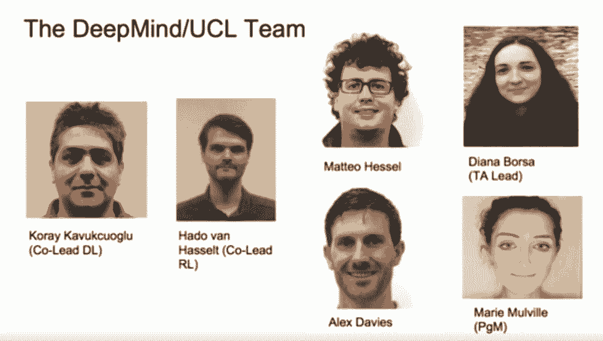
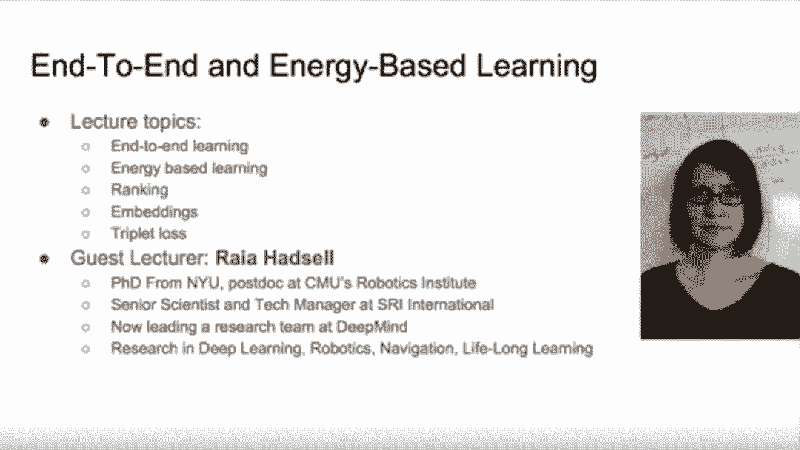
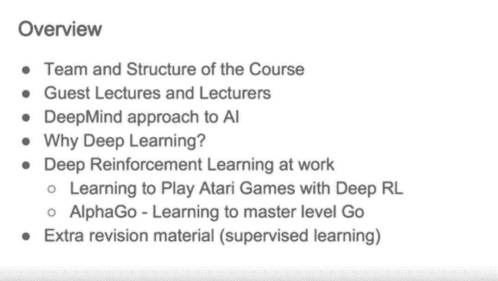
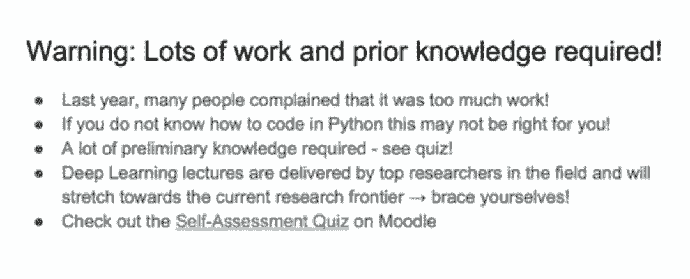

# DeepMind 推出深度学习与强化学习进阶课程（附视频）

机器之心报道

**参与：张倩、李泽南**

> 在 [OpenAI 推出强化学习课程 Spinning Up](http://mp.weixin.qq.com/s?__biz=MzA3MzI4MjgzMw==&mid=2650751601&idx=1&sn=7bd22dfcb1cf1b59418641282ca2cfe5&chksm=871a860fb06d0f19537938aa3e1d908b9d7057ddfbd2d17dccdc79d3654add4d35c0ce77830b&scene=21#wechat_redirect) 后不久。昨天，DeepMind 与 UCL 合作推出了一门深度学习与强化学习进阶课程，以在线视频形式呈现。该课程共有 18 节课，每节课都长达 1 小时 40 分钟，内容从深度学习框架 TensoFlow 的介绍到构建游戏智能体，可谓全面。

课程地址：https://www.youtube.com/playlist?list=PLqYmG7hTraZDNJre23vqCGIVpfZ_K2RZs

<mp-miniprogram class="miniprogram_element" data-miniprogram-appid="wxf424e2f3e2f94500" data-miniprogram-path="pages/technology/technology?id=c358669a-56ff-4bc6-b682-605914071b76&amp;from=weapp" data-miniprogram-nickname="机器之心 Synced" data-miniprogram-avatar="http://mmbiz.qpic.cn/mmbiz_png/f3g058loLBj0Pib4UhuCFagffSB1RHImwskFzvic6mSp2LDhuerbXxeqqv0b63wSt2Pas7MicNWIcia358rlnhiaVag/640?wx_fmt=png&amp;wxfrom=200" data-miniprogram-title="多智能体系统" data-miniprogram-imageurl="http://mmbiz.qpic.cn/mmbiz_jpg/KmXPKA19gW81mnEQuQlW2GG6FBTEV53LfoPPWg6Cm7Janehb8ChjxXCiaaT3Ckyic7XJvMiaGBHp3LCLANSGIaajg/0?wx_fmt=jpeg"></mp-miniprogram>

该课程最初在伦敦大学学院（UCL）进行，为方便在线观看进行了录像。多位 DeepMind 的研究人员、UCL 教师参与了课程的设计。

*参与课程制作的 DeepMind/UCL 团队*

课程由两部分组成，一是包含深度神经网络的机器学习，二是利用强化学习进行预测和控制，两个部分相互穿插。在探讨深度学习的过程中，这两条线交汇在一起，其中的深度神经网络被训练为强化学习背景下的函数逼近器。

课程中的深度学习部分首先介绍了神经网络及使用 TensorFlow 的监督学习，接下来探讨了卷积神经网络、循环神经网络、端到端及基于能量的学习、优化方法、无监督学习、注意力及记忆。涉及的应用领域包括目标识别和自然语言处理。

*第一课视频截图*

深度强化学习部分介绍了马尔科夫决策过程、动态规划、无模型预测与控制、值函数近似、策略梯度方法、学习与规划整合、探索/利用困境等。涉及的应用领域包括学习玩经典棋盘游戏或电子游戏等。

第一课视频：

[`v.qq.com/iframe/preview.html?width=500&height=375&auto=0&vid=q0800xbw8ft`](https://v.qq.com/iframe/preview.html?width=500&height=375&auto=0&vid=q0800xbw8ft)

*从第一课来看，本课程将讲解 DeepMind 的 AI 方法，深度强化学习在雅达利、AIphaGo 等游戏中的应用。*

**课程目录**

深度学习 1：基于机器学习的人工智能简介

深度学习 2：TensorFlow 简介

深度学习 3：神经网络基础

强化学习 1：强化学习简介

强化学习 2：探索和利用

强化学习 3：马尔科夫决策过程及动态规划

强化学习 4：无模型预测与控制

深度学习 4：图像识别之外、端到端学习、嵌入

强化学习 5：函数逼近及深度强化学习

强化学习 6：策略梯度及 Actor Critic 算法

深度学习 5：用于机器学习的优化

强化学习 7：规划与模型

深度学习 6：用于自然语言处理的深度学习

强化学习 8：深度强化学习进阶主题

深度学习 7：深度学习中的注意力与记忆

强化学习 9：深度强化学习智能体概览

深度学习 8：无监督学习和生成模型

强化学习 10：经典游戏案例学习

**课程门槛**

当然，这样一门进阶课程也是有一定门槛的。授课者提到，去年就有很多人抱怨课程负担太重。选这门课程的人需要懂 Python，还要有很多其他知识储备。另外，由于授课者都是活跃在学界的顶级研究者，课程会直接延伸到当前的研究前沿。

教师寄语：做好准备，迎接挑战！（brace yourselves！） ********

今天有哪些论文值得一读？扫码开启订阅，每天 15:00 及时速递。

