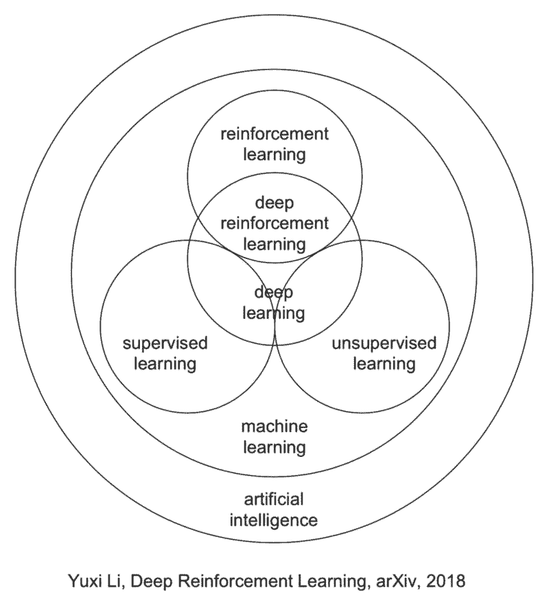
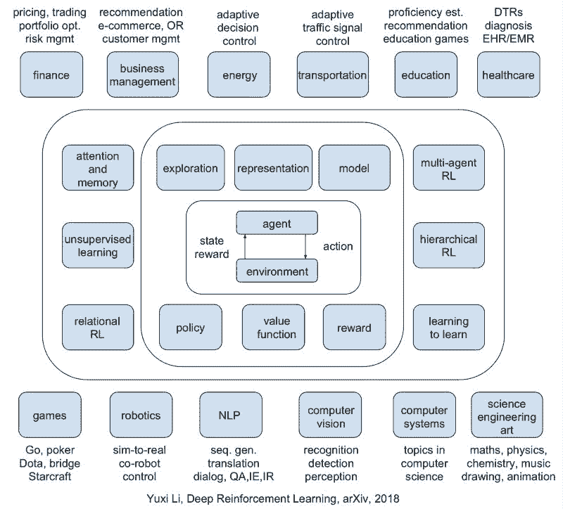
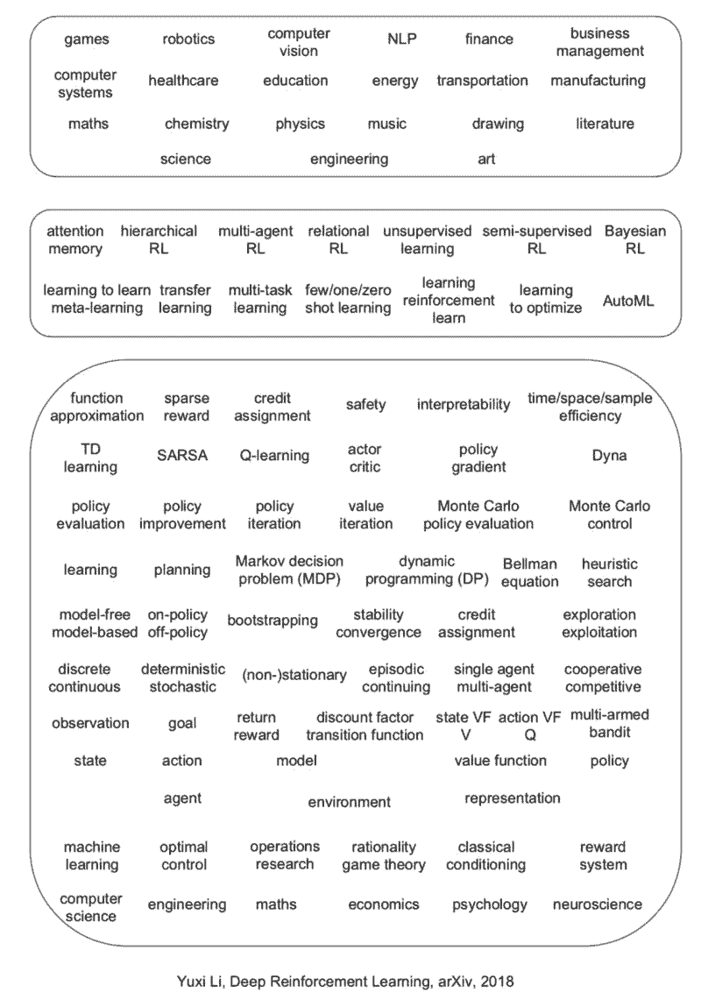
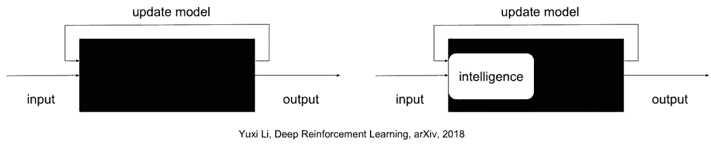

# 资源 | 《深度强化学习》手稿开放了！

机器之心专栏

**作者：Yuxi Li**

> 一年前，机器之心发布了加拿大阿尔伯塔大学计算机系博士 Yuxi Li 的[深度强化学习综述论文](http://mp.weixin.qq.com/s?__biz=MzA3MzI4MjgzMw==&mid=2650722774&idx=1&sn=9d1ba901077fd3902a410e409e6211a9&chksm=871b15a8b06c9cbe00ac088a504d566789498787e0bab859e1888a7c5334ebf1525a1255bc43&scene=21#wechat_redirect)，该论文概述了在深度强化学习（Deep Reinforcement Learning）方面喜人的进展。而这本刚上线的《深度强化学习》手稿对前面的版本《深度强化学习综述》做了大规模的改进；从一年多前的 70 页扩充到现在的 150 页。本文对此手稿进行了介绍。

<mp-miniprogram class="miniprogram_element" data-miniprogram-appid="wxf424e2f3e2f94500" data-miniprogram-path="pages/technology/technology?id=0d6f5aac-351e-4187-b746-76ee3590d166&amp;from=weapp" data-miniprogram-nickname="机器之心 Synced" data-miniprogram-avatar="http://mmbiz.qpic.cn/mmbiz_png/f3g058loLBj0Pib4UhuCFagffSB1RHImwskFzvic6mSp2LDhuerbXxeqqv0b63wSt2Pas7MicNWIcia358rlnhiaVag/0?wx_fmt=png" data-miniprogram-title="深度强化学习" data-miniprogram-imageurl="http://mmbiz.qpic.cn/mmbiz_jpg/KmXPKA19gWibLcvEN03Hk8cyQ2Td4UhbXq7f3hcTJ5OYyykPz3ot6F696xsxHic6DZxXrTS5qmUwBDcTJWkEeFDA/0?wx_fmt=jpeg"></mp-miniprogram>

《深度强化学习》希望帮助初学者了解深度强化学习，也希望为教授、研究人员、学生、工程师、管理人员、投资者等广大读者提供一份深度强化学习参考资料。

她在描绘深度强化学习领域大方向的同时兼顾了许多技术细节。她在历史背景中讨论最新进展。她努力回答了下面三个问题：1）为什么用深度学习？2）最前沿的发展有哪些？3）有什么问题及解决方案？手稿中难免有不足乃至错误之处，真诚欢迎宝贵建议和意见。

这个博客收集了很多深度强化学习的资料： https://medium.com/@yuxili/resources-for-deep-reinforcement-learning-a5fdf2dc730f.

《深度强化学习》讨论了六个核心元素 (core elements): 值函数 (value function)、策略 (policy)、奖赏 (reward)、模型 (model)、探索与利用 (exploration vs. exploitation)、以及表征 (representation); 

六个重要机制 (important mechanisms)：注意力与存储机制 (attention and memory)、无监督学习 (unsupervised learning)、层次强化学习 (hierarchical RL)、多智能体强化学习 (multi-agent RL)、关系强化学习 (relational RL)、和元学习 (learning to learn); 

以及十二个应用场景 (applications)：游戏 (games)、机器人学 (robotics)、自然语言处理 (natural language processing, NLP)、计算机视觉 (computer vision)、金融 (finance)、商务管理 (business management)、医疗 (healthcare)、教育 (education)、能源 (energy)、交通 (transportation)、计算机系统 (computer systems)、以及科学、工程和艺术 (science, engineering, and art).

深度强化学习最近取得了世人瞩目的成绩，比如，应用于雅达利游戏 (Atari games) 上的 DQN 算法吹响了这波深度强化学习前进的号角；在计算机围棋 (AlphaGo/AlphaGo Zero) 和德州扑克 (DeepStack) 上面取得了人工智能里程碑级别的成就。深度强化学习有很多新颖的算法被研发出来，比如，DQN、 A3C、TRPO、PPO、DDPG、Trust-PCL、GPS、UNREAL, 等等。

深度强化学习也被应用于很多很广的方向，比如，夺旗游戏 (Capture the Flag)、刀塔 (Dota 2)、星际争霸 (StarCraft II)、机器人学、动画人物模拟、智能对话、神经元网络结构设计、机器学习自动化、数据中心降温系统、推荐系统、数据扩充、模型压缩、组合优化、程序合成、定理证明、医学成像、音乐合成、化学逆合成，等等。

这个博客收集了很多强化学习的应用场景： https://medium.com/@yuxili/rl-applications-73ef685c07eb

什么情况下强化学习会有帮助？答案是：如果一个问题可以被描述成或转化成序贯决策 (sequential decision making) 问题，可以构造出强化学习需要用的状态 (state)、动作 (action)、可能还有奖赏 (reward) 等元素的时候。有时候一个问题可以用强化学习解决，但这个问题从表面上看可能不像强化学习问题。笼统地说，如果一个问题中包含人工设计的某种「策略」，那么强化学习就有可能发挥作用，自动化并且优化这些策略。创造性会在核心元素、重要机制、应用场景等方面进一步向前推动深度强化学习的发展。

深度强化学习虽然已经取得了很多傲人的成绩，但是，她也有很多问题亟需解决，比如成绩分配 (credit assignment), 稀疏奖赏 (sparse reward), 采样效率 (sample efficiency), 不稳定性 (instability), 发散性 (divergence), 可解释性 (interpretability), 安全性 (safety)，等等；甚至可复制性 (reproducibility) 仍然是一个问题。

《深度强化学习》提出了六个研究方向，同时作为挑战和机遇。应该提到的是，在这些方向，已经有了一些进展，比如，Dopamine、TStarBots、 unsupervised video object segmentation for deep RL、generative query network、neural-symbolic learning, universal planning networks, causal InfoGAN, meta-gradient RL, 等等。(这些进展的参考资料请参阅英文原版，见文末。) 这些方向的发展，会大幅度促进强化学习乃至人工智能的发展。

1.  系统地比较深度强化学习算法

2.  「解决」多智能体问题

3.  基于实体 (entities) 学习，而不只是基于原始数据学习

4.  为强化学习设计最优的表征形式

5.  自动化强化学习 (AutoRL)

6.  研发强化学习杀手级应用

希望强化学习可以与人工智能深度结合，在端到端 (end-to-end) 的学习方式中加入更多智能去完成从原始输入到决策的设计工作、加入知识、加入常识、以更高效、更容易理解的方式去学习、同时避免犯显然的错误；而不是像以前深度学习那样以黑盒子的方式学习。

深度学习和强化学习分别于 2013 年和 2017 年被《麻省理工学院科技评论》评选为十项突破性技术之一；她们会在通向强人工智能的道路上发挥关键作用。David Silver 提出了一个假设：人工智能=强化学习+深度学习。深度学习和强化学习都会进一步繁荣发展。深度学习正在经历爆炸性的大发展。而现在正是培育、教育、引领强化学习市场的大好时机。

深度学习在这次第三波人工智能的蓬勃发展中，会发挥越来越深远的影响；我们也在深度学习的很多成就中看到了她的作用。强化学习提供更通用的学习和决策模式；她会深远影响深度学习、机器学习、乃至人工智能的进一步发展。

强化学习时代马上就来。让我们做好准备！

欢迎阅读本文的英文版，Introducing Deep Reinforcement Learning, https://medium.com/@yuxili/deeprl-6c8c48b6489b; 里面包含了大量的超链接。欢迎下载阅读《深度强化学习》，Deep Reinforcement Learning, arXiv 地址：https://arxiv.org/abs/1810.06339

****本文为机器之心专栏，**转载请联系本公众号获得授权****。**

✄------------------------------------------------

**加入机器之心（全职记者 / 实习生）：hr@jiqizhixin.com**

**投稿或寻求报道：**content**@jiqizhixin.com**

**广告 & 商务合作：bd@jiqizhixin.com**