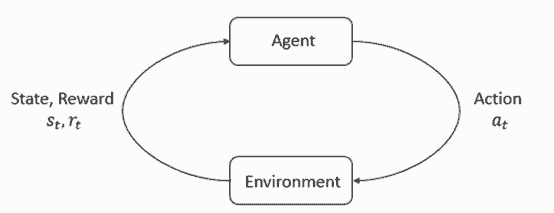
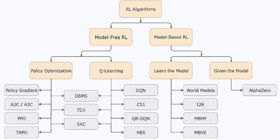
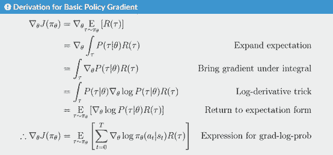
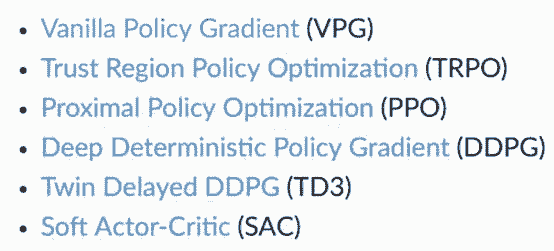
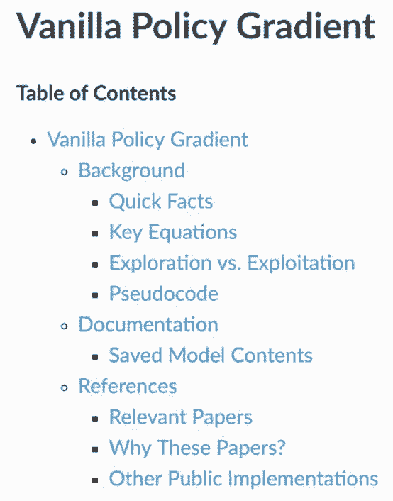
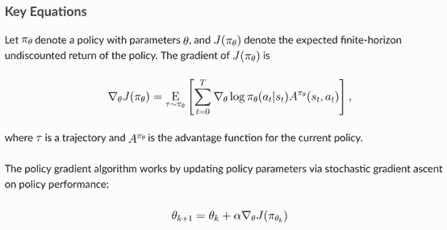
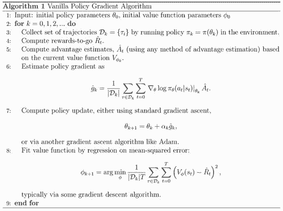
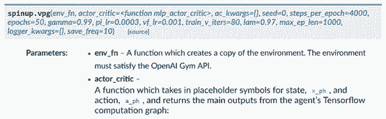
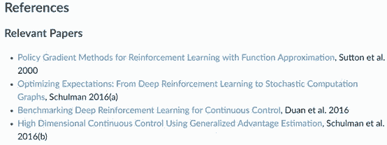
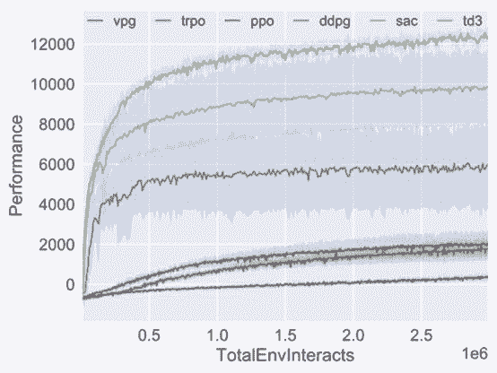

# 从 Zero 到 Hero，OpenAI 重磅发布深度强化学习资源

机器之心报道

**机器之心编辑部**

> 今天，OpenAI 发布了 Spinning Up，这是一份教学资源，旨在让所有人熟练掌握深度强化学习方面的技能。Spinning Up 包含清晰的 RL 代码示例、习题、文档和教程。

<mp-miniprogram class="miniprogram_element" data-miniprogram-appid="wxf424e2f3e2f94500" data-miniprogram-path="pages/institution/institution?id=0b624bfd-367c-43b6-80a9-e661b4d140a2&amp;from=weapp" data-miniprogram-nickname="机器之心 Synced" data-miniprogram-avatar="http://mmbiz.qpic.cn/mmbiz_png/f3g058loLBj0Pib4UhuCFagffSB1RHImwskFzvic6mSp2LDhuerbXxeqqv0b63wSt2Pas7MicNWIcia358rlnhiaVag/640?wx_fmt=png&amp;wxfrom=200" data-miniprogram-title="OpenAI" data-miniprogram-imageurl="http://mmbiz.qpic.cn/mmbiz_jpg/KmXPKA19gW9UY2Bcr13dHLIYIFanHsjP6MHgluukIZej76uZ15Xdd7xRbH4F37iasOhr3vEwTM91mf8GEHCPC5Q/0?wx_fmt=jpeg"></mp-miniprogram>

在项目主页中，OpenAI 提供了非常完整的使用教程，包括 Spinning Up 的详细介绍、各种环境下的安装方法、收录的算法，以及实验实现的教程等。除此之外，OpenAI 也提供了丰厚的学习资料，包括强化学习的入门基础、结合 Spinning Up 学习 RL 的课程、论文推荐、实验练习和基准结果参考等。给人的第一印象就是，要想在深度强化学习上从 Zero 到 Hero，天天逛这个网站就够了~

项目地址：https://spinningup.openai.com/en/latest/

**在 Deep RL 中迈出第一步**


OpenAI 相信深度学习——特别是深度强化学习——将在强大是 AI 技术发展中发挥核心作用。虽然有很多资源可以让人们快速了解深度学习，但深度强化学习更具挑战性。为此，OpenAI 设计了 Spinning Up 来帮助人们学会使用这些技术并扩展关于它们的一些想法。

OpenAI 设计 Spinning Up 的灵感来源于与该机构学者和研究员的合作，通过该合作，他们发现，如果获得正确的指导和资源，在机器学习方面经验甚少甚至没有经验的人也可以快速成长为从业者。在 Deep RL 中开发的 Spinning Up 正是为这种需求准备的，该资源已被纳入了 2019 年的学者和研究员团队课程（https://blog.openai.com/openai-scholars-2019/）。


OpenAI 还发现，具有 RL 方面的能力可以帮助人们参与跨学科研究领域，如 AI 安全——涉及强化学习和其它技能的混合。还有很多从零开始学习 RL 的人向 OpenAI 寻求建议，因此他们决定把提供的这些非正式建议正式发布出来。

Spinning Up 主要包含以下核心内容：

*   强化学习技术的简介，包含各种算法和基本理论的直观理解；

*   一些介绍如何才能做好强化学习研究的经验；

*   重要论文的实现，按照主题进行分类；

*   各种强化学习算法的单独实现，它们都有非常完善的介绍文档；

*   最后还会有一些热身练习题。

整个项目主要可以分为用户文档、强化学习简介、资源、算法文档和 Utilities 文档。其中用户文档主要介绍了学习该项目所需要的一些准备，包括怎样安装 Python 和 OpenAI Gym 等强化学习环境，学习资源的主要内容以及实战所需要注意的事项等。

在强化学习简介中，OpenAI 主要讨论了 RL 中的关键概念、关键算法和策略优化等内容。根据这一部分的内容，至少我们会对强化学习有一个清晰的认识，也就正式从小白到入门了。简介后面的资源章节才是进阶者的最爱，OpenAI 会先介绍如何才能做好强化学习研究，包括需要怎样的背景知识、如何写 RL 代码及思考强化学习问题等。当然这一部分还提供了非常多的「硬资源」，OpenAI 按照 12 大研究主题提供了 98 篇「必读」论文，并提供了其它一些练习题与挑战赛。

估计等读者搞定资源部分，就可以成为真正的强化学习研究者了。当然我们也可以跳过直接学习第三部分的算法文档，它包含了策略梯度、策略优化和 Actor-Critic 等多种主流强化学习算法。只要我们完成了第一部分的前提准备，第三部分的各种算法就能手到擒来。此外对于每一个 RL 算法，文档都会提供全面的介绍，包括基本思想、公式定理、模型组件和参数等。

**支持**

该项目具有以下支持计划：

*   高带宽软件支持期：发布后的前三周，OpenAI 将快速处理 bug 修复、安装问题，以及解决文档中的错误和歧义。我们将努力简化用户体验，使用 Spinning Up 自学变得尽可能简单。

*   2019 年 4 月的主要审查：发布约六个月后，OpenAI 将基于从学习社区收到的反馈认真审查软件包的状态，并宣布任何未来修改的计划。

*   内部开发的公开发布：如果 OpenAI 在与学者和研究员一起工作时，对 Deep RL 中的 Spinning Up 进行了修改，OpenAI 会将修改发至公共报告，并立即向所有人开放。

OpenAI 还将与其它组织合作来帮助人们学会使用这些材料。他们的第一个合作伙伴是加州大学伯克利分校的 Center for Human-Compatible AI (CHAI)，并将在 2019 年初合作举办一个关于深度 RL 的研修班，类似于计划在 OpenAI 举办的 Spinning Up 研修班。

**Hello World**

感受深度强化学习算法表现如何的最好方式就是运行它们。而有了 Spinning Up，这变得非常简单：

```py
python -m spinup.run ppo --env CartPole-v1 --exp_name hello_world 
```

在训练结束时，你将获得关于如何从实验中查看数据以及观看训练智能体视频的指导。

Spinning Up 实现与 Classic Control、Box2D 和 MuJoCo 任务套件中的 Gym 环境兼容。

[`v.qq.com/iframe/preview.html?width=500&height=375&auto=0&vid=x13522397kb`](https://v.qq.com/iframe/preview.html?width=500&height=375&auto=0&vid=x13522397kb)

考虑到新学者，我们为 Spinning Up 设计了代码，使其更短、更友好，也更加容易学习。我们的目标是用最小的实现来演示理论如何变成代码，避免深度强化学习库中常见的抽象层和模糊层。我们倾向于清晰化而不是模块化——实现之间的代码重用严格受限于日志和并行实用程序。给代码加注释，这样你就总能知道事情的进展，并在相应的文档页面上得到背景材料（和伪代码）的支持。

**学习资源概览**

在整个项目中，强化学习简介部分和算法部分可能是很多数读者都非常感兴趣的章节，下面主要介绍了这两部分包含的内容。首先在强化学习简介中，关键概念是必须解释清楚的：



*   状态和观察值；

*   动作空间；

*   策略；

*   轨迹；

*   不同形式化的奖励；

*   RL 最优化问题；

*   值函数。

在关键概念之后，OpenAI 详细介绍了各种强化学习算法及技术在整体所处的位置。如下所示，强化学习也是个桃李满天下的大家族：



最后在强化学习简介部分，OpenAI 还重点介绍了策略优化，这一部分有挺多推导的，尤其是梯度的推导。不过好消息是这些推导都给出了详细的过程，包括变换、消元和一些对数技巧等。读者可以感受下推导过程：



此外在算法章节，Spinning Up 还收录了很多重要的强化学习算法，在项目页上也给出了各个算法的详细介绍和调用方法。



*Spinning Up 收录的算法。*



比如策略梯度算法，如上图所示，文档中会给出关键的方程、伪代码、使用方法以及参考文献。

<mp-miniprogram class="miniprogram_element" data-miniprogram-appid="wxf424e2f3e2f94500" data-miniprogram-path="pages/technology/technology?id=579f0d61-e134-449a-8300-90aa9a731bc7&amp;from=weapp" data-miniprogram-nickname="机器之心 Synced" data-miniprogram-avatar="http://mmbiz.qpic.cn/mmbiz_png/f3g058loLBj0Pib4UhuCFagffSB1RHImwskFzvic6mSp2LDhuerbXxeqqv0b63wSt2Pas7MicNWIcia358rlnhiaVag/640?wx_fmt=png&amp;wxfrom=200" data-miniprogram-title="策略梯度学习" data-miniprogram-imageurl="http://mmbiz.qpic.cn/mmbiz_jpg/KmXPKA19gW9UY2Bcr13dHLIYIFanHsjP6MHgluukIZej76uZ15Xdd7xRbH4F37iasOhr3vEwTM91mf8GEHCPC5Q/0?wx_fmt=jpeg"></mp-miniprogram>



*策略梯度算法的有限时域未折扣回报的梯度期望，以及策略参数的梯度更新方法。*



*策略梯度算法的伪代码。*



*策略梯度算法的调用函数，我们可以看到，Spinning Up 提供的函数调用可以直接设置参数。文档还提供了详细的参数解释。*



*策略梯度算法的参考文献。*

Spinning Up 提供了 MuJoCo Gym 任务套件的 5 个环境下的算法实现基准，包括 HalfCheetah、Hopper、Walker2d、Swimmer、Ant。



*HalfCheetah-2 环境下训练 3 百万时间步的基准结果。*****

*参考链接：https://blog.openai.com/spinning-up-in-deep-rl/*

 **全球三大在线教育平台之一优达学城（Udacity），双十一期间**全场 88 折**限时优惠！

两门 AI 明星课程还提供【7 天试学】，帮助学生低成本尝试，少走弯路！扫下图二维码关注官号，可直接**领取试学 7 折优惠：**


点击阅读原文，直达活动现场**