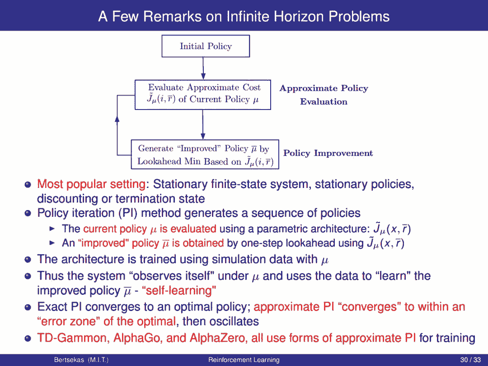

# MIT 科学家 Dimitri P. Bertsekas 最新 2019 出版《强化学习与最优控制》(附书稿 PDF&讲义)

选自专知

**作者：Dimitri P.Bertsekas**

**编译：Xiaowen**

MIT 科学家 Dimitri P. Bertsekas 今日发布了一份 2019 即将出版的《强化学习与最优控制》书稿及讲义，该专著目的在于探索这人工智能与最优控制的共同边界，形成一个可以在任一领域具有背景的人员都可以访问的桥梁。

# REINFORCEMENT LEARNING AND OPTIMAL CONTROL

## by Dimitri P. Bertsekas

## Athena Scientific, 2019

> 这是一本书的草稿，预计在 2019 年的某个时候定稿，并由 Athena Scientific 出版社出版。这意味着这份书稿代表“正在进行的工作”，并将定期更新。它很可能有些错误(希望不是严重的错误)，此外，它对文献的引用可能是不完整的。欢迎读者发送邮件（dimitrib@mit.edu） 向作者提出意见和建议。

书籍地址：http://web.mit.edu/dimitrib/www/RLbook.html

本书的目的是考虑大型和具有挑战性的多阶段决策问题，这些问题可以通过动态规划和最优控制从原则上解决，但它们的精确解在计算上是难以解决的。我们讨论了依靠近似来产生性能良好的次优策略（suboptimal policies）的求解方法。这些方法统称为强化学习（reinforcement learning），也包括近似动态规划（approximate dynamic programming）和神经动态规划（ neuro-dynamic programming）等替代名称。

我们的学科从最优控制和人工智能的思想相互作用中获益良多。本专著的目的之一是探索这两个领域之间的共同边界，并形成一个可以在任一领域具有背景的人员都可以访问的桥梁。

这本书的数学风格与作者的动态规划书和神经动态规划专著略有不同。我们更多地依赖于直观的解释，而不是基于证据的洞察力。在附录中，我们还对有限和无限视野动态规划理论和一些基本的近似方法作了严格的简要介绍。为此，我们需要一个适度的数学背景：微积分、初等概率和矩阵向量代数等。

实践证明这本书中的方法是有效的，最近在国际象棋和围棋中取得的惊人成就就是一个很好的证明。然而，在广泛的问题中，它们的性能可能不太可靠。这反映了该领域的技术现状：没有任何方法能够保证对所有甚至大多数问题都有效，但有足够的方法来尝试某个具有挑战性的问题，并有合理的机会使其中一个或多个问题最终获得成功。因此，我们的目标是提供一系列基于合理原则的方法，并为其属性提供直觉，即使这些属性不包括可靠的性能保证。 希望通过对这些方法及其变体的充分探索，读者将能够充分解决他/她自己的问题。

**Slides**

**章节**

第一章：精确动态规划 Exact Dynamic Programming

第二章：值空间中的逼近 Approximation in Value Space

第三章：参数近似 Parametric Approximation

第四章：无限视野强化学习  Infinite Horizon Renforcement Learning

第五章：集合 Aggregation

参考文献 Reference

**前言 & 目录**

******▼******

****本文为机器之心转载，**转载请联系本公众号获得授权****。**

✄------------------------------------------------

**加入机器之心（全职记者 / 实习生）：hr@jiqizhixin.com**

**投稿或寻求报道：**content**@jiqizhixin.com**

**广告 & 商务合作：bd@jiqizhixin.com**