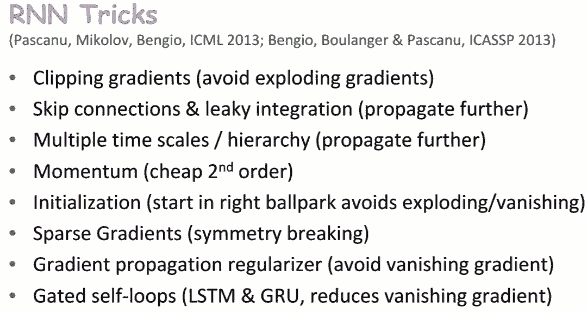
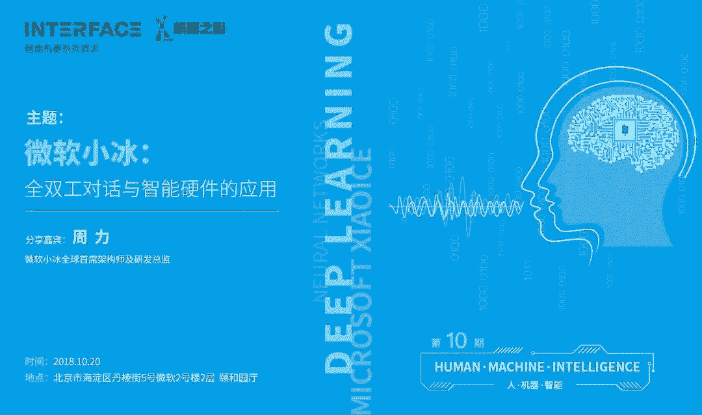

# MILA 2018 夏季深度学习与强化学习课程资源大放送

机器之心编辑

**机器之心编辑部**

**参与：思源、晓坤、路雪**

> MILA 2018 深度学习与强化学习夏季课程目前已经开放了教学资源，机器之心简要介绍了该课程所开放的资源与课程主题，读者可参考这些主题选择合适的课程。

课程地址：https://dlrlsummerschool.ca/

MILA 2018 夏季课程包括深度学习夏季课程（DLSS）和强化学习夏季课程（RLSS），并主要由以下机构支持。Yoshua Bengio 等人组织的夏季课程每年都非常受关注，每一个主题及讲师都是该领域的资深研究者，今年包括 Yoshua Bengio 和 Richard Sutton 在内的讲师大多来自常青藤院校、谷歌大脑、VECTOR INSTITUTE 和 MILA 实验室等知名的研究机构。

**深度学习夏季课程**

深度神经网络学习在多层抽象网络中呈现数据，这极大地提升了语音识别、目标识别、目标检测、预测药物分子活动和其他多项任务的水平。深度学习通过监督学习、无监督学习和强化学习构建分布式表征，在大型数据集中构建复杂的结构。DLSS 将涵盖深度神经网络的基础和应用，从基本概念到尖端研究结成果。

深度学习夏季课程（DLSS）面向已具备机器学习（也可以是深度学习，但不是必须）领域基础知识并有志于进一步深入学习 的硕士研究生、工程师和研究者。今年的 DLSS 课程由 Graham Taylor、Aaron Courville 、Roger Grosse 和 Yoshua Bengio 共同组织。

**强化学习夏季课程**

RLSS 会覆盖强化学习的基础知识，并且展示其最前沿的研究方向和新发现，还会提供与研究生和业内高级研究人员进行交流的机会。值得注意的是，今年 Richard Sutton 会先给我们上一次强化学习「启蒙课」：《Introduction to RL and TD》。

本课程主要面向机器学习及其相关领域的研究生。参加者应该有过计算机科学和数学方面的进阶预训练的经验，今年强化学习夏季课程的组委会成员有 Amir-massoud Farahmand、Joelle Pineau 和 Doina Precup。

**DLSS**

深度学习夏季课程一共包含 12 个主题，它从机器学习基本概念与理论开始介绍了深度学习常见的方法与理论。包括可学习理论、最优化理论以及循环和卷积神经网络等。如下所示为各位讲师及他们带来的课程主题，我们将简要介绍每一个课程讲了些什么。

*深度学习夏季课程* 

**机器学习导论**

机器学习一般分为三大类别：监督学习、强化学习和无监督学习。来自杜克大学的 Katherine Heller 讲师会对这三种学习方式给出基本定义和区分，并辅以具体实例和算法示例的展示；以监督学习的角度，逐步引入线性拟合、误差估计、损失函数、过拟合、欠拟合、正则化等基本概念；从贝叶斯定理的角度重新理解过拟合问题；将线性拟合方法推广，以处理更加复杂的线性拟合问题，最经典的算法为 Logistic 回归。

**神经网络 I**

在这节课中，来自谷歌大脑的 Hugo Larochelle 从神经网络的一般结构开始，过渡到深度学习。神经网路的介绍部分除了基本的前向传播、初始化、激活函数、反向传播过程的解释；和上一节课程的基本概念相对应，涉及损失函数和正则化方法的实现，以及如何防止过拟合的方法，模型选择的方法；此外还有一些神经网络训练中常用的优化技巧，例如归一化、学习率调整等。

深度学习部分强调了训练困难的问题，主要分为两个类别，分别是欠拟合与过拟合。讲师针对这两类问题分别对可能的原因和解决方法进行了深入的讨论，其中欠拟合问题一般和优化方法、计算硬件等有关，过拟合问题一般需要用正则化方法来解决，并介绍了一种有趣的正则化方法——无监督预训练；之后在介绍批归一化方法时，讲师强调，这种正则化方法可以同时改善上述两个训练难题。

**神经网络 II**

在这节课中，Hugo Larochelle 会解释和对比多种机器学习方式，包括监督学习、无监督学习、半监督学习、迁移学习、多任务学习、域适应、one-shot 学习、zero-shot 学习等；然后讲师会介绍如何根据具体问题设计神经网络的架构。最后，讲师会介绍神经网络研究中出现的奇异或难以理解的现象，包括对抗样本、损失函数非凸性、数据记忆能力、数据压缩能力、初始化方法的影响甚至第一个训练样本的显著影响，以及灾难性遗忘现象等。

**CNN 导论**

在这节课中，来自谷歌研究院的 Jonathon Shlens 首先探讨了计算机视觉面临的主要挑战，简言之就是：我们不清楚人类视觉系统是怎么工作的，而现在我们也不清楚计算机视觉系统是怎么工作的，但这个领域的确在进步。卷积神经网络就是受到了生物视觉系统的工作方式的启发而提出来的。讲师强调了自然图像的统计需要遵循不变性，即对图像变换包括平移、剪裁、旋转、缩放等的不变性。这也正是卷积神经网络能成功的一大原因之一，它天然地引入了平移不变性，从而相对于全连接网络能显著减少参数数量；并且其架构和输入图像尺寸是无关的，因而更容易扩展。

在解释了基本概念的基础上，讲师进一步介绍了几个经典的卷积神经网络架构，比如 LeNet。计算机视觉的进步也离不开大规模数据集和算力的发展，尤其是 ImageNet 数据集的提出。讲师还强调了归一化方法的规范和稳定作用，并概述了多种归一化方法，包括批归一化、层归一化、实力归一化、组归一化等。然后讲师从增加深度的角度探讨了卷积架构的演变，并从图像特征不变性的角度探讨了迁移学习方法的发展，尤其是目标检测和分割任务上的架构演变。

接着讲师探讨了架构搜索方法的发展和卷积网络的特征可解释性问题，并在最后讨论了卷积神经网络研究领域面临的主要挑战。

**理论基础**

普林斯顿大学的 Sanjeev Arora 着重介绍了深度神经网络的理论基础，很多读者可能首先想到的就是万能近似定理，即足够宽的单层感知机可以拟合任意函数。但 Arora 更关注于最优化性能、泛化性能、深度法则和其它有可能代替神经网络的简单方法。

**最优化**

多伦多大学的 Jimmy Ba 介绍了最优化基础的第一部分，他主要介绍了随机搜索与梯度下降、如何搜索更好的下降方向以及如何设计一个「白盒」的最优化方法。这些主题都是从神经网络的角度来探讨的，甚至还介绍了如何采用随机搜索的方式学习神经网络的参数。

在整个课程中，他介绍的梯度下降是比较重要的话题，包括梯度下降为什么能朝着更好的方向学习参数、它又如何遭受极值点和鞍点的困扰等。当然既然有这些问题，Jimmy Ba 也会介绍比较好的解决方法，即将物理学中动量的概念引入梯度下降，这样就能克服这些问题。

美国西北大学 Jorge Nocedal 随后介绍了最优化的第二部分，他主要从理论的角度解释了如何理解随机梯度下降及拟牛顿法等其它最优化方法，并提出了很多能获得更快下降速度的技巧。

**RNN**

主讲人 Yoshua Bengio 首先介绍了循环神经网络及其变体，如生成 RNN（Generative RNN）、双向 RNN、递归网络、多维 RNN 等，并详细介绍了 RNN 中涉及的基本概念和原理，如条件分布、最大似然、通过增加深度来提升 RNN 的表达能力等。然后，Bengio 介绍了 RNN 中的梯度问题，包括梯度消失、梯度爆炸及其解决方案。还介绍了多种 RNN trick，如梯度裁剪、跳过连接、Momentum、初始化、稀疏梯度等。此外，这节课还介绍了注意力方面的知识，如基于注意力的神经机器翻译、图注意力网络、多头注意力、自注意力和 Transformer 等。

**语言理解**

来自 CMU 的 Graham Neubig 主讲这门课《自然语言理解》，共分为三部分：语言建模、序列传导（sequence transduction）和语言分析。从现象到原理到解决方案，由浅入深，图文并茂。语言建模部分介绍了 NLP 中的一些基本知识：词袋模型（BOW）、连续词袋模型（CBOW）、Deep CBOW、Bag of n-grams、池化、NLP 预测任务中的神经网络基本思路等。此外，这部分还介绍了用于 NLP 任务时 CNN、RNN 的优缺点。序列传导部分介绍了条件语言模型（Conditioned Language Model）、生成问题、句子表征和注意力机制。第三部分语言分析介绍了三个分析任务：标注、句法分析和语义分析。

**多模型学习**

Google AI 研究科学家 Jamie Kiros 主讲这门课，主要介绍 Grounded Language Learning，共分为三个部分：Grounding and Scope、构造块（包括当前最佳实践），以及与其他研究之间的关系。第一部分介绍了 natural language grounding 的发展历史以及两种主要方法：Tie training and evaluation scopes、Grow training scope, evaluate in world scope。第二部分介绍了五个通用组件：编码、解码、交互（interaction）、预测／控制、目标函数；三种交互方式：Scoring、Fusion 和 Modulation。第三部分介绍了与 Grounded Language Learning 相关的研究领域：Contextualization 、Multi-apt representations、Relevance Realization、Specificity、自然语言生成和对话。

**计算神经科学** 

主题为「大脑中的深度学习」。这门课从「为什么深度学习不止用于 AI？」这个问题入手，指出深度学习研究的目标之一是理解大脑的运行原理。然后指出深度学习需要什么：根据隐藏层对网络输出的贡献向神经突触分配信用（credit）。接着介绍解决方案——反向传播，以及原版反向传播的生物问题。最后介绍了四个问题：error term、下游权重（downstream weight）、derivatves of spikes 和前向／反向传输。

**RLSS**

强化学习夏季课程另外一系列优秀的资源，它从强化学习的「启蒙」到深度强化学习与模仿学习介绍了 RL 的主要脉络与基础。不过强化学习夏季课程可能需要一些数学基础，这样才能比较好地理解随机采样等具体方法。

<mp-miniprogram class="miniprogram_element" data-miniprogram-appid="wxf424e2f3e2f94500" data-miniprogram-path="pages/technology/technology?id=ee1a8f69-3170-4ddf-b2b6-47d91c844425&amp;from=weapp" data-miniprogram-nickname="机器之心 Synced" data-miniprogram-avatar="http://mmbiz.qpic.cn/mmbiz_png/f3g058loLBj0Pib4UhuCFagffSB1RHImwskFzvic6mSp2LDhuerbXxeqqv0b63wSt2Pas7MicNWIcia358rlnhiaVag/0?wx_fmt=png" data-miniprogram-title="强化学习" data-miniprogram-imageurl="http://mmbiz.qpic.cn/mmbiz_jpg/KmXPKA19gW8ovwfyrWPCTqHeNOPpHBhzqgFUftwKuseUytibqxw9EtQuabgAp6uLe2q6iaTgKe7icic80p6Ok1dyzQ/0?wx_fmt=jpeg"></mp-miniprogram>

此外，读者也可以查看阿尔伯塔大学计算机系博士 Yuxi Li 的[深度强化学习手稿](http://mp.weixin.qq.com/s?__biz=MzA3MzI4MjgzMw==&mid=2650750181&idx=4&sn=4f1c620dd2959d819172fda8f643a9dd&chksm=871af89bb06d718d47c69905657c3aaf7ded06d54c25a82672f2a18aefa755f8d333798acbe6&scene=21#wechat_redirect)，这份 150 页的手稿从值函数、策略、奖赏和模型等六个核心元素详细介绍了深度强化学习的方向与细节。

下图展示了强化学习夏季课程的主题与演讲者，我们只简要介绍 Richard Sutton 给我们的强化学习「启蒙」。

在 Sutton 的课程中，他首先介绍了在 9 月份正式发布的《Reiforcement Learning: An Intrifuction》第二版，这本书的电子版同样可以从 Sutton 的主页获得。随后 Sutton 从生物学基础开始介绍了什么是强化学习，即给定环境和状态的情况下智能体会采取某个行动，而这个行动又会影响到环境，因此影响后的环境将反馈给智能体一些奖励或惩罚，这样智能体在不同的环境下就知道该采取什么样的行动。

当然 Sutton 还介绍了强化学习的很多基本概念，包括什么是智能体、环境和策略等，此外也讨论了很多基本的强化学习方法，包括马尔可夫决策过程和 Q 学习等。

点击阅读原文报名 INTERFACE，探索微软小冰全双工语音对话技术。

