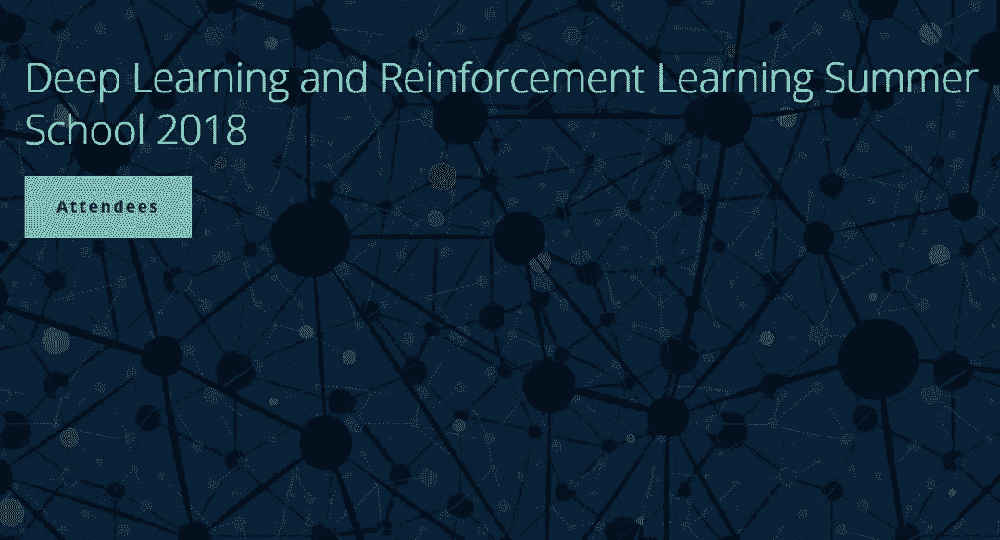
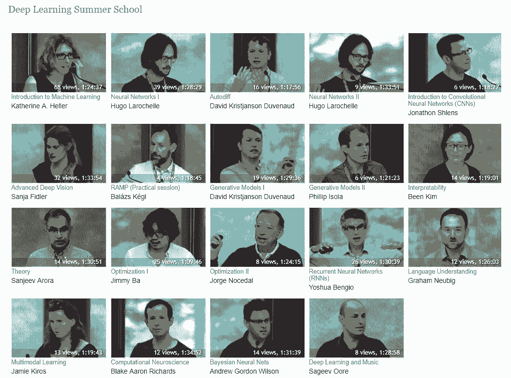
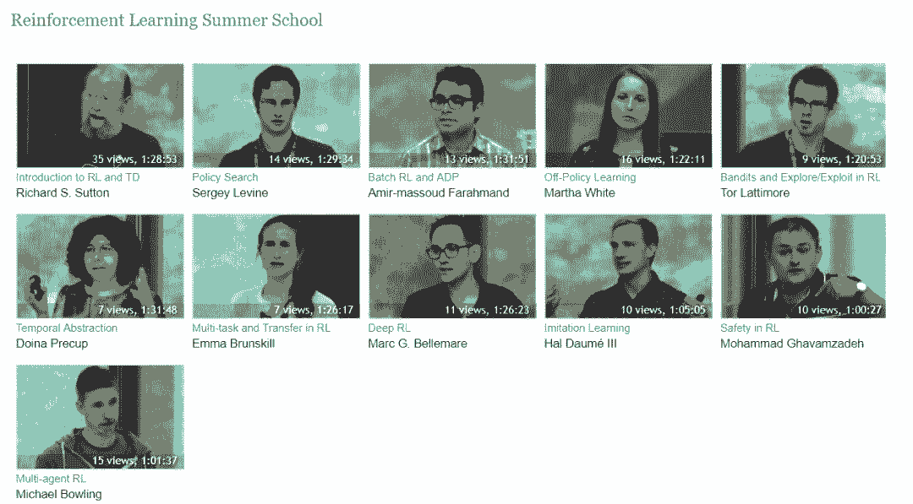

# 资源 | Bengio 等人的 2018 夏季课程视频终放出，但有些沉重

机器之心编辑

**参与：思源**

> Yoshua Bengio 等人组织的深度学习&强化学习夏季课程最近放出了课程视频，[课程 PPT](http://mp.weixin.qq.com/s?__biz=MzA3MzI4MjgzMw==&mid=2650750266&idx=1&sn=8581754df249ddaaa1b72ae37f9fcf9e&chksm=871af944b06d70524fa06cbc5a5dd19e30c81b32efdf1622813321f80be75b1af6e51d593fac&scene=21#wechat_redirect) 早些时候也都放了出来。该课程主要通过深度学习与强化学习从理论到实践介绍各种先进方法，并覆盖了机器学习发展前沿的方方面面。不过这些视频并没有带英文字幕，因此考验你们听力的时候到了。

*   课程地址：https://dlrlsummerschool.ca/

*   视频地址：http://videolectures.net/DLRLsummerschool2018_toronto/

<mp-miniprogram class="miniprogram_element" data-miniprogram-appid="wxf424e2f3e2f94500" data-miniprogram-path="pages/technology/technology?id=01946acc-d031-4c0e-909c-f062643b7273&amp;from=weapp" data-miniprogram-nickname="机器之心 Synced" data-miniprogram-avatar="http://mmbiz.qpic.cn/mmbiz_png/f3g058loLBj0Pib4UhuCFagffSB1RHImwskFzvic6mSp2LDhuerbXxeqqv0b63wSt2Pas7MicNWIcia358rlnhiaVag/640?wx_fmt=png&amp;wxfrom=200" data-miniprogram-title="深度学习" data-miniprogram-imageurl="http://mmbiz.qpic.cn/mmbiz_jpg/KmXPKA19gWicibNgvmDQR9jauFe6DSkfCLFnia8ia7ACkiaWApxwpNXFaiayKD0UibzkL0IWVJc4yJJp5XrsKD964g9oQ/0?wx_fmt=jpeg"></mp-miniprogram>

MILA 2018 夏季课程包括深度学习夏季课程（DLSS）和强化学习夏季课程（RLSS）。Yoshua Bengio 等人组织的夏季课程每年都非常受关注，每一个主题及讲师都是该领域的资深研究者，今年包括 Yoshua Bengio 和 Richard Sutton 在内的讲师大多来自常青藤院校、谷歌大脑、VECTOR INSTITUTE 和 MILA 实验室等知名的研究机构。

**深度学习夏季课程**

深度神经网络学习在多层抽象网络中呈现数据，这极大地提升了语音识别、目标识别、目标检测、预测药物分子活动和其他多项任务的水平。深度学习通过监督学习、无监督学习和强化学习构建分布式表征，在大型数据集中构建复杂的结构。DLSS 将涵盖深度神经网络的基础和应用，从基本概念到尖端研究结成果。

深度学习夏季课程（DLSS）面向已具备机器学习（也可以是深度学习，但不是必须）领域基础知识并有志于进一步深入学习 的硕士研究生、工程师和研究者。今年的 DLSS 课程由 Graham Taylor、Aaron Courville 、Roger Grosse 和 Yoshua Bengio 共同组织。

深度学习夏季课程一共包含 12 个主题，它从机器学习基本概念与理论开始介绍了深度学习常见的方法与理论，包括可学习理论、最优化理论以及循环和卷积神经网络等。下图展示了 19 个课程视频及对应的课程主题，其中 Yoshua Bengio 如同往年一样介绍了循环神经网络及注意力机制等。

**强化学习夏季课程**

RLSS 会覆盖强化学习的基础知识，并且展示其最前沿的研究方向和新发现，还会提供与研究生和业内高级研究人员进行交流的机会。值得注意的是，今年 Richard Sutton 会先给我们上一次强化学习「启蒙课」：《Introduction to RL and TD》。

本课程主要面向机器学习及其相关领域的研究生。参加者应该有过计算机科学和数学方面的进阶预训练的经验，今年强化学习夏季课程的组委会成员有 Amir-massoud Farahmand、Joelle Pineau 和 Doina Precup。

强化学习夏季课程另外一系列优秀的资源，它从强化学习的「启蒙」到深度强化学习与模仿学习介绍了 RL 的主要脉络与基础。如下展示了强化学习夏季课程的 11 个视频与主题：

最后，每一个视频在边栏都提供了对应的课程资料，且视频只包含讲师的介绍而不包含对应的 PPT，所以如果读者要学习的话，不仅听力要好，同时还得根据内容手动翻 PPT。****

****本文为机器之心编辑，**转载请联系本公众号获得授权****。**

✄------------------------------------------------

**加入机器之心（全职记者 / 实习生）：hr@jiqizhixin.com**

**投稿或寻求报道：**content**@jiqizhixin.com**

**广告 & 商务合作：bd@jiqizhixin.com**