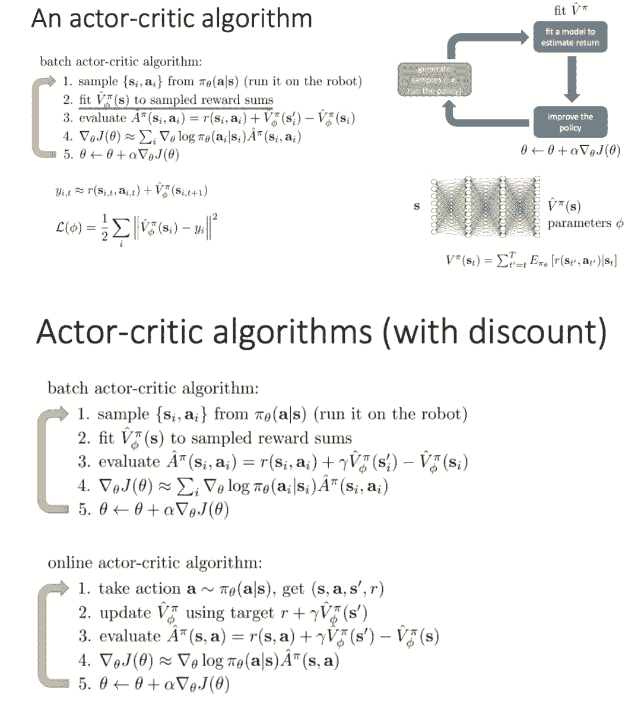
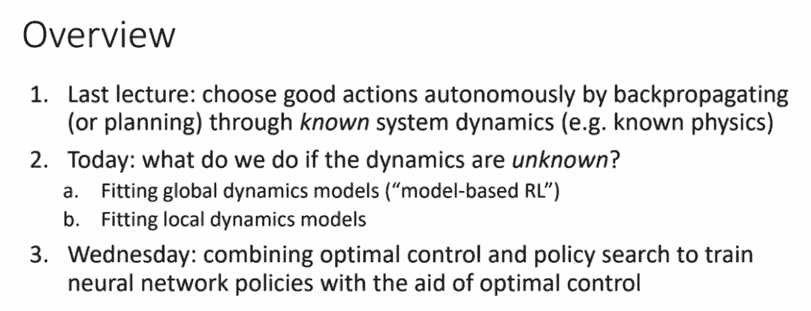
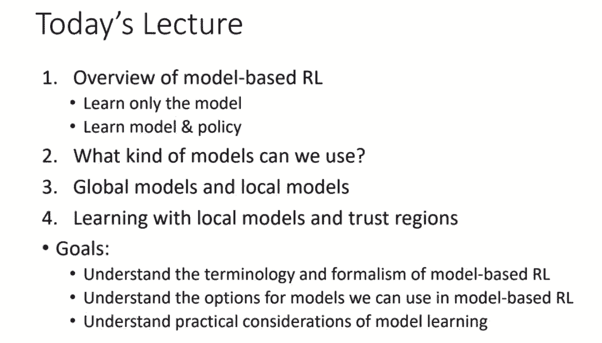
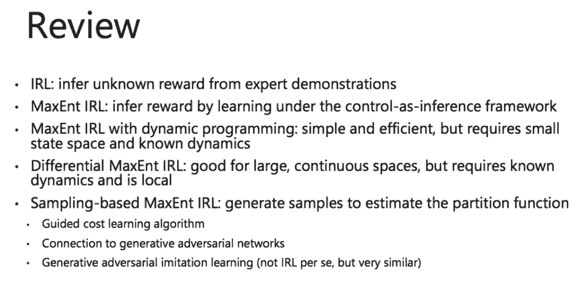
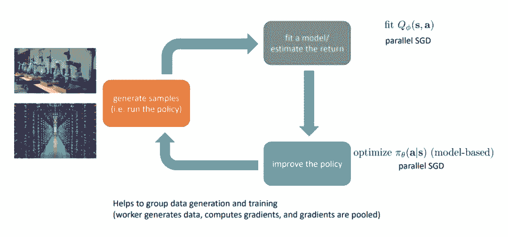

# 资源 | 学到了！UC Berkeley CS 294 深度强化学习课程（附视频与 PPT）

选自 UC Berkeley

**机器之心整理**

> CS294 深度强化学习 2017 年秋季课程的所有资源已经放出。该课程为各位读者提供了强化学习的进阶资源，且广泛涉及深度强化学习的基本理论与前沿挑战。本文介绍了该课程主要讨论的强化学习主题，读者可根据兴趣爱好与背景知识选择不同部分的课程。请注意，UC Berkeley 的 CS 294 并未被归类为在线开放课程，所有视频的使用权仅限个人学习。

*   课程主页：http://rll.berkeley.edu/deeprlcourse/

*   所有视频的链接：https://www.youtube.com/playlist?list=PLkFD6_40KJIznC9CDbVTjAF2oyt8_VAe3

**知识背景**

本课程要求具有 CS 189 或同等学力。本课程将假定你已了解强化学习、数值优化和机器学习的相关背景知识。本课程所需的背景资料已在下表列出。在课程中，授课人会回顾这些资料的内容，但会非常简略。

*   强化学习和 MDP

*   MDP 的定义

*   精确算法：策略与价值迭代

*   搜索算法

*   数值优化

*   梯度下降、随机梯度下降

*   反向传播算法

*   机器学习

*   分类和回归问题：使用哪些损失函数，如何拟合线性和非线性模型

*   训练/测试错误、过拟合

有关强化学习与 MDP 的介绍资料：

*   CS188 EdX 课程，从马尔可夫决策过程 I 开始：http://ai.berkeley.edu/home.html

*   Richard S. Sutton 与 Andrew G. Barto 的《强化学习导论》，第三章和第四章：http://incompleteideas.net/book/the-book-2nd.html

*   有关 MDP 的介绍，请参阅吴恩达的论文《Shaping and policy search in Reinforcement learning》：http://rll.berkeley.edu/deeprlcourse/docs/ng-thesis.pdf

*   David Silver 的课程：http://rll.berkeley.edu/deeprlcourse/#related-materials

有关机器学习和神经网络的介绍性资料，请参阅：

*   Andrej Karpathy 的课程：http://cs231n.github.io/

*   Geoff Hinton 的 Coursera 课程：https://www.coursera.org/learn/neural-networks

*   吴恩达的 Coursera 课程：https://www.coursera.org/learn/machine-learning/

*   Yaser Abu-Mostafa 的课程：https://work.caltech.edu/telecourse.html

以下是 CS 294 深度强化学习 2017 年秋季课程的主要内容概要，所有的授课文档与视频都已经发布且展示在课程主页中。

**8 月 23 日：课程简介（Levine）**

该课程第一节课主要是课程介绍和对强化学习基本概念的介绍。

该课程教学大纲中包含以下内容：

1\. 从监督学习到决策

2\. 基础强化学习：Q 学习和策略梯度

3\. 高级模型学习和预测、distillation、奖励学习

4\. 高级深度强化学习：置信域策略梯度、actor-critic 方法、探索

5\. 开放性问题、学术讲座、特邀报告

**8 月 28 日：监督学习和模仿学习（Levine）**

本节课介绍监督学习，主要内容包括：

1\. 序列决策问题的定义

2\. 模仿学习：使用监督学习进行决策

3.（深度）模仿学习近期研究案例分析

4\. 模仿学习的缺点

本节课目标：

*   理解监督学习定义和符号；

*   理解基础模仿学习算法；

*   理解模仿学习算法的优劣势。

模仿学习：

**8 月 30：强化学习简介（Levine）**

本节课介绍强化学习，主要内容包括：

1\. 马尔可夫决策过程的定义

2\. 强化学习问题的定义

3\. 强化学习算法解析

4\. 简要介绍强化学习算法类型

本节课目标：

*   理解强化学习定义和符号；

*   理解强化学习的目标；

*   尽可能了解所有强化学习算法。

马尔可夫链定义：

马尔可夫决策过程定义：

强化学习算法类型：

**9 月 6 日：策略梯度简介（Levine）**

本节课介绍了策略梯度，主要内容包括：

1\. 策略梯度算法

2\. 策略梯度的作用

3\. 基础方差缩减：因果性（causality）

4\. 基础方差缩减：基线

5\. 策略梯度示例

本节课的目标：

*   理解策略梯度强化学习；

*   理解使用策略梯度时需要实际考虑的事情。

**9 月 8 日：神经网络概述（Achiam）**

本节课全面介绍了神经网络，主要内容包括：自动微分、TensorFlow 基础知识、构建高级计算图、log 和 debug，以及计算图库、TensorFlow 的其他 API／封装器。

**9 月 11 日：actor-critic 算法简介（Levine）**

本节课介绍了 actor-critic 算法，主要内容包括：

1\. 改进具备 critic 的策略梯度

2\. 策略评估问题

3\. 折现因子

4\. actor-critic 算法

本节课目标：

*   理解策略评估与策略梯度如何拟合；

*   理解 actor-critic 算法的工作原理。

actor-critic 算法：

架构设计：

**9 月 13 日：价值函数介绍（Levine）**

本节课介绍价值函数的应用，包括从价值函数提取策略，如何用价值函数优化策略，Q-学习算法的介绍、实际应用和扩展等。

其中强调了聚焦于价值函数而不是策略本身的重要性，这有助于简化问题；并介绍了 Q-学习的多种模式，如离线模式、在线模式等。

**9 月 18 日：高级 Q-学习算法（Levine）**

本节课介绍 Q-学习算法的扩展，包括如何与深度学习结合、广义的 Q-学习算法、Q-学习算法的实际应用以及连续性 Q 学习算法。重点是理解在复杂函数逼近中实现 Q-学习，以及如何将 Q-学习扩展到连续动作。

深度 Q-学习算法的典型定义。

广义的 Q-学习算法：数据收集—目标更新—Q-函数回归。

**9 月 20 日：最优控制和规划（Levine）**

本节课介绍了无模型和基于模型的强化学习的差别，以及在建模过程中对转换动力学的先验知识的重要性；然后介绍了多种优化方法，包括随机优化（连续型）、蒙特卡洛树搜索（离散型）和轨迹优化。重点是理解如何结合离散或连续空间的已知系统动力学知识来执行规划。

知道强化学习问题的动力学知识会通常来说使问题更加简单，围棋、汽车、机器人、视频游戏等的动力学知识都是比较容易获取的。

**9 月 25 日：从数据中学习动力学系统（Levine）**

上节课中介绍了当知道系统的动力学知识之后，如何对问题进行建模。

本节课将介绍当系统动力学知识未知时的解决方案，包括拟合全局动力学模型（基于模型的强化学习）以及拟合局域动力学模型。重点是理解基于模型强化学习的术语和形式，可选的模型类型，以及模型学习中的实际考虑。

**9 月 27 日：利用模仿优化控制器学习策略（Levine）**

上节课中介绍了当系统动力学知识未知时的解决方案，包括全局方法（基于模型的强化学习）以及局域方法（基于模型并添加约束）。但当需要系统生成策略的时候，该怎么办呢？生成策略可以更快地评估智能体的动作，并且泛化潜力更好。

本节课将介绍如何利用反向传播算法来学习策略，它和模仿优化控制的关系，然后介绍了引导策略搜索算法，最后介绍了如何权衡基于模型和无模型强化学习的选择。本节课的重点在于理解用优化控制训练策略的过程，以及多种不同方法的权衡过程。

**10 月 2 日：高级强化学习和图像处理应用（客座演讲：Chelsea Finn）**

****

本节课介绍多种高级的模型学习方法，并以图像应用为例分别展示了隐空间学习、图像空间学习、逆模型学习和预测替代数量。

其中强调了学习特征的重要性，以及在利用观测模型时，需要考虑奖励函数和目标函数的设置。

基于模型方法和无模型方法的优缺点对比。

**10 月 4 日：推断和控制之间的联系（Levine）**

这一课程的主要目的是理解推断和控制之间的关系，以及理解具体的强化学习算法在框架下如何实例化。最优的控制其实可以作为拟合人类行为的模型，但如果数据达不到最优，那有如何拟合人类行为？我们还是可以将强化学习作为图模型中的推断而实现控制，其中价值函数为反向信息，且最大化奖励和信息熵以训练模型。其它方法还有 Soft Q-learning 和基于信息熵正则化的策略梯度等。

如下展示了一种制定决策或控制的概率图模型：

**10 月 9 日：逆向强化学习（Levine）**

本节课介绍逆向强化学习，主要内容包括：

1\. 手动设计奖励函数来定义一个任务

2\. 当我们想从观察专家过程中学习奖励函数，然后使用强化学习时会发生什么？

3\. 使用上节课的近似最优模型，学习奖励函数。

本节课目标：

*   理解逆向强化学习的定义；

*   理解如何使用行为概率模型推导出逆向强化学习算法；

*   了解我们实践中使用的逆向强化学习算法。

逆向强化学习：

以下是这一章节的总结：

**10 月 11 日：高级策略梯度（自然梯度、重要性采样）（Achiam）**

本节课介绍高级策略梯度方法，主要内容包括：

理论：

*   策略梯度方法的问题

*   策略性能边界

*   单调改进理论（Monotonic Improvement Theory）

算法：

*   自然策略梯度

*   置信域策略优化

*   近端策略优化

自然策略梯度：

置信域策略优化：

**10 月 16 日：探索（Levine）**

这一章节主要介绍了什么是探索（exploration），以及为什么它在强化学习中非常重要。一般来说探索分为基于乐观探索、基于后验匹配的探索和基于信息理论的探索。探索和利用（exploitation）的均衡在强化学习中非常重要，也是非常难以解决的问题。以下展示了探索与利用之间的基本区别：

随后 Levine 详细展开介绍了为什么探索是非常困难的，包括摇臂赌博机问题等，而后重点介绍了乐观探索（Optimistic exploration）、概率匹配与后验采样，以及信息增益等探索方法。以下展示了一种探索算法。

**10 月 18 日：探索（第二部分）和迁移学习（Levine）**

这一章节首先复习了上堂课介绍的乐观探索、Thompson 采样风格的算法和信息增益风格的算法，然后介绍了这三类算法的近似论证。最后，讲师 Levine 还给出了一系列的延伸阅读以加强我们对探索的理解。

该课程后一部分介绍了元学习与迁移学习，以下展示了迁移学习中的一种架构： 渐进神经网络。

**10 月 23 日：多任务学习与迁移（Levine）**

该课程主要介绍了多任务学习与迁移学习。说到如何解决迁移学习的问题，没有一个特定的解决方案，所以此课主要对近期（当时）的各种演讲论文进行了介绍。

1.「前向」迁移：在一个任务上训练，迁移到新任务

*   只是试试，希望有好结果

*   架构迁移：渐进网络

*   在新任务上微调

*   随机化源任务域

2\. 多任务迁移：在多种任务上训练，迁移到一个新任务上

*   基于模型的强化学习

*   模型精炼

*   情境策略

*   模块化策略网络

3\. 多任务元学习：学习从多种任务上学习

*   基于 RNN 的元学习

*   基于梯度的元学习

**10 月 25 日：元学习和并行化（Levine）**

首先元学习是一种学习如何学习的方法，它在实践中与多任务学习非常相近，一般而言元学习可以分为学习一种优化器、学习一个 RNN 以捕捉经验信息和学习一种表征。如果元学习是一种快速的强化学习器，那么我们就能快速学习新任务。

一般而言元学习可以通过监督学习或强化学习构建，它可以返回优秀的表征而加速学习也可以用来构建对经验的记忆等。

该章节的后一部分介绍了强化学习中的并行化，包括强化学习到底哪一部分需要并行，如何并行以及最终怎样实现等。以下展示了我们最终需要并行的部分。

**10 月 30 日：进阶模仿学习和开放性问题（Levine）**

我们知道模仿学习的目标是通过监督学习在给定观察下求得行动的概率分布，而强化学习是给定环境和状态下求得行动的概率分布。模仿学习要求预先的演示且必须解决分布迁移问题，它的优点在于可以通过简单稳定的监督学习实现。而强化学习需要奖励函数且必须解决模型的探索问题，它虽然可能会无法收敛，但却能够实现任意好的性能。

这一章节介绍了结合模仿学习的监督方式和强化学习的方法：

后一部分介绍了深度强化学习的挑战，包括超参数调整、样本复杂度、泛化性能和 shenwuxu 生物学启示等。

该课程后面还有很多受邀嘉宾与它们所授的课程，包括 OpenAI 的 Igor Mordatch、谷歌的 Mohammad Norouz、伯克利和 OpenAI 的 Pieter Abbeel、伯克利的 Aviv Tamar 和 OpenAI 的 John Schulman。他们并没有提供对应的授课文档，但演讲视频在 YouTube 上都已经放出来了。

**相关学习材料**

机器学习夏季课程中 John 的视频：

*   视频 1：https://www.youtube.com/watch?v=aUrX-rP_ss4

*   视频 2：https://www.youtube.com/watch?v=oPGVsoBonLM

*   视频 3：https://www.youtube.com/watch?v=rO7Dx8pSJQw

*   视频 4：https://www.youtube.com/watch?v=gb5Q2XL5c8A

课程：

*   David Silver 的强化学习课程：http://www0.cs.ucl.ac.uk/staff/D.Silver/web/Teaching.html

*   Nando de Freita 的机器学习课程：https://www.cs.ox.ac.uk/people/nando.defreitas/machinelearning/

*   Andrej Karpathy 的神经网络课程：http://cs231n.github.io/

相关书籍：

*   深度学习：http://www.deeplearningbook.org/

*   Sutton 和 Barto 合著的 Reinforcement Learning: An Introduction (http://webdocs.cs.ualberta.ca/~sutton/book/the-book.html)：http://webdocs.cs.ualberta.ca/~sutton/book/the-book.html

*   Szepesvari 的 Algorithms for Reinforcement Learning：https://sites.ualberta.ca/~szepesva/RLBook.html

*   Dynamic Programming and Optimal Control：http://www.athenasc.com/dpbook.html

*   Markov Decision Processes: Discrete Stochastic Dynamic Programming：https://www.wiley.com/en-us/Markov+Decision+Processes%3A+Discrete+Stochastic+Dynamic+Programming-p-9780471727828

*   Approximate Dynamic Programming：http://adp.princeton.edu/

 *****本文为机器之心整理，**转载请联系本公众号获得授权****。**

✄------------------------------------------------

**加入机器之心（全职记者/实习生）：hr@jiqizhixin.com**

**投稿或寻求报道：editor@jiqizhixin.com**

**广告&商务合作：bd@jiqizhixin.com***