# 「AlphaGo 之父」David Silver 最新演讲，传授强化学习的十大原则

选自 deeplearningindaba

**作者：****David Silver**

**机器之心****编辑部**

> 9 月 9 日-14 日，Deep Learning Indaba 2018 大会在南非斯泰伦博斯举行。会上，DeepMind 强化学习研究小组负责人、首席研究员、AlphaGo 项目负责人 David Silver 发表演讲，介绍了强化学习的十大原则。机器之心对该演讲进行了介绍。

演讲课件地址：http://www.deeplearningindaba.com/uploads/1/0/2/6/102657286/principles_of_deep_rl.pdf

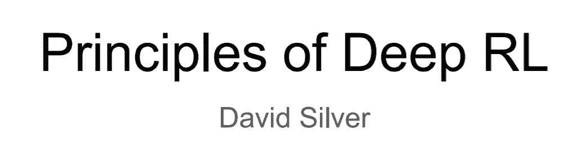

**原则一：评估方法驱动研究进展**

David Silver 指出，客观、量化的评估方法是强化学习进展的重要驱动力：

*   评估指标的选择决定了研究进展的方向；

*   这可以说是强化学习项目中最重要的一个决定。

David Silver 介绍了两种评估方法：

*   排行榜驱动的研究

*   确保评估指标紧密对应最终目标；

*   避免主观评估（如人类评估）。

*   假设驱动的研究

*   形成一个假设：Double-Q 学习优于 Q 学习，因为前者减少了向上偏误（upward bias）；

*   在宽泛的条件下验证该假设；

*   对比同类方法，而不是只与当前最优方法进行对比；

*   寻求理解，而不是排行榜表现。

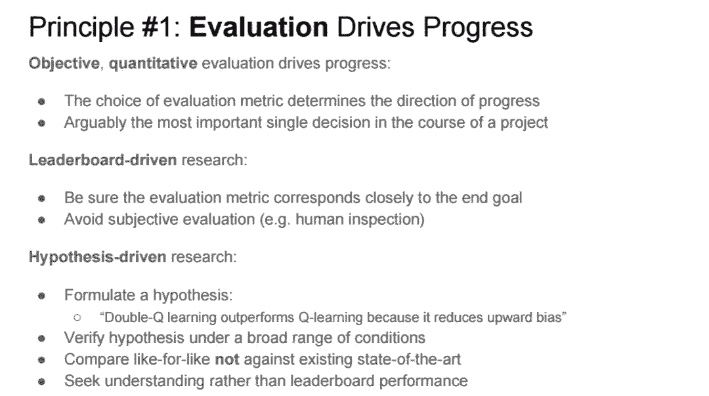

**原则二：可扩展性是成功的关键**

David Silver 认为可扩展性是强化学习研究成功的关键。

*   算法的可扩展性指与资源相关的算法的性能变化；

*   资源包括计算量、内存或数据；

*   算法的可扩展性最终决定算法成功与否；

*   可扩展性比研究的起点更加重要；

*   优秀的算法在给定有限资源的条件下是最优的。

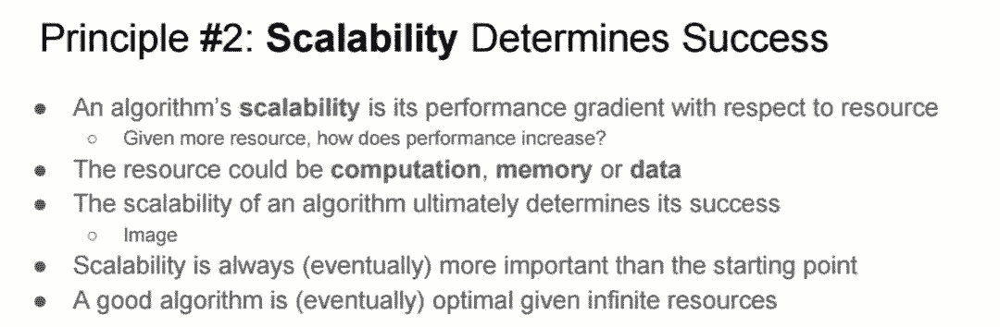

**原则三：通用性（Generality）支持算法的长远有效性**

算法的通用性指它在不同强化学习环境中的性能。研究者在训练时要避免在当前任务上的过拟合，并寻求可以泛化至未来未知环境的算法。

我们无法预测未来，但是未来任务的复杂度可能至少和当前任务持平；在当前任务上遇到的困难在未来则很有可能增加。

因此，要想使算法可以泛化至未来的不同强化学习环境，研究者必须在多样化且真实的强化学习环境集合上测试算法。

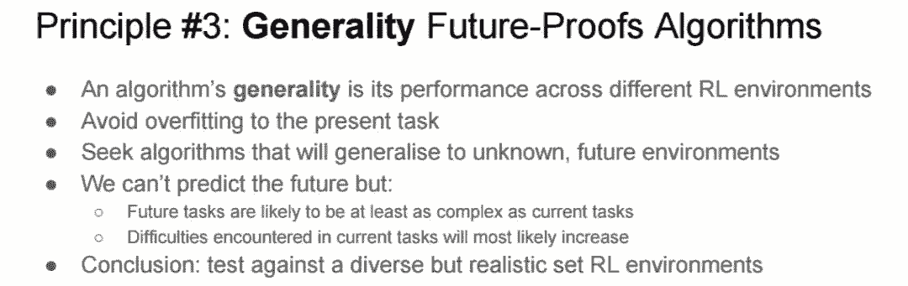

**原则四：信任智能体的经验**

David Silver 指出经验（观察、动作和奖励）是强化学习的数据，公式可以写作：

h_t=o_1,r_1,a_2,o_2,r_2,...,a_t,o_t,r_t

经验流随智能体在环境中学习时间的延长而累积。

他告诫我们，要把智能体的经验作为知识的唯一来源。人们在智能体学习遇到问题时倾向于添加人类的专业知识（人类数据、特征、启发式方法、约束、抽象、域操控）。

他认为，完全从经验中学习看起来似乎不可能。也就是说，强化学习的核心问题非常棘手。但这是 AI 的核心问题，也值得我们付出努力。从长远来看，从经验中学习一直是正确的选择。

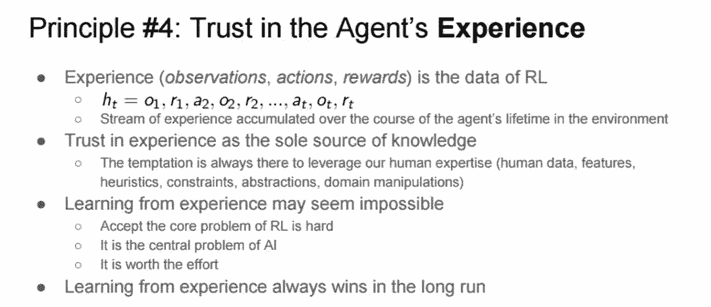

**原则五：状态是主观的**

David Silver 指出：

*   智能体应该从它们的经验中构建属于自己的状态，即：s_t=f(h_t)

*   智能体状态是前一个状态和新观察的函数：s_t=f(s_t-1,a_t-1,o_t,r_t) 

如下图所示：

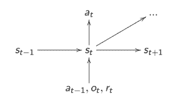

*   它是循环神经网络的隐藏状态。

*   永远不要根据环境的「真实」状态来定义状态（智能体应该是一个部分可观察马尔可夫链模型）。

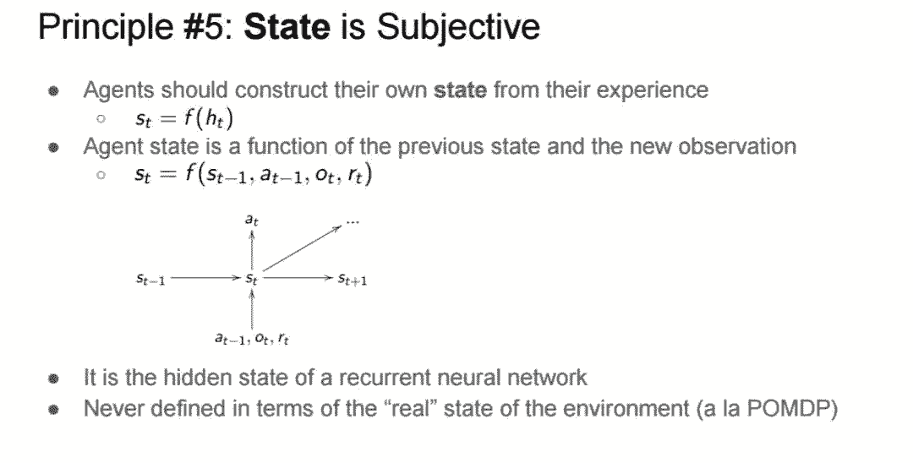

**原则六：控制数据流**

*   智能体存在于丰富的感觉运动（sensorimotor）数据流中：

*   观测结果的数据流输入到智能体中；

*   智能体输出动作流。

*   智能体的动作会影响数据流：

*   特征控制 => 数据流控制

*   数据流控制 => 控制未来

*   控制未来 => 可以最大化任意奖励

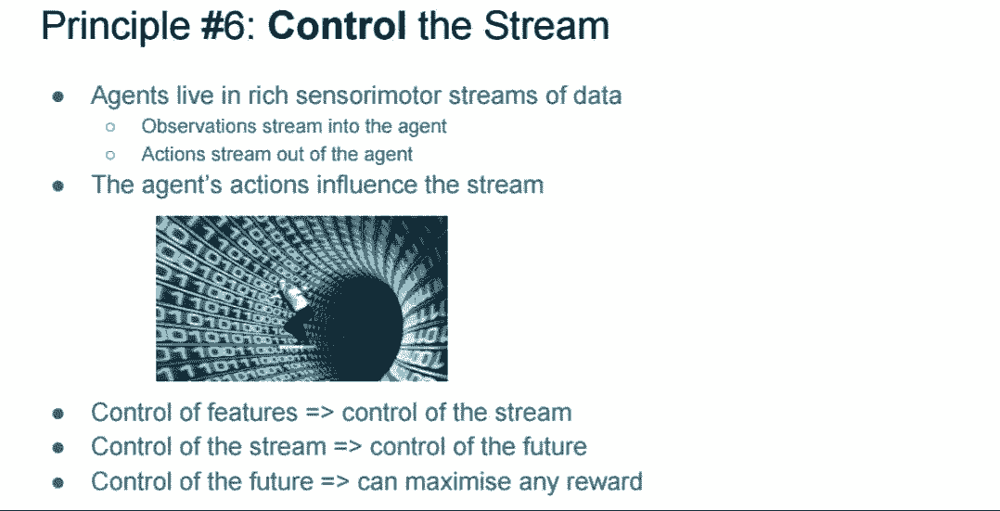

**原则七：用价值函数对环境建模**

David Silver 首先给出了使用价值函数的三个原因：

*   高效地对未来进行总结/缓存；

*   将规划过程简化为固定时间的查找，而不是进行指数时间量级的预测；

*   独立于时间步跨度进行计算和学习。

他指出，学习多个价值函数可以高效地建模环境的多个方面（控制状态流），包括随后的状态变量；还能在多个时间尺度上学习。他还提醒我们避免在过于简化的时间步上建模环境。

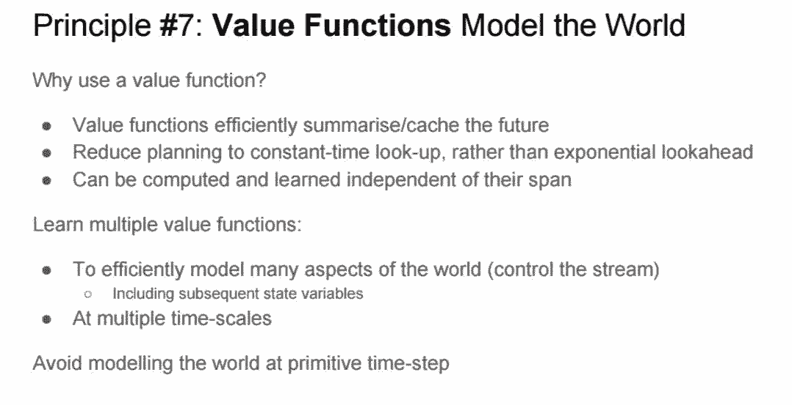

**原则八：规划：从想象的经验中学习**

David Silver 提出了一种有效的规划方法，并将其分为两步。首先想象下一步会发生什么，从模型中采样状态的轨迹；然后利用我们在真实经验中用过的 RL 算法从想象的经验中学习。他提醒我们从现在开始关注价值函数逼近。

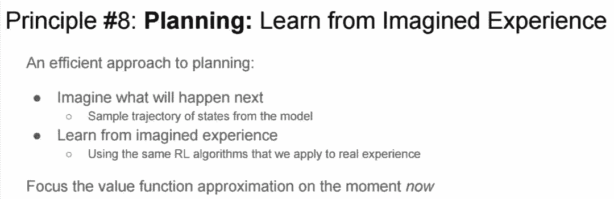

**原则九：使用函数近似器**

David Silver 认为，可微网络架构是一种强大的工具，可以丰富状态表示，同时使可微记忆、可微规划以及分层控制更加便利。他提出将算法复杂度引入网络架构，以减少算法复杂度（指参数的更新方式），增加架构的表达性（指参数的作用）。

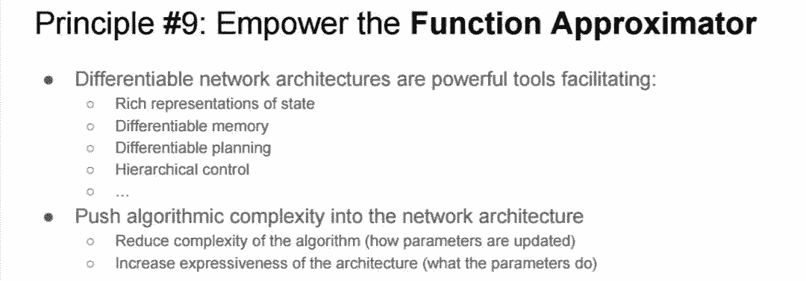

**原则十：学会学习**

AI 史是一个进步史：

*   第一代：旧式的 AI

*   手动预测：此时的人工智能只能执行手动预测

*   什么也学不会

*   第二代：浅层学习

*   手动构建特征：研究人员需要耗费大量时间、精力手动构建特征

*   学习预测

*   第三代：深度学习

*   手动构建的算法（优化器、目标、架构……）

*   端到端学习特征和预测

*   第四代：元学习

*   无需手工

*   端到端学习算法和特征以及预测

****本文为机器之心编译，**转载请联系本公众号获得授权****。**

✄------------------------------------------------

**加入机器之心（全职记者 / 实习生）：hr@jiqizhixin.com**

**投稿或寻求报道：**content**@jiqizhixin.com**

**广告 & 商务合作：bd@jiqizhixin.com**