# 教程 | 单级式目标检测方法概述：YOLO 与 SSD

选自 jeremyjordan.me

**作者****：****Jeremy Jordan**

**机器之心编译**

**参与：Panda**

> 目标检测是计算机视觉领域的基本研究问题之一，当前最常用的技术是卷积神经网络。机器学习工程师 Jeremy Jordan 近日发表了一篇博文，介绍了用于目标检测的单级式方法（包括 YOLO 和 SSD）。

在这篇文章中，我将概述用于基于卷积神经网络（CNN）的目标检测的深度学习技术。目标检测是很有价值的，可用于理解图像内容、描述图像中的事物以及确定目标在图像中的位置。

总体而言，目标检测包含两大类方法——要么是在网格上进行固定数量的预测（单级式）；要么是先使用一个提议网络寻找目标，然后再使用另一个网络来微调这些提议并输出最终预测结果（两级式）。

我将在本文中介绍用于目标检测的单级式方法；后面我还会发布一篇介绍两级式方法的文章。每种方法都有自己的优势和短板，我也将在各自的文章中谈到。

**目标检测任务**

目标检测的目标是识别一个预定义的目标类别集（比如 {人, 汽车, 自行车, 动物}）的实例并使用一个边界框描述图像中每个被检测出的目标。下图给出了两个示例：

*目标检测示例，来自 PASCAL VOC 数据集：http://host.robots.ox.ac.uk/pascal/VOC/*

我们一般使用矩形描述每个目标的位置，由于目标形状千差万别，所以定位结果可能并不完美。另一种可用方法是图像分割，这能提供像素级的定位。

**直接目标预测**

本文将主要关注单级式地直接预测图像中的目标边界框的模型架构。换句话说，其中没有必须执行的中间任务（我们后面会介绍的区域提议方案就有中间任务），就能得到输出结果。这种模型架构更简单、速度更快，但有时候并不能足够灵活地适应任意任务（比如掩码预测）。

**基于网格的预测**

为了理解图像中存在什么事物，我们将会将输入馈送通过一个标准的卷积神经网络以构建出原始图像的丰富特征表示。我们将这部分架构称为「骨干（backbone）」网络，这通常以图像分类器的形式进行了预训练，可以更便宜地学习从图像中提取特征的方式。这么做的原因是用于图像分类的数据更易于标准（因此成本更低），因为其仅需单个标签，而不需要为每张图像都定义边界框标注。因此，我们可以在一个非常大的有标注数据集（比如 ImageNet）上进行训练，以获得优良的特征表示。

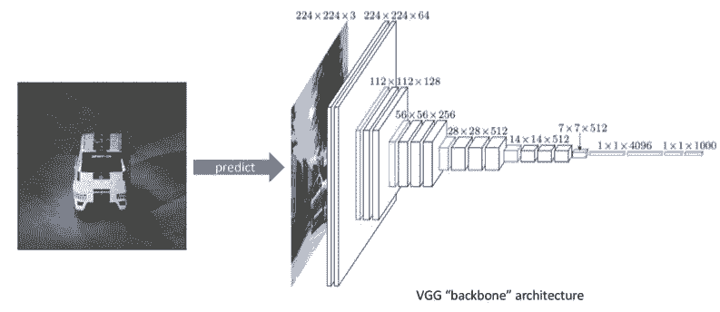

在以图像分类器的形式预训练了骨干架构之后，我们将移除网络的最后几层，以便我们的骨干网络能输出堆叠的特征图集合，它们以更低的空间分辨率描述了原图像，尽管它们有更高的特征（通道）分辨率。在下面的示例中，我们对我们的观察有一个 7x7x512 的表示。这 512 个特征图中的每一个都描述了原图像的不同特性。

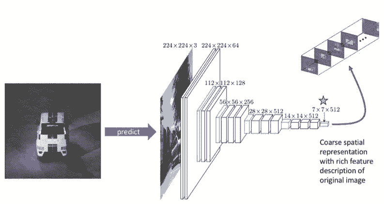

我们将这个 7x7 网格关联回原输入，以了解每个网格单元相对于原图像所代表的内容。

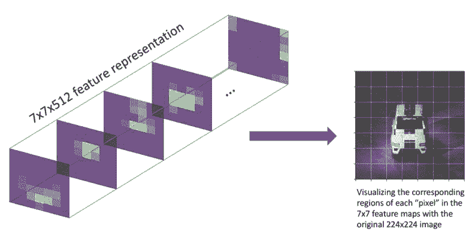

通过观察哪个网格单元包含我们的边界框标注的中心，我们还可以在粗略的（7x7）特征图中大致确定目标的位置。我们将把该网格单元指定为「负责」检测该特定目标的单元。

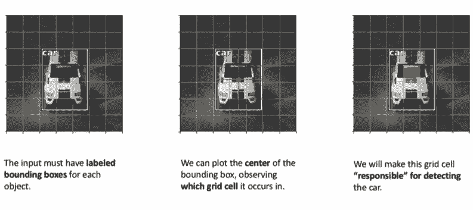

为了检测该目标，我们将添加另外一个卷积层并学习结合了所有 512 个特征图背景的核参数，以得到一个对应于包含目标的网格单元的激活。

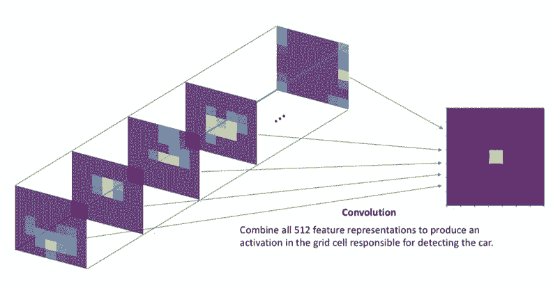

如果输入图像包含多个目标，那么在我们的网格上应该有多个激活，表示每个激活区域中都有一个目标。

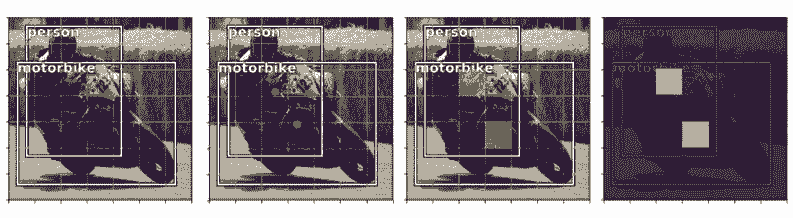

但是，我们不能使用单个激活就充分地描述每个目标。为了完整描述被检测出的目标，我们需要定义：

*   一个网格单元包含一个目标的可能（pobj）

*   该目标属于哪个类别（c1, c2, ..., cC）

*   四个边界框描述量，描述了标注框的 x 坐标、y 坐标、宽度和高度（tx, ty, tw, th）

因此，我们需要为上述属性中的每一个学习一个卷积过滤器，这样我们有 5+C 个输出通道来描述每个网格单元位置处的单个边界框。这意味着我们将学习一组权重来检查所有 512 个特征图，并且确定哪些网格单元很有可能包含目标、每个网格单元很可能出现哪种类别、以及如何描述每个网格单元中可能存在的目标的边界框。

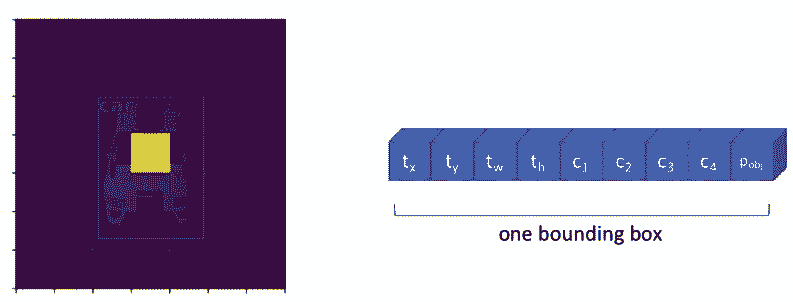

为了清楚说明，下面展示了应用 5+C 个卷积过滤器的完整输出，为每个网格单元都得到一个边界框描述量。

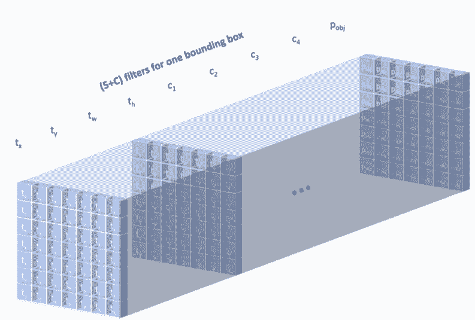

但是，某些图像可能有多个目标都「属于」同一网格单元。我们可以修改我们的层以得到 B(5+C) 个过滤器，这样我们就能为每个网格单元位置预测 B 个边界框了。

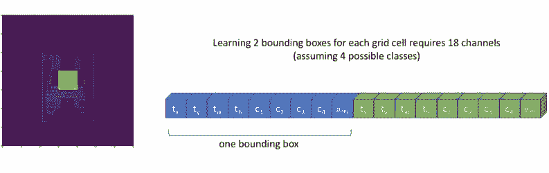

可视化我们的 B(5+C) 过滤器的完整卷积输出，我们可以看到我们的模型总是能为给定图像得到固定数量的 N×N×B 预测。然后我们可以过滤我们的预测，仅考虑 pobj 超过某个定义的阈值的边界框。

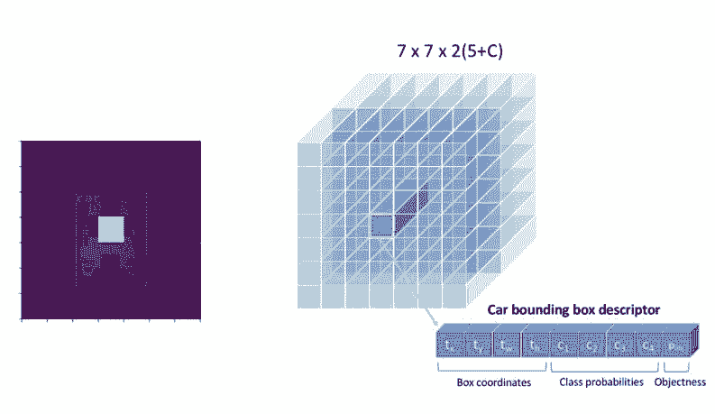

由于我们的检测过程的卷积本质，多个目标可以并行的方式被检测到。但是，我们最终还会预测到没有找到任何目标的大量网格单元。尽管我们可以通过这些边界框的 pobj 分数滤除它们，但这会在预测得到的包含目标和不包含目标的边界框之间引入相当大的不平衡。

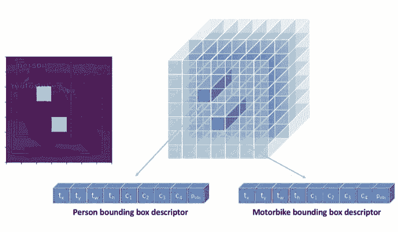

我下面将讨论的两种模型都使用了「基于网格进行预测」的概念来检测图像内固定数量的可能目标。在各自的章节，我都将描述每种方法的细微差别，并还会给出一些我曾经看到的细节，以便你能真正实现每种模型。

**非极大抑制（Non-Maximum Suppression）**

「基于网格进行预测」方法会为每张图像得到固定数量的边界框预测。但是，我们希望对这些预测进行过滤，以便仅输出图像中真正可能实际存在的目标的边界框。此外，对于每个被检测到的目标，我们都只想要一个边界框预测。

通过仅考虑 pobj 超过某个定义置信度阈值的预测，我们可以滤除大多数边界框预测。但是，我们可能仍有多个描述同一目标的高置信度预测。因此，我们需要一个方法来移除冗余的目标预测，以便每个目标都只用一个边界框描述。

要做到这一点，可使用一种被称为非极大抑制的技术。从高层面看，这个技术会检查高度重叠的边界框并抑制（即丢弃）除最高置信度预测外的所有预测。

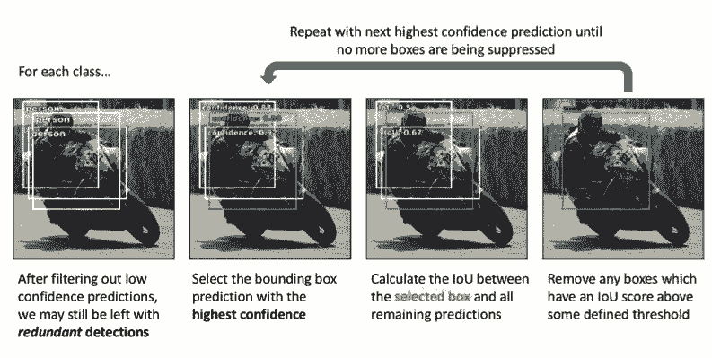

我们会为每一类都单独执行非极大抑制。同样，这里的目标是移除冗余的预测，所以如果有两个重叠度很高的边界框分别描述的是不同类别的目标（比如一个框描述人，一个框描述车），那么我们就不必担心。但是，如果两个重叠度很高的边界框都在描述人，那么很有可能这两个预测描述的是同一个人。

**YOLO：You Only Look Once**

YOLO 模型最早是由 Joseph Redmon 等人在 2015 年发布的，并在随后的两篇论文中进行了修订。在下面的每一小节中，我都会讨论具体的实现细节和用于提升性能表现的改进措施。

**骨干网络**

最早的 YOLO 网络使用了一个经过修改的 GoogLeNet 作为骨干网络。之后，Redmond 又创建了一个名为 DarkNet-19 的新模型，其遵循了 3×3 过滤器的一般设计，而将每个池化步骤的通道数量翻了一倍；整个网络中也使用了 1×1 过滤器来周期性压缩特征表示。他最新的论文又引入了一个更大的新模型 DarkNet-53，具有更优的性能表现。

所有这些模型都首先是作为图像分类器而进行预训练，之后再针对检测任务进行调整。在 YOLO 模型的第二个迭代版本中，Redmond 发现在分类预训练结束时使用更高分辨率的图像能够提升检测表现，因此也就采用这一操作方法。

将分类网络调整为检测网络只需要移除网络的最后几层，然后添加一个带有 B(5+C) 个过滤器的卷积层，以得出 N×N×B 的边界框预测。

**边界框（以及锚框概念）**

YOLO 模型的第一个迭代版本是直接预测描述一个边界框的所有 4 个值。每个边界框的 x 和 y 坐标都是相对每个网格单元的左上角定义的，并且根据单元尺寸进行了归一化，以便这些坐标值的范围在 0 到 1 之间。我们定义框宽度和高度的方式让我们的模型预测的是平方根宽度和高度；通过平方根值的形式定义框的宽度和高度，大数值之间的差会没有小数值之间的差那样显著（看看 的图就能确定这一点）。Redmond 选择这个形式是因为「小偏差在大框中的重要性比在小框中小」，因此，当我们计算我们的损失函数时，我们希望将重点放在更准确地得到小框上面。边界框的宽度和高度根据图像的宽和高进行归一化，因此取值也在 0 到 1 之间。训练过程中使用 L2 损失。

这种形式后来进行了修改，引入了边界框先验（bounding box prior）的概念。我们不再期望模型为每张新图像直接生成唯一的边界框描述量，而是定义一个边界框集合，其中的边界框有不同的宽高比，这些宽高比嵌入了某些关于我们预计会检测到的目标的形状的先验信息。Redmond 提供了一种用于发现最佳宽高比的方法，即在你的训练数据集中的所有边界框上执行 k-均值聚类（使用一个自定义的距离度量）。

在下图中，你可以看到针对中心黄色的网格单元的一个包含 5 个边界框先验（也被称为「锚框（anchor boxes）」）的集合。通过这种形式，B 个边界框中的每一个都能明确地专门检测特定尺寸和宽高比的目标。

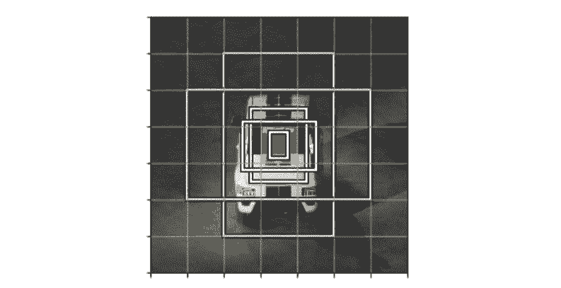

*注：尽管图中没有给出，但我们的预测网格中的每个单元都有这些锚框。*

我们不再直接预测边界框的尺寸，而是重新形式化了我们的任务，从而只需简单预测与我们的边界框先验尺寸的偏移量，这样我们就可以优化我们的预测边界框尺寸了。这种处理方式能让这一预测任务更容易学习。

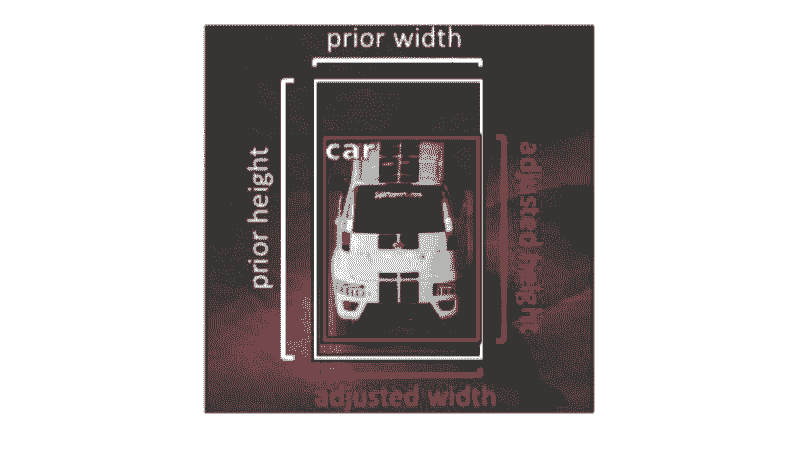

由于与原来的预测平方根宽度和高度相似的原因，我们将定义我们的任务来预测与我们的边界框先验的对数偏移量。

**目标度（以及将被标注的目标分配给一个边界框）**

在该模型的第一个版本中，「目标度（objectness）」分数 pobj 的训练目标是近似求取被预测框和基本真值标签之间的交并比（IoU）。当我们在训练过程中计算损失时，我们会将目标与有最高 IoU 分数的边界框预测（在同一个网格单元上）进行匹配。对于未匹配的框，我们会包含进我们的损失函数的唯一描述量是 pobj。

YOLOv2 加入了边界框先验之后，我们只需简单地将被标注出的目标分配给与该被标注目标有最高 IoU 分数的锚框（在同一个网格单元上）即可。

在第三个版本中，Redmond 重新定义了「目标度」目标分数 pobj，每个给定目标有最高 IoU 分数的边界框取值 1，其它所有框都为 0。但是，在计算损失时，我们将不会包含有较高 IoU 分数（超过某个阈值），但不是最高分数的边界框。简单来说，只是因为一个优良预测不是最佳预测就惩罚它是不合理的。

**类别标签**

最初的类别预测是在网格单元层面上执行的。这意味着单个网格单元不能预测不同类别的多个边界框。之后的修订版可以使用在类别和交叉熵损失上的 softmax 激活来预测每个边界框的类别。

Redmond 之后修改了类别预测，以使用 sigmoid 激活来进行多标签分类，因为他发现 softmax 不一定能得到优良表现。这个选择取决于你的数据集以及你的标签是否重叠（比如「金毛猎犬」和「狗」就有所重叠）。

**输出层**

第一个 YOLO 模型只是使用我们的骨干网络的输出预测 N×N×B 边界框。

在 YOLOv2 中，Redmond 添加了一个古怪的 skip 连接，将更高分辨率的特征图分到了多个通道上，如下图所示。

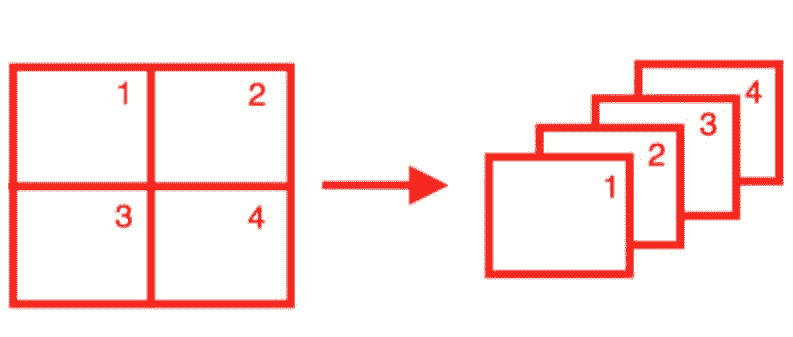

*我不喜欢这个奇怪的「从更高分辨率特征图的 skip 连接」思想。*

幸运的是，在第三个迭代版本中，这被改成了更标准的特征金字塔网络输出结构。使用这一方法，我们将在输出一个预测结果和上采样特征图（使用 skip 连接）之间交替。这允许预测能够利用网络更早期的更细粒度信息，这有助于检测图像中的小目标。

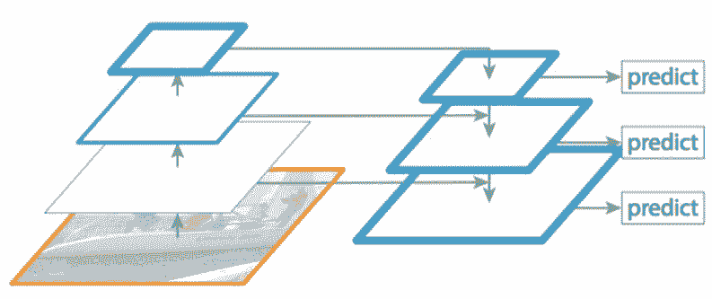

**SSD：Single Shot Detection**

SSD 模型也发表于 2015 年（Wei Liu et al.），就在 YOLO 模型发表后不久，并且也在后续论文中得到了改进。下面我会具体介绍该模型的实现细节。

**骨干网络**

其骨干网络是一个在 ImageNet 上针对图像分类预训练后的 VGG-16 模型。研究者对其进行了一些微调，使其能用于检测任务，其中包括：使用卷积实现替换全连接层、移除 dropout 层、使用一个扩张卷积替换最后的最大池化层。

**边界框（以及锚框概念）**

SSD 模型没有使用 k-均值聚类来发现宽高比，而是人工定义了一个宽高比集合（比如 {1, 2, 3, 1/2, 1/3}），以用于每个网格单元位置的 B 个边界框。

对于每个边界框，我们都会预测其在边界框坐标（x 和 y）以及尺寸（宽度和高度）上离锚框的偏移量。我们将使用通过一个 Smooth L1 损失训练的 ReLU 激活。

**目标度（以及将被标注的目标分配给一个边界框）**

YOLO 和 SSD 的一大主要区别是 SSD 不会试图为 pobj 预测一个值。YOLO 模型是在存在一个目标时预测目标的概率，然后再预测每个类别的概率，而 SSD 模型则试图直接预测一个类别存在于一个给定目标框中的概率。

在计算损失时，我们会将有最高 IoU 的每个基本真值框与锚框进行匹配——并将该框定义为「负责」做出预测的框。但是，我们也会将基本真值框与 IoU 超过某个定义阈值（0.5）的任何其它锚框进行匹配，从而不因为这些锚框并不是最佳的而惩罚这些优良预测。

**类别标签**

正如我之前提到的，SSD 边界框的最佳预测并不基于存在目标的事实。因此，我们是使用一个 softmax 激活和交叉熵损失来直接预测每个类别的概率。因为我们并不明确预测 pobj，所以有一个「背景」类别是很重要的，这样我们就能预测不存在目标的情况了。

由于事实上大多数框都将属于「背景」类别，所以我们将使用一种被称为「hard negative mining」的技术来采样负例（没有目标）预测，使得在计算我们的损失时最多只使用 3:1 比例的正例和负例预测。

**输出层**

为了能进行多个尺度的预测，SSD 输出模块会逐步对卷积特征图进行下采样，间歇性地得到边界框预测（如下图中从卷积层指向预测框的箭头所示）。

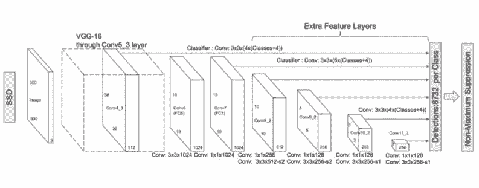

**使用焦点损失（Focal Loss）解决目标不平衡问题**

正如我之前提到的，我们常常最终会得到大量边界框，而由于我们的「基于网格进行预测」方法的本质，这些框往往不包含目标。尽管我们可以在得到一组固定的边界框预测后轻松滤除这些框，但仍然存在（前景—背景）类别不平衡的情况，这可能会给训练过程造成困难。对于不将目标度预测和类别概率预测分成两个独立任务，而是简单地为没有目标的区域设置一个「背景」类别的模型，困难尤其显著。

Facebook 的研究者提出向标准的交叉熵损失添加一个比例因子，以使其在训练过程中更加关注「困难的」样本，防止简单的负例预测主导训练过程。

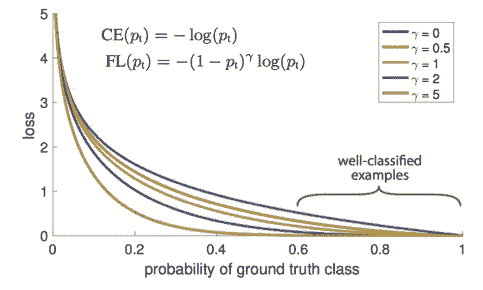

正如这些研究者指出的那样，能被轻松分类的样本会为标准的交叉熵损失带来非平凡损失（γ=0），这是在一个大样本集合上求和得到的，并能轻易主导参数更新。项是一个可调节的比例因子，以防止这种情况发生。

正如该论文指出的那样：「γ=2 时，pt=0.9 的分类样本的损失与 CE（交叉熵）相比低 100 倍，pt=0.968 时会低 1000 倍。」

**常见数据集和竞赛**

下面我列出了一些研究者在评估新的目标检测模型时常用的数据集：

*   PASCAL VOC 2012 检测竞赛：http://host.robots.ox.ac.uk/pascal/VOC/voc2012/index.html

*   COCO 2018 目标检测任务：http://cocodataset.org/#detection-2018 

*   ImageNet 目标检测挑战赛：https://www.kaggle.com/c/imagenet-object-detection-challenge

*   Google AI Open Images——目标检测：https://www.kaggle.com/c/google-ai-open-images-object-detection-track

*   视觉遇上无人机挑战：http://www.aiskyeye.com/views/index

**扩展阅读**

**论文**

*   YOLO：https://arxiv.org/abs/1506.02640

*   YOLO9000：https://arxiv.org/abs/1612.08242

*   YOLOv3：https://arxiv.org/abs/1804.02767

*   SSD：https://arxiv.org/abs/1512.02325

*   DSSD：https://arxiv.org/abs/1701.06659（本文中没有讨论，但值得一读）

*   用于密集目标检测的焦点损失：https://arxiv.org/abs/1708.02002

*   卷积神经网络的有趣失败和 CoordConv 解决方案：https://arxiv.org/abs/1807.03247（查看有关目标检测的相关章节）以及相关视频：https://www.youtube.com/watch?v=8yFQc6elePA

**讲座**

*   Stanford CS 231n：第 11 讲 | 检测和分割：https://www.youtube.com/watch?v=nDPWywWRIRo&t=1967s

**标注数据的工具**

*   CVAT：https://github.com/opencv/cvat

*原文链接：https://www.jeremyjordan.me/object-detection-one-stage/*

****本文为机器之心编译，**转载请联系本公众号获得授权****。**

✄------------------------------------------------

**加入机器之心（全职记者 / 实习生）：hr@jiqizhixin.com**

**投稿或寻求报道：**content**@jiqizhixin.com**

**广告 & 商务合作：bd@jiqizhixin.com**