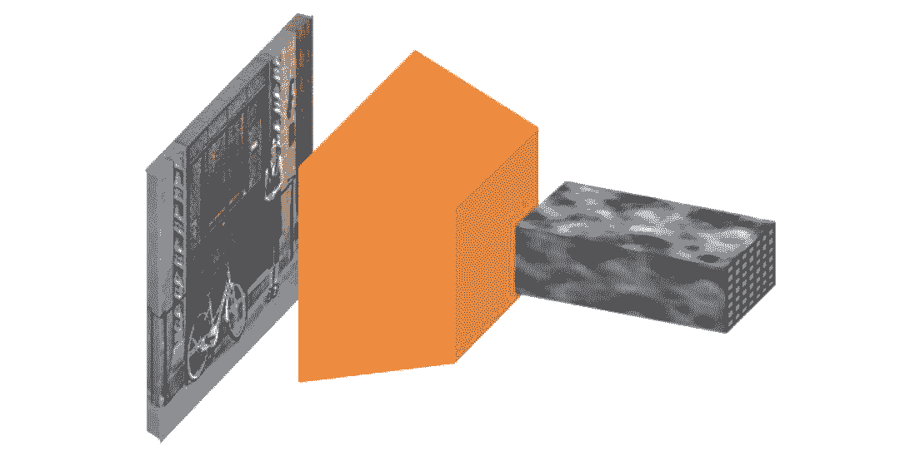
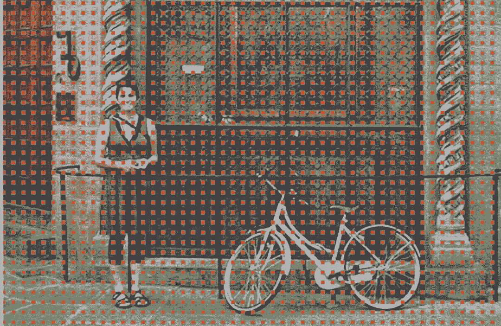
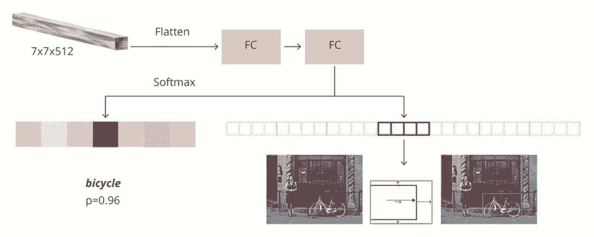

# 深度 | 像玩乐高一样拆解 Faster R-CNN：详解目标检测的实现过程

选自 tryolabs

**作者：****Matt Simon**

**机器之心编译**

> > 本文详细解释了 Faster R-CNN 的网络架构和工作流，一步步带领读者理解目标检测的工作原理，作者本人也提供了 Luminoth 实现，供大家参考。
> 
> *   Luminoth 实现：https://github.com/tryolabs/luminoth/tree/master/luminoth/models/fasterrcnn
>     
>     
> 
> 在阅读本文之前，若想了解 R-CNN 网络家族的发展，可以参看机器之心的文章：
> 
> [深度 | 用于图像分割的卷积神经网络：从 R-CNN 到 Mark R-CNN](http://mp.weixin.qq.com/s?__biz=MzA3MzI4MjgzMw==&mid=2650725842&idx=2&sn=e18500166c6108d7194588befba061a4&chksm=871b19acb06c90ba9c19ba73719d375c4fe1f378f9bccae82e508c34a20c7513c55a84d3441b&scene=21#wechat_redirect)
> 
> 去年，我们决定深入了解 Faster R-CNN，阅读原始论文以及其中引用到的其他论文，现在我们对其工作方式和实现方法有了清晰的理解。
> 
> 我们最终在 Luminoth 中实现了 Faster R-CNN，Luminoth 是基于 TensorFlow 的计算机视觉工具包，易于训练和监控，支持多种不同的模型。到目前为止，Luminoth 已经吸引了很大的关注，我们在 ODSC Europe 和 ODSC West 的论坛中也介绍过这个项目。
> 
> （ODSC，Open Data Science Conference，专注于开源数据科学的会议）。
> 
> 基于开发 Luminoth 的工作和过去的报告，我们认为把所有实现 Faster RCNN 的细节和相关链接整合到一篇博客中是一个不错的点子，这对未来其他对此领域感兴趣的人会很有意义。
> 
> **背景**
> 
> Faster R-CNN 最早在 2015 年的 NIPS 发布。其在发布后经历了几次修改，这在之后博文中会有讨论。Faster-RCNN 是 RCNN 系列论文的第三次迭代，这一系列论文的一作和联合作者是 Ross Girshick。
> 
> 这一切始于 2014 年的一篇论文「Rich feature hierarchies for accurate object detection and semantic segmentation」(R-CNN)，其使用了称为 Selective Search 的算法用来提取感兴趣候选区域，并用一个标准的卷积神经网络 (CNN) 去分类和调整这些区域。Fast R-CNN 从 R-CNN 演变优化而来，Fast R-CNN 发布于 2015 年上半年，其中一种称为感兴趣区域池化的技术，使得网络可以共享计算结果，从而让模型提速。这一系列算法最终被优化为 Faster R-CNN，这是第一个完全可微分的模型。
> 
> **框架**
> 
> Faster R-CNN 的框架由几个模块部件组成，所以其框架有些复杂。我们将从高层次的概述开始，之后会介绍不同组成部分的具体细节。
> 
> 从一张图片开始，我们将会得到：
> 
> *   一个边框列表
>     
>     
> *   每个边框会被分配一个标签
>     
>     
> *   每对标签和边框所对应的概率
>     
>     
> 
> 
> 
> *完整的 Faster R-CNN 框架*
> 
> 输入的图片以长×宽×高的张量形式表征，之后会被馈送入预训练好的卷积神经网络，在中间层得到特征图。使用该特征图作为特征提取器并用于下一流程。
> 
> 上述方法在迁移学习中经常使用，尤其在为小数据集训练分类器时，其通常取用了在另一个较大数据集训练好的权重。我们在下一章节会深入了解这个部分。接着，我们会使用到区域建议网络（Region Proposal Network，RPN）。使用 CNN 计算得到的特征，去寻找到预设好数量的可能包含目标的区域 (边框)。
> 
> 使用深度学习进行目标检测最大的困难可能是生成一个长度可变的边框列表。使用深度神经网络建模时，模型最后一部分通常是一个固定尺寸的张量输出（除了循环神经网络）。例如，在图片分类中，输出是 (N,) 形状的张量，N 是类别的数量，其中在第 i 个位置标量含有该图片属于类别 i 的概率。
> 
> RPN 中长度可变列表的问题可以使用锚点解决：使用固定尺寸的参考边框在原始图片上一致地定位。不是直接探测目标在哪，而是把问题分两个方面建模，对每个锚点，我们考虑：
> 
> *   这个锚点包含相关目标吗？
>     
>     
> *   如何调整锚点以更好的拟合到相关目标？
>     
>     
> 
> 可能会有点困扰，但是没关系，下面会深入了解。
> 
> 在取得一系列的相关目标和其在原始图片上的位置后，目标探测问题就可以相对直观地解决了。使用 CNN 提取到的特征和相关目标的边框，我们在相关目标的特征图上使用感兴趣区域池化 (RoI Pooling)，并将与目标相关的特征信息存入一个新的张量。之后的流程与 R-CNN 模型一致，利用这些信息：
> 
> *   对边框内的内容分类（或者舍弃它，并用「背景」标记边框内容）
>     
>     
> *   调整边框的坐标（使之更好地包含目标）
>     
>     
> 
> 显然，这样做会遗失掉部分信息，但这正是 Faster-RCNN 如何进行目标探测的基本思想。下一步，我们会仔细讨论框架、损失函数以及训练过程中各个组件的具体细节。
> 
> **基础网络**
> 
> 之前提到过，Faster R-CNN 第一步要使用在图片分类任务 (例如，ImageNet) 上预训练好的卷积神经网络，使用该网络得到的中间层特征的输出。这对有深度学习背景的人来说很简单，但是理解如何使用和为什么这样做才是关键，同时，可视化中间层的特征输出也很重要。没有一致的意见表明哪个网络框架是最好的。原始的 Faster R-CNN 使用的是在 ImageNet 上预训练的 ZF 和 VGG，但之后出现了很多不同的网络，且不同网络的参数数量变化很大。例如，MobileNet，以速度优先的一个小型的高效框架，大约有 330 万个参数，而 ResNet-152(152 层)，曾经的 ImageNet 图片分类竞赛优胜者，大约有 6000 万个参数。最新的网络结构如 DenseNet，可以在提高准确度的同时缩减参数数量。
> 
> **VGG**
> 
> 在讨论网络结构孰优孰劣之前，让我们先以 VGG-16 为例来尝试理解 Faster-RCNN 是如何工作的。
> 
> 
> 
> *VGG 网络结构*
> 
> VGG，其名字来自于在 ImageNet ILSVRC 2014 竞赛中使用此网络的小组组名，首次发布于论文」Very Deep Convolutional Networks for Large-Scale Image Recognition」, 作者是 Karen Simonyan 和 Andrew Zisserman。以今天的标准来看这个网络谈不上深度，但是在发布之际 VGG16 比当时常用的网络要多一倍的层数，其推动了「深度 → 更强大性能 → 更好结果」的浪潮（只要训练是可行的）。
> 
> 当使用 VGG 进行分类任务时，其输入是 224×224×3 的张量 (表示一个 224×224 像素大小的 RGB 图片)。在分类任务中输入图片的尺寸是固定的，因为网络最后一部分的全连接层需要固定长度的输入。在接入全连接层前，通常要将最后一层卷积的输出展开成一维张量。
> 
> 因为要使用卷积网络中间层的输出，所以输入图片的尺寸不再有限制。至少，在这个模块中不再是问题，因为只有卷积层参与计算。让我们深入了解一下底层的细节，看看具体要使用哪一层卷积网络的输出。Faster R-CNN 论文中没有具体指定使用哪一层；但是在官方的实现中可以观察到，作者使用的是 conv5/conv5_1 这一层 (caffe 代码)。
> 
> 每一层卷积网络都在前一层的信息基础上提取更加抽象的特征。第一层通常学习到简单的边缘，第二层寻找目标边缘的模式，以激活后续卷积网络中更加复杂的形状。最终，我们得到一个在空间维度上比原始图片小很多，但表征更深的卷积特征图。特征图的长和宽会随着卷积层间的池化而缩小，深度会随着卷积层滤波器的数量而增加。
> 
> 
> 
> *从图片到卷积特征图*
> 
> 卷积特征图将图片的所有信息编码到深度的维度上，同时保留着原始图片上目标物体的相对位置信息。例如，如果图片左上角有一个红色矩形，经过卷积层的激活，那么红色矩形的位置信息仍然保留在卷积特征图的左上角。
> 
> **VGG vs ResNet**
> 
> 如今，ResNet 已经取代大多数 VGG 网络作为提取特征的基础框架。Faster-RCNN 的三位联合作者 (Kaiming He, Shaoqing Ren 和 Jian Sun) 也是论文「Deep Residual Learning for Image (https://arxiv.org/abs/1512.03385) Recognition」的作者，这篇论文最初介绍了 ResNets 这一框架。
> 
> ResNet 对比 VGG 的优势在于它是一个更深层、大型的网络，因此有更大的容量去学习所需要的信息。这些结论在图片分类任务中可行，在目标探测的问题中也应该同样有效。
> 
> ResNet 在使用残差连接和批归一化的方法后更加易于训练，这些方法在 VGG 发布的时候还没有出现。
> 
> **锚点**
> 
> 现在，我们将使用处理过后的特征图并建议目标区域，也就是用于分类任务的感兴趣区域。之前提到过锚点是解决长度可变问题的一种方法，现在将详细介绍。
> 
> 我们的目标是寻找图片中的边框。这些边框是不同尺寸、不同比例的矩形。设想我们在解决问题前已知图片中有两个目标。那么首先想到的应该是训练一个网络，这个网络可以返回 8 个值：包含（xmin, ymin, xmax, ymax）的两个元组，每个元组都用于定义一个目标的边框坐标。这个方法有着根本问题，例如，图片可能是不同尺寸和比例的，因此训练一个可以直接准确预测原始坐标的模型是很复杂的。另一个问题是无效预测：当预测（xmin,xmax）和（ymin,ymax）时，应该强制设定 xmin 要小于 xmax，ymin 要小于 ymax。
> 
> 另一种更加简单的方法是去预测参考边框的偏移量。使用参考边框（xcenter, ycenter, width, height），学习预测偏移量（Δxcenter,Δycenter,Δwidth,Δheight），因此我们只得到一些小数值的预测结果并挪动参考变量就可以达到更好的拟合结果。
> 
> 锚点是用固定的边框置于不同尺寸和比例的图片上，并且在之后目标位置的预测中用作参考边框。
> 
> 我们在处理的卷积特征图的尺寸分别是 convwidth×convheight×convdepth，因此在卷积图的 convwidth×convheight 上每一个点都生成一组锚点。很重要的一点是即使我们是在特征图上生成的锚点，这些锚点最终是要映射回原始图片的尺寸。
> 
> 因为我们只用到了卷积和池化层，所以特征图的最终维度与原始图片是呈比例的。数学上，如果图片的尺寸是 w×h，那么特征图最终会缩小到尺寸为 w/r 和 h/r，其中 r 是次级采样率。如果我们在特征图上每个空间位置上都定义一个锚点，那么最终图片的锚点会相隔 r 个像素，在 VGG 中，r=16。
> 
> 
> 
> *原始图片的锚点中心*
> 
> 为了选择一组合适锚点，我们通常定义一组固定尺寸 (例如，64px、128px、256px，此处为边框大小) 和比例 (例如，0.5、1、1.5，此处为边框长宽比) 的边框，使用这些变量的所有可能组合得到候选边框 (这个例子中有 1 个锚点和 9 个边框)。
> 
> 
> 
> *左侧：锚点、中心：特征图空间单一锚点在原图中的表达，右侧：所有锚点在原图中的表达*
> 
> **区域建议网络**
> 
> 
> 
> *RPN 采用卷积特征图并在图像上生成建议。*
> 
> 像我们之前提到的那样，RPN 接受所有的参考框（锚点）并为目标输出一套好的建议。它通过为每个锚点提供两个不同的输出来完成。
> 
> 第一个输出是锚点作为目标的概率。如果你愿意，可以叫做「目标性得分」。注意，RPN 不关心目标的类别，只在意它实际上是不是一个目标（而不是背景）。我们将用这个目标性得分来过滤掉不好的预测，为第二阶段做准备。第二个输出是边框回归，用于调整锚点以更好的拟合其预测的目标。
> 
> RPN 是用完全卷积的方式高效实现的，用基础网络返回的卷积特征图作为输入。首先，我们使用一个有 512 个通道和 3x3 卷积核大小的卷积层，然后我们有两个使用 1x1 卷积核的并行卷积层，其通道数量取决于每个点的锚点数量。
> 
> 
> 
> *RPN 架构的卷积实现，其中 k 是锚点的数量。*
> 
> 对于分类层，我们对每个锚点输出两个预测值：它是背景（不是目标）的分数，和它是前景（实际的目标）的分数。
> 
> 对于回归或边框调整层，我们输出四个预测值：Δxcenter、Δycenter、Δwidth、Δheight，我们将会把这些值用到锚点中来得到最终的建议。
> 
> 使用最终的建议坐标和它们的目标性得分，然后可以得到一套很好的对于目标的建议。
> 
> **训练、目标和损失函数**
> 
> RPN 执行两种不同类型的预测：二进制分类和边框回归调整。为了训练，我们把所有的锚点分成两类。一类是「前景」，它与真实目标重叠并且其 IoU（Intersection of Union）值大于 0.5；另一类是「背景」，它不与任何真实目标重叠或与真实目标的 IoU 值 小于 0.1。
> 
> 然后，我们对这些锚点随机采样，构成大小为 256 的 mini batch——维持前景锚点和背景锚点之间的平衡比例。
> 
> RPN 用所有以 mini batch 筛选出来的锚点和二进制交叉熵（binary cross entropy）来计算分类损失。然后它只用那些标记为前景的 mini batch 锚点来计算回归损失。为了计算回归的目标，我们使用前景锚点和最接近的真实目标，并计算将锚点转化为目标所需的正确 Δ。
> 
> 论文中建议使用 Smooth L1 loss 来计算回归误差，而不是用简单的 L1 或 L2 loss。Smooth L1 基本上就是 L1，但是当 L1 的误差足够小，由确定的 σ 定义时，可以认为误差几乎是正确的且损失以更快的速率减小。
> 
> 使用 dynamic batches 是具有挑战性的，这里的原因很多。即使我们试图维持前景锚点和背景锚点之间的平衡比例，但这并不总是可能的。根据图像上的真实目标以及锚点的大小和比例，可能会得到零前景锚点。在这种情况下，我们转而使用对于真实框具有最大 IoU 值的锚点。这远非理想情况，但是为了总是有前景样本和目标可以学习，这还是挺实用的。
> 
> **后处理**
> 
> **非极大抑制（Non-maximum suppression）：**由于锚点经常重叠，因此建议最终也会在同一个目标上重叠。为了解决重复建议的问题，我们使用一个简单的算法，称为非极大抑制（NMS）。NMS 获取按照分数排序的建议列表并对已排序的列表进行迭代，丢弃那些 IoU 值大于某个预定义阈值的建议，并提出一个具有更高分数的建议。
> 
> 虽然这看起来很简单，但对 IoU 的阈值设定一定要非常小心。太低，你可能会丢失对目标的建议；太高，你可能会得到对同一个目标的很多建议。常用值是 0.6。
> 
> **建议选择：**应用 NMS 后，我们保留评分最高的 N 个建议。论文中使用 N=2000，但是将这个数字降低到 50 仍然可以得到相当好的结果。
> 
> **独立应用程序**
> 
> RPN 可以独立使用，而不需要第二阶段的模型。在只有一类对象的问题中，目标性概率可以用作最终的类别概率。这是因为在这种情况下，「前景」=「目标类别」以及「背景」=「不是目标类别」。
> 
> 一些从独立使用 RPN 中受益的机器学习问题的例子包括流行的（但仍然是具有挑战性的）人脸检测和文本检测。
> 
> 仅使用 RPN 的优点之一是训练和预测的速度都有所提高。由于 RPN 是一个非常简单的仅使用卷积层的网络，所以预测时间比使用分类基础网络更快。
> 
> **兴趣区域池化**
> 
> 在 RPN 步骤之后，我们有很多没有分配类别的目标建议。我们接下来要解决的问题就是如何将这些边框分类到我们想要的类别中。
> 
> 最简单的方法是采用每个建议，裁剪出来，然后让它通过预训练的基础网络。然后，我们可以用提取的特征作为基础图像分类器的输入。这种方法的主要问题是运行所有 2000 个建议的计算效率和速度都是非常低的。
> 
> Faster R-CNN 试图通过复用现有的卷积特征图来解决或至少缓解这个问题。这是通过用兴趣区域池化为每个建议提取固定大小的特征图实现的。R-CNN 需要固定大小的特征图，以便将它们分类到固定数量的类别中。
> 
> 
> 
> *兴趣区域池化*
> 
> 一种更简单的方法（被包括 Luminoth 版本的 Faster R-CNN 在内的目标检测实现方法所广泛使用），是用每个建议来裁剪卷积特征图，然后用插值（通常是双线性的）将每个裁剪调整为固定大小（14×14×convdepth）。裁剪之后，用 2x2 核大小的最大池化来获得每个建议最终的 7×7×convdepth 特征图。
> 
> 选择这些确切形状的原因与下一模块（R-CNN）如何使用它有关，这些设定是根据第二阶段的用途得到的。
> 
> **基于区域的卷积神经网络**
> 
> 基于区域的卷积神经网络（R-CNN）是 Faster R-CNN 工作流的最后一步。从图像上获得卷积特征图之后，用它通过 RPN 来获得目标建议并最终为每个建议提取特征（通过 RoI Pooling），最后我们需要使用这些特征进行分类。R-CNN 试图模仿分类 CNNs 的最后阶段，在这个阶段用一个全连接层为每个可能的目标类输出一个分数。
> 
> **R-CNN 有两个不同的目标：**
> 
> 1\. 将建议分到一个类中，加上一个背景类（用于删除不好的建议）。
> 
> 2\. 根据预测的类别更好地调整建议的边框。
> 
> 在最初的 Faster R-CNN 论文中，R-CNN 对每个建议采用特征图，将它平坦化并使用两个大小为 4096 的有 ReLU 激活函数的全连接层。
> 
> 然后，它对每个不同的目标使用两种不同的全连接层：
> 
> *   一个有 N+1 个单元的全连接层，其中 N 是类的总数，另外一个是背景类。
>     
>     
> *   一个有 4N 个单元的全连接层。我们希望有一个回归预测，因此对 N 个类别中的每一个可能的类别，我们都需要 Δcenterx、Δcentery、Δwidth、Δheight。
>     
>     
> 
> 
> 
> *R-CNN 架构*
> 
> **训练和目标**
> 
> R-CNN 的目标与 RPN 的目标的计算方法几乎相同，但是考虑的是不同的可能类别。我们采用建议和真实边框，并计算它们之间的 IoU。
> 
> 那些有任何真实边框的建议，只要其 IoU 大于 0.5，都被分配给那个真实数据。那些 IoU 在 0.1 和 0.5 之间的被标记为背景。与我们在为 RPN 分配目标时相反的是，我们忽略了没有任何交集的建议。这是因为在这个阶段，我们假设已经有好的建议并且我们对解决更困难的情况更有兴趣。当然，这些所有的值都是可以为了更好的拟合你想找的目标类型而做调整的超参数。
> 
> 边框回归的目标是计算建议和与其对应的真实框之间的偏移量，仅针对那些基于 IoU 阈值分配了类别的建议。
> 
> 我们随机抽样了一个尺寸为 64 的 balanced mini batch，其中我们有高达 25% 的前景建议（有类别）和 75% 的背景。
> 
> 按照我们对 RPN 损失所做的相同处理方式，现在的分类损失是一个多类别的交叉熵损失，使用所有选定的建议和用于与真实框匹配的 25% 建议的 Smooth L1 loss。由于 R-CNN 边框回归的全连接网络的输出对于每个类都有一个预测，所以当我们得到这种损失时必须小心。在计算损失时，我们只需要考虑正确的类。
> 
> **后处理**
> 
> 与 RPN 相似，我们最终得到了很多已经分配了类别的目标，在返回它们之前需要进一步处理。
> 
> 为了实施边框调整，我们必须考虑哪个类别具有对该建议的最高概率。我们也需要忽略具有最高概率的背景类的建议。
> 
> 在得到最终目标和忽略被预测为背景的目标之后，我们应用基于类的 NMS。这通过按类进行分组完成，通过概率对其排序，然后将 NMS 应用于每个独立的组。
> 
> 对于我们最后的目标列表，我们也可以设置一个概率阈值并且对每个类限制目标的数量。
> 
> **训练**
> 
> 在最初的论文中，Faster R-CNN 是用多步法训练的，独立地训练各部分并且在应用最终的全面训练方法之前合并训练的权重。之后，人们发现进行端到端的联合训练会带来更好的结果。
> 
> 把完整的模型放在一起后，我们得到 4 个不同的损失，两个用于 RPN，另外两个用于 R-CNN。我们在 RPN 和 R-CNN 中有可训练的层，我们也有可以训练（微调）或不能训练的基础网络。
> 
> 是否训练基础网络的决定取决于我们想要学习的目标特性和可用的计算能力。如果我们想检测与在原始数据集（用于训练基础网络）上的数据相似的目标，那么除了尝试压缩我们能获得的所有可能的性能外，其他做法都是没有必要的。另一方面，为了拟合完整的梯度，训练基础网络在时间和必要的硬件上都是昂贵的。
> 
> 用加权和将四种不同的损失组合起来。这是因为相对于回归损失，我们可能希望给分类损失更大的权重，或者相比于 RPN 可能给 R-CNN 损失更大的权重。
> 
> 除了常规的损失之外，我们也有正则化损失，为了简洁起见，我们可以跳过这部分，但是它们在 RPN 和 R-CNN 中都可以定义。我们用 L2 正则化一些层。根据正在使用哪个基础网络，以及如果它经过训练，也有可能进行正则化。
> 
> 我们用随机梯度下降的动量算法训练，将动量值设置为 0.9。你可以轻松的用其他任何优化方法训练 Faster R-CNN，而不会遇到任何大问题。
> 
> 学习率从 0.001 开始，然后在 50K 步后下降到 0.0001。这是通常最重要的超参数之一。当用 Luminoth 训练时，我们经常从默认值开始，并以此开始做调整。
> 
> **评估**
> 
> 在一些特定的 IoU 阈值下，使用标准平均精度均值（mAP）来完成评估（例如，mAP@0.5）。mAP 是源于信息检索的度量标准，并且常用于计算排序问题中的误差和评估目标检测问题。
> 
> 我们不会深入讨论细节，因为这些类型的度量标准值得用一篇完整博客来总结，但重要的是，当你错过了你应该检测到的框，以及当你发现一些不存在的东西或多次检测到相同的东西时，mAP 会对此进行惩罚。
> 
> **结论**
> 
> 到目前为止，你应该清楚 Faster R-CNN 的工作方式、设计目的以及如何针对特定的情况进行调整。如果你想更深入的了解它的工作原理，你应该看看 Luminoth 的实现。
> 
> Faster R-CNN 是被证明可以用相同的原理解决复杂的计算机视觉问题的模型之一，在这个新的深度学习革命刚开始的时候，它就展现出如此惊人的结果。
> 
> 目前正在建立的新模型不仅用于目标检测，还用于基于这种原始模型的语义分割、3D 目标检测等等。有的借用 RPN，有的借用 R-CNN，还有的建立在两者之上。因此，充分了解底层架构非常重要，从而可以解决更加广泛的和复杂的问题。
> 
> *原文地址： https://tryolabs.com/blog/2018/01/18/faster-r-cnn-down-the-rabbit-hole-of-modern-object-detection/*
> 
> ****本文为机器之心编译，**转载请联系本公众号获得授权****。**
> 
> ✄------------------------------------------------
> 
> **加入机器之心（全职记者/实习生）：hr@jiqizhixin.com**
> 
> **投稿或寻求报道：editor@jiqizhixin.com**
> 
> **广告&商务合作：bd@jiqizhixin.com**