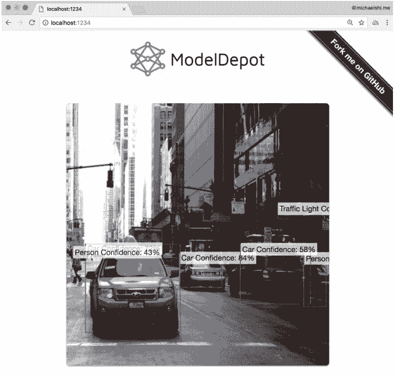

# 教程 | 用摄像头和 Tensorflow.js 在浏览器上实现目标检测

选自 Medium

**作者：****Mike Shi**

**机器之心编译**

**参与：Pedro、刘晓坤**

> Tensorflow.js 是一个能在你的浏览器里运行的全新深度学习库。本文将会介绍从原生 Tiny YOLO Darknet 模型到 Keras 的转换，再到 Tensorflow.js 的转换，如何利用其作一些预测，在编写 Tensorflow.js 遇到的一些问题，以及介绍使用联网摄像头/图像轻松地进行预测检测。

项目地址：https://github.com/ModelDepot/tfjs-yolo-tiny

**YOLO9000：更好，更快，更强**


严格意义上来讲这才是原文的标题。我们将会使用 Tiny YOLO，一个快速的、能在 200 FPS 下运行的目标检测模型。我们将会使用 Tiny YOLO 而非完整的 YOLOv2。为什么？首先，YOLOv2 只在功能强大的桌面级设备上以 40 帧每秒的速度运行，而这个条件大多数用户都达不到。同时，YOLOv2 的模型文件是 Tiny YOLO 的五倍大，这将会导致网络卡死。最后，YOLOv2 有一个暂时不被原生 Tensorflow.js 支持的重组层（reorg layer）。下一步，我们将重点放在 Tiny YOLO 的网络配置（神经网络结构）以及权重上。

**YAD2K：又一个 DARKNET 2 KERAS（转换器）**

你可能已经注意到 YOLO 是用 Darknet 编写的，而 Darknet 听起来和 Tensorflow 没什么关系。所以我们的第一步就是将 YOLO 模型转换为更加 Tensorflow 式的东西，在我们的例子中，这个东西是 Keras。Keras 是一个更高级的深度学习框架。我们推荐使用此种方式（https://js.tensorflow.org/tutorials/import-keras.html）将你的权重转换为 Tensorflow.js 的格式。

我们将会使用 YAD2K 来将 Darknet 模型转换为 Keras 模型。请按照此处的教程来安装 YAD2K（https://github.com/allanzelener/YAD2K#installation）。

当然了，你也可以假装你已经安装好了然后使用我已经给出的最终权重文件（https://modeldepot.io/mikeshi/tiny-yolo-in-javascript），但是这样的话你会失去不少乐趣！

现在，我们将要修复 YAD2K 里的一个 Bug 来正确加载 Tiny YOLO。

用你最喜欢的文本编辑器打开 yad2k.py，在第 83 行，将 buffer=weights_file.read(16) 改为 buffer=weights_file.read(20)。为什么？现在毫无头绪。

现在在你的电脑终端运行下列指令。这些指令会下载 Tiny YOLO 权重以及配置文件同时会将转换后的模型文件输出到 model_data/yolov2-tiny.h5。

```py
wget https://pjreddie.com/media/files/yolov2-tiny.weights
wget https://raw.githubusercontent.com/pjreddie/darknet/master/cfg/yolov2-tiny.cfg
./yad2k.py yolov2-tiny.cfg yolov2-tiny.weights model_data/yolov2-tiny.h5

```

之后，我们要保证新模型能运转起来。一个有趣的事实是：之前我忘了做这一步然后我花了一整天纠结为什么 Tensorflow.js 不工作。

```py
./test_yolo.py model_data/yolov2-tiny.h5

```

这个模型会输出一些预测。


**TENSORFLOW.JS 转换器：我们最后的权重转换方式**

这一步更加简单，我保证！查看此处的官方指导（https://js.tensorflow.org/tutorials/import-keras.html）。我已经把所有的难题解决了，所以如果你还觉得这些看起来太多了的话，你可以直接跳过这一步。

我们将要安装官方转换工具。在终端运行 pip install tensorflowjs 指令来安装转换器。

现在要转换我们的模型，再次使用终端！

```py
tensorflowjs_converter --input_format keras \
    model_data/yolov2-tiny.h5 \
    tfjs_model_data

```

现在我们终于将模型文件转移到 tfjs_model_data 中去了！注意，那个文件夹还包含了 model.json 以及一些其他的碎片文件。model.json 告诉 Tensorflow.js 神经网络的结构是怎样的以及哪些碎片文件与哪些权重相对应。这些碎片文件包含了模型的权重。要保证这些碎片文件和 model.json 在同一个目录下，不然你的模型将会无法正确加载。

**Tensorflow.js **

现在，我们到了有趣的部分。我们将同时处理 ML 和 JS 代码！

首先，我们导入 Tensorflow 然后加载模型。

```py
import * as tf from ‘@tensorflow/tfjs’;
const model = await tf.loadModel(url);

```

等等，什么是'url'？你可以使用此处的托管模型文件（https://raw.githubusercontent.com/MikeShi42/yolo-tiny-tfjs/master/model2.json）或者把路径加到你转换后的文件中去。

完美，现在我们做些真正的深度学习了：

```py
function yolo (input) {
   return model.predict(input);
}

```

啊哈。这看起来好像也没什么特别的，等等。我们忘了将输出转换成边框、分类标签以及概率！


**将数字转换为边框以及数字**

我不准备深入探讨这个话题，因为对 YOLO 的后处理可以拿来单独写几篇博客了。相反，我会专注于我在将 Python 版本转换到 Javascript 时遇到的难题。

1\. 一部分张量操作不可行。

Tensorflow.js 还很年轻，因此有一些功能暂时不可用，例如 boolean mask 以及 NMS。你可能也会遇到这样的问题，不过幸运的是你可以绕过它，通过下列方式：

```py
const expected_shape = tensor.shape;
const data = await tensor.data(); // Async transfer from GPU to CPU
// Note: data is a flattened TypedArray of the original tensor
//... data manipulation in JS on CPU
tf.tensor1d(data).reshape(expected_shape); // Shape it back into where we were before
```

2\. 你不能像 Python 那样使用 -1 索引

在 python 中，你可以使用 -1 作为「最后一个元素」。不幸的是，在 Tensorflow.js 中，如果你在 tf.slice 上尝试这样操作，它只会默默地失败。

3\. 你不能使用 5d 张量

注意，Tensorflow,js 的 WebGL 后端不支持 5d 张量。既然无法想象五维的样子，为什么还要使用它们？在 YOLO 中我们将输出重塑为 [batch_size，xy，wh，box_confidence，box_class_pred]。这个很显然是五维的。幸运的是，为了避免这些麻烦，我删除了 batch_size。另一种做法是不将输出重塑为 5d 张量。但是有些细节还需要谨慎处理。

除此之外，我的使用体验是连贯的。我只需要重新实现两个通常情况下 Tensorflow 不使用的 CPU 算法（传统 JS）。

**NPM 安装**

现在把我们的深度学习应用到程序中去吧！

幸运的是，有人已经写好了代码，所以只需在终端安装 NPM 即可：

```py
npm i tfjs-yolo-tiny

```

然后我们再稍微利用一下 Javascript：

```py
import yolo, { downloadModel } from ‘tfjs-yolo-tiny’;
const model = await downloadModel();
const inputImage = webcam.capture();
const boxes = await yolo(inputImage, model);

```

哇，你说的这个 webcam.capture() 是什么？



**除了 NPM 的安装之外...**

你可能已经注意到我们还没有关注过输入到我们的 YOLO 中的到底是什么。这也是 Tensorflow.js 最棒的部分之一。

我们可以从文件（DOM）中取出视频或者图像然后将其转换为一个张量！

我们可以用 Javascript 写下这些：

```py
import yolo, { downloadModel } from ‘tfjs-yolo-tiny’;
const model = await downloadModel();
const inputImage = webcam.capture();
const boxes = await yolo(inputImage, model);

```

棒！现在可以将图像作为张量输入！之后，从图像切换到网络摄像头，你只需将其指向正确的元素即可。这对我来说很神奇。

在这之后，我们要做一些预处理。在这种情况下，将其裁剪为正方形，调整大小为 416x416，然后除以 255 得到大小范围从 0 到 1 的像素值。

**最后的一些想法**

我们已经介绍了如何将模型转换为 Tensorflow.js 格式，加载模型并用它进行预测。然后，我们探讨了在 Tensorflow.js 中编写后处理代码的一些难题，但我们解决了这些问题。现在我们知道如何通过静态图像或网络摄像头抓取数据，可以将大多数 ML 模型从 Python 转换为 Tensorflow.js 并在浏览器中运行它们。

*原文地址：https://towardsdatascience.com/deep-learning-in-your-browser-a-brisk-guide-ca06c2198846*

****本文为机器之心编译，**转载请联系本公众号获得授权****。**

✄------------------------------------------------

**加入机器之心（全职记者/实习生）：hr@jiqizhixin.com**

**投稿或寻求报道：editor@jiqizhixin.com**

**广告&商务合作：bd@jiqizhixin.com**