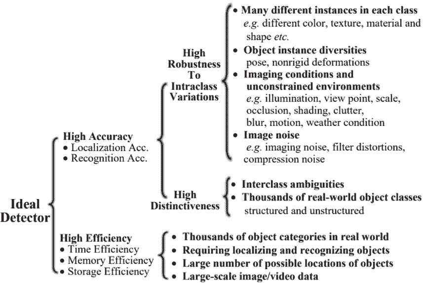
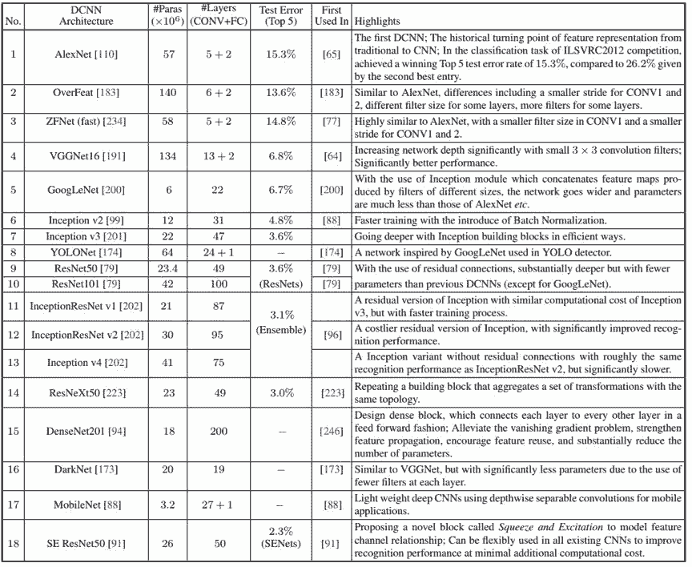
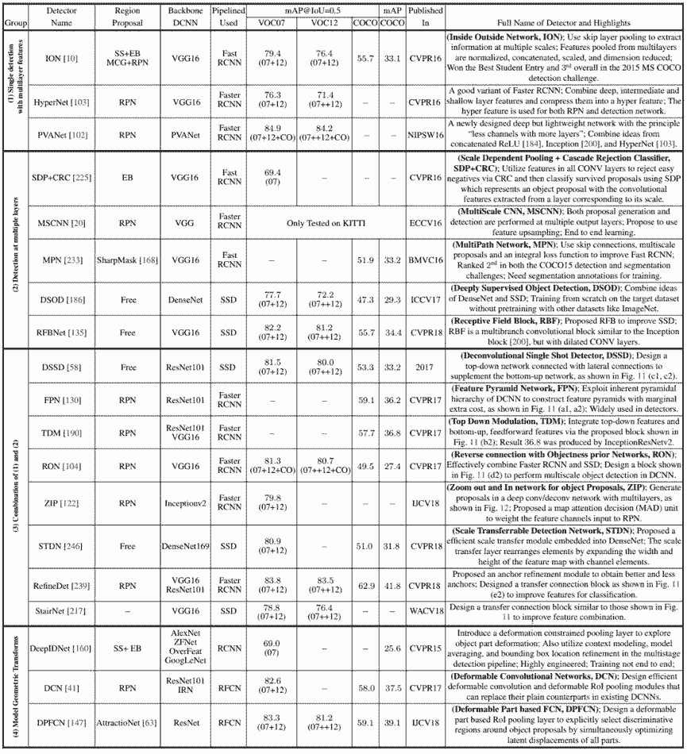
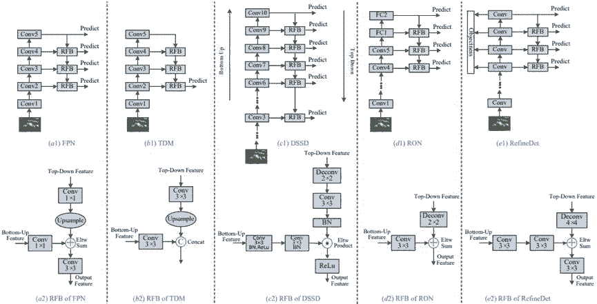
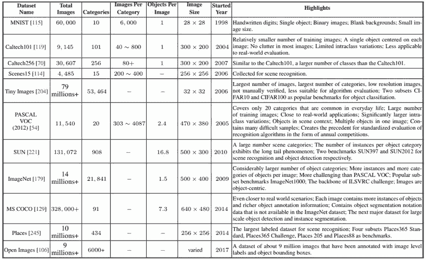

# 从 R-CNN 到 RFBNet，目标检测架构 5 年演进全盘点

选自 arXiv

**作者：Li Liu, Wanli Ouyang, Xiaogang Wang, Paul Fieguth, Jie Chen, Xinwang Liu, Matti Pietikäinen**

**机器之心编译**

**参与：Panda**

> 目标检测是计算机视觉领域的基本且重要的问题之一，而「一般目标检测」则更注重检测种类广泛的自然事物类别。近日，中国国防科技大学、芬兰奥卢大学、澳大利亚悉尼大学、香港中文大学、加拿大滑铁卢大学的研究者在 arXiv 发布了一篇综述论文，对用于一般目标检测的深度学习技术进行了全面系统的总结。机器之心选取了其中部分内容进行介绍，更详细的内容请参阅原论文。

此外，来自首尔国立大学的 Lee hoseong 在近期开源了「deep learning object detection」GitHub 项目，正是参考该论文开发的。该项目集合了从 2013 年 11 月提出的 R-CNN 至在近期举办的 ECCV2018 上发表的 RFBNet 等四十多篇关于目标检测的论文，相当全面。这些论文很多都曾发表在机器学习或人工智能顶会上，如 ICLR、NIPS、CVPR、ICCV、ECCV 等。正如图中红色字体标示的那样，其中也包含了很多代表性的成果，如从 R-CNN 到 Mask R-CNN 的 R-CNN 系列、YOLO 系列、RPN、SSD、FPN 以及 RetinaNet 等。无论对刚入门的机器学习新手，还是想深入研究目标检测的研究者，都是难得的学习、参考资源。

不仅如此，项目作者还给出了相应的完整资源列表，包括论文、官方/非官方实现。

心动的小伙伴还不快 Star、Fork 一下：https://github.com/hoya012/deep_learning_object_detection#2014

论文地址：https://arxiv.org/abs/1809.02165

一般目标检测（generic object detection）的目标是根据大量预定义的类别在自然图像中确定目标实例的位置，这是计算机视觉领域最基本和最有挑战性的问题之一。近些年兴起的深度学习技术是一种可从数据中直接学习特征表示的强大方法，并已经为一般目标检测领域带来了显著的突破性进展。在这个发展迅速的时期，本论文的目标是全面概括近期由深度学习技术为该领域所带来的发展成果。这份综述论文包含超过 250 项关键贡献，覆盖了一般目标检测研究的许多方面：领先的检测框架、基础性的子问题（包括目标特征表示、目标提议生成、形境信息建模和训练策略）、评估问题（尤其是基准数据集、评估指标和当前最佳表现）。最后，我们会指出有研究潜力的未来研究方向。

**1 引言**

目标检测是计算机视觉领域内一个长期存在的基础性难题，几十年来也一直都是一个活跃的研究领域。目标检测的目标是确定某张给定图像中是否存在给定类别（比如人、车、自行车、狗和猫）的目标实例；如果存在，就返回每个目标实例的空间位置和覆盖范围（比如返回一个边界框 [53, 179]）。作为图像理解和计算机视觉的基石，目标检测是解决分割、场景理解、目标追踪、图像描述、事件检测和活动识别等更复杂更高层次的视觉任务的基础。目标检测在人工智能和信息技术的许多领域都有广泛的应用，包括机器人视觉、消费电子产品、安保、自动驾驶、人机交互、基于内容的图像检索、智能视频监控和增强现实。

近来迅猛发展的深度学习技术 [81,116] 是一类能自动从数据中学习特征表示的强大方法。特别需要指出，这些技术已经显著改善了目标检测的表现，这个问题在过去五年中得到了很大的关注，即便之前心理物理学家、神经科学家和工程师已经研究了这个问题数十年时间。

目标检测可以分为两种类型 [69, 240]：特定实例检测和特定类别检测。前者的目标是检测一个特定目标的实例（比如唐纳德·特朗普的脸、五角大楼建筑或我的狗 Penny），而后者的目标则是检测预定义目标类别的不同实例（比如人、车、自行车和狗）。历史上，目标检测领域的很多研究都关注的是单个类别（比如人脸或行人）或少数几个特定类别的检测。而过去几年中，研究界则已经开始向构建通用型目标检测系统的艰难目标迈进，以让目标检测的范围能与人类比肩。

但是在 2012 年，Krizhevsky et al. [109] 提出的深度卷积神经网络（DCNN）AlexNet 在大规模视觉识别挑战赛（ILSRVC）[179] 上实现了创纪录的图像分类准确度。自那以后，许多计算机视觉应用领域都将研究重心放在了深度学习方法上。在一般目标检测领域涌现出了很多基于深度学习的方法 [65, 77, 64, 183, 176]，也取得了很大的研究进展，然而我们仍还没有对过去五年一般目标检测主题的全面总结。本论文聚焦于这段快速发展的时间，特别重点关注了基于深度学习的一般目标检测，以呈现出更明晰的一般目标检测全景。

一般目标检测问题本身的定义为：给定任意一张图像，确定其中是否存在任何预定义类别的形义目标实例；如果存在，就返回其空间位置和覆盖范围。目标（object，也可译为「对象」或「物体」）是指可以被看见和触碰的有形事物。尽管一般目标检测和目标类别检测有很多共同的含义，但前者更注重旨在检测种类广泛的自然事物类别的方法，而后者则主要针对特定目标实例或特定类别（比如人脸、行人或车）。一般目标检测已经得到了很大的关注，我们也能从近些年的目标识别竞赛上看出这一点，比如 2006-2012 年的 PASCAL VOC 检测挑战赛 [53, 54]，2013 年的 ILSVRC 大规模检测挑战赛 [179] 以及自 2015 年以来的 MS COCO 大规模检测挑战赛 [129]。图 1 展示了近些年目标检测方面的引人注目的进展。

*图 1：近些年目标检测表现的发展演进。可以看到，自 2012 年深度学习入场之后，目标检测表现（均值平均精度/mAP）提升显著。最佳检测器的表现每年都有稳定的显著提升。（a）在 PASCAL VOC 数据集上的结果：在 VOC 2007-2012 竞赛中获胜方法的检测结果（仅使用竞赛提供的训练数据）。（b）ILSVRC 2013-2017 中最佳的目标检测竞赛结果（仅使用竞赛提供的训练数据）。*

**2 背景**

**2.1 问题**

一般目标检测（即一般目标类别检测）也被称为目标类别检测 [240] 或目标分类检测，其定义如下。给定一张图像，确定其中是否存在多个预定义类别的任何目标实例；如果存在，就返回每个实例的空间位置和覆盖范围。

*图 3：与一般目标检测相关的识别问题。（a）图像层面的目标分类，（b）边界框层面的一般目标检测，（c）像素层面的形义分割，（d）实例层面的形义分割*

**2.2 主要难题**

 ***图 4：一般目标检测中的难题概览*

**2.3 过去二十年的进展**

*图 2：目标检测和识别的里程碑，包括特征表示 [37, 42, 79, 109, 114, 139, 140, 166, 191, 194, 200, 213, 215]、检测框架 [56, 65, 183, 209, 213] 和数据集 [53, 129, 179]。在 2012 年之前，主导方法都还是人工设计的特征。我们看到，随着 Krizhevsky et al. [109] 为图像分类开发出了 DCNN，2012 年迎来了转折。这里列出的大多数方法都得到了大量引用并至少赢得了一个 ICCV 或 CVPR 的主要奖项。详见 2.3 节。*

**3 框架**

用于识别的目标特征表示和分类器一直以来都在稳步发展，从人工设计特征 [213, 42, 55, 76, 212] 到学习 DCNN 特征的重大变化也证明了这一点 [65, 160, 64, 175, 40]。

相对而言，用于定位的基本「滑动窗口」策略 [42, 56, 55] 仍还是主流，尽管 [113, 209] 也做出了一些努力。但是窗口的数量很大，而且会随像素数量呈二次增长，而且搜索多个尺度和宽高比的需求还会进一步增大搜索空间。巨大的搜索空间会导致高度的计算复杂度。因此，有效且高效的检测框架设计具有关键性作用。经常采用的策略包括级联、共享特征计算和降低每个窗口的计算量。

在这一节，我们会回顾一般目标检测领域在深度学习进入这一领域后出现的里程碑检测框架，如图 6 所示，详细情况总结在表 10 中。过去几年中提出的几乎所有检测器都基于其中一种里程碑检测器，试图在一个或多个方面实现改进。整体而言，这些检测器可以分为两大主要类别：

1. 两级式检测框架，包含一个用于区域提议的预处理步骤，使得整体流程是两级式的。

2. 单级式检测框架，即无区域提议的框架，这是一种单独提出的方法，不会将检测提议分开，使得整个流程是单级式的。

*图 6：一般目标检测的里程碑，基于第一个 arXiv 版本的时间点*

*图 7：里程碑检测框架 RCNN [65, 67] 的细节图示*

*图 8：用于一般目标检测的领先框架的高层面示意图。表 10 总结了这些方法的特性。*

**4 基础性子问题**

这一节将描述重要的子问题，包括特征表示、区域提议、形境信息挖掘和训练策略。每种方法都会通过其主要贡献进行回顾。

**4.1 基于 DCNN 的目标表示**

作为任何检测器的主要组件之一，优良的特征表示在目标检测中至关重要。

*表 2：常用于一般目标检测的 DCNN 架构。对于 #Paras 和 #Layers 的统计数据，我们没有考虑最后的 FC 预测层。「Test Error」一列给出了在 ImageNet1000 上的 Top 5 分类测试误差。解释：OverFeat（准确的模型）、DenseNet201（Growth Rate 32, DenseNet-BC）以及 ResNeXt50（32*4d）。*

*图 9：2011-2017 年之间，在 ILSVRC 竞赛的图像分类任务上获胜方法的表现*

*图 10：HyperNet 和 ION 的比较。LRN 是指局部响应归一化*

*表 3：在改进用于一般目标检测的 DCNN 特征表示中的表征方法的特性总结。详细讨论参见 4.1.2 节。缩写：Selective Search（SS）、EdgeBoxes（EB）、InceptionResNet（IRN）。mAP@IoU=0.5 时，在 VOC07、VOC12 和 COCO 上报告的检测结果；另一列在 COCO 上的结果是在一个新指标 mAP@IoU=[0.5 : 0.05 : 0.95] 上报告的，这是在从 0.5 到 0.95（写成 [0.5:0.95]）的不同 IoU 阈值上平均求取 mAP。训练数据：07 表示 VOC2007 trainval，12 表示 VOC2012 trainval，07+12 表示 VOC07 和 VOC12 trainval 的并集，07++12 表示 VOC07 trainval、VOC07 test 和 VOC12 trainval 的并集，07++12+CO 表示 VOC07 trainval、VOC07 test、VOC12 trainval 和 COCO trainval 的并集。COCO 检测结果是在 COCO2015 Test-Dev 上报告的，只有 MPN [233] 除外，其结果基于 COCO2015 Test-Standard。*

*图 11：Hourglass 架构：Conv1 到 Conv5 是 VGG 和 ResNet 等主干网络中的主要卷积模块。比较而言，近期的方法常会用到一些反向融合模块（RFB）。*

**4.2 形境建模**

在物理世界中，视觉目标通常会出现在特定的环境中，并且通常与其它相关目标共同存在，而且有强大的心理学证据 [13, 9] 表明形境在人类目标识别中发挥着关键性的作用。人们也认识到对形境适当建模有助于目标检测和识别 [203, 155, 27, 26, 47, 59]，尤其是当目标尺寸过小、存在遮挡或图像质量差等原因造成目标外观特征不充分时。已有研究者探讨了很多不同类型的形境，尤其可参阅 [47, 59]。形境大致可分为这三大类 [13, 59]：

1. 形义形境：目标出现在某些场景而非其它场景中的可能性；

2. 空间形境：在场景中目标与其它物体存在某些位置关系而非其它位置关系的可能性；

3. 尺寸形境：在场景中目标相对其它物体所存在的尺寸限制。

*表 4：使用了形境信息的检测器汇总，类似表 3*

*图 13：能探索局部周围形境特征的代表性方法：MRCNN [62]、GBDNet [235, 236]、ACCNN [123] 和 CoupleNet [251]，参见表 4*

**4.3 检测提议方法**

检测提议（detection proposal）通常被用作一个预处理步骤，以通过限制需要检测器评估的区域的数量来降低计算的复杂性。因此，一个优良的检测提议应当具备以下特点：

1. 高召回率，只使用少量提议就可以实现；

2. 提议尽可能准确地匹配目标；

3. 高效率。

*表 5：使用 DCNN 的目标提议方法汇总。蓝色数字表示目标提议的数量。除非另有说明，在 COCO 上的检测结果都使用了 mAP@IoU[0.5, 0.95]。*

*图 14：[175] 中提出的区域提议网络（RPN）图示*

**4.4 其它特殊问题**

*表 6：用于训练策略和处理类别不平衡问题的代表性方法。在 COCO 上的结果基于 Test-Dev*

**5 数据集和表现评估**

*表 7：用于目标识别的常用数据库*

*表 9：用于评估目标检测器的常用指标汇总*

*图 17：在 COCO 上的目标检测表现的演进（Test-Dev 上的结果）。这些结果引用自 [64, 80, 176]。在检测中，主干网络、检测器框架的设计和优质的大规模数据集是最重要的三大要素。*

.

**6 总结**

一般目标检测是计算机视觉领域内一个重要且有挑战性的问题，并且已经得到了相当大的关注。在深度学习技术显著进展的助力下，目标检测领域得到了很大的发展。本论文是对用于一般目标检测的深度学习的全面概述，凸显了近些年取得的成就，并根据这些方法在检测中的作用而提供了一个结构化的分类，汇总了已有的常用数据集和评估指标，并还讨论了大多数代表性方法的表现。

尽管过去几年取得了巨大的成功（比如检测准确度从 ILSVRC2013 的 23% 显著提升至了 ILSVRC2017 的 73%），但当前最佳方法的表现与人类水平仍有巨大差距，尤其是在开放世界学习任务上。还有很多研究工作有待完成，我们可以看到研究者的关注重点主要集中在以下八个领域：

1. 开放世界学习

2. 更好更高效的检测框架

3. 紧凑高效的深度 CNN 特征

4. 稳健的目标表征

5. 形境推理

6. 目标实例分割

7. 弱监督或无监督学习

8. 三维目标检测

****本文为机器之心编译，**转载请联系本公众号获得授权****。**

✄------------------------------------------------

**加入机器之心（全职记者 / 实习生）：hr@jiqizhixin.com**

**投稿或寻求报道：**content**@jiqizhixin.com**

**广告 & 商务合作：bd@jiqizhixin.com****