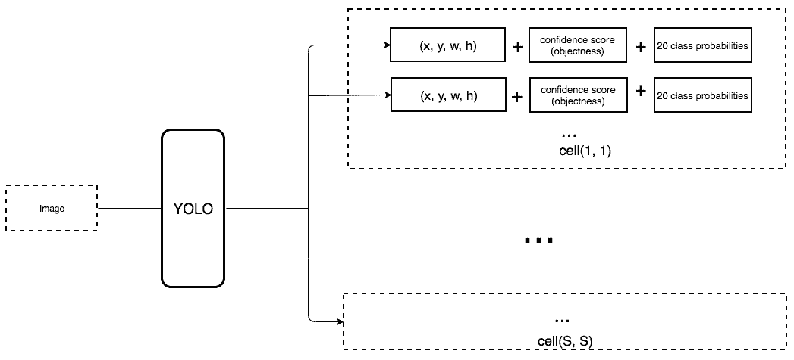
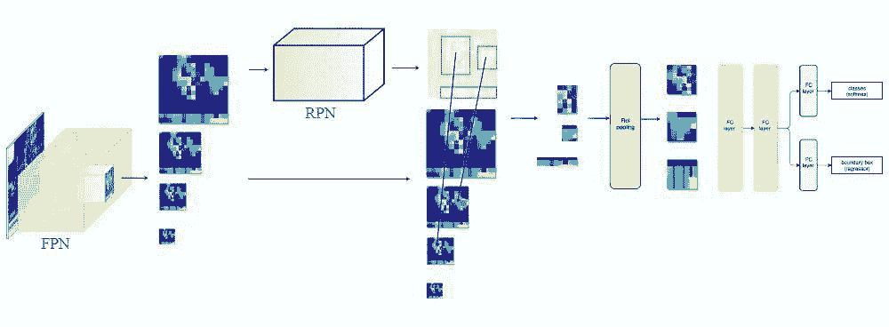

# 从 RCNN 到 SSD，这应该是最全的一份目标检测算法盘点

选自 Medium

**作者：Jonathan Hui**

**机器之心编译**

> 目标检测是很多计算机视觉任务的基础，不论我们需要实现图像与文字的交互还是需要识别精细类别，它都提供了可靠的信息。本文对目标检测进行了整体回顾，第一部分从 RCNN 开始介绍基于候选区域的目标检测器，包括 Fast R-CNN、Faster R-CNN 和 FPN 等。第二部分则重点讨论了包括 YOLO、SSD 和 RetinaNet 等在内的单次检测器，它们都是目前最为优秀的方法。

机器之心之前已经讨论过非常多的目标检测算法，对计算机视觉感兴趣的读者也可以结合以前的文章加强理解。

*   [深度学习目标检测模型全面综述：Faster R-CNN、R-FCN 和 SSD](http://mp.weixin.qq.com/s?__biz=MzA3MzI4MjgzMw==&mid=2650730940&idx=1&sn=2a6a8520176368d467ca87fbc2e04c66&chksm=871b35c2b06cbcd41593cf07aa5b7a7d0913f5d07de708fd554059b9f20f1b332190dd934025&scene=21#wechat_redirect)

*   [从零开始 PyTorch 项目：YOLO v3 目标检测实现](http://mp.weixin.qq.com/s?__biz=MzA3MzI4MjgzMw==&mid=2650741259&idx=1&sn=03dfb0fa3396e5464fc358b5a803e7bf&chksm=871ade75b06d5763a45f3c5da1ca62023a13c5cf7ce52a0a23e6c320f129f79bb9b3be4d2da0&scene=21#wechat_redirect)

*   [像玩乐高一样拆解 Faster R-CNN：详解目标检测的实现过程](http://mp.weixin.qq.com/s?__biz=MzA3MzI4MjgzMw==&mid=2650738167&idx=3&sn=dc26c3d273833192550290327d2c6220&chksm=871ac989b06d409f89bd2a1ea99ed415a4118482805f05e692bef968a65301fc596957606fde&scene=21#wechat_redirect)

*   [后 RCNN 时代的物体检测及实例分割进展](http://mp.weixin.qq.com/s?__biz=MzA3MzI4MjgzMw==&mid=2650736740&idx=3&sn=cdce446703e69b47cf48f12b3d451afc&chksm=871acc1ab06d450ccde3148df96436c98adb2de3b6a34559b95af322c5186513460329dc20bd&scene=21#wechat_redirect)

*   [物体检测算法全概述：从传统检测方法到深度神经网络框架](http://mp.weixin.qq.com/s?__biz=MzA3MzI4MjgzMw==&mid=2650725146&idx=3&sn=453e29cb6179e8e06df2133269c20812&chksm=871b1f64b06c967276274cee90f5a036c09b08cec9e52111af6744c7f0c19d5a8c7e0eb06e0b&scene=21#wechat_redirect)

**基于候选区域的目标检测器**

**滑动窗口检测器**

自从 AlexNet 获得 ILSVRC 2012 挑战赛冠军后，用 CNN 进行分类成为主流。一种用于目标检测的暴力方法是从左到右、从上到下滑动窗口，利用分类识别目标。为了在不同观察距离处检测不同的目标类型，我们使用不同大小和宽高比的窗口。


*滑动窗口（从右到左，从上到下）*

我们根据滑动窗口从图像中剪切图像块。由于很多分类器只取固定大小的图像，因此这些图像块是经过变形转换的。但是，这不影响分类准确率，因为分类器可以处理变形后的图像。


*将图像变形转换成固定大小的图像*

变形图像块被输入 CNN 分类器中，提取出 4096 个特征。之后，我们使用 SVM 分类器识别类别和该边界框的另一个线性回归器。


*滑动窗口检测器的系统工作流程图。*

下面是伪代码。我们创建很多窗口来检测不同位置的不同目标。要提升性能，一个显而易见的办法就是减少窗口数量。

```py
for window in windows
    patch = get_patch(image, window)
    results = detector(patch) 
```

**选择性搜索**

我们不使用暴力方法，而是用候选区域方法（region proposal method）创建目标检测的感兴趣区域（ROI）。在选择性搜索（selective search，SS）中，我们首先将每个像素作为一组。然后，计算每一组的纹理，并将两个最接近的组结合起来。但是为了避免单个区域吞噬其他区域，我们首先对较小的组进行分组。我们继续合并区域，直到所有区域都结合在一起。下图第一行展示了如何使区域增长，第二行中的蓝色矩形代表合并过程中所有可能的 ROI。


*图源：van de Sande et al. ICCV'11*

**R-CNN**

R-CNN 利用候选区域方法创建了约 2000 个 ROI。这些区域被转换为固定大小的图像，并分别馈送到卷积神经网络中。该网络架构后面会跟几个全连接层，以实现目标分类并提炼边界框。


*使用候选区域、CNN、仿射层来定位目标。*

以下是 R-CNN 整个系统的流程图：


通过使用更少且更高质量的 ROI，R-CNN 要比滑动窗口方法更快速、更准确。

```py
ROIs = region_proposal(image)
for ROI in ROIs
    patch = get_patch(image, ROI)
    results = detector(patch) 
```

**边界框回归器**

候选区域方法有非常高的计算复杂度。为了加速这个过程，我们通常会使用计算量较少的候选区域选择方法构建 ROI，并在后面使用线性回归器（使用全连接层）进一步提炼边界框。


*使用回归方法将蓝色的原始边界框提炼为红色的。*

**Fast R-CNN**

R-CNN 需要非常多的候选区域以提升准确度，但其实有很多区域是彼此重叠的，因此 R-CNN 的训练和推断速度非常慢。如果我们有 2000 个候选区域，且每一个都需要独立地馈送到 CNN 中，那么对于不同的 ROI，我们需要重复提取 2000 次特征。

此外，CNN 中的特征图以一种密集的方式表征空间特征，那么我们能直接使用特征图代替原图来检测目标吗？


*直接利用特征图计算 ROI。*

Fast R-CNN 使用特征提取器（CNN）先提取整个图像的特征，而不是从头开始对每个图像块提取多次。然后，我们可以将创建候选区域的方法直接应用到提取到的特征图上。例如，Fast R-CNN 选择了 VGG16 中的卷积层 conv5 来生成 ROI，这些关注区域随后会结合对应的特征图以裁剪为特征图块，并用于目标检测任务中。我们使用 ROI 池化将特征图块转换为固定的大小，并馈送到全连接层进行分类和定位。因为 Fast-RCNN 不会重复提取特征，因此它能显著地减少处理时间。


*将候选区域直接应用于特征图，并使用 ROI 池化将其转化为固定大小的特征图块。*

以下是 Fast R-CNN 的流程图：


在下面的伪代码中，计算量巨大的特征提取过程从 For 循环中移出来了，因此速度得到显著提升。Fast R-CNN 的训练速度是 R-CNN 的 10 倍，推断速度是后者的 150 倍。

```py
feature_maps = process(image)
ROIs = region_proposal(feature_maps)
for ROI in ROIs
    patch = roi_pooling(feature_maps, ROI)
    results = detector2(patch) 
```

Fast R-CNN 最重要的一点就是包含特征提取器、分类器和边界框回归器在内的整个网络能通过多任务损失函数进行端到端的训练，这种多任务损失即结合了分类损失和定位损失的方法，大大提升了模型准确度。

**ROI 池化**

因为 Fast R-CNN 使用全连接层，所以我们应用 ROI 池化将不同大小的 ROI 转换为固定大小。

为简洁起见，我们先将 8×8 特征图转换为预定义的 2×2 大小。

*   下图左上角：特征图。

*   右上角：将 ROI（蓝色区域）与特征图重叠。

*   左下角：将 ROI 拆分为目标维度。例如，对于 2×2 目标，我们将 ROI 分割为 4 个大小相似或相等的部分。

*   右下角：找到每个部分的最大值，得到变换后的特征图。


*输入特征图（左上），输出特征图（右下），ROI (右上，蓝色框)。*

按上述步骤得到一个 2×2 的特征图块，可以馈送至分类器和边界框回归器中。

**Faster R-CNN**

Fast R-CNN 依赖于外部候选区域方法，如选择性搜索。但这些算法在 CPU 上运行且速度很慢。在测试中，Fast R-CNN 需要 2.3 秒来进行预测，其中 2 秒用于生成 2000 个 ROI。

```py
feature_maps = process(image)
ROIs = region_proposal(feature_maps)         # Expensive!
for ROI in ROIs
    patch = roi_pooling(feature_maps, ROI)
    results = detector2(patch) 
```

Faster R-CNN 采用与 Fast R-CNN 相同的设计，只是它用内部深层网络代替了候选区域方法。新的候选区域网络（RPN）在生成 ROI 时效率更高，并且以每幅图像 10 毫秒的速度运行。


*Faster R-CNN 的流程图与 Fast R-CNN 相同。*


*外部候选区域方法代替了内部深层网络。*

**候选区域网络**

候选区域网络（RPN）将第一个卷积网络的输出特征图作为输入。它在特征图上滑动一个 3×3 的卷积核，以使用卷积网络（如下所示的 ZF 网络）构建与类别无关的候选区域。其他深度网络（如 VGG 或 ResNet）可用于更全面的特征提取，但这需要以速度为代价。ZF 网络最后会输出 256 个值，它们将馈送到两个独立的全连接层，以预测边界框和两个 objectness 分数，这两个 objectness 分数度量了边界框是否包含目标。我们其实可以使用回归器计算单个 objectness 分数，但为简洁起见，Faster R-CNN 使用只有两个类别的分类器：即带有目标的类别和不带有目标的类别。


对于特征图中的每一个位置，RPN 会做 k 次预测。因此，RPN 将输出 4×k 个坐标和每个位置上 2×k 个得分。下图展示了 8×8 的特征图，且有一个 3×3 的卷积核执行运算，它最后输出 8×8×3 个 ROI（其中 k=3）。下图（右）展示了单个位置的 3 个候选区域。


此处有 3 种猜想，稍后我们将予以完善。由于只需要一个正确猜想，因此我们最初的猜想最好涵盖不同的形状和大小。因此，Faster R-CNN 不会创建随机边界框。相反，它会预测一些与左上角名为「锚点」的参考框相关的偏移量（如𝛿x、𝛿y）。我们限制这些偏移量的值，因此我们的猜想仍然类似于锚点。


要对每个位置进行 k 个预测，我们需要以每个位置为中心的 k 个锚点。每个预测与特定锚点相关联，但不同位置共享相同形状的锚点。


这些锚点是精心挑选的，因此它们是多样的，且覆盖具有不同比例和宽高比的现实目标。这使得我们可以以更好的猜想来指导初始训练，并允许每个预测专门用于特定的形状。该策略使早期训练更加稳定和简便。


Faster R-CNN 使用更多的锚点。它部署 9 个锚点框：3 个不同宽高比的 3 个不同大小的锚点框。每一个位置使用 9 个锚点，每个位置会生成 2×9 个 objectness 分数和 4×9 个坐标。

*图源：https://arxiv.org/pdf/1506.01497.pdf*

**R-CNN 方法的性能**

如下图所示，Faster R-CNN 的速度要快得多。


**基于区域的全卷积神经网络（R-FCN）**

假设我们只有一个特征图用来检测右眼。那么我们可以使用它定位人脸吗？应该可以。因为右眼应该在人脸图像的左上角，所以我们可以利用这一点定位整个人脸。


如果我们还有其他用来检测左眼、鼻子或嘴巴的特征图，那么我们可以将检测结果结合起来，更好地定位人脸。

现在我们回顾一下所有问题。在 Faster R-CNN 中，检测器使用了多个全连接层进行预测。如果有 2000 个 ROI，那么成本非常高。

```py
feature_maps = process(image)
ROIs = region_proposal(feature_maps)
for ROI in ROIs
    patch = roi_pooling(feature_maps, ROI)
    class_scores, box = detector(patch)         # Expensive!
    class_probabilities = softmax(class_scores) 
```

R-FCN 通过减少每个 ROI 所需的工作量实现加速。上面基于区域的特征图与 ROI 是独立的，可以在每个 ROI 之外单独计算。剩下的工作就比较简单了，因此 R-FCN 的速度比 Faster R-CNN 快。

```py
feature_maps = process(image)
ROIs = region_proposal(feature_maps)         
score_maps = compute_score_map(feature_maps)
for ROI in ROIs
    V = region_roi_pool(score_maps, ROI)     
    class_scores, box = average(V)                   # Much simpler!
    class_probabilities = softmax(class_scores) 
```

现在我们来看一下 5 × 5 的特征图 M，内部包含一个蓝色方块。我们将方块平均分成 3 × 3 个区域。现在，我们在 M 中创建了一个新的特征图，来检测方块的左上角（TL）。这个新的特征图如下图（右）所示。只有黄色的网格单元 [2, 2] 处于激活状态。


*在左侧创建一个新的特征图，用于检测目标的左上角。*

我们将方块分成 9 个部分，由此创建了 9 个特征图，每个用来检测对应的目标区域。这些特征图叫作位置敏感得分图（position-sensitive score map），因为每个图检测目标的子区域（计算其得分）。


*生成 9 个得分图*

下图中红色虚线矩形是建议的 ROI。我们将其分割成 3 × 3 个区域，并询问每个区域包含目标对应部分的概率是多少。例如，左上角 ROI 区域包含左眼的概率。我们将结果存储成 3 × 3 vote 数组，如下图（右）所示。例如，vote_array[0][0] 包含左上角区域是否包含目标对应部分的得分。


*将 ROI 应用到特征图上，输出一个 3 x 3 数组。*

将得分图和 ROI 映射到 vote 数组的过程叫作位置敏感 ROI 池化（position-sensitive ROI-pool）。该过程与前面讨论过的 ROI 池化非常接近。


*将 ROI 的一部分叠加到对应的得分图上，计算 V[i][j]。*

在计算出位置敏感 ROI 池化的所有值后，类别得分是其所有元素得分的平均值。


*ROI 池化*

假如我们有 C 个类别要检测。我们将其扩展为 C + 1 个类别，这样就为背景（非目标）增加了一个新的类别。每个类别有 3 × 3 个得分图，因此一共有 (C+1) × 3 × 3 个得分图。使用每个类别的得分图可以预测出该类别的类别得分。然后我们对这些得分应用 softmax 函数，计算出每个类别的概率。

以下是数据流图，在我们的案例中，k=3。


**总结**

我们首先了解了基础的滑动窗口算法：

```py
for window in windows
    patch = get_patch(image, window)
    results = detector(patch) 
```

然后尝试减少窗口数量，尽可能减少 for 循环中的工作量。

```py
ROIs = region_proposal(image)
for ROI in ROIs
    patch = get_patch(image, ROI)
    results = detector(patch) 
```

**单次目标检测器**

第二部分，我们将对单次目标检测器（包括 SSD、YOLO、YOLOv2、YOLOv3）进行综述。我们将分析 FPN 以理解多尺度特征图如何提高准确率，特别是小目标的检测，其在单次检测器中的检测效果通常很差。然后我们将分析 Focal loss 和 RetinaNet，看看它们是如何解决训练过程中的类别不平衡问题的。

**单次检测器**

Faster R-CNN 中，在分类器之后有一个专用的候选区域网络。


*Faster R-CNN 工作流*

基于区域的检测器是很准确的，但需要付出代价。Faster R-CNN 在 PASCAL VOC 2007 测试集上每秒处理 7 帧的图像（7 FPS）。和 R-FCN 类似，研究者通过减少每个 ROI 的工作量来精简流程。

```py
feature_maps = process(image)
ROIs = region_proposal(feature_maps)
for ROI in ROIs
    patch = roi_align(feature_maps, ROI)
    results = detector2(patch)    # Reduce the amount of work here! 
```

作为替代，我们是否需要一个分离的候选区域步骤？我们可以直接在一个步骤内得到边界框和类别吗？

```py
feature_maps = process(image)
results = detector3(feature_maps) # No more separate step for ROIs
```

让我们再看一下滑动窗口检测器。我们可以通过在特征图上滑动窗口来检测目标。对于不同的目标类型，我们使用不同的窗口类型。以前的滑动窗口方法的致命错误在于使用窗口作为最终的边界框，这就需要非常多的形状来覆盖大部分目标。更有效的方法是将窗口当做初始猜想，这样我们就得到了从当前滑动窗口同时预测类别和边界框的检测器。


*基于滑动窗口进行预测*

这个概念和 Faster R-CNN 中的锚点很相似。然而，单次检测器会同时预测边界框和类别。例如，我们有一个 8 × 8 特征图，并在每个位置做出 k 个预测，即总共有 8 × 8 × k 个预测结果。


*64 个位置*

在每个位置，我们有 k 个锚点（锚点是固定的初始边界框猜想），一个锚点对应一个特定位置。我们使用相同的 锚点形状仔细地选择锚点和每个位置。


*使用 4 个锚点在每个位置做出 4 个预测。*

以下是 4 个锚点（绿色）和 4 个对应预测（蓝色），每个预测对应一个特定锚点。


*4 个预测，每个预测对应一个锚点。*

在 Faster R-CNN 中，我们使用卷积核来做 5 个参数的预测：4 个参数对应某个锚点的预测边框，1 个参数对应 objectness 置信度得分。因此 3× 3× D × 5 卷积核将特征图从 8 × 8 × D 转换为 8 × 8 × 5。


*使用 3x3 卷积核计算预测。*

在单次检测器中，卷积核还预测 C 个类别概率以执行分类（每个概率对应一个类别）。因此我们应用一个 3× 3× D × 25 卷积核将特征图从 8 × 8 × D 转换为 8 × 8 × 25（C=20）。



*每个位置做出 k 个预测，每个预测有 25 个参数。*

单次检测器通常需要在准确率和实时处理速度之间进行权衡。它们在检测太近距离或太小的目标时容易出现问题。在下图中，左下角有 9 个圣诞老人，但某个单次检测器只检测出了 5 个。


**SSD**

SSD 是使用 VGG19 网络作为特征提取器（和 Faster R-CNN 中使用的 CNN 一样）的单次检测器。我们在该网络之后添加自定义卷积层（蓝色），并使用卷积核（绿色）执行预测。


*同时对类别和位置执行单次预测。*

然而，卷积层降低了空间维度和分辨率。因此上述模型仅可以检测较大的目标。为了解决该问题，我们从多个特征图上执行独立的目标检测。


*使用多尺度特征图用于检测。*

以下是特征图图示。


*图源：https://arxiv.org/pdf/1512.02325.pdf*

SSD 使用卷积网络中较深的层来检测目标。如果我们按接近真实的比例重绘上图，我们会发现图像的空间分辨率已经被显著降低，且可能已无法定位在低分辨率中难以检测的小目标。如果出现了这样的问题，我们需要增加输入图像的分辨率。


**YOLO**

YOLO 是另一种单次目标检测器。

[`v.qq.com/iframe/preview.html?vid=t06146pm1qk&width=500&height=375&auto=0`](https://v.qq.com/iframe/preview.html?vid=t06146pm1qk&width=500&height=375&auto=0)

YOLO 在卷积层之后使用了 DarkNet 来做特征检测。


然而，它并没有使用多尺度特征图来做独立的检测。相反，它将特征图部分平滑化，并将其和另一个较低分辨率的特征图拼接。例如，YOLO 将一个 28 × 28 × 512 的层重塑为 14 × 14 × 2048，然后将它和 14 × 14 ×1024 的特征图拼接。之后，YOLO 在新的 14 × 14 × 3072 层上应用卷积核进行预测。

YOLO（v2）做出了很多实现上的改进，将 mAP 值从第一次发布时的 63.4 提高到了 78.6。YOLO9000 可以检测 9000 种不同类别的目标。


*图源：https://arxiv.org/pdf/1612.08242.pdf*

以下是 YOLO 论文中不同检测器的 mAP 和 FPS 对比。YOLOv2 可以处理不同分辨率的输入图像。低分辨率的图像可以得到更高的 FPS，但 mAP 值更低。


*图源：https://arxiv.org/pdf/1612.08242.pdf*

**YOLOv3**

YOLOv3 使用了更加复杂的骨干网络来提取特征。DarkNet-53 主要由 3 × 3 和 1× 1 的卷积核以及类似 ResNet 中的跳过连接构成。相比 ResNet-152，DarkNet 有更低的 BFLOP（十亿次浮点数运算），但能以 2 倍的速度得到相同的分类准确率。


*图源：https://pjreddie.com/media/files/papers/YOLOv3.pdf*

YOLOv3 还添加了特征金字塔，以更好地检测小目标。以下是不同检测器的准确率和速度的权衡。


*图源：https://pjreddie.com/media/files/papers/YOLOv3.pdf*

**特征金字塔网络（FPN）**

检测不同尺度的目标很有挑战性，尤其是小目标的检测。特征金字塔网络（FPN）是一种旨在提高准确率和速度的特征提取器。它取代了检测器（如 Faster R-CNN）中的特征提取器，并生成更高质量的特征图金字塔。

数据流


*FPN（图源：https://arxiv.org/pdf/1612.03144.pdf）*

FPN 由自下而上和自上而下路径组成。其中自下而上的路径是用于特征提取的常用卷积网络。空间分辨率自下而上地下降。当检测到更高层的结构，每层的语义值增加。


*FPN 中的特征提取（编辑自原论文）*

SSD 通过多个特征图完成检测。但是，最底层不会被选择执行目标检测。它们的分辨率高但是语义值不够，导致速度显著下降而不能被使用。SSD 只使用较上层执行目标检测，因此对于小的物体的检测性能较差。


*图像修改自论文 https://arxiv.org/pdf/1612.03144.pdf*

FPN 提供了一条自上而下的路径，从语义丰富的层构建高分辨率的层。


*自上而下重建空间分辨率（编辑自原论文）*

虽然该重建层的语义较强，但在经过所有的上采样和下采样之后，目标的位置不精确。在重建层和相应的特征图之间添加横向连接可以使位置侦测更加准确。


*增加跳过连接（引自原论文）*

下图详细说明了自下而上和自上而下的路径。其中 P2、P3、P4 和 P5 是用于目标检测的特征图金字塔。


**FPN 结合 RPN**

FPN 不单纯是目标检测器，还是一个目标检测器和协同工作的特征检测器。分别传递到各个特征图（P2 到 P5）来完成目标检测。


**FPN 结合 Fast R-CNN 或 Faster R-CNN**

在 FPN 中，我们生成了一个特征图的金字塔。用 RPN（详见上文）来生成 ROI。基于 ROI 的大小，我们选择最合适尺寸的特征图层来提取特征块。



**困难案例**

对于如 SSD 和 YOLO 的大多数检测算法来说，我们做了比实际的目标数量要多得多的预测。所以错误的预测比正确的预测要更多。这产生了一个对训练不利的类别不平衡。训练更多的是在学习背景，而不是检测目标。但是，我们需要负采样来学习什么是较差的预测。所以，我们计算置信度损失来把训练样本分类。选取最好的那些来确保负样本和正样本的比例最多不超过 3:1。这使训练更加快速和稳定。

**推断过程中的非极大值抑制**

检测器对于同一个目标会做出重复的检测。我们利用非极大值抑制来移除置信度低的重复检测。将预测按照置信度从高到低排列。如果任何预测和当前预测的类别相同并且两者 IoU 大于 0.5，我们就把它从这个序列中剔除。

**Focal Loss（RetinaNet）**

类别不平衡会损害性能。SSD 在训练期间重新采样目标类和背景类的比率，这样它就不会被图像背景淹没。Focal loss（FL）采用另一种方法来减少训练良好的类的损失。因此，只要该模型能够很好地检测背景，就可以减少其损失并重新增强对目标类的训练。我们从交叉熵损失 CE 开始，并添加一个权重来降低高可信度类的 CE。


例如，令 γ = 0.5, 经良好分类的样本的 Focal loss 趋近于 0。


*编辑自原论文*

这是基于 FPN、ResNet 以及利用 Focal loss 构建的 RetianNet。


*RetinaNet*

*原文链接：https://medium.com/@jonathan_hui/what-do-we-learn-from-region-based-object-detectors-faster-r-cnn-r-fcn-fpn-7e354377a7c9
https://medium.com/@jonathan_hui/what-do-we-learn-from-single-shot-object-detectors-ssd-yolo-fpn-focal-loss-3888677c5f4d*

蚂蚁金服举办首届金融科技领域算法类大赛——ATEC 蚂蚁开发者大赛人工智能大赛，点击「阅读原文」 进入大赛官网了解比赛信息，比赛报名请使用 PC 端浏览器打开官网。

