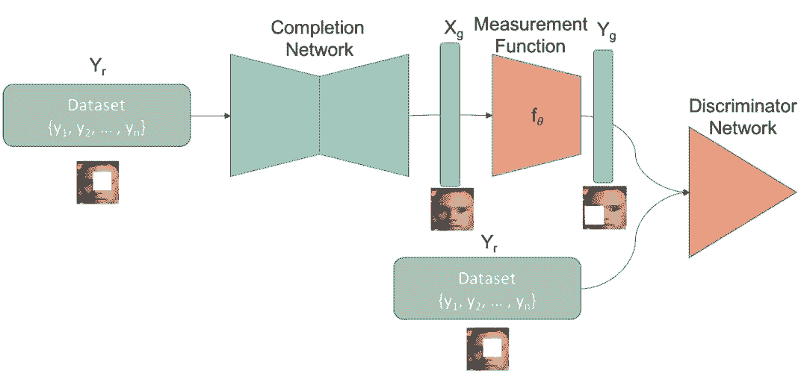
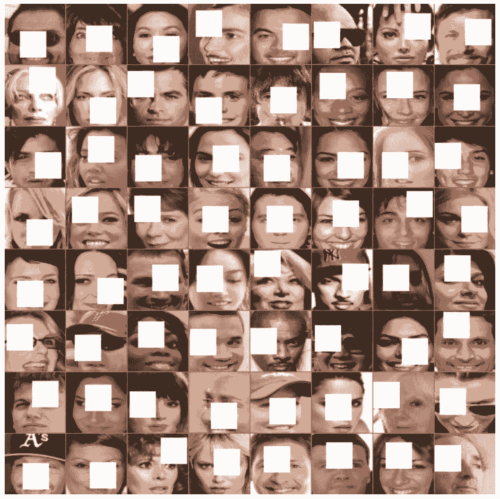
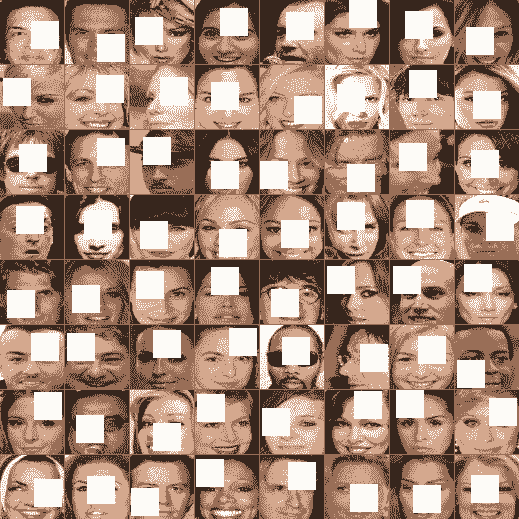
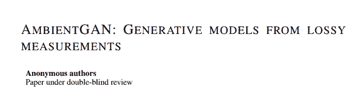
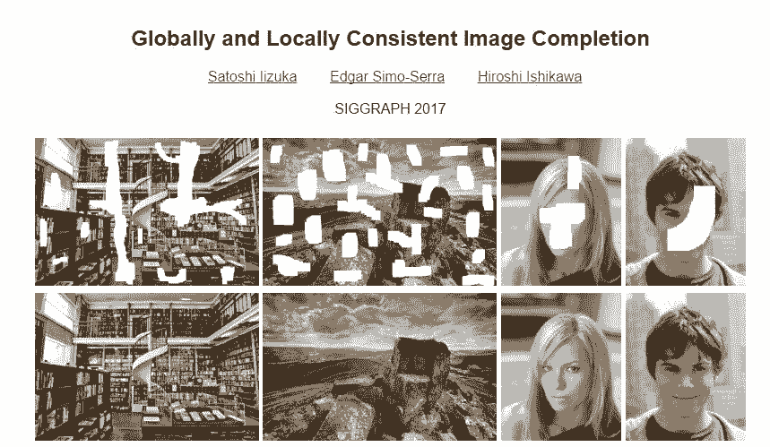

# 教程 | GitHub 项目：利用不完整的数据样本补全不完整的图像

选自 GitHub

**机器之心编译**

**参与：刘晓坤、思源**

> 大多数图像补完和生成模型需要完全被观察的样本来训练。但是，在 AmbientGAN 里，阐述了获取高分辨率样本对于一些应用来说是可能非常昂贵的或者是不切实际的。该 GitHub 项目结合了两篇论文 AmbientGAN 和 GLCIC 的思想，实现了用不完整图像样本训练的补全不完整图像的网络。

GitHub 地址：https://github.com/shinseung428/ImageCompletion_IncompleteData

这个 GitHub 项目里的模型融合了以下工作中的思想：

*   AmbientGAN（来自有损测量生成的模型）

*   Globally and Locally Consistent Image Completion（GLCIC，全局和局部一致的缺漏图像完整性技术）

AmbientGAN 使我们可以直接用有噪声或者不完整的样本来训练生成模型。模型的生成器可以成功地用测量函数从正确的分布里预测样本。

另一方面，GLCIC 一文里的模型用了完全被观察的样本来训练网络。补完网络首先用了 mse 损失来预训练权重，之后用了一个判别器损失以完整地训练模型。

把 AmbientGAN 和 GLCIC 文章里的思想结合以后，这个项目中的模型学习仅用不完整的数据来填充不完整的区域（例如：被随机用 28*28 大小补丁覆盖的地方）。你可以看到，一些生成区域是不完美的。这个模型生成的图像仍然有缺陷，一些区域的颜色也不连贯。

**网络**

**方法**

现在假定我们已经有不完整图片的样本，且我们知道添加到样本的噪声类型。我们可以使用加上掩码的图像作为补完网络（completion network）的输入而不是使用随机隐向量。假设补完网络成功生成了掩盖的区域，那么生成的图像块将使用掩码信息 X_g 与输入图像相结合。

随后，补完的图像 X_g 将会被馈送到度量函数中。如 AmbientGAN 原论文所述，度量函数将尝试模拟生成对象 X_g 上的随机度量。这很有可能实现，因为我们知道添加到完整图像的噪声类型。此外，我们也可以创建一个度量函数以模拟添加到图像中的噪声。

在将度量函数和不完整样本 Y_r 馈送到判别器以从假的度量方式中鉴别出真正的度量方法，最后可生成图像 Y_g。在补完网络和判别网络进行对抗性的训练后，补完网络学习到如何生成图像块以补完不完整样本的确实部分。

**数据集**

该项目最终使用 CelebA 数据集。为了创建不完整图像的数据集，我们将原版的 CelebA 图像居中剪裁为 32*32 的图像块，并调整尺寸为 64*64，然后将 28*28 的空白图像块（图像块的值填充为 1）随机添加到图像中。

**项目效果**

**论文：AmbientGAN: Generative models from lossy measurements**

论文地址：https://openreview.net/forum?id=Hy7fDog0b

摘要：生成模型提供了一种对复杂分布的结构进行建模的方法，并已被证明在很多现实任务中很有用。然而，目前的训练生成模型的技术需要访问充分观测的样本。在很多设置中，获得充分观测的样本是代价昂贵的甚至不可能完成的，但是从部分的、带噪声的观测中获取样本则是经济的。我们考虑了仅给定从感兴趣分布得到的样本的有损耗测量来学习隐式生成模型的任务。我们证明真实的潜在分布可以被实证地恢复，即使每个样本都存在信息损耗时也可行（根据特定的测量模型）。基于此，我们提出了一种训练生成对抗网络的新方法，称为 AmbientGAN。在三个基准数据集上，我们用不同的测量模型证明了该模型无论定性上还是定量上都能获得大幅提升。用我们的方法训练的生成模型可以获得 2-4 倍于基线模型的性能。

**论文：Globally and Locally Consistent Image Completion**

论文地址：http://hi.cs.waseda.ac.jp/~iizuka/projects/completion/en/

摘要：我们在本文中展示了一种新的图像补完的方法，可以在图像中获得局域的和全局的一致性。利用一个全卷积神经网络，我们可以通过填充任意形状的缺失区域对任意分辨率的图像补完。为了训练该图像补完网络获得一致性，我们使用了全局的和局域的语境判别器（分辨真实图像和被补完的图像）。全局判别器观察完整的图像以评估它是否整体上一致，而局域判别器仅观察中心位于补完区域的小块区域以确保生成补丁的局域一致性。然后图像补完网络被训练以欺骗这两个语境判别器网络，即它需要生成和真实图像无法区分的无论是整体还是细节上都保持一致性的图像。我们证明了该方法可以用于补完大量类型的。此外，和基于补丁的方法（例如 PatchMatch）不同的是，我们的方法可以生成在图像其它地方不存在的碎片，这使得我们可以自然地用熟悉的和特定的结构（例如人脸）补完物体的图像。

****本文为机器之心编译，**转载请联系本公众号获得授权****。**

✄------------------------------------------------

**加入机器之心（全职记者/实习生）：hr@jiqizhixin.com**

**投稿或寻求报道：editor@jiqizhixin.com**

**广告&商务合作：bd@jiqizhixin.com**