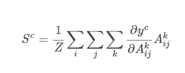
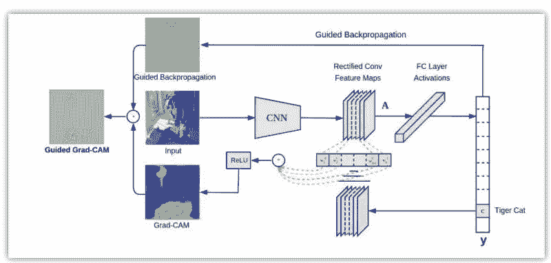
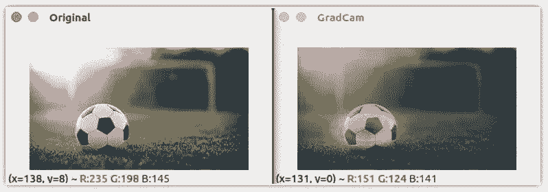

# 观点 | 如何可视化卷积网络分类图像时关注的焦点

选自 hackevolve

**作者：Saideep Talari**

**机器之心编译**

**参与：乾树、思源**

> 在我们使用 CNN 进行图片分类时，模型到底关注的是图像的哪个区域？Grad-CAM 利用卷积网络最后一个特征图的信息，并加权对应的梯度而构建模型分类的热力图，通过该热力图，我们可以清楚地了解哪一块区域对于类别是最重要的。

你在训练神经网络进行图片分类时，有没有想过网络是否就是像人类感知信息一样去理解图像？这个问题很难回答，因为多数情况下深度神经网络都被视作黑箱。我们喂给它输入数据进而得到输出。整个流程如果出现问题很难去调试。尽管预测的已经相当精准，但这并不能说明他们足以和人类感知的方式媲美。

**为何会这样？**

假设你需要对大象和企鹅进行二分类（我知道这个任务十分简单）。现在你已经获取了数据集，训好了模型并完成部署。这个模型想必是适用于绝大多数数据的，但是总有可能会出现误判。有人可能会把它看作是一个极端情况，但是你觉得对于 CNN 来说，什么时候物体才是明确可辨的？

结合上述内容，显然在图像中，大象常伴着草木出现，企鹅常伴着冰雪出现。所以，实际上模型已经学会了分辨草木与冰雪的颜色/形状，而不是真的学会了按对象分类。

由上文案例知，如颜色通道统计那样的简单图像处理技术，与训练模型是一样的。因为在没有智能的情况下，模型只能依靠颜色辩物。现在你或许会问，如何知道 CNN 究竟在寻找什么？答案就是，Grad-CAM。

**加权梯度类激活映射（Grad-CAM）**

我们在本篇博客中实现了加权梯度类激活映射。首先，我们要知道这不是唯一的解决方案。原作说，

加权梯度类激活映射 (Grad-CAM) 通过任意目标概念的梯度（比如说类别「狗」的分对数甚至是「狗」这个字），将这些知识传递到最后的卷积层进而产生一张粗略的定位图，用于凸显图像中对于预测相关概念至关重要的区域。

通俗点讲，我们只取最终卷积层的特征图，然后将该特征中的每个通道通过与该通道相关的类的梯度进行加权。这种方法只不过是输入图像如何通过每个通道对于类的重要性来激活不同的通道，最重要的是它不需要对现有架构进行任何重训练或更改。



特定类的特征空间得分就是对应类的输出值 y^c 关于特征图 A_ij 的偏导在 i 和 j 维上的特征进行全局平均池化操作。然后，我们将结果与特征图沿其通道轴 k 相乘。最后，将结果在通道维度 k 上求平均/池化。因此，特征空间的得分凸的大小是 i×j。Σ 符号用于描述池化和平均操作。



*ReLU 激活函数用于得分图，随后被归一化以便输出正区域预测。*

**实现**

为了达到本篇博客的目的，我们套用一个预训练好的 VGG 模型，并导入一些必要包开始实现代码。

```py
from keras.applications.vgg16 import VGG16, preprocess_input, decode_predictions
from keras.preprocessing import image
import keras.backend as K
import numpy as np
import cv2
import sys
```

我们使用 Keras 自带的 VGG16 模型。并加载一些有助于加载和处理图像的函数。

```py
model = VGG16(weights="imagenet")
img_path = sys.argv[1]
img = image.load_img(img_path, target_size=(224, 224))
x = image.img_to_array(img)
x = np.expand_dims(x, axis=0)
x = preprocess_input(x)
```

我们先初始化模型并通过命令行参数加载图片。VGG 网络只接受 (224×224×3) 大小的图片，所以我们要把图片放缩到指定大小。由于我们只通过网络传递一个图像，因此需要扩展第一个维度，将其扩展为一个大小为 1 的批量。然后，我们通过辅助函数 preprocess_input 从输入图像中减去平均 RGB 值来实现图像的归一化。

```py
preds = model.predict(x)
class_idx = np.argmax(preds[0])
class_output = model.output[:, class_idx]
last_conv_layer = model.get_layer("block5_conv3")
```

此处，我们来看看顶部预测的特征图。所以我们得到图像的预测，并给得分靠前的类做个索引。请记住，我们可以为任意类计算特征图。然后，我们可以取出 VGG16 中最后一个卷积层的输出 block5_conv3。得到的特征图大小应该是 14×14×512。

```py
grads = K.gradients(class_output, last_conv_layer.output)[0]
pooled_grads = K.mean(grads, axis=(0, 1, 2))
iterate = K.function([model.input], [pooled_grads, last_conv_layer.output[0]])
pooled_grads_value, conv_layer_output_value = iterate([x])
for i in range(512):
 conv_layer_output_value[:, :, i] *= pooled_grads_value[i]
```

如上所述，我们计算相类输出值关于特征图的梯度。然后，我们沿着除了通道维度之外的轴对梯度进行池化操作。最后，我们用计算出的梯度值对输出特征图加权。

```py
heatmap = np.mean(conv_layer_output_value, axis=-1)
heatmap = np.maximum(heatmap, 0)
heatmap /= np.max(heatmap) 
```

然后，我们沿着通道维度对加权的特征图求均值，从而得到大小为 14*14 的热力图。最后，我们对热力图进行归一化处理，以使其值在 0 和 1 之间。

```py
img = cv2.imread(img_path)
heatmap = cv2.resize(heatmap, (img.shape[1], img.shape[0]))
heatmap = np.uint8(255 * heatmap)
heatmap = cv2.applyColorMap(heatmap, cv2.COLORMAP_JET)
superimposed_img = cv2.addWeighted(img, 0.6, heatmap, 0.4, 0)
cv2.imshow("Original", img)
cv2.imshow("GradCam", superimposed_img)
cv2.waitKey(0)
```

最后，我们使用 OpenCV 来读图片，将获取的热力图放缩到原图大小。我们将原图和热力图混合，以将热力图叠加到图像上。



从上面的图片可以清楚地看到 CNN 在图像中寻找的是区分这些类的地方。这种技术不仅适用于定位，还可用于视觉问答、图像标注等。

此外，它在调试建立精确模型的数据需求方面非常有帮助。虽然此技术并未过多涉及调参，但我们可以使用额外的数据和数据增强技术更好地泛化模型。

*原文链接：http://www.hackevolve.com/where-cnn-is-looking-grad-cam/*

****本文为机器之心编译，**转载请联系本公众号获得授权****。**

✄------------------------------------------------

**加入机器之心（全职记者/实习生）：hr@jiqizhixin.com**

**投稿或寻求报道：editor@jiqizhixin.com**

**广告&商务合作：bd@jiqizhixin.com**