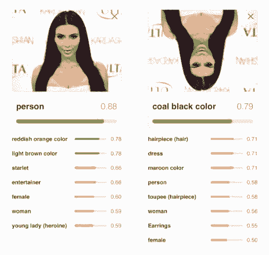

# 教程 | 可视化 CapsNet，详解 Hinton 等人提出的胶囊概念与原理

选自 freecodecamp

**作者：Nick Bourdakos**

**机器之心编译**

**参与：****Pedro、思源**

> CapsNet 将神经元的标量输出转换为向量输出提高了表征能力，我们不仅能用它表示图像是否有某个特征，同时还能表示这个特征的旋转和位置等物理特征。本文从可视化的角度出发详解释了 CapsNet 的原理的计算过程，非常有利于直观理解它的结构。

尽管卷积神经网络已经做出了令人惊艳的成绩，但还是存在着一些根本性问题。是时候开始思考新的解决方案和改进了。现在就让我们一起来了解一下胶囊网络（capsules networks）。

在之前的文章中我曾简要地讨论过胶囊网络（https://hackernoon.com/capsule-networks-are-shaking-up-ai-heres-how-to-use-them-c233a0971952）是如何解决一些传统问题的。在过去的几个月里，我一直沉浸在各种各样的胶囊网络里。我觉得现在是时候一起更加深入地探索胶囊网络的实际运作方式了。

为了让后面的讨论更加容易，我开发了一款与胶囊网络实现配套的可视化工具，它能够让您看到网络的每一层是如何工作的。这些内容都可以在 GitHub 上找到（https://github.com/bourdakos1/CapsNet-Visualization）。

如下所示是 CapsNet 的结构。如果您现在还不理解每个部分的具体含义，不必担心。我会尽我所能一层一层地进行详细讨论。


**part 0: 网络输入**

胶囊网络（CapsNet）的输入是提供给神经网络的真实图片。在这个例子中输入的图片长宽都为 28 个像素。一张图片实际上有 3 个维度用来存储不同颜色通道的信息。

因为是灰度图，而用作示例的图片仅仅有一个颜色通道。大家所熟悉的大多数图片都有 3 或 4 个通道用来存储红-绿-蓝和可能用于存储灰度或透明度的额外通道。


每个像素都被表示为 0 到 255 之间的一个数字并且被存储在一个 28x28x1 的矩阵 [28, 28, 1] 里。每一个像素的颜色越明亮，其数值越大。

**Part 1a: 卷积**

胶囊网络的第一个部分是传统的卷积网络。那么什么是卷积网络，它是怎么工作，而又有什么作用呢？

我们的目标是要从输入图像中提取一些非常基础的特征，比如边缘或者曲线。那么我们是怎么做到的呢？让我们来思考一个边缘情况：


如果我们看到这个图片上的一些点，我们就能够从中发现出一种模式。而现在我们关注于这些点左右两侧的颜色：


你也许会注意到当这个点在边缘时，其两侧颜色之间的差别会很大。

```py
255 - 114 = 141

114 - 153 = -39

153 - 153 = 0

255 - 255 = 0

```

如果我们纵览图片中的每一个像素并且用它和左右点之间的差异值来替换掉原始的值会发生什么？理论上这个图片除边缘外的部分会全部变成黑色。

我们可以通过循环来遍历图片中每一个像素并进行上述处理：

```py
for pixel in image {
  result[pixel] = image[pixel - 1] - image[pixel + 1]
}
```

但是这是比较低效的。而实际上，我们可以使用卷积操作。更技术地来讲，这其实是「互相关」，但大家更喜欢称之为卷积。

本质上卷积操作和上述循环的效果几乎是一样的，但它可以充分利用矩阵运算的优势来提高效率。

卷积操作一开始会在图像的一角设置一个小的窗口，然后移动它遍历整幅图像。在每一个位置我们都仅仅关注窗口所覆盖的像素并且将其中全部的像素值与对应的权重相乘并求和。而这个窗口实质上是一个被称为「卷积核」的权重矩阵。

我们仅仅关注 2 个像素，但是当我们把它周围的窗口打包起来的时候，就可以让他们之间的像素变成胶囊。

```py
Window:
┌─────────────────────────────────────┐
│ left_pixel middle_pixel right_pixel │
└─────────────────────────────────────┘

```

你能够找到一组权重与这些像素相乘并求和得到我们想要的值吗？

```py
Window:
┌─────────────────────────────────────┐
│ left_pixel middle_pixel right_pixel │
└─────────────────────────────────────┘
(w1 * 255) + (w2 * 255) + (w3 * 114) = 141
```

Spoilers below!

```py
│            │            │
 │            │            │
 │            │            │
 │            │            │
 │            │            │
\│/          \│/          \│/
 V            V            V
```

我们可以进行这样的操作：

```py
Window:
┌─────────────────────────────────────┐
│ left_pixel middle_pixel right_pixel │
└─────────────────────────────────────┘
(1 * 255) + (0 * 255) + (-1 * 114) = 141
```

有了这些权重，我们可以得到卷积核：

kernel = [1 0 -1]

当然，卷积核通常来说是方阵，所以我们可以用 0 来填充其他位置：

```py
kernel = [
  [0  0  0]
  [1  0 -1]
  [0  0  0]
]
```

这里有一个很棒的动态图来描述卷积的运算过程：


在步幅为 1 的情况下，输出的维度为输入的维度减去卷积核的维度再加 1，比如 (7—3) + 1 = 5（更多相关内容请看下一小节）。

经过卷积变换后的图片如下所示：


你也许会注意到在变换后的图片中一些边缘丢失了。具体来说，是那些水平方向的边缘。为了突出这些信息，我们需要另外一个卷积核来处理像素上方和下方的信息。比如：

```py
kernel = [
  [0  1  0]
  [0  0  0]
  [0 -1  0]
]
```

此外，这两个卷积核在处理其他的角度或者模糊的边界时都无法获得很好的效果。因此我们要使用多个卷积核（在我们的胶囊网络实现中，我们使用了 256 个卷积核）并且卷积核一般有更大的尺寸以增加处理的空间（我们使用 9x9 的的卷积核）。

其中一个经过训练后的卷积核如下所示。虽然不是很明显，但我们还是可以看出它是一个更加鲁棒的放大版边缘探测器。它仅仅用来找到那些从亮变暗的边缘。

```py
kernel = [
  [ 0.02 -0.01  0.01 -0.05 -0.08 -0.14 -0.16 -0.22 -0.02]
  [ 0.01  0.02  0.03  0.02  0.00 -0.06 -0.14 -0.28  0.03]
  [ 0.03  0.01  0.02  0.01  0.03  0.01 -0.11 -0.22 -0.08]
  [ 0.03 -0.01 -0.02  0.01  0.04  0.07 -0.11 -0.24 -0.05]
  [-0.01 -0.02 -0.02  0.01  0.06  0.12 -0.13 -0.31  0.04]
  [-0.05 -0.02  0.00  0.05  0.08  0.14 -0.17 -0.29  0.08]
  [-0.06  0.02  0.00  0.07  0.07  0.04 -0.18 -0.10  0.05]
  [-0.06  0.01  0.04  0.05  0.03 -0.01 -0.10 -0.07  0.00]
  [-0.04  0.00  0.04  0.05  0.02 -0.04 -0.02 -0.05  0.04]
]
```

注意：我对所有的值都进行了取整，因为他们太长了，比如：0.01783941。

幸运的是，我们不需要手动地设计这些卷积核。训练过程可以自动完成这一工作。所有的卷积核一开始都是空的（或者随机初始化），而在训练过程中他们被不断调整使得最终的输出和我们的目标更接近。

如下所示是经过训练后最终得到的 256 个卷积核（为了方便理解我给他们上了色）。我们用蓝色来表示负数, 用 0 来表示绿色，用黄色来表示正数. 并且颜色越强，其绝对值越大。


用所有的卷积核处理完图片后，我们可以得到一个含有 256 张输出图片的栈。

**Part 1b: 线性整流函数**

ReLU（线性整流函数）也许听起来很复杂，但实际上非常简单。作为一个激活函数，它对输入的值进行处理然后输出。如果输入的值是负数，那么输出为 0，如果输入的值是正数，那么输出和输入完全一致。

代码如下：

```py
x = max(0, x)

```

如图所示：


我们用这个函数对所有卷积输出进行处理。

为什么我们要这么做？因为如果我们不使用激活函数对神经元层的输出进行处理，那么整个网络就可以被描述为一个线性的函数，这样一来我们所有的努力就都失去意义了。

添加一个非线性的部分使得我们可以描述所有种类的函数。我们可以使用很多不同种类的函数来作为激活函数，只是 ReLU 是最流行的一种，因为它使用起来最方便。

第一个使用了 ReLU 的卷积层输出如下所示：


**Part 2a: 初级胶囊层（PrimaryCaps）**

一开始我们使用一个普通的卷积层作为初级胶囊层。但这次我们要对前面输出的 256 个特征图进行操作，因此我们使用一个 9x9x256 的卷积核而不是 9x9x1 的卷积核。那么我们究竟想要得到什么？

在第一个卷积层我们在寻找简单的边角和曲线。现在我们希望从上一步得到的边缘信息中找到更加复杂一点的形状。

这次我们的步长是 2，即每次移动 2 个像素而不是 1 个。使用更大的步长可以让我们更快地降低输出尺寸。


注意：一般来说，输出的维度是 12，但由于我们的步长为 2，所以输出向量的维度减半。比如：((20—9) + 1) / 2 = 6。

我们会对输出再进行 256 次卷积操作，这样我们最终可以得到一个含有 256 个输出（6x6）的栈。

但这一次我们想要的不仅仅是一些糟糕而普通的旧数据。我们要把这个栈切分成 32 层，其中每层有 8 个块，我们称之为「胶囊层」，每个胶囊层有 36 个「胶囊」。

更进一步地说，这意味着每个胶囊含有一个拥有 8 个值的数组，而一般我们称之为向量。

我所要强调的是：


这些「胶囊」是我们新的像素。

对于单一的像素值来说，我们仅仅能够存储在特定位置是否有一个边角的置信度。数值越大，置信度越高。

而对于一个胶囊，我们可以在每个位置存储 8 个值！这让我们有机会存储更多的信息而不仅仅是是否在某个位置找到了某种形状。但我们想要存储的还有哪些信息呢？

当看到下面的形状的时候，你能够发现什么？如果你需要在对方不能观看的情况下告诉他如何复原这个形状，你会怎么说？


这个图片非常基础，所以我们仅仅需要描述很少的一些细节。：

*   形状的类型

*   位置

*   旋转

*   颜色

*   尺寸

我们可以称之为「实例化参数」。对于更复杂的图片我们最终需要更多的细节。他们可以包括姿态（位置、尺寸、方向、）、畸变、速度、反照率、色调、质地等等。

你也许还记得当我们为边缘检测设计卷积核的时候，它只会在某一个具体的角度起作用，因此对于每一个角度我们都需要一个卷积核。而事实上我们完全可以摆脱上述的过程，因为当我们在处理边缘时，描述边缘的方式是非常有限的。

当我们在处理形状这一层次的特征时，我们不想给每一个角度的长方形、三角形、椭圆等等都去设计对应的卷积核。这太不明智了，尤其是当处理像光线一样有 3 个维度的旋转和特征的更复杂的形状时更是如此。

而这恰恰正是传统的神经网络无法很好地处理微小旋转的原因。



当我们从边缘到形状，再从形状到物体传递特征的时候，如果能够有更多的空间去存储额外有用的信息将会是很有帮助的。

如下是两个胶囊层（一个用来处理长方形一个用来处理三角形）和 2 个传统像素输出的一个简化版对比：


与传统的 2 维或者 3 维的向量类似，这个向量也有角度和长度。长度描述概率而角度描述实例化的参数。在上面的例子中，这个角度实际上和形状的角度是一致的，但通常来说不一定是这样。

在实际中想要可视化展示上述的向量是不可行或者至少是非常困难的，因为他们有 8 个维度。

那么既然我们在胶囊中存储了这些额外的信息，我们应该可以在此基础上重构出最初的图片。这听起来很不错，但我们要怎样才能使得网络学习到这些内容呢？

在训练传统卷积神经网络的时候，我们仅仅关心模型是否能够预测正确的类别。而在训练胶囊网络的时候，我们有另外的一种叫做「重构」的方法。每次重构都尝试仅仅使用我们给出的向量复原原始图片。然后我们使用重构图片和目标图片的接近程度对模型进行评估。

这里有一个简单的例子。而在接下来的部分中我会介绍更多的细节。


**Part 2b: 非线性变换 Squashing**

在得到胶囊之后，我们会再对其进行一次非线性变换（比如 ReLU），但这次的公式比之前略微难懂。这个函数成比例扩大了向量的值，使得它在角度不变的情况下长度有所增加。这样我们就可以让向量分布在 0 和 1 之间从而实际上获得一个概率值。

经过压缩操作后胶囊向量的长度如下所示。在这时想要猜出每个胶囊的目标几乎是不可能的。


要注意的是每个像素实际上都是一个长度为 8 的向量。

**Part 3: 一致性路由**

接下来的一步是决定将要被传递给下一个层级的信息。在传统的网络中，我们也许会使用类似于「最大池化」的一些方式。最大池化通过仅仅传递某一区域中激活值最大的像素到下一层的方式来降维。


然而，在胶囊网络中，我们将使用一种被称作「一致性路由」的方式。其中每一个胶囊都试图基于它自己猜测下一层神经元的激活情况。


看到这些预测并且在不知道输入的情况下，你将选择把哪一个物体传递给下一层呢？也许是船，长方形的胶囊和三角形的胶囊都在船应该是什么样子上达成了一致。但他们并没有在预测房子的样子上达成一致。所以很有可能这个物体不是一个房子。

通过一致性路由，我们仅仅将有用的信息传递给下一层并且丢弃掉那些可能使结果中存在噪音的数据。这让我们能够做出更加智能的选择而不仅仅是像最大池化一样选择最大的数字。

在传统网络中，错位的信息并不会造成什么困惑。


而在胶囊网络中，这些特征相互之间将不会达成一致：


正如我们所期望的那样，这种方式在直觉上是可行的。而在数学上，它究竟是怎么运作的呢？

我们的目标是预测 10 个不同的数字（每个数字为一类）

```py
0, 1, 2, 3, 4, 5, 6, 7, 8, 9

```

注意：在船和房子的例子中，我们的目标是预测两个物体，而现在我们要预测 10 个。

与船和房子的例子不同，在这里我们不是要预测实际的图片，而是要试图预测描述图片的向量。通过计算向量和每一个类别的权重矩阵的乘积，我们可以获得胶囊对于每一个类的预测结果。

注意我们有 32 个胶囊层，并且每个胶囊层有 36 个胶囊。这意味着我们总共有 1152 个胶囊。

```py
cap_1 * weight_for_0 = prediction
cap_1 * weight_for_1 = prediction
cap_1 * weight_for_2 = prediction
cap_1 * ...
cap_1 * weight_for_9 = prediction
cap_2 * weight_for_0 = prediction
cap_2 * weight_for_1 = prediction
cap_2 * weight_for_2 = prediction
cap_2 * ...
cap_2 * weight_for_9 = prediction
...
cap_1152 * weight_for_0 = prediction
cap_1152 * weight_for_1 = prediction
cap_1152 * weight_for_2 = prediction
cap_1152 * ...
cap_1152 * weight_for_9 = prediction

```

经过计算，最终你将得到一个含有 11520 个预测值的列表。

每个权重实际上是一个 16x8 的矩阵，所以每个预测都是胶囊向量同这个权重矩阵的乘积。


正如你看到的那样，我们的预测结果是一个 16 维的向量。

维度 16 是从何而来呢？这是一个任意的选择，就像我们最初使用 8 个胶囊一样。

但需要注意的是，我们如果我们想要选择更深层的胶囊网络，我们就要扩大胶囊的维度。从直觉上来说，这是可行的。因为我们使用的网络越深，特征表达就越复杂，需要我们再现的参数就更多。举例来说，描述一整张脸比描述一只眼睛需要更多的信息。

下一步是要找到在这 11520 个预测中和其他预测一致性最高的内容。

想要可视化高维的向量是很有难度的一件事情，为了更符合人的直觉，我们假设这些向量仅仅是 2 维空间中的点。


首先我们计算所有点的平均值。每个点在最初都被赋予了同样的重要性。


接下来我们可以测量每个点和平均值点之间的距离。距离越远的点，其重要程度就越低。


然后我们在考虑每个点的不同的重要性，重新计算平均值：


正如你能够看到的，随着我们重复进行这个循环，那些和其他点不一致的的点开始消失。而那些相互之间高度一致的点则最终将被传递给激活值最高的的下一层。

**Part 4: DigitCaps**

达成一致后，我们最终可以得到 10 个 16 维的向量，每个向量都和一个数字相对应。这个矩阵就是我们最终的预测结果。这个向量的长度是数字被找出的置信度——越长越好。这个向量也可以被用于生成输入图片的重构。


这就是在输入为 4 的情况下向量的长度分布情况。

第五个方块区域是最明亮的，意味着较高的置信度。注意数字 0 是第一类，所以我们在这里给出的预测是数字 4.

**Part 5: 重构**

这个代码实现中重构的部分相对比较简单，它仅仅是一个多层的全连接网络，但重构本身的过程是非常有趣的。

如果我们重构 4 个输入向量，我们将会得到：


如果我们调整这些滑动器，我们可以看到每一个维度是如何影响这 4 个输入的：


我推荐大家下载使用这个可视化工具来观察在不同输入下滑动向量数值是如何影响重构过程的。

```py
git clone https://github.com/bourdakos1/CapsNet-Visualization.git
cd CapsNet-Visualization
pip install -r requirements.txt

```

运行可视化工具

```py
python run_visualization.py

```

接下来用浏览器访问 http://localhost:5000 (http://localhost:5000/)

**总结**

我认为对于胶囊网络的重构是令人惊叹的。考虑到我们仅仅使用了一个简单的数据集来训练当前的模型，这让我不由期待经由大量数据训练的成熟胶囊网络结构，及其效果。

我非常期待看到控制更为复杂图像的重构向量将对模型产生怎样的影响。因此在接下来的工作中，我将在 CIFAR 和 smallNORB 数据上对胶囊网络进行测试。

*原文地址：https://medium.freecodecamp.org/understanding-capsule-networks-ais-alluring-new-architecture-bdb228173ddc*

****本文为机器之心编译，**转载请联系本公众号获得授权****。**

✄------------------------------------------------

**加入机器之心（全职记者/实习生）：hr@jiqizhixin.com**

**投稿或寻求报道：editor@jiqizhixin.com**

**广告&商务合作：bd@jiqizhixin.com**