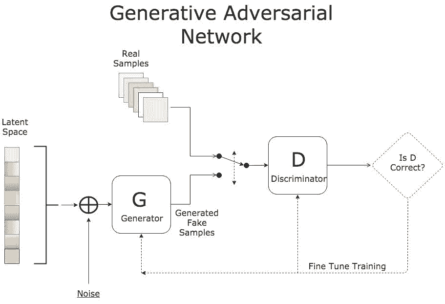
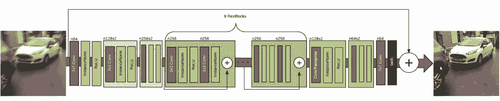
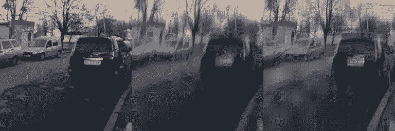
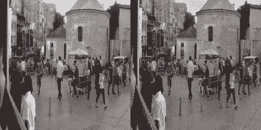
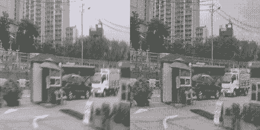
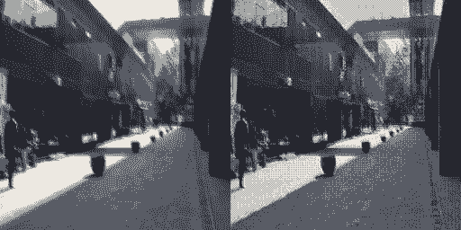
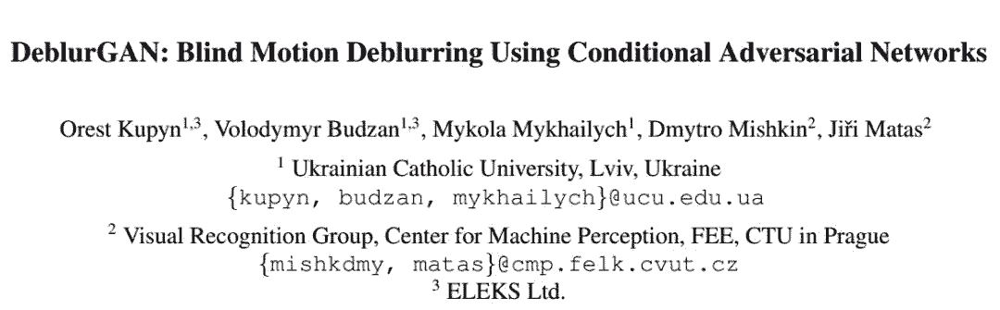

# 教程 | 在 Keras 上实现 GAN：构建消除图片模糊的应用

选自 Sicara Blog

**作者：****Raphaël Meudec**

**机器之心编译**

**参与：陈韵竹、李泽南**

> 2014 年，Ian Goodfellow 提出了生成对抗网络（GAN），今天，GAN 已经成为深度学习最热门的方向之一。本文将重点介绍如何利用 Keras 将 GAN 应用于图像去模糊（image deblurring）任务当中。

Keras 代码地址：https://github.com/RaphaelMeudec/deblur-gan

此外，请查阅 DeblurGAN 的原始论文（https://arxiv.org/pdf/1711.07064.pdf）及其 Pytorch 版本实现：https://github.com/KupynOrest/DeblurGAN/。

**生成对抗网络简介**

在生成对抗网络中，有两个网络互相进行训练。生成器通过生成逼真的虚假输入来误导判别器，而判别器会分辨输入是真实的还是人造的。



*GAN 训练流程*

训练过程中有三个关键步骤：

*   使用生成器根据噪声创造虚假输入；

*   利用真实输入和虚假输入训练判别器；

*   训练整个模型：该模型是判别器和生成器连接所构建的。

请注意，判别器的权重在第三步中被冻结。

对两个网络进行连接的原因是不存在单独对生成器输出的反馈。我们唯一的衡量标准是判别器是否能接受生成的样本。

以上，我们简要介绍了 GAN 的架构。如果你觉得不够详尽，可以参考这篇优秀的介绍：[生成对抗网络初学入门：一文读懂 GAN 的基本原理（附资源）](http://mp.weixin.qq.com/s?__biz=MzA3MzI4MjgzMw==&mid=2650730721&idx=2&sn=95b97b80188f507c409f4c72bd0a2767&chksm=871b349fb06cbd891771f72d77563f77986afc9b144f42c8232db44c7c56c1d2bc019458c4e4&scene=21#wechat_redirect)。

**数据**

Ian Goodfellow 首先应用 GAN 模型生成 MNIST 数据。而在本教程中，我们将生成对抗网络应用于图像去模糊。因此，生成器的输入不是噪声，而是模糊的图像。

我们采用的数据集是 GOPRO 数据集。该数据集包含来自多个街景的人工模糊图像。根据场景的不同，该数据集在不同子文件夹中分类。

你可以下载简单版：https://drive.google.com/file/d/1H0PIXvJH4c40pk7ou6nAwoxuR4Qh_Sa2/view

或完整版：https://drive.google.com/file/d/1SlURvdQsokgsoyTosAaELc4zRjQz9T2U/view

我们首先将图像分配到两个文件夹 A（模糊）B（清晰）中。这种 A&B 的架构对应于原始的 pix2pix 论文。为此我创建了一个自定义的脚本在 github 中执行这个任务，请按照 README 的说明去使用它：

https://github.com/RaphaelMeudec/deblur-gan/blob/master/organize_gopro_dataset.py

**模型**

训练过程保持不变。首先，让我们看看神经网络的架构吧！

**生成器**

该生成器旨在重现清晰的图像。该网络基于 ResNet 模块，它不断地追踪关于原始模糊图像的演变。本文同样使用了一个基于 UNet 的版本，但我还没有实现这个版本。这两种模块应该都适合图像去模糊。



*DeblurGAN 生成器网络架构，源论文《DeblurGAN: Blind Motion Deblurring Using Conditional Adversarial Networks》。*

其核心是应用于原始图像上采样的 9 个 ResNet 模块。让我们来看看 Keras 上的代码实现！

```py
from keras.layers import Input, Conv2D, Activation, BatchNormalization
from keras.layers.merge import Add
from keras.layers.core import Dropout

def res_block(input, filters, kernel_size=(3,3), strides=(1,1), use_dropout=False):
    """
    Instanciate a Keras Resnet Block using sequential API.
    :param input: Input tensor
    :param filters: Number of filters to use
    :param kernel_size: Shape of the kernel for the convolution
    :param strides: Shape of the strides for the convolution
    :param use_dropout: Boolean value to determine the use of dropout
    :return: Keras Model
    """
    x = ReflectionPadding2D((1,1))(input)
    x = Conv2D(filters=filters,
               kernel_size=kernel_size,
               strides=strides,)(x)
    x = BatchNormalization()(x)
    x = Activation('relu')(x)

    if use_dropout:
        x = Dropout(0.5)(x)

    x = ReflectionPadding2D((1,1))(x)
    x = Conv2D(filters=filters,
                kernel_size=kernel_size,
                strides=strides,)(x)
    x = BatchNormalization()(x)

    # Two convolution layers followed by a direct connection between input and output
    merged = Add()([input, x])
    return merged 
```

该 ResNet 层基本是卷积层，其输入和输出都被添加以形成最终的输出。

```py
from keras.layers import Input, Activation, Add
from keras.layers.advanced_activations import LeakyReLU
from keras.layers.convolutional import Conv2D, Conv2DTranspose
from keras.layers.core import Lambda
from keras.layers.normalization import BatchNormalization
from keras.models import Model

from layer_utils import ReflectionPadding2D, res_block

ngf = 64
input_nc = 3
output_nc = 3
input_shape_generator = (256, 256, input_nc)
n_blocks_gen = 9

def generator_model():
    """Build generator architecture."""
    # Current version : ResNet block
    inputs = Input(shape=image_shape)

    x = ReflectionPadding2D((3, 3))(inputs)
    x = Conv2D(filters=ngf, kernel_size=(7,7), padding='valid')(x)
    x = BatchNormalization()(x)
    x = Activation('relu')(x)

    # Increase filter number
    n_downsampling = 2
    for i in range(n_downsampling):
        mult = 2**i
        x = Conv2D(filters=ngf*mult*2, kernel_size=(3,3), strides=2, padding='same')(x)
        x = BatchNormalization()(x)
        x = Activation('relu')(x)

    # Apply 9 ResNet blocks
    mult = 2**n_downsampling
    for i in range(n_blocks_gen):
        x = res_block(x, ngf*mult, use_dropout=True)

    # Decrease filter number to 3 (RGB)
    for i in range(n_downsampling):
        mult = 2**(n_downsampling - i)
        x = Conv2DTranspose(filters=int(ngf * mult / 2), kernel_size=(3,3), strides=2, padding='same')(x)
        x = BatchNormalization()(x)
        x = Activation('relu')(x)

    x = ReflectionPadding2D((3,3))(x)
    x = Conv2D(filters=output_nc, kernel_size=(7,7), padding='valid')(x)
    x = Activation('tanh')(x)

    # Add direct connection from input to output and recenter to [-1, 1]
    outputs = Add()([x, inputs])
    outputs = Lambda(lambda z: z/2)(outputs)

    model = Model(inputs=inputs, outputs=outputs, name='Generator')
    return model 
```

*生成器架构的 Keras 实现*

按照计划，9 个 ResNet 模块会应用于输入的上采样版本。我们在其中添加了从输入到输出的连接，并对结果除以 2 以保持标准化输出。

这就是生成器的架构！让我们继续看看判别器怎么做吧。

**判别器**

判别器的目标是判断输入图像是否是人造的。因此，判别器的体系结构是卷积以及输出单一值。

```py
from keras.layers import Input
from keras.layers.advanced_activations import LeakyReLU
from keras.layers.convolutional import Conv2D
from keras.layers.core import Dense, Flatten
from keras.layers.normalization import BatchNormalization
from keras.models import Model

ndf = 64
output_nc = 3
input_shape_discriminator = (256, 256, output_nc)

def discriminator_model():
    """Build discriminator architecture."""
    n_layers, use_sigmoid = 3, False
    inputs = Input(shape=input_shape_discriminator)

    x = Conv2D(filters=ndf, kernel_size=(4,4), strides=2, padding='same')(inputs)
    x = LeakyReLU(0.2)(x)

    nf_mult, nf_mult_prev = 1, 1
    for n in range(n_layers):
        nf_mult_prev, nf_mult = nf_mult, min(2**n, 8)
        x = Conv2D(filters=ndf*nf_mult, kernel_size=(4,4), strides=2, padding='same')(x)
        x = BatchNormalization()(x)
        x = LeakyReLU(0.2)(x)

    nf_mult_prev, nf_mult = nf_mult, min(2**n_layers, 8)
    x = Conv2D(filters=ndf*nf_mult, kernel_size=(4,4), strides=1, padding='same')(x)
    x = BatchNormalization()(x)
    x = LeakyReLU(0.2)(x)

    x = Conv2D(filters=1, kernel_size=(4,4), strides=1, padding='same')(x)
    if use_sigmoid:
        x = Activation('sigmoid')(x)

    x = Flatten()(x)
    x = Dense(1024, activation='tanh')(x)
    x = Dense(1, activation='sigmoid')(x)

    model = Model(inputs=inputs, outputs=x, name='Discriminator')
    return model 
```

*判别器架构的 Keras 实现*

最后一步是构建完整的模型。本文中这个生成对抗网络的特殊性在于：其输入是实际图像而非噪声。因此，对于生成器的输出，我们能得到直接的反馈。

```py
from keras.layers import Input
from keras.models import Model

def generator_containing_discriminator_multiple_outputs(generator, discriminator):
    inputs = Input(shape=image_shape)
    generated_images = generator(inputs)
    outputs = discriminator(generated_images)
    model = Model(inputs=inputs, outputs=[generated_images, outputs])
    return model
```

让我们一起看看，如何利用两个损失函数来充分利用这种特殊性。

**训练过程**

**损失函数**

我们在两个级别提取损失函数：生成器的末尾和整个模型的末尾。

前者是一种知觉损失（perceptual loss），它直接根据生成器的输出计算而来。这种损失函数确保了 GAN 模型面向一个去模糊任务。它比较了 VGG 第一批卷积的输出值。

```py
import keras.backend as K
from keras.applications.vgg16 import VGG16
from keras.models import Model

image_shape = (256, 256, 3)

def perceptual_loss(y_true, y_pred):
    vgg = VGG16(include_top=False, weights='imagenet', input_shape=image_shape)
    loss_model = Model(inputs=vgg.input, outputs=vgg.get_layer('block3_conv3').output)
    loss_model.trainable = False
    return K.mean(K.square(loss_model(y_true) - loss_model(y_pred)))
```

而后者是对整个模型的输出执行的 Wasserstein 损失，它取的是两个图像差异的均值。这种损失函数可以改善生成对抗网络的收敛性。

```py
import keras.backend as K

def wasserstein_loss(y_true, y_pred):
    return K.mean(y_true*y_pred)
```

**训练过程**

第一步是加载数据并初始化所有模型。我们使用我们的自定义函数加载数据集，同时在我们的模型中添加 Adam 优化器。我们通过设置 Keras 的可训练选项防止判别器进行训练。

```py
# Load dataset
data = load_images('./images/train', n_images)
y_train, x_train = data['B'], data['A']

# Initialize models
g = generator_model()
d = discriminator_model()
d_on_g = generator_containing_discriminator_multiple_outputs(g, d)

# Initialize optimizers
g_opt = Adam(lr=1E-4, beta_1=0.9, beta_2=0.999, epsilon=1e-08)
d_opt = Adam(lr=1E-4, beta_1=0.9, beta_2=0.999, epsilon=1e-08)
d_on_g_opt = Adam(lr=1E-4, beta_1=0.9, beta_2=0.999, epsilon=1e-08)

# Compile models
d.trainable = True
d.compile(optimizer=d_opt, loss=wasserstein_loss)
d.trainable = False
loss = [perceptual_loss, wasserstein_loss]
loss_weights = [100, 1]
d_on_g.compile(optimizer=d_on_g_opt, loss=loss, loss_weights=loss_weights)
d.trainable = True
```

然后，我们启动 epoch 并将数据集分成不同批量。

```py
for epoch in range(epoch_num):
  print('epoch: {}/{}'.format(epoch, epoch_num))
  print('batches: {}'.format(x_train.shape[0] / batch_size))

  # Randomize images into batches
  permutated_indexes = np.random.permutation(x_train.shape[0])

  for index in range(int(x_train.shape[0] / batch_size)):
      batch_indexes = permutated_indexes[index*batch_size:(index+1)*batch_size]
      image_blur_batch = x_train[batch_indexes]
      image_full_batch = y_train[batch_indexes]
```

最后，根据两种损失，我们先后训练判别器和生成器。我们用生成器产生虚假输入，然后训练判别器来区分虚假输入和真实输入，并训练整个模型。

```py
for epoch in range(epoch_num):
  for index in range(batches):
    # [Batch Preparation]

    # Generate fake inputs
    generated_images = g.predict(x=image_blur_batch, batch_size=batch_size)

    # Train multiple times discriminator on real and fake inputs
    for _ in range(critic_updates):
        d_loss_real = d.train_on_batch(image_full_batch, output_true_batch)
        d_loss_fake = d.train_on_batch(generated_images, output_false_batch)
        d_loss = 0.5 * np.add(d_loss_fake, d_loss_real)

    d.trainable = False
    # Train generator only on discriminator's decision and generated images
    d_on_g_loss = d_on_g.train_on_batch(image_blur_batch, [image_full_batch, output_true_batch])

    d.trainable = True
```

你可以参考如下 Github 地址查看完整的循环：

https://www.github.com/raphaelmeudec/deblur-gan

**材料**

我使用了 Deep Learning AMI（3.0 版本）中的 AWS 实例（p2.xlarge）。它在 GOPRO 数据集上的训练时间约为 5 小时（50 个 epoch）。

**图像去模糊结果**

 **

*从左到右：原始图像、模糊图像、GAN 输出。*

上面的输出是我们 Keras Deblur GAN 的输出结果。即使是在模糊不清的情况下，网络也能够产生更令人信服的图像。车灯和树枝都会更清晰。



*左图：GOPRO 测试图片；**右图：GAN 输出。*

其中的一个限制是图像顶部的噪点图案，这可能是由于使用 VGG 作为损失函数引起的。



*左图：GOPRO 测试图片；**右图：GAN 输出。*

希望你在这篇「基于生成对抗网络进行图像去模糊」的文章中度过了一段愉快的阅读时光！



*左图：GOPRO 测试图片；**右图：GAN 输出。*

**论文：DeblurGAN: Blind Motion Deblurring Using Conditional Adversarial Networks **

 **

 **论文地址：https://arxiv.org/pdf/1711.07064.pdf

**摘要：**我们提出了一种基于有条件 GAN 和内容损失函数的运动去模糊的端到端学习方法——DeblurGAN。在结构相似性测量和视觉外观方面，DeblurGAN 达到了业内最先进的技术水平。去模糊模型的质量也以一种新颖的方式在现实问题中考量——即对（去）模糊图像的对象检测。该方法比目前最佳的竞争对手速度提升了 5 倍。另外，我们提出了一种从清晰图像合成运动模糊图像的新方法，它可以实现真实数据集的增强。

模型、训练代码和数据集都可以在以下地址获得：https://github.com/KupynOrest/DeblurGAN。

原文链接：https://blog.sicara.com/keras-generative-adversarial-networks-image-deblurring-45e3ab6977b5

****本文为机器之心编译，**转载请联系本公众号获得授权****。**

✄------------------------------------------------

**加入机器之心（全职记者/实习生）：hr@jiqizhixin.com**

**投稿或寻求报道：editor@jiqizhixin.com**

**广告&商务合作：bd@jiqizhixin.com********