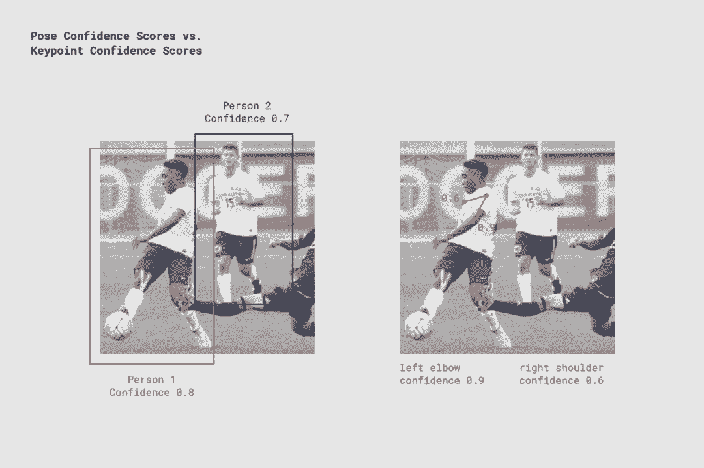
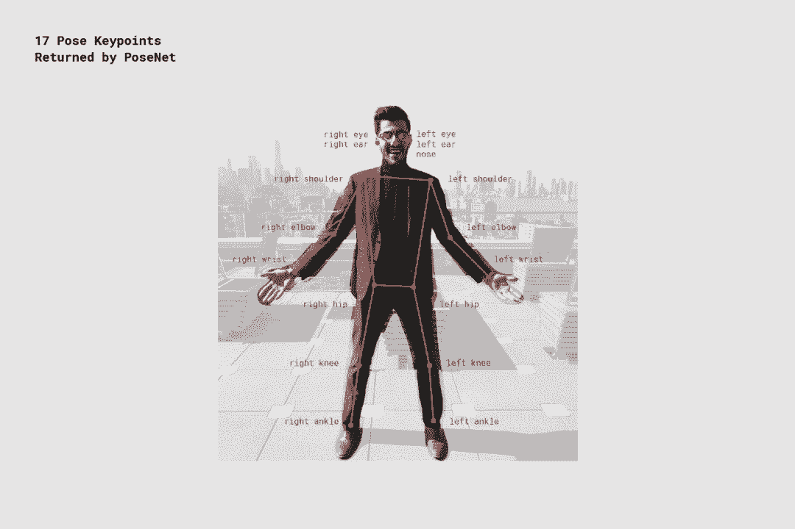
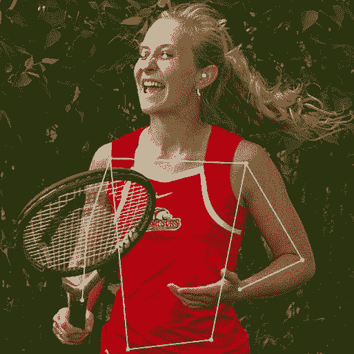
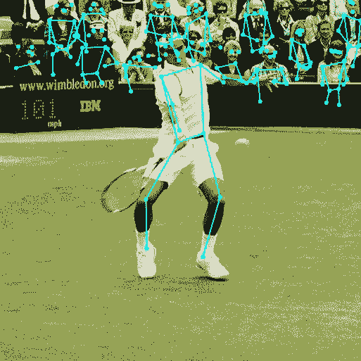
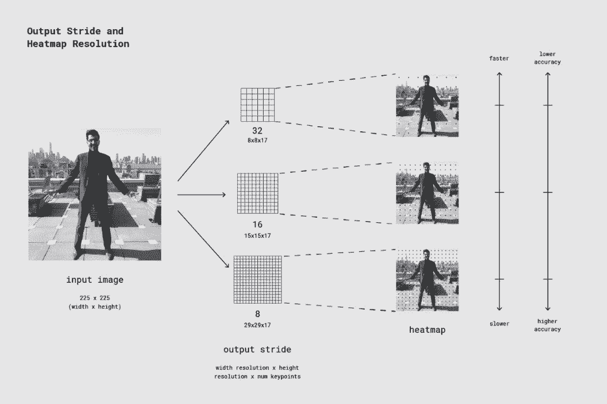
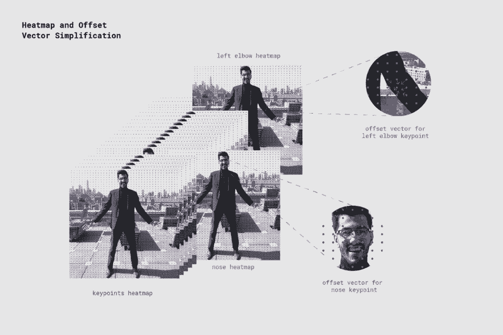

# 教程 | TF 官方博客：基于 TensorFlow.js 框架的浏览器实时姿态估计

选自 TensorFlow Blog

**机器之心编译**

**参与：王淑婷、路**

> TensorFlow 近日发布 TensorFlow.js 版本 PoseNet，该版本 PoseNet 只要电脑或手机配备了适当的网络摄像头，就可以直接在网页浏览器中进行体验。该模型源代码已开放，Javascript 开发者只需几行代码就可以修补和使用该技术。

通过与谷歌创意实验室合作，TensorFlow 近日发布了 TensorFlow.js 版的 PoseNet。这是一款机器学习模型，可以在浏览器中实时估计人体姿态。

模型 Demo：https://storage.googleapis.com/tfjs-models/demos/posenet/camera.html


*PoseNet 可以利用单姿态或多姿态算法检测图像和视频中的人物，而所有这些都可以在浏览器中实现。*

那么姿态估计到底是什么呢？该计算机视觉技术检测图像和视频中人物，以确定诸如某人的肘部在图像中的位置。要明确的是，这种技术不会识别图像中的人——没有与姿态检测相关联的个人可识别信息，而只是简单地估计关键身体部位的位置。

它为什么如此振奋人心？姿态估计有很多用途，从对身体作出反应的交互式装置到增强现实、动画、健身等。TensorFlow 希望该模型的可访问性能够鼓励更多的开发者和制造者在自己独特的项目中进行姿态检测实验和应用。虽然很多其他的姿态检测系统已经开源，但这些系统都需要专门的硬件和/或摄像头，以及相当多的系统设置。而基于 TensorFlow.js 框架运行的 PoseNet，只要电脑或手机配备了适当的网络摄像头，你就可以直接在网页浏览器中体验这一技术。TensorFlow 已经开放了该模型的源代码，因此 Javascript 开发者只需几行代码就可以修补和使用该技术。此外，这项技术实际上有助于保护用户隐私。自从基于 TensorFlow.js 的 PoseNet 在浏览器中运行以来，没有用户的姿态数据泄露。

**PoseNet 了解一下**

PoseNet 可用于估计单个姿态或多个姿态，这意味着有两种算法，一种仅能检测图像/视频中的一个人，而另一种可以检测图像/视频中的多个人。为什么要有两个版本？单人姿态检测器更快、更简单，但要求图像中只能出现一个目标。我们先讨论单姿态，因为它更容易理解。

简单而言，姿态估计分两个阶段进行：

1.  将 RGB 图像作为输入馈送到卷积神经网络中。

2.  利用单姿态或多姿态解码算法解码来解码模型输出中的姿态、姿态置信度得分、关键点位置和关键点置信度得分。

但这些关键词是什么意思呢？我们来看几个最重要的词：

*   姿态——在最高层次上，PoseNet 将返回一个姿态目标，其中包含检测到的每个人物的关键点列表和实例级置信度得分。



*PoseNet 返回检测到的每个人和每个姿态关键点的置信度值。图像来源：《Microsoft Coco: Common Objects in Context Dataset》（https://cocodataset.org ）*

*   姿态置信度得分——决定姿态估计的总体置信度，范围在 0.0~1.0 之间，可用来隐藏被认为不够明显的姿态。

*   关键点——人体姿态被估计的一部分，如鼻子、右耳、左膝、右脚等。它包含位置和关键点置信度得分。PoseNet 当前可以检测 17 个关键点，如下图所示：



*PoseNet 检测到的 17 个姿态关键点。*

*   关键点置信度得分——决定估计的关键点位置准确的置信度，范围在 0.0~1.0 之间，可用来隐藏被认为不够明显的关键点。

*   关键点位置——检测到的关键点在原始输入图像中的 2D xy 坐标。

**第一步：导入 TensorFlow.js 框架和 PoseNet 库**

TensorFlow 团队进行了大量工作来降低模型的复杂度，封装功能使之易于使用。接下来将介绍设置 PoseNet 项目的基础知识。

PoseNet 库可以使用 npm 安装：

```py
1.  `npm install @tensorflow-models/posenet`

```

使用 es6 模块导入：

```py
1.  `import * as posenet from '@tensorflow-models/posenet';`

2.  `const net = await posenet.load();`

```

或通过页面中的 bundle 文件导入：

```py
1.  `<html>`

2.  `<body>`

3.  `<!-- Load TensorFlow.js -->`

4.  `<script src="https://unpkg.com/@tensorflow/tfjs"></script>`

5.  `<!-- Load Posenet -->`

6.  `<script src="https://unpkg.com/@tensorflow-models/posenet">`

7.  `</script>`

8.  `<script type="text/javascript">`

9.  `posenet.load().then(function(net) {`

10.  `// posenet model loaded`

11.  `});`

12.  `</script>`

13.  `</body>`

14.  `</html>`

```

**第二步（上）：单人姿态估计**



*应用于图像的单人姿态估计算法示例。图像来源：《Microsoft Coco: Common Objects in Context Dataset》（https://cocodataset.org）*

如前所述，单姿态估计算法是两者中较简单也较快速的。理想的使用场景是当输入的图像或视频中只有一个人时使用这种算法。其缺点在于，如果图像中有多个人，则来自两个人的关键点可能被估计为同一个姿态的一部分——这意味着，A 的左臂和 B 的右膝可能被该算法归为同一姿态。因此，如果输入的图像可能包含多人，则应当使用多姿态估计算法。

让我们看一下单姿态估计算法的输入：

*   输入图像元素——一种 html 元素，包含要为诸如视频或图像标签预测姿态的图像。重点是，输入的图像或视频元素应为正方形。

*   图像比例因子——介于 0.2~1 的数字，默认值为 0.50。用于在向网络输送图像之前，对图像进行缩放。将此数字设置得较低，以缩小图像，提高输送至网络的速度，不过这是以准确率为代价的。

*   水平翻转——默认值为 false，在姿态需要水平翻转/镜像的情况下。而对于默认情况为水平翻转的视频（即网络摄像头），且你希望姿态以正确方向返回，应将水平翻转设置为 true。

*   输出步幅——必须为 32、16 或 8。默认值为 16。从内部来看，该参数影响神经网络中层的高度和宽度。在较高层次上，它会影响姿态估计的准确率和速度。输出步幅的值越低，准确率越高，但速度越慢；输出步幅值越高，速度越快，但准确率越低。查看输出步幅对输出质量影响的最佳方法是使用单姿态估计算法 demo：https://storage.googleapis.com/tfjs-models/demos/posenet/camera.html。

现在，我们看一下单姿态估计算法的输出：

*   每个姿态包含姿态置信度得分和 17 个关键点。

*   每个关键点包含其位置和置信度得分。同样，所有关键点位置在输入图像空间中都有 xy 坐标，并且可以直接映射到图像上。

以下简短的代码块展示了如何使用单姿态估计算法：

```py
1.  `const imageScaleFactor = 0.50;`

2.  `const flipHorizontal = false;`

3.  `const outputStride = 16;`

4.  `const imageElement = document.getElementById('cat');`

5.  `// load the posenet model`

6.  `const net = await posenet.load();`

7.  `const pose = await net.estimateSinglePose(imageElement, scaleFactor, flipHorizontal, outputStride);`

```

输出姿态示例如下所示：

```py
1.  `{`

2.  `"score": 0.32371445304906,`

3.  `"keypoints": [`

4.  `{ // nose`

5.  `"position": {`

6.  `"x": 301.42237830162,`

7.  `"y": 177.69162777066`

8.  `},`

9.  `"score": 0.99799561500549`

10.  `},`

11.  `{ // left eye`

12.  `"position": {`

13.  `"x": 326.05302262306,`

14.  `"y": 122.9596464932`

15.  `},`

16.  `"score": 0.99766051769257`

17.  `},`

18.  `{ // right eye`

19.  `"position": {`

20.  `"x": 258.72196650505,`

21.  `"y": 127.51624706388`

22.  `},`

23.  `"score": 0.99926537275314`

24.  `},`

25.  `...`

26.  `]`

27.  `}`

```

**第二步（下）：多人姿态估计**



*应用于图像的多人姿态估计算法示例。图像来源：「Microsoft Coco: Common Objects in Context Dataset」（https://cocodataset.org）*

多人姿态估计算法可以估计一个图像中的多个人/姿态。它比单姿态算法更复杂更慢，但其优点是，如果一张图像中出现多个人物，则检测到的关键点不太可能关联至不匹配的姿态。因此，即使是用来检测一个人的姿态，该算法可能也更理想。

此外，该算法还有一个不错的特性——其性能不受输入图像中人数的影响。无论有 15 个还是 5 个人要检测，它的计算时间都一样。

我们来看一下输入：

*   输入图像元素——与单姿态估计相同。

*   图像比例因子——与单姿态估计相同。

*   水平翻转——与单姿态估计相同。

*   输出步幅——与单姿态估计相同。

*   最大姿态检测——整数，默认值为 5。表示可检测的最大姿态数量。

*   姿态置信度得分阈值——0.0~1.0，默认值为 0.5。在较高层次上，它控制返回姿态的最小置信度得分。

*   非极大值抑制（NMS）半径——以像素为单位。在较高水平上，它控制返回姿态之间的最小距离。默认值为 20，适用于大多数情况。只有在调整姿态置信度得分不够好的情况下，应该增加/减少其数值，以过滤不太精确的姿态。

查看这些参数影响的最佳方法是使用多姿态估计 demo（https://storage.googleapis.com/tfjs-models/demos/posenet/camera.html）。

让我们查看一下输出：

*   解决多姿态估计问题。

*   每个姿态包含与单人姿态估计算法相同的信息。

以下简短的代码块展示了如何使用多姿态估计算法：

```py
1.  `const imageScaleFactor = 0.50;`

2.  `const flipHorizontal = false;`

3.  `const outputStride = 16;`

4.  `// get up to 5 poses`

5.  `const maxPoseDetections = 5;`

6.  `// minimum confidence of the root part of a pose`

7.  `const scoreThreshold = 0.5;`

8.  `// minimum distance in pixels between the root parts of poses`

9.  `const nmsRadius = 20;`

10.  `const imageElement = document.getElementById('cat');`

11.  `// load posenet`

12.  `const net = await posenet.load();`

13.  `const poses = await net.estimateMultiplePoses(`

14.  `imageElement, imageScaleFactor, flipHorizontal, outputStride,`

15.  `maxPoseDetections, scoreThreshold, nmsRadius);`

```

多姿态输出示例如下：

```py
1.  `// array of poses/persons`

2.  `[` 

3.  `{ // pose #1`

4.  `"score": 0.42985695206067,`

5.  `"keypoints": [`

6.  `{ // nose`

7.  `"position": {`

8.  `"x": 126.09371757507,`

9.  `"y": 97.861720561981`

10.  `},`

11.  `"score": 0.99710708856583`

12.  `},`

13.  `...` 

14.  `]`

15.  `},`

16.  `{ // pose #2`

17.  `"score": 0.13461434583673,`

18.  `"keypositions": [`

19.  `{ // nose`

20.  `"position": {`

21.  `"x": 116.58444058895,`

22.  `"y": 99.772533416748`

23.  `},`

24.  `"score": 0.9978438615799`

25.  `},`

26.  `...`

27.  `]`

28.  `},`

29.  `...` 

30.  `]`

```

读完以上内容，你对 PoseNet demo 已经有了足够的了解，阅读止于此处也是一个不错的选择。但如果想进一步了解模型和实现的技术细节，可继续阅读以下内容。

**对于好奇的大脑来说，这是一次技术深潜**

本节将深入讨论单姿态估计算法的更多技术细节。在较高层次上，其流程如下所示：


*使用 PoseNet 的单人姿态检测器流程*

需要注意的一个重要细节是，研究人员同时训练了 PoseNet 的 ResNet 模型和 MobileNet 模型。虽然 ResNet 模型具有较高的准确率，但其庞大体积和多层结构使得页面加载时间和推断时间对于任何实时应用来说都不太理想。TensorFlow 采用了 MobileNet 模型，因为它是为移动设备运行而设计的。

**再回到单姿态估计算法**

处理模型输入：对输出步幅的解释

首先，我们将通过讨论输出步幅来了解 PoseNet 模型输出（主要是热图和偏移向量）。

方便的一点是，PoseNet 模型要求图像尺寸不变，这意味着它可以预测与原始图像相同比例的姿态位置，而不管图像是否被缩小。这也意味着 PoseNet 可以通过在运行时设置输出步幅，以性能为代价获取更高的准确率。

输出步幅决定了输出比输入图像缩小的程度，它会影响层的大小和模型输出。输出步幅越高，网络中层的分辨率和输出及其准确率就越小。在此实现中，输出步幅的值可以是 8、16 或 32。换句话说，32 的输出步幅将造成最快的性能、最低的准确率，而 8 将导致最高的准确率、最慢的性能。我们建议从 16 开始。



*输出步幅决定了输出比输入图像缩小的程度。输出步幅越高，速度越快，但准确率越低。*

实现过程中，当输出步幅被设置为 8 或 16 时，各层中的输入步幅将减少，以创建更大的输出分辨率。然后使用用空洞卷积（atrous convolution）使后续层中的卷积滤波器具有更宽的视野（当输出步幅为 32 时，不使用空洞卷积）。虽然 TensorFlow 支持空洞卷积，但 TensorFlow.js 并不支持，因此我们添加了一个 PR 来弥补这一点。

**模型输出：热图和偏移向量（Offset Vector）**

当 PoseNet 处理图像时，实际上返回的是热图和偏移向量，我们可对其进行解码，以在图像中找到对应姿态关键点的高置信度区域。下图展示了在较高层次，每个姿态关键点与热图张量和偏移向量张量的关联。



*PoseNet 返回的 17 个姿态关键点中每一个都与用于确定关键点确切位置的热图张量和偏移向量张量相关联。*

这两个输出都是三维张量，其高度和宽度称为分辨率。根据以下公式，分辨率由输入图像大小和输出步幅确定：

```py
1.  `Resolution = ((InputImageSize - 1) / OutputStride) + 1`

2.  `// Example: an input image with a width of 225 pixels and an output`

3.  `// stride of 16 results in an output resolution of 15`

4.  `// 15 = ((225 - 1) / 16) + 1`

```

**热图**

每个热图是尺寸为分辨率 x 分辨率 x 17 的 3D 张量，17 是 PoseNet 检测到的关键点的数量。例如，对于 225 的图像大小和 16 的输出步幅，热图大小将是 15 x15x 17。（17 个中）第三维的每个切片图对应特定关键点的热图。热图中每个位置具有置信度得分，即该关键点类型的一部分存在于该位置中的概率。我们可以将其看作是把原始图像分割成 15x 15 网格，其中热图得分提供了每个关键点在每个网格正方形中存在可能性的分类。

**偏移向量**

每个偏移向量是尺寸为分辨率 x 分辨率 x 34 的 3D 张量，34 是关键点数量*2 得出的数字。如果图像大小为 225，输出步幅为 16，则该值为 15x15x34。由于热图是关键点所在位置的近似，因此偏移向量在位置上对应热图点，并且用于预测关键点的确切位置，如通过从相应热图点沿着向量行进。偏移向量的前 17 个切片图包含向量的 x，后 17 个切片包含 y。偏移向量大小与原始图像的比例相同。

**根据模型的输出估计姿态**

在图像输入到模型后，我们执行一些计算以从输出估计姿态。例如，单姿态估计算法返回姿态置信度得分，该得分本身包含多个关键点（由 part ID 索引），每个关键点具有置信度得分和 xy 位置。

要获取姿态的关键点：

 1\. 在热图上进行 sigmoid 激活函数操作，获得得分。

```py
1.  `scores = heatmap.sigmoid()`

```

 2\. 对关键点置信度得分执行 argmax2d，获得热图中的 x 和 y 索引以及每个部分的最高得分，这基本上是该部分最可能存在的位置。这将产生大小为 17x2 的张量，每行是热图中的 y 和 x 索引以及每个部分的最高得分。

```py
1.  `heatmapPositions = scores.argmax(y, x)`

```

 3\. 从某部分热图中的 x 和 y 索引的偏移中获取 x 和 y，得到每个部分的偏移向量。这产生大小为 17x2 的张量，其中每行都是对应关键点的偏移向量。例如，对于索引 k 处的部分，当热图位置为 y 和 d 时，偏移向量为：

```py
1.  `offsetVector = [offsets.get(y, x, k), offsets.get(y, x, 17 + k)]`

```

 4\. 为获得关键点，每个部分的热图 x 和 y 乘以输出步幅，然后再加与原始图像比例相同的相应偏移向量。

```py
1.  `keypointPositions = heatmapPositions * outputStride + offsetVectors`

```

 5\. 最后，每个关键点置信度得分是其热图位置的置信度得分。姿态置信度得分是关键点得分的平均值。

**多人姿态估计**

多姿态估计算法的细节不在本文的讨论范围之内。该算法的主要不同之处在于，它使用贪婪过程通过沿着基于部分的图跟随位移向量来将关键点分组。具体而言，它采用了研究论文《PersonLab: Person Pose Estimation and Instance Segmentation with a Bottom-Up, Part-Based, Geometric Embedding Model》中的快速贪婪解码算法（fast greedy decoding algorithm）。有关多姿态算法的更多信息，请阅读完整论文或查看代码。代码地址：https://github.com/tensorflow/tfjs-models/tree/master/posenet/src。

*原文链接：https://medium.com/tensorflow/real-time-human-pose-estimation-in-the-browser-with-tensorflow-js-7dd0bc881cd5*

****本文为机器之心编译，**转载请联系本公众号获得授权****。**

✄------------------------------------------------

**加入机器之心（全职记者/实习生）：hr@jiqizhixin.com**

**投稿或寻求报道：**content**@jiqizhixin.com**

**广告&商务合作：bd@jiqizhixin.com**