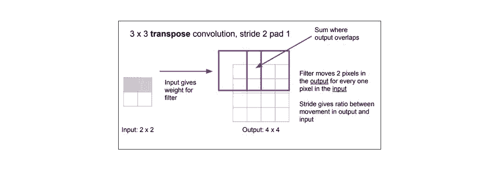
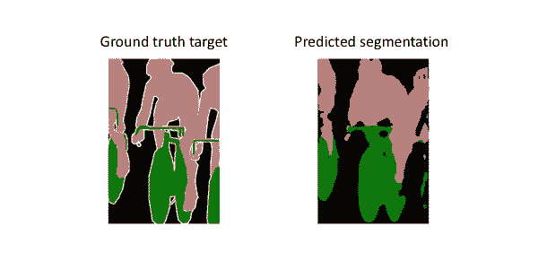

# 深度 | 图像语义分割的工作原理和 CNN 架构变迁

选自 jeremyjordan.me

**作者：J****eremy Jordan**

****机器之心编译****

**参与：李诗萌、刘晓坤**

> > 图像分割是根据图像内容对指定区域进行标记的计算机视觉任务，简言之就是「这张图片里有什么，其在图片中的位置是什么？」本文聚焦于语义分割任务，即在分割图中将同一类别的不同实例视为同一对象。作者将沿着该领域的研究脉络，说明如何用卷积神经网络处理语义图像分割的任务。
> 
> 更具体地讲，语义图像分割的目标在于标记图片中每一个像素，并将每一个像素与其表示的类别对应起来。因为会预测图像中的每一个像素，所以一般将这样的任务称为密集预测。
> 
> 
> 
> *语义分割的例子，目标是预测图像中每一个像素的类别标签。（图源：http://host.robots.ox.ac.uk/pascal/VOC/voc2012/#devkit）*
> 
> 当我们有越来越多要用机器执行的任务时，为这些机器配备必需的感知器是很重要的。
> 
> 
> 
> *自动驾驶中实时语义分割道路场景。（图源：https://m.youtube.com/watch?v=ATlcEDSPWXY）*
> 
> 还有一点要注意的是我们不会分割同一类别的实例，只需要关注每一个像素的类别。换句话讲，如果在输入图像中有两个目标属于同一类，分割映射不会将其分为单独的两个目标。
> 
> 相对地，实例分割模型是另一种不同的模型，该模型可以区分同一类的不同目标。
> 
> **任务表征**
> 
> 简单地说，我们的目标是要用 RGB 图（高 x 宽 x3）或灰度图（高 x 宽 x1）为输入，并输出一个分割图，在分割图中每个像素都包括一个用整数表示的类别标签（高 x 宽 x1）。
> 
> 
> 
> *注意：为了视觉上的理解简单起见，我标记的是分辨率比较低的预测图。事实上，分割标签的分辨率是和原始输入图的分辨率相对应的。*
> 
> 与我们处理标准分类值的方法相似，我们通过独热编码类别标签的方法创建目标——本质上讲是要为每一个可能的类创建一个输出通道。
> 
> 
> 
> 然后我们可以利用每一个像素位深向量的 argmax 函数将预测值分解为分割映射（如上图所示）。
> 
> 也可以通过将目标重叠在输入图像上来对目标进行观察。
> 
> 
> 
> **建立网络架构**
> 
> 针对这项任务简单地构建神经网络架构的方法是简单地堆叠大量卷积层（用 same 填充保留维度）后输出最终的分割映射。通过特征图的接连转换，直接从输入图像学到了相对应的分割映射；然而，在整个网络中要保留完整分辨率的计算成本是很高的。
> 
> 
> 
> *图源：http://cs231n.stanford.edu/slides/2017/cs231n_2017_lecture11.pdf*
> 
> 回顾深度卷积网络，前期的卷积层更倾向于学习低级概念，而后期的卷积层则会产生更高级（且专一）的特征图。为了保持表达性，一般而言，当我们到达更深层的网络时，需要增加特征图（通道）的数量。
> 
> 对图像分类任务而言，这不一定会造成什么问题，因为对这个任务而言，我们只需要关注图像里面有什么（而不是目标类别对象的位置）。因此，我们可以通过池化或逐步卷积（即压缩空间分辨率）定期对特征图进行下采样以缓和计算压力。
> 
> 常用的图像分割模型的方法遵循编码器/解码器结构，在这个结构中，我们对输入的空间分辨率下采样，产生分辨率更低的特征图，通过学习这些特征图可以更高效地分辨类别，还可以将这些特征表征上采样至完整分辨率的分割图。
> 
> 
> 
> *图源：http://cs231n.stanford.edu/slides/2017/cs231n_2017_lecture11.pdf*
> 
> **上采样方法**
> 
> 我们可以用很多不一样的方法对特征图的分辨率上采样。池化操作通过汇总局部区域的单个值（平均池化或最大池化）下采样分辨率，「上池化」操作通过将单个值分配给更高的分辨率对分辨率进行上采样。
> 
> 
> 
> *图源：http://cs231n.stanford.edu/slides/2017/cs231n_2017_lecture11.pdf*
> 
> 迄今为止，转置卷积（transpose convolutions）是最常用的方法，因为转置卷积允许我们开发学习过的上采样。
> 
> 
> 
> *图源：http://cs231n.stanford.edu/slides/2017/cs231n_2017_lecture11.pdf*
> 
> 与转置卷积相反，经典的卷积运算会将卷积核权重与当前值进行点积，并为相应输出位置产生单个值。转置卷积会先从低分辨率的特征映射中得到单个值，再用该值与卷积核中所有权重相乘，然后将这些加权值映射到输出特征图中。
> 
> 
> 
> *通过转置运算进行上采样的 1D 的例子（图源：http://cs231n.stanford.edu/slides/2017/cs231n_2017_lecture11.pdf）*
> 
> 对在输出特征映射图中产生重叠（如下图所示是步长为 2 的 3x3 卷积核）的卷积核尺寸而言，重叠值是简单的叠加。不幸的是，这会在输出中产生棋盘效应（棋盘状伪影），所以最好保证卷积核不会产生重叠。
> 
> 
> 
> *输入是蓝色格子，输出是绿色格子。（图源：https://github.com/vdumoulin/conv_arithmetic）*
> 
> **全卷积网络**
> 
> Long 等人在 2014 年末介绍了使用「全卷积」网络对图像分割的任务进行端到端、像素到像素的训练方法 (https://arxiv.org/abs/1411.4038)。这篇论文的作者提出将现有的、经过充分研究的图像分类网络（如 AlexNet）作为网络的编码模块，用转置卷积层作为解码模块，将粗略的特征图上采样至全分辨率的分割图。
> 
> 
> 
> *图源：https://arxiv.org/abs/1411.4038*
> 
> 如下图所示，完整的网络是根据像素层面的交叉熵损失训练的。
> 
> 
> 
> *图源：https://arxiv.org/abs/1411.4038*
> 
> 但因为编码模块将输入的分辨率降低了 32 倍，所以解码模块难以产生精细的分割图（如下图所示）。
> 
> 
> 
> 文章作者是这样说明这一问题的：
> 
> > 语义分割面临的主要是语义和位置之间的紧张关系：全局信息解决语义问题，而局部信息解决位置问题……将精细层和粗略层结合，使模型做出不违背全局结构的局部预测。
> 
> **添加跳过连接**
> 
> 作者通过缓慢地对编码表征进行上采样以解决这个问题，在前期层中加入「跳过连接」，并汇总这两个特征图。
> 
> 
> 
> *图源：https://arxiv.org/abs/1411.4038（有修改）*
> 
> 这些来自网络较前期层的跳过连接（在下采样操作之前）应该提供必要的细节，以准确重建分割图边界的形状。事实上，我们的确可以用添加的这些跳过连接恢复更精细的细节。
> 
> 
> 
> Ronneberger 等人通过扩展网络解码模块的容量改进「全卷积」结构 (https://arxiv.org/abs/1505.04597)。更具体地讲，他们提出了「由捕获内容的收缩路径和（对称的）精确定位的扩张路径组成」的 U-Net 架构。这个更简单的架构已经很常用了，而且适用于大量分割问题。
> 
> 
> 
> *图源：https://arxiv.org/abs/1411.4038*
> 
> 注意：由于使用了 valid 填充，原始架构会导致分辨率下降。但也有人选择使用 same 填充，这些填充值是从边界处图像映射中获取的。
> 
> Long 等人（FCN 论文）认为数据的扩增不会导致模型性能的明显提升，Ronneberger 等人（U-Net 论文）相信对模型学习而言数据扩增是关键概念。看来，数据扩增的有用程度也许与问题领域有关。
> 
> **高级的 U-Net 变体**
> 
> 标准的 U-Net 模型由架构中每个「块」的一系列卷积运算组成。一般的卷积网络架构存在大量更高级的「块」，这些「块」可以替换堆栈卷积层。
> 
> Drozdzal 等人替换了基本的堆叠卷积块以支持残差块（https://arxiv.org/abs/1608.04117）。这种残差块在标准 U-Net 结构中存在的长程跳过连接（在编码模块和解码模块相对应的特征图之间）中引入了短程跳过连接。他们认为短程跳过连接在训练时可以更快地收敛，而且可以训练更深层的网络。
> 
> Jegou 等人对此进行了扩展，在遵循 U-Net 结构的情况下，提出使用密集块（https://arxiv.org/abs/1611.09326）。他们认为「DenseNets 的特征使它们非常适合语义分割，因为它们可以自然地产生跳过连接和多级监督。」这些密集块很有用，因为它们在前面的层传递低级特征，直接与更高层的更高级特征并行，从而实现高效的特征重用。
> 
> 
> 
> *图源：https://arxiv.org/abs/1611.09326（有修改）*
> 
> 该架构的一个非常重要的方面是上采样路径在密集块的输入和输出之间没有跳过连接。作者还指出，因为「上采样路径增加了特征图空间分辨率，特征数量的线性增长对内存要求过高。」因此，只有密集块的输出在解码器模块中传递。
> 
> 
> 
> *FC-DenseNet103 模型在 CamVid 数据集上得到了最好的结果（2017 年 10 月）*
> 
> **扩张卷积（空洞卷积）**
> 
> 对特征映射进行下采样的一个好处是在给定常量卷积核尺寸的情况下扩展了感受野（对于输入）。由于大尺寸卷积核的参数效率较低（3.1 节所讨论），所以这种方法比增加卷积核尺寸更加合理。然而，这种扩展的代价是降低了空间分辨率。
> 
> 扩张卷积提供了另一种在保留完整空间维度的同时还能获得广泛视野的方法。如下图所示，扩张卷积根据指定的扩张率（dilation rate）用值将空间间隔开。
> 
> 
> 
> *图源：https://github.com/vdumoulin/conv_arithmetic*
> 
> 还有一些架构将最后几个池化层替换为具有连续增大扩张率的扩张卷积，这样可以在防止空间细节的丢失的同时保持相同的感受野。然而，要用扩张卷积完全替换池化层，计算成本还是很高。
> 
> **损失加权方案**
> 
> 由于密集预测的本质，我们在衡量损失加权时有很大的灵活性。
> 
> Long 等人（FCN 论文）提出对于每个输出通道的加权损失都是为了抵消数据集中的类别不平衡。
> 
> 与此同时，Ronneberger 等人（U-Net 论文）提出了一种针对每个像素的损失加权的方案，这种方案使得在分割对象的边界处有更高的权重。这个损失加权方案帮助他们的 U-Net 模型在生物医学图像中分割出细胞，从而可以在分割图中轻易地识别单个细胞。
> 
> 
> 
> *请注意分割图是如何在细胞周围产生清晰的边界的。（图源：https://arxiv.org/abs/1505.04597）*
> 
>  **原文链接：https://www.jeremyjordan.me/semantic-segmentation/*
> 
> ****本文为机器之心编译，**转载请联系本公众号获得授权****。**
> 
> ✄------------------------------------------------
> 
> **加入机器之心（全职记者 / 实习生）：hr@jiqizhixin.com**
> 
> **投稿或寻求报道：**content**@jiqizhixin.com**
> 
> **广告 & 商务合作：bd@jiqizhixin.com***