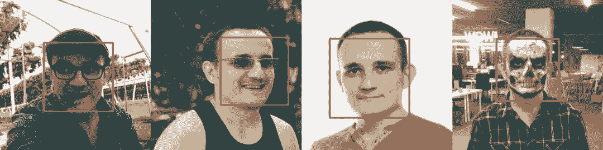
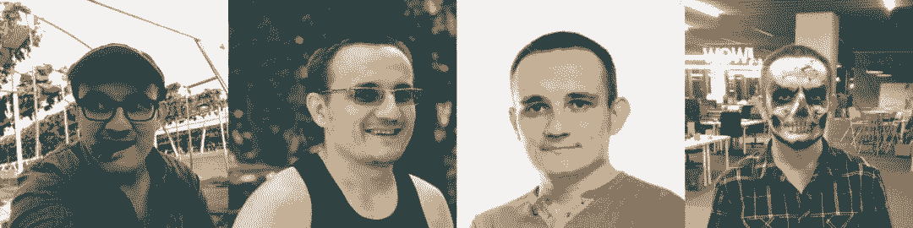
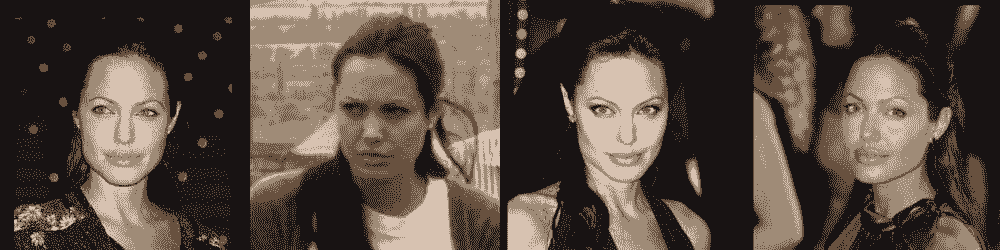
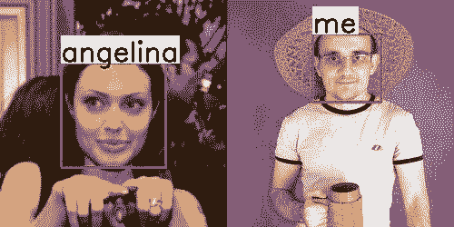
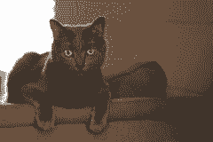
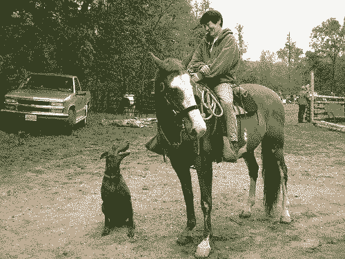

# 世界上最好的语言 PHP：我也可以用 OpenCV 搞计算机视觉

选自 Medium

**作者：Vladimir Goncharov**

****机器之心编译****

**参与：****Huiyuan Zhuo、思源、刘晓坤**

> 作者 Vladimir Goncharov 平常主要关注与研究两个主题：PHP 和 Server Administration（服务器管理）。在过去的半年中，作者利用空闲时间探索 PHP 与 OpenCV 的结合，并借此调用与训练优秀的机器学习模型。本文从实践的角度介绍了如何使用 PHP 与 OpenCV 构建人脸检测、人脸识别、超分辨率与目标检测等系统，因此 PHP 的各位拥趸们，可以尽情使用 OpenCV 探索计算机视觉了。


就像许多开发人员一样，我也经常使用别人的工作成果（Medium 上的文章、GitHub 上的代码等），因此也很乐意与社区分享我的成果。写文章不仅是对社区的一种回报，还可以让你找到志趣相投的人，在一个狭小的领域内得到专业人员的指教，并进一步加深你对研究领域的理解。

事实上，本篇文章正是有关这些时刻之一。在本篇文章中，除了那些我看电视节目和玩游戏的时间，我叙述了在过去六个月的几乎所有空闲时间里所做的探索。

现今，「机器学习」发展迅速，并有大量相关的文章，包括那些 Medium 上的博客，同时几乎每位开发人员都开始在工作任务和本地项目中使用机器学习，但是从何处开始以及使用什么方法总是令人困惑的。大多针对初学者的文章提供了一堆文献，在阅读中发现这些文章脱离生活，或提供一些「价」的课程等。

通常在新发表的文章中描述了解决特定问题的新方法，你可以在 GitHub 上找到文章中方法的实现。由于更普遍使用的编程语言是：C / C ++、Python 2/3、Lua 和 Matlab，以及框架：Caffe、TensorFlow、Torch。因此在编程语言和框架上的大量细分选择使得找到你所需要的，并集成到项目中的过程变得更加复杂。

OpenCV 中添加的一个 DNN 模块以某种方式减少了这些混乱，它使得你可以直接使用一个在基本框架中训练过的模型。我会向你展示如何在 PHP 中使用这个模块。

DNN 模块：https://github.com/opencv/opencv/wiki/ChangeLog#version341

Jeremy Howard（免费的实践课程「machine learning for coders」的创建者）认为现如今在学习机器学习和实际应用之间存在一个很大的界限。

Howard 认为开始学习机器学习一年的编程经验就足够了。我完全同意他的观点，并且我希望我的文章可以帮助那些对机器学习不熟悉，以及还不清楚是否愿意从事机器学习的 PHP 开发人员降低 OpenCV 的使用门槛，同时我会尽力阐述我花了大量时间得到的观点，所以你们甚至都不需要很长的时间就可以了解它。


*php-opencv 项目的 logo*

我曾考虑使用 SWIG 写一个 php-opencv 模块，并花费了大量时间在上面，但是并没有取得任何成果。一切都因为我不懂 C / C++ 并且没有为 PHP 7 编写过扩展文件而变得复杂。不幸的是，网上大多数材料都是基于 PHP 5 而写的 PHP 扩展，因此我不得不一点点收集信息并自己解决问题。

然后，我在 GitHub 上找到了 php-opencv 库，它是一个用于调用 OpenCV 方法的 PHP 7 模块。我花了几个晚上来编译、安装和运行示例。我开始尝试这个模块的不同功能，但这个库还缺少一些方法，因此我就自己添加了它们并创建了一个 pull request，且该库的作者接受了它们。之后，我添加了更多的功能。

php-opencv：https://github.com/hihozhou/php-opencv

这是图像加载的方法：

```py
$image = cv\imread(“images/faces-fs8.png”); 
```

相比之下，在 python 下图像加载是这样的：

```py
image = cv2.imread(“images/faces-fs8.png”)
```

当在 PHP（以及在 C++中）中读取一张图像时，信息就存储在 Mat 对象（矩阵）中。在 PHP 中，类似的是一个多维数组，但又与多维数组有所不同，该对象可以进行多种快速操作，例如，所有元素同时除以一个数。在 Python 中，当加载图像时，会返回「NumPy」对象。

小心原有的默认操作！它会发生这样的情况，imread（在 php、c ++ 和 python 中）不是以 RGB 格式加载图像，而是 BGR 格式。因此，在 OpenCV 的示例中，你经常可以看到转换 BGR 到 RGB 的过程，反之亦然。

**人脸检测**

我第一次尝试的是这个功能。为此，在 OpenCV 中有一个「CascadeClassifier」类，它可以加载 xml 格式的预训练模型。在找到人脸之前，该类建议将图像转换为黑白格式。

```py
$src = imread(“images/faces-fs8.png”); 
$gray = cvtColor($src, COLOR_BGR2GRAY); 
$faceClassifier = new CascadeClassifier(); 
$faceClassifier->load(‘models/lbpcascades/lbpcascade_frontalface.xml’); 
$faceClassifier->detectMultiScale($gray, $faces); 
```

完整测示例代码：https://github.com/php-opencv/php-opencv-examples/blob/master/detect_face_by_cascade_classifier.php

**结果：**



从这个示例中可以看出，即使在僵尸妆容的照片上也可以找到一张人脸。特征点不会干扰人脸的定位。

**人脸识别**

对于人脸识别，OpenCV 拥有「LBPHFaceRecognizer」类和「train / predict」方法。

如果我们想要知道照片中是谁，首先我们需要使用 train 方法训练模型，它需要两个参数：对于这些图像的一个人脸图像的数组和一个数值标签的数组。然后你可以在测试图像（人脸）上调用 predict 方法并获得相匹配的数值标签。

```py
$faceRecognizer = LBPHFaceRecognizer :: create ();
$faceRecognizer-> train ($myFaces, $myLabels = [1,1,1,1]); // 4 my faces
$faceRecognizer-> update ($angelinaFaces, $angelinaLabels = [2,2,2,2]); // 4 faces of Angelina
$label = $faceRecognizer-> predict ($faceImage, $confidence);
// get label (1 or 2) and confidence
```

完整的示例代码：https://github.com/php-opencv/php-opencv-examples/blob/master/recognize_face_by_lbph.php

**数据集：**





**结果：**



当我开始调用 LBPHFaceRecognizer 类时，它无法保存/加载/更新训练好的模型。事实上，我的第一个 pull request 添加了这些方法：写入/读取/更新。

**人脸标记/特征点**

当我开始熟悉 OpenCV 时，我经常看到一些人的照片，这些照片上的点标记着眼睛、鼻子、嘴唇等。我想自己重复这个实验，但在 OpenCV 的 Python 版本中并没有实现。我花了一个晚上为 PHP 添加了 FacematkLBF 支持并返回一个对象。一切都是简单易行的，我们加载预训练的模型，输入关于人脸的一个数组，然后得到关于每个人的特征点的一个数组。

```py
$facemark = FacemarkLBF::create(); 
$facemark->loadModel(‘models/opencv-facemark-lbf/lbfmodel.yaml’); 
$facemark->fit($image, $faces, $landmarks);
```

完整的示例代码：https://github.com/php-opencv/php-opencv-examples/blob/master/detect_facemarks_by_lbf.php

**结果：**


从这个示例中可以看出，僵尸妆容使得找到人脸上的特征点变得更难。特征点也会干扰人脸的定位。光照也有影响，在这个实例中，嘴里的异物（草莓、香烟等）可能不会有干扰。

在我第一次拉拽请求之后，我受到了启发同时开始了解 opencv 可以做些什么，偶然发现了一篇文章《Deep Learning，now in OpenCV》（OpenCV 中的深度学习）。我立刻决定在 php-opencv 中使用预训练模型，这些模型在互联网上有很多。尽管后来我花了很多时间学习如何使用多维矩阵并在不使用 OpenCV 的情况下使用 Caffe / Torch / TensorFlow 模型，但事实证明加载 Caffe 模型并不困难。

Deep Learning，now in OpenCV：https://github.com/opencv/opencv/wiki/ChangeLog#version341

**使用 DNN 模型进行人脸检测**

因此，OpenCV 允许你使用 readNetFromCaffe 函数在 Caffe 中加载预训练模型。它需要两个参数：指向 .prototxt 和 .caffemodel 文件的路径。prototxt 文件中有模型的描述，而在 caffemodel 中有模型训练期间计算的权重。

以下是一个 prototxt 文件开头的示例：

```py
input:“data”
input_shape { 
 dim: 1 
 dim: 3 
 dim: 300 
 dim: 300 
}
```

这段文件描述了输入一个 1x3x300x300 的 4 维矩阵。在对模型的描述中，通常会说明以这种格式输入的意义是什么，但在大多数情况下，这意味着将输入尺寸为 300x300 的 RGB 图像（3 通道）。

通过使用 imread 函数加载一张 300x300 的 RGB 图像，我们得到一个 300x300x3 的矩阵。

OpenCV 中有一个 blobFromImage 函数能将 300x300x3 的矩阵转换为 1x3x300x300 的格式。

之后，我们可以仅通过使用 setInput 方法将 blob 应用于网络输入并调用 forward 方法，其可以返回最终的结果给我们。

```py
$src = imread(“images/faces-fs8.png”); 
$net = \CV\DNN\readNetFromCaffe(‘models/ssd/res10_300x300_ssd_deploy.prototxt’, ‘models/ssd/res10_300x300_ssd_iter_140000.caffemodel’); 
$blob = \CV\DNN\blobFromImage($src, $scalefactor = 1.0, $size = new Size(300, 300), $mean = new Scalar(104, 177, 123), $swapRB = true, $crop = false); 
$net->setInput($blob,“”); 
$result = $net->forward();
```

在这个实例中，结果是一个 1×1×200×7 的矩阵，即每张图像有 7 个元素的 200 个数组。在一张有 4 张脸的照片中，网络寻找到 200 个候选对象。其中每一个对象的形式为 [,, $confidence, $startX, $startY, $endX, $endY]。元素 $confidence 代表「置信度」，即预测概率有多好，比如 0.75 是好的。之后的元素代表人脸矩形框的坐标。在这个示例中，只有 3 张人脸以超过 50% 的置信度被找到，而剩下的 197 个候选对象的置信度小于 15%。

完整的示例代码：https://github.com/php-opencv/php-opencv-examples/blob/master/detect_face_by_dnn_ssd.php

**结果：**


从这个示例中可以看出，神经网络「在额头上「使用时并不总是产生良好的结果。没有找到第四张脸，但是如果将第四张照片单独拿出来并导入神经网络，人脸就会被找到。

**使用神经网络提升图像质量**

很久之前，我听说过 waifu2x 库，它可以消除噪声并增加图标/照片的大小。该库使用 lua 编写，在底层使用几种 Torch 中训练好的模型（为了增加图标大小，消除照片噪声等）。该库的作者将这些模型导出为 Caffe 并帮助我在 OpenCV 中使用它们。因此，一个示例就是在 PHP 中编写的用于增加图标的分辨率。

*   waifu2x 库：https://github.com/nagadomi/waifu2x

*   示例的完整代码：https://github.com/php-opencv/php-opencv-examples/blob/master/upscale_image_x2_by_dnn_waifu2x.php


*不使用神经网络放大图片*

**图像分类**

在 ImageNet 上训练的 MobileNet 神经网络可以分类图像。总的来说，它可以区分 1000 个类别，这对我来说还不够。

示例的完整代码：https://github.com/php-opencv/php-opencv-examples/blob/master/classify_image_by_dnn_mobilenet.php



*结果： 87% - 埃及猫，4% - 斑猫，2% - 虎猫*

**Tensorflow 目标检测 API**

在 COCO 数据集上使用 Tensorflow 训练的 MobileNet SSD（Single Shot MultiBox Detector）网络不仅可以对图像进行分类，还可以返回目标区域，尽管只能检测 182 个类别。

示例的完整代码：https://github.com/php-opencv/php-opencv-examples/blob/master/detect_objects_by_dnn_mobilenet.php



*原图*


*结果*

**语法高亮和代码补全**

我还添加了 phpdoc.php 文件到版本库中并作为示例。多亏了它，Phpstorm 突出了函数的语法、类和它们的方法，并且还可以用于代码补全。这个文件不需要包含在你的代码中（否则会出现错误），将其放到你的项目中就足够了。就个人而言，它使得我的编程更轻松。这个文件描述了 OpenCV 中的大多数函数，但不是所有，因此欢迎发送拉拽请求。

phpdoc.php：https://github.com/php-opencv/php-opencv-examples/blob/master/phpdoc.php

**安装**

「dnn」模块仅在 OpenCV 3.4 中出现（对于之前的版本它是在 contrib 中）。

Ubuntu 18.04 最新的 OpenCV 版本是 3.2。从源码搭建 OpenCV 大约需要 半个小时，所以我在 Ubuntu 18.04 下编译了这个包（也适用于 17.10 版本，大小 25 MB），同时为 PHP 7.2（Ubuntu 18.04）和 PHP 7.1（Ubuntu 17.10）（大小 100 KB）编译了 php-opencv 包。注册 ppa：php-opencv，但还没上传完，同时没有发现比在 GitHub 上传包更好的。我还创建了一个在 pecl 中申请一个账户的请求，但几个月都没得到回复。

在 GitHub 上传包：https://github.com/php-opencv/php-opencv-packages

因此现在在 Ubuntu 18.04 下的安装看起来是这样的：

```py
apt update && apt install -y wget && \
wget https://raw.githubusercontent.com/php-opencv/php-opencv-packages/master/opencv_3.4_amd64.deb && dpkg -i opencv_3.4_amd64.deb && rm opencv_3.4_amd64.deb && \
wget https://raw.githubusercontent.com/php-opencv/php-opencv-packages/master/php-opencv_7.2-3.4_amd64.deb && dpkg -i php-opencv_7.2–3.4_amd64.deb && rm php-opencv_7.2–3.4_amd64.deb && \
echo“extension=opencv.so”> /etc/php/7.2/cli/conf.d/opencv.ini
```

安装这个选项大约需要 1 分钟，所有安装选项在 Ubuntu 上进行：https://github.com/php-opencv/php-opencv-examples/wiki/Installation-on-ubuntu

我同时编译了 168 MB 的 docker 映像。

**使用示例**

**下载：**

```py
git clone https://github.com/php-opencv/php-opencv-examples.git && cd php-opencv-examples
```

**运行：**

```py
php detect_face_by_dnn_ssd.php
```

*原文链接：https://medium.com/@morozovsk/computer-vision-and-machine-learning-in-php-using-the-opencv-library-3131fe9df94b*

****本文为机器之心编译，**转载请联系本公众号获得授权****。**

✄------------------------------------------------

**加入机器之心（全职记者 / 实习生）：hr@jiqizhixin.com**

**投稿或寻求报道：**content**@jiqizhixin.com**

**广告 & 商务合作：bd@jiqizhixin.com**