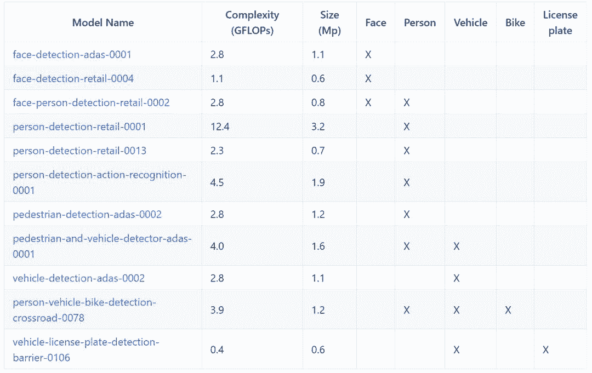

# 资源 | 从人脸检测到语义分割，OpenCV 预训练模型库

选自 GitHub

**机器之心编辑**

**参与：刘晓坤**

> > OpenCV 的 GitHub 页面中有一个称为「open_model_zoo」的资源库，里面包含了大量的计算机视觉预训练模型，并提供了下载方法。使用这些免费预训练模型可以帮助你加速开发和产品部署过程。
> 
> 项目地址：https://github.com/opencv/open_model_zoo
> 
> open_model_zoo 预训练模型概览：
> 
> **目标检测模型**
> 
> 有几种检测模型可以用于检测一系列最常见的目标。大多数网络都是基于 SSD 并提供了合理的准确率/速度权衡。这个列表有人脸、人物、汽车、自行车等目标的检测模型，其中包含一些检测相同类型的目标的网络（例如 face-detection-adas-0001 和 face-detection-retail-0004），因而你可以选择更高准确率/更广泛应用的网络，但同时存在更慢推理速度的代价。
> 
> 
> 
> **示例模型：face-detection-adas-0001**
> 
> 这个人脸检测器用于驾驶员状态检测和类似场景。该网络以 MobileNet 作为骨干，包含深度可分卷积来减少 3x3 卷积的计算量。
> 
> 
> 
> *face-detection-adas-0001 人脸检测应用示例* 
> 
> 
> 
> *face-detection-adas-0001 性能指标和规格* 
> 
> **示例模型：person-detection-retail-0001**
> 
> 这个网络用于零售场景的行人检测，基于 hyper-feature+R-FCN 的骨干。
> 
> 
> 
> *person-detection-retail-0001 人物检测应用示例* 
> 
> **目标识别模型**
> 
> 目标识别模型被用于分类、回归和特征识别。可以在使用检测模型之后使用这些网络（例如，在人脸检测之后使用年龄/性别识别）。这个列表包含了年龄/性别、头部姿态、车牌号码、汽车属性、情绪、人脸关键点和人物属性等目标的识别模型。
> 
> 
> 
> **示例模型：vehicle-attributes-recognition-barrier-0039**
> 
> 
> 
> *vehicle-attributes-recognition-barrier-0039 汽车属性识别应用示例*
> 
> **示例模型：person-attributes-recognition-crossroad-0031**
> 
> 
> 
> person-attributes-recognition-crossroad-0031 人物属性识别应用示例
> 
> **再识别模型**
> 
> 视频中进行目标的精确追踪是计算机视觉的常见应用（例如，人群计数）。以下网络可以用于这样的场景。输入一个人的图像并估计一个表征该人物外观的高维向量。这个向量可以用于进一步评估：对应同一个人的图像会有很接近的向量（基于 L2 距离指标）。以下列表提供了不同准确率/速度权衡的模型选择。列表中包含了人物和人脸再识别任务的模型。
> 
> 
> 
> **示例模型：person-reidentification-retail-0031**
> 
> 
> 
> *person-reidentification-retail-0031ren'w 人物再识别应用示例*
> 
> **示例模型 face-reidentification-retail-0001**
> 
> 
> 
> *face-reidentification-retail-0001 人脸再识别应用示例*
> 
> **语义分割模型**
> 
> 语义分割是目标检测的扩展，其输出是目标的按类别区分的彩色掩码，而不是边框。这些网络比对应的检测模型要大得多，但可以对目标实现更精准的定位，并且不受目标的复杂形状所影响。列表中包含了街景和路面图像的语义分割模型。
> 
> 
> 
> **示例模型：semantic-segmentation-adas-0001**
> 
> 
> 
> *semantic-segmentation-adas-0001 街景图像语义分割应用示例 *
> 
> 模型下载：https://github.com/opencv/open_model_zoo/blob/2018/model_downloader/README.md
> 
> ****本文为机器之心编辑，**转载请联系本公众号获得授权****。**
> 
> ✄------------------------------------------------
> 
> **加入机器之心（全职记者/实习生）：hr@jiqizhixin.com**
> 
> **投稿或寻求报道：content@jiqizhixin.com**
> 
> **广告&商务合作：bd@jiqizhixin.com**