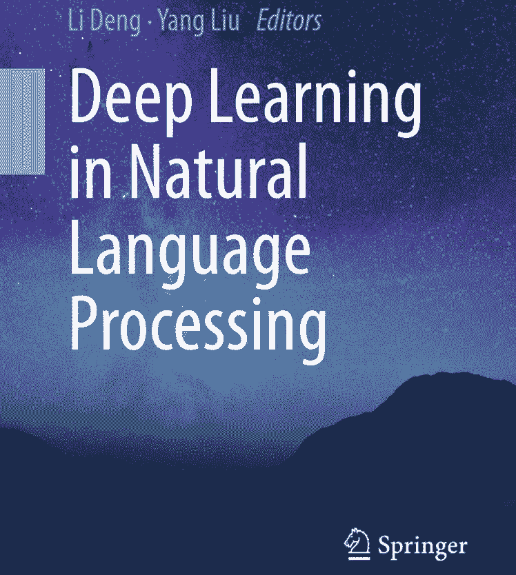
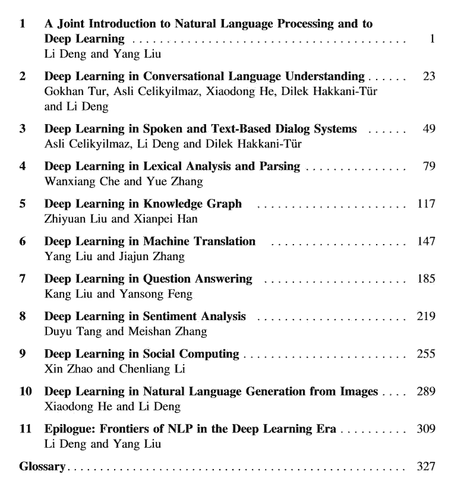
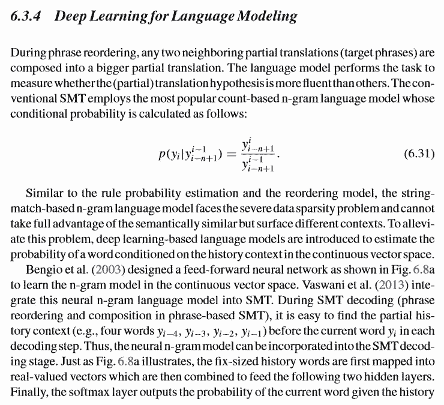
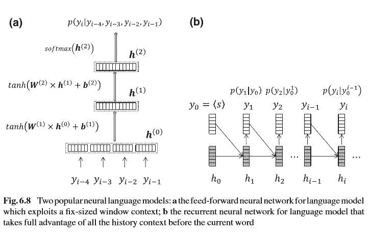
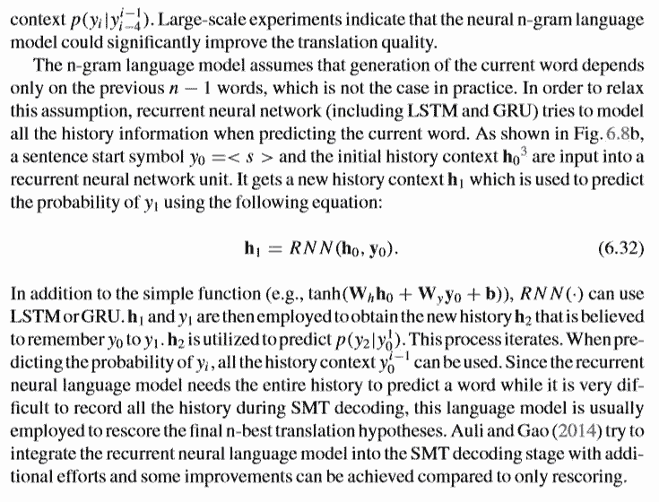
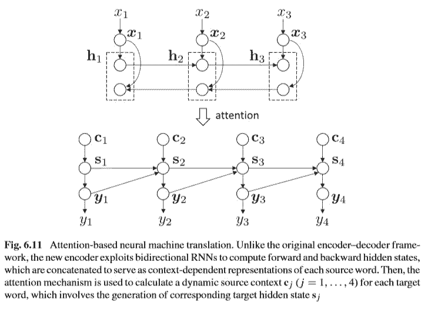
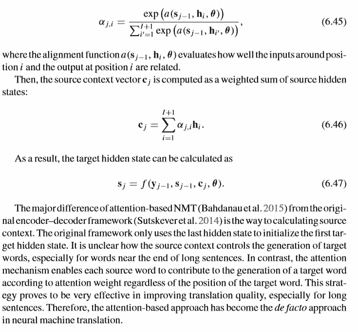

# 期待已久！邓力、刘洋等合著的这本 NLP 书你确定不想看？

机器之心编辑

**参与：机器之心编辑部、专知**

> 2017 年，机器之心就获知邓力、刘洋教授等人在编写一本 NLP 领域的书籍《Deep Learning in Natural Language Processing》，一直以来都对此书有所期待。此书介绍了深度学习在 NLP 常见问题中的应用，还对 NLP 未来发展的研究方向进行了探讨，包括神经符号整合框架、基于记忆的模型、先验知识融合以及深度学习范式（如无监督学习、生成式学习、多模学习、多任务学习和元学习等）。机器之心经刘洋教授授权对此书内容进行了部分编译介绍并提供 PDF 下载，感兴趣的读者可在文章下留言获取。

官方书籍地址：https://www.springer.com/gp/book/9789811052088

自然语言处理（NLP）旨在使计算机可以智能地处理人类语言，是跨越人工智能、计算科学、认知科学、信息处理和语言学的重要跨学科领域。由于计算机和人类语言之间的交互技术的进步，语音识别、对话系统、信息检索、问答和机器翻译等 NLP 应用已经开始重塑人们识别、获取和利用信息的方式。

NLP 的发展经历了三次浪潮：理性主义、经验主义和深度学习。在第一次浪潮中，理性主义方法主张设计手工制作的规则，将知识融入 NLP 系统，这种主张假设人类思维中的语言知识是通过通用继承预先固定下来的。在第二次浪潮中，经验方法假设丰富的感官输入和表面形式的可观察语言数据是必需的，并且足以使大脑学习自然语言的详细结构。因此，人们开发了概率模型来发现大型语料库中语言的规律性。在第三次浪潮中，受生物神经系统的启发，深度学习利用非线性处理的层次模型，从语言数据中学习内在表征，旨在模拟人类的认知能力。

<mp-miniprogram class="miniprogram_element" data-miniprogram-appid="wxf424e2f3e2f94500" data-miniprogram-path="pages/technology/technology?id=c8ff5114-6cbb-49ca-8a89-3ee2826be0b4&amp;from=weapp" data-miniprogram-nickname="机器之心 Synced" data-miniprogram-avatar="http://mmbiz.qpic.cn/mmbiz_png/f3g058loLBj0Pib4UhuCFagffSB1RHImwskFzvic6mSp2LDhuerbXxeqqv0b63wSt2Pas7MicNWIcia358rlnhiaVag/640?wx_fmt=png&amp;wxfrom=200" data-miniprogram-title="自然语言处理" data-miniprogram-imageurl="http://mmbiz.qpic.cn/mmbiz_jpg/KmXPKA19gW8nIIUPvEMyUfIUvCPt08C4K9SLFMTh0OatibicHSTpWnbIaSric9LajxQarFHXyCibWggMxD1TCQ4zzA/0?wx_fmt=jpeg"></mp-miniprogram>

深度学习和自然语言处理的交叉在实际任务中取得了惊人的成功。语音识别是深度学习深刻影响的第一个工业 NLP 应用。随着大规模训练数据变得可用，深度神经网络实现了比传统经验方法低得多的识别误差。深度学习在 NLP 领域的另一个成功应用是机器翻译。使用神经网络对人类语言之间的映射进行建模的端到端神经机器翻译已经证明可以大大提高翻译质量。因此，神经机器翻译已迅速成为大型科技公司（谷歌、微软、Facebook、百度等）提供的主要商业在线翻译服务的新技术。NLP 的许多其他领域，包括语言理解和对话、词法分析和解析、知识图谱、信息检索、文本问答、社交计算、语言生成和文本情感分析，也通过深度学习取得了很大的进步，掀起了 NLP 发展的第三次浪潮。如今，深度学习是应用于几乎所有 NLP 任务的主导方法。

作者对三大浪潮分析得出的结论是：当前的深度学习技术是从前两大浪潮发展的 NLP 技术在概念和范式上的革命。这场革命的关键支柱包括语言实体（子词、单词、短语、句子、段落、文档等）的分布式表示，通过嵌入、嵌入的语义泛化、语言的长跨深度序列建模、有效地表示从低到高的语言水平的分层网络以及端到端的深度学习方法，来共同完成许多 NLP 任务。在深度学习浪潮之前，这些都不可能，不仅是因为在之前的浪潮中缺乏大数据和强大的计算，而且同样重要的是，近年来我们错过了正确的框架，直到深度学习范式出现。

这本书的主要目的是综述深度学习在 NLP 领域的近期前沿应用。本书会展示当前最佳的 NLP 为中心的深度学习研究，并聚焦于探讨深度学习在主要的 NLP 应用中发挥的作用，包括口语理解、对话系统、词法分析、语法分析、知识图谱、机器翻译、问答、情感分析、社交计算和从图像生成自然语言。本书适用于有计算机技术背景的读者，包括硕士生、博士生、博士后研究员、教学者和产业界研究者，以及任何想快速了解 NLP 深度学习最新进展的读者。

本书由全球知名的 Deep Learning 和 NLP 专家邓力博士领导国内外一批活跃的 NLP 研究人员撰写，全面介绍了深度学习如何解决 NLP 中的基本问题，并汇总了大多数深度学习方法应用于 NLP 领域的最新进展（包括 2017 下半年的最新研究进展）。

本书第一章首先回顾了 NLP 的基础知识以及本书后续章节所涵盖的 NLP 的主要范围，然后深入探讨了 NLP 的历史发展，总结为三大浪潮和未来方向。第 2-10 章对应用于 NLP 的深度学习最新进展进行了深入研究，分为九个单独的章节，每个章节涵盖 NLP 的一个（很大程度上是独立的）应用领域。每章的主体由在各自领域积极工作的主要研究人员和专家撰写。

目录如下：

*   Chapter 1: 深度学习与自然语言简介（邓力，刘洋）

*   Chapter 2: 对话理解系统中的深度学习（Gokhan Tur, Asli Celikyilmaz，何晓冬，Dilek Hakkani-TÜr, 邓力）

*   Chapter 3: 语音与文本对话系统中的深度学习（Asli Celikyilmaz, 邓力, and Dilek Hakkani-TÜr）

*   Chapter 4: 语法与词法分析中的深度学习（车万翔 张岳）

*   Chapter 5: 知识图谱中的深度学习（刘知远，韩先培）

*   Chapter 6: 机器学习中的深度学习（刘洋，张家俊）

*   Chapter 7: 问答系统中的深度学习（刘康，冯岩松）

*   Chapter 8: 情感分析中的深度学习（唐都钰，张梅山）

*   Chapter 9: 社交计算中的深度学习（赵鑫，李晨亮）

*   Chapter 10: 看图说话中的深度学习（何晓冬，邓力）

*   Chapter 11: 后记（邓力，刘洋）

在调查了应用深度学习的 NLP 领域的突出成功之后，作者指出并分析了当前深度学习技术的几个主要局限性，涉及一般以及更具体的 NLP 领域。这项调查为 NLP 指出了五个未来的前沿发展方向：神经 - 符号整合框架、探索更好的记忆模型、更好地利用知识，以及更好的深度学习范式（包括无监督和生成学习、多模态和多任务学习和元学习）。

整本书共有 11 章，包含了深度学习在 NLP 中各个领域的研究与应用，并且在全书的最后一部分，作者们讨论了基于 DL 的 NLP 如何扩展到更为通用领域。泛化的本质是将深度神经网络（如：参数化功能块的计算图表）从静态转为动态。这意味着泛化可以使由许多可微分模型组成的网络架构以数据相关的方式进行实时创建。正如本书很多章节中使用逻辑表达式、条件、赋值和循环等进行程序化编程，在可微分编程模型中，涉及到存储、注意、堆栈、队列和指针模块的深度神经网络架构亦如此实现。

实际上，当前的深度学习框架（如： PyTorch, TensorFlow, Chainer, MXNet, CNTK 等）更要追求模型的灵活性，因为一旦高效的编译器被开发出来，我们将需采用一个全新的软件实现方式。以循环和条件判断为主的传统编程逻辑将被淘汰，取而代之的是由神经网络实现的参数化功能模块的组装图表。其中的关键技术在于，基于模型的可微分性，使用高效的梯度优化方法，通过端到端的反向传播学习从数据中自动训练出组装图表中的所有参数，比如神经网络的权重以及定义网络非线性和存储模块的参数。

总之，相信在不久的将来，以广义深度学习或可微分编程框架所创建的更加强大、更加灵活、更加先进的学习架构可以解决本书中所列举的 NLP 前沿研究领域的遗留问题。不止于本书中所提及的研究成果，新的成就将会像雨后春笋般涌现，这一切都将会使我们越来越接近通用人工智能实现的日子。那时，NLP 将会成为通用人工智能的一个重要组成部分呈现在大家面前。

此外，读者可以看看原书语言建模与基于注意力的机器翻译两小节截图，从而对整本书的风格与内容有大概的了解：

**作者介绍**

**主编**

邓力博士（人工智能科学家），2017 年 5 月至今任对冲基金公司 Citadel 首席人工智能官（Chief Artificial-Intelligence Officer）。之前任微软人工智能首席科学家。邓力在 2009 年就同 Geoffrey Hinton 教授合作，首次提出并将深度神经网络应用到大规模语言识别中，显著提高了机器对语音的识别率，极大推动了人机交互领域的发展与进步。目前，邓力的研究方向主要为应用于大数据、语音、文本、图像和多模态处理的深度学习和机器智能方法，以及人工智能和深度学习在金融领域的应用。在语音、NLP、大数据分析、企业智能、互联网搜索、机器智能、深度学习等领域，邓力曾获 70 多项美国或国际专利。同时，他还获得过 IEEE、国际言语通讯协会、美国声学协会、亚太信号与信息处理协会、微软等组织授予的多项荣誉。2015 年，凭借在深度学习与自动语音识别方向做出的杰出贡献，邓力获 IEEE 技术成就奖。

刘洋博士，清华大学计算机科学与技术系长聘副教授、博士生导师、智能技术与系统实验室主任，国家优秀青年基金获得者。研究方向是自然语言处理，在自然语言处理和人工智能领域重要国际刊物 Computational Linguistics 和国际会议 ACL、EMNLP、IJCAI 和 AAAI 上发表 50 余篇论文，获 ACL 2017 杰出论文奖和 ACL 2006 优秀亚洲自然语言处理论文奖。承担 10 余项国家自然科学基金、国家重点研发计划、国家 863 计划、国家科技支撑计划和国际合作项目，2015 年获国家自然科学基金优秀青年项目资助。获得 2015 年国家科技进步二等奖、2014 年中国电子学会科学技术奖科技进步类一等奖、2009 年北京市科学技术奖二等奖和 2014 年中国中文信息学会钱伟长中文信息处理科学技术奖汉王青年创新奖一等奖等多项科技奖励。担任或曾担任国际计算语言学学会亚太分部执委会委员、SIGHAN Information Officer、中国中文信息学会青年工作委员会主任兼计算语言学专业委员会秘书长、Computational Linguistics 编委、ACM TALLIP 副编辑、ACL 2015 组织委员会共同主席、ACL 2014 讲习班共同主席、ACL 2017/2018 与 EMNLP 2016/2018 程序委员会机器翻译领域共同主席、IJCAI 2016/2018 和 AAAI 2019 资深程序委员会委员。

**主要参与作者**

*   何晓东博士是京东 AI 研究院常务副院长、深度学习及语音和语言实验室主任。他于 1996 年获得清华大学（北京）学士学位，1999 年获得中国科学院（北京）硕士学位，并于 2003 获哥伦比亚大学博士学位。他的研究兴趣主要集中在人工智能领域，包括深度学习，自然语言，计算机视觉，语音，信息检索和知识表示。加入京东之前，何晓冬博士就职于美国微软雷德蒙德研究院，担任主任研究员（Principal Researcher）及深度学习技术中心（DLTC）负责人，同时在位于西雅图的华盛顿大学兼任教授、博士生导师。微软在 2018 年 1 月推出的人工智能绘画机器人正是出自何晓冬团队的作品。

*   车万翔 哈尔滨工业大学计算机学院副教授、博士生导师。斯坦福大学访问学者，合作导师 Christopher Manning 教授。现任中国中文信息学会计算语言学专业委员会委员、青年工作委员会副主任；中国计算机学会高级会员、YOCSEF 哈尔滨主席。主要研究领域为自然语言处理，在 ACL、EMNLP、AAAI、IJCAI 等国内外高水平期刊和会议上发表学术论文 40 于篇，其中 AAAI 2013 年的文章获得了最佳论文提名奖，出版教材 2 部，译著 2 部。目前承担国家自然科学基金、973 等多项科研项目。负责研发的语言技术平台（LTP）已被 600 余家单位共享，提供的在线「语言云」服务已有用户 1 万余人，并授权给百度、腾讯、华为等公司使用。2009 年，获 CoNLL 国际多语种句法和语义分析评测第 1 名。2016 年获黑龙江省科技进步一等奖；2015 和 2016 连续两年获得 Google Focused Research Award（谷歌专注研究奖）；2012 年，获黑龙江省技术发明奖二等奖；2010 年获钱伟长中文信息处理科学技术奖一等奖、首届汉王青年创新奖等多项奖励。

*   张岳，新加坡科技设计大学助理教授。获清华大学计算机科学与技术学士学位，牛津大学计算机科学硕士和博士学位。2012 年加入新加坡科技设计大学之前，曾在英国剑桥大学担任博士后研究员。对自然语言处理、机器学习和人工智能有浓厚的研究兴趣，主要从事统计句法分析、文本生成、机器翻译、情感分析和股票市场分析的研究。任 ACM/IEEE TALLIP 副主编及 COLING 2014、NAACL 2015、EMNLP 2015、ACL 2017 和 EMNLP 2017 的程序委员会领域主席和 IALP 2017 的程序委员会主席。

*   刘知远，清华大学计算机系副教授、博士生导师。主要研究方向为表示学习、知识图谱和社会计算。2011 年获得清华大学博士学位，已在 ACL、IJCAI、AAAI 等人工智能领域的著名国际期刊和会议发表相关论文 60 余篇，Google Scholar 统计引用超过 2700 次。承担多项国家自然科学基金。曾获清华大学优秀博士学位论文、中国人工智能学会优秀博士学位论文、清华大学优秀博士后、中文信息学会青年创新奖，入选中国科学青年人才托举工程、CCF-Intel 青年学者提升计划。担任中文信息学会青年工作委员会执委、副主任，中文信息学会社会媒体处理专委会委员、秘书，SCI 期刊 Frontiers of Computer Science 青年编委，ACL、COLING、IJCNLP 领域主席。

*   韩先培，博士，中国科学院软件研究所基础软件国家工程研究中心 / 计算机科学国家重点实验室副研究员。主要研究方向是信息抽取、知识库构建、语义计算以及智能问答系统。在 ACL、SIGIR 等重要国际会议发表论文 20 余篇。韩先培是中国中文信息学会会员，中国中文信息学会语言与知识计算专业委员会秘书长及中国中文信息学会青年工作委员会委员。

*   张家俊于中科院自动化所获得博士学位，现任中科院自动化所模式识别国家重点实验室副研究员，中国科学院青年创新促进会会员。研究方向为自然语言处理、机器翻译、跨语言文本信息处理、深度学习等。现任人工智能学会青年工作委员会常务委员、中文信息学会计算语言学专委会和青年工作委员会委员。在国际著名期刊 IEEE/ACM TASLP、IEEE Intelligent Systems、ACM TALLIP 与国际重要会议 AAAI、IJCAI、ACL、EMNLP、COLING 等发表学术论文 40 余篇。曾获 PACLIC-2009、NLPCC-2012(2017) 和 CWMT-2014 最佳论文奖。2014 年获中国中文信息学会「钱伟长中文信息处理科学技术奖」一等奖（排名第三）。2015 年入选首届中国科协「青年人才托举工程」计划。

*   刘康，博士，现任中科院自动化所模式识别国家重点实验室副研究员，西安电子科技大学客座教授。研究领域包括信息抽取、网络挖掘、问答系统等，同时也涉及模式识别与机器学习方面的基础研究。在自然语言处理、知识工程等领域国际重要会议和期刊发表论文九十余篇（如 TKDE、ACL、IJCAI、EMNLP、COLING、CIKM 等），获得 KDD CUP 2011 Track2 全球亚军，COLING 2014 最佳论文奖，首届「CCF - 腾讯犀牛鸟基金卓越奖」、2014 年度中国中文信息学会「钱伟长中文信息处理科学技术奖 - 汉王青年创新一等奖」、2015、2016 Google Focused Research Award 等。

*   冯岩松 北京大学计算机科学与技术研究所讲师。2011 年毕业于英国爱丁堡大学，获得信息科学博士学位。主要研究方向包括自然语言处理、信息抽取、智能问答以及机器学习在自然语言处理中的应用；研究小组已连续三年在面向结构化知识库的知识问答评测 QALD 中获得第一名；相关工作已发表在 TPAMI、ACL、EMNLP 等主流期刊与会议上。作为项目负责人或课题骨干已承担多项国家自然科学基金及科技部 863 计划项目。分别在 2014 和 2015 年获得 IBM Faculty Award。

*   唐都钰，微软亚洲研究院自然语言计算组研究员，主要从事包括智能问答、语义理解、常识推理等在内的自然语言处理基础研究。唐都钰博士论文题目为《基于表示学习的文本情感分析研究》获 2016 年中国中文信息学会优秀博士学位论文奖。

*   张梅山，新加坡科技与设计大学，博士后研究员。张梅山博士分别于 2004 年、2008 年和 2014 年获得中国地质大学 (武汉) 物理学学士、中科院软件所计算机应用技术硕士和哈尔滨工业大学计算机应用技术博士学位，目前任职新加坡科技与设计大学博士后研究员。近年来发表各类论文 23 篇，其中，AAAI、ACL、EMNLP、COLING 等领域顶级会议论文 11 篇。目前的主要研究兴趣为自然语言处理、情感分析和深度学习。

*   赵鑫，中国人民大学信息学院副教授，近五年内在国内外著名学术期刊与会议上发表论文近 60 篇，其中包括信息检索领域顶级学术期刊 ACM TOIS 和学术会议 SIGIR、数据挖掘领域顶级学术期刊 IEEE TKDE/ACM TKDD 和学术会议 SIGKDD、自然语言处理顶级会议 ACL/EMNLP/COLING。所发表的学术论文取得了一定的关注度，据 Google Scholar 统计（搜索 Wayne Xin Zhao），已发表论文共计被引用近 1800 次。担任多个重要的国际会议或者期刊评审。目前承担国家自然科学基金青年项目一项和北京市自然科学基金面上项目一项，以及横向项目多项。

*   李晨亮，男，博士，副教授, 硕士生导师，2013 年毕业于新加坡南洋理工大学计算机工程学院, 获博士学位。同年由武汉大学计算机学院引进，获得优秀青年骨干教师启动资金。2015 年入选武汉大学珞珈青年学者。研究兴趣包括信息检索、数据挖掘 (文本挖掘)、自然语言处理、机器学习和社交媒体分析。其主要科研成果已先后发表在国际顶级学术期刊和会议上；担任中国中文信息学会青年工作委员会委员、社交媒体专委会委员、信息检索专委会委员。作为骨干成员参与新加坡教育部科学基金项目 1 项，新加坡国防部科技项目 1 项。2016 年指导硕士生在 CCF-A 类会议 SIGIR2016 上发表长文论文一篇，并获大会最佳学生论文提名奖（Best Student Paper Award Honorable Mention）

****本文为机器之心编辑，**转载请联系本公众号获得授权****。**

✄------------------------------------------------

**加入机器之心（全职记者 / 实习生）：hr@jiqizhixin.com**

**投稿或寻求报道：**content**@jiqizhixin.com**

**广告 & 商务合作：bd@jiqizhixin.com**