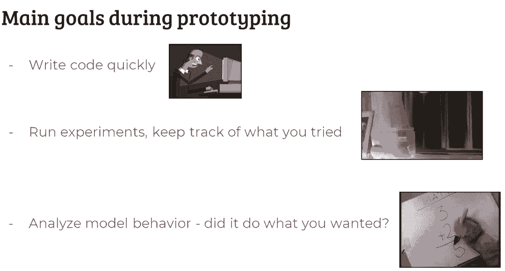
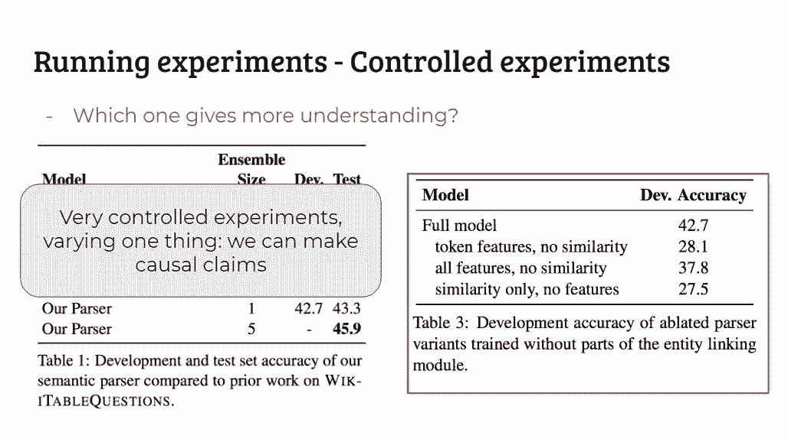
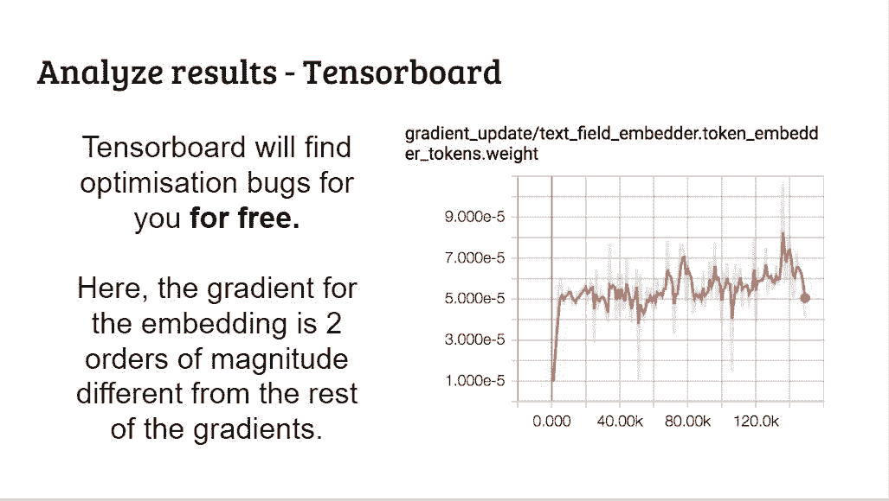
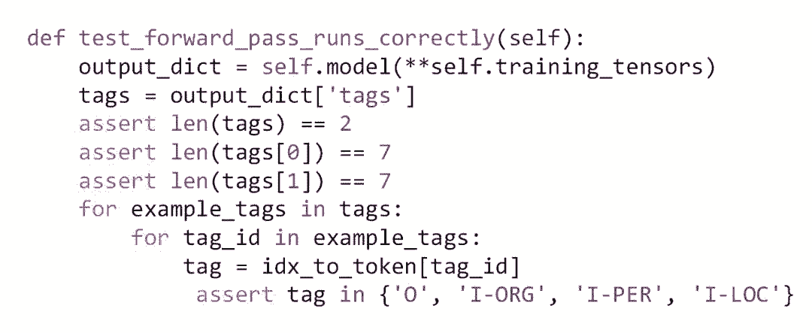

# 二百五十四页 PPT！这是一份写给 NLP 研究者的编程指南

机器之心编辑

**机器之心编辑部、赤乐君**

> 最近 AllenNLP 在 EMNLP2018 上做了一个主题分享，名为「写给 NLP 研究者的编程指南」（Writing Code for NLP Research）。该演讲从写原型和写模块两方面介绍了 NLP 研究该如何复制别人的代码、测试自己的代码块、记录及分享研究等，总之在研究者也要高效码代码的年代，这是一份浓缩的实践经验。

这份内容干货满满，仅仅只是看了 slide 就知道是非常有意思的一次演讲了。slide 共有 254 页之多，在「赤乐君」知乎专栏分享内容的基础上，机器之心为大家介绍 NLP 及深度学习研究者的编程指南。

读者可以直接下载 PPT 了解详细内容，其中每一页 PPT 都带有简要的备注，根据这些备注可以将所有 PPT 以及整场演讲串联起来。

*   下载地址：https://pan.baidu.com/s/1G4rYjZ9JV7FJt9UbIc0_gw

*   赤乐君知乎专栏：https://zhuanlan.zhihu.com/p/48504619

<mp-miniprogram class="miniprogram_element" data-miniprogram-appid="wxf424e2f3e2f94500" data-miniprogram-path="pages/technology/technology?id=c8ff5114-6cbb-49ca-8a89-3ee2826be0b4&amp;from=weapp" data-miniprogram-nickname="机器之心 Synced" data-miniprogram-avatar="http://mmbiz.qpic.cn/mmbiz_png/f3g058loLBj0Pib4UhuCFagffSB1RHImwskFzvic6mSp2LDhuerbXxeqqv0b63wSt2Pas7MicNWIcia358rlnhiaVag/640?wx_fmt=png&amp;wxfrom=200" data-miniprogram-title="NLP" data-miniprogram-imageurl="http://mmbiz.qpic.cn/mmbiz_jpg/KmXPKA19gWicMnnedLyxsWl3QOHOYHzMYriaSDhOaEmRgQYWkuMsEzBUj9b3l59rnUpgzrk5EEX7HjuHneYqoORQ/0?wx_fmt=jpeg"></mp-miniprogram>

下面是整个分享的大纲。通过这次演讲，你可以学到如何写代码来促进你的研究，以及可复现的实验。当然读者最好还是知道一点 NLP 相关的知识，因为这一份分享会以深度学习中的 NLP 问题作为案例。此外，能够大致读懂 Python 代码也是很好的背景，这篇文章都是以 Python 接口调用 DL 框架为例。

这里有两种写研究代码的模式，一种是写原型，一种是写组件。作为一名研究者，大多数时候我们都希望写原型，但是在没写好组件前是写不好原型的。而通过原型设计，有时候做出来的东西又是希望下次再复用的组件。因此这是编写代码的两种模式，它们并不独立。

我们先从写原型的方式开始介绍。

**写原型**

当我们开始写一个原型代码的时候，我们要做到下面三点。

1\. 写代码要快

2\. 跟踪实验结果

3\. 分析模型结果

**快速开发**

要做到快速编程，不要从头开始写所有内容，而是使用框架。这里的框架不仅指 tensorflow 或 pytorch 之类的框架，也可以理解为模板。比如上图中如果写 training loop 的部分，已经有人写好了。我们只要看懂后，直接拿来用就行，没有必要从头开始自己写所有部分。

上面提到的一些内容，都是可以找到现成框架来套用的。很多时候我们在编程时遇到的问题不是构建模型，而是数据读取、预处理和写训练循环等部分。如果有人把你想用的东西模块化了，还等什么，直接拿来用啊！

当然拿来用也是有步骤的，首先我们应该获得基线模型的性能，这也是一个很好的研究实践。基线模型可能是别人的代码，你要是能修修改改就更好了。其次复现 SOTA 基线结果对于理解模型和做更多的研究是非常有帮助的。

要想快速开发，另一个建议就是先复制，再重构。要记住，我们是在写原型，不用在乎什么可用性，先把代码写 work 了再说。如果实现的效果不错的话，再回去重构。

另外，我们要有好的编程习惯。比如起有意义的变量名，写注释帮助理解。记住，我们是写给人看的，不是机器！此外在使用基线模型做试验的时候，我们可以现在小数据集上做测试，并确保模型能准确读取数据。

如果在做原型设计时，我们将 LSTM 写死了（hard-code），那么在我们希望使用 Transformer 等模块的时候就需要重新改代码。因此使用多态可以借助更高级的抽象扩展代码，这样在换模块时就能只修改少量代码。

**跟踪实验结果**

在写原型的时候你需要运行很多东西，这导致很难追踪发生了什么以及对应的代码部分。

可以准备一个 Excel 表格，来记录实验结果。

黑箱对比对于上下文理解有帮助，但不能深入理解两个结果之间的关系，因为有太多的变量在同时变化。我们需要每次仅改变一个变量，可以在代码中设置「开关」，将开关配置一些全局状态/依赖注入。

每次只改变一个部分，方便跟踪实验结果的变化其原因在于哪里。

这里光是 embedder，我们就有很多种选择。

使用设定文件来记录模型的改变，方便我们以后查询当时的设定。

**分析模型结果**

在训练的时候，可视化对于分析模型表现是非常重要的。这个技能必须掌握。

Tensorboard 可以提供很多分析结果。

Tensorboard 能帮我们找到优化的 bug。比如上图中的 embedding 梯度有两个数量级的差别。

原因在于 embedding 的梯度是稀疏梯度，即只有一部分会被更新。但是 ADAM 中的动量系数是针对整个 embedding 计算的，所以解决方法是直接引入特定的优化器：DenseSparseAdam。

在解释你的模型的预测输出时，好的展示是静态预测；更好的展示是交互地查看预测；最好的展示是交互地查看内部过程。

对于预测结果，如果可以做到交互式的方式来查看的话，是最好的。

**开发组件**

与写原型不同，开发可重复使用的组件有很多要注意的地方。我们的代码需要写清楚，这样就能聚焦于建模决策，而不考虑代码到底在做什么。

Code Reveiw 是必不可少的。Review 的时候，不仅能发现错误，还能提高代码的可读性。

如果我们不是软件开发人员的话，对于持续整合 以及构建自动化 这两个词可能比较陌生。通常我们只说持续整合的时候，也包含了构建自动化的意思。想要做到这点，要多写测试才行。

当然，如果我们不是开发一个很多人都会用到的库，上面这些步骤是用不到的。不过测试很重要，如果是原型开发，也要做一些最基本的测试。

如上对读取的数据进行测试，看是否正确。这里在进行单元测试时常用的就是 assert 语句，如果程序有问题，运行到这边就自然会报错，这样可以让我们尽快找到错误。

如上所示，当然我们也可以使用 assert 语句检查维度是否一致。这在模型运算部分经常会用到，例如判断每个卷积层输出结果的尺寸和深度等。可以看到这两种测试的代码都不会很多。所以不要犯懒了，好好写测试吧。

关于 AllenNLP 库的一些介绍，这里就不花时间讨论了，感兴趣的可以看 slide 中 p141~p205 的部分。下面直接进入分享的部分。

*   [业界 | 艾伦 AI 研究院发布 AllenNLP：基于 PyTorch 的 NLP 工具包](http://mp.weixin.qq.com/s?__biz=MzA3MzI4MjgzMw==&mid=2650730716&idx=4&sn=68880ab8a8dbd452c13d383528e15da8&chksm=871b34a2b06cbdb443b013051d54fcb09b8b1f1e87f01857115f0eb48bfff969ff0cc797075d&scene=21#wechat_redirect)

*   [教程 | 利用 AllenNLP，百行 Python 代码训练情感分类器](http://mp.weixin.qq.com/s?__biz=MzA3MzI4MjgzMw==&mid=2650750932&idx=3&sn=30b8412c4d612f52ae5f0c42ae001b07&chksm=871afbaab06d72bc110e2c73eb70b56d5b56acf98faa4bd5f94f5c8cfc91c4e894e5b9c16597&scene=21#wechat_redirect)

<mp-miniprogram class="miniprogram_element" data-miniprogram-appid="wxf424e2f3e2f94500" data-miniprogram-path="pages/resource/resource?id=1128e416-af22-4cf0-8997-93b8846d33d5&amp;from=weapp" data-miniprogram-nickname="机器之心 Synced" data-miniprogram-avatar="http://mmbiz.qpic.cn/mmbiz_png/f3g058loLBj0Pib4UhuCFagffSB1RHImwskFzvic6mSp2LDhuerbXxeqqv0b63wSt2Pas7MicNWIcia358rlnhiaVag/640?wx_fmt=png&amp;wxfrom=200" data-miniprogram-title="AllenNLP" data-miniprogram-imageurl="http://mmbiz.qpic.cn/mmbiz_jpg/KmXPKA19gWicMnnedLyxsWl3QOHOYHzMYriaSDhOaEmRgQYWkuMsEzBUj9b3l59rnUpgzrk5EEX7HjuHneYqoORQ/0?wx_fmt=jpeg"></mp-miniprogram>

**分享研究**

简化安装的流程，令代码运行在任何平台，使用隔离的环境。

下面是使用 Docker 的一些优点。

用 docker 开发的好处不用多说，大家想必也已经都知道了。当然，缺点也是有的。

至于 Python 的包管理系统，AllenNLP 采用了 ANACONDA。

Docker 是不错，但不适合做本地开发，这样的话，使用一些本地的包管理系统反而更方便。

最后做个总结。

*   快速开发原型（要安全）

*   写安全的产品代码（要快）

*   好的流程有利于做出好的研究

*   使用正确的抽象

*   查看 AllenNLP（广告）

这次分享的 slide 看了几遍，很多地方看得自己脸上发热，不写测试什么的说到了痛处。现在人工智能领域对于算法工程师的要求已经不是能掉个包，谈谈研究那么简单了，工程实践能力已经变得越来越重要。写优秀的代码，做优秀的研究，二者是一个互相促进的过程。

****本文为机器之心编辑，**转载请联系本公众号获得授权****。**

✄------------------------------------------------

**加入机器之心（全职记者 / 实习生）：hr@jiqizhixin.com**

**投稿或寻求报道：**content**@jiqizhixin.com**

**广告 & 商务合作：bd@jiqizhixin.com**