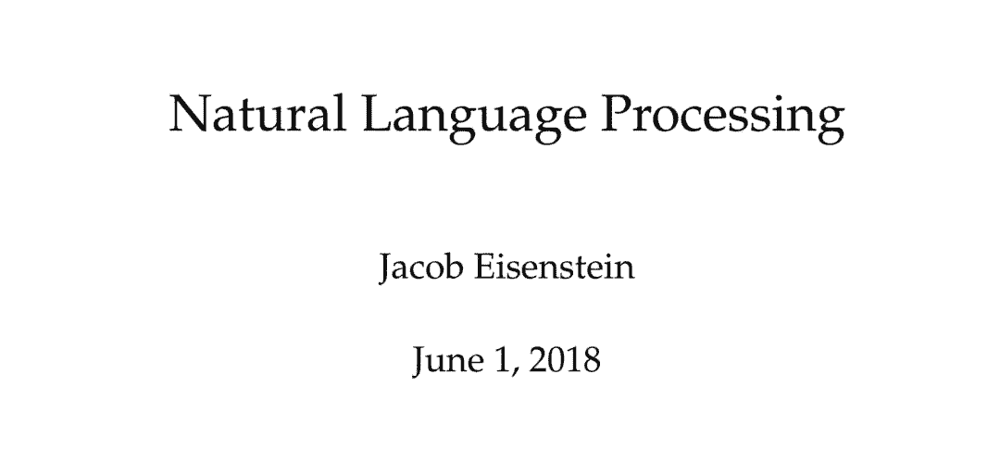

# 自然语言处理最新教材开放下载，乔治亚理工大学官方推荐

机器之心整理

**参与：思源、晓坤**

> 昨日，乔治亚理工大学 Jacob Eisenstein 教授开放了自然语言处理领域的最新教材《Natural Language Processing》，该教材 2018 年 6 月第一版的 PDF 已经在 GitHub 上开放下载。这本书的内容主要分为四大章节，即 NLP 中监督与无监等学习问题、序列与解析树等自然语言的建模方式、语篇语义的理解，以及后这些技术最在信息抽取、机器翻译和文本生成等具体任务中的应用。

开放地址：https://github.com/jacobeisenstein/gt-nlp-class/tree/master/notes

Eisenstein 将这一本非常完善的教材称之为「Notes」，它是在乔治亚理工大学学习自然语言处理相关领域所需要了解的基础。例如在介绍自然语言处理理论与方法的课程 CS4650/7650 中，这本开放书籍就作为标准的课程教材。

CS4650/7650 2018 春季课程需要阅读 GitHub 目录下 eisenstein-nlp-notes-jan-10-2018.pdf 文件，而另外一个文件 eisenstein-nlp-notes.pdf 会包含一些章节上的更新，不过它会在整个学期内进行。Eisenstein 表示这本开放书籍也可以用于其它研究或课程，书籍上的任何误差或反馈都能直接发邮件给作者。

自然语言处理是令计算机能访问人类语言的一组方法。在过去的十年中，自然语言处理已经深入了我们的日常生活：自动机器翻译在网站和社交媒体中已经无处不在、文本分类确保了电子邮箱在海量垃圾邮件中屹立不倒、搜索引擎已经不再只是字符匹配与网络分析，它已经能理解高维度的复杂语言，还有近来对话系统的兴起也令信息的分享与交互更高效。

这些强大的应用其实都基于一套通用的思想，即利用算法、语言规则、逻辑和统计知识理解自然语言。这本书的目的是提供这些思想与技术的基础，并应用于各种实际的任务中。此外，这本书除了详细的概念与算法，同时还包括一些高阶主题，读者可按需求学习与阅读。

这本书的主要章节如下可分为四部分：

*   学习：这一章节介绍了一套机器学习工具，它也是整本教科书对不同问题建模的基础。由于重点在于介绍机器学习，因此我们使用的语言任务都非常简单，即以词袋文本分类为模型示例。第四章介绍了一些更具语言意义的文本分类应用。

*   序列与树：这一章节将自然语言作为结构化的数据进行处理，它描述了语言用序列和树进行表示的方法，以及这些表示所添加的限制。第九章介绍了有限状态自动机（finite state automata）。

*   语义：本章节从广泛的角度看待基于文本表达和计算语义的努力，包括形式逻辑和神经词嵌入等方面。

*   应用：最后一章介绍了三种自然语言处理中最重要的应用：信息抽取、机器翻译和文本生成。我们不仅将了解使用前面章节技术所构建的知名系统，同时还会理解神经网络注意力机制等前沿问题。

自然语言处理其实与很多学科都有关系，包括最直接的计算语言学、机器学习和统计学等。其实计算语言学基本上就等同于自然语言处理，它关注于设计并分析表征人类自然语言处理的算法。而我们熟知的机器学习正好为这些「表征」提供算法支持，例如在自然语言建模中，机器学习提供了 n-gram 和循环神经网络等多种方法预测最自然的语句。

在 Eisenstein 的这本书中，有非常多值得我们仔细探讨的主题，例如如何基于简单的感知机或支持向量机进行线性文本分类、如何使用循环网络实现语言建模，以及序列标注任务中的维特比算法和隐马尔科夫链等知识。但限于本文只简要介绍这本书，因此我们主要介绍 Eisenstein 所述的自然语言处理三大主题。

**自然语言处理的三大主题**

自然语言处理涵盖了非常多的任务、方法和语言现象。虽然很多任务之间都无法进行比较，但还是有一些公共的主题。基本上，自然语言处理包括学习与知识、搜索和学习以及 NLP 中关系式、组合式和分布式的观点。

**学习与知识**

近来深度模型在计算机视觉和语音识别等方面取得的成果促进了端到端学习方法的发展，传统机器学习中基于光学和音韵学等经过特征工程的特定表示方法已经不再流行。但是，很多机器学习基本只逐元素地处理自然语言，语法解析树等语言学表征仍然没有像视觉中的边缘检测器那样有高效的表示方法。语言学家也通常会讨论能编码一组专门用来促进语言理解和生成抽象概念的「语言能力」，但不管这些是不是合理，在训练数据有限的情况下语言结构尤其重要。

现在其实有很多方法将自然语言处理中的知识与学习结合在一起，很多监督式的学习系统利用工程化的特征，将数据转化为有利于学习的表征。例如在文本分类任务中，识别每一个词的词干可能会非常有用，因此这样的学习系统可以更容易概括相关术语，例如鲸鱼和捕鲸等。这在很多复杂语言中非常有用，因为复杂的词缀通常都添加在词干的后面。这些特征可以从手工处理的数据中获得，例如将每个单词映射到单一表单的字典。此外，特征也可以从一般任务的语言处理系统获得，例如从建立在有监督机器学习的语法解析或词性标注等模型获取。

学习和知识的另一项结合即体现在模型结构：我们建立的机器学习模型架构受语言理论的影响。例如在自然语言中，句子的组织通常描述为构成性的，语义较小的单位逐渐构成语义较大的单位。这个想法可以加入深度神经网络体系架构中，并使用当代技术进行训练（Dyer et al., 2016）。

目前，有关机器学习与语言知识相对重要性的争论愈演愈烈。没有机器学习研究者愿意听到他们的工程学方法是不科学的炼金术，语言学家也不希望听到他们所寻找的一般语言学结构与原理和大数据无关。然而这两种类型的研究显然都各有发展空间，我们需要知道端到端的学习还能走多远，同时还需要继续研究能泛化到各种应用、场景和语言的语言学表征。

**搜索和学习**

很多自然语言处理问题在数学上都可以表述为最优化问题的形式：

其中 x 是属于集合 X 的输入；y 是属于集合 Y 的输出；φ是评分函数，将集合 X*Y 映射到实数上；θ是φ的参数向量；y hat 是预测输出，其值的选择需要使评分函数最大化。这种形式化定义在通常的监督机器学习问题中是很普遍的，而在自然语言处理中，输入-输出对可能是文本-情感，或不同语言的翻译等。

在这种形式化定义下，语言处理算法有两个不同的模块，即搜索和学习：

搜索模块即找到使评分函数φ最大化的预测输出，当搜索空间足够小（即数据量较小）或评分函数能分解成几个较容易处理的部分时，这很容易。但通常情况下，评分函数的结构复杂得多，并且在语言处理算法中，输出通常是离散型的，这时搜索通常依赖于组合优化机制。

学习模块即寻找参数向量θ，一般通过处理标记数据对得到。和搜索一样，学习也是通过优化框架进行。但由于参数通常是连续的，因此学习算法依赖于数值优化。

将自然语言处理算法分成两种不同的模块可以使我们能重用多种不同任务和模型的通用算法，既聚焦于模型设计，同时又能利用过去在搜索、优化和学习问题的研究成果。

当模型能分辨细微的语言差异时，称为具有表达性（expressive）。表达性通常需要在学习和搜索的效率之间进行权衡。很多自然语言处理的重要问题都需要表达性，其计算复杂度随收入数据的增加指数式增长。在这些模型中，确定性的搜索通常是不可行的。其难解性使得明确分离搜索和学习模块变得很困难：如果搜索需要一系列启发式近似，那么学习在这些特定的启发式下工作良好的模型会更有利。这启发了一些研究者在搜索和学习中采用更加集成化的方法。

**关系式、组合式和分布式的观点**

任何语言元素（例如单词、句子、段落甚至发音）都可以至少用三个观点来描述。考虑单词「记者」：「记者」是「职业」的子范畴，「主持人」是「记者」的子范畴；此外，记者执行的是「新闻工作」，这又是「写作」的子范畴。这种对意义的关系式的观点是语义本体论的基础，例如 Word-Net 枚举了单词和其它基本语义单元之间的关系。关系式的观点具有强大的推理能力，但在计算上很难形式化，通常单词的含义是不独立于具体场景的。

某些单词之间的关系可以通过书写上的相似性和组合性而互相联系，例如复数形式、组合型单词等。进一步，在对句子和段落的分析中，通过单词的组合和句子的组合来得到完整含义。此即组合式的观点。组合观点的威力在于它为理解完整文本和对话提供了路线图，通过单一的解析透镜，从最小的部分开始逐步得到完整的含义。

对于某些不可分解的单词，组合观点不能提供很多帮助，但可以通过上下文来确定其含义。此即分布式的观点。它还可以帮助找到意义相似的不同单词。分布式的观点可以从未标记的数据中学习含义。和关系式以及组合式的语义不同，其并不需要手动标注或专家知识。因此，分布式语义覆盖了很大范围的语言现象，但是精确度不高。

关系式、组合式和分布式的观点对于语言含义的理解都有贡献，三者对于自然语言处理都是很重要的。目前，它们之间的协作并不容易，各自使用的表征和算法较难兼容。

最后，Eisenstein 表示阅读这本书也需要一些背景知识：

*   数学与机器学习：这本书需要多元微分学和线性代数的基础知识，包括函数微分、偏微分与向量和矩阵的运算等。读者也应该熟悉概率论与统计学，包括基本分布、数字特征、参数估计和假设检验等。

*   语言学：除了语法基本概念，如名词和动词等，这本书并不要求我们接受过语言学方面的训练。整本书会根据需要在各章节中引入语言学概念，包括形态和句法学（第九章）、语义学（第 12、13 章）和语篇学（第十六章）。

*   计算机科学：这本书主要面向计算机科学的学生与研究者，读者应该了解一些关于算法和复杂性理论分析的入门课程。此外，读者也需要了解一些算法时间和内存成本的渐进分析，即简单的动态规划内容。 

****本文为机器之心编译，**转载请联系本公众号获得授权****。**

✄------------------------------------------------

**加入机器之心（全职记者/实习生）：hr@jiqizhixin.com**

**投稿或寻求报道：**content**@jiqizhixin.com**

**广告&商务合作：bd@jiqizhixin.com**