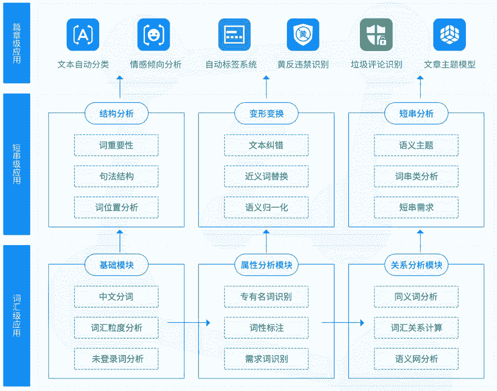
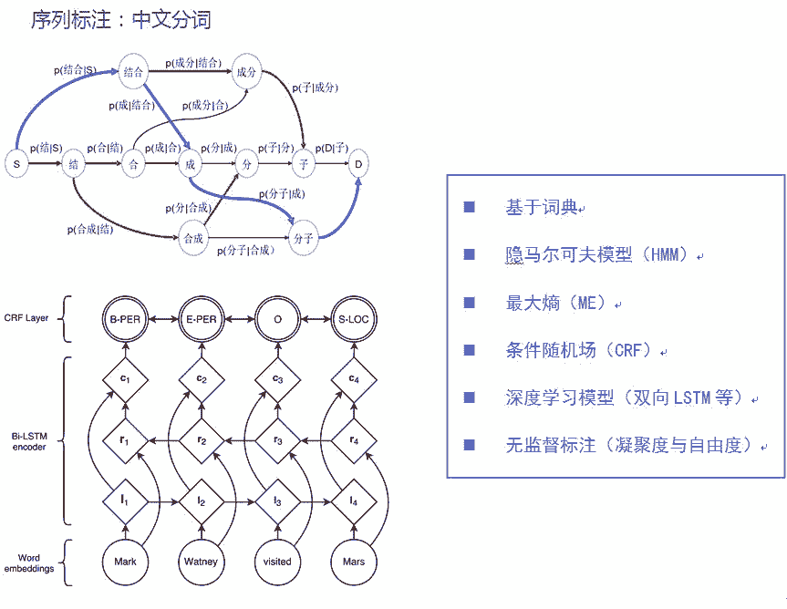
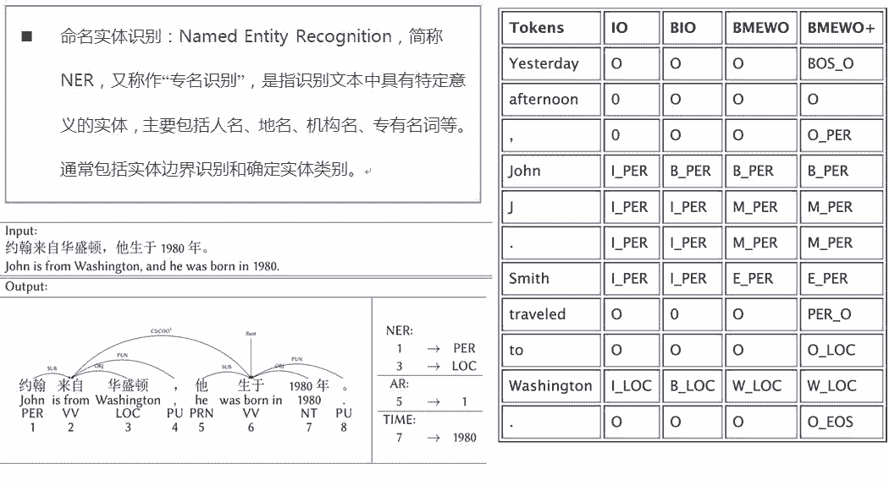
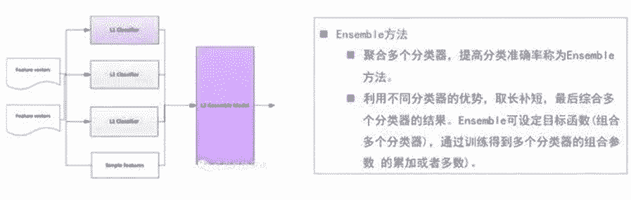
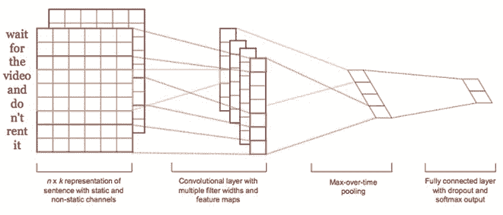
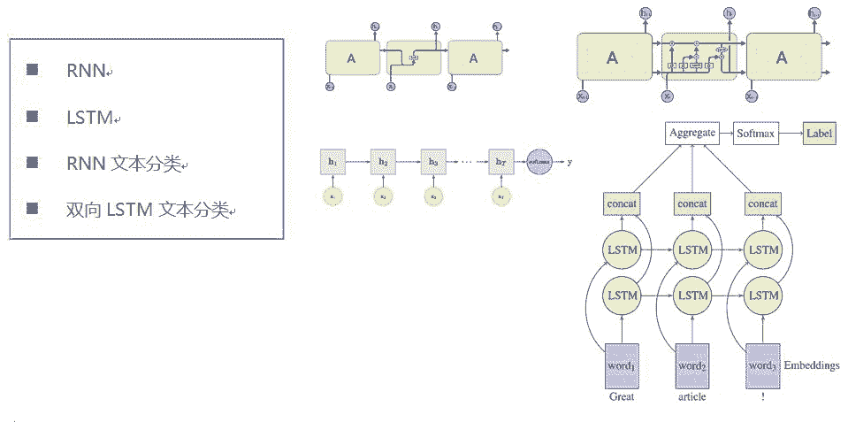
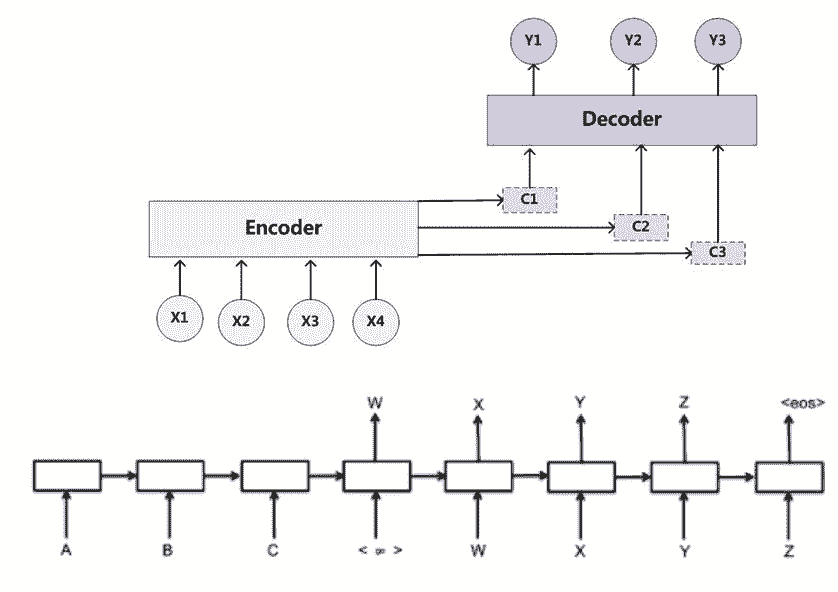
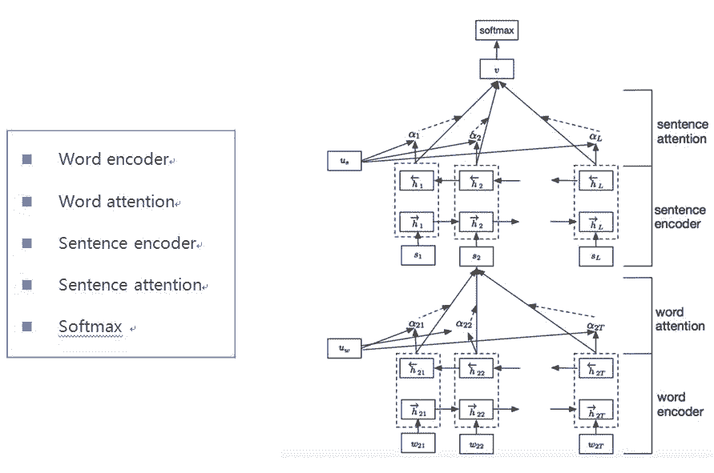
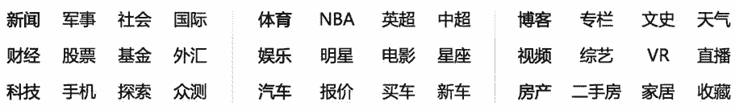

# 专栏 | NLP 概述和文本自动分类算法详解

机器之心专栏

**作者：达观数据**

> 自然语言处理一直是人工智能领域的重要话题，更是 18 年的热度话题，为了在海量文本中及时准确地获得有效信息，文本分类技术获得广泛关注，也给大家带来了更多应用和想象的空间。本文根据达观数据联合创始人张健的直播内容《NLP 概述及文本自动分类算法详解》整理而成。

**一、 NLP 概述**

**1.文本挖掘任务类型的划分**

文本挖掘任务大致分为四个类型：类别到序列、序列到类别、同步的（每个输入位置都要产生输出）序列到序列、异步的序列到序列。

同步的序列到序列的例子包括中文分词，命名实体识别和词性标注。一部的序列到序列包括机器翻译和自动摘要。序列到类别的例子包括文本分类和情感分析。类别（对象）到序列的例子包括文本生成和形象描述。

**2.文本挖掘系统整体方案**

达观数据一直专注于文本语义，文本挖掘系统整体方案包含了 NLP 处理的各个环节，从处理的文本粒度上来分，可以分为篇章级应用、短串级应用和词汇级应用。

篇章级应用有六个方面，已经有成熟的产品支持企业在不同方面的文本挖掘需求：

*   垃圾评论：精准识别广告、不文明用语及低质量文本。

*   黄反识别：准确定位文本中所含涉黄、涉政及反动内容。

*   标签提取：提取文本中的核心词语生成标签。

*   文章分类：依据预设分类体系对文本进行自动归类。

*   情感分析：准确分析用户透过文本表达出的情感倾向。

*   文章主题模型：抽取出文章的隐含主题。

为了实现这些顶层应用，达观数据掌握从词语短串分析个层面的分析技术，开发了包括中文分词、专名识别、语义分析和词串分析等模块。

*达观数据文本挖掘架构图*

**3.序列标注应用：中文分词**

同步的序列到序列，其实就是序列标注问题，应该说是自然语言处理中最常见的问题。序列标注的应用包括中文分词、命名实体识别和词性标注等。序列标注问题的输入是一个观测序列，输出的是一个标记序列或状态序列。

举中文分词为例，处理「结合成分子」的观测序列，输出「结合/成/分子」的分词标记序列。针对中文分词的这个应用，有多种处理方法，包括基于词典的方法、隐马尔可夫模型（HMM）、最大熵模型、条件随机场（CRF）、深度学习模型（双向 LSTM 等）和一些无监督学习的方法（基于凝聚度与自由度）。

**4.序列标注应用：NER**

命名实体识别：Named Entity Recognition，简称 NER，又称作「专名识别」，是指识别文本中具有特定意义的实体，主要包括人名、地名、机构名、专有名词等。通常包括实体边界识别和确定实体类别。

对与命名实体识别，采取不同的标记方式，常见的标签方式包括 IO、BIO、BMEWO 和 BMEWO+。其中一些标签含义是：

*   B：begin

*   I：一个词的后续成分

*   M：中间

*   E：结束

*   W：单个词作为实体

大部分情况下，标签体系越复杂准确度也越高，但相应的训练时间也会增加。因此需要根据实际情况选择合适的标签体系。通常我们实际应用过程中，最难解决的还是标注问题。所以在做命名实体识别时，要考虑人工成本问题。

**5.英文处理**

在 NLP 领域，中文和英文的处理在大的方面都是相通的，不过在细节方面会有所差别。其中一个方面，就是中文需要解决分词的问题，而英文天然的就没有这个烦恼；另外一个方面，英文处理会面临词形还原和词根提取的问题，英文中会有时态变换（made==>make），单复数变换（cats==>cat），词根提取（arabic==>arab）。

在处理上面的问题过程中，不得不提到的一个工具是 WordNet。WordNet 是一个由普林斯顿大学认识科学实验室在心理学教授乔治•A•米勒的指导下建立和维护的英语字典。在 WordNet 中，名词、动词、形容词和副词各自被组织成一个同义词的网络，每个同义词集合都代表一个基本的语义概念，并且这些集合之间也由各种关系连接。我们可以通过 WordNet 来获取同义词和上位词。

**6.词嵌入**

在处理文本过程中，我们需要将文本转化成数字可表示的方式。词向量要做的事就是将语言数学化表示。词向量有两种实现方式：One-hot 表示，即通过向量中的一维 0/1 值来表示某个词；词嵌入，将词转变为固定维数的向量。

word2vec 是使用浅层和双层神经网络产生生词向量的模型，产生的词嵌入实际上是语言模型的一个副产品，网络以词表现，并且需猜测相邻位置的输入词。word2vec 中词向量的训练方式有两种，cbow（continuous bags of word）和 skip-gram。cbow 和 skip-gram 的区别在于，cbow 是通过输入单词的上下文（周围的词的向量和）来预测中间的单词，而 skip-gram 是输入中间的单词来预测它周围的词。

**7.文档建模**

要使计算机能够高效地处理真实文本，就必须找到一种理想的形式化表示方法，这个过程就是文档建模。文档建模一方面要能够真实地反映文档的内容，另一方面又要对不同文档具有区分能力。文档建模比较通用的方法包括布尔模型、向量空间模型（VSM）和概率模型。其中最为广泛使用的是向量空间模型。

**二、文本分类的关键技术与重要方法**

**1.利用机器学习进行模型训练**

文本分类的流程包括训练、文本语义、文本特征处理、训练模型、模型评估和输出模型等几个主要环节。其中介绍一下一些主要的概念。

*   文档建模：概率模型，布尔模型，VSM；

*   文本语义：分词，命名实体识别，词性标注等；

*   文本特征处理：特征降维，包括使用评估函数（TF-IDF，互信息方法，期望交叉熵，QEMI，统计量方法，遗传算法等）；特征向量权值计算；

*   样本分类训练：朴素贝叶斯分类器，SVM，神经网络算法，决策树，Ensemble 算法等；

*   模型评估：召回率，正确率，F-测度值；

**2.向量空间模型**

向量空间模型是常用来处理文本挖掘的文档建模方法。VSM 概念非常直观——把对文本内容的处理简化为向量空间中的向量运算，并且它以空间上的相似度表达语义的相似度，直观易懂。

当文档被表示为文档空间的向量时，就可以通过计算向量之间的相似性来度量文档间的相似性。它的一些实现方式包括：

1）N-gram 模型：基于一定的语料库，可以利用 N-Gram 来预计或者评估一个句子是否合理；

2）TF-IDF 模型：若某个词在一篇文档中出现频率 TF 高，却在其他文章中很少出现，则认为此词具有很好的类别区分能力；

3）Paragraph Vector 模型：其实是 word vector 的一种扩展。Gensim 中的 Doc2Vec 以及 Facebook 开源的 Fasttext 工具也是采取了这么一种思路，它们将文本的词向量进行相加/求平均的结果作为 Paragraph Vector。

**3.文本特征提取算法**

目前大多数中文文本分类系统都采用词作为特征项，作为特征项的词称作特征词。这些特征词作为文档的中间表示形式，用来实现文档与文档、文档与用户目标之间的相似度计算。如果把所有的词都作为特征项，那么特征向量的维数将过于巨大。有效的特征提取算法，不仅能降低运算复杂度，还能提高分类的效率和精度。

文本特征提取的算法包含下面三个方面：

1）从原始特征中挑选出一些最具代表文本信息的特征，例如词频、TF-IDF 方法;

2）基于数学方法找出对分类信息共现比较大的特征，主要例子包括互信息法、信息增益、期望交叉熵和统计量方法;

3）以特征量分析多元统计分布，例如主成分分析（PCA）。

**4.文本权重计算方法**

特征权重用于衡量某个特征项在文档表示中的重要程度或区分能力的强弱。选择合适的权重计算方法，对文本分类系统的分类效果能有较大的提升作用。

特征权重的计算方法包括：

1）TF-IDF；

2）词性；

3）标题；

4）位置；

5）句法结构；

6）专业词库；

7）信息熵；

8）文档、词语长度；

9）词语间关联；

10）词语直径；

11）词语分布偏差。

其中提几点，词语直径是指词语在文本中首次出现的位置和末次出现的位置之间的距离。词语分布偏差所考虑的是词语在文章中的统计分布。在整篇文章中分布均匀的词语通常是重要的词汇。

**5.分类器设计**

由于文本分类本身是一个分类问题，所以一般的模式分类方法都可以用于文本分类应用中。

常用分类算法的思路包括下面四种：

1）朴素贝叶斯分类器：利用特征项和类别的联合概率来估计文本的类别概率；

2）支持向量机分类器：在向量空间中找到一个决策平面，这个平面能够最好的切割两个分类的数据点，主要用于解决二分类问题；

3）KNN 方法：在训练集中找到离它最近的 k 个临近文本，并根据这些文本的分类来给测试文档分类；

4）决策树方法：将文本处理过程看作是一个等级分层且分解完成的复杂任务。

**6.分类算法融合**

聚合多个分类器，提高分类准确率称为 Ensemble 方法。

利用不同分类器的优势，取长补短，最后综合多个分类器的结果。Ensemble 可设定目标函数 (组合多个分类器)，通过训练得到多个分类器的组合参数 (并非简单的累加或者多数)。

我们这里提到的 ensemble 可能跟通常说的 ensemble learning 有区别。主要应该是指 stacking。Stacking 是指训练一个模型用于组合其他各个模型。即首先我们先训练多个不同的模型，然后再以之前训练的各个模型的输出为输入来训练一个模型，以得到一个最终的输出。在处理 ensemble 方法的时候，需要注意几个点。基础模型之间的相关性要尽可能的小，并且它们的性能表现不能差距太大。

多个模型分类结果如果差别不大，那么叠加效果也不明显；或者如果单个模型的效果距离其他模型比较差，也是会对整体效果拖后腿。

**三、文本分类在深度学习中的应用**

**1.CNN 文本分类**

采取 CNN 方法进行文本分类，相比传统方法会在一些方面有优势。

*基于词袋模型的文本分类方法，没有考虑到词的顺序。*

基于卷积神经网络（CNN）来做文本分类，可以利用到词的顺序包含的信息。如图展示了比较基础的一个用 CNN 进行文本分类的网络结构。CNN 模型把原始文本作为输入，不需要太多的人工特征。CNN 模型的一个实现，共分四层：

*   第一层是词向量层，doc 中的每个词，都将其映射到词向量空间，假设词向量为 k 维，则 n 个词映射后，相当于生成一张 n*k 维的图像；

*   第二层是卷积层，多个滤波器作用于词向量层，不同滤波器生成不同的 feature map；

*   第三层是 pooling 层，取每个 feature map 的最大值，这样操作可以处理变长文档，因为第三层输出只依赖于滤波器的个数；

*   第四层是一个全连接的 softmax 层，输出是每个类目的概率，中间一般加个 dropout，防止过拟合。

有关 CNN 的方法一般都围绕这个基础模型进行，再加上不同层的创新。

比如第一个模型在输入层换成 RNN，去获得文本通过 rnn 处理之后的输出作为卷积层的输入。比如说第二个是在 pooling 层使用了动态 kmax pooling，来解决样本集合文本长度变化较大的问题。比如说第三种是极深网络，在卷积层做多层卷积，以获得长距离的依赖信息。CNN 能够提取不同长度范围的特征，网络的层数越多，意味着能够提取到不同范围的特征越丰富。不过 cnn 层数太多会有梯度弥散、梯度爆炸或者退化等一系列问题。

为了解决这些问题，极深网络就通过 shortcut 连接。残差网络其实是由多种路径组合的一个网络，残差网络其实是很多并行子网络的组合，有些点评评书残差网络就说它其实相当于一个 Ensembling。

**2.RNN 与 LSTM 文本分类**

CNN 有个问题是卷积时候是固定 filter_size，就是无法建模更长的序列信息，虽然这个可以通过多次卷积获得不同范围的特征，不过要付出增加网络深度的代价。

Rnn 的出现是解决变长序列信息建模的问题，它会将每一步中产生的信息都传递到下一步中。

首先我们在输入层之上，套上一层双向 LSTM 层，LSTM 是 RNN 的改进模型，相比 RNN，能够更有效地处理句子中单词间的长距离影响；而双向 LSTM 就是在隐层同时有一个正向 LSTM 和反向 LSTM，正向 LSTM 捕获了上文的特征信息，而反向 LSTM 捕获了下文的特征信息，这样相对单向 LSTM 来说能够捕获更多的特征信息，所以通常情况下双向 LSTM 表现比单向 LSTM 或者单向 RNN 要好。

如何从物理意义上来理解求平均呢？这其实可以理解为在这一层，两个句子中每个单词都对最终分类结果进行投票，因为每个 BLSTM 的输出可以理解为这个输入单词看到了所有上文和所有下文（包含两个句子）后作出的两者是否语义相同的判断，而通过 Mean Pooling 层投出自己宝贵的一票。

**3.Attention Model 与 seq2seq**

注意力模型 Attention Model 是传统自编码器的一个升级版本。传统 RNN 的 Encoder-Decoder 模型，它的缺点是不管无论之前的 context 有多长，包含多少信息量，最终都要被压缩成固定的 vector，而且各个维度维度收到每个输入维度的影响都是一致的。为了解决这个问题，它的 idea 其实是赋予不同位置的 context 不同的权重，越大的权重表示对应位置的 context 更加重要。

现实中，举一个翻译问题：jack ma dances very well 翻译成中文是马云跳舞很好。其中，马云应该是和 jack ma 关联的。

Attention Model 是当前的研究热点，它广泛地可应用于文本生成、机器翻译和语言模型等方面。

**4.Hierarchical Attention Network**

下面介绍层次化注意力网络。

词编码层是首先把词转化成词向量，然后用双向的 GRU 层, 可以将正向和反向的上下文信息结合起来，获得隐藏层输出。第二层是 word attention 层。attention 机制的目的是要把一个句子中，对句子的含义最重要，贡献最大的词语找出来。

为了衡量单词的重要性, 我们用 u_it 和一个随机初始化的上下文向量 u_w 的相似度来表示，然后经过 softmax 操作获得了一个归一化的 attention 权重矩阵 a_it，代表句子 i 中第 t 个词的权重。结合词的权重，句子向量 s_i 看作组成这些句子的词向量的加权求和。

第三层是句子编码层，也是通过双向 GRU 层, 可以将正向和反向的上下文信息结合起来，获得隐藏层输出。

到了第四层是句子的注意力层，同词的注意力层差不多，也是提出了一个句子级别的上下文向量 u_s, 来衡量句子在文中的重要性。输出也是结合句子的权重，全文的向量表示看做是句子向量的加权求和。

到了最后，有了全文的向量表示，我们就直接通过全连接 softmax 来进行分类。

**四、案例介绍**

**1.新闻分类**

新闻分类是最常见的一种分类。其处理方法包括：

1）定制行业专业语料，定期更新语料知识库，构建行业垂直语义模型。

2）计算 term 权重，考虑到位置特征，网页特征，以及结合离线统计结果获取到核心的关键词。

3）使用主题模型进行语义扩展

4）监督与半监督方式的文本分类

**2.垃圾广告黄反识别**

垃圾广告过滤作为文本分类的一个场景有其特殊之处，那就是它作为一种防攻击手段，会经常面临攻击用户采取许多变换手段来绕过检查。

处理这些变换手段有多重方法：

*   一是对变形词进行识别还原，包括要处理间杂特殊符号，同音、简繁变换，和偏旁拆分、形近变换。

*   二是通过语言模型识别干扰文本，如果识别出文本是段不通顺的「胡言乱语」，那么他很可能是一段用于规避关键字审查的垃圾文本。

*   三是通过计算主题和评论的相关度匹配来鉴别。

*   四是基于多种表达特征的分类器模型识别来提高分类的泛化能力。

**3.情感分析**

情感分析的处理办法包括：

1）基于词典的情感分析，主要是线设置情感词典，然后基于规则匹配（情感词对应的权重进行加权）来识别样本是否是正负面。

2）基于机器学习的情感分析，主要是采取词袋模型作为基础特征，并且将复杂的情感处理规则命中的结果作为一维或者多维特征，以一种更为「柔性」的方法融合到情感分析中，扩充我们的词袋模型。

3）使用 dnn 模型来进行文本分类，解决传统词袋模型难以处理长距离依赖的缺点。

**4.NLP 其他应用**

NLP 在达观的其他一些应用包括：

1）标签抽取；

2）观点挖掘；

3）应用于推荐系统；

4）应用于搜索引擎。

标签抽取有多种方式：基于聚类的方法实现。此外，现在一些深度学习的算法，通过有监督的手段实现标签抽取功能。

就观点挖掘而言，举例：床很破，睡得不好。我抽取的观点是「床破」，其中涉及到语法句法分析，将有关联成本提取出来。

搜索及推荐，使用到 NLP 的地方也很多，如搜索引擎处理用户查询的纠错，就用到信道噪声模型实行纠错处理。

最后，给喜爱 NLP 的朋友推荐一个赛事活动，也是达观数据主办的「达观杯」文本智能处理挑战赛，此次比赛以文本自动分类为赛题，如果对上文讲到的算法有想练习或者想深入实践，可拿比赛来练习充实一下，目前赛事已有近 1400 人参赛。点击阅读原文可了解比赛详情，本周四 7 月 26 日晚还为大家准备了深度学习与文本智能处理的分享直播，感兴趣可扫码入群了解详情。

