# 图解当前最强语言模型 BERT：NLP 是如何攻克迁移学习的？

选自 jalammar.github.io

**作者：Jay Alammar**

****机器之心编译****

****参与：Panda****

> 前段时间，谷歌发布了基于双向 Transformer 的大规模预训练语言模型 BERT，该预训练模型能高效抽取文本信息并应用于各种 NLP 任务，该研究凭借预训练模型刷新了 11 项 NLP 任务的当前最优性能记录。技术博主 Jay Alammar 近日发文通过图解方式生动地讲解了 BERT 的架构和方法基础。

2018 年是机器学习模型处理文本（更准确地说是自然语言处理，简称 NLP）的一个转折点。如何最好地表征词和句子以便最好地理解其潜在含义和关系？我们对此的概念理解正在快速演进。此外，NLP 社区也一直都在提出强大的新组件——你可以免费下载它们并将其用在你自己的模型和流程中（这被称为 NLP 的 ImageNet 时刻，是指这类似于多年前用于计算机视觉任务的机器学习的加速发展）。

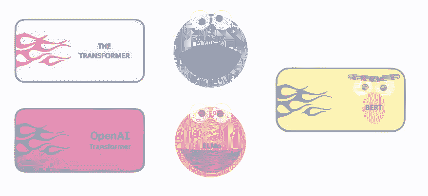

*ULM-FiT 和 Cookie Monster 没任何直接联系，但我想不到其它东西……*

这一领域最近的里程碑是 BERT 的发布，人们将这一事件誉为 NLP 新时代的开端。BERT 这种模型打破了多项模型处理基于语言的任务的纪录。在描述该模型的论文发布之后不久，其研究团队还开源了该模型的代码，并发布了可供下载的模型版本——已经在大规模数据集上经过预训练。这是一个重大的进展，因为它让任何人都可以构建涉及语言处理的机器学习模型，并将这种强大工具用作其中的组件——这能节省从头开始训练语言处理模型所需的时间、精力、知识和资源。

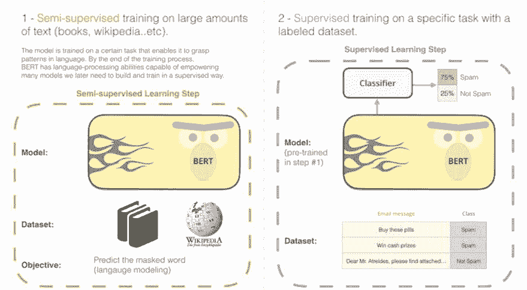

BERT 的开发分为两个步骤。你可以下载在步骤 1 中预训练过的模型（在无标注数据上训练过）；只需考虑针对步骤 2 进行调整。

BERT 的开发基础包含很多 NLP 社区内近期涌现出的聪明思路，其中包括但不限于半监督序列学习（来自 Andrew Dai and Quoc Le）、ELMo（来自 Matthew Peters 以及 AI2 和华盛顿大学计算机科学与工程系的研究者）、ULMFiT（来自 fast.ai 创始人 Jeremy Howard 和 Sebastian Ruder）、OpenAI transformer（来自 OpenAI 的研究者 Radford、Narasimhan、Salimans 和 Sutskever）、Transformer（Vaswani et al）。

要恰当地了解 BERT 究竟是什么，你需要了解很多概念。所以我们先来看看可以如何使用 BERT，之后再介绍涉及该模型的概念。

**示例：句子分类**

使用 BERT 最直接的方式是将其用于分类单个文本。该模型看起来会是这样的：

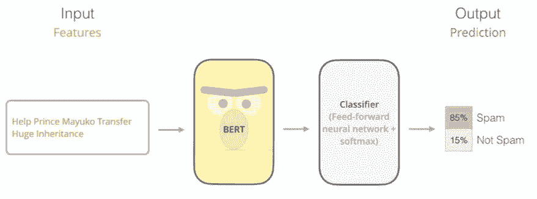

为了训练这样一个模型，你主要必须训练分类器（Classifier），而让 BERT 模型在训练过程中有尽可能小的变化。这个训练阶段被称为微调（Fine-Tuning），而且源自半监督序列学习和 ULMFiT。

为不熟悉这一主题的人解释一下：因为我们正在谈论分类器，那么我们就处于机器学习的监督学习领域。也就是说我们需要一个有标注的数据集来训练模型。对于这个垃圾邮件分类器示例，有标注的数据集即为邮件信息和对应标签构成的列表（每条邮件信息被标注为「垃圾邮件」或「非垃圾邮件」）。

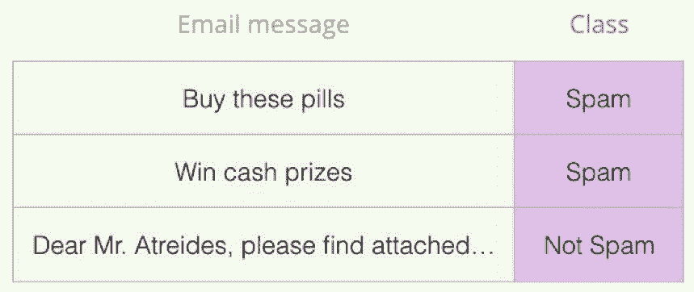

这种用例的其它示例包括：

**情感分析**

*   输入：电影/产品评论。输出：这个评论是正面的还是负面的？

*   示例数据集：SST：https://nlp.stanford.edu/sentiment/

**事实检查**

*   输入：句子。输出：「事实声明」或「非事实声明」。

*   更雄心勃勃且更有未来感的示例：输入：称述句。输出：「真」或「假」。

*   Full Fact 是一家组织机构为公共利益构建的一款自动事实检查工具。其一部分工作流程是让分类器阅读新闻并检查声明的事实（将文本分类为「事实声明」或「非事实声明」），之后再进行事实查证（这个事情现在是人类在做，希望未来能让机器做）。

*   视频：用于自动化事实查证的句子嵌入：https://www.youtube.com/watch?v=ddf0lgPCoSo

**模型架构**

现在你的脑子里已经有一个有关 BERT 使用方式的示例用例了，现在我们来仔细看看它的工作方式。

这篇论文为 BERT 提出了两种大小的模型：

*   BERT BASE：与 OpenAI Transformer 大小相当，这是为了比较两者的表现而构建的。

*   BERT LARGE：一个非常巨大的模型，实现了当前最佳。

BERT 基本上就是一个经过训练的 Transformer Encoder 的堆栈。现在该向你推荐我之前解释 Transformer 的文章了：https://jalammar.github.io/illustrated-transformer/ ；Transformer 模型是 BERT 以及我们后面将会讨论的很多概念的基础概念。

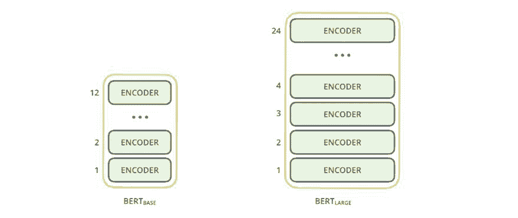

这两种大小的 BERT 模型都有很多编码器层（这篇论文称之为 Transformer Blocks）——Base 版有 12 层，Large 版有 24 层。相比于 Transformer 初始论文的参考实现的默认配置（6 个编码器层、512 个隐藏单元和 8 个注意头），它们还有更大的前馈网络（分别有 768 和 1024 个隐藏单元）和更多注意头（attention head，分为有 12 和 16 个）。

**模型输入**

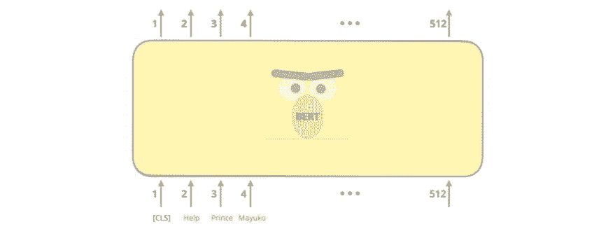

首个输入的 token 由一个特殊的 [CLS] token 填补，原因后面就会明了。CLS 表示 Classification。

与 Transformer 的简单纯粹的编码器一样，BERT 以词序列为输入，这些词会在其堆栈中不断向上流动。每一层都会应用自注意，并会通过一个前馈网络传递它的结果，然后将其移交给下一个编码器。

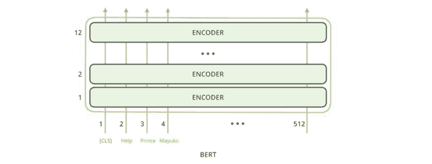

在架构方面，直到这部分为止都与 Transformer 完全相同（除了规模大小，见上述的配置）。在输出的位置，我们开始看到不同。

**模型输出**

每个位置都会输出一个大小为 hidden_size（BERT Base 为 768）的向量。对于我们上面看到的句子分类示例，我们仅关注第一个位置的输出（即我们传递了特殊的 [CLS] token 的位置）。

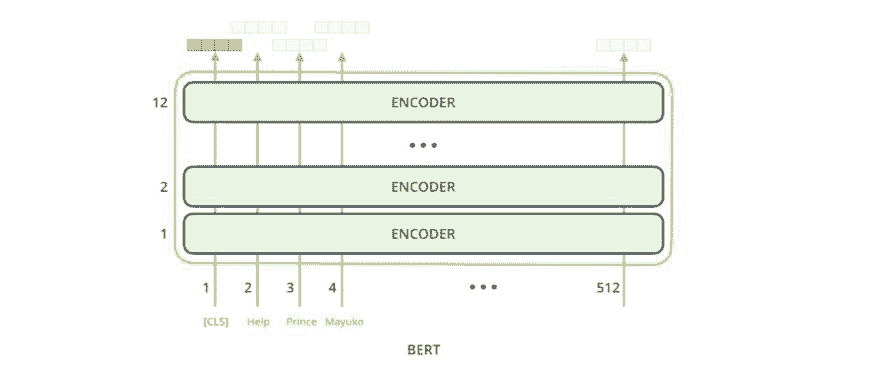

现在，这个向量就可以被用作我们所选择的分类器的输入。这篇论文仅使用单层神经网络作为分类器就取得了非常优良的结果。

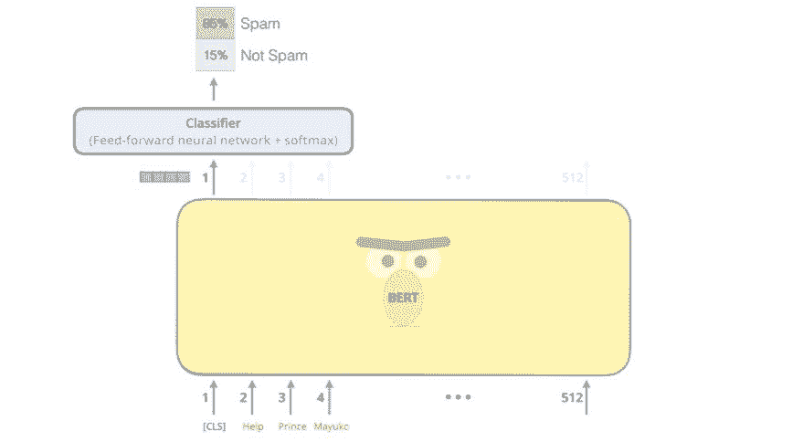

如果你有更多标签（比如如果你的电子邮件服务会将邮件标注为「垃圾邮件」、「非垃圾邮件」、「社交」、「广告」），那么你只需要调整分类器网络使其具有更多输出神经元，然后通过 softmax 即可。

**对比卷积网络**

如果你有计算机视觉的背景，你可能会发现这种向量传递类似于 VGGNet 等网络的卷积部分与网络末端的全连接分类部分之间的情况。

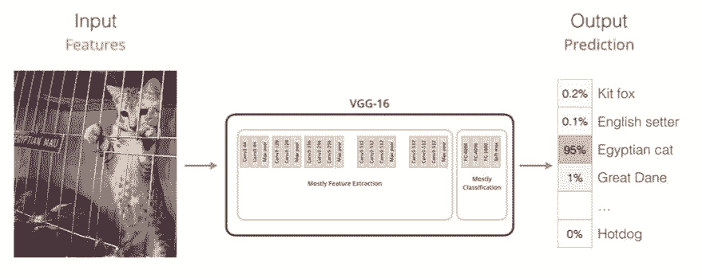

**嵌入的新时代**

这些新进展带来了词编码方式的转变。到目前为止，词嵌入一直都是推动 NLP 模型解决语言任务的主要力量。word2vec 和 GloVe 等方法在这类任务上得到了广泛的应用。我们先来看看之前的做法，然后再看现在有什么变化。

**回顾词嵌入**

要让机器学习模型能处理词，首先需要将词表示成某种数值形式，以便模型进行计算。Word2Vec 表明我们可以使用向量（某种数值列表）来恰当地表征词，使得这些表征能具备词之间的语义或含义关系（比如能说明词的含义是否相似或相反，像是「斯德哥尔摩」和「瑞典」这一组词与「开罗」和「埃及」这一组词之间具有同样的关系）以及句法或基于语法的关系（比如「had」和「has」之间的关系与「was」和「is」之间的关系一样）。

这一领域很快认识到，使用在大规模文本数据上预训练后的词嵌入是一个很棒的思路，而不是在通常很小的数据集上与模型一起训练词嵌入。因此，人们就可以下载词以及使用 Word2Vec 或 GloVe 预训练后生成的词嵌入了。下面是词「stick」的 GloVe 嵌入示例（嵌入向量大小为 200）：

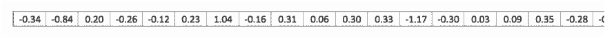

*词「stick」的 GloVe 词嵌入，这是一个由 200 个浮点数（四舍五入到两位小数）构成的向量。这里给出的并不完整，总共有 200 个值。*

因为这些向量很大而且都是数字，所以本文会使用下面的简单图形来表示它们：

**ELMo：上下文很重要**

如果我们使用这种 GloVe 表示方法，那么不管上下文如何，词「stick」都会表示成这个向量。很多 NLP 研究者意识到了这种操作并不稳妥，比如 Peters et. al., 2017、McCann et. al., 2017 以及 Peters et. al., 2018 的 ELMo 论文。根据使用的场景，「stick」可能具有多种含义。为什么不根据其所处的语境/上下文来确定词嵌入呢——这样既能获得该词在上下文中的含义，还能得到其它语境信息？为此，语境化词嵌入诞生了。

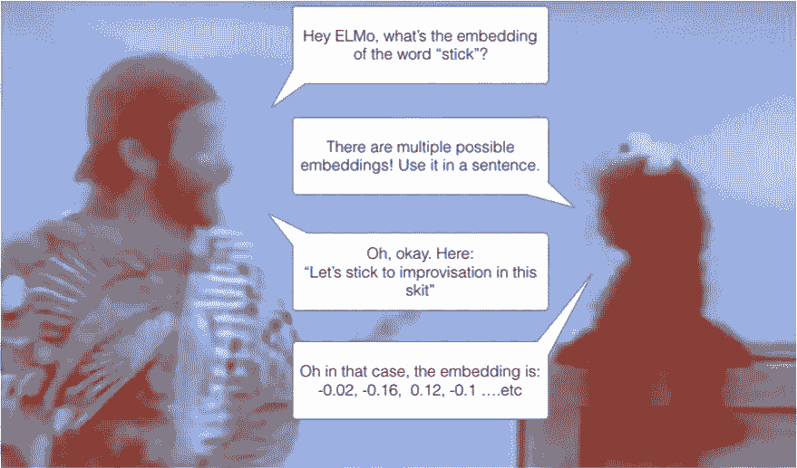

语境化词嵌入能根据词在句子语境中的含义给予其不同的嵌入。

ELMo 并不为每个词使用一个固定的嵌入，而是会在为句子中的词分配嵌入之前检查整个句子。它使用了一个在特定任务上训练的双向 LSTM 来创建这些嵌入。

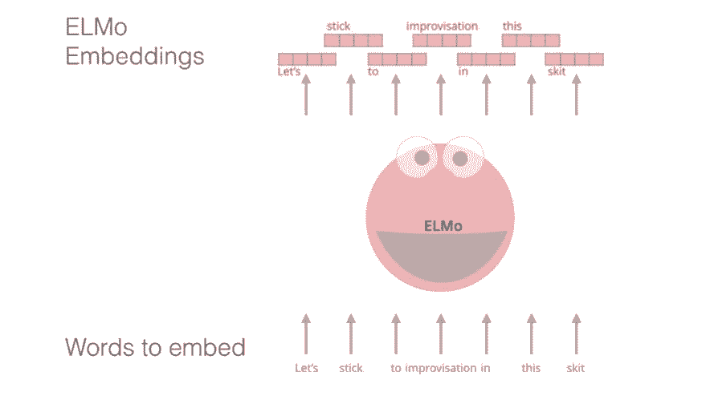

ELMo 是向 NLP 预训练所迈出的重要一步。ELMo LSTM 会在我们数据集的语言的一个大规模数据集上进行训练，然后我们可以将其用作其它需要处理语言的模型的组件。

**ELMo 有何奥妙？**

ELMo 的训练方式是预测一个词序列的下一个词，并以此来获得对语言的理解——这个任务被称为语言建模。这是很方便的，因为我们有大量文本数据，这样的模型无需标签也能学习。

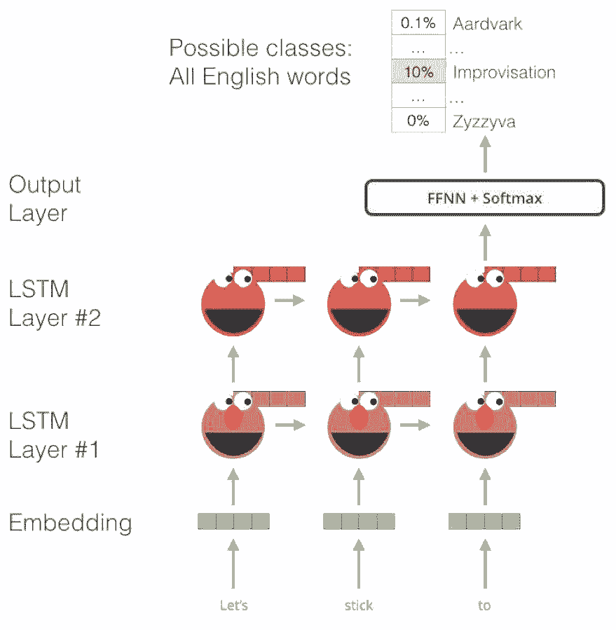

*ELMo 的预训练过程中的一步。给定「Let's stick to」为输入，预测下一个最有可能的词——这是一个语言建模任务。在大型数据集上训练时，模型会开始提取语言模式。在这个示例中，模型不太可能准确猜出下一个词。更现实的情况是，比如在出现了「hang」这个词之后，为「out」分配更高的概率（以拼出「hang out」），而不是「camera」。*

我们可以看到从 ELMo 的头部后面伸出的每个未展开的 LSTM 步骤的隐藏状态。在这个预训练完成之后，它们能用在嵌入过程中。

ELMo 实际上更进了一步，训练了一个双向 LSTM——使其语言模型不仅有对下一个词的感知，还有对前一个词的感知。

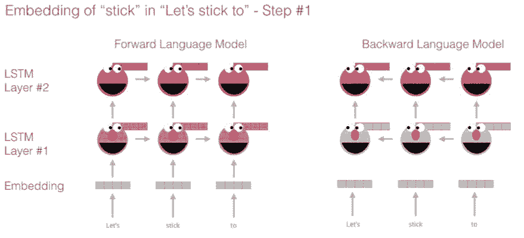

*一个很赞的介绍 ELMo 的幻灯片：https://goo.gl/Fg5pF9*

ELMo 通过一种特定方式（连接之后加权求和）对隐藏状态（和初始嵌入）进行分组，从而构建出语境化的嵌入。

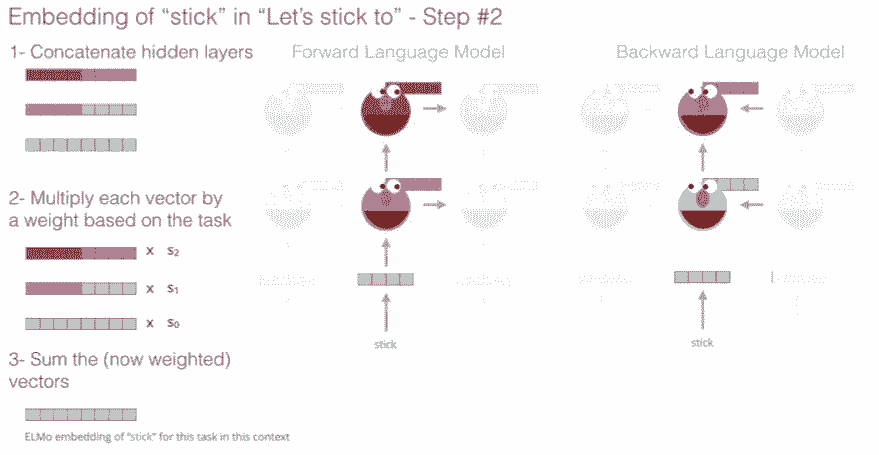

**ULM-FiT：解决 NLP 中的迁移学习**

ULM-FiT 引入了新的方法，可有效利用模型在预训练阶段学习到的很多东西——不只是嵌入，而且也不只是语境化嵌入。ULM-FiT 引入了一种新语言模型和新处理过程，可针对多种任务对语言模型进行调整。NLP 终于有一种做迁移学习的方法了，或许就像计算机视觉一样。

**Transformer：超越 LSTM**

Transformer 论文和代码的发布以及其在机器翻译等任务上取得的结果开始让该领域内的一些人思考用 Transformer 替代 LSTM。这是因为事实上 Transformer 在处理长期依赖方面优于 LSTM。

Transformer 的编码器-解码器结构使其能完美应用于机器翻译。但我们如何将其用于句子分类呢？我们怎么将其用于预训练语言模型，然后再针对其它任务调整这个语言模型呢？（该领域将这些利用了预训练的模型或组件的监督学习任务称为下游任务）。

**OpenAI Transformer：为语言建模训练 Transformer 解码器**

事实证明，我们不需要整个 Transformer，就能将迁移学习和可调节的语言模型用于 NLP 任务。我们只需要 Transformer 的解码器就够了。解码器是很好的选择，因为这是语言建模的自然选择（预测下一个词），因为它是为得到未来 token 的掩码而构建的——对逐词生成翻译任务而言，这是很有价值的特征。

*OpenAI Transformer 是由 Transformer 的解码器堆栈构成的。*

该模型堆叠了 12 个解码器层。因为其中没有编码器，所以这些解码器层不会有编码器-解码器注意子层（attention sublayer），而原本的 Transformer 解码器层中有这样的注意子层。但是，OpenAI Transformer 中仍然有自注意层。

使用这种结构，我们可以继续在同一语言建模任务上训练该模型：使用大规模（无标注）数据集预测下一个词。丢给它 7000 本书的文本让它学习就行了！对这类任务而言，书籍是很棒的数据，因为书籍能让模型学习关联相关的信息，即使这些信息已被大量文本分隔开——当你用微博或文章等短篇幅文本进行训练时，很难学到这类关联属性。

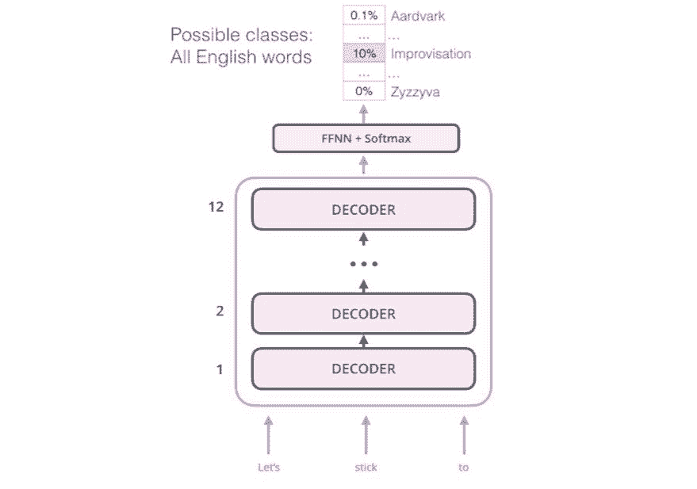

OpenAI Transformer 现在已经准备好基于 7000 本书构成的数据集来预测下一个词了。

**迁移学习到下游任务**

现在 OpenAI Transformer 已经过了预训练，其中的层也经过了调节，可以合理地处理语言，我们可以开始将其用于下游任务了。首先我们来看看句子分类（将邮件消息分类为「垃圾邮件」或「非垃圾邮件」）。

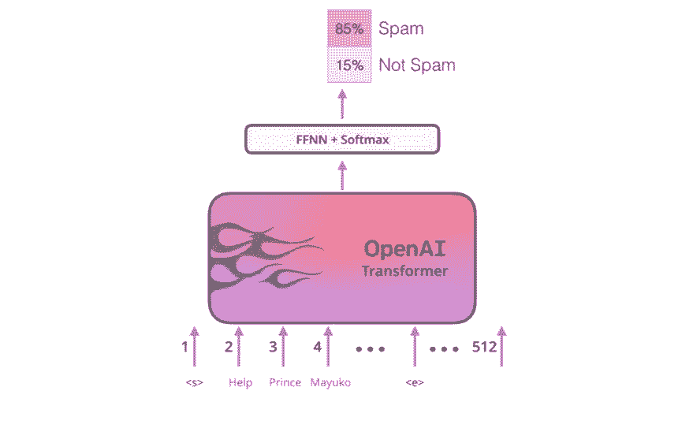

*如何使用预训练后的 OpenAI Transformer 来分类句子*

OpenAI 的论文罗列了一些输入变换，用以处理不同类型的任务的输入。下图即来自该论文，展示了用于执行不同任务的模型结构和输入变换。

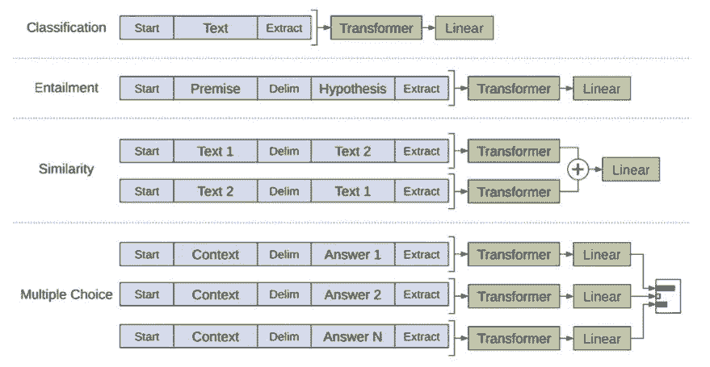

是不是很巧妙？

**BERT：从解码器到编码器**

OpenAI Transformer 为我们提供了基于 Transformer 的可微调的预训练模型。但在这种从 LSTM 到 Transformer 的过度中却缺失了一些东西。ELMo 的语言模型是双向的，而 OpenAI Transformer 仅训练一个单向语言模型。我们能否构建出一种既能向前看也能向后看（即同时基于上文和下文）的基于 Transformer 的模型？

「瞧我的！」BERT 说。

**有掩码的语言模型**

BERT 说：「我们将使用 Transformer 编码器。」

「太疯狂了，」Ernie 说，「每个人都知道双向调节会让每个词都在多层上下文中间接地看到自己。」

「我们将使用掩码（mask）。」BERT 自信地说。

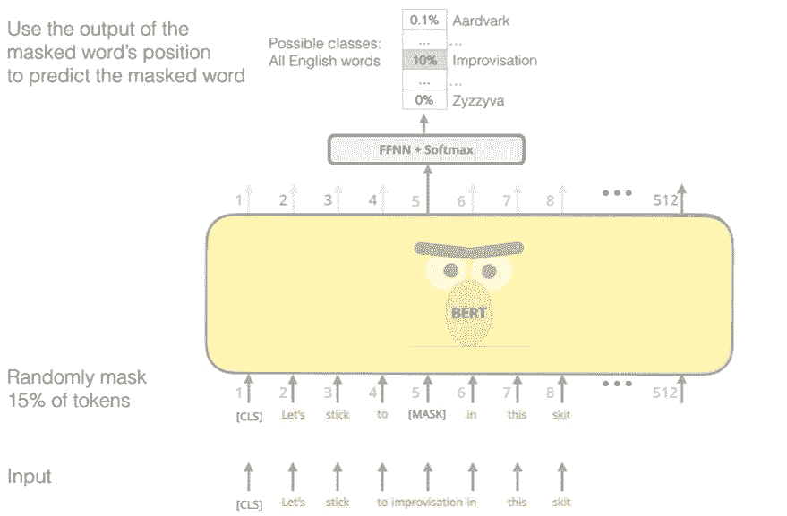

BERT 巧妙的语言建模任务会掩盖输入中 15% 的词，并让模型来预测缺失的词。

寻找合适的任务来训练 Transformer 编码器堆栈是一个复杂的难题，BERT 通过采用来自早期文献的「有掩码的语言模型」概念而解决了这一难题（在早期文献中被称为完形填空任务（Cloze））。

除了掩蔽 15% 的输入，BERT 还混用了一些方法来改善模型之后的调整。有时候它会随机将一个词替换成另一个词，然后让模型预测该位置的正确词。

**两句子任务**

如果你回头看看 OpenAI Transformer 用以处理不同任务的输入变换，你会发现某些任务需要模型给出有关两个句子的一些知识（比如它们是否只是彼此的复述版本？给定一个维基百科词条以及涉及该词条内容的问题作为输入，我们能否回答该问题？）

要让 BERT 更好地处理多个句子之间的关系，其预训练过程还包括一项额外任务：给定两个句子（A 和 B），B 是否有可能是 A 后面的句子？

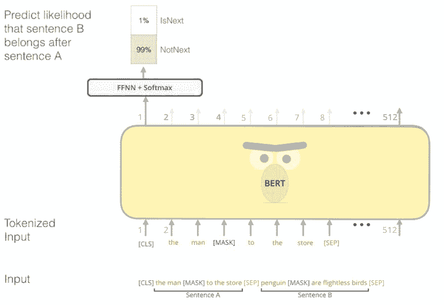

BERT 预训练的这个次级任务是一个两句子分类任务。这幅图中的 token 化过度简化了一些，因为 BERT 实际上是使用 WordPieces 作为 token，而不是使用词——因此某些词会被分解成更小的块。

**针对特定任务的模型**

BERT 论文展示了一些将 BERT 用于不同任务的方法。

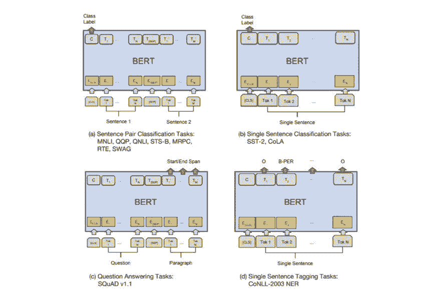

**将 BERT 用于特征提取**

微调方法并不是使用 BERT 的唯一方式。和 ELMo 一样，你也可以使用预训练后的 BERT 来创建语境化的词嵌入。然后你可以将这些嵌入输入你已有的模型——论文表明，在命名实体识别等任务上，该过程得到的结果并不比微调 BERT 差很多。

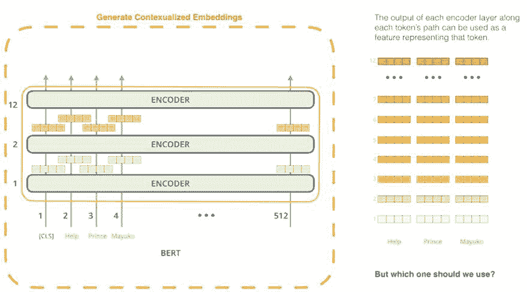

哪种向量最适合用作语境化嵌入？我认为这取决于具体任务。这篇论文考察了 6 种选择（对比得到了 96.4 分的微调模型）：

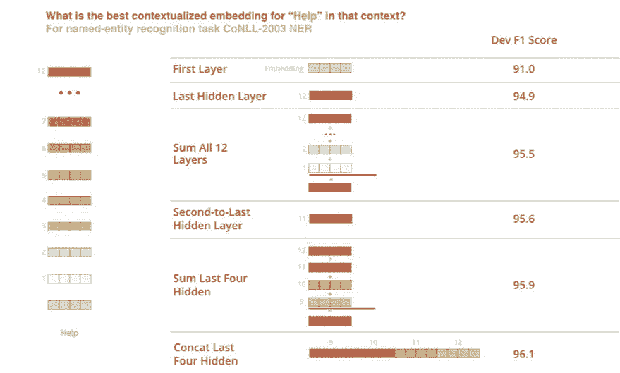

**实际使用 BERT**

尝试 BERT 的最好方式是动手过一遍使用 Cloud TPU 的 BERT 微调，参考托管在 Google Colab 上的笔记：https://goo.gl/vaZRH1。如果你之前从未用过 Cloud TPU，这就是你的上手时机！这些 BERT 代码也适用于 TPU、CPU 和 GPU。

接下来应该看看 BERT 代码库中的代码：https://github.com/google-research/bert

*   模型构建在 modeling.py 之中（BertModel 类），基本上与原始的 Transformer 编码器完全一样。

*   run_classifier.py 是一个微调过程的示例。它也构建了这个监督式模型的分类层。如果你想构建自己的分类器，请查阅该文件中的 create_model() 方法。

*   其中提供了几个可下载的预训练模型。BERT Base 和 BERT Large 模型都有，涵盖英语和汉语等语言，还有一个在维基百科上训练的覆盖了 102 种语言的多语言模型。

*   BERT 并不将词视为 token，而是将 WordPieces 视为 token。tokenization.py 是 token 化算法，可将词转换成适用于 BERT 的 WordPieces。

你还可以查看 BERT 的 PyTorch 实现。AllenNLP 库使用了这一实现，让任何模型都可以使用 BERT 嵌入。

*   BERT 的 PyTorch 实现：https://github.com/huggingface/pytorch-pretrained-BERT

*   AllenNLP：https://github.com/allenai/allennlp

最后附上机器之心发布的 BERT 相关文章：

*   [最强 NLP 预训练模型！谷歌 BERT 横扫 11 项 NLP 任务记录](http://mp.weixin.qq.com/s?__biz=MzA3MzI4MjgzMw==&mid=2650749886&idx=1&sn=87080bc474d144b286d4673383f4b6d6&chksm=871affc0b06d76d6ab49b2828a8b795b18e3d762b3978a83704a01dd60fb6dbcde2ed00e163d&scene=21#wechat_redirect)

*   [谷歌终于开源 BERT 代码：3 亿参数量，机器之心全面解读](http://mp.weixin.qq.com/s?__biz=MzA3MzI4MjgzMw==&mid=2650751075&idx=2&sn=0a3ecd1af5f8549051760775e34db342&chksm=871a841db06d0d0bcf3cc4e620bb384e050ba6e92224d338a8ddc1543add97a4a4e7919ebf15&scene=21#wechat_redirect)

*   [资源 | 最强预训练模型 BERT 的 Pytorch 实现（非官方）](http://mp.weixin.qq.com/s?__biz=MzA3MzI4MjgzMw==&mid=2650750266&idx=2&sn=a269558f0abf005cfa9cab48a31f117a&chksm=871af944b06d705228ed11bd2283f4164cfd51ff33d458b0d549703482cd443dc9a90e2fb022&scene=21#wechat_redirect)

*   [推出一个半月，斯坦福 SQuAD 问答榜单前六名都在使用 BERT](http://mp.weixin.qq.com/s?__biz=MzA3MzI4MjgzMw==&mid=2650752606&idx=2&sn=8d8bb3c7317bbc99c04cf88dffce42cd&chksm=871a8220b06d0b361640bb33b54e2910d24436a2e428b72b57c45039e735d709897e4fb34205&scene=21#wechat_redirect) ********

*原文链接：https://jalammar.github.io/illustrated-bert/*

****本文为机器之心编译，**转载请联系本公众号获得授权****。**

✄------------------------------------------------

**加入机器之心（全职记者 / 实习生）：hr@jiqizhixin.com**

**投稿或寻求报道：**content**@jiqizhixin.com**

**广告 & 商务合作：bd@jiqizhixin.com**