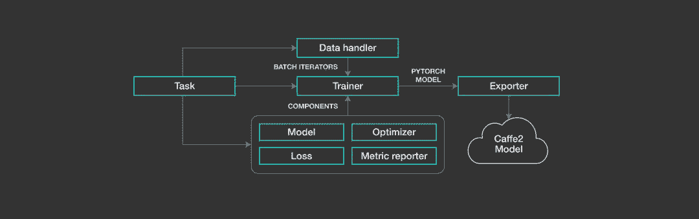
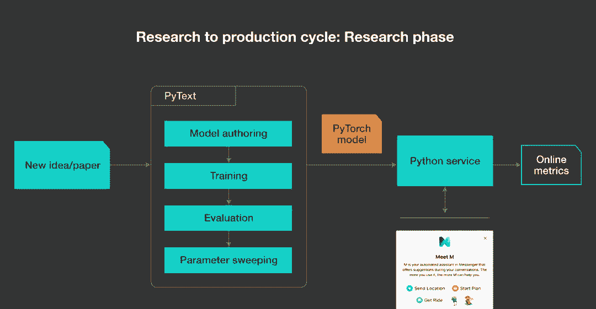
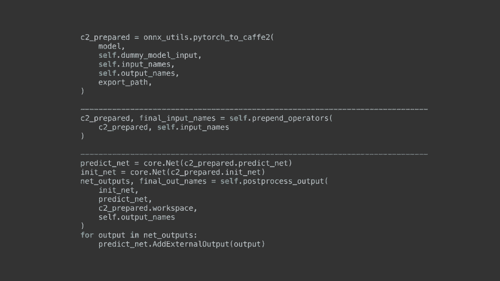

# Facebook 开源 NLP 建模框架 PyText，从论文到产品部署只需数天

选自 code.fb

**作者：******AHMED ALY HEGAZY、CHRISTOPHER DEWAN****

****机器之心编译****

**参与：淑婷、张倩**

> Facebook AI Research（FAIR）今天宣布推出 PyText 的开源版本，它是这家公司正在使用的主要自然语言处理（NLP）建模框架，目前每天在为 Facebook 及其应用程序系列的用户提供超过 10 亿次 AI 任务处理。

Yann LeCun 对此介绍道，「PyText 是一个工业级的开源 NLP 工具包，可用于在 PyTorch 中开发 NLP 模型，并通过 ONNX 部署。其预训练模型包括文本分类、序列标注等。」

项目地址：https://github.com/facebookresearch/pytext

为了降低人们创建、部署自然语言处理系统的难度，Facebook 开源了一个建模框架——PyText，它模糊了实验与大规模部署之间的界限。这一框架基于 PyTorch，可以为 NLP 的发展带来以下好处：

*   提供简化的工作流程，加速实验。

*   提供一大批预构建的模型架构和用于文本处理和词汇管理的工具，以促进大规模部署。

*   提供利用 PyTorch 生态系统的能力，包括由 NLP 社区中的研究人员、工程师预构建的模型和工具。

AI 研究人员和工程师现在可以利用 PyText 加快实验进度，部署用于文档分类、序列标注、语义分析、多任务建模及其他任务的系统。利用该框架，Facebook 在几天内就实现了 NLP 模型从理念到完整实施的整个过程，还部署了依赖多任务学习的复杂模型。现在，PyText 被 Facebook 用于超过十亿次的日常预测工作，这表明该框架可以以产品级的规模运行，能够满足严格的延迟要求。

在优化框架时，神经网络工程师一直都在实验和生产之间进行权衡，NLP 系统的工程师更是如此。NLP 系统需要创建、训练、测试数十个模型，其结构具有动态特性。以研究为导向的框架可以提供一个简单的 eager-execution 接口，加快创建动态高级模型的进程，但如果将它们部署到生产，就会面临延迟多、内存占用多的困境。针对生产进行优化的框架可以通过将模型展示为静态图来加快部署，但这种方法增加了创建文本序列动态表征的难度。PyTorch 1.0 是一个统一的框架，缩短了从研究到生产的路径。而基于 PyTorch 的 PyText 则着眼于满足 NLP 建模的特定需求。

此次一起开源的还有一些用于大规模训练和部署 PyText 模型的预训练模型及教程。

**走向更好的 NLP**

AI 研究人员及工程师拥有许多可以理解语言的系统应用，而且这些应用还在增加。Facebook 利用 NLP 向用户提供相关性更强的内容，为他们提供更加强大的可用功能、标记违规动态、翻译等其它服务。会话 AI 的前沿研究进展迅速，PyText 可以进一步加快这一进程，同时提高产品质量。PyText 目前已经部署到 Facebook 的视频通话设备 Portal 以及 Messenger 的 M suggestions 功能中。此外，Facebook 还在探索 PyText 在会话 AI 领域的其它应用。

借助 PyText，Portal 可以支持「Hey Portal」语音命令中的组合和嵌套调用查询。这一功能使得用户可以使用类似「给我爸打电话」这样的语音命令。这种命令要求系统理解呼叫者与被呼叫者之间的关系，利用了 Facebook 论文《Semantic Parsing for Task Oriented Dialog using Hierarchical Representations》中提到的语义分析技术。

Facebook 已经利用 PyText 快速迭代 Portal NLP 模型的持续改进，如组装、条件随机域及用在所有领域的混合模型。这种做法将 Facebook 核心领域模型的准确率提高了 5 到 10 个百分点。他们还借助 PyText 对分布式训练的支持将 Portal 的训练时间缩短到原来的 1/3 到 1/5。

利用 PyText 实现的快速迭代还提高了 Facebook NLP 模型的效率和可扩展性。在 Portal、Messenger 及其它许多用例中，模型需要实时运行，以提供快速响应。此外，Facebook 还需要大规模运行的高效 NLP 系统。PyText 降低了 Facebook 工程师在系统中部署实时高级 NLP 技术的难度，这些系统有数十亿使用多种不同语言的用户。

PyText 以 Facebook 的其它 NLP 系统为基础，并对其它系统进行补充。例如，它可以和 Facebook 的 fastText library 一起使用。研究人员和工程师可以在 fastText 中训练词嵌入，然后将其应用到 PyText 中。

PyText 还针对 DeepText 进行了一些重要改进，如后者无法实施动态图。由于模型中的有条件执行和自定义数据结构，PyText 中的一些语义解析和多任务学习模型无法利用 DeepText 构建。PyText 还加速了训练，因为它可以利用 GPU 及更易实施的分布式训练。Facebook 打算将 PyText 作为未来主要的 NLP 平台。

**灵活的模块化设计**

PyText 是建立在 PyTorch 上的，它可以连接 ONNX 和 Caffe2。借助 PyText，AI 研究人员和工程师可以把 PyTorch 模型转化为 ONNX，然后将其导出为 Caffe2，用于大规模生产部署。

它为模型组件提供了一个灵活的模块化工作流程，具有可配置的层和可扩展接口。PyText 可作为端到端平台，开发者可以立即应用它来创建整个 NLP 流程。而其模块化结构也允许工程师将单个组件整合到现有系统中。

每个组件所扮演的角色以及与其它组件的交互视任务而定。例如，数据处理程序组件和训练器、损失、优化器组件一起训练模型。但数据处理程序也会和预测器、模型交互来执行推断（在真实环境中运行训练好的模型）。这种模块化方法增强了 PyText 的多功能性，该平台几乎可被用于从研发到生产过程中的任何环节，从零开始构建整个 NLP 系统，或者对现有系统进行修改。

PyText 还具备其它改进 NLP 工作流程的功能。该框架支持分布式训练，这可以极大加速需要多次运行的 NLP 实验。它还支持多任务学习，以同时训练多个模型。对训练的其它优化包括：

*   便携性。PyText 模型是建立在 PyTorch 之上的，可以轻松在 AI 社区的不同组织之间共享。

*   预构建模型。PyText 具有专注于各种常见 NLP 任务（如文本分类、语义解析和语言建模）的多种模型，因此可以轻松地在新数据上使用预构建模型，仅需极少的额外工作。

*   上下文模型。为了提高对各种 NLP 任务中的会话理解，我们可以使用用 PyText 利用上下文信息，例如会话线程的早期部分。Facebook 在 PyText 中构建了两种上下文模型：用于意图标注任务的 SeqNN 模型和用于两个任务联合训练的 Contextual Intent Slot 模型。在 Facebook 的测试中，引入上下文信息使 M suggestions 在多个数据集上产生了显著的性能提升。

至于生产中的优化推断，PyText 使用 PyTorch 1.0，通过优化的 Caffe2 执行引擎导出模型进行推断。Native PyTorch 模型需要 Python 运行时，而由于 Python 的 Global Interpreter Lock 的多线程限制，这种运行时无法充分扩展。导出至 Caffe2 则提供了高效的多线程 C++后端，以高吞吐量地高效服务巨大流量。PyText 的其它功能也使将模型移动并部署到生产中变得更加容易，如：

*   适用于研究和生产的 NLP 工作的通用资源，如用于训练和推断的简单 API，还有用于训练和推断的文本预处理。

*   词汇管理，因此 PyText 可以在模型导出至 Caffe2 以后将词汇添加到模型中。

*   增加了对字符串张量的支持，以便在训练和推断中有效处理文本。

**从研究到生产变得更容易**

PyText 的诞生最初是为了创建一个新的 NLP 模型，它为降低创建新模型、编辑现有模型的难度提供了必要的抽象概念。训练和评估这些模型非常简单，然后执行参数扫描来确定最佳模型。PyText 旨在让开发者专注于其想要改变的特定组件或模型，并在系统的其余部分使用「开箱即用」组件。

由此产生了一个可以在 Python 环境下运行的 PyTorch 模型。借助 PyText 的 Python 服务，AI 开发者可以通过部署其模型和接收一小部分使用该产品的用户的流量来快速获得在线指标。

一旦工程师对模型的性能感到满意，那他/她就可以利用 PyText 中的 exporter 模块，通过 ONNX 把模型导出至 Caffe2。然后 Caffe2 可以在 C++ 处理产品流量的推断服务中评估和部署。

*这个代码示例展示了如何使用 ONNX 将模型导出至 Caffe2，预先添加一个运算符（如 string2id），然后执行任何必要的后处理。*

**PyText 和 NLP 工具的未来**

在 Facebook 内部的部署证明，PyText 可以帮助工程师加快 NLP 建模方法的迭代速度，然后快速将其扩展到生产中。NLP 领域规模庞大，发展迅速，所以 Facebook 将继续提升 PyText 测试新最佳模型的能力，并高效、大规模部署这些模型。

由于在移动设备上部署复杂 NLP 模型仍是一大挑战，Facebook 正在努力为设备内置（on-device）模型构建端到端的工作流程。其近期的计划包括支持多语言模型和其它建模能力，使模型更容易调试，进一步优化分布式训练。

更多关于 PyText 的细节请参考：https://research.fb.com/publications/pytext-a-seamless-path-from-nlp-research-to-production/ ********

*原文链接：https://code.fb.com/ai-research/pytext-open-source-nlp-framework/*

