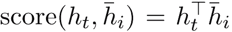

# 深度 | 从各种注意力机制窥探深度学习在 NLP 中的神威

选自 arXiv

**作者****：****Antoine J.-P. Tixier**

**机器之心编译**

**参与：思源**

> 随着层级表征的兴起，自然语言处理在很多方面都应用了深度神经网络。它们可以实现语言建模、情感分析、机器翻译、语义解析等非常多的任务，这些序列建模任务可以使用循环神经网络、卷积神经网络甚至近来比较流行的 Transformer。机器之心也介绍过[基于循环与卷积的序列建模方法](http://mp.weixin.qq.com/s?__biz=MzA3MzI4MjgzMw==&mid=2650740767&idx=1&sn=e66508400834c854478aa4fc2cb5d727&chksm=871adc61b06d5577f16aa8dd7adf6b6a7462e7fc1e7cb03a2bd9197e94b7566eb2cf8cdb82d0&scene=21#wechat_redirect)，而近日一篇综述文章进一步介绍了 NLP 中各种深度技术。由于很多基础知识读者可能已经比较熟悉了，因此本文只重点介绍该综述文章讨论的注意力机制。

综述文章地址：https://arxiv.org/abs/1808.09772

作者 Antoine Tixier 表示整篇综述笔记也是他学习过程的一部分，所以这一文章还会在 arXiv 上继续更新。为了完成整篇文章，作者主要借鉴了各种卷积神经网络的原论文、斯坦福 CS231n 课程笔记、 Zhang 和 Wallace 关于在 NLP 中运用 CNN 的实战指南、基于 CNN 的文本分类论文等，这些构建了该综述文章卷积神经网络部分的主体内容。

对于循环神经网络，作者参考了 Denny Britz 的 RNN 教程、Chris Colah 关于理解 LSTM 单元的技术博客、关于 GRU 单元的新颖论文、编码器-解码器架构和注意力机制方面的论文。最后，Yoav Golderg 的 NLP 神经网络入门和 Manning 关于神经机器翻译的教程也都非常有帮助。

作者在完成综述文章的同时，还根据 Keras 与 IMDB 数据集实现了很多模型算法，这些代码都能在作者的 GitHub 项目中找到。

项目地址：https://github.com/Tixierae/deep_learning_NLP

整个综述文章分为七章，我们仅会展示第七章的编码器解码器架构与注意力机制。其余关于卷积神经网络和循环神经网络的具体内容可查阅原文章，以下展示了整篇综述文章的目录：

**7 注意力机制**

注意力机制 [1] 是在编码器-解码器结构下用于神经机器翻译（NMT）[2, 24] 的一种结构，它已经非常快速地扩展到了其它相关任务，例如图像描述 [25] 和文本摘要 [21] 等。直观而言，注意力机制通过允许解码器在多个向量中关注它所需要的信息，从而使编码器避免了将输入嵌入为定长向量，因此能保留更多的信息 [1]。

如今，注意力机制在深度模型中已经非常普遍，它已经不再仅流行于编码器-解码器架构。尤其是一些注意力变体，它们仅作用于编码器而解决文本分类或表征学习等问题，这些变体适用于自注意力或内部注意力。

在本文中，我们会首先讨论编码器-解码器架构中的注意力机制，它们常用于神经机器翻译，随后本文会介绍自注意力与层级注意力等。

**7.1 编码器-解码器注意力机制**

7.1.1 编码器解码器架构

从概念上来说，如图 10 所示编码器希望将输入嵌入为一个向量，而解码器根据该向量生成一些输出。

*图 10：编码器-解码器架构概览。*

在神经机器翻译中，输入与输出都是由单词组成的序列，即 x=(x_1, ... , x_T) 和 y=(y_1, ... , y_T)，其中 x 和 y 通常表示原语句子与目标语句子。因为输入与输出都是序列，编码器-解码器架构也称为序列到序列的模型（Seq2Seq）。因为编码器-解码器架构处处可微，所以它们的参数θ可以根据平行语料库和最大似然估计同时得到优化，这种训练类型也称为端到端的训练。

如上所示，我们希望最大化的函数即正确翻译的对数概率。

7.1.2 编码器

原语句子可以通过 CNN 或全连接网络等某个模型编码为一个向量，机器翻译通常会选择 RNN 作为编码器。Bahdanau[1] 等人最开始使用双向深度 RNN 网络，该模型使用两条深度单向 RNN 构建模型，且方向相反的两条 RNN 不会共享参数。第一个前向 RNN 从左到右处理原语句子，而第二条反向的 RNN 由右到左处理原语句子。两个 RNN 编码的隐向量在每一个时间步都会拼接在一起，从而作为双向 RNN 的内部表征：

双向 RNN 在考虑整个句子所有信息的情况下再编码原语句子，它不会仅考虑当前时间步之前的单词。因此 h_t 偏向于利用以 x_t 为中心的小区间信息，而在单向 RNN 中，h_t 偏向于利用 x_t 的信息。关注 x_t 周围小区间的信息可能会产生一些优势，但并不是绝对性的。Luong et al. [20] 使用一般的单向深度 RNN 编码器同样获得了当前最优的模型性能。在下文中，编码器的隐藏状态将写为 h_t bar。

7.1.3 解码器

编码器可以使用不同的模型，而在 NMT 中，解码器通常会使用深度的单向 RNN，这主要因为单向 RNN 会比较自然地适应于序列生成任务。解码器的目标是在每一个时间步生成目标语中的一个词，直到读到停止词而完成整句话的输出。

解码器的关键思想是仅使用原语句子最后时间步编码的隐藏向量来生成目标语句子，这会强迫编码器拟合尽可能多的原语句子信息，并整合到最后的隐藏向量 h_T 中。因为 h_T 是一个定长的向量，因此表征能力十分有限，很多信息也会损失掉。另一方面，注意力机制允许解码器在每一个时间步考虑整个编码器的隐藏状态序列 (h_1, ... , h_T)，也就是说解码器在生成每一个目标语单词中能决定需要注意哪些编码向量。

更具体而言，目标语序列 y=(y_1, ... , y_T) 中每一个词 y_t 的生成都基于条件分布：

其中 h_t tilde 为注意的隐藏状态，它的计算表达式为：

h_t 为解码器的隐藏状态，当解码器是深度 RNN 时，h_t 就是编码器顶层的隐藏状态，它提供了前面所生成目标语词序列 {y_1, ... , y_(t-1)} 的信息。c_t 为原语的上下文向量，而「;」则表示了拼接操作。W_s 和 W_c 矩阵为可训练的参数，且该式子为了简化并没有展示偏置项。如下图 11 所示，上下文向量 c_t 能通过两种方式计算：全局和局部。本文在后面会讨论这两种方法。

*图 11：全局注意力（左）和局部注意力（右）。*

7.1.4 全局注意力

在全局注意力中，上下文向量 c_t 为整个原语序列隐藏状态 h_i bar 的加权和，即编码器所有时间步上隐藏状态的加权和。其中每一个隐藏状态向量的维度为编码器隐藏层的神经元数量，c_t 的维度与编码器的隐藏状态相等。校准向量α_t 的维度等于原语句子序列长度 T_x，所以它是一个变量。

校准向量（alignment vector）α_t 需要先对当前目标语隐藏状态 h_t 和所有原语隐藏状态 h_i bar 之间做校准运算（score()），然后再对运算结果应用 Softmax：

换而言之，α_t 为所有原语隐藏状态上的概率分布，即所有α_t 都在 0 和 1 之间，且加和为 1。α_t 表明原语句子中哪一个单词对预测目标语下一个单词最重要。score() 在理论上可以是任何对比函数，Luong et al. [20] 通过点乘试验该函数

，而更一般的公式是通过参数矩阵与全连接层确定

。他们发现点乘在全局注意力中有更好的效果，而全连接层在局部注意力中有更好的效果。全局注意力在图 12 中有所总结：

*图 12：全局注意力机制总结。*

7.1.5 局部注意力

每生成单个目标词都需要考虑原语句子的所有词在计算上是非常昂贵的，也不是必需的。为了减少这种问题，Luong et al. [20] 提出了一种仅关注固定窗口大小 2D+1 的局部注意力机制：

D 是开发者指定的超参数，位置 p_t 为窗口的中心，它可以设置为 t（单调性校准）或者由可微分机制确定（预测性校准），其中预测性校准基于前面生成的目标语单词信息 {y_1, ... , y_t-1}，即储存在 h_t 中的信息：

其中 T_x 为原语句子的长度、σ为 Sigmoid 函数、v_p 和 w_p 为可训练参数。校准权重的计算方式与全局注意力相同（公式 19），只是加了一个均值为 p_t、标准差为 D/2 的正态分布项：

注意

。增加的高斯分布项会确保校准权重会随着 i 远离窗口中心 p_t 而衰减，即它会认为窗口中心附近的词更重要。同样不同于全局注意力，α_t 的维度固定等于 2D+1，只有在窗口内的隐藏向量才会得到考虑。局部注意力其实也可以视为全局注意力，只不过校准权重会乘上一个截断的正态分布。下图 13 总结了局部注意力机制：

*图 13：局部注意力的总结，其带有预测性的校准机制。*

**7.2 自注意力**

现在假定单个 RNN 编码器采用序列 (x_1, ..., x_T) 作为输入，其长度为 T，该 RNN 会将输入序列映射到隐藏向量序列 (h_1, ..., h_T)。该模型的目标与编码器-解码器架构中的注意力机制一样：它不希望仅考虑最后一个隐藏向量 h_T 作为对整个序列的总结，这会引起输入信息的损失，它希望考虑所有时间步下的隐藏状态，并计算一个新的上下文向量。为了这个目标，2016/2017 年提出了自注意力或内部注意力机制。

如下公式 23 所示，隐藏向量 h_t 首先会传递到全连接层。然后校准系数 α_t 会对比全连接层的输出 u_t 和可训练上下文向量 u（随机初始化），并通过 Softmax 归一化而得出。注意力向量 s 最后可以为所有隐藏向量的加权和。

score 函数理论上可以是任意校准函数，一个比较直接的方式是使用点乘 score(u_t , u) =u_t*u。上下文向量可以解释为在平均上表征的最优单词。但模型面临新的样本时，它会使用这一知识以决定哪一个词需要更加注意。在训练中，模型会通过反向传播更新上下文向量，即它会调整内部表征以确定最优词是什么。

7.2.1 与 Seq2Seq 注意力的不同

自注意力中定义的上下文向量与 Seq2Seq 注意力中定义的上下文向量是不同的。在 Seq2Seq 中，上下文向量 c_t 等于加权和

，它用来计算需要注意的隐藏状态 h_t tilde = tanh(W_c [c_t; h_t]。在自注意力中，上下文向量用来替代解码器的隐藏状态，因为模型没有解码器。所以在自注意力中，校准向量 α 表示每一个输入单词与平均最优单词的相似性，而在 Seq2Seq 注意力中，α 表示每一个原语单词对生成下一个目标语单词的相关性。

7.2.2 层级注意力

图 14 展示了一个很好的案例，它表示自注意力机制为什么在实践中非常有用。在该架构中，自注意力机制共使用了两次：在词层面与在句子层面。该方法因为两个原因而非常重要，首先是它匹配文档的自然层级结构（词——句子——文档）。其次在计算文档编码的过程中，它允许模型首先确定哪些单词在句子中是非常重要的，然后再确定哪个句子在文档中是非常重要的。

*图 14:层级注意力架构。*

****本文为机器之心编译，**转载请联系本公众号获得授权****。**

✄------------------------------------------------

**加入机器之心（全职记者 / 实习生）：hr@jiqizhixin.com**

**投稿或寻求报道：**content**@jiqizhixin.com**

**广告 & 商务合作：bd@jiqizhixin.com**