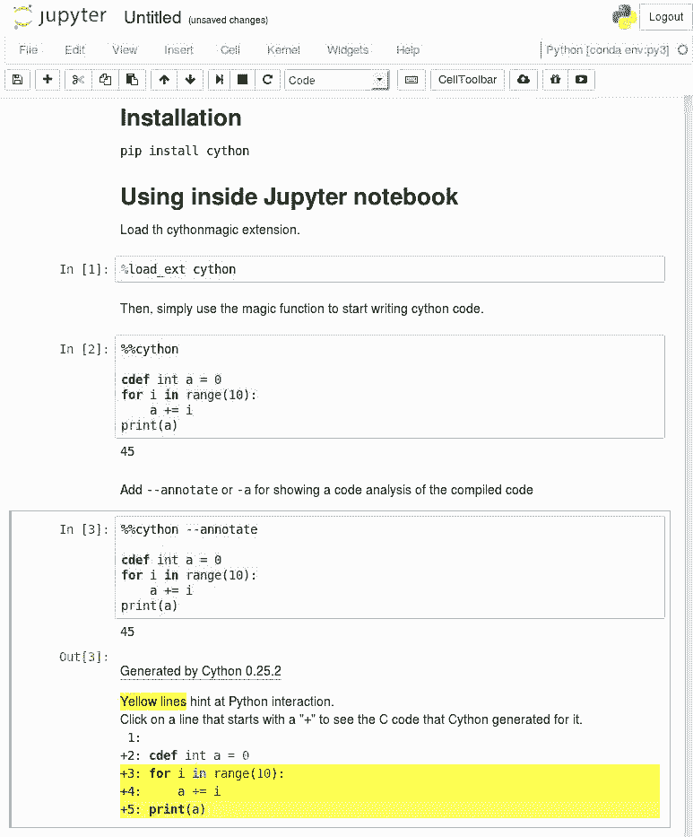
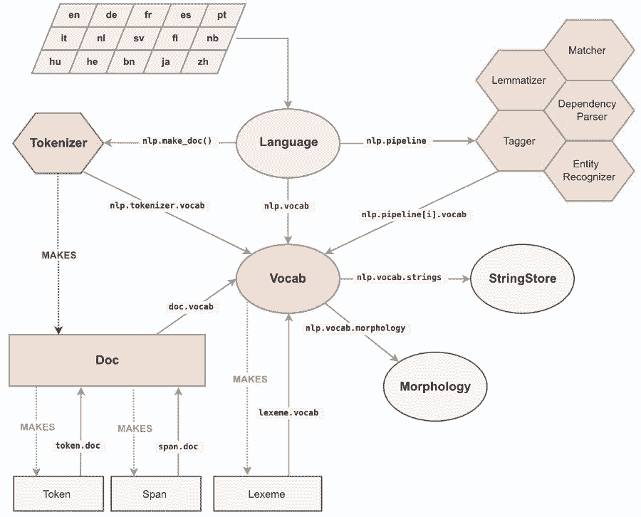

# 教程 | 比 Python 快 100 倍，利用 spaCy 和 Cython 实现高速 NLP 项目

选自 Medium

**作者****：Thomas Wolf**

**机器之心编译**

**参与：乾树、刘晓坤**

> Cython 是一个工具包，可以使你在 Python 中编译 C 语言，这就是为什么 numpy 和 pandas 很快的原因，Cython 就是 Python 的超集。在本文中，作者将为我们介绍他的 GitHub 项目 NeuralCoref v3.0，详解如何利用 spaCy 和 Cython 以约 100 倍于 Python 的速度实现 NLP 项目。


相关 Jupyter Notebook 地址：https://github.com/huggingface/100-times-faster-nlp

去年我们发布 Python 包 coreference resolution package 后，我们收到了来自社区的精彩反馈，并且人们开始在很多应用中使用它，其中一些与我们原来的对话用例迥异。

我们发现，尽管对话信息的处理速度非常好，但对于长的新闻文章来说，处理速度可能会非常慢。

我决定详细研究这一问题，最终成果即 NeuralCoref v3.0，它在相同准确率的情况下比老版本快 100 倍左右（每秒几千字），同时兼顾 Python 库的易用性和兼容性。

NeuralCoref v3.0 ：https://github.com/huggingface/neuralcoref/

我想在这篇文章中分享一些关于这个项目的经验，特别是：

*   如何用 Python 设计一个高速模块；

*   如何利用 spaCy 的内部数据结构来有效地设计超高速 NLP 函数。

所以我在这里有点作弊，因为我们会谈论 Python，但也谈论一些 Cython 的神奇作用。但是，你知道吗？Cython 是 Python 的超集，所以不要让它吓跑你！

你现在的 Python 程序已经是 Cython 程序。

有几种情况下你可能需要加速，例如：

*   你正在使用 Python 开发一个 NLP 的生产模块；

*   你正在使用 Python 计算分析大型 NLP 数据集；

*   你正在为深度学习框架，如 PyTorch / TensorFlow，预处理大型训练集，或者你的深度学习批处理加载器中的处理逻辑过于繁重，这会降低训练速度。

再强调一遍：我同步发布了一个 Jupyter Notebook，其中包含我在本文中讨论的例子。试试看！

Jupyter Notebook：https://github.com/huggingface/100-times-faster-nlp

**加速第一步：剖析**


首先要知道的是，你的大多数代码在纯 Python 环境中可能运行的不错，但是如果你多用点心，其中一些瓶颈函数可能让你的代码快上几个数量级。

因此，你首先应该分析你的 Python 代码并找出瓶颈部分的位置。使用如下的 cProfile 是一种选择：

```py
import cProfile
 import pstats
 import myslowmodule
 cProfile.run('myslowmodule.run()', 'restats')
 p = pstats.Stats('restats')
 p.sortstats('cumulative').printstats(30)
```

如果你使用神经网络，你可能会发现瓶颈部分是几个循环，并且涉及 Numpy 数组操作。

那么，我们如何加速这些循环代码？

**在 Python 中使用一些 Cython 加速循环**


让我们用一个简单的例子来分析这个问题。假设我们有一大堆矩形，并将它们存储进一个 Python 对象列表，例如 Rectangle 类的实例。我们的模块的主要工作是迭代这个列表，以便计算有多少矩形的面积大于特定的阈值。

我们的 Python 模块非常简单，如下所示：

```py
from random import random

class Rectangle:
 def __init__(self, w, h):
 self.w = w
 self.h = h
 def area(self):
 return self.w * self.h

def check_rectangles(rectangles, threshold):
 n_out = 0
 for rectangle in rectangles:
 if rectangle.area() > threshold:
 n_out += 1
 return n_out

def main():
 n_rectangles = 10000000
 rectangles = list(Rectangle(random(), random()) for i in range(n_rectangles))
 n_out = check_rectangles(rectangles, threshold=0.25)
 print(n_out) 
```

check_rectangles 函数是瓶颈部分！它对大量的 Python 对象进行循环，这可能会很慢，因为 Python 解释器在每次迭代时都会做大量工作（寻找类中的求面积方法、打包和解包参数、调用 Python API ...）。

Cython 将帮助我们加速循环。

Cython 语言是 Python 的超集，它包含两种对象：

*   Python 对象是我们在常规 Python 中操作的对象，如数字、字符串、列表、类实例...

*   Cython C 对象是 C 或 C ++ 对象，比如 double、int、float、struct、vectors。这些可以由 Cython 在超快速的底层代码中编译。

快速循环只是 Cython 程序（只能访问 Cython C 对象）中的一个循环。

设计这样一个循环的直接方法是定义 C 结构，它将包含我们在计算过程中需要的所有要素：在我们的例子中，就是矩形的长度和宽度。

然后，我们可以将矩形列表存储在这种结构的 C 数组中，并将这个数组传递给我们的 check_rectangle 函数。此函数现在接受一个 C 数组作为输入，因此通过 cdef 关键字而不是 def 将其定义为 Cython 函数（请注意，cdef 也用于定义 Cython C 对象）。

下面是我们的 Python 模块的快速 Cython 版：

```py
from cymem.cymem cimport Pool
from random import random

cdef struct Rectangle:
 float w
 float h

cdef int check_rectangles(Rectangle* rectangles, int n_rectangles, float threshold):
 cdef int n_out = 0
 # C arrays contain no size information => we need to give it explicitly
 for rectangle in rectangles[:n_rectangles]:
 if rectangles[i].w * rectangles[i].h > threshold:
 n_out += 1
 return n_out

def main():
 cdef:
 int n_rectangles = 10000000
 float threshold = 0.25
 Pool mem = Pool()
 Rectangle* rectangles = <Rectangle*>mem.alloc(n_rectangles, sizeof(Rectangle))
 for i in range(n_rectangles):
 rectangles[i].w = random()
 rectangles[i].h = random()
 n_out = check_rectangles(rectangles, n_rectangles, threshold)
 print(n_out)
```

我们在这里使用了原生 C 指针数组，但你也可以选择其他选项，特别是 C ++ 结构，如向量、对、队列等。在这个片段中，我还使用了 cymem 的便利的 Pool（）内存管理对象，以避免必须手动释放分配的 C 数组。当 Pool 由 Python 当做垃圾回收时，它会自动释放我们使用它分配的内存。

 spaCy API 的 Cython Conventions 是 Cython 在 NLP 中的实际运用的一个很好的参考。

spaCy：https://spacy.io

Cython Conventions：https://spacy.io/api/cython#conventions

**让我们试试这个代码吧！**

有很多方法可以测试、编译和发布 Cython 代码！Cython 甚至可以直接用在 Python 这样的 Jupyter Notebook 中。

Jupyter Notebook：http://cython.readthedocs.io/en/latest/src/reference/compilation.html#compiling-notebook

首先使用 pip install cython 安装 Cython



**在 Jupyter 的第一次测试**

使用 ％load_ext Cython 将 Cython 插件加载到 Jupyter notebook 中。

现在，你可以使用黑魔术命令 %% cython 编写像 Python 代码一样的 Cython 代码。

如果在执行 Cython 单元时遇到编译错误，请务必检查 Jupyter 终端输出以查看完整的信息。

大多数情况下，在 %% cython 编译为 C ++（例如，如果你使用 spaCy Cython API）或者 import numpy（如果编译器不支持 NumPy）之后，你会丢失 - + 标记。

正如我在开始时提到的，查看这篇文章的同步 Jupyter Notebook，该 Notebook 包含本文讨论的所有示例。

**编写、使用和发布 Cython 代码**

Cython 代码写在 .pyx 文件中。这些文件由 Cython 编译器编译为 C 或 C ++ 文件，然后通过系统的 C 编译器编译为字节码文件。Python 解释器可以使用字节码文件。

你可以使用 pyximport 直接在 Python 中加载 .pyx 文件：

```py
>>> import pyximport; pyximport.install()
>>> import my_cython_module
```

你还可以将你的 Cython 代码构建为 Python 包，并将其作为常规 Python 包导入/发布，详见下方地址。这可能需要一些时间才能开始工作，尤其在全平台上。如果你需要一个有效示例，spaCy』s install script 是一个相当全面的例子。

导入教程：http://cython.readthedocs.io/en/latest/src/tutorial/cython_tutorial.html#

Before we move to some NLP, let』s quickly talk about the def, cdef and cpdef keywords, because they are the main things you need to grab to start using Cython.

在我们转向 NLP 之前，让我们先快速讨论一下 def、cdef 和 cpdef 关键字，因为它们是你开始使用 Cython 需要掌握的主要内容。

你可以在 Cython 程序中使用三种类型的函数：

*   Python 函数，用常用的关键字 def 定义。它们可作为输入和输出的 Python 对象。也可以在内部同时使用 Python 和 C / C ++ 对象，并可以调用 Cython 和 Python 函数。

*   用 cdef 关键字定义的 Cython 函数。它们可以作为输入，在内部使用并输出 Python 和 C / C ++对象。这些函数不能从 Python 空间访问（即 Python 解释器和其他可导入 Cython 模块的纯 Python 模块），但可以由其他 Cython 模块导入。

*   用 cpdef 关键字定义的 Cython 函数就像 cdef 定义的 Cython 函数一样，但它们也提供了一个 Python 封装器，因此可以从 Python 空间（以 Python 对象作为输入和输出）以及其他 Cython 模块（以 C / C ++ 或 Python 对象作为输入）中调用它们。

cdef 关键字有另一种用途，即在代码中定义 Cython C / C ++ 对象。除非用这个关键字定义对象，否则它们将被视为 Python 对象（因此访问速度很慢）。

**使用 Cython 与 spaCy 来加速 NLP**

这些东西又好又快，但是...... 我们现在还没有融入 NLP！没有字符串操作、没有 unicode 编码，也没有我们在自然语言处理中幸运拥有的微妙联系。

官方的 Cython 文档甚至建议不要使用 C 字符串：

一般来说：除非你知道自己在做什么，否则应尽可能避免使用 C 字符串，而应使用 Python 字符串对象。

那么我们如何在使用字符串时在 Cython 中设计快速循环？

spaCy 会帮我们的。

spaCy 解决这个问题的方式非常聪明。

**将所有字符串转换为 64 位哈希码**

spaCy 中的所有 unicode 字符串（token 的文本、其小写文本、引理形式、POS 键标签、解析树依赖关系标签、命名实体标签...）都存储在叫 StringStore 的单数据结构中，它们在里面由 64 位散列索引，即 C uint64_t。

StringStore 对象实现了 Python unicode 字符串和 64 位哈希码之间的查找表。



它可以通过 spaCy 任意处及任意对象访问（请参阅上图），例如 nlp.vocab.strings、doc.vocab.strings 或 span.doc.vocab.string。

当某个模块需要对某些 token 执行快速处理时，仅使用 C 级别的 64 位哈希码而不是字符串。调用 StringStore 查找表将返回与哈希码相关联的 Python unicode 字符串。

但是，spaCy 做的远不止这些，它使我们能够访问文档和词汇表的完全覆盖的 C 结构，我们可以在 Cython 循环中使用这些结构，而不必自定义结构。

**spaCy 的内部数据结构**

与 spaCy Doc 对象关联的主要数据结构是 Doc 对象，该对象拥有已处理字符串的 token 序列（「单词」）以及 C 对象中的所有称为 doc.c 的标注，它是一个 TokenC 结构数组。

TokenC 结构包含我们需要的关于每个 token 的所有信息。这些信息以 64 位哈希码的形式存储，可以重新关联到 unicode 字符串，就像我们刚刚看到的那样。

要深入了解这些 C 结构中的内容，只需查看刚创建的 SpaCy 的 Cython API doc。

我们来看看一个简单的 NLP 处理示例。

**使用 spaCy 和 Cython 进行快速 NLP 处理**

假设我们有一个需要分析的文本数据集

```py
import urllib.request
import spacy

with urllib.request.urlopen('https://raw.githubusercontent.com/pytorch/examples/master/word_language_model/data/wikitext-2/valid.txt') as response:
text = response.read()
nlp = spacy.load('en')
doc_list = list(nlp(text[:800000].decode('utf8')) for i in range(10))
```

我在左边写了一个脚本，它生成用于 spaCy 解析的 10 份文档的列表，每个文档大约 170k 字。我们也可以生成每个文档 10 个单词的 170k 份文档（比如对话数据集），但创建速度较慢，因此我们坚持使用 10 份文档。

我们想要在这个数据集上执行一些 NLP 任务。例如，我们想要统计数据集中单词「run」作为名词的次数（即用 spaCy 标记为「NN」词性）。

一个简单明了的 Python 循环就可以做到：

```py
def slow_loop(doc_list, word, tag):
 n_out = 0
 for doc in doc_list:
 for tok in doc:
 if tok.lower_ == word and tok.tag_ == tag:
 n_out += 1
 return n_out

def main_nlp_slow(doc_list):
 n_out = slow_loop(doc_list, 'run', 'NN')
 print(n_out) 
```

但它也很慢！在我的笔记本电脑上，这段代码需要大约 1.4 秒才能得到结果。如果我们有一百万份文件，则需要一天以上才能给出结果。

我们可以使用多线程，但在 Python 中通常不是很好的解决方案，因为你必须处理 GIL。另外，请注意，Cython 也可以使用多线程！而且这实际上可能是 Cython 最棒的部分，因为 GIL 被释放，我们可以全速运行。Cython 基本上直接调用 OpenMP。

现在我们尝试使用 spaCy 和部分 Cython 加速我们的 Python 代码。

首先，我们必须考虑数据结构。我们将需要一个 C 数组用于数据集，指针指向每个文档的 TokenC 数组。我们还需要将我们使用的测试字符串（「run」和「NN」）转换为 64 位哈希码。

当我们所需的数据都在 C 对象中时，我们可以在数据集上以 C 的速度进行迭代。

下面是如何使用 spaCy 在 Cython 中编写的示例：

```py
%%cython -+
import numpy # Sometime we have a fail to import numpy compilation error if we don't import numpy
from cymem.cymem cimport Pool
from spacy.tokens.doc cimport Doc
from spacy.typedefs cimport hash_t
from spacy.structs cimport TokenC

cdef struct DocElement:
 TokenC* c
 int length

cdef int fast_loop(DocElement* docs, int n_docs, hash_t word, hash_t tag):
 cdef int n_out = 0
 for doc in docs[:n_docs]:
 for c in doc.c[:doc.length]:
 if c.lex.lower == word and c.tag == tag:
 n_out += 1
 return n_out

def main_nlp_fast(doc_list):
 cdef int i, n_out, n_docs = len(doc_list)
 cdef Pool mem = Pool()
 cdef DocElement* docs = <DocElement*>mem.alloc(n_docs, sizeof(DocElement))
 cdef Doc doc
 for i, doc in enumerate(doc_list): # Populate our database structure
 docs[i].c = doc.c
 docs[i].length = (<Doc>doc).length
 word_hash = doc.vocab.strings.add('run')
 tag_hash = doc.vocab.strings.add('NN')
 n_out = fast_loop(docs, n_docs, word_hash, tag_hash)
 print(n_out) 
```

代码有点长，因为我们必须在调用 Cython 函数之前在 main_nlp_fast 中声明并填充 C 结构。（如果你在代码中多次使用低级结构，使用 C 结构包装的 Cython 扩展类型来设计我们的 Python 代码是比每次填充 C 结构更优雅的选择。这就是大多数 spaCy 的结构，它是一种结合了快速，低内存以及与外部 Python 库和函数接口的简便性的非常优雅的方法。）

但它也快很多！在我的 Jupyter Notebook 中，这个 Cython 代码的运行时间大约为 20 毫秒，比我们的纯 Python 循环快大约 80 倍。

Jupyter Notebook cell 中编写的模块的绝对速度同样令人印象深刻，并且可以为其他 Python 模块和函数提供本地接口：在 30ms 内扫描约 1,700 万字意味着我们每秒处理高达 8000 万字。

我们这就结束了使用 Cython 进行 NLP 的快速介绍。我希望你喜欢它。

Cython 还有很多其他的东西可讲，但这会让我们远离主题。从现在开始，最好的地方可能就是 Cython tutorials 的概述和适用于 NLP 的 spaCy’s Cython page。

原文链接：https://medium.com/huggingface/100-times-faster-natural-language-processing-in-python-ee32033bdced

****本文为机器之心编译，**转载请联系本公众号获得授权****。**

✄------------------------------------------------

**加入机器之心（全职记者 / 实习生）：hr@jiqizhixin.com**

**投稿或寻求报道：**content**@jiqizhixin.com**

**广告 & 商务合作：bd@jiqizhixin.com**