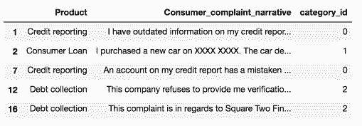
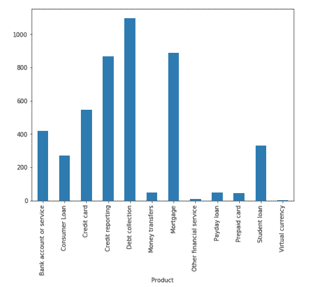
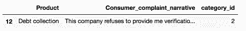
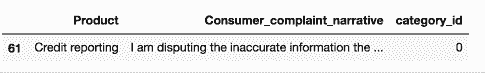
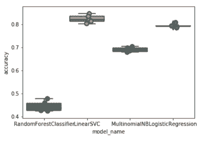
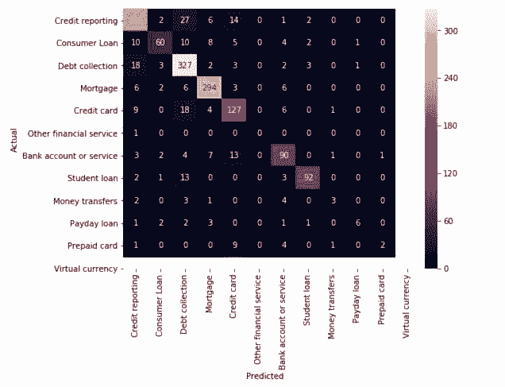
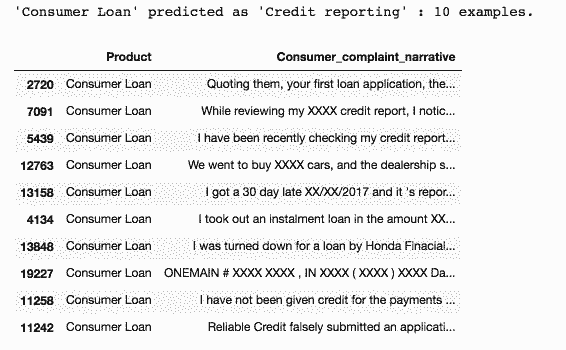
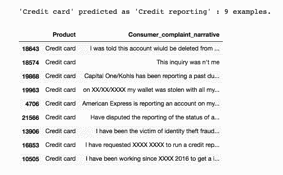
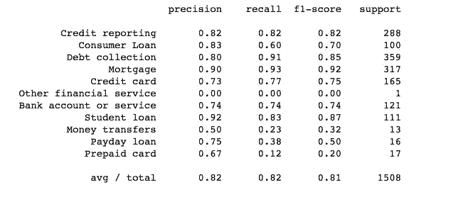

# 教程 | 如何通过 Scikit-Learn 实现多类别文本分类？

选自 towardsdatascience

**作者：****Susan Li**

**机器之心编译**

**参与：程耀彤、黄小天**

> 互联网的绝大多数的文本分类都是二进制的，本文要解决的问题更为复杂。作者使用 Python 和 Jupyter Notebook 开发系统，并借助 Scikit-Learn 实现了消费者金融投诉的 12 个预定义分类。本项目的 GitHub 地址见文中。

GitHub 地址：https://github.com/susanli2016/Machine-Learning-with-Python/blob/master/Consumer_complaints.ipynb

商业活动中有很多文本分类应用。例如，新闻报道通常是按照主题进行构架；内容或产品通常是根据类别添加标签；可以根据用户如何在线讨论某个产品或品牌将其分为多个群组......

然而，互联网上绝大多数的文本分类文章和教程都是二进制文本分类，比如垃圾邮件过滤，情感分析。大多数情况下，现实世界的问题更为复杂。因此，这就是我们今天要做的事情：将消费者的金融投诉分为 12 个预定义的类别。

我们使用 Python 和 Jupyter Notebook 开发系统，机器学习方面则借助 Scikit-Learn。如果你想要 PySpark 实现，请阅读下篇文章。

**问题表述**

该问题是监督式文本分类问题，我们的目标是调查哪种监督式机器学习方法最适合解决它。

当出现新投诉时，我们希望将其分配到 12 个类别中的一个。分类器假设每个新投诉都被分配到一个且仅一个的类别之中。这是多类别文本分类问题。我迫不及待想看到我们能实现什么！

**数据探索**

在深入训练机器学习模型之前，我们首先应该看一些实例，以及每个类别的投诉数量：

```py
import pandas as pd
df = pd.read_csv('Consumer_Complaints.csv')
df.head()
```


对于这个项目，我们只需要两栏——「产品」和「消费者投诉叙述」。

**输入： Consumer_complaint_narrative**

实例：「我的信用报告中有过时的信息，我以前有争议的是这些信息已超过七年未被删除，并且不符合信用报告的要求」

**输出：product**

实例：信用报告

我们将删除「消费者投诉叙述」栏中的缺失值，并添加一列来将产品编码为整数，因为分类变量通常用整数表示比用字符串更好。

我们还创建了几个字典供将来使用。

清理完成后，这是我们将要处理的前五行数据：

```py
from io import StringIO
col = ['Product', 'Consumer complaint narrative']
df = df[col]
df = df[pd.notnull(df['Consumer complaint narrative'])]
df.columns = ['Product', 'Consumer_complaint_narrative']
df['category_id'] = df['Product'].factorize()[0]
category_id_df = df[['Product', 'category_id']].drop_duplicates().sort_values('category_id')
category_to_id = dict(category_id_df.values)
id_to_category = dict(category_id_df[['category_id', 'Product']].values)
df.head()
```



**不平衡类**

我们看到每件产品的投诉数量不平衡。消费者的投诉更集中于收取欠款、信用报告和抵押方面。

```py
import matplotlib.pyplot as plt
fig = plt.figure(figsize=(8,6))
df.groupby('Product').Consumer_complaint_narrative.count().plot.bar(ylim=0)
plt.show() 
```



当我们遇到这样的问题时，我们使用标准算法解决这些问题必然会遇到困难。常规算法往往偏向于多数类别，而不考虑数据分布。在最糟糕的情况下，少数类别被视为异常值并被忽略。对于某些情况，如欺诈检测或癌症预测，我们则需要仔细配置我们的模型或人为地平衡数据集，比如欠采样或过采样每个类别。

但是，在学习不平衡数据的情况下，我们最感兴趣的是多数类。我们想有一个分类器，能够对多数类提供较高的预测精度，同时对少数类保持合理的准确度。因此我们会保持原样。

**文本表达**

分类器和学习算法不能直接处理原始形式的文本文档，因为它们大多数都期望大小固定的数字特征向量而不是具有可变长度的原始文本文档。因此，在预处理步骤中，文本被转换为更易于管理的表达。

从文本中提取特征的一种常见方法是使用词袋模型：对于每个文档，我们案例中的投诉叙述、单词的出现（通常是频率）被考虑在内，而它们出现顺序则被忽略。

具体来说，对于我们数据集中的每一项，我们将计算一种被称为词频、反向文档频率的值，其缩写为 tf-idf。我们将使用 sklearn.feature_extraction.text.TfidfVectorizer 为每个消费者投诉叙述计算一个 tf-idf 向量。

*   sublinear_df 设为 True 从而使用频率的对数形式。

*   min_df 是单词必须存在的最小文档数量。

*   norm 设为 l2，以确保我们所有特征向量的欧几里德范数为 1。

*   ngram_range 设为 (1, 2)，表示我们想要考虑 unigrams 和 bigrams。

*   stop_words 设为 "english" 来删除所有常用代词 ("a", "the", ...) 以减少噪音特征的数量。

```py
from sklearn.feature_extraction.text import TfidfVectorizer
tfidf = TfidfVectorizer(sublinear_tf=True, min_df=5, norm='l2', encoding='latin-1', ngram_range=(1, 2), stop_words='english')
features = tfidf.fit_transform(df.Consumer_complaint_narrative).toarray()
labels = df.category_id
features.shape 
```

(4569, 12633)

现在，4569 个消费者投诉描述中的每一个由 12633 个特征表达，代表不同的 unigrams 和 bigrams 的 tf-idf 分数。

我们可以使用 sklearn.feature_selection.chi2 来查找与每个产品最相关的项：

```py
from sklearn.feature_selection import chi2
import numpy as np
N = 2
for Product, category_id in sorted(category_to_id.items()):
 features_chi2 = chi2(features, labels == category_id)
 indices = np.argsort(features_chi2[0])
 feature_names = np.array(tfidf.get_feature_names())[indices]
 unigrams = [v for v in feature_names if len(v.split(' ')) == 1]
 bigrams = [v for v in feature_names if len(v.split(' ')) == 2]
 print("# '{}':".format(Product))
 print(" . Most correlated unigrams:\n. {}".format('\n. '.join(unigrams[-N:])))
 print(" . Most correlated bigrams:\n. {}".format('\n. '.join(bigrams[-N:])))
```

# 『银行账户或服务』:

 . 最相关的 unigrams:

 . 银行

 . 透支

 . 最相关的 bigrams:

 . 透支费

 . 支票账户

 # 『消费者贷款』:

 . 最相关的 unigrams:

 . 车

 . 交通工具

 . 最相关的 bigrams:

 . 交通工具 xxxx

 . 丰田金融

 # 『信用卡』:

 . 最相关的 unigrams:

 . 花旗

 . 卡

 . 最相关的 bigrams:

 . 年费

 . 信用卡

 # 『信用报告』:

 . 最相关的 unigrams:

 . 益百利

 . equifax

 . 最相关的 bigrams:

 . 全联公司

 . 信用报告

 # 『讨回欠款』:

 . 最相关的 unigrams:

 . 收集

 . 债务

 . 最相关的 bigrams:

 . 讨回全款

 . 讨债公司

 # 『汇款』:

 . 最相关的 unigrams:

 . wu

 . paypal

 . 最相关的 bigrams:

 . 西联汇款

 . 汇款

 # 『抵押』:

 . 最相关的 unigrams:

 . 修正

 . 抵押

 . 最相关的 bigrams:

 . 抵押公司

 . 贷款修改

 # 『其他金融服务』:

 . 最相关的 unigrams:

 . 牙齿

 . 护照

 . 最相关的 bigrams:

 . 帮助支付

 . 规定支付

 # 『发薪日贷款』:

 . 最相关的 unigrams:

 . 借款

 . 发薪日

 . 最相关的 bigrams:

 . 大图片

 . 发薪日贷款

 # 『预付卡』:

 . 最相关的 unigrams:

 . 服务

 . 充值

 . 最相关的 bigrams:

 . 获得资金

 . 预付卡

 # 『学生贷款』:

 . 最相关的 unigrams:

 . 学生

 . navient

 . 最相关的 bigrams:

 . student loans

 . student loan

 # 『虚拟货币』:

 . 最相关的 unigrams:

 . 手柄

 . https

 . 最相关的 bigrams:

 . xxxx 提供者

 . 想要钱 

它们都有道理，难道不是吗？

**多类别分类器：特征和设计**

*   为了训练监督式分类器，我们首先将「消费者投诉叙述」转化为数字向量。我们研究了向量表示，例如 TF-IDF 加权向量。

*   有了这个向量表达的文本后，我们可以训练监督式分类器来训练看不到的「消费者投诉叙述」并预测它们的「产品」。

在完成上述数据转换之后，现在我们拥有所有的特征和，是时候训练分类器了。我们可以使用很多算法来解决这类问题。

*   朴素贝叶斯分类器：最适合字数统计的是多项式变体：

```py
from sklearn.model_selection import train_test_split
from sklearn.feature_extraction.text import CountVectorizer
from sklearn.feature_extraction.text import TfidfTransformer
from sklearn.naive_bayes import MultinomialNB
X_train, X_test, y_train, y_test = train_test_split(df['Consumer_complaint_narrative'], df['Product'], random_state = 0)
count_vect = CountVectorizer()
X_train_counts = count_vect.fit_transform(X_train)
tfidf_transformer = TfidfTransformer()
X_train_tfidf = tfidf_transformer.fit_transform(X_train_counts)
clf = MultinomialNB().fit(X_train_tfidf, y_train)
```

在拟合好训练集后，让我们做一些预测。

```py
print(clf.predict(count_vect.transform(["This company refuses to provide me verification and validation of debt per my right under the FDCPA. I do not believe this debt is mine."]))) 
```

「『收回欠款』」

```py
df[df['Consumer_complaint_narrative'] == "This company refuses to provide me verification and validation of debt per my right under the FDCPA. I do not believe this debt is mine."]
```



```py
print(clf.predict(count_vect.transform(["I am disputing the inaccurate information the Chex-Systems has on my credit report. I initially submitted a police report on XXXX/XXXX/16 and Chex Systems only deleted the items that I mentioned in the letter and not all the items that were actually listed on the police report. In other words they wanted me to say word for word to them what items were fraudulent. The total disregard of the police report and what accounts that it states that are fraudulent. If they just had paid a little closer attention to the police report I would not been in this position now and they would n't have to research once again. I would like the reported information to be removed : XXXX XXXX XXXX"]))) 
```

「『信用报告』」

```py
df[df['Consumer_complaint_narrative'] == "I am disputing the inaccurate information the Chex-Systems has on my credit report. I initially submitted a police report on XXXX/XXXX/16 and Chex Systems only deleted the items that I mentioned in the letter and not all the items that were actually listed on the police report. In other words they wanted me to say word for word to them what items were fraudulent. The total disregard of the police report and what accounts that it states that are fraudulent. If they just had paid a little closer attention to the police report I would not been in this position now and they would n't have to research once again. I would like the reported information to be removed : XXXX XXXX XXXX"] 
```



不是太寒酸！

**模型选择**

我们现在准备尝试不同的机器学习模型，评估它们的准确性并找出潜在问题的根源。

我们将对以下四种模型进行基准测试：

*   Logistic 回归

*   （多项式）朴素贝叶斯

*   线性支持向量机

*   随机森林

```py
from sklearn.linear_model import LogisticRegression
from sklearn.ensemble import RandomForestClassifier
from sklearn.svm import LinearSVC
from sklearn.model_selection import cross_val_score
models = [
 RandomForestClassifier(n_estimators=200, max_depth=3, random_state=0),
 LinearSVC(),
 MultinomialNB(),
 LogisticRegression(random_state=0),
]
CV = 5
cv_df = pd.DataFrame(index=range(CV * len(models)))
entries = []
for model in models:
 model_name = model.__class__.__name__
 accuracies = cross_val_score(model, features, labels, scoring='accuracy', cv=CV)
 for fold_idx, accuracy in enumerate(accuracies):
 entries.append((model_name, fold_idx, accuracy))
cv_df = pd.DataFrame(entries, columns=['model_name', 'fold_idx', 'accuracy'])
import seaborn as sns
sns.boxplot(x='model_name', y='accuracy', data=cv_df)
sns.stripplot(x='model_name', y='accuracy', data=cv_df, 
 size=8, jitter=True, edgecolor="gray", linewidth=2)
plt.show() 
```



```py
cv_df.groupby('model_name').accuracy.mean() 
```

模型名称

*   线性支持向量机：0.822890

*   Logistic 回归：0.792927

*   （多项式）朴素贝叶斯：0.688519

*   随机森林：0.443826

名称：精确度，dtype：float64

线性支持向量机和 Logistic 回归比其他两个分类器执行的更好，前者具有轻微的优势，其中位精度约为 82%。

**模型评估**

继续使用我们的最佳模型（LinearSVC），我们将查看混淆矩阵，并展示预测标签和实际标签之间的差异。

```py
model = LinearSVC()
X_train, X_test, y_train, y_test, indices_train, indices_test = train_test_split(features, labels, df.index, test_size=0.33, random_state=0)
model.fit(X_train, y_train)
y_pred = model.predict(X_test)
from sklearn.metrics import confusion_matrix
conf_mat = confusion_matrix(y_test, y_pred)
fig, ax = plt.subplots(figsize=(10,10))
sns.heatmap(conf_mat, annot=True, fmt='d',
 xticklabels=category_id_df.Product.values, yticklabels=category_id_df.Product.values)
plt.ylabel('Actual')
plt.xlabel('Predicted')
plt.show() 
```



正如我们所希望的，绝大多数预测都在对角线结束（预测标签=实际标签）。然而，仍然存在大量错误分类，看看这些是由什么造成的可能很有趣：

```py
from IPython.display import display
for predicted in category_id_df.category_id:
 for actual in category_id_df.category_id:
 if predicted != actual and conf_mat[actual, predicted] >= 10:
 print("'{}' predicted as '{}' : {} examples.".format(id_to_category[actual], id_to_category[predicted], conf_mat[actual, predicted]))
 display(df.loc[indices_test[(y_test == actual) & (y_pred == predicted)]][['Product', 'Consumer_complaint_narrative']])
 print('') 
```





如你所见，一些错误分类的投诉涉及多个主题（比如涉及信用卡和信用报告的投诉）。这种错误总是发生。

再次，我们使用卡方检验来找到与每个类别最相关的项：

```py
model.fit(features, labels)
N = 2
for Product, category_id in sorted(category_to_id.items()):
 indices = np.argsort(model.coef_[category_id])
 feature_names = np.array(tfidf.get_feature_names())[indices]
 unigrams = [v for v in reversed(feature_names) if len(v.split(' ')) == 1][:N]
 bigrams = [v for v in reversed(feature_names) if len(v.split(' ')) == 2][:N]
 print("# '{}':".format(Product))
 print(" . Top unigrams:\n . {}".format('\n . '.join(unigrams)))
 print(" . Top bigrams:\n . {}".format('\n . '.join(bigrams))) 
```

# 『银行账户或服务』:

 . 最高的 unigrams:

 . 银行

 . 账户

 . 最高的 bigrams:

 . 借记卡

 . 透支费用

# 『消费者贷款』:

 . 最高的 unigrams:

 . 交通工具

 . 车

 . 最高的 bigrams:

 . 个人贷款

 . 历史 xxxx

# 『信用卡』:

 . 最高的 unigrams:

 . 卡

 . 发现

 . 最高的 bigrams:

 . 信用卡

 . 发现卡

# 『信用报告』:

 . 最高的 unigrams:

 . equifax

 . 全联公司

 . 最高的 bigrams:

 . xxxx 账户

 . 全联公司

# 『讨回欠款』:

 . 最高的 unigrams:

 . 债务

 . 收集

 . 最高的 bigrams:

 . 账户信用

 . 时间提供

# 『汇款』:

 . 最高的 unigrams:

 . paypal

 . 汇款

 . 最高的 bigrams:

 . 汇款

 . 寄钱

# 『抵押』:

 . 最高的 unigrams:

 . 抵押

 . 国际支付宝

 . 最高的 bigrams:

 . 贷款修改

 . 抵押公司

# 『其他金融服务』:

 . 最高的 unigrams:

 . 护照

 . 牙齿

 . 最高的 bigrams:

 . 规定支付

 . 帮助支付

# 『发薪日贷款』:

 . 最高的 unigrams:

 . 发薪日

 . 贷款

 . 最高的 bigrams:

 . 发薪日贷款

 . 发薪日

# 『预付卡』:

 . 最高的 unigrams:

 . 充值

 . 服务

 . 最高的 bigrams:

 . 预付卡

 . 使用卡

# 『学生贷款』:

 . 最高的 unigrams:

 . navient

 . 贷款

 . 最高的 bigrams:

 . 学生贷款

 . sallie mae

# 『虚拟货币』:

 . 最高的 unigrams:

 . https

 . tx

 . 最高的 bigrams:

 . 想要钱

 . xxxx 提供者

它们符合我们的预期。

最后，我们打印出每个类的分类报告：

```py
from sklearn import metrics
print(metrics.classification_report(y_test, y_pred, target_names=df['Product'].unique()))
```



*原文链接：https://towardsdatascience.com/multi-class-text-classification-with-scikit-learn-12f1e60e0a9f*

****本文为机器之心编译，**转载请联系本公众号获得授权****。**

✄------------------------------------------------

**加入机器之心（全职记者/实习生）：hr@jiqizhixin.com**

**投稿或寻求报道：editor@jiqizhixin.com**

**广告&商务合作：bd@jiqizhixin.com**