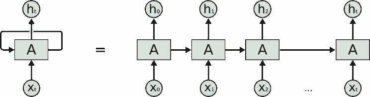
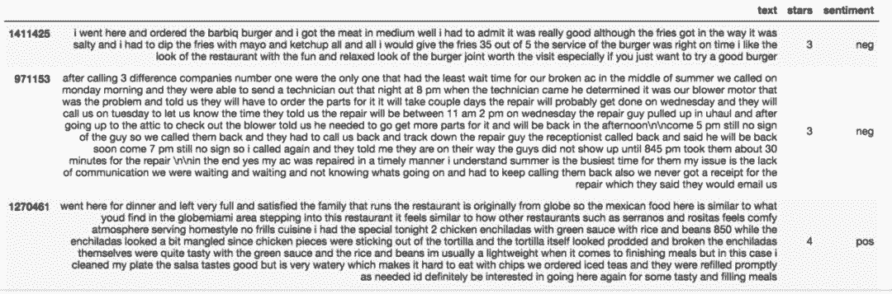
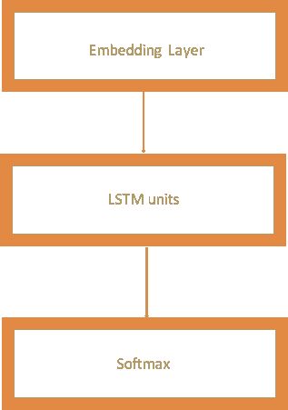
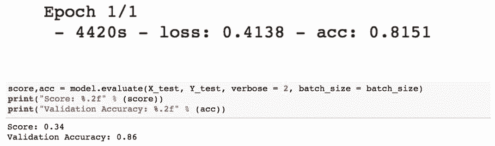

# 教程 | 如何使用 LSTM 在 Keras 中快速实现情感分析任务

选自 TowardsDataScience

**作者：Nimesh Sinha**

**机器之心编译**

**参与：Nurhachu Null、路雪**

> 本文对 LSTM 进行了简单介绍，并讲述了如何使用 LSTM 在 Keras 中快速实现情感分析任务。

长短期记忆网络通常被称为 LSTM，它是由 Hochreiter 和 Schmiduber 提出的，被广泛地应用在语音识别、语言建模、情感分析和文本预测中。在深入 LSTM 之前，我们首先应该理解对 LSTM 的需求，这个可以通过 RNN 在实际应用中的缺陷来解释。所以我们就从 RNN 开始吧。

**循环神经网络（RNN）**

我们人类在看电影的时候，理解任何事件的时候每次都不是从零开始的，我们会从电影中最近发生的事中学习。但是，传统的神经网络是无法从之前的事件中学习的，因为这些信息没有从一步传递到下一步。相反，RNN 从与之紧接的前一步中学习。

例如，电影中有这么一幕：一个人在篮球场。那么我们会在未来的画面中即兴联想篮球活动：有人在奔跑、跳跃很可能被打上打篮球的标签，而一个人坐着观看很可能是观众在观看球赛。


*典型 RNN（图源：http://colah.github.io/posts/2015-08-Understanding-LSTMs/）*



常见的 RNN 如上所示：其中 X(t) 是输入，h(t) 是输出，A 是一个在循环中从前一步获得信息的神经网络。一个单元的输出被传送到下一个单元，信息也被传递了。

但是，有时候我们需要网络不仅仅能够从最近的过去信息中学习。假设我们要预测下面这句话中空格里面的内容：「David，一个 36 岁的男子，住在旧金山。他有一位女性朋友 Maria。Maria 在纽约一家著名的餐馆当厨师，最近他在一次校友会上遇到了他。玛丽亚告诉他，她总是对 _ _ 有热情」。这里，我们希望网络能够从「厨师」（cook）中学习，预测出「烹饪」（cooking）一词。然而我们期望预测的内容和期望被预测的位置之间存在距离，这被称作长期依赖。任何比三元语法更大的东西我们都称之为长期依赖。不幸的是，RNN 在这种情况下并不会成功。

**为什么 RNN 在实际中并不会成功？**

在训练 RNN 的过程中，信息在循环中一次又一次的传递会导致神经网络模型的权重发生很大的更新。这是因为每次更新中的误差梯度都会积累起来，因此会导致一个不稳定的网络。在极端情况下，权值可能会变得过大以至于溢出并形成一个非数值（NaN)。网络层之间的梯度（值大于 1）重复相乘导致梯度爆炸，而小于 1 的梯度重复相乘会造成梯度消失。

**长短期记忆**

上面提到的 RNN 的缺陷促使科学家发明了一种 RNN 模型的新变体，它就是长短期记忆（LSTM）。LSTM 可以解决这个问题，因为它使用了门机制来控制记忆过程。

让我们来理解 LSTM 的结结构，并将它与 RNN 进行对比：


*LSTM 单元（图源：http://colah.github.io/posts/2015-08-Understanding-LSTMs/）*

图中使用的符号含义如下：

a) X：信息

b) +：增加信息

c) σ：Sigmoid 层

d) tanh：tanh 层

e) h(t-1)：上一个 LSTM 单元的输出

f) c(t-1)：上一个 LSTM 单元的记忆

g) X(t)：当前输入

h) c(t)：新更新的记忆

i) h(t)：当前输出

**为什么使用 tanh？**

为了克服梯度消失问题，我们需要一个二阶导数在到达 0 之前能够持续很长范围的函数。tanh 函数就是满足这一属性的合适函数。

**为什么使用 Sigmoid？**

Sigmoid 可以输出 0 或 1，因此它可用来遗忘或者记住信息。

信息通过很多此类 LSTM 单元传递。LSTM 有三个主要组成部分，正如上图中所标记出来的：

1.  LSTM 具备一种特殊的结构，能够让网络忘记不必要的信息。Sigmoid 层以 X(t) 和 h(t-1) 为输入，并且决定旧输出的哪一部分应该被删除（通过输出 0）。在我们的例子中，当输入是「他有一位女性朋友 Maria」时，「David」的性别可以被忘记了，因为这里的主语已经变成「Maria」了。这个门被称作「遗忘门」f(t)。遗忘门的输出是 f(t)*c(t-1)。

2.  下一步就是利用 cell 状态的新输入 X(t) 做决策并存储信息。Sigmoid 层决定哪个新信息应该被更新或者被忽略。tanh 层从新输入中创建一个新向量，向量的值是所有可能的值。然后这两个值相乘来更新新的 cell 状态。然后这个新记忆和旧的记忆 c(t-1) 加起来得到 c(t)。在我们的例子中，对于新的输入「他有一位女性朋友 Maria」，Maria 的性别就会被更新。当输入是「Maria 在纽约一家著名餐厅当厨师，最近他在一次校友会上遇到了她」（Maria works as a cook in a famous restaurant in New York whom he met recently in a school alumni meet）时，像「famous」、「school alumni meet」这些词可以被忽略，而「cooking」、「restaurant」以及「New York」这样的词将被更新。

3.  最后，我们需要决定输出什么。sigmoid 层决定了我们要输出 cell 状态的哪一部分。然后，我们使 cell 状态通过 tanh 层来生成所有可能的值，并将它与 sigmoid 门的输出相乘，所以我们只输出想要输出的部分。在我们的例子中，我们想要预测空格中的单词，模型可以从记忆中得知它是一个与「cook」相关的词，因此它就可以很容易地回答这个词是「cooking」。我们的模型不是从瞬时依赖中学习这个答案，而是从长期依赖中学到的。

我们可以看到，经典 RNN 和 LSTM 的结构存在很大的差异。在 LSTM 中，我们的模型学会了在长期记忆中保存哪些信息，丢掉哪些信息。

**使用 LSTM 进行情感分析的快速实现**

这里，我在 Yelp 开放数据集（https://www.yelp.com/dataset）上使用 Keras 和 LSTM 执行情感分析任务。

下面是数据示例。



*数据集*

我使用 Tokenizer 将文本进行向量化，在限制 Tokenizer 仅仅使用前 2500 个常用词之后，把文本转换成整数序列。我使用 pad_sequences 将生成的整数序列转换成 2 维的 numpy 数组。

```py
1.  `#I have considered a rating above 3 as positive and less than or equal to 3 as negative.`

2.  `data['sentiment'] = ['pos' if (x>3) else 'neg' for x in data['stars']]`

3.  `data['text'] = data['text'].apply((lambda x: re.sub('[^a-zA-z0-9\s]','',x)))`

4.  `for idx,row in data.iterrows():`

5.  `row[0] = row[0].replace('rt',' ')`

6.  `data['text'] = [x.encode('ascii') for x in data['text']]`

 `*   `tokenizer = Tokenizer(nb_words=2500, lower=True,split=' ')`

*   `tokenizer.fit_on_texts(data['text'].values)`

*   `#print(tokenizer.word_index)  # To see the dicstionary`

*   `X = tokenizer.texts_to_sequences(data['text'].values)`

*   `X = pad_sequences(X)`` 
```

 `接下来，我构建自己的 LSTM 网络，该网络具备以下超参数：

1\. embed_dim：嵌入层把输入序列编码成维度为 embed_dim 的密集向量序列。

2\. lstm_out：LSTM 网络将向量序列转换成一个 lstm_out 向量，它包含整个序列的信息。

其他超参数和卷积神经网络类似，例如 dropout、batch_size。

我使用 softmax 作为激活函数。



*LSTM 网络*

```py
1.  `embed_dim = 128`

2.  `lstm_out = 200`

3.  `batch_size = 32`

 `*   `model = Sequential()`

*   `model.add(Embedding(2500, embed_dim,input_length = X.shape[1], dropout = 0.2))`

*   `model.add(LSTM(lstm_out, dropout_U = 0.2, dropout_W = 0.2))`

*   `model.add(Dense(2,activation='softmax'))`

*   `model.compile(loss = 'categorical_crossentropy', optimizer='adam',metrics = ['accuracy'])`

*   `print(model.summary())`` 
```

 `

现在，我在训练集上训练我的模型，然后在验证集上检验准确率。

```py
1.  `Y = pd.get_dummies(data['sentiment']).values`

2.  `X_train, X_valid, Y_train, Y_valid = train_test_split(X,Y, test_size = 0.20, random_state = 36)`

 `*   `#Here we train the Network.`

 `*   `model.fit(X_train, Y_train, batch_size =batch_size, nb_epoch = 1,  verbose = 5)``` 
```py

 ``

在仅仅 1 个 epoch 之后，我就得到了 86% 的准确率，而这只是在一个小型数据集（包括所有行业）上运行。

**下一步的工作：**

1\. 我们可以过滤特定的行业（如餐厅），并使用 LSTM 做情感分析。

2\. 我们可以使用更大的数据集和更多的 epoch，来得到更高的准确率。

3\. 我们可以使用更多隐藏密集层来提升准确率。我们也可以调整其他的超参数。

**结论**

当我们期望模型能够从长期依赖中学习的时候，LSTM 优于其他模型。LSTM 遗忘、记忆和更新信息的能力使得它领先 RNN 一步。 

**参考资料和有用的资源**

*   我的 GitHub repo：https://github.com/nsinha280/lstm-on-Yelp-review-data

*   理解 LSTM：http://colah.github.io/posts/2015-08-Understanding-LSTMs/

*   RNN 和 LSTM 新手指引：https://deeplearning4j.org/lstm.html

*   探索 LSTM：http://blog.echen.me/2017/05/30/exploring-lstms/

*   关于 LSTM 的研究论文：http://www.bioinf.jku.at/publications/older/2604.pdf

*原文链接：**https://towardsdatascience.com/understanding-lstm-and-its-quick-implementation-in-keras-for-sentiment-analysis-af410fd85b47*

 ******本文为机器之心编译，**转载请联系本公众号获得授权****。**

✄------------------------------------------------

**加入机器之心（全职记者/实习生）：hr@jiqizhixin.com**

**投稿或寻求报道：editor@jiqizhixin.com**

**广告&商务合作：bd@jiqizhixin.com****````