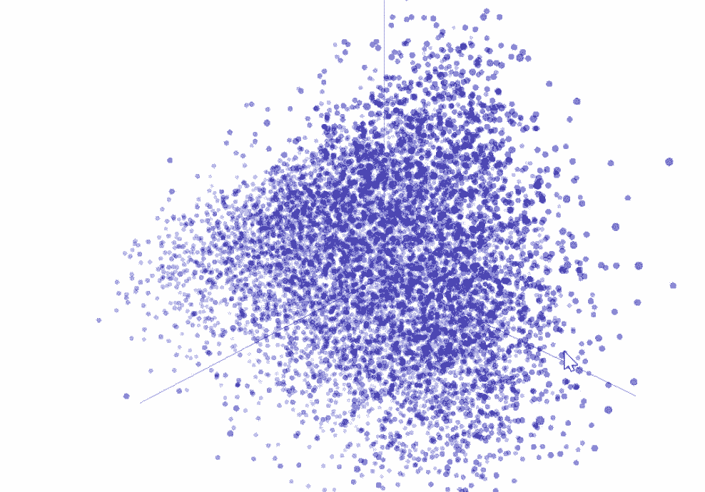
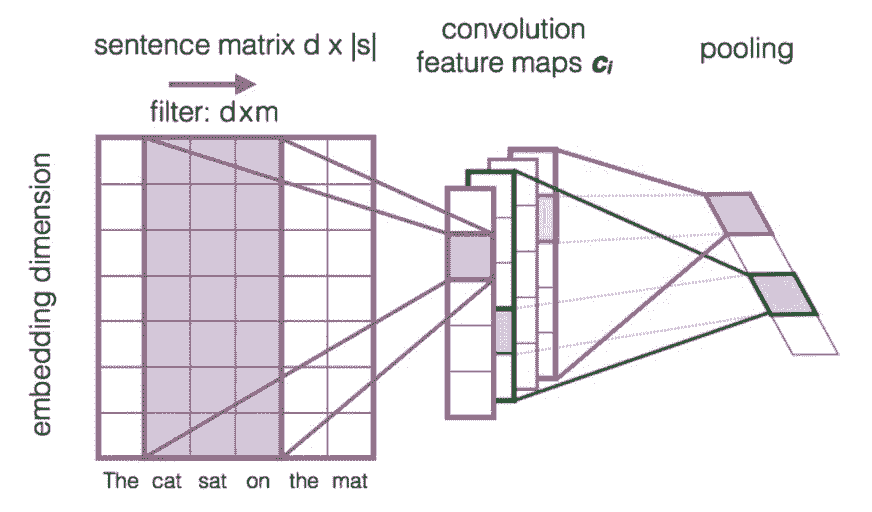
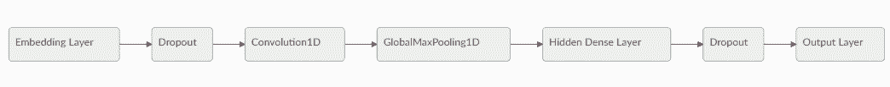
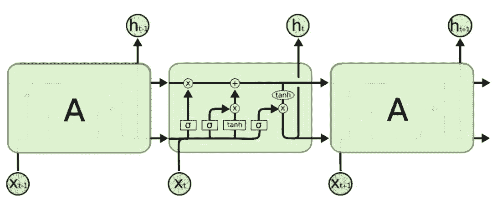
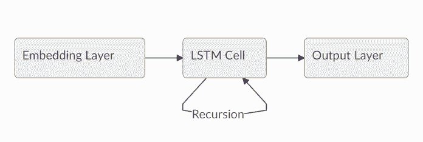
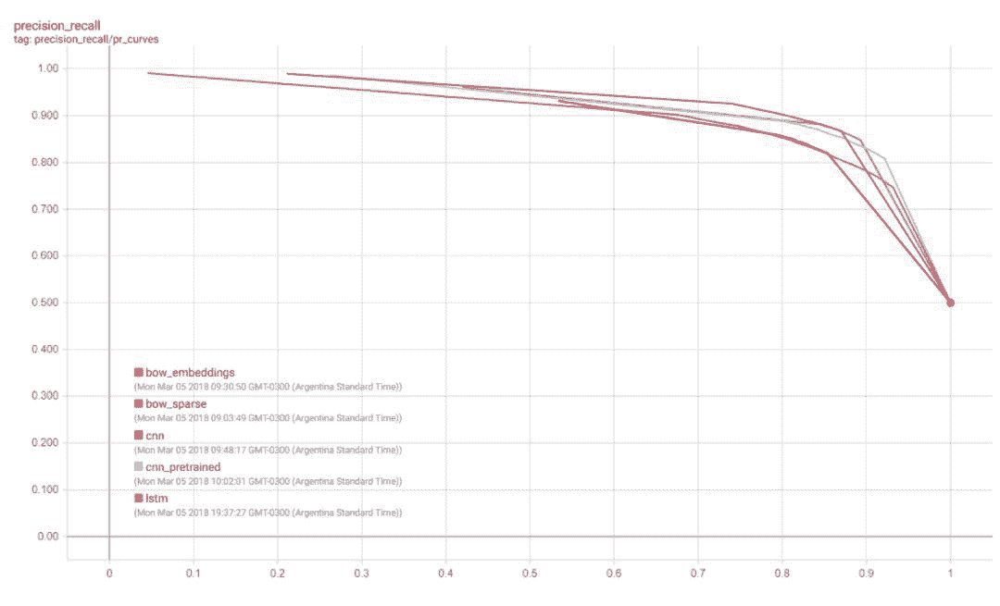
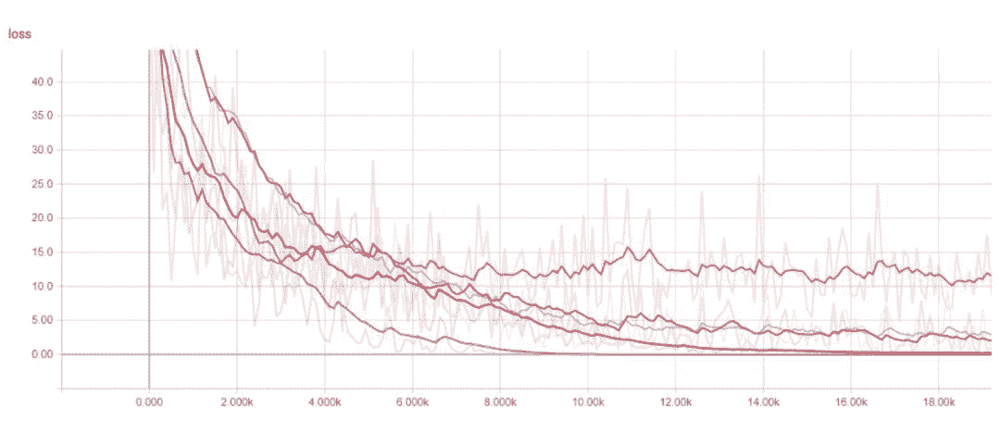

# 教程 | 用 TensorFlow Estimator 实现文本分类

选自 ruder.io

**作者：Sebastian Ruder**

**机器之心编译**

**参与：Geek AI、张倩**

> 本文探讨了如何使用自定义的 TensorFlow Estimator、嵌入技术及 tf.layers 模块来处理文本分类任务，使用的数据集为 IMDB 评论数据集。通过本文你将学到如何使用 word2vec 词嵌入和迁移学习技术，在有标签数据稀缺时获得更好的模型性能。

本文主要内容如下：

*   使用 Datasets 装载数据

*   使用预封装好的评估器（estimator）构建基线

*   使用词嵌入技术

*   通过卷积层和 LSTM 层构建定制化的评估器

*   装载预训练好的词向量

*   使用 TensorBoard 评估并对比模型

本文选自介绍 TensorFlow 的 Datasets 和 Estimators 模块系列博文的第四部分。读者无需阅读所有之前的内容，如果想重温某些概念，可以查看以下链接：

*   第一部分重点讨论了预建评估器（https://developers.googleblog.com/2017/09/introducing-tensorflow-datasets.html）

*   第二部分讨论了特征列（https://developers.googleblog.com/2017/11/introducing-tensorflow-feature-columns.html）

*   第三部分讲解了如何创建一个自定义的评估器（https://developers.googleblog.com/2017/12/creating-custom-estimators-in-tensorflow.html）。

第四部分的内容将会建立在上述所有章节的基础上，我们将处理一系列不同的自然语言处理（NLP）问题。本文演示了如何使用自定义的 TensorFlow 评估器、嵌入技术及 tf.layers 模块（https://www.tensorflow.org/api_docs/python/tf/layers）来处理文本分类任务。在这篇文章中，我们会学习 word2vec 词嵌入和迁移学习技术，在有标签数据稀缺时获得更好的模型性能。

我们将展示相关的代码片段。这里是完整的 Jupyter Notebook 代码，你可以在本地或者 Google Colaboratory 上运行它。清晰的「.py」源文件可以通过以下链接获得：（https://github.com/eisenjulian/nlp_estimator_tutorial/blob/master/nlp_estimators.py）。

有一点需要注意的是，此代码只是为了演示评估器的功能是如何运行的，并没有为了获得最佳的性能进行进一步优化。

**本文的任务**

我们将使用的数据集是 IMDB 大规模电影评论数据集（http://ai.stanford.edu/~amaas/data/sentiment/），它包含 25,000 篇高度分化的电影评论作为训练数据，另有 25,000 篇作为测试数据。我们将使用这个数据集去训练一个能够预测一条评论是正面还是负面的二分类模型。

举例来说，这里有一条数据集中的负面评论（得到了 222 个赞）：

> 现在我喜欢意大利恐怖电影。越俗越好！然而，这并不是俗气的意大利电影。这是放了一周的有腐烂肉丸的意大利面酱汁。这电影从任何层面看都很业余！没有悬念，没有恐惧感，只有几滴血落在周围提醒你：你实际上在看恐怖电影。

Keras 为导入数据集提供了一个方便的处理程序，这个数据集也可以以一个序列化的 numpy 数组「.npz」文件的形式从这里（https://s3.amazonaws.com/text-datasets/imdb.npz）下载获得。文本分类中的标准做法是限制词汇表的规模以防止数据集变得过于稀疏且维度过高，从而防止过拟合。因此，每条评论由一系列单词索引组成，从「4」（在数据集中出现最频繁的单词「the」）一直到「4999」（代表单词「orange」）。索引「1」代表句子的开头，索引「2」被分配给所有未知的（也被称为「词汇表之外的」，即 OOV）单词。这些索引是通过在一个数据管道中进行预处理之后得到的。这个预处理的步骤包括数据清洗、正则化，并且首先对每个句子进行分词，接着根据频率构建一个字典对每个单词进行索引。

在内存中加载数据后，我们用「0」将每个句子填充到固定的长度进行对齐（这里长度为 200）。这样一来，我们就拥有了两个二维的 25,000*200 的数组分别作为训练和测试数组。

```py
vocab_size = 5000  
sentence_size = 200  
(x_train_variable, y_train), (x_test_variable, y_test) = imdb.load_data(num_words=vocab_size)  
x_train = sequence.pad_sequences(  
    x_train_variable, 
    maxlen=sentence_size, 
    padding='post', 
    value=0)
x_test = sequence.pad_sequences(  
    x_test_variable,
    maxlen=sentence_size, 
    padding='post', 
    value=0) 
```

**输入函数**

评估器框架使用输入函数将数据管道和模型本身分离。可以使用一些辅助方法来创建他们，无论你的数据是存储在一个「.csv」文件还是「pandas.DataFrame」中，也无论它是否存储在内存中。在我们的例子中，训练集合和测试集合都适用「Dataset.from_tensor_slices」读取数据。

```py
x_len_train = np.array([min(len(x), sentence_size) for x in x_train_variable])  
x\_len\_test = np.array([min(len(x), sentence_size) for x in x_test_variable])

def parser(x, length, y):  
    features = {"x": x, "len": length}
    return features, y

def train_input_fn():  
    dataset = tf.data.Dataset.from_tensor_slices((x_train, x_len_train, y_train))
    dataset = dataset.shuffle(buffer_size=len(x_train_variable))
    dataset = dataset.batch(100)
    dataset = dataset.map(parser)
    dataset = dataset.repeat()
    iterator = dataset.make_one_shot_iterator()
    return iterator.get_next()

def eval_input_fn():  
    dataset = tf.data.Dataset.from_tensor_slices((x_test, x_len_test, y_test))
    dataset = dataset.batch(100)
    dataset = dataset.map(parser)
    iterator = dataset.make_one_shot_iterator()
    return iterator.get_next() 
```

我们通过随机化处理将训练数据打乱，并且没有预定义我们想要训练模型的迭代次数，这里我们仅仅需要对测试数据迭代一次就能进行模型的评估。我们也需要一个额外的「len」关键字去获取原始、未填充的序列的长度，我们将会在后面用到它们。

**构建基线**

通过尝试一些基础的基线来开始机器学习项目是一种很好的做法。这个基线越简单越好，因为有一个简单、鲁棒的基线至关重要，它可以帮助我们理解通过对模型增添额外的复杂性可以获得多大的性能提升。很有可能，一个简单的解决方案就足以满足我们的要求。

考虑到这一点，让我们首先尝试一个最简单的文本分类模型。这将会是一个稀疏的线性模型，它给每个单词赋予一个权重，并且将所有的结果相加，无论单词顺序如何。由于这个模型并不关心句子中单词的顺序，所以我们通常把它称为词袋方法（BOW）。让我们看看如何通过评估器（Estimator）实现这个模型。

我们从定义用做我们分类器输入的特征列开始。正如我们在第二部分中看到的，「categorical_column_with_identity」是对这个文本输入进行预处理的正确选择。如果我们拿到的是原始文本单词，其它的特征列「feature_columns」可以为我们做很多的预处理工作。我们现在可以使用预制好的「LinearClassifier」评估器了。

```py
column = tf.feature_column.categorical_column_with_identity('x', vocab_size)  
classifier = tf.estimator.LinearClassifier(  
    feature_columns=[column], 
    model_dir=os.path.join(model_dir, 'bow_sparse')) 
```

最终，我们创建了一个简单的函数来训练分类器并且另外创建了一个精确率-召回率曲线。由于我们不打算在这篇博文中取得最优的模型性能，所以我们仅仅对我们的模型训练 25,000 步。

```py
def train_and_evaluate(classifier):  
    classifier.train(input_fn=train_input_fn, steps=25000)
    eval_results = classifier.evaluate(input_fn=eval_input_fn)
    predictions = np.array([p['logistic'][0] for p in classifier.predict(input_fn=eval_input_fn)])
    tf.reset_default_graph() 
    # Add a PR summary in addition to the summaries that the classifier writes
    pr = summary_lib.pr_curve('precision_recall', predictions=predictions, labels=y_test.astype(bool), num_thresholds=21)
    with tf.Session() as sess:
        writer = tf.summary.FileWriter(os.path.join(classifier.model_dir, 'eval'), sess.graph)
        writer.add_summary(sess.run(pr), global_step=0)
        writer.close()

train\_and\_evaluate(classifier) 
```

选择一个简单模型的好处之一是，它的可解释性要强的多。一个模型越复杂，他就越难被检验，并且更容易像一个黑箱子一样工作。在这个例子中，我们可以从我们模型的上一个检查点装载权重，并且看看哪些单词相应的权重的绝对值最大。结果看起来就像我们所期望的那样。

```py
# Load the tensor with the model weights  
weights = classifier.get_variable_value('linear/linear_model/x/weights').flatten()  
# Find biggest weights in absolute value  
extremes = np.concatenate((sorted_indexes[-8:], sorted_indexes[:8]))  
# word_inverted_index is a dictionary that maps from indexes back to tokens  
extreme_weights = sorted(  
    [(weights[i], word_inverted_index[i - index_offset]) for i in extremes])
# Create plot  
y_pos = np.arange(len(extreme_weights))  
plt.bar(y_pos, [pair[0] for pair in extreme_weights], align='center', alpha=0.5)  
plt.xticks(y_pos, [pair[1] for pair in extreme_weights], rotation=45, ha='right')  
plt.ylabel('Weight')  
plt.title('Most significant tokens')  
plt.show() 
```


正如我们看到的，像「refreshing」这样的拥有最大的正权值的单词显然与正面的语义相关，而拥有很大的负权重的单词不容置疑地会激发负面的情绪。我们可以对模型做一个简单但强而有力的修改去提升模型的能力，那就是根据单词的 tf-idf 值赋予它们权重。

**嵌入**

增加模型复杂性的下一个步骤是词嵌入。嵌入是稀疏高维数据的密集低维表示。它使得我们的模型能学习到每个单词的更有意义的表示，而不仅仅是一个索引。尽管单一的维度可能没有太大的意义，低维空间（当从一个足够大的语料库中学习时）已经被证实可以捕获诸如时态、复数、性别、关联主题等关系。我们可以通过将我们现有的特征列转换为「embedding_column」来增加词嵌入。模型可见的特征表示是每个单词的词嵌入的平均值（具体对「combiner」的讨论参见本文档：https://www.tensorflow.org/api_docs/python/tf/feature_column/embedding_column）可以将嵌入的特征插入预封装的 DNNClassifier 中。

这里我们要提醒一下那些观察力敏锐的人：一个「embedding_column」仅仅是一个将全连接层应用到稀疏的单词的二值特征向量的一种有效方法，它根据选择的组合器（combiner）乘以一个相应的常数。这样做的一个直接后果是，直接在「LinearClassifier」中使用一个「embedding_column」是没有任何意义的，因为之间没有非线性映射的两个连续的线性层不会给模型增添预测能力，当然，除非词嵌入是预训练好的。

```py
embedding_size = 50  
word\_embedding\_column = tf.feature_column.embedding_column(  
    column, dimension=embedding_size)
classifier = tf.estimator.DNNClassifier(  
    hidden_units=[100],
    feature_columns=[word_embedding_column], 
    model_dir=os.path.join(model_dir, 'bow_embeddings'))
train\_and\_evaluate(classifier) 
```

我们可以使用 TensorBoard 中的 t-SNE（https://en.wikipedia.org/wiki/T-distributed_stochastic_neighbor_embedding）将我们 50 维的词向量方案可视化为 R³。我们估计相似的词彼此距离会比较接近。这可以称为一种检验我们的模型权重并且发现意想不到的表现的有效方法。



**卷积**

在这里，让模型变得更」深」，进一步增添更多的全连接层、并围绕层的规模和训练的函数进行操作，是一种可能的改进方法。然而，通过这样做，我们会增加额外的复杂性，并且忽略句子中的重要结构。实际上，单词并不是存在于真空中的（独立存在），它的意义是由它本身和与其相邻的单词组合而成的。

卷积是一种利用这种结构的方法，这类似于我们如何为图像分类建立显著的像素集合。从直觉上来说，特定的单词序列，或 n-gram，无论在句子中的整体位置如何，通常具有相同的含义。通过卷积操作引入一个结构先验，使我们能够对相邻单词之间的交互建模，从而给我们提供了一个更好的表示这种意义的方法。

下图展示了一个 d×m 维的过滤器矩阵 F 在每个 3-gram 单词窗口的滑动，去构建一个新的特征映射。此后，池化层通常被用于组合相邻的结果。



*来源： Learning to Rank Short Text Pairs with Convolutional Deep Neural Networks，Severyn 等著，[2015]。* 

让我们看看整个模型的框架。Dropout 层的使用是一种正则化技术，它使模型更不容易发生过拟合。



**创建一个自定义评估器**

正如我们在之前的博文中看到的，「tf.estimator」框架提供了一个训练机器学习模型的高级 API，定义了「train()」，「evaluate()」以及「predict()」操作，能够很方便地处理检查点、加载数据、初始化、服务、构建计算图（graph）和会话（session）。我们有一小部分预制评估器，就像我们之前用到的那些，但是很有可能你需要构建你自己的评估器。

要编写一个自定义的评估器意味着，你需要编写一个「model_fn(features, labels, mode, params)」函数，其返回值为一个 EstimatorSpec。你要做的第一步是将特征映射到我们的嵌入层中：

```py
input_layer = tf.contrib.layers.embed_sequence(  
    features['x'], 
    vocab_size, 
    embedding_size,
    initializer=params['embedding_initializer']) 
```

接着我们使用「tf.layers」按顺序处理每一个输出。

```py
training = (mode == tf.estimator.ModeKeys.TRAIN)  
dropout_emb = tf.layers.dropout(inputs=input_layer,  
                                rate=0.2, 
                                training=training)
conv = tf.layers.conv1d(  
    inputs=dropout_emb,
    filters=32,
    kernel_size=3,
    padding="same",
    activation=tf.nn.relu)
pool = tf.reduce_max(input_tensor=conv, axis=1)  
hidden = tf.layers.dense(inputs=pool, units=250, activation=tf.nn.relu)  
dropout = tf.layers.dropout(inputs=hidden, rate=0.2, training=training)  
logits = tf.layers.dense(inputs=dropout_hidden, units=1) 
```

最后我们会使用一个模型头「Head」对象去简化「model_fn」最后一个部分的编写。模型头「head」已经知道如何计算预测值、损失、训练操作（train_op）、度量并且导出这些输出，并且可以跨模型重用。这种方法也被用于预制评估器中，并为我们提供一个能够在所有模型上使用的统一的评估函数。我们将使用「binary_classification_head」，这是一个针对单标签二分类模型的头，它使用「sigmoid_cross_entropy_with_logits」作为底层的损失函数。

```py
head = tf.contrib.estimator.binary_classification_head()  
optimizer = tf.train.AdamOptimizer()  
def _train_op_fn(loss):  
    tf.summary.scalar('loss', loss)
    return optimizer.minimize(
        loss=loss,
        global_step=tf.train.get_global_step())

return head.create_estimator_spec(  
    features=features,
    labels=labels,
    mode=mode,
    logits=logits,
    train_op_fn=_train_op_fn) 
```

运行这个模型和之前一样简单：

```py
initializer = tf.random_uniform([vocab_size, embedding_size], -1.0, 1.0))  
params = {'embedding_initializer': initializer}  
cnn_classifier = tf.estimator.Estimator(model_fn=model_fn,  
                                        model_dir=os.path.join(model_dir, 'cnn'),
                                        params=params)
train\_and\_evaluate(cnn_classifier) 
```

**LSTM 网络**

使用「Estimator」API 和相同的模型头，我们可以创建一个使用长短期记忆（LSTM）神经元而不是卷积神经元的分类器。像这样的递归模型是自然语言处理应用最成功的构建模块。一个 LSTM 按顺序处理整个文档，在其内存中存储当前状态的同时也通过它的神经元对序列进行递归操作。

与 CNN 相比，递归模型的缺点之一是：由于递归的性质，模型会会变得越来越深、越来越复杂，通常会导致训练时间加长，收敛性变差。LSTM（和一般的 RNN）可能会遇到像梯度弥散或梯度爆炸这样的收敛问题，也就是说，只要有足够的调优，他们就能够在许多问题取得目前最好的结果。一般说来，CNN 擅长于特征提取，而 RNN 则擅长依赖整个句子语义的任务，比如问答或机器翻译。

每个神经元一次处理一个词嵌入，并且根据依赖于嵌入向量 x_t 和之前的状态 h_t-1 的可微的计算更新它的内部状态。为了更好地理解 LSTM 的工作原理，可以参考 Chris Olah 的博文（https://colah.github.io/posts/2015-08-Understanding-LSTMs/）。



*来源：Understanding LSTM Networks by Chris Olah*

完整的 LSTM 模型可以表示成下面的简单流程图：



在本文的开头，我们将所有的文档都向上填充到了 200 个单词，这对于构建一个合适的张量是十分必要的。然而，当一个文档包含的单词少于 200 个时，我们不希望 LSTM 继续填充单词的处理，因为这样不会增加信息，还会降低性能。因此，我们还希望在填充之前，为我们的网络提供原始序列长度的信息。接下来，在模型的内部，它会将最后一个状态复制到序列的末尾。我们可以通过在我们的输入函数中添加「len」特征做到这一点。我们现在可以遵循上面的逻辑，用我们的 LSTM 神经元替代卷积、池化、平整化层。

```py
lstm_cell = tf.nn.rnn_cell.BasicLSTMCell(100)  
_, final_states = tf.nn.dynamic_rnn(  
        lstm_cell, inputs, sequence_length=features['len'], dtype=tf.float32)
logits = tf.layers.dense(inputs=final_states.h, units=1) 
```

**预训练的向量**

我们之前展示过的绝大多数模型都依赖于将词嵌入作为第一层。到目前为止，我们已经随机地初始化了这个嵌入层。然而，许多之前的研究表明，在大量未标记的语料库上使用预训练的嵌入作为初始化是很有帮助的，特别是当只对少量标记示例进行训练时。最流行的预训练词嵌入技术是 word2vec。通过预训练的嵌入来利用未标注数据的知识是迁移学习的一个实例。为此，我们将展示如何在评估器「Estimator」中使用他们。我们将使用来自于另一个流行的模型「GloVe」的预训练向量。

```py
embeddings = {}  
with open('glove.6B.50d.txt', 'r', encoding='utf-8') as f:  
    for line in f:
        values = line.strip().split()
        w = values[0]
        vectors = np.asarray(values[1:], dtype='float32')
        embeddings[w] = vectors 
```

在将向量从文件加载到内存之后，我们将他们使用和我们的词汇表相同的索引存储为一个 numpy 数组。创建的数组的大小为（5000，50）。在每个行索引中，它包含代表和我们的词汇表中索引相同的单词的 50 维向量，

```py
embedding_matrix = np.random.uniform(-1, 1, size=(vocab_size, embedding_size))  
for w, i in word_index.items():  
    v = embeddings.get(w)
    if v is not None and i < vocab_size:
        embedding_matrix[i] = v 
```

最后，我们可以使用一个自定义的初始化函数，并且将结果传给「params」对象，再将这个对象不作任何修改直接用于我们的「cnn_model_fn」。

```py
def my_initializer(shape=None, dtype=tf.float32, partition_info=None):  
    assert dtype is tf.float32
    return embedding_matrix
params = {'embedding_initializer': my_initializer}  
cnn\_pretrained\_classifier = tf.estimator.Estimator(  
    model_fn=cnn_model_fn,
    model_dir=os.path.join(model_dir, 'cnn_pretrained'),
    params=params)
train\_and\_evaluate(cnn_pretrained_classifier) 
```

**运行 TensorBorad**

现在，我们可以启动 TensorBoard，将我们训练出来的模型进行比较，观察它们在训练时间和性能方面都有何差异。在终端上运行：

```py
tensorboard --logdir={model_dir} 
```

我们可以在训练和测试中可视化许多收集到的度量结果，包括每个模型在每一个训练步骤上的损失函数值，以及精确度-召回率曲线。这当然是为我们的用例选择最佳模型的最实用的方法，也是选择分类阈值的最佳方法。





**得到预测结果**

为了得到在新的句子上的预测结果，我们可以使用「Estimator」实例中的「predict」方法，它能为每个模型加载最新的检查点并且对不可见的示例进行评估。但是在将数据传给模型之前，我们必须进行清理、分词并且将每个单词映射到相应的索引上。具体代码如下：

```py
def text_to_index(sentence):  
    # Remove punctuation characters except for the apostrophe
    translator = str.maketrans('', '', string.punctuation.replace("'", ''))
    tokens = sentence.translate(translator).lower().split()
    return np.array([1] + [word_index[t] + index_offset if t in word_index else 2 for t in tokens])

def print_predictions(sentences, classifier):  
    indexes = [text_to_index(sentence) for sentence in sentences]
    x = sequence.pad_sequences(indexes,
                               maxlen=sentence_size, 
                               padding='post', 
                               value=-1)
    length = np.array([min(len(x), sentence_size) for x in indexes])
    predict_input_fn = tf.estimator.inputs.numpy_input_fn(x={"x": x, "len": length}, shuffle=False)
    predictions = [p['logistic'][0] for p in classifier.predict(input_fn=predict_input_fn)]
    print(predictions) 
```

值得注意的是，检查点本身并不足以作出预测，为了将存储的权重映射到相应的张量（tensor）上，用于构建评估器的实际代码也是必需的。将保存的检查点和创建他们的代码分支关联起来是一种很好的做法。如果有兴趣将模型以一种完全可恢复的方式导出，可以查看「SaveModel」类，这对于通过使用 TensorFlow Serving 提供的 API 构建模型十分有用。

**总结**

在这篇博文中，我们探索了如何使用评估器（estimator）进行文本分类，特别是针对 IMDB 评论数据集。我们训练并且可视化了我们的词嵌入模型，也加载了预训练的嵌入模型。我们从一个简单的基线开始，成功构建了我们的卷积神经网络和长短期记忆神经网络。

更多细节请查看：

*   能在本地或 Colaboratory 上运行的 Jupyter notebook（https://github.com/eisenjulian/nlp_estimator_tutorial/blob/master/nlp_estimators.ipynb）

*   本文使用的完整源代码（https://github.com/eisenjulian/nlp_estimator_tutorial/blob/master/nlp_estimators.py）

*   TensorFlow 嵌入技术指南（https://www.tensorflow.org/programmers_guide/embedding）

*   TensorFlow 词向量表示教程（https://www.tensorflow.org/tutorials/word2vec）

*   NLTK 的原始文本处理（http://www.nltk.org/book/ch03.html）章节，讲述如何设计语言数据管道

****本文为机器之心编译，**转载请联系本公众号获得授权****。**

✄------------------------------------------------

**加入机器之心（全职记者/实习生）：hr@jiqizhixin.com**

**投稿或寻求报道：**content**@jiqizhixin.com**

**广告&商务合作：bd@jiqizhixin.com**