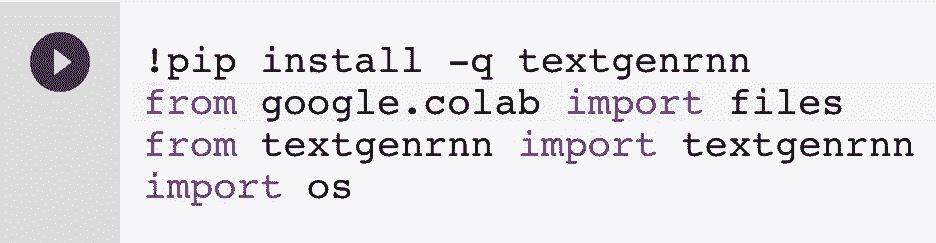
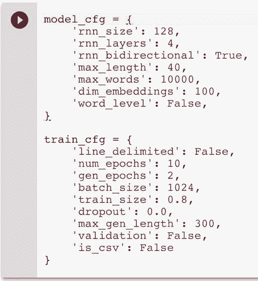
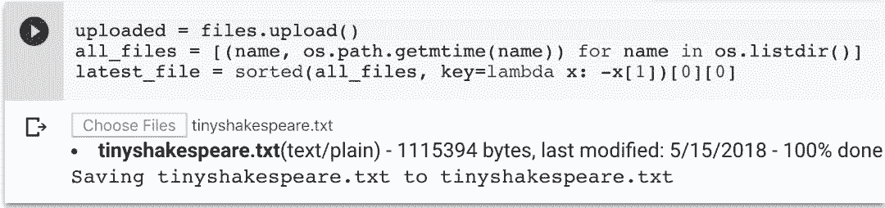
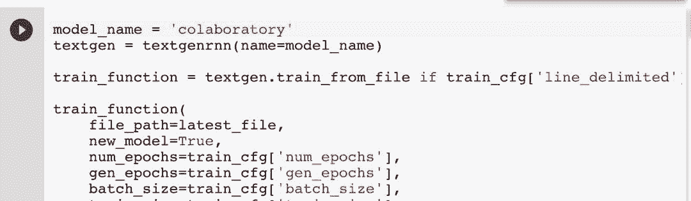
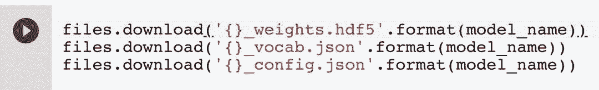

# 教程 | 如何快速训练免费的文本生成神经网络

选自 minimaxir

**作者：Max Woolf**

**机器之心编译**

**参与：Geek AI、路**

> 本文介绍了如何免费使用 Google Colaboratory 在 GPU 上快速训练文本生成神经网络，包括两种类型的文本生成模型：字符级别和单词级别的文本生成网络。

[`v.qq.com/iframe/preview.html?vid=i0676mskprk&width=500&height=375&auto=0`](https://v.qq.com/iframe/preview.html?vid=i0676mskprk&width=500&height=375&auto=0)

文本生成是这一波神经网络革命中诞生的一个有趣的应用。大多数目前流行的实现方法都基于 Andrej Karpathy 的「char-rnn」架构（https://github.com/karpathy/char-rnn）或者这篇博文（http://karpathy.github.io/2015/05/21/rnn-effectiveness/），它通过训练使循环神经网络根据之前的 n 个字符预测序列中的下一个字符。因此，在理论上，一个经过了充分训练的网络可以重现它的输入源语料，但是由于经过适当训练的神经网络也不是十全十美的，因此输出文本可能会变成一个很奇怪但是效果也很好的「恐怖谷」（和人的行为很相似但不完全相同）。


许多文本生成神经网络的网上教程只是简单复制了一个现有的 char-rnn 实现同时对输入数据集进行了更改。这确实是一种方法，但是研究者仍然有机会通过现代深度学习工具去改进它。得益于像 TensorFlow 和 Keras 这样的框架，我构建了 textgenrnn（https://github.com/minimaxir/textgenrnn），它是一个将创建和训练这样的 char-rnn 的工作流程抽象为几行代码的 Python 程序包（https://pypi.org/project/textgenrnn/#description），其中包含了大量的模型架构和训练的改进，例如：字符嵌入、注意力加权平均，以及一个衰减的学习率。

textgenrnn 的一个好处是它可以免费使用「Google Colaboratory」很容易地在 GPU 上快速地训练神经网络。我创建了一个 notebook（https://drive.google.com/file/d/1mMKGnVxirJnqDViH7BDJxFqWrsXlPSoK/view），它可以让你仅仅通过几次点击就能够训练自己的网络并且生成文本。

**开始编写你的第一个文本生成神经网络吧**

Colaboratory 是一个类似其它数据科学项目中使用的 Jupyter Notebooks 的笔记本环境。然而，Colaboratory notebook 被免费托管在一个有两个虚拟 CPU、13GB 内存、一个 K80 GPU 的短期虚拟机上。通常，这种配置的虚拟机需要在谷歌计算引擎上花费 0.57 美元/小时；这个费用听上去很低，但是当你需要训练好几个小时才能取得好的训练结果时，费用就积少成多了。

首先，我建议将该 notebook 复制到硬盘上（如果你没有这么做，那么请使用 Google Chrome 浏览器访问它）。Colaboratory 虚拟机包含了 Python 3 和像「Tensorflow」这样用于机器学习的通用 Python 程序包。但是你可以直接在 notebook 中安装更多的程序包。比如 textgenrnn！只需要点击进入这个单元并且点击「play」按钮（或者使用 Shift + Enter）即可运行这个单元格，其它的部分都将由它控制：



当我们训练新模型时，「textgenrnn」使你能够通过各种各样的参数来指定神经网络的大小和复杂度：



现在让我们保留这些默认的参数，运行该单元将它们加载到内存中。运行下一个单元，它会提示你上传一个文件。任何文本文件都应该能工作，甚至是很大的文本文件！在这个例子中，本文将使用一个在 char-rnn demo 中也使用过的 1.1MB 莎士比亚戏剧的文本文件。



下一个单元将初始化一个 textgenrnn 实例，并开始训练一个新的自定义文本生成神经网络！



textgenrnn 自动地将输入文本处理成用于训练神经网络的字符序列。并且每两个 epoch（对数据进行完整的遍历）后，神经网络就会使用不同的温度（temperature）参数来生成文本，这代表了文本的「创造能力」（也就是说，它允许模型做出越来越差的预测，这可能会创造出令人啼笑皆非的文本。）我通常喜欢将温度设置为 0.5 来生成文本，但是对于训练的很好的模型，你可以将它调高为 1。

该模型快速的训练速度要归功于虚拟机的 GPU，它可以比 CPU 更快地执行必要的数学运算。然而，针对循环神经网络，Keras 最近添加了一个 RNN 的 CuDNN 实现，如 CuDNNLSTM，它可以更容易地利用直接在 GPU 上编程的代码，并且较之于之前的实现方法能获得巨大的速度提升（大约是之前的 7 倍）！总的来说，对于这个示例数据集和模型架构，在 GPU 上每训练一个 epoch 需要花费 5 到 6 分钟，而在一个 CPU 上，相同的训练则需要 1 小时 24 分钟。可见，在 GPU 上获得了 14 倍的速度提升！

训练完成后，运行下一个单元将下载以下 3 个文件：一个权重文件（weights）、一个词汇表文件（vocabulary），以及一个配置文件（config），如果你想在其他地方重新生成该模型，这些文件都是必要的。



例如：在你自己的个人电脑上。只用在终端输入 pip3 install textgenrnn tensorflow，即可安装 textgenrnn 和 Tensorflow。切换到下载文件所在的目录，运行 python3，并使用以下代码加载模型：

```py
from textgenrnn import textgenrnn
textgen = textgenrnn(weights_path='colaboratory_weights.hdf5',
vocab_path='colaboratory_vocab.json',
config_path='colaboratory_config.json')
```

就是这样了！如果你仅仅想生成文本，并不一定需要 GPU。你可以使用 textgen.generate_samples() 来生成样本（比如在训练时），使用 textgen.generate_to_file() 在任意你选定的温度下生成大量的样本。或者使用 textgen.generate(1, return_as_list=True)[0] 将生成的文本引入到 Python 脚本中（例如 Twitter 机器人），从而将文本存储为变量。你可以在这个 demo Jupyter Notebook 中查看 textgenrnn 的更多函数和功能：https://github.com/minimaxir/textgenrnn/blob/master/docs/textgenrnn-demo.ipynb。

以下是在温度参数为 0.5 时，训练了 50 分钟的模型生成的莎士比亚戏剧文本： 

> LUCENTIO:
> 
> And then shall good grave to my wife thee;
> 
> Thou would the cause the brieved to me,
> 
> And let the place and then receives:
> 
> The rest you the foren to my ways him child,
> 
> And marry that will be a parties and so set me that be deeds
> 
> And then the heart and be so shall make the most as he and stand of seat.
> 
> GLOUCESTER:
> 
> Your father and madam, or shall for the people
> 
> And dead to make the truth, or a business
> 
> As we brother to the place her great the truth;
> 
> And that which to the smaster and her father,
> 
> I am I was see the sun have to the royal true.

还不错，甚至有点五步抑扬格的意思！

**对模型进行调整**

上面提到最重要的模型配置选项是 rnn_size 和 rnn_layers：它们决定网络的复杂度。通常来说，你在教程中看到的网络是由 128 个神经元或 256 个神经元组成的网络。然而，textgenrnn 的架构略有不同，因为它有一个包含了前面所有模型层的注意力层。因此，除非你拥有特别大量的文本（>10MB），让模型更深比让模型更宽要好一些（例如，4x128 比 1x512 的模型要好）。rnn_bidirectional 控制循环神经网络是否是双向的，也就是说，它同时向前和向后处理一个字符（如果文本遵循特定的规则，如莎士比亚的字符标题，这种方法会十分有效）。max_length 决定用于预测下一个字符的网络的最大字符数，当网络需要学习更长的序列时应该增大它，而当网络需要学习更短的序列时则应该减小它。

在训练过程中也有很多有用的配置选项。num_epochs 决定了完整遍历数据的次数，如果你想对模型进行更多次的训练，你可以调整这个参数。batch_size 决定了在一个计算步中训练的模型序列的数量，深度学习模型的批处理大小一般是 32 或 128，但是当你拥有一个 GPU 的时候，你可以通过使用给定的 1024 作为缺省批处理大小来获得训练速度的提升。train_size 决定待训练字符样本的比例，将它设置为< 1.0 可以同时加快每个 epoch 的训练速度，同时防止模型通过一字不差地学习并复制原文来「作弊」（你可以将「validation」设置为 True，在每一个 epoch 后利用未使用的数据运行模型，来看看模型是否过拟合）。

下面我们尝试在一个新的文本数据集上对参数进行更多的调整。

**用 Reddit 网站的数据进行单词级别的文本生成**

你可能会问「如何获取文本数据」。像歌词生成和电影剧本这类流行的文本生成用例都是受到版权保护的，因此你很难找到它们，即使你能够找到一些，往往也可能没有足够的数据来训练一个新的模型（通常需要至少 100,000 个字符）。

然而，Reddit 上有数以百万计的文章标题，这非常有益于训练模型。我写了一个能够在给定的时间内从给定的「subreddit」板块上自动下载自上而下的 n 条 Reddit 文章的 helper 脚本（https://github.com/minimaxir/subreddit-generator）。如果你选择了有相似语言风格的 subreddit，这些 subreddit 甚至会合并在一起！这里，我们获取了 2017 年/r/politics 和/r/technology 板块的前 20000 条文章，最终形成了一个 3.3MB 的文件，其数据大小大约是莎士比亚戏剧数据的 3 倍。


textgenrnn 还可以做到一件大部分 char-rnn 实现不能做到的事，即生成一个单词级别的模型（多亏了 Keras 分词器），该模型使用前面的 n 个单词／标点符号去预测接下来的单词或标点符号。从好的方面说，只使用单词可以防止拼写错误。而且由于它一次预测多个字符，max_length 可以按比例减小，这大大加快了训练速度。然而，这种方法也有两个缺点：由于单词都是小写的，而且每个标点符号就是自己的 token，因此生成的文本必须要经过手动编辑才能使用。

此外，该模型的权重比字符级别的模型大得多，因为单词级别的模型需要存储每个单词的嵌入（取决于 max_word 参数，该参数在单词级模型中的缺省值为 10,000，而字符级模型中的词汇表大小为 200-300）。

Colaboratory notebook 的另一个优点是，你可以快速地调整模型参数、上传新文件，并且立刻开始训练它。由于没有特殊的规则，我们将 line_delimited 设定为 True，将 rnn_bidirectional 设定为 False。对于单词级别的训练，我们将 word_level 设定为 True，将 max_length 设定为 8 来反映新的训练架构。由于训练长度被减少到了五分之一，我们可以将 num_epochs 设定为 50，将 gen_epoch 设定为 10 来平衡它。接下来，我们重新运行配置单元以更新参数，上传 Reddit 数据文件，并且重新训练模型。

最终的模型比莎士比亚戏剧模型训练得更好，以下是在温度为 1.0 的条件下生成的一些 Reddit 文章标题：

> report : 49 % of americans now believe all of the country 』 s effective
> 
> people like facebook like it ' s 650 of 1 %
> 
> uber accused of secretly - security popular service ( likely oklahoma )
> 
> equifax breach fallout : your salary is dead
> 
> sanders uses texas shooter ' s iphone sales
> 
> adobe videos will be used to sell the web
> 
> apple to hold cash for $ 500 service
> 
> fitbit just targeting solar energy
> 
> george bush ' s concept car 『 goes for all the biggest controversy .

尽管要将这个文本贴到社交媒体上还需要进行一些后期的人工编辑，但这已经相当不错了。

**后续工作**

这些例子只是在短时间内训练模型，作为 textfenrnn 快速学习的演示样例，你可以通过不断地增加 num_epochs 来进一步完善模型。然而，根据我的经验，训练单元在训练进行 4 小时后会出现超时问题：你需要根据具体情况设定 num_epochs 参数，尽管在我的经验里，这是在网络训练收敛之前所需要做的工作。

事实上，我使用了这个 Colaboratory notebool 为/r/SubredditNN 训练了许多模型，这个 Reddit 子板块中只有文本生成神经网络机器人是基于其他 subreddit 板块数据训练的。生成的结果非常有趣：


尽管文本生成神经网络目前还不能自行编写完整的文章，但是仍然有很多机会可以使用它做一些有趣的事！得益于 textgenrnn，这种探索对于每个人来说都是很容易、快速并且划算的！

*原文链接：http://minimaxir.com/2018/05/text-neural-networks/*

****本文为机器之心编译，**转载请联系本公众号获得授权****。**

✄------------------------------------------------

**加入机器之心（全职记者/实习生）：hr@jiqizhixin.com**

**投稿或寻求报道：**content**@jiqizhixin.com**

**广告&商务合作：bd@jiqizhixin.com**