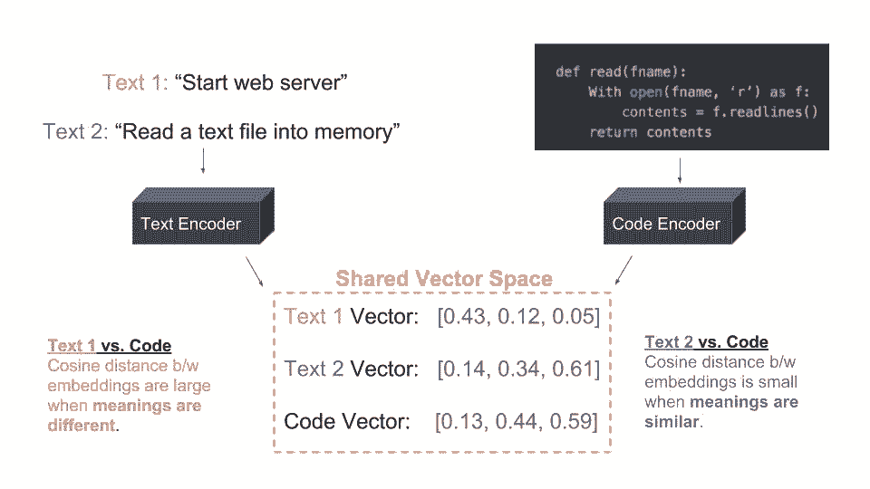
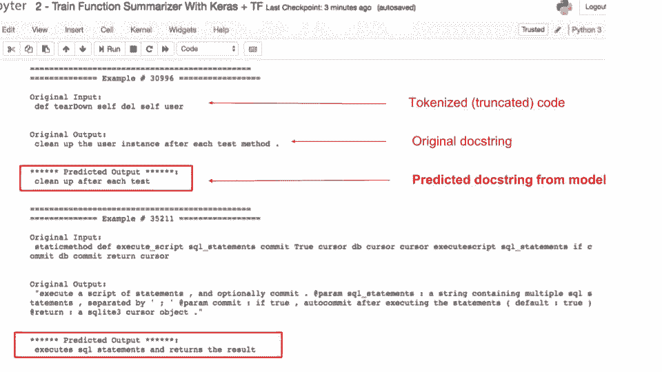
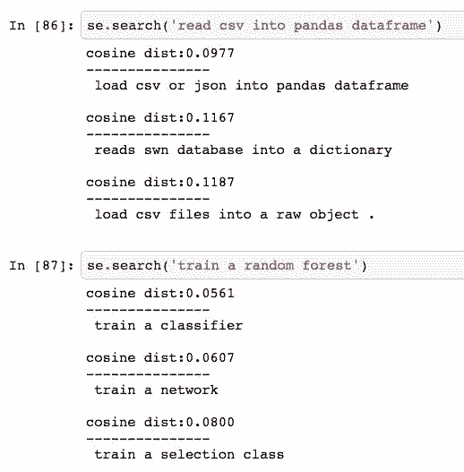
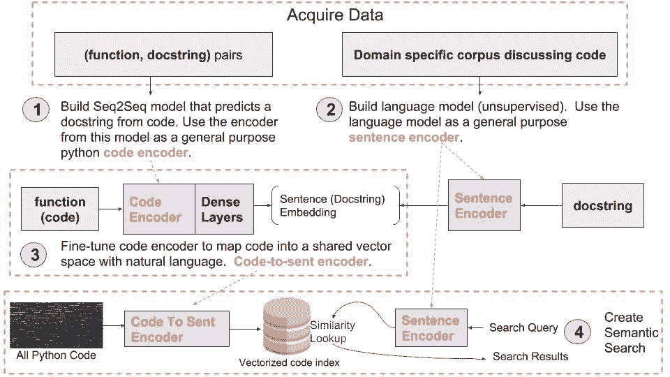

# 资源 | 自然语言语义代码搜索之路

选自 GithubEngineering

**作****者： hamelsmu、hohsiangwu**

**机器之心编译**

**参与****：Geek AI、张倩**

> 在本文中，作者向读者分享了如何利用深度学习技术促进自然语言语义搜索的发展。此外，他们还分享了一个开源的示例，以及复现结果所需的代码和数据。

**研究动机**

目前，在 GitHub 上搜索代码还局限于关键字搜索。这建立在假设用户了解句法，或者可以预测出他们要找的代码周围的注释中可能有什么关键字的基础上。我们的机器学习科学家一直在研究能够对代码进行语义搜索（https://en.wikipedia.org/wiki/Semantic_search）的方法。

如果读者想要充分了解语义搜索的概念，可以想一想下面的搜索查询「ping REST api and return results」

请注意，即使在搜索查询和文本之间并不存在共有的关键字（在代码和注释中并没有找到「Ping」、「REST」或「api」字样），我们的语义搜索算法也能返回有意义的结果！通过语义搜索增强关键字搜索是意义深远的。例如，这种能力可以加快新的软件工程师上手软件项目的过程，并且普遍提高代码被发现的可能性。

在本文中，我们想向读者分享我们是如何利用深度学习技术在自然语言语义搜索领域取得进步的。我们也分享了一个开源的示例，以及复现这些结果所需的代码和数据。

**引言**

目前，对实体的表示学习是 GitHub 上正在进行的机器学习研究的关键领域之一，这里的实体包括代码仓库、代码、问题单、文件和用户。我们通过学习与文本共享一个向量空间的代码的表征，在促进语义搜索方面取得了显著的进步。我们不妨看一看下面的示意图中的例子：

在上面的例子中，Text 2（蓝色）是对代码的合理描述，而 Text1（红色）则与代码完全无关。我们的目标是让学习到的描述相同概念的文本、代码对的表征比较接近。而不相关的文本、代码对的表征的距离较远。通过在相同的向量空间中表征代码和文本，我们可以将用户的搜索查询向量化，并查找最接近的表示代码的向量。下面是我们目前用来完成这项任务的方法的四个步骤：

**1\. 学习代码的表征**

为了学习代码的表征，我们训练了一个序列到序列（Seq2Seq）模型，它能够学着对代码进行总结。在 Python 环境下实现这一目的一种方法是提供（代码，文档字符串）对，其中文档字符串是模型试图预测的目标变量。对我们来说，引入对特定领域（如基于树结构的 LSTM、门控图网络以及有语法意识的分词处理）的优化是一个热点的研究领域。下图展示了代码总结模型的工作过程。在这个例子中，有两个 python 函数作为输入，在这两种情况下，模型都将合理的代码总结作为输出：

应当指出，在上面的例子中，模型通过使用整段代码块而不仅仅是函数名来生成对代码的总结。

构建代码总结器本身是一个非常激动人心的项目，然而，我们还可以利用这个模型的编码器作为代码的通用特征提取器。从这个模型中提取出编码器后，我们可以对它进行调优，从而建立代码到自然语言的向量空间的映射。

我们可以客观地使用 BLEU 得分来评估这个模型。目前，我们已经能够使用 fairseq-py 代码库（https://github.com/pytorch/fairseq）构建 Seq2Seq 模型，在一个 python 代码验证集上获得 13.5 的 BLEU 得分。

**2\. 学习短文本的表征**

除了学习代码的表征以外，我们还需要为短文本（例如在 Python 文档字符串中找到的句子）找到合适的表征。最初，我们尝试使用通用的句子编码器，这是一个预训练好的文本编码器，可以从 TensorFlow Hub（https://www.tensorflow.org/hub/modules/google/universal-sentence-encoder/1）上获取。尽管目前嵌入技术的性能已经很好，我们发现学习针对于软件开发的词汇和语义的嵌入仍然是有益的。目前正在进行一个研究领域旨在评估用于训练我们模型的不同特定领域的语料库，其范围涵盖从 GitHub 问题单到第三方数据集的诸多领域。

为了学习短文本的表征，我们利用 fast.ai 库训练了一个神经语言模型。这个库让我们可以很容易使用像 AWD LSTM 这样最先进的架构，以及类似带随机重启的周期性学习率（cyclical learning rates with random restarts）这样的技术。我们使用

《Universal Language Model Fine-tuning for Text Classification》中提出的级联池化（concat pooling）技术通过总结隐藏状态从该模型中抽取出对短文本的表征。

这项工作一个最具挑战性的方面是评估这些嵌入的质量。我们目前正在构建各种类似于《SentEval: evaluation toolkit for sentence embeddings》（https://github.com/facebookresearch/SentEval）中概述 (https://github.com/facebookresearch/SentEval) 的下游监督任务，它们将帮助我们客观地评估这些嵌入的质量。与此同时，我们还通过手动检验相似短文本之间的相似程度来检查我们的嵌入。下面的截图展示了一些示例，我们在这里根据用户提供的短文本和向量化的文档字符串间的相似程度进行搜索。

**3\. 将代码表征映射到具有相同向量空间的文本上**

接下来，我们将把从代码总结模型（第 1 部分）中学到的代码表征映射到文本的向量空间。我们通过对该模型的编码器进行调优来实现这一点。这个模型的输入仍然是代码块，然而模型的目标变量现在变成了文档字符串的向量化版本。这些文档字符串使用上一节介绍的方法进行了向量化处理。

具体而言，我们使用余弦近似损失（即预测值与真实标签的余弦距离平均值的相反数）进行多维回归，将编码器的隐藏状态带入与文本相同的向量空间。

我们正在积极研究直接学习代码和自然语言的联合向量空间的方法，我们的研究借鉴了《Efficient Natural Language Response Suggestion for Smart Reply》中介绍的一些思路。

**4\. 创建一个语义搜索系统**

最后，在成功地创建了一个可以将代码向量化到与文本相同的向量空间的模型之后，我们可以创建一个语义搜索机制。最简单的形式是，我们可以在一个数据库中存储所有代码的向量化版本，对向量化的搜索查询执行最近邻查找。

我们研究的另一个热点领域是确定用语义结果增强现有关键字搜索的最佳方法，以及如何引入上下文语境和相关性等额外的信息。此外，我们正在积极探索如何评估搜索结果的质量，使我们能够在这个问题上快速迭代开发。我们未来将在博文中继续讨论这些话题。

**总结**

下面的示意图总结了我们当前的语义搜索工作流程中所有的步骤：

我们正在探索如何改进这种方法的几乎每一个组成部分，包括数据准备、模型架构、评估过程以及整体的系统设计。本文所介绍的只是一个基础的最小的示例。

**开源示例**

我们的开源端到端教程（https://towardsdatascience.com/semantic-code-search-3cd6d244a39c）包含了本文中概述的方法的详细演示过程，以及你可以用来复现结果的代码和数据。(https://towardsdatascience.com/semantic-code-search-3cd6d244a39c)

该开源示例（进行了一些修改）也被用作 kubeflow 项目的教程，具体实现请参阅：https://github.com/kubeflow/examples/tree/master/code_search

**局限性及可能的用例场景**

我们认为，相对于通常使用的「如何...」这种形式的查询，语义代码搜索将最有益于针对诸如代码仓库、组织或用户等特定实体的代码搜索。在我们最近发布的实验网站（https://blog.github.com/2018-09-18-introducing-experiments-an-ongoing-research-effort-from-github/）上，语义代码搜索的实时演示（https://blog.github.com/2018-09-18-introducing-experiments-an-ongoing-research-effort-from-github/）不允许用户针对代码仓库进行特定的搜索。实际上，这种演示只是为了分享可能得到的效果，并且只搜索一组受限的、静态的 python 代码集。

此外，与所有的机器学习技术一样，该方法的效果也受限于使用的训练数据。例如，用于训练这些模型的数据是（代码，文档字符串）对。因此，与文档字符串最相似的搜索查询成功的几率最大。另一方面，如果查询与文档字符串差别很大或者含有支撑数据很少的概念，该模型可能不会产生很好的搜索结果。因此，这对于我们进行实时演示是一个挑战。尽管如此，我们初步的结果表明，这是一个硕果累累的研究领域，我们很高兴与你们分享。

语义代码搜索还有更多的用例场景。例如，我们可以对本文介绍的想法进行扩展，允许用户使用他们选择的自然语言（法语、普通话、阿拉伯语等）同时对用许多不同的编程语言编写的代码进行搜索。**

*原文链接：https://githubengineering.com/towards-natural-language-semantic-code-search/*

 **2018AIIA 人工智能开发者大会将于 2018 年 10 月 15 日到 16 日在苏州国际博览中心举办。点击阅读原文链接报名。

**