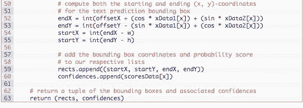

# 教程 | Adrian 小哥教程：如何使用 Tesseract 和 OpenCV 执行 OCR 和文本识别

选自 pyimagesearch

**作者：****Adrian Rosebrock**

**机器之心编译**

**参与：****路、张倩**

> 近期，Adrian Rosebrock 发布一篇教程，介绍了如何使用 OpenCV、Python 和 Tesseract 执行文本检测和文本识别。从安装软件和环境、项目流程、review 代码、实验结果，到展示局限、提出建议，这篇教程可以说十分详细了。机器之心对该教程进行了摘要编译介绍。

本教程将介绍如何使用 OpenCV OCR。我们将使用 OpenCV、Python 和 Tesseract 执行文本检测和文本识别。

之前的教程展示了如何使用 OpenCV 的 EAST 深度学习模型执行文本检测（参见 https://www.pyimagesearch.com/2018/08/20/opencv-text-detection-east-text-detector/）。使用该模型能够检测和定位图像中文本的边界框坐标。

那么下一步就是使用 OpenCV 和 Tesseract 处理每一个包含文本的图像区域，识别这些文本并进行 OCR 处理。

本教程将介绍如何构建自己的 OpenCV OCR 和文本识别系统！

**使用 Tesseract 进行 OpenCV OCR 和文本识别**

为了执行 OpenCV OCR 和文本识别任务，我们首先需要安装 Tesseract v4，包括一个用于文本识别的高度准确的深度学习模型。

然后，我将展示如何写一个 Python 脚本，使其能够：

1.  使用 OpenCV EAST 文本检测器执行文本检测，该模型是一个高度准确的深度学习文本检测器，可用于检测自然场景图像中的文本。

2.  使用 OpenCV 检测出图像中的文本区域后，我们提取出每个文本 ROI 并将其输入 Tesseract，从而构建完整的 OpenCV OCR 流程！

最后，我将展示一些使用 OpenCV 应用文本识别的示例，并讨论该方法的缺陷。

<mp-miniprogram class="miniprogram_element" data-miniprogram-appid="wxf424e2f3e2f94500" data-miniprogram-path="pages/technology/technology?id=9c38872b-5720-41cc-84ed-debc155db10c&amp;from=weapp" data-miniprogram-nickname="机器之心 Synced" data-miniprogram-avatar="http://mmbiz.qpic.cn/mmbiz_png/f3g058loLBj0Pib4UhuCFagffSB1RHImwskFzvic6mSp2LDhuerbXxeqqv0b63wSt2Pas7MicNWIcia358rlnhiaVag/0?wx_fmt=png" data-miniprogram-title="OpenCV" data-miniprogram-imageurl="http://mmbiz.qpic.cn/mmbiz_jpg/KmXPKA19gWicYvQomVZI6zr1BiahrsoANB9voY4YEItRZXl18gejukBONUpfTljRFBE8xuGK7vF2fjMRKWHbefpg/0?wx_fmt=jpeg"></mp-miniprogram>

下面就开始本教程的正式内容吧！

**如何安装 Tesseract v4**

*图 1：Tesseract OCR 引擎于 20 世纪 80 年代出现，到 2018 年，它已经包括内置的深度学习模型，变成了更加稳健的 OCR 工具。Tesseract 和 OpenCV 的 EAST 检测器是一个很棒的组合。*

Tesseract 是一个很流行的 OCR 引擎，20 世纪 80 年代由 Hewlett Packard 开发，2005 年开源，自 2006 年起由谷歌赞助开发。该工具在受控条件下也能很好地运行，但是如果存在大量噪声或者图像输入 Tesseract 前未经恰当处理，则性能较差。

深度学习对计算机视觉的各个方面都产生了影响，字符识别和手写字体识别也不例外。基于深度学习的模型能够实现前所未有的文本识别准确率，远超传统的特征提取和机器学习方法。Tesseract 纳入深度学习模型来进一步提升 OCR 准确率只是时间问题，事实上，这个时间已经到来。

Tesseract (v4) 最新版本支持基于深度学习的 OCR，准确率显著提高。底层的 OCR 引擎使用的是一种循环神经网络（RNN）——LSTM 网络。

**安装 OpenCV**

要运行本教程的脚本，你需要先安装 3.4.2 或更高版本的 OpenCV。安装教程可参考 https://www.pyimagesearch.com/opencv-tutorials-resources-guides/，该教程可确保你下载合适的 OpenCV 和 OpenCV-contrib 版本。

**在 Ubuntu 上安装 Tesseract 4**

在 Ubuntu 上安装 Tesseract 4 的具体命令因你使用的 Ubuntu 版本而异（Ubuntu 18.04、Ubuntu 17.04 或更早版本）。你可使用 lsb_release 命令检查 Ubuntu 版本：

如上所示，我的机器上运行的是 Ubuntu 18.04，不过你在继续操作之前需要先检查自己的 Ubuntu 版本。

对于 Ubuntu 18.04 版本的用户，Tesseract 4 是主 apt-get 库的一部分，这使得通过下列命令安装 Tesseract 非常容易：

如果你正在使用 Ubuntu 14、16 或 17 版本，那么由于依赖需求，你需要额外的命令行。

Alexander Pozdnyakov 创建了用于 Tesseract 的 Ubuntu PPA（https://launchpad.net/~alex-p/+archive/ubuntu/tesseract-ocr），大大简化了在 Ubuntu 旧版本上安装 Tesseract 4 的过程。

只需要向系统添加 alex-p/tesseract-ocr PPA 库，更新你的包定义，然后安装 Tesseract：

如果没有错误，那么你应该已经在自己的机器上成功安装了 Tesseract 4。

**在 macOS 上安装 Tesseract 4**

如果你的系统中安装有 Homebrew（macOS「非官方」包管理器），那么在 macOS 上安装 Tesseract 4 很简单。

只需要运行以下命令，确保指定 --HEAD，即可在 Mac 电脑上安装 Tesseract v4：

安装好之后，你可能想删除初始安装的链接：

接下来就可以运行安装命令了。

**验证你的 Tesseract 版本**

*图 2：我的系统终端截图。我输入 tesseract -v 命令来检查 Tesseract 版本。*

确保安装了 Tesseract 以后，你应该执行以下命令验证 Tesseract 版本：

只要输出中包含 tesseract 4，那么你就成功在系统中安装了 Tesseract 的最新版本。

**安装 Tesseract + Python 捆绑**

安装好 Tesseract 库之后，我们需要安装 Tesseract + Python 捆绑，这样我们的 Python 脚本就可以与 Tesseract 通信，并对 OpenCV 处理过的图像执行 OCR。

如果你使用的是 Python 虚拟环境（非常推荐，你可以拥有独立的 Python 环境），那么使用 workon 命令访问虚拟环境：

如上所示，我访问了一个叫做 cv 的 Python 虚拟环境（cv 是「计算机视觉」的缩写），你也可以用其他名字命名虚拟环境。

接下来，我们将使用 pip 来安装 Pillow（PIL 的 Python 版本），然后安装 pytesseract 和 imutils：

现在打开 Python shell，确认你导入了 OpenCV 和 pytesseract：

恭喜！如果没有出现导入错误，那么你的机器现在已经安装好，可以使用 OpenCV 执行 OCR 和文本识别任务了。

**理解 OpenCV OCR 和 Tesseract 文本识别**

*图 3：OpenCV OCR 流程图。*

现在我们已经在系统上成功安装了 OpenCV 和 Tesseract，下面我们来简单回顾一下流程和相关命令。

首先，我们使用 OpenCV 的 EAST 文本检测器来检测图像中的文本。EAST 文本检测器将提供文本 ROI 的边界框坐标。我们将提取每个文本 ROI，将其输入到 Tesseract v4 的 LSTM 深度学习文本识别算法。LSTM 的输出将提供实际 OCR 结果。最后，我们将在输出图像上绘制 OpenCV OCR 结果。

过程中使用到的 Tesseract 命令必须在 pytesseract 库下调用。在调用 tessarct 库时，我们需要提供大量 flag。最重要的三个 flag 是 -l、--oem 和 --ism。

-l flag 控制输入文本的语言，本教程示例中使用的是 eng（英语），在这里你可以看到 Tesseract 支持的所有语言：https://github.com/tesseract-ocr/tesseract/wiki/Data-Files。

--oem（OCR 引擎模式）控制 Tesseract 使用的算法类型。执行以下命令即可看到可用的 OCR 引擎模式：

我们将使用--oem 1，这表明我们希望仅使用深度学习 LSTM 引擎。

最后一个重要的 flag --psm 控制 Tesseract 使用的自动页面分割模式：

对文本 ROI 执行 OCR，我发现模式 6 和 7 性能较好，但是如果你对大量文本执行 OCR，那么你可以试试 3（默认模式）。

如果你得到的 OCR 结果不正确，那么我强烈推荐调整 --psm，它可以对你的输出 OCR 结果产生极大的影响。

**项目结构**

你可以从本文「Downloads」部分下载 zip。然后解压缩，进入目录。下面的 tree 命令使得我们可以在终端阅览目录结构：

我们的项目包含一个目录和两个重要文件：

*   images/：该目录包含六个含有场景文本的测试图像。我们将使用这些图像进行 OpenCV OCR 操作。

*   frozen_east_text_detection.pb：EAST 文本检测器。该 CNN 已经经过预训练，可用于文本检测。它是由 OpenCV 提供的，你也可以在「Downloads」部分下载它。

*   text_recognition.py：我们的 OCR 脚本。我们将逐行 review 该脚本。它使用 EAST 文本检测器找到图像中的文本区域，然后利用 Tesseract v4 执行文本识别。

**实现我们的 OpenCV OCR 算法**

现在开始用 OpenCV 执行文本识别吧！

打开 text_recognition.py 文件，插入下列代码：

本教程中的 OCR 脚本需要五个导入，其中一个已经内置入 OpenCV。

最显著的一点是，我们将使用 pytesseract 和 OpenCV。我的 imutils 包将用于非极大值抑制，因为 OpenCV 的 NMSBoxes 函数无法适配 Python API。我注意到 NumPy 是 OpenCV 的依赖项。

argparse 包被包含在 Python 中，用于处理命令行参数，这里无需安装。

现在已经处理好导入了，接下来就来实现 decode_predictions 函数：

decode_predictions 函数从第 8 行开始，在这篇文章中有详细介绍（https://www.pyimagesearch.com/2018/08/20/opencv-text-detection-east-text-detector/）。该函数：

1.  使用基于深度学习的文本检测器来检测（不是识别）图像中的文本区域。

2.  该文本检测器生成两个阵列，一个包括给定区域包含文本的概率，另一个阵列将该概率映射到输入图像中的边界框位置。

EAST 文本检测器生成两个变量：

*   scores：文本区域的概率。

*   geometry：文本区域的边界框位置。

两个变量都是 decode_predictions 函数的参数。

该函数处理输入数据，得出一个包含文本边界框位置和该区域包含文本的相应概率的元组：

*   rects：该值基于 geometry，其格式更加紧凑，方便我们稍后将其应用于 NMS。

*   confidences：该列表中的置信度值对应 rects 中的每个矩形。

这两个值都由 decode_predictions 函数得出。

注意：完美情况下，旋转的边界框也在 rects 内，但是提取旋转边界框不利于解释本教程的概念。因此，我计算了水平的边界框矩形（把 angle 考虑在内）。如果你想提取文本的旋转边界框输入 Tesseract，你可以在第 41 行获取 angle。

关于上述代码块的更多细节，参见 https://www.pyimagesearch.com/2018/08/20/opencv-text-detection-east-text-detector/。

下面我们来解析命令行参数：

我们的脚本需要两个命令行参数：

*   --image：输入图像的路径。

*   --east：预训练 EAST 文本检测器的路径。

下列命令行参数是可选的：

*   --min-confidence：检测到的文本区域的最小概率。

*   --width：图像输入 EAST 文本检测器之前需要重新调整的宽度，我们的检测器要求宽度是 32 的倍数。

*   --height：与宽度类似。检测器要求调整后的高度是 32 的倍数。

*   --padding：添加到每个 ROI 边框的（可选）填充数量。如果你发现 OCR 结果不正确，那么你可以尝试 0.05、0.10 等值。

下面，我们将加载和预处理图像，并初始化关键变量：

第 82 行和 83 行，将图像加载到内存中，并复制（这样稍后我们可以在上面绘制输出结果）。

获取原始宽度和高度（第 84 行），然后从 args 词典中提取新的宽度和高度（第 88 行）。我们使用原始和新的维度计算比率，用于稍后在脚本中扩展边界框坐标（第 89 和 90 行）。

然后调整图像大小，此处忽略长宽比（第 93 行）。

接下来，我们将使用 EAST 文本检测器：

第 99 到 101 行，将两个输出层名称转换成列表格式。然后，将预训练 EAST 神经网络加载到内存中（第 105 行）。

必须强调一点：你至少需要 OpenCV 3.4.2 版本，它有 cv2.dnn.readNet 实现。

接下来就是见证第一个「奇迹」的时刻：

为确定文本位置，我们：

*   在第 109 和 110 行构建 blob。详情参见 https://www.pyimagesearch.com/2017/11/06/deep-learning-opencvs-blobfromimage-works/。

*   将 blob 输入 EAST 神经网络中，获取 scores 和 geometry（第 111 和 112 行）。

*   使用之前定义的 decode_predictions 函数解码预测（第 116 行）。

*   通过 imutils 方法进行非极大值抑制（第 117 行）。NMS 高效使用概率最高的文本区域，删除其他重叠区域。

现在我们知道文本区域的位置了，接下来需要识别文本。我们开始在边界框上循环，并处理结果，为实际的文本识别做准备：

我们初始化 results 列表，使其包含我们的 OCR 边界框和文本（第 120 行）。然后在 boxes 上进行循环（第 123 行），我们：

*   基于之前计算的比率扩展边界框（第 126-129 行）。

*   填充边界框（第 134-141 行）。

*   最后，提取被填充的 roi（第 144 行）。

本文的 OpenCV OCR 流程可以使用一点 Tesseract v4「魔术」来完成：

第 151 行，我们设置 Tesseract config 参数（英语、LSTM 神经网络和单行文本）。

注：如果你获取了错误的 OCR 结果，那么你可能需要使用本教程开头的指令配置 --psm 值。

第 152 行，pytesseract 库进行剩下的操作，调用 pytesseract.image_to_string，将 roi 和 config string 输入其中。

只用两行代码，你就使用 Tesseract v4 识别了图像中的一个文本 ROI。记住，很多过程在底层发生。

我们的结果（边界框值和实际的 text 字符串）附加在 results 列表（第 156 行）中。

接下来，我们继续该流程，在循环的基础上处理其他 ROI。

现在，我们来打印出结果，查看它是否真正有效：

第 159 行基于边界框的 y 坐标按自上而下的顺序对结果进行了排序。

对结果进行循环，我们：

*   将 OCR 处理过的文本打印到终端（第 164-166 行）。

*   从文本中去掉非 ASCII 字符，因为 OpenCV 在 cv2.putText 函数中不支持非 ASCII 字符（第 171 行）。

*   基于 ROI 绘制 ROI 周围的边界框和结果文本（第 173-176 行）。

*   展示输出，等待即将按下的键（第 179、180 行）。

**OpenCV 文本识别结果**

现在我们已经实现了 OpenCV OCR 流程。

确保使用本教程「Downloads」部分下载源代码、OpenCV EAST 文本检测器模型和示例图像。

打开命令行，导航至下载和提取压缩包的位置，然后执行以下命令：

*图 4：对 OpenCV OCR 的第一次尝试成功！*

我们从一个简单示例开始。

注意我们的 OpenCV OCR 系统如何正确检测图像中的文本，然后识别文本。

下一个示例更具代表性，是一个现实世界图像：

*图 5：更复杂的图像示例，我们使用 OpenCV 和 Tesseract 4 对这个白色背景的标志牌进行了 OCR 处理。*

再次，注意我们的 OpenCV OCR 系统如何正确定位文本位置和识别文本。但是，在终端输出中，我们看到了一个注册商标 Unicode 符号，这里 Tesseract 可能被欺骗，因为 OpenCV EAST 文本检测器报告的边界框与标志牌后面的植物发生重叠。

下面我们来看另一个 OpenCV OCR 和文本识别示例：

*图 6：使用 OpenCV、Python 和 Tesseract 对包含三个单词的大标志牌进行 OCR 处理。*

该示例中有三个单独的文本区域。OpenCV 的文本检测器能够定位每一个文本区域，然后我们使用 OCR 准确识别每个文本区域。

下一个示例展示了在特定环境下添加填充的重要性：

 

*图 7：在这个烘培店场景图像中，我们的 OpenCV OCR 流程在处理 OpenCV EAST 文本检测器确定的文本区域时遇到了问题。记住，没有一个 OCR 系统完美适用于所有情况。那么我们能否通过更改参数来做得更好呢？*

首先尝试对这家烘培店的店面进行 OCR，我们看到「SHOP」被正确识别，但是：

1.  「CAPUTO」中的「U」被错误识别为「TI」。

2.  「CAPUTO'S」中的「'S」被漏掉。

3.  「BAKE」被错误识别为「|.」。

现在我们添加填充，从而扩展 ROI 的边界框坐标，准确识别文本：

*图 8：通过向 EAST 文本检测器确定的文本区域添加额外的填充，我们能够使用 OpenCV 和 Tesseract 对烘培店招牌中的三个单词进行恰当的 OCR 处理。*

仅仅在边界框的四角周围添加 5% 的填充，我们就能够准确识别出「BAKE」、「U」和「'S」。

当然，也有 OpenCV 的失败案例：

*图 9：添加了 25% 的填充后，我们的 OpenCV OCR 系统能够识别招牌中的「Designer」，但是它无法识别较小的单词，因为它们的颜色与背景色太接近了。我们甚至无法检测到单词「SUIT」，「FACTORY」能够检测到，但无法使用 Tesseract 识别。我们的 OCR 系统离完美还很远。*

下面介绍了该 OCR 系统的一些局限和不足，以及对改进 OpenCV 文本识别流程的建议。

**局限和不足**

记住，没有完美的 OCR 系统，尤其是在现实世界条件下。期望 100% 的 OCR 准确率也是不切实际的。

我们的 OpenCV OCR 系统可以很好地处理一些图像，但在处理另外一些图像时会失败。该文本识别流程失败存在两个主要原因：

1.  文本被扭曲或旋转。

2.  文本字体与 Tesseract 模型训练的字体相差太远。

即使 Tesseract v4 与 v3 相比更加强大、准确，但该深度学习模型仍然受限于训练数据。如果你的文本字体与训练数据字体相差太远，那么 Tesseract 很可能无法对该文本进行 OCR 处理。

其次，Tesseract 仍然假设输入图像/ROI 已经经过恰当清洁。而当我们在自然场景图像上执行文本识别时，该假设不总是准确。

**总结**

本教程介绍了如何使用 OpenCV OCR 系统执行文本检测和文本识别。

为了实现该任务，我们

1.  利用 OpenCV EAST 文本检测器定位图像中的文本区域。

2.  提取每个文本 ROI，然后使用 OpenCV 和 Tesseract v4 进行文本识别。

我们还查看了执行文本检测和文本识别的 Python 代码。

该 OpenCV OCR 流程在一些情况下效果很好，另一些情况下并不那么准确。要想获得最好的 OpenCV 文本识别结果，我建议你确保：

1.  输入 ROI 尽量经过清理和预处理。在理想世界中，你的文本应该能够与图像的其他部分完美分割，但是在现实情况下，分割并不总是那么完美。

2.  文本是在摄像机 90 度角的情况下拍摄的，类似于自上而下、鸟瞰的角度。如果不是，那么角度变换可以帮助你获得更好的结果。

以上就是这次的教程，希望对大家有所帮助！**

*原文链接：https://www.pyimagesearch.com/2018/09/17/opencv-ocr-and-text-recognition-with-tesseract/*

****本文为机器之心编译，**转载请联系本公众号获得授权****。**

✄------------------------------------------------

**加入机器之心（全职记者 / 实习生）：hr@jiqizhixin.com**

**投稿或寻求报道：**content**@jiqizhixin.com**

**广告 & 商务合作：bd@jiqizhixin.com**