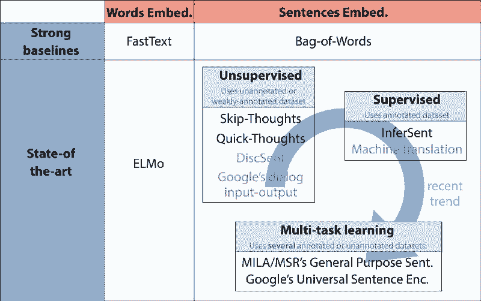
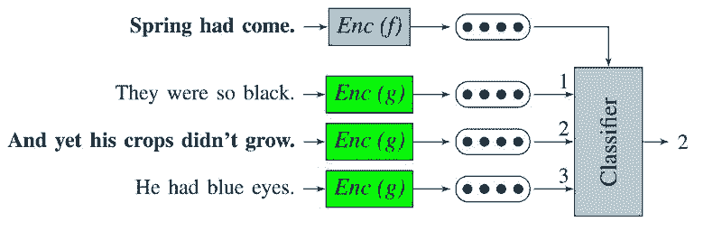
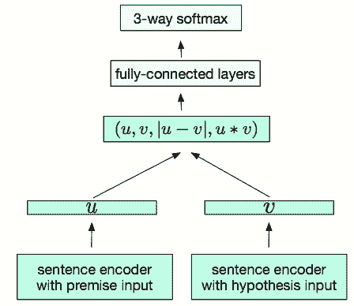

# 深度 | 当前最好的词句嵌入技术概览：从无监督学习转向监督、多任务学习

选自 Medium

**作者：Thomas Wolf**

****机器之心编译****

**参与：****Geek AI、刘晓坤**

> 本文是一篇对于当今最先进的通用词/句嵌入技术的简介，包括对比基线： FastText、词袋模型（Bag-of-Words）；以及最先进的模型：ELMo、Skip-Thoughts、Quick-Thoughts、InferSent、MILA 研究组和微软研究院提出的通用句子表征，以及谷歌的通用句子编码器。

词语和句子的嵌入已经成为了任何基于深度学习的自然语言处理系统必备的组成部分。

它们将词语和句子编码成稠密的定长向量，从而大大地提升通过神经网络处理文本数据的能力。

当前主要的研究趋势是追求一种通用的嵌入技术：在大型语料库中预训练的嵌入，它能够被添加到各种各样下游的任务模型中（情感分析、分类、翻译等），从而通过引入一些从大型数据集中学习到的通用单词或句子的表征来自动地提升它们的性能。

它是迁移学习的一种体现形式。

尽管在相当长的一段时间内，对句子的无监督表示学习已经成为了一种行业规范。但在最近的几个月里，人们开始逐渐转向监督学习和多任务学习，并且在 2017 年底/2018 年初提出了一些非常有趣的方案。

*近期的通用词/句嵌入的趋势：在本文中，作者将介绍上图中用黑体表示的模型。*

因此，本文是一篇对于当今最先进的通用词/句嵌入技术的简介，详细讨论了以下模型：

*   强大、快速的对比基线： FastText、词袋模型（Bag-of-Words）

*   最先进的模型：ELMo、Skip-Thoughts、Quick-Thoughts、InferSent、MILA 研究组和微软研究院提出的通用句子表征，以及谷歌的通用句子编码器。

让我们从词嵌入开始娓娓道来。

**最近的词嵌入研究进展**

在过去的五年中，人们提出了大量可行的词嵌入方法。目前最常用的模型是 word2vec 和 GloVe，它们都是基于分布假设（在相同的上下文中出现的单词往往具有相似的含义）的无监督学习方法。

尽管此后有一些研究（https://arxiv.org/abs/1805.04032）通过引入语义或者句法的监督信息来增强这些无监督方法，但是纯粹的无监督学习方法在 2017 年到 2018 年得到了令人关注的提升，最著名的是「FastText」（word2vec 的一种拓展）以及「ELMo」（目前最先进的基于上下文的词嵌入技术）。

FastText 由 Tomas Mikolov 的团队提出，他曾在 2013 年提出了著名的 word2vec 框架，引发了通用词嵌入技术的研究浪潮。

FastText 相对于原始的 word2vec 向量最主要的提升是它引入了 n 元字符（n-gram），这使得对没有在训练数据中出现的单词（词汇表外的单词）计算单词的表征成为了可能。

FastText 向量的训练速度非常快，并且可以在 GitHub 上获取通过「Wikipedia」和「Common Crawl」数据集上预训练好的版本。它们是非常棒的对比基线。

深度上下文单词表征（ELMo）在很大的程度上提高了目前最先进的词嵌入模型的性能。它们由 Allen 人工智能研究所研发，并将在 6 月初的 NAACL 2018（https://arxiv.org/abs/1802.05365）中展示。

*ELMo 能感知到丰富的单词的上下文知识*

ELMo 模型会为每一个单词分配一个表征，该表征是它们所属的整个语料库中的句子的一个函数。词嵌入将从一个两层的双向语言模型（LM）的内部状态中计算出来，因此该模型被命名为「ELMo」： Embeddings from Language Models（E 代表「嵌入」，LM 代表「语言模型」）。

ELMo 模型的特点：

*   ELMo 模型的输入是字符而不是单词。因此，它们可以利用子词单元的优势来计算有意义的单词表示，即使这些单词可能在词汇表之外（就像 FastText 一样）。

*   ELMo 是在双向语言模型中的一些层上的激励函数的串接。一个语言模型的不同层会对一个单词的不同类型的信息进行编码（例如，词性标注（Part-Of-Speech tagging）由双向 LSTM（biLSTM）的较低层很好地预测，而词义排歧则由较高层更好地进行编码）。将所有的层串接起来使得自由组合各种不同的单词表征成为了可能，从而在下游任务中得到更好的模型性能。

现在让我们转而讨论通用句子嵌入。

**通用句子嵌入的兴起**

 **

 **目前有许多相互竞争的学习句子嵌入的方案。尽管像平均词嵌入这样简单的基线也能够一直给出很好的实验结果，但一些新的类似于无监督和监督学习以及多任务学习的方法，在 2017 年底 2018 年初出现在了人们的视野中，并且取得了令人瞩目的性能提升。

让我们快速浏览一下目前研究出来的四种嵌入方法吧：从简单的词向量平均的基线到无监督/监督学习方法，以及多任务学习方案（如上文所述）。

在这个领域有一个广泛的共识（http://arxiv.org/abs/1805.01070），那就是：直接对句子的词嵌入取平均（所谓的词袋模型（Bag-of-Word，BoW））这样简单的方法可以为许多下游任务提供一个很强大的对比基线。

Arora 等人在 ICLR 2017 上提出了「A Simple but Tough-to-Beat Baseline for Sentence Embeddings」（https://openreview.net/forum?id=SyK00v5xx），这是一个很好的能够被用于计算这个基线（BoW）的算法，算法的大致描述如下：选择一个流行的词嵌入方法，通过词向量的线性的加权组合对一个句子进行编码，并且删除共有的部分（删除它们的第一个主成分上的投影）。这种通用的方法有更深刻和强大的理论动机，它依赖于一个生成模型，该生成模型使用了一个语篇向量上的随机游走生成文本。（这里不讨论理论细节。）

*「HuggingFace」对话的词袋模型的示意图。词袋模型弱化了词语的顺序关系，但保留了大量的语义和句法的信息。在 ACL 2018 上，Conneau 等人对此提出了有趣的见解（http://arxiv.org/abs/1805.01070）。*

除了简单的词向量平均，第一个主要的提议是使用无监督学习训练目标，这项工作是起始于 Jamie Kiros 和他的同事们在 2015 年提出的「Skip-thought vectors」（https://arxiv.org/abs/1506.06726）。

无监督方案将句子嵌入作为通过学习对一个句子中一致且连续的短句或从句进行预测的副产品来学习句子嵌入。理论上，这些方法可以利用任何包含以一致的方式并列的短句/从句的文本数据集。

「Skip-thoughts vector」是一个典型的学习无监督句子嵌入的案例。它可以被认为相当于为词嵌入而开发的「skip-gram」模型的句子向量，我们在这里试图预测一个给定的句子周围的句子，而不是预测一个单词周围的其他单词。该模型由一个基于循环神经网络的编码器—解码器结构组成，研究者通过训练这个模型从当前句子中重构周围的句子。

Skip-Thoughts 的论文中最令人感兴趣的观点是一种词汇表扩展方案：Kiros 等人通过在他们的循环神经网络词嵌入空间和一个更大的词嵌入空间（例如，word2vec）之间学习一种线性变换来处理训练过程中没有出现的单词。

「Quick-thoughts vectors」（https://openreview.net/forum?id=rJvJXZb0W）是研究人员最近对「Skip-thoughts vectors」的一个改进，它在今年的 ICLR 上被提出。在这项工作中，在给定前一个句子的条件下预测下一个句子的任务被重新定义为了一个分类问题：研究人员将一个用于在众多候选者中选出下一个句子的分类器代替了解码器。它可以被解释为对生成问题的一个判别化的近似。

该模型的运行速度是它的优点之一（与 Skip-thoughts 模型属于同一个数量级），使其成为利用海量数据集的一个具有竞争力的解决方案。

*「Quick-thoughts」分类任务示意图。分类器需要从一组句子嵌入中选出下一个句子。图片来自 Logeswaran 等人所著的「An efficient framework for learning sentence representations」。*

在很长一段时间内，人们认为监督学习技术比无监督学习技术得到的句子嵌入的质量要低一些。然而，这种假说最近被推翻了，这要部分归功于「InferSent」（https://arxiv.org/abs/1705.02364）的提出。

与之前详细讨论的无监督学习不同，监督学习需要一个带标签的数据集，为一些像自然语言推理（例如：有蕴含关系的句子对）或者机器翻译（例如：翻译前后的句子对）这样的任务进行标注。监督学习提出了以下两个问题：（1）如何选择特定任务？（2）若要获得高质量的嵌入，所需的数据集大小应该如何确定？在本文的下一节和最后一节，作者将会对多任务学习进行进一步的讨论。但在这之前，让我们一起来看看 2017 年发布的 InferSent 背后的原理。

InferSent 具有非常简单的架构，这使得它成为了一种非常有趣的模型。它使用 Sentence Natural Language Inference（NLI）数据集（该数据集包含 570,000 对带标签的句子，它们被分成了三类：中立、矛盾以及蕴含）训练一个位于句子编码器顶层的分类器。两个句子使用同一个编码器进行编码，而分类器则是使用通过两个句子嵌入构建的一对句子表征训练的。Conneau 等人采用了一个通过最大池化操作实现的双向 LSTM 作为编码器。

*一个用于对 Sentence Natural Language Inference 进行学习的有监督的句子嵌入模型（InferSent）。此图来自 A.Conneau 等人所著的「Supervised Learning of Universal Sentence Representations from Natural Language Inference Data」。*

InferSent 的成功不仅导致了对选择最佳的神经网络模型的探索，它还引发了对以下问题的研究：

> 哪种监督训练任务能够学到能更好地泛化到下游任务中去的句子嵌入呢？

多任务学习可以被视为对 Skip-Thoughts、InferSent，以及其他相关的无监督/监督学习方案的一种泛化，它通过试着将多个训练目标融合到一个训练方案中来回答这个问题（上文提到的问题）。

在 2018 年初，研究人员发布了一系列最新的多任务学习的方案。让我们快速的浏览一下 MILA 和微软研究院提出的「通用目的句子表征」和谷歌的「通用句子编码器」。

在 ICLR 2018 上发表的描述 MILA 和微软蒙特利尔研究院的工作的论文《Learning General Purpose Distributed Sentence Representation via Large Scale Multi-Task Learning》（https://arxiv.org/abs/1804.00079）中，Subramanian 等人观察到，为了能够在各种各样的任务中泛化句子表征，很有必要将一个句子的多个层面的信息进行编码。

因此，这篇文章的作者利用了一个一对多的多任务学习框架，通过在不同的任务之间进行切换去学习一个通用的句子嵌入。被选中的 6 个任务（对于下一个/上一个句子的 Skip-thoughts 预测、神经机器翻译、组别解析（constituency parsing），以及神经语言推理）共享相同的由一个双向门控循环单元得到的句子嵌入。实验表明，在增添了一个多语言神经机器翻译任务时，句法属性能够被更好地学习到，句子长度和词序能够通过一个句法分析任务学习到，并且训练一个神经语言推理能够编码语法信息。

谷歌在 2018 年初发布的的通用句子编码器（https://arxiv.org/abs/1803.11175）也使用了同样的方法。他们的编码器使用一个在各种各样的数据源和各种各样的任务上训练的转换网络，旨在动态地适应各类自然语言理解任务。该模型的一个预训练好的版本可以在 TensorFlow 获得。

以上就是我们对于通用的词语和句子嵌入的简要总结。

在过去的短短的几个月中，这个领域取得了很多令人瞩目的发展，并且在评价和探索这些嵌入的性能以及其内在的偏差/公平性的方面（这是讨论通用的嵌入时的一个真实存在的问题）有了很大的进步。

*原文链接：https://medium.com/huggingface/universal-word-sentence-embeddings-ce48ddc8fc3a*

****本文为机器之心编译，**转载请联系本公众号获得授权****。**

✄------------------------------------------------

**加入机器之心（全职记者/实习生）：hr@jiqizhixin.com**

**投稿或寻求报道：**content**@jiqizhixin.com**

**广告&商务合作：bd@jiqizhixin.com******