# 专栏 | 如何做好文本关键词提取？从三种算法说起

机器之心专栏

**作者：韩伟**

> **在自然语言处理领域，处理海量的文本文件最关键的是要把用户最关心的问题提取出来。**而无论是对于长文本还是短文本，往往可以通过几个关键词窥探整个文本的主题思想。与此同时，不管是基于文本的推荐还是基于文本的搜索，对于文本关键词的依赖也很大，关键词提取的准确程度直接关系到推荐系统或者搜索系统的最终效果。因此，关键词提取在文本挖掘领域是一个很重要的部分。
> 
> 关于文本的关键词提取方法分为有监督、半监督和无监督三种：
> 
> 1 有监督的关键词抽取算法
> 
> 它是建关键词抽取算法看作是二分类问题，判断文档中的词或者短语是或者不是关键词。既然是分类问题，就需要提供已经标注好的训练语料，利用训练语料训练关键词提取模型，根据模型对需要抽取关键词的文档进行关键词抽取
> 
> 2 半监督的关键词提取算法
> 
> 只需要少量的训练数据，利用这些训练数据构建关键词抽取模型，然后使用模型对新的文本进行关键词提取，对于这些关键词进行人工过滤，将过滤得到的关键词加入训练集，重新训练模型。
> 
> 3 无监督的方法
> 
> 不需要人工标注的语料，利用某些方法发现文本中比较重要的词作为关键词，进行关键词抽取。
> 
> **有监督的文本关键词提取算法需要高昂的人工成本，因此现有的文本关键词提取主要采用适用性较强的无监督关键词抽取。**其文本关键词抽取流程如下：
> 
> 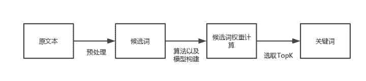
> 
> 图 1 无监督文本关键词抽取流程图
> 
> 无监督关键词抽取算法可以分为三大类，基于统计特征的关键词抽取、基于词图模型的关键词抽取和基于主题模型的关键词抽取。
> 
> NO.1
> 
> 文本关键词提取算法
> 
> 基于统计特征的关键词提取算法
> 
> 基于于统计特征的关键词抽取算法的思想是**利用文档中词语的统计信息抽取文档的关键词。**通常将文本经过预处理得到候选词语的集合，然后采用特征值量化的方式从候选集合中得到关键词。基于统计特征的关键词抽取方法的关键是采用什么样的特征值量化指标的方式，目前常用的有三类：
> 
> **1**
> 
> **基于词权重的特征量化**
> 
> 基于词权重的特征量化主要包括词性、词频、逆向文档频率、相对词频、词长等。
> 
> **2**
> 
> **基于词的文档位置的特征量化**
> 
> 这种特征量化方式是根据文章不同位置的句子对文档的重要性不同的假设来进行的。通常，文章的前 N 个词、后 N 个词、段首、段尾、标题、引言等位置的词具有代表性，这些词作为关键词可以表达整个的主题。
> 
> **3**
> 
> **基于词的关联信息的特征量化**
> 
> 词的关联信息是指词与词、词与文档的关联程度信息，包括互信息、hits 值、贡献度、依存度、TF-IDF 值等。
> 
> 下面介绍几种常用的特征值量化指标。
> 
> 词性
> 
> 词性时通过分词、语法分析后得到的结果。现有的关键词中，绝大多数关键词为名词或者动名词。一般情况下，名词与其他词性相比更能表达一篇文章的主要思想。但是，词性作为特征量化的指标，一般与其他指标结合使用。
> 
> 词频
> 
> 词频表示一个词在文本中出现的频率。一般我们认为，如果一个词在文本中出现的越是频繁，那么这个词就越有可能作为文章的核心词。词频简单地统计了词在文本中出现的次数，但是，只依靠词频所得到的关键词有很大的不确定性，对于长度比较长的文本，这个方法会有很大的噪音。
> 
> 位置信息
> 
> 一般情况下，词出现的位置对于词来说有着很大的价值。例如，标题、摘要本身就是作者概括出的文章的中心思想，因此出现在这些地方的词具有一定的代表性，更可能成为关键词。但是，因为每个作者的习惯不同，写作方式不同，关键句子的位置也会有所不同，所以这也是一种很宽泛的得到关键词的方法，一般情况下不会单独使用。
> 
> 互信息
> 
> 互信息是信息论中概念，是变量之间相互依赖的度量。互信息并不局限于实值随机变量，它更加一般且决定着联合分布 p(X,Y) 和分解的边缘分布的乘积 p(X)p(Y) 的相似程度。互信息的计算公式如下：
> 
> 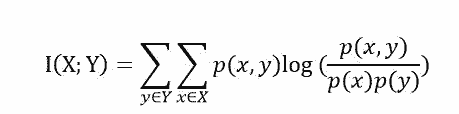
> 
> 其中，p(x,y)是 X 和 Y 的联合概率分布函数，p(x)和 p(y)分别为 X 和 Y 的边缘概率分布函数。
> 
> 当使用互信息作为关键词提取的特征量化时，应用文本的正文和标题构造 PAT 树，然后计算字符串左右的互信息。
> 
> 词跨度
> 
> 词跨度是指一个词或者短语字文中首次出现和末次出现之间的距离，词跨度越大说明这个词对文本越重要，可以反映文本的主题。一个词的跨度计算公式如下：
> 
> 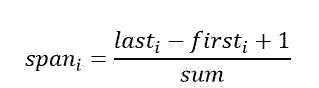
> 
> 其中，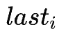表示词 i 在文本中最后出现的位置， 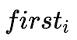表示词 i 在文本中第一次出现的位置，sum 表示文本中词的总数。
> 
> 词跨度被作为提取关键词的方法是因为在现实中，文本中总是有很多噪声（指不是关键词的那些词），使用词跨度可以减少这些噪声。
> 
> TF-IDF 值
> 
> 一个词的 TF 是指这个词在文档中出现的频率，假设一个词 w 在文本中出现了 m 次，而文本中词的总数为 n，那么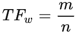。一个词的 IDF 是根据语料库得出的，表示这个词在整个语料库中出现的频率。假设整个语料库中，包含词 w 的文本一共有 M 篇，语料库中的文本一共有 N 篇，则
> 
> 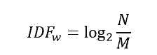
> 
> 由此可得词 w 的 TF-IDF 值为：
> 
> 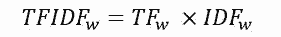
> 
> **TF-IDF 的优点是实现简单，相对容易理解。**但是，TFIDF 算法提取关键词的缺点也很明显，严重依赖语料库，需要选取质量较高且和所处理文本相符的语料库进行训练。另外，对于 IDF 来说，它本身是一种试图抑制噪声的加权，本身倾向于文本中频率小的词，这使得 TF-IDF 算法的精度不高。TF-IDF 算法还有一个缺点就是不能反应词的位置信息，**在对关键词进行提取的时候，词的位置信息，例如文本的标题、文本的首句和尾句等含有较重要的信息，应该赋予较高的权重。**
> 
> 基于统计特征的关键词提取算法通过上面的一些特征量化指标将关键词进行排序，获取 TopK 个词作为关键词。
> 
> 基于统计特征的关键词的重点在于特征量化指标的计算，不同的量化指标得到的结果也不尽相同。同时，不同的量化指标作为也有其各自的优缺点，在实际应用中，通常是采用不同的量化指标相结合的方式得到 Topk 个词作为关键词。
> 
> NO.2
> 
> 文本关键词提取算法
> 
> 基于词图模型的关键词抽取算法
> 
> 基于词图模型的关键词抽取首先要构建文档的语言网络图，然后对语言进行网络图分析，在这个图上寻找具有重要作用的词或者短语，这些短语就是文档的关键词。语言网络图中节点基本上都是词，根据词的链接方式不同，语言网络的主要形式分为四种：**共现网络图、语法网络图、语义网络图和其他网络图。**
> 
> 在语言网络图的构建过程中，都是以预处理过后的词作为节点，词与词之间的关系作为边。语言网络图中，边与边之间的权重一般用词之间的关联度来表示。在使用语言网络图获得关键词的时候，需要评估各个节点的重要性，然后根据重要性将节点进行排序，选取 TopK 个节点所代表的词作为关键词。节点的重要性计算方法有以下几种方法。
> 
> **1**
> 
> **综合特征法**
> 
> 综合特征法也叫社会网络中心性分析方法，这种方法的核心思想是节点中重要性等于节点的显著性，以不破坏网络的整体性为基础。此方法就是从网络的局部属性和全局属性角度去定量分析网络结构的拓扑性质，常用的定量计算方法如下。
> 
> 度
> 
> ## 
> 
> 节点的度是指与该节点直接向量的节点数目，表示的是节点的局部影响力，对于非加权网络，节点的度为：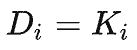对于加权网络，节点的度又称为节点的强度，计算公式为：
> 
> 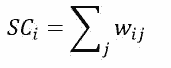
> 
> ## 接近性
> 
> ## 
> 
> 节点的接近性是指节点到其他节点的最短路径之和的倒数，表示的是信息传播的紧密程度，其计算公式为：
> 
> 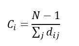
> 
> 特征向量
> 
> ## 
> 
> 特征向量的思想是节点的中心化测试值由周围所有连接的节点决定，即一个节点的中心化指标应该等于其相邻节点的中心化指标之线性叠加，表示的是通过与具有高度值的相邻节点所获得的间接影响力。特征向量的计算公式如下：
> 
> 
> 集聚系数
> 
> 节点的集聚系数是它的相邻的节点之间的连接数与他们所有可能存在来链接的数量的比值，用来描述图的顶点之间阶级成团的程度的系数，计算公式如下：
> 
> 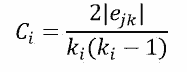
> 平均最短路径
> 
> 节点的平局最短路径也叫紧密中心性，是节点的所有最短路径之和的平均值，表示的是一个节点传播信息时对其他节点的依赖程度。如果一个节点离其他节点越近，那么他传播信息的时候也就越不需要依赖其他人。一个节点到网络中各点的距离都很短，那么这个点就不会受制于其他节点。计算公式如下：
> 
> 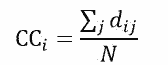
> 
> 因为每个算法的侧重方向的不同，在实际的问题中所选取的定量分析方法也会不一样。同时，对于关键词提取来说，也可以和上一节所提出的统计法得到的词的权重，例如词性等相结合构建词搭配网络，然后利用上述方法得到关键词。
> 
> **2**
> 
> **系统科学法**
> 
> 系统科学法进行中心性分析的思想是节点重要性等于这个节点被删除后对于整个语言网络图的破坏程度。重要的节点被删除后会对网络的呃连通性等产生变化。如果我们在网络图中删除某一个节点，图的某些指定特性产生了改变，可以根据特性改变的大小获得节点的重要性，从而对节点进行筛选。
> 
> **3**
> 
> **随机游走法**
> 
> 随机游走算法时网络图中一个非常著名的算法，它从给定图和出发点，随机地选择邻居节点移动到邻居节点上，然后再把现在的节点作为出发点，迭代上述过程。
> 
> **随机游走算法一个很出名的应用是大名鼎鼎的 PageRank 算法，PageRank 算法是整个 google 搜索的核心算法，是一种通过网页之间的超链接来计算网页重要性的技术，其关键的思想是重要性传递。**在关键词提取领域， Mihalcea 等人所提出的 TextRank 算法就是在文本关键词提取领域借鉴了这种思想。
> 
> PageRank 算法将整个互联网看作一张有向图，网页是图中的节点，而网页之间的链接就是图中的边。根据重要性传递的思想，如果一个大型网站 A 含有一个超链接指向了网页 B，那么网页 B 的重要性排名会根据 A 的重要性来提升。网页重要性的传递思想如下图所示：
> 
> 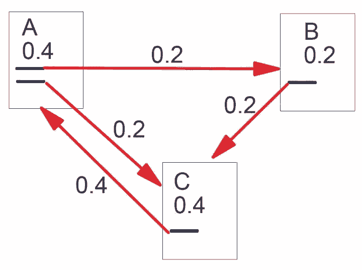
> 
> 图 2 PageRank 简单描述（来自 PageRank 论文）
> 
> 在 PageRank 算法中，最主要的是对于初始网页重要性（PR 值）的计算，因为对于上图中的网页 A 的重要性我们是无法预知的。但是，在原始论文中给出了一种迭代方法求出这个重要性，论文中指出，幂法求矩阵特征值与矩阵的初始值无关。那么，就可以为每个网页随机给一个初始值，然后迭代得到收敛值，并且收敛值与初始值无关。
> 
> PageRank 求网页 i 的 PR 值计算如下：
> 
> 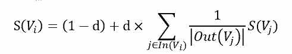
> 
> 其中，d 为阻尼系数，通常为 0.85。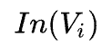是指向网页 i 的网页集合。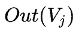是指网页 j 中的链接指向的集合，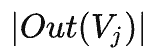是指集合中元素的个数。
> 
> TextRank 在构建图的时候将节点由网页改成了句子，并为节点之间的边引入了权值，其中权值表示两个句子的相似程度。其计算公式如下：
> 
> 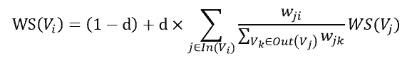
> 
> 公式中的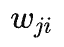为图中节点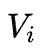和的边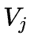的权重。其他符号与 PageRank 公式相同。
> 
> TextRank 算法除了做文本关键词提取，还可以做文本摘要提取，效果不错。但是 TextRank 的计算复杂度很高，应用不广。
> 
> NO.3
> 
> 文本关键词提取算法
> 
> 基于主题模型的关键词抽取
> 
> ## **基于主题关键词提取算法主要利用的是主题模型中关于主题的分布的性质进行关键词提取。算法步骤如下：**
> 
> **1 获取候选关键词从文章中获取候选关键词。即将文本分词，也可以再根据词性选取候选关键词。2 语料学习根据大规模预料学习得到主题模型。3 计算文章主题分部根据得到的隐含主题模型，计算文章的主题分布和候选关键词分布。4 排序计算文档和候选关键词的主题相似度并排序，选取前 n 个词作为关键词。
> 
> **算法的关键在于主题模型的构建。**主题模型是一种文档生成模型，对于一篇文章，我们的构思思路是先确定几个主题，然后根据主题想好描述主题的词汇，将词汇按照语法规则组成句子，段落，最后生成一篇文章。
> 
> 主题模型也是基于这个思想，它认为文档是一些主题的混合分布，主题又是词语的概率分布，pLSA 模型就是第一个根据这个想法构建的模型。同样地，我们反过来想，我们找到了文档的主题，然后主题中有代表性的词就能表示这篇文档的核心意思，就是文档的关键词。
> 
> pLSA 模型认为，一篇文档中的每一个词都是通过一定概率选取某个主题，然后再按照一定的概率从主题中选取得到这个词语，这个词语的计算公式为：
> 
> 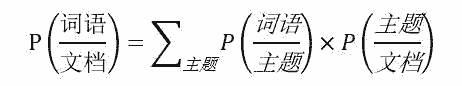
> 
> 一些贝叶斯学派的研究者对于 pLSA 模型进行了改进，他们认为，文章对应主题的概率以及主题对应词语的概率不是一定的，也服从一定的概率，于是就有了现阶段常用的主题模型--LDA 主题模型。
> 
> LDA 是 D.M.Blei 在 2003 年提出的。LDA 采用了词袋模型的方法简化了问题的复杂性。在 LDA 模型中，每一篇文档是一些主题的构成的概率分布，而每一个主题又是很多单词构成的一个概率分布。同时，无论是主题构成的概率分布还是单词构成的概率分布也不是一定的，这些分布也服从 Dirichlet 先验分布。
> 
> 文档的生成模型可以用如下图模型表示：
> 
> 其中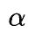和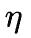为先验分布的超参数，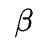为第 k 个主题下的所有单词的分布，为文档的主题分布，w 为文档的词，z 为 w 所对应的主题。
> 
> 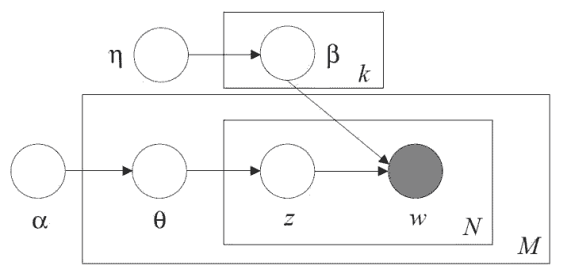
> 
> 图 3 Blei 在论文中的图模型
> 
> DA 挖掘了文本的深层语义即文本的主题，用文本的主题来表示文本的也从一定程度上降低了文本向量的维度，很多人用这种方式对文本做分类，取得了不错的效果。**具体 LDA 的算法在请参考[《一文详解 LDA 主题模型》。](http://mp.weixin.qq.com/s?__biz=MzA5NzY0MDg1NA==&mid=2706954183&idx=1&sn=e2362ba048d737932c65d6e1d7deb249&chksm=b431bf3e83463628c8575f31ee6b95848f0cdd44582fd0dcd3ef59cb1d08c1beaa318fa44092&scene=21#wechat_redirect)**
> 
> LDA 关键词提取算法利用文档的隐含语义信息来提取关键词，但是主题模型提取的关键词比较宽泛，不能很好的反应文档主题。另外，对于 LDA 模型的时间复杂度较高，需要大量的实践训练。
> 
> NO.4
> 
> 文本关键词提取算法
> 
> 应用
> 
> 现阶段，文本的关键词提取在基于文本的搜索、推荐以及数据挖掘领域有着很广泛的应用。同时在实际应用中，因为应用环境的复杂性，对于不同类型的文本，例如长文本和短文本，用同一种文本关键词提取方法得到的效果并相同。因此，在实际应用中针对不同的条件环境所采用的算法会有所不同，没有某一类算法在所有的环境下都有很好的效果。
> 
> 相对于上文中所提到的算法，一些组合算法在工程上被大量应用以弥补单算法的不足，例如将 TF-IDF 算法与 TextRank 算法相结合，或者综合 TF-IDF 与词性得到关键词等。同时，工程上对于文本的预处理以及文本分词的准确性也有很大的依赖。对于文本的错别字，变形词等信息，需要在预处理阶段予以解决，分词算法的选择，未登录词以及歧义词的识别在一定程度上对于关键词突提取会又很大的影响。
> 
> **关键词提取是一个看似简单，在实际应用中却十分棘手的任务，从现有的算法的基础上进行工程优化，达观数据在这方面做了很大的努力并且取得了不错的效果。**
> 
> NO.5
> 
> 文本关键词提取算法
> 
> 总结
> 
> 本文介绍了三种常用的无监督的关键词提取算法，并介绍了其优缺点。关键词提取在文本挖掘领域具有很广阔的应用，现有的方法也存在一定的问题，我们依然会在关键词提取的问题上继续努力研究，也欢迎大家积极交流。
> 
> ## 参考文献
> [1] TextRank 算法提取关键词和摘要 http://xiaosheng.me/2017/04/08/article49/
> 
> [2] Page L, Brin S, Motwani R,et al. The PageRank citation ranking: Bringing order to the web[R]. StanfordInfoLab, 1999.
> 
> [3] 刘知远. 基于文档主题结构的关键词抽取方法研究[D]. 北京: 清华大学, 2011.
> 
> [4] tf-idf，https://zh.wikipedia.org/zh-hans/Tf-idf
> 
> [5] 一文详解机器领域的 LDA 主题模型 https://zhuanlan.zhihu.com/p/31470216
> 
> [6] Blei D M, Ng A Y, Jordan MI. Latent dirichlet allocation[J]. Journal of machine Learning research, 2003,3(Jan): 993-1022.
> 
> [7] 赵京胜, 朱巧明, 周国栋, 等. 自动关键词抽取研究综述[J]. 软件学报, 2017,28(9): 2431-2449.
> 
> A
> 
> BOUT
> 
> 作者简介
> 
> 韩伟：达观数据数据挖掘工程师，负责达观数据文本方面的挖掘与应用。主要参与达观数据标签提取与文本分类系统的构建与实现，对深度学习，NLP 数据挖掘领域有浓厚兴趣。
> 
> ****本文为机器之心经授权转载，**转载请联系原公众号获得授权****。**
> 
> ✄------------------------------------------------
> 
> **加入机器之心（全职记者/实习生）：hr@jiqizhixin.com**
> 
> **投稿或寻求报道：editor@jiqizhixin.com**
> 
> **广告&商务合作：bd@jiqizhixin.com****