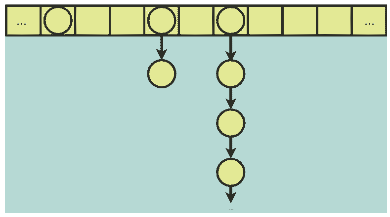
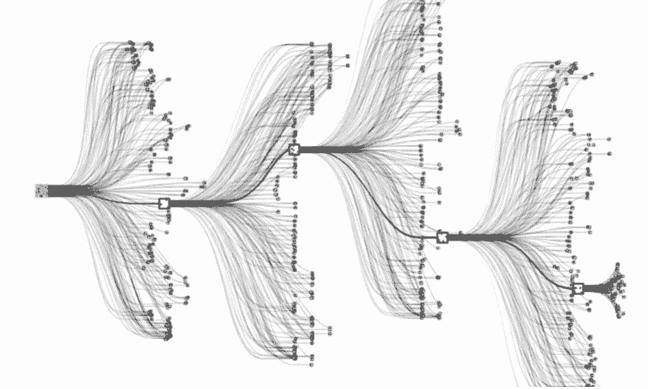
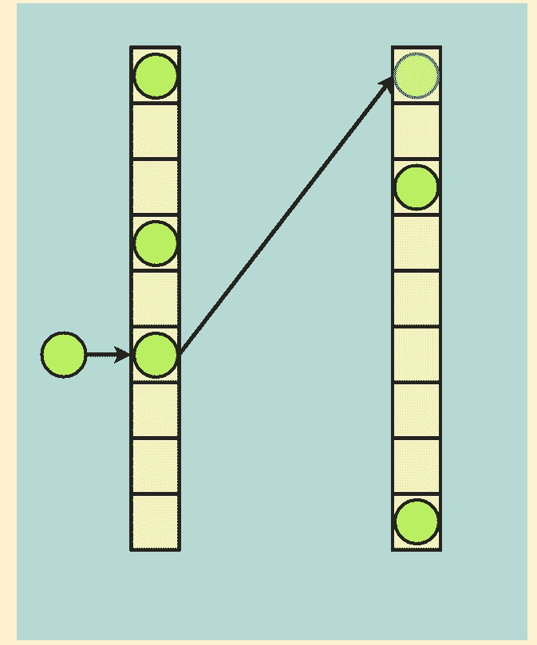
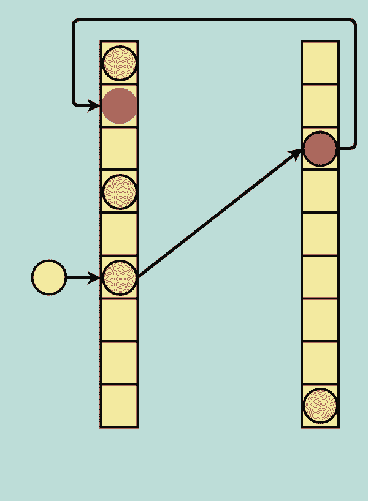

# 机器学习时代的哈希算法，将如何更高效地索引数据

选自 blog.bradfieldcs

**作者：****Tyler Elliot Bettilyon**

**机器之心编译**

> 哈希算法一直是索引中最为经典的方法，它们能高效地储存与检索数据。但在去年 12 月，Jeff Dean 与 MIT 等研究者将索引视为模型，探索了深度学习模型学习的索引优于传统索引结构的条件。本文首先将介绍什么是索引以及哈希算法，并描述在机器学习与深度学习时代中，如何将索引视为模型学习比哈希算法更高效的表征。

2017 年 12 月，谷歌和麻省理工学院的研究人员发表了一篇研究论文 The Case for Learned Index Structures，该论文介绍了他们在「学习型索引结构」方面做出的探索。这些研究非常令人兴奋，正如作者在摘要中所述：

> 「[…] 我们相信通过可学习的模型取代数据管理系统核心组件的想法对未来的系统设计有着深远的影响，而我们这项工作对于未来的发展仅仅是惊鸿一瞥。」

事实上，谷歌和麻省理工学院研究人员提出的这项研究工作可以同索引世界中最为经典有效的 B-Tree 和哈希图（Hash Map）相匹敌。工程界对机器学习的未来早已有了许多的观点，因此这篇研究论文已经在 Hacker News，Reddit 乃至世界上所有的工业论坛中获得了广泛的关注和讨论。

新的研究是重新审视一个领域基础的绝佳机会，而且像索引等基础性并且已经获得足够研究的技术很少会有机会取得更大的突破。本文作为哈希表的入门性介绍，简要介绍了影响其快慢的主要因素，并为应用于索引构建技术的机器学习概念提供了直观性理解。

针对谷歌/麻省理工学院合作发表的工作，Peter Bailis 和斯坦福大学的研究团队回顾了索引构建的基础知识，并劝诫我们不要扔掉经典的算法书。Bailis 和他在斯坦福大学的团队重新构建了可学习型索引策略，并且通过使用名为 Cuckoo Hashing 的经典哈希表策略，在不使用任何机器学习技术的条件下取得了相似的结果。

在另一个对谷歌/麻省理工学院合作发表的工作的回应中，Thomas Neumann 描述了另一种实现与学习型索引策略相似性能的方式，这种方式仍然使用了经过长久测试和深入理解的 B-Tree。当然，这些讨论、对比实验和对进一步研究的要求，正是谷歌/麻省理工学院团队为之激动的理由，他们在论文中写道：

> 「需要特别强调的是：我们并不是要呼吁完全用学习型索引结构来替代传统的索引结构。相反的是，我们勾画出了一个全新的索引构建方法，它可以弥补现有工作的不足，甚至可以说是在已经有数十年历史的研究领域中打开了一个全新的研究方向。」

那么，究竟是什么引起了人们如此的关注？哈希图和 B-Trees（多路搜索树）是否注定要被新技术所淘汰？机器是否即将重写算法教科书？如果机器学习策略真的比我们所知道和喜爱的通用索引策略更好，那么它对计算机世界又意味着什么呢？学习型索引在什么情况下会超越旧的索引方式呢？

为了解决这些问题，我们需要理解什么索引，它们解决了什么问题以及是什么决定了不同索引之间的优劣差异。

**什么是索引**

索引的核心是要提高信息查询和检索的便捷性。早在计算机发明之前，人类就一直在对事物进行索引。当我们使用整齐的文件柜时，我们使用的是一个索引系统。全卷百科全书可被视为一种索引策略，杂货店里的标签过道也是一种索引。当我们有许多东西并且需要在集合中找到或识别特定的物品时，索引可以让我们查询的过程变得更加高效便捷。

Zenodotus，亚历山大大图书馆的第一任馆员，负责组织管理图书馆庞大的馆藏。他设计的系统包括按照流派将书籍分组放入房间，并按字母顺序放置书本。他的同行 Callimachus 走得更远，引入了一个名为 pinakes 的中央目录，它允许图书管理员查找作者，并确定该作者的每本书在图书馆中的位置。包括 1876 年被发明的杜威十进制系统（Dewey Decimal System）在内，许许多多的图书馆索引构建方式相继被发明出来。

在亚历山大图书馆，索引被用于将一段信息（书或作者的名字）映射到图书馆内的物理位置。尽管我们的计算机是数字设备，但计算机中的任何特定数据实际上都驻留在至少一个物理位置。无论是文本、最近的信用卡交易记录还是视频，数据都存在于计算机上的某个物理磁盘位置。

在 RAM 和固态硬盘驱动器中，数据作为电压存储在一系列晶体管中。在较老的旋转硬盘驱动器中，数据以磁盘格式存储在磁盘的特定圆弧上。当我们将计算机中的信息编入索引时，我们创建了一些算法，将部分数据映射到计算机中的物理位置。我们称这个地址为地址。在计算机中，被索引的信息全部都是以比特形式存在的数据，索引用于将这些数据映射到它们的地址。

数据库是索引编制的典型用例。数据库旨在保存大量信息，并且一般来说，我们希望高效地检索这些信息。搜索引擎的核心是对互联网上可用信息的庞大索引，哈希表、二叉搜索树、字典树、B-树和布隆过滤器都是索引的形式。

很容易想象在亚历山大图书馆的迷宫大厅找到具体书籍会有多难，但我们不应该理所当然地认为人类产生数据的大小呈指数级增长。互联网上人们可以获取到的数据量远远超过任何时代的任何单个图书馆的容量，而谷歌的目标是将所有数据都编入索引。人类为索引创造了许多策略，我们在本文讨论了历史上最多产的数据结构之一，并且恰好是一种索引结构的哈希表。

**什么是哈希表**

初看起来，哈希表是基于哈希函数的简单数据结构，我们有许多种行为不同并且被用于不同目的的哈希函数。在接下来的部分中，我们将只描述哈希表中使用的哈希函数，而不对加密哈希函数、校验和或任何其他类型的哈希函数展开讨论。

哈希函数接受一些输入值（例如数字或文本）并返回一个整数，我们称之为哈希码或哈希值。对于任何给定相同的输入，哈希码总是相同的，这意味着哈希函数必须是确定性的。

在构建哈希表时，我们首先为哈希表分配一些空间（在内存或磁盘中），我们可以视为创建一个任意大小的新数组。如果我们有很多数据，我们可能会使用较大的数组，如果我们只有少量数据，则可以使用更小的数组。任何时候我们想索引一个单独的数据，就需要创建一个键值对，其中键（Key）是关于数据的一些标识信息，而值（Value）是数据本身。

我们需要将值插入哈希表中，将数据的键发送给哈希函数。哈希函数返回一个整数（哈希码），我们使用这个整数（以数组的大小为模）作为我们数组中数值的存储索引。如果我们想从哈希表中检索值，我们只需重新计算键中的哈希码并从数组中的该位置获取数据，这个位置就是我们数据的物理地址。

在使用杜威十进制系统的图书馆中，「键」是书本所属的一系列分类，「值」是书本身。「哈希码」是我们使用杜威十进制过程创建的数值，例如一本解析几何编码得到了 516.3 的「哈希码」，自然科学是 500、数学是 510、几何是 516、解析几何是 516.3。在这种方式下，杜威十进制系统可以被视为书籍的哈希函数，然后这些书将被放在与其哈希值对应的一组书架上，并按作者的字母顺序排列在书架内。

我们的比喻不是特别地完美，与杜威十进制数字不同，哈希表中用于索引的哈希值通常不会提供信息——在完美的比喻中，图书馆目录将包含每本书基于某一条相关信息的确切位置（可能是其标题，也许是作者的姓氏，也许是它的 ISBN 号码......），但除非所有具有相同键的书籍被放在同一个书架上，并且我们可以使用键在库目录中查找到书架编号，否则书籍的分组或排序就是没有意义的。

从根本上来说，这个简单的过程全都是由哈希表来完成的。然而，为了确保哈希索引的正确性和效率，我们又在此基础上构建了许多复杂的部分。

**基于哈希索引的性能考量**

哈希表中复杂性和优化的主要来源是哈希冲突（hash collisions）问题。当两个或更多个键产生相同的哈希码时会发生冲突。考虑如下的一个简单的哈希函数，我们假定其中的键为整数：

```py
function hashFunction(key) {
  return (key * 13) % sizeOfArray; 
}
```

虽然任何唯一的整数在乘以 13 时会产生唯一的结果，但由于鸽巢原理（Pigeonhole principle），我们无法在每个桶只放一个物品的情况下将 6 个物品放入 5 个桶中，最终的哈希码仍然会重复出现。因为我们的存储量是有限的，所以我们不得不使用哈希值来对数组的大小取模，因此我们总会遇到冲突。

我们马上会讨论处理这些不可避免的冲突时所采用的常用策略，但首先应该注意的是，哈希函数的选择可以增加或减少冲突的几率。想象一下，我们总共有 16 个存储位置，且必须从如下两个函数中选择一个作为哈希函数：

```py
function hash_a(key) {
  return (13 * key) % 16;
}

function hash_b(key){
  return (4 * key) % 16;
}
```

在这种情况下，如果我们要对数字 0-32 进行哈希，hash_b 会产生 28 个冲突或重叠。7 个冲突分别产生于哈希值 0、4、8 和 12（前四个插入不发生冲突，但是后面的每个插入都会发生冲突）。然而，hash_a 会平均分散冲突，每个索引冲突 1 次，总共碰撞 16 次。这是因为在 hash_b 中，4 是哈希表大小 16 的一个因子，因为我们在 hash_a 中选择了一个素数，除非我们的表大小是 13 的倍数，我们不会遇到选择 hash_b 时的分组问题。

我们可以运行下面的脚本来观察这一过程：

```py
function hash_a(key) {
  return (13 * key) % 16;
}

function hash_b(key){
  return (4 * key) % 16;
}

let table_a = Array(16).fill(0);
let table_b = Array(16).fill(0);

for(let i = 0; i < 32; i++) {
  let hash_code_a = hash_a(i);
  let hash_code_b = hash_b(i);

  table_a[hash_code_a] += 1;
  table_b[hash_code_b] += 1;
}

console.log(table_a); // [2,2,2,2,2,2,2,2,2,2,2,2,2,2,2,2]
console.log(table_b); // [8,0,0,0,8,0,0,0,8,0,0,0,8,0,0,0]
```

*好的哈希函数可以在表中更均匀地分布哈希码间的冲突。*

这种哈希策略，将输入的键乘以素数是一种非常常见的做法。质数减少了输出哈希码与数组大小共有一个公因式的可能性，从而减少了碰撞发生的可能。由于哈希表已经存在了相当长的一段时间，因此有很多不同种类的优秀哈希函数可供选择。

乘法移位哈希（Multiply-shift hashing）与 素数取模策略类似，但避免了相对昂贵的模运算，有利于快速进行移位操作。MurmurHash 和 Tabulation Hashing 是乘法移位哈希函数家族的强力替代品。对这些哈希函数进行的基准测试包括检查它们的计算速度，生成的哈希码的分布以及它们处理不同类型数据（例如除整数以外的字符串和浮点数）的灵活性。

如果我们选择一个好的哈希函数，我们可以降低冲突率并且仍然保持较高的计算速度。不幸的是，无论我们选择什么哈希函数，冲突总是难以避免的，决定如何处理冲突将对我们哈希表的整体性能产生重大影响。碰撞处理的两个常用策略是链接（Chaining）和线性探测（Linear Probing）。

链接简单易用，我们不是在哈希表的每个索引处存储每个条目，而是存储链表的头部指针。当一个条目通过我们的哈希函数与一个已经填充的索引相冲突时，我们将它添加为链表中的最后一个元素。查找不再是严格的「常数项时间」，因为我们必须遍历链表来查找特定项目。如果我们的哈希函数存在很多冲突，我们将会有很长的链。此外，由于对于长链的查找，哈希表的性能会随着时间的推移而降低。



*链接：重复的冲突会创建更长的链接列表，但不会占用数组的其它索引。*

线性探测在概念上很简单，但实现起来还是很麻烦的。在线性探测中，我们仍然为每个元素在哈希表保留一个索引。当索引 i 发生冲突时，我们检查索引 i + 1 是否为空，如果是，我们将数据存储在那里，如果 i + 1 也有一个元素，我们检查 i + 2，然后 i + 3 等，直到找到一个空插槽。只要我们找到一个空插槽，我们就将该值插入。相似地，我们可能无法实现常数级时间复杂度的查找，并且如果在一个索引中遇到多个冲突，那么我们最终将不得不搜索一系列长序列，然后才能找到要查找的条目。更重要的是，每当冲突发生时，后续发生冲突的几率都会增加。因为与链接不同，每个传入的项目最终会都占据一个新的索引。


*线性探测：给定与上面链接图像相同的数据和哈希函数，我们得到一个新的结果。导致冲突的元素（红色）现在驻留在同一个数组中，并从冲突索引开始按顺序占据索引。*

可能听起来链接是更好的选择，但线性探测往往被认为具有更好的性能特征。大多数情况下，这是由于链表的缓存利用率较差以及使用数组有利于提高缓存利用率。简答来说，检查链表中的所有链接比检查相同大小数组的所有索引要慢得多。这是因为每个数组中的索引在物理上相邻，而在链表中，每个新节点在创建时都会被赋予一个位置。这个新节点不一定与链表中的相邻节点在物理上相邻。其结果是，在链表中，列表顺序中「彼此相邻」的节点在 RAM 芯片内的物理位置上并不实际相邻。由于 CPU 高速缓存的工作原理，访问相邻内存位置的速度很快，而随机访问内存位置的速度则要慢得多。

**机器学习基础**

为了理解机器学习是如何重建哈希表（和其他索引）的关键特征的，有必要快速重新审视一下统计模型的主要思想。在统计学中，模型是可以接受一些向量为输入并返回标签（分类模型）或数据值（回归模型）的函数。输入向量包含所有数据点的相关信息，输出的标签或数据是模型的预测值。

在预测高校学生能否进入哈佛学习的模型中，输入向量可能包含学生的 GPA、SAT 成绩、参加的课外俱乐部的数量以及其他与学术成就相关的值；输出的标签可以是 True 或 False（可以进入哈佛或不可以进入哈佛）。

在预测抵押贷款违约率的模型中，输入向量可能包含信用值、信用卡账户数量、逾期付款频率、年收入以及与申请抵押人财务状况相关的其他值，该模型会返回一个 0 到 1 范围内的数字代表违约的可能性。

一般而言，可以用机器学习建立统计学模型。机器学习从业者将大量数据和机器学习算法相结合，在数据集上运行算法得到的结果是训练好的模型。机器学习的核心在于创造可以自动从原始数据中建立准确模型的算法，该算法无需人工帮助机器「理解」这些数据实际上表示什么。这与其他形式的人工智能，如人类广泛考察数据、告诉计算机这些数据的意义（如定义启发式）以及定义计算机如何使用这些数据（如使用极小极大算法或 A* 寻路算法）是不同的。尽管在实践中，机器学习常常和经典的非学习技术相结合；AI 智能体一般会同时使用学习和非学习策略以完成目标。

以著名的 AI 象棋棋手「深蓝」和最近广受关注的 AI 围棋棋手「AlphaGo」为例。深蓝是完全的非学习 AI；程序员和象棋专家合作为深蓝创建了一个函数，该函数以棋局状态为输入（所有棋子的位置以及棋手的回合），返回的值与该位置有多「好」相关。深蓝从不「学习」任何东西——人类棋手编写了机器的评估函数。深蓝的主要特征是树搜索算法，该算法计算了所有可能的落子处、以及对手对这些落子方法可能做出的回应以及未来可能会产生的移动。



*AlphaGo 树搜索的可视化。（来源：https://blogs.loc.gov/maps/category/game-theory/）*

AlphaGo 执行的也是树搜索。与深蓝的相似之处在于，AlphaGo 预测了可能的每一步之后的好几步，而不同点在于 AlphaGo 在没有围棋专家明确指导的情况下建立了其自己的评估函数。在这种情况中，评估函数是一个训练好的模型。AlphaGo 的机器学习算法将棋盘状态（每一个位置是黑子、白子还是没有棋子）作为输入向量，标签表示了哪一方的棋手（白棋或黑棋）会赢。使用这些信息，机器学习算法在数十万种游戏中都可以确定该如何评估当前状态。AlphaGo 通过观察数以百万的例子教会自己在哪落子赢得游戏的可能性更高。

**将模型作为索引，背离 ML 范式**

谷歌的研究人员首先在他们的文章中提出索引是模型的前提，或者说至少可以将机器学习模型当索引用。理由是：模型是接受一些输入，然后返回一个标签的机器；如果输入是关键词，而标签是模型对内存地址的判断，模型就可以当索引用。尽管听起来很清晰明了，但是索引的问题似乎不能完美契合于机器学习。在一些领域中，谷歌团队已经离开了机器学习范式以实现他们自己的目标。

一般情况下，机器学习模型是在已知数据上训练，目标是评估没见到的数据。若我们对数据进行索引，就没法接受评估值。索引唯一的用处在于得到内存中一些数据的确切定位。一个箱子外的神经网络（或其他机器学习器）无法精确到这种程度。谷歌通过在训练过程中追踪最大（正）和最小（负）误差以解决这个问题。将这些值作为边界，ML 索引可以在界限内进行搜索，找到元素的确切位置。

另一个出发点是机器学习从业者一般都要小心避免他们的模型对训练数据「过拟合」；一个「过拟合」模型会在训练数据上产生很高的预测准确率，但在训练集以外的数据上表现得很糟糕。另一方面，从定义上讲，索引是过度拟合的。训练集是被索引过的数据，这也使其成为测试集。由于查找必须发生在索引的实际数据上，在这种机器学习的应用上更容易遇到过拟合的问题。同时，如果模型已经对现有数据过拟合了，再向索引添加项目可能会在预测时造成可怕的错误；正如文章中所述：

> 「在这个模型的普遍性和『最后一英里』的表现间发生了有趣的取舍；可以这么说，『最后一英里』的预测结果越好，模型的过拟合就越严重，就越不适用于新的数据项目。」

最后，一般而言，模型的训练过程是整个过程中最昂贵的部分。不幸的是，在广泛的数据库应用程序（和其他索引应用程序）中，将数据添加到索引中是很常见的。该团队坦言这方面的限制：

> 「迄今为止，我们的结果都将注意力集中在只读存储区数据库系统的索引结构上。正如我们已经指出的那样，目前的设计，即使没有任何重大的修改，也已经可以替换现在的数据库中的索引结构了——前者的索引结构可能每天只更新一次，而后者则需要在合并 SSTable 的过程中批量创建 B-树。」——（SSTable 是谷歌的「BigTable」的重要元件）

**学习哈希**

本文研究了使用机器学习模型代替标准哈希函数的可能性。研究人员们想要了解的问题之一是：了解数据的分布可以帮助我们更好地创建索引吗？用我们之前讨论过的传统的策略（移位乘法、Murmur Hash、素数乘法……），完全忽略了数据的分布。每一个传入的项目都被视为独立的值，而非作为具有数值属性的较大数据集的一部分考虑的。结果是，即使在很多先进的哈希表中，也存在大量空间浪费的问题。

实现哈希表的内存利用率只有约 50%，这意味着哈希表占用了数据存储实际所需空间的两倍。也就是说，当我们存储与数组中存储数量一样多的项时，有一半的地址是空的。用机器学习模型替换标准哈希表中的哈希函数，研究人员发现浪费的空间显著减少了。

这并非特别令人意外的结果：通过在输入数据上进行训练，学习到的哈希函数可以在一些空间更均匀地分布数值，因为 ML 模型已经知道了数据的分布！这是一种强有力的、可以显著减少基于哈希的索引所需存储量的方式。相应的也有一些限制：ML 模型比我们上面所述的标准哈希函数计算得要慢一些，而且需要训练，但标准哈希函数不需要。

也许可以将基于哈希函数的 ML 用于关键在于有效的内存使用的情况，但是在这些情况中计算能力不再是瓶颈。谷歌和麻省理工的研究团队认为数据库就是一个很好的例子，因为索引在很昂贵的过程中每天重建一次；使用更多的计算时间以达到显著的节省内存的目的，这对许多数据库环境而言都是一场胜利。

但在此还是要有一个超展开，接下来进入布谷鸟哈希。

**布谷鸟哈希（Cuckoo Hashing）**

布谷鸟哈希发明于 2001 年，以布谷鸟类的名字命名。布谷鸟哈希是用链接技术和线性探测处理哈希冲突的替代（而非哈希函数的替代）。该策略一如其名，因为某些布谷鸟种类中，准备产卵的雌鸟会找到一个有主的巢，并将巢里的蛋挪出去，然后把自己的蛋下在里面。在布谷鸟哈希中，传入的数据会窃取旧数据的地址，就像布谷鸟会窃取别的鸟类的巢一样。

工作原理如下：当创建哈希表时将表分为两个空间，将这两个空间分别称为主地址空间和次地址空间。之后，分别初始化两个哈希函数，每一个函数分配给一个地址空间。这些哈希函数有可能非常相似——例如它们可能都属于「素数乘法」，其中每个哈希函数都会使用不同的素数。将这两个函数称为主哈希函数和次哈希函数。

最初，插入布谷鸟哈希只会利用主哈希函数和主地址空间。当哈希冲突发生时，新数据会驱逐旧数据，然后用次哈希函数对旧数据进行哈希，并将其放入次地址空间中。



*用于哈希冲突的布谷鸟哈希：黄色数据驱逐绿色数据，绿色数据在第二地址空间找到了新家（在次要空间顶部索引的淡绿色圆点）。*

如果该次要地址已经被占用，则会再一次进行驱逐，在次要空间的数据会被发送回主要地址空间。因为有可能造成无限循环的驱逐，一般而言会设置一个每次插入驱逐的阈值；如果驱逐次数到达阈值，就会重建哈希表，重建过程可能包括为该表分配更多空间或是选择新的哈希函数。



*二次驱逐（Double eviction）：传入的黄色圆点驱逐了绿色的，绿色的驱逐红色的，红色圆点在主地址空间找到了归宿（淡红色圆点）。*

众所周知，这种策略在内存受限的情况下是非常有效的。所谓「二次幂（power of two choices）」就允许布谷鸟哈希即便在高利用率的情况下也有很稳定的表现（这在链接技术或线性探索中是不会出现的）。

Bails 和他在斯坦福的研究团队发现，只要进行适当优化，布谷鸟哈希可以非常快，即使在利用率高达 99% 的情况下，也能有不错的表现（http://dawn.cs.stanford.edu/2018/01/11/index-baselines/）。从本质上讲，布谷鸟哈希通过利用二次幂可以在无需昂贵训练阶段的情况下实现「机器学习」的高度利用。

**索引的下一步是什么？**

最终，每个人都对学习索引结构的潜力感到兴奋。随着更多 ML 工具的广泛应用，以及像 TPU 这样硬件的进步使得机器学习工作负载更快，索引可以从机器学习策略中受益良多。与此同时，像布谷鸟哈希（cuckoo hashing）这样漂亮的算法提醒我们，机器学习并不是万能的。融合了具有令人难以置信的力量的机器学习技术和像「二次幂」这样的旧理论的工作将继续推动计算机效率和能力的界限。

看起来，索引的基本原理不会一夜之间就被机器学习策略替代，但是自微调索引的想法是强大而令人兴奋的概念。随着我们越来越善用机器学习，以及在提升计算机处理机器学习工作负载的效率上做出的不断的努力，利用这些优势的新想法肯定会找到其主流用途。下一代 DynamoDB 或 Cassandra 可能也会很好地利用机器学习策略；日后 PostgreSQL 或 MySQL 的应用也会采用这样的策略。最终，这都取决于未来研究所能取得的成就，这些成就会继续建立在最先进的非线性策略和「AI 革命」的尖端技术上。

出于必要性的考虑，本文简化了许多细节。想要了解更多细节的读者请参阅：

*   The Case For Learned Indexes (Google/MIT) (https://www.arxiv-vanity.com/papers/1712.01208/)

*   Don't Throw Out Your Algorithms Book Just Yet: Classical Data Structures That Can Outperform Learned Indexes (Stanford) (http://dawn.cs.stanford.edu/2018/01/11/index-baselines/)

*   A Seven-Dimensional Analysis of Hashing Methods and its Implications on Query Processing (https://bigdata.uni-saarland.de/publications/p249-richter.pdf) (Saarland University)

*原文链接：https://blog.bradfieldcs.com/an-introduction-to-hashing-in-the-era-of-machine-learning-6039394549b0*

 ******本文为机器之心编译，**转载请联系本公众号获得授权****。**

✄------------------------------------------------

**加入机器之心（全职记者/实习生）：hr@jiqizhixin.com**

**投稿或寻求报道：editor@jiqizhixin.com**

**广告&商务合作：bd@jiqizhixin.com****