# 从七桥问题开始：全面介绍图论及其应用

选自 Medium

**作者：Vardan Grigoryan**

**机器之心编译**

> 图论是计算机科学中最重要、最有趣的领域之一，同时也是最容易被误解的。本长文从图论最基础的七桥问题开始，进而结合推特与 Facebook 实例解释无向图与有向图。此外，本文还是用大量的实例解释表征图、搜索树、哈希表等关键概念。最后本文描述了基于深度的搜索和基于广度的搜索等十分流行的图算法。

理解和使用图帮助我们成为更好的程序员。用图思考帮助我们成为最好的，至少我们应该那么思考。图是很多节点 V 和边 E 的集合，即可以表示为有序对 G=(V, E)。

尽管尝试研究过图论，也实现了一些算法，但是我还是非常困惑，因为它实在太无聊了。

事实上，理解一件事物的最佳方式是理解其应用。我们将展示图论的多个应用，最重要的是，有很多插图。


**七桥问题**

让我们首先从《图论的起源》中的「柯尼斯堡（Königsberg）的七座桥」开始。在加里宁格勒（Kaliningrad）有七座桥，连接着由普雷戈里亚（Pregolya）河分割而成的两个岛屿和两大陆地。

在 18 世纪，这里被称为柯尼斯堡，隶属普鲁士，这一区域有很多桥。当时，有一个与柯尼斯堡的桥相关的脑筋急转弯：如何只穿过桥一次而穿过整个城市。下图为柯尼斯堡七座桥的简化图。


你可以尝试一下，在穿过每座桥仅一次的情况下穿过这个城市。每座桥，意味着所有桥都被穿过；只穿过一次，意味着每座桥不能被穿越两次及以上。如果你对这一问题有所了解，就知道这不可能。


*Leonhard Euler *

有时候，放弃这一问题是合理的。这就是 Leonhard Euler 的解决方法，他没有试图解决这一问题，而是证明其不可解决。让我们试着去理解 Euler 的内在想法，做到像 Euler 一样思考。首先我们从下图开始。


图中有四块彼此分隔的区域，两个岛屿和两块陆地，以及七座桥。探讨每一区域的桥数是否有一定模式很有趣。

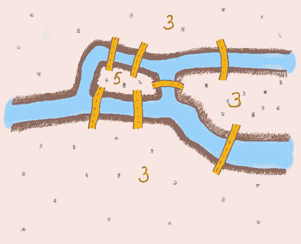

*每块区域的桥数*

如图所示，每块区域的桥数皆为奇数。如果你只能穿过桥一次，区域有两座桥，那么你就可以进入并离开该区域。


*有两座桥的区域的示例*

通过图示很容易发现，如果你通过一座桥进入一个区域，那么你也要通过第二座桥离开它。但是当第三座桥出现，则无法只穿过桥一次而离开。所以对于一块区域，当桥数为偶时，则可以每座桥只穿过一次而离开；当桥数为奇时，则不能。请牢记。

让我们再添加一座新桥，如下图所示，看看其是否能解决问题。

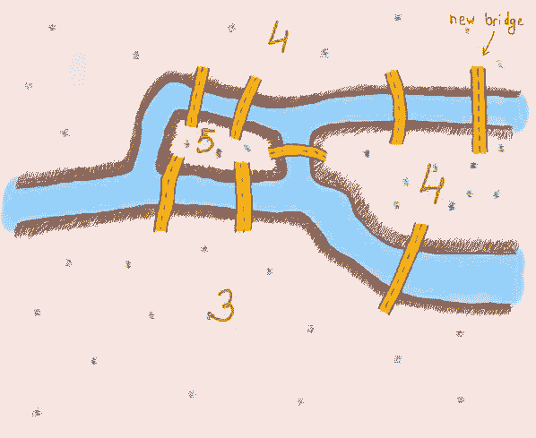

*注意添加的新桥*

现在我们有两个偶数和两个奇数。让我们在添加新桥的图上画一条新路线。


我们已经看到了桥的奇偶数是重要的。这里有个问题：桥的数量解决问题了吗？难道这个数不应该一直是偶数吗？后来发现不是的。这就是 Euler 做的，他发现了一个显示桥数量很重要的办法。更有意思的事，有奇数个连接点的「陆地」也很重要。这时候 Euler 开始把陆地和桥转化成我们看得懂的图。下面是一幅表示了哥尼斯堡七桥（Königsberg bridges）的图（注意：我们「临时」加的桥不在这里）：


*抽象化七桥问题*

问题的泛化和提取是需要注意的。当你解决一个特定问题时，最重要的是为类似的问题概括答案。在这个实际问题里，Euler 的任务是泛化过桥问题从而在将来可以解决类似的问题。比如：对于世界上所有的桥。可视化也可以帮助我们从另一个角度看问题，如下面的图也全是七桥问题的抽象：

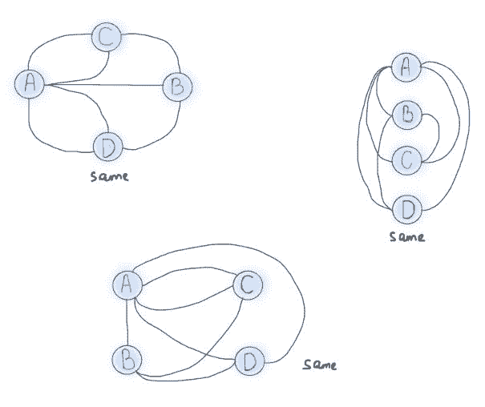

所以，可视化图是解决该问题的好选择，因此我们需要去找出哥尼斯堡七桥问题是怎样被这张图解决的。注意从圈里面向外出来的线。因此我们命名圈为节点（或节点），连接他们的线为边。你也许看到了字母表达法，V 是节点（vertex），E 是边（edge）。

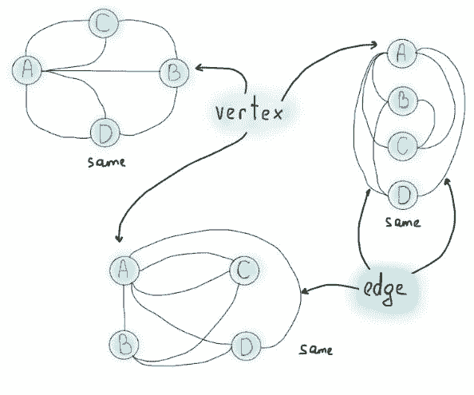

下一个重要的事是所谓节点自由度（Degree），即连接到节点的边数量。在我们上面的例子里，连接陆地和桥的边的数量可以被表达成节点的自由度。

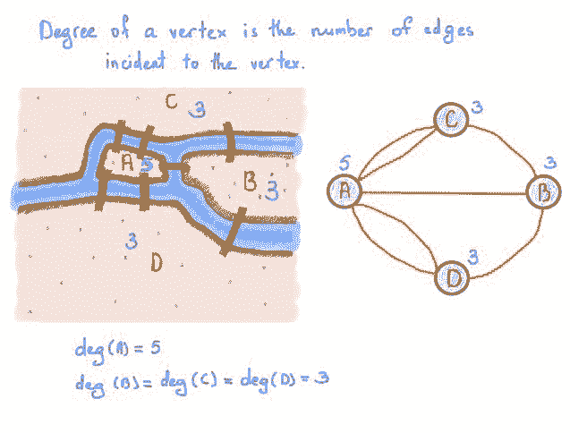

在 Euler 的努力下，他证明了在图上（城市里）每次只走过一条边（桥）并且走过每一条边是严格取决于节点自由度。由这样的边组成的路径被叫做 Euler 路径（Euler path），Euler 路径的长度就是边的数量。

*   有限无向图 G(V,E) 的 Euler 路径是指 G 的每一个边都只出现一次的路径。如果 G 有一条 Euler 路径，它就被称之 Euler 图。[注释 1]

*   定理：有且仅有两个确定的节点存在奇数自由度，其它的节点都有偶数自由度，那么该有限无向图为 Euler 图。【1】

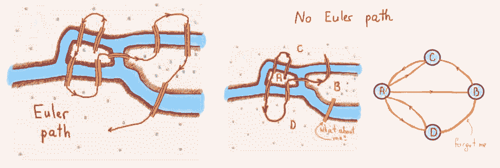

*左图：有两个节点有奇数自由度的图像。右图：所有节点都有奇数自由度。*

首先，让我们分清楚上面定理和理论中的新名词。有限图（Finite graph）是指有限数量的边和节点的图。

图可以为有向的或无向的，这也是图非常有趣的性质。你肯定看到过将 Facebook 和 Twitter 的作为有向图和无向图的例子。Facebook 朋友关系也许可以很简单地表示为一个无向图，因为如果 Alice 是 Bob 的朋友的话，Bob 也必须是 Alice 的朋友。

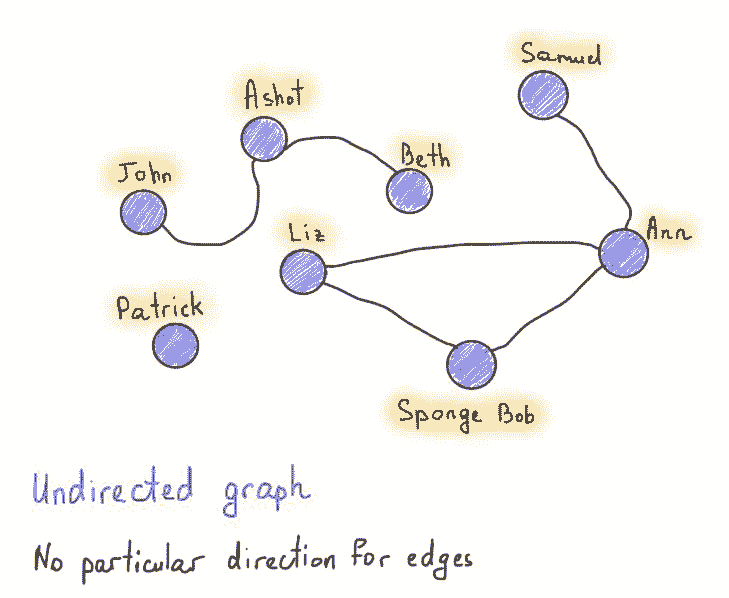

而且也要注意「Patrick」节点，因为它没有连接一条边（edges）。虽然它还是图的一部分，但在这个案例中我们可以说该图没有连接上，这是个失联图（disconnected graph）（「John」、「Ashot」和「Beth」也是同样的，因为它们是和别的节点都是分离的）。在一个连接的图里没有到达不了的节点，这里必须在每一对节点之间有一条路。

与 Facebook 的例子相反的是，如果 Alice 在 Twitter 上关注了 Bob，Bob 并不需要关注 Alice。所以「关注」关系必须是有向的连接，其表示节点（用户）有一条有向边（关注）连接到其它的节点（用户）。

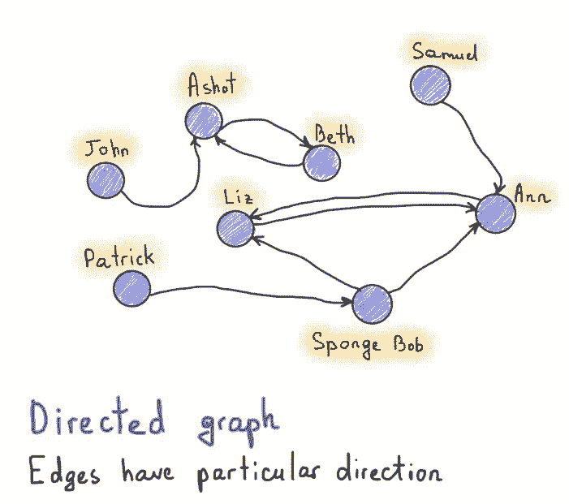

现在，我们了解了什么是有限无向图，让我们再一次思考 Euler 图：

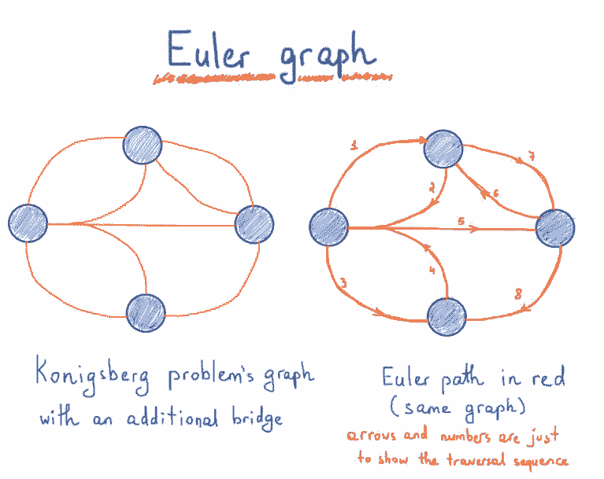

所以为什么我们最开始就讨论了哥尼斯堡七桥问题和 Euler 图呢？在接触答案之前接触一下问题背后的因素（节点、边、有向、无向）也能避免枯燥的理论方法。我们现在应该更关注于用电脑表示图，因为这是我们最大的兴趣。用电脑程序表示图将使我们设计出一个算法来跟踪图路径（graph path），这样就能发现它是不是 Euler 路径了。

**图表征：前言**

这是一个很沉闷的任务，要有耐心。记得数组和链表之间的战争吗？用如果你需要快速访问元素就用数组，如果你需要快速插入/删除元素就用链表等。我很难相信你会在像「怎样表示列表」这样的问题上纠结。当然，在图论中真正的表达是非常无聊的，因为首先你应该决定你将怎样确切地表达图。

现在我们以一个树来开始。你肯定已经至少一次见到了二叉树（下面的不是二叉搜索树）。

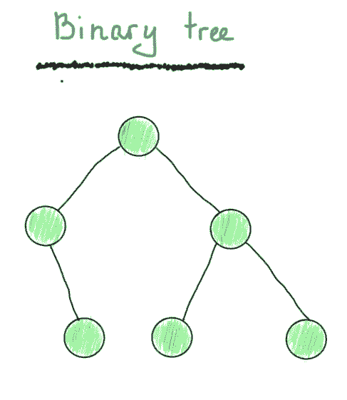

因为它是由节点和边构成的，所以它就是图。你也要想到一般最常见的二叉树是怎样表示的（至少在教科书上）。

```py
struct BinTreeNode
{
  T value; // don't bother with template<>
  TreeNode* left;
  TreeNode* right;
};
class BinTree
{
public:
  // insert, remove, find, bla bla
private:
  BinTreeNode* root_;
};
```

这个对于已经非常熟悉树的人来说太详细了，但是我必须确保我们在同一阶段。（注意我们还是在用伪代码）。

```py
BinTreeNode<Apple>* root = new BinTreeNode<Apple>("Green");

root->left = new BinTreeNode<Apple>("Yellow");
root->right = new BinTreeNode<Apple>("Yellow 2");

BinTreeNode<Apple>* yellow_2 = root->right;

yellow_2->left = new BinTreeNode<Apple>("Almost red");
yellow_2->right = new BinTreeNode<Apple>("Red"); 
```

如果你不是新手，仔细的读上面的伪代码然后阅读以下图解：

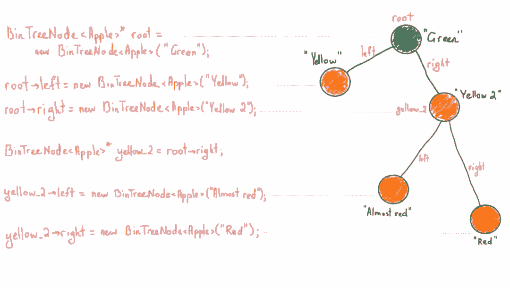

当一个二叉树是简单的节点「集合」，每一个父节点有左子节点和右子节点的节点。二叉树在应用简单规则的时候是非常有意义的，例如允许快速的关键字查找。二叉搜索树（BST）按序储存他们的关键字。我们可以根据任何规则实现二叉树（即使它会根据不同的规则而有不同的名字，比如，min—heap 或者 max——heap），最常见的 BST 规则是它符合二项搜索性质（也是名字的由来），即「任意节点的键值必须比它左边子树的键值要大，比右边子树上的键值要小。「更大」是 BST 重要的本质，当你把它改成「比更大或一样」时，你的 BST 可以在插入新节点时解决复制键值得问题，除此之外它将只保留唯一键值的节点。你可以在网上找到很好的二项树的文章，我们不会提供一个二元搜索树的全面实现，但我们将展示一个简单的二元搜索树。

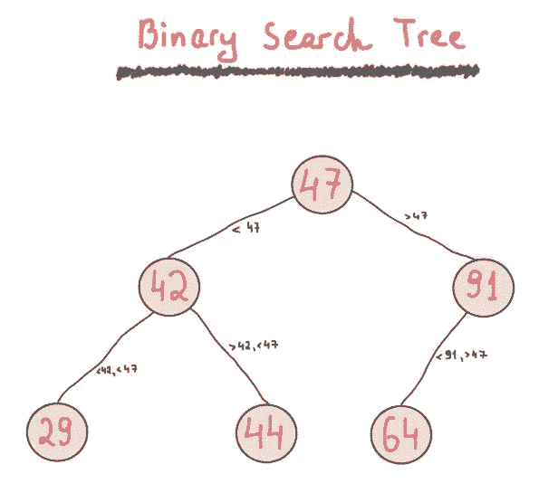

**Airbnb**

树是非常有用的数据结构，你也许还没有实现过树型结构，但你也许无意间用过它们。像你注意到的，二叉搜索树（Binary Search Tree）中有「搜索」，简单来说，所有需要快速查找的事，应该被放到二叉搜索树中。「应该」不意味着一定，在编程中最重要的事情是用合适的工具去解决问题。这里有很多案例可以看到简单链表（O(N) 复杂度）搜索相比 BST（O(logN) 复杂度）搜索更受欢迎。一般来说我们可以用一个库来实现一个 BST，但是在这个教程中我们可以重新发明我们自己的轮子（BST 是基本在所有多用途编程语言库都有实现）。接近了「一个真实世界例子」，这里是我们试着去处理的问题：

Airbnb 房源搜索一瞥：


怎样用滤波器基于词条尽可能快的搜索房源，这是一项很难的任务。如果我们考虑到 Airbnb 储存了几百万条表格的情况下，这个任务更难了。

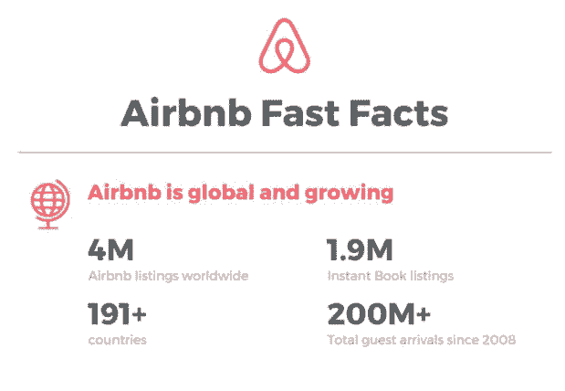

所以当用户搜索房源时，他们也许就会「接触」到四百万条数据库中的记录。的确，在网站主页上能够展现的「top listings」有限，而用户对浏览百万条列表也并不感兴趣。我没有任何 Airbnb 的分析记录, 但我们可以用编程语言中叫做「假设」的强大工具，所以我们假设单个用户查看最多 1 千个房源就会发现中意的房源。并且最重要的因子是即时用户的数量，因为它会影响数据结构、数据库和项目构架的选择。就像这看起来的那么明显，如果这里总共有 100 个用户，我们就不用去操心。相反，如果即时用户数量超过了百万级，我们必须去思考每一个决定到底对不对。每个决策都被正确的使用，这是为什么巨头们雇佣最好的人才，为提供卓越的服务而努力的原因（Google、Facebook、Airbnb、Netflix、Amazon、Twitter 和许多其他公司都在处理大量的数据；招聘正确的工程师来做正确的选择，为数百万实时用户每秒处理百万级字节的数据。这就是为什么我们码农纠结于可能遇见的数据结构，算法和问题处理，因为需要的是工程师有能力快速、有效地解决这样大的问题）。

所以在 Airbnb 的案例里，用户浏览了他们的房源主页，Airbnb 试着去过滤房源来找出最适合的。我们怎样处理这个问题呢？（注意这个问题是后端的，所以我们不需要管前端或者网络流量或者 https over http 或者 Amazon EC2 over home cluster 等。首先，因为我们已经熟悉了程序员仓库中最强大的工具（在说假设而不是抽象），我们假设处理的是完全适配 RAM 的数据。然后你也可以假设我们的 RAM 是足够大的。足够大去支持，但这是多大呢？这是另一个非常好的问题。需要多大的内存来存储真正的数据呢？如果我们处理的是四百万单元的数据（还是假设），如果我们大概知道每一个单元的大小，之后我们可以简单地驱动需要的内存，就是 4M*sizeof(one_unit)。考虑下「房源」及其性质（properties），事实上，至少考虑一下处理这一问题必要的性质（一个「房源」是我们的单元）。我们需要用 C++结构伪代码来表示一些问题，你可以简单地将他们转化为一个 MongoDB 略图目标或者任何你想要的形式, 我们只讨论性质的名字和类别。（试着去想象这是在空间经济里用字位段或者位集合）

```py
// feel free to reorganize this struct to avoid redundant space
// usage because of aligning factor
// Remark 1: some of the properties could be expressed as enums,
// bitset is chosen for as multi-value enum holder.
// Remark 2: for most of the count values the maximum is 16
// Remark 3: price value considered as integer,
// int considered as 4 byte.
// Remark 4: neighborhoods property omitted 
// Remark 5: to avoid spatial queries, we're 
// using only country code and city name, at this point won't consider 
// the actual coordinates (latitude and longitude)
struct AirbnbHome
{
  wstring name; // wide string
  uint price;
  uchar rating;
  uint rating_count;
  vector<string> photos; // list of photo URLs
  string host_id;
  uchar adults_number;
  uchar children_number; // max is 5
  uchar infants_number; // max is 5
  bitset<3> home_type;
  uchar beds_number;
  uchar bedrooms_number;
  uchar bathrooms_number;
  bitset<21> accessibility;
  bool superhost;
  bitset<20> amenities;
  bitset<6> facilities;
  bitset<34> property_types;
  bitset<32> host_languages;
  bitset<3> house_rules;
  ushort country_code;
  string city;
}; 
```

假设。上面的结构不是完美的（很显然），而且这里有很多假设或者不完整的地方，去再读一下免责声明。我只是看了下 Airbnb 的过滤器和应该存在的符合搜索查询的设计性产权表。这只是个例子。现在我们应该能计算每一个 AirbnbHome 对象会在内存中占用多少空间。name 是一个 wstring 来支持多语言的名字/头衔的，这个意味着每一个字符占了 2 字节（我们不想担心字符大小如果我们需要用其他的语言，但在 C++中，char 是 1 字节然后 wchar 是 2 字节）。

快速的看一下 Airbnb 的表可以让我们估计房源的名字可以占到最多 100 个字符（虽然最多的是 50 个左右，而不是 100 个），我们会认为 100 个字符是最多的量，这占了差不多 200 字节的内存。uint 是 4 字节，uchar 是 1 字节,ushort 是 2 字节（还是假设）。假设图片是在储存服务旁边，像 Amazon S3（目前据我所知，这个假设对于 Airbnb 来说是最可能实现的，当然这也是假设）而且我们有这些照片的 URL，而且考虑这里没有 URL 的标准尺寸的限制，但这事实上有一个众所周知的上线-2083 字符，我们将要用这个当成任何 URL 的最大尺寸。所以考虑到这个，平均每个房源有 5 张照片，这可以占到 10Kb 内存。

让我们重新想一下，一般储存用同样的基础 URL 服务，像 http(s)://s3.amazonaws.com/<bucket>/<object>，这样就是说，这里有一个基本的模式来建 URL 并且我们只需要储存真实照片的 ID，让我们说用了一些独特的 ID 生成器，可以为图片对象返回 20 字节长度的独特的字符 ID，看起来像 https://s3.amazonaws.com/some-know-bucket/。这提供了我们好多空间效率，所以为了 5 张照片储存字符 ID，我们只需要 100 字节内存。

同样的「手段」可以用 host_id 来做，就是说，房主的用户 ID，占了 20 字节的内存（实际上我们可以就让用户用数字 ID，但考虑到一些 DB 系统像 MongoDB 有非常详细的 ID 生成器，我们假设 20 字节的字符 ID 是「中位」长度，已经可以用很小的改动就能适用于大部分 DB 系统了。Mongo 的 ID 长度是 24 字节）。最后，我们将用一个最多 4 字节 32 位大小对象的位集合和一个比 32 位大的 64 位小的位集合一起作为一个 8 字节的独享。注意这是个假设。我们在这个例子里为了所有的表达了枚举的性质用了位集合，但位集合可以取不止一个值，换种说法这是一种多种选择的多选框。


举例，每一个 Airbnb 房源都有一些便利工具列表，比如：「熨斗」、「洗衣机」、「电视」、「wifi」、「挂衣架」、「烟雾探测器」甚至「适用于笔记本电脑的书桌」等。这里也许有超过 20 种便利工具，我们用 20 这个数字是因为 Airbnb 网站上可以用 20 个选项过滤。如果一个房源有所有的上述便利措施（在截图中看），我们在对应的位集合的位置上标注 1 就好。

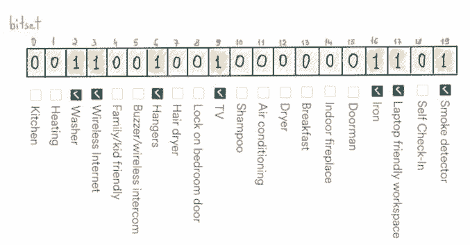

*位集合（Bitset）允许储存 20 个不同数据而只用 20 个字节。*

举例，检查一个房源有没有「洗衣机」：

```py
bool HasWasher(AirbnbHome* h)
{
  return h->amenities[2];
} 
```

或者更专业一点：

```py
const int KITCHEN = 0;
const int HEATING = 1;
const int WASHER = 2;
//...
bool HasWasher(AirbnbHome* h)
{
  return (h != nullptr) && h->amenities[WASHER];
}

bool HasWasherAndKitchen(AirbnbHome* h)
{
  return (h != nullptr) && h->amenities[WASHER] && h->amenities[KITCHEN];
}

bool HasAllAmenities(AirbnbHome* h, const std::vector<int>& amenities)
{
  bool has = (h != nullptr);
  for (const auto a : amenities) {
    has &= h->amenities[a];
  }
  return has;
} 
```

你可以修正代码或修复编译错误，我们只想强调该问题背后用向量表征特征的观念。同样的观念可以用在「入住守则」、「房间类型」和其它特征上。

最后，对于国家编码和城市名。像上面代码注释中提到的一样（看标注），我们不会储存经纬度来避免地理-空间问题，我们储存国家代码和城市名字来缩小用地名搜索的范围（为了简介省略街名，原谅我）。国家代码可以被用两个字符，3 个字符或者 3 个数字来表示，我们会用 ushort 储存数字表达。不幸的是，城市比国家多了太多，所以我们不能使用「城市编码」，我们只会储存真实的城市名，保留平均 0 为 50 字节的城市名字和特别的名字。我们最好用一个附加的布尔变量来表示这是不是一个特别长的名字，所以我们将会加上附加的 32 字节来保证最终的结构大小。我们也假设在 64 位系统上工作，即使我们为 int 何 short 选择了非常紧凑的值。

```py
// Note the comments
struct AirbnbHome
{
  wstring name; // 200 bytes
  uint price; // 4 bytes
  uchar rating; // 1 byte
  uint rating_count; // 4 bytes
  vector<string> photos; // 100 bytes
  string host_id; // 20 bytes
  uchar adults_number; // 1 byte
  uchar children_number; // 1 byte
  uchar infants_number; // 1 byte
  bitset<3> home_type; // 4 bytes
  uchar beds_number; // 1 byte
  uchar bedrooms_number; // 1 byte
  uchar bathrooms_number; // 1 byte
  bitset<21> accessibility; // 4 bytes
  bool superhost; // 1 byte
  bitset<20> amenities; // 4 bytes
  bitset<6> facilities; // 4 bytes
  bitset<34> property_types; // 8 bytes
  bitset<32> host_languages; // 4 bytes, correct me if I'm wrong
  bitset<3> house_rules; // 4 bytes
  ushort country_code; // 2 bytes
  string city; // 50 bytes
}; 
```

所以，420 字节加上 32 个多出的字节，若我们四舍五入到 500 字节。所以每一个对象「home」最多占 500 字节，并且对于所有房源列表，500 字节*4 百万=1.86Gb ~2Gb。我们在搭建结构时做了很多假设，让储存在内存中更便宜。无论我们对这数据做什么，我们需要至少 2Gb 内存。如果你无聊，忍着，我们刚开始。

现在是任务最难的地方了，为这个问题选择合适的数据结构（来尽可能有效的过滤表）不是最难的任务。最难的是（对我而言）按照一系列滤波器搜索列表。如果只有一个搜索键（key）（即只有一个滤波器），我们可以很轻易地解决这个问题。假设用户只关心价格，我们需要的只是在给定的范围以价格下降的顺序找到 Airbnbhome 对象（合适的家）。如果我们要用二元搜索树来解决这个问题，则可按下图形式执行。

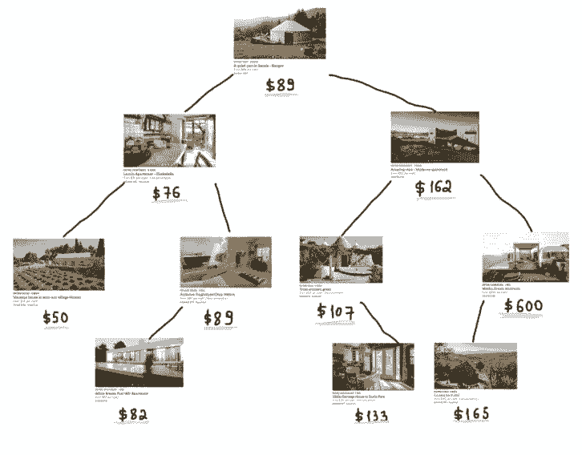

如果需要遍历所有的 4 百万个对象，这搜索树会长得很大很大。另外，需要占用的内存也会越来越多。这只是因为我们用了二元搜索数来存储对象，每一个树节点给它的左右子树两个额外的指针，加起来是每个子指针有 8 个额外的比特（假设是 64 位系统）。对于 400 百万节点它加起来就是 62Mb，对于 2Gb 对象的数据来说是很小的，但还是不能轻易地「忽略」。

目前为止，上面展示的树表明了任何物品都可以很轻易地在 O（logN）复杂度内被找到。如果你对这些概念不熟悉，我们会在接下来解释清楚，或者跳过复杂度讨论的副章节。

算法复杂度：我们在这里快速地简要介绍，在之后的文章「Algorithmic Complexity and Software Performance: the missing manual」我会进行详细的解释。在大部分情况里，找到一个算法的「大 O」复杂度是简单的。首先要注意到，我们总是考虑最差的情况，即：一个算法要最多算多少次才能产生一个合适的结果（用来解决问题）。

假设一个有 100 个元素的未排序数列，要做多少次的比较才能让它找到任意的元素，这里也要考虑到需要的元素可能缺失的情况？它最多需要与匹配的数字比较 100 次才能发现，尽管有时候第一个在数列中的元素就是要找的数字（意味着单次比较就找到答案了），但我们只考虑最差的可能情况（元素可能丢失了或者在最后的位置）。

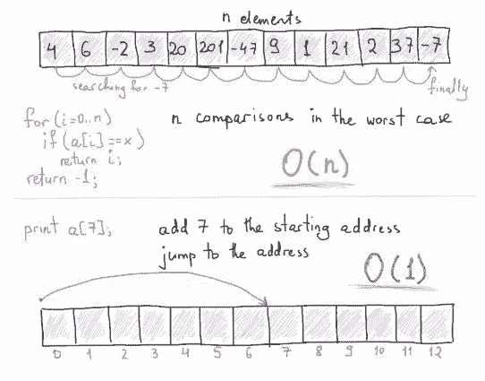

计算算法复杂度的重点是找到运算次数与输入规模之间的依赖关系，举例来说，上面的数列有 100 个元素，运算的次数也是 100，如果数列的数量（输入）增长到 1423，运算次数也会增长到 1423（最差的情况）。所以，输入和运算次数之间的关系在这里是非常清晰的，它也被叫做线性关系，运算次数和数列的增长一样快。增长是复杂度的关键，我们说在一个未排序的数列中搜索需要 O（N）次运算，来强调寻找它需要最多用 N 次运算，（甚至最多到 N 的常数倍数运算，比如 3N 次）。另一方面，访问数列上的任意元素只需要常数时间，比如 O（1）。这是因为数列的结构是一个连续结构，并且包含相同类型的元素，所以访问特定的元素只需要计算它与数列第一个元素的相对位置。

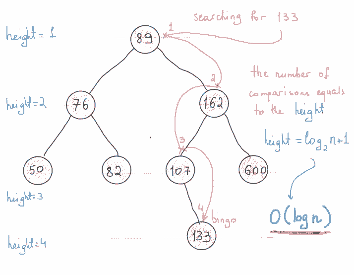

有一点非常明确，二元搜索树按排序顺序保存其节点。那么在二元搜索树中搜索元素的算法复杂度是多少呢？我们应该在最坏的情况下计算查找元素所需的操作次数。

见上图，当我们开始在根部搜索时，第一次匹配可能会导致三种情况：

（1）目标节点被发现；

（2）如果要找的值小于节点的值，则匹配将继续到节点的左子树；

（3）如果要找的值大于节点的值，则匹配将继续到节点的右子树。

在每一步中我们都把节点的数量减半。在二元搜索树中查找元素所需的操作数等于树的高度。树的高度是最长路径上节点的数量。在这一案例中，高度是 4。所以高度等于 logN+1（底数为 2），搜索复杂度是 O（logN+1）=O（logN）。这意味着在 4 百万个节点里搜索元素需要 log1000000=~22 次比较（最差的情况）。

回到树搜索的问题，二元搜索树中的元素搜索时间为 O（logN）。为什么不使用哈希表？哈希表有常数的访问时间，这使得在几乎任何地方使用哈希表都是合理的。

在该问题中，我们必须考虑一个重要的需求，即执行范围搜索，如搜索价格区间在$80 到 $162 之间的房源。在二元搜索树的情况下，获取区间中所有节点很简单，只需对树执行顺序遍历，保存计数即可。而哈希表的计算稍微昂贵，在这种情况下使用坚持二元搜索树更好一些。尽管还存在另一个因素，使我们需要重新考虑哈希表：密度。价格不会「一直」上涨，大部分房源处于固定的价格区间内。截图中的柱状图显示了价格的真实分布，数百万房源处于同一区间（$18—$212），它们具备同样的平均价格。简单的数组可能起到很好的效果。假设数组的索引是价格，则我们能够在（几乎）常数时间内获取任意价格区间。如下图所示：

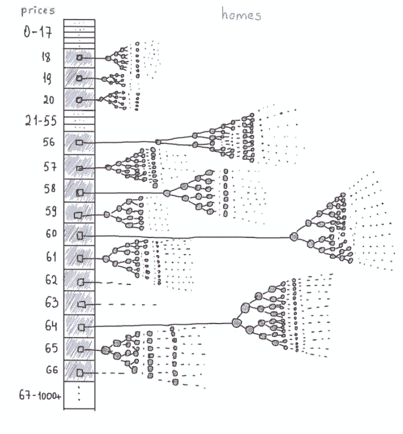

就像一个哈希表，我们通过房源的价格来匹配每一套房子。所有具有相同价格的房源都归入单独的二元搜索树。如果我们存储房源的 ID 而不是上面定义的完整对象（AirbnbHome 结构），也可以节省一些空间。最可能的情况是将所有房源的完整对象保存在哈希表，并将房源 ID 映射到房源的完整对象中，以及保存另一个哈希表（或更好的，一个数组），该哈希表将价格与房源 ID 进行映射。因此，当用户请求价格范围时，我们从价格表中获取房源 ID，将结果裁剪成固定大小（即分页，通常在一页上显示 10-30 个项目），然后使用每个房源 ID 获取完整的房源对象。请记得，要注意平衡。平衡对二元搜索树至关重要，因为它是在 O（logN）内完成树操作的唯一保证。当你按排序顺序插入元素时，二元搜索树不平衡的问题就会很明显，最终，树将变成连接列表，这显然会导致线性时间复杂度。现在假设我们所有的搜索树都是完美平衡的。再看看上面的图。每个数组元素代表一棵大树。如果我们改变这个树，变成图呢？

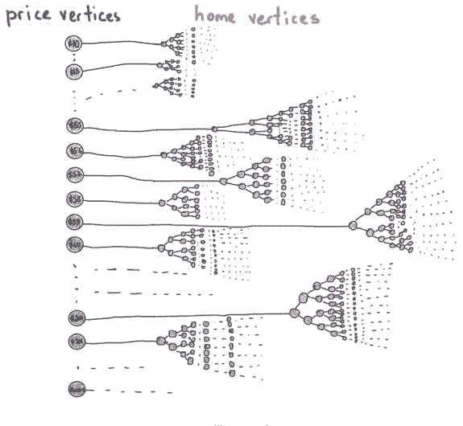

这是一个「更接近真实」的图。这个图展示了最隐蔽的数据结构和图，带领我们到了（下文）。

**图表征：进阶**

图论的缺点是缺乏单独定义，这就是为什么你无法在库中找到 std::graph。我们已经尝试过表示「特别的」图 BST。重点在于，树是图，但图未必是树。最后一张示例图表明在一个抽象图下面有很多树，「价格 vs 房源」和一些节点的类型不同，价格只有价格值的图节点，表示满足特定价格的房源 ID（房源节点）的树。这很像混合数据结构，不同于我们在教科书示例中见到的简单图形。图表示的重点：不存在固定、「权威」的图表示结构（这与 BST 不同，后者用左／右子指针代表基于节点的特定表示，尽管你可以用一个数组表示 BST）。你可以用最便捷的方式表示一个图，重点在于你把它「看作」是图。「看图」的意思是使用适用于图的算法。

N-ary 树更像是模拟一个图。

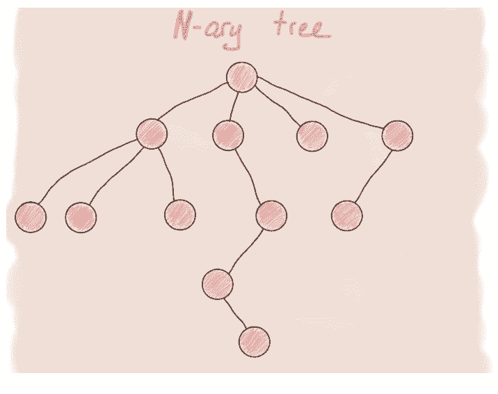

首先，将 N-ary 树节点表示为：

```py
struct NTreeNode
{
  T value;
  vector<NTreeNode*> children;
}; 
```

该结构仅表示树的一个节点，完整的树如下所示：

```py
// almost pseudocode
class NTree
{
public:
  void Insert(const T&);
  void Remove(const T&);
  // lines of omitted code
private:
  NTreeNode* root_;
};
```

该类别是围绕单个树节点 root_ 的抽象。我们可以用它构建任意大小的树。这是树的起点。如果要添加新的树节点，我们就要为其分配内存，将该节点添加至树的根节点处。

图与 N-ary 树很像，只有细微的不同。我们来看一下。

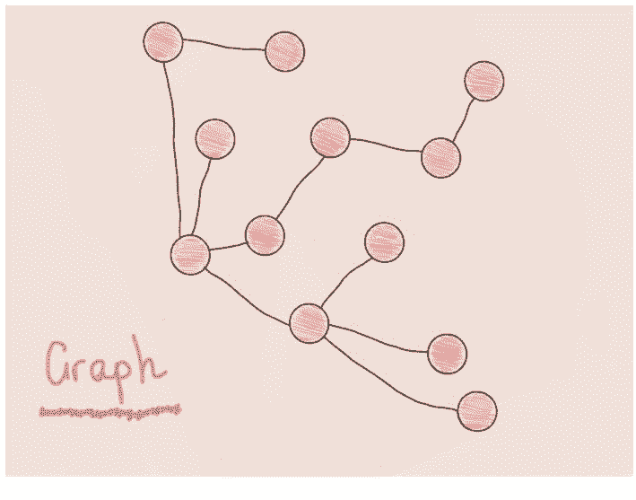这是图吗？我认为，是的。但这幅图与前面的 N-ary 相同，只不过稍微旋转了一下。只要你看到一棵树，无论它是苹果树、柠檬树，还是二叉搜索树，你都可以确定它也是一张图。因此，通过设计图节点（图节点）结构，我们能够提出同样的结构：

```py
struct GraphNode
{
  T value;
  vector<GraphNode*> adjacent_nodes;
}; 
```

这样可以创建图吗？还不够。看下面两幅图，找不同：


*二者都是图*

左侧的图没有可以「进入」的点（与其说是树，它更像森林），相反，右侧的图没有不可达的节点，听起来很熟悉。

> 如果图中任意两点都是连通的，那么该图被称作连通图。

虽然图中不明显，但是我们假设价格不能互相连接，那么在「价格 vs 房源」图中并不是每对节点之间都有路径相连，这说明我们无法使用单个 GraphNode 结构构建图的例子，但是在很多案例中我们必须这样处理非连通图。看下面这个类别：

```py
class ConnectedGraph
{
public:
  // API

private:
  GraphNode* root_;
}; 
```

类似围绕单个节点（根节点）构建的 N-ary 树，连通图也可以围绕根节点构建。树有「根」，即它们有起始点。连通图可以用带有根节点的树来表示（当然还有其他属性），不过要注意，实际的表示可能会随着算法或具体问题发生变化。但是，考虑基于节点的图本质，非连通图可以按照下面的方式来表示：

```py
class DisconnectedGraphOrJustAGraph
{
public:
  // API

private:
  std::vector<GraphNode*> all_roots_;
}; 
```

树状图可以清晰自然地表示 DFS/BFS 这样的图遍历。但是，高效路径追踪等需要不同的表示方法。还记得欧拉图吗？为了追踪图的「eulerness」（真实性），我们应该追踪图中的欧拉路径。这意味着遍历每个边一次就要访问所有节点；如果追踪结束后我们仍有未遍历的边，则该图没有欧拉路径，因此它不是欧拉图。更快的方法是：检查节点的度（假设每条边都保存了度），如定义所述，如果图的节点度是奇数，则它不是欧拉图。该检查的复杂度是 O(|V|)，其中 |V| 是图节点的数量。我们可以在插入新的边缘的同时追踪节点的奇数／偶数度，同时插入新的边以增加奇数／偶数度检查的复杂度到 O(1)。下面介绍图表示和返回路径的 Trace() 函数。

```py
// A representation of a graph with both vertex and edge tables
// Vertex table is a hashtable of edges (mapped by label)
// Edge table is a structure with 4 fields
// VELO = Vertex Edge Label Only (e.g. no vertex payloads)

class ConnectedVELOGraph {
public:
    struct Edge {
        Edge(const std::string& f, const std::string& t)
            : from(f)
            , to(t)
            , used(false)
            , next(nullptr)
        {}
        std::string ToString() {
            return (from + " - " + to + " [used:" + (used ? "true" : "false") + "]");
        }

        std::string from;
        std::string to;
        bool used;
        Edge* next;
    };

    ConnectedVELOGraph() {}
    ~ConnectedVELOGraph() {
        vertices_.clear();
        for (std::size_t ix = 0; ix < edges_.size(); ++ix) {
            delete edges_[ix];
        }
    }

public:
    void InsertEdge(const std::string& from, const std::string& to) {
        Edge* e = new Edge(from, to);
        InsertVertexEdge_(from, e);
        InsertVertexEdge_(to, e);
        edges_.push_back(e);
    }

public:
    void Print() {
        for (auto elem : edges_) {
            std::cout << elem->ToString() << std::endl;
        }
    }

    std::vector<std::string> Trace(const std::string& v) {
        std::vector<std::string> path;
        Edge* e = vertices_[v];
        while (e != nullptr) {
            if (e->used) {
                e = e->next;
            } else {
                e->used = true;
                path.push_back(e->from + ":-:" + e->to);
                e = vertices_[e->to];
            }
        }
        return path;
    }

private:
    void InsertVertexEdge_(const std::string& label, Edge* e) {
        if (vertices_.count(label) == 0) {
            vertices_[label] = e;
        } else {
            vertices_[label]->next = e;
        }
    }

private:
    std::unordered_map<std::string, Edge*> vertices_;
    std::vector<Edge*> edges_;
}; 
```

注意 bug，bug 到处都是。该代码包含大量假设，比如标签，我们可以通过节点理解字符串标签，确保你可以将其更新成任意事物。接下来，是命名。如注释中所述，VELOGraph 仅适用于 Vertex Edge Label Only Graph。重点在于，该图表示包括一个将节点标签映射至节点关联边的表、一个包含与边相连的两个节点的边列表，和一个仅用于 Trace() 函数的 flag。查看 Trace() 函数实现，它使用边的 flag 来标记已经遍历过的边（在任意 Trace() 调用之后应该重置 flag）。

**示例：Twitter**

另一种表示叫做相邻矩阵，它在有向图中有用，就像我们在 Twitter 关注图中所使用的那样。

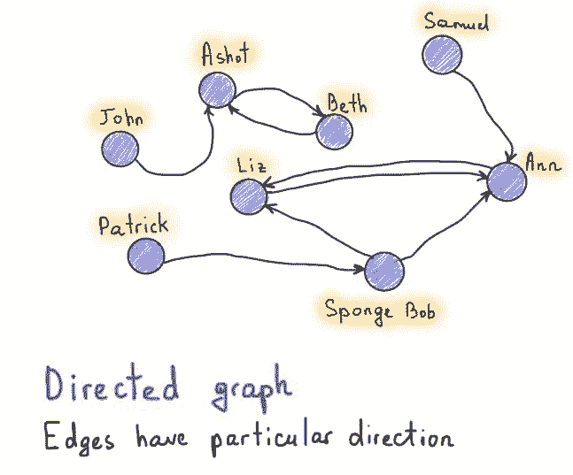

*有向图*

推特案例中有 8 个节点，所以我们需要使用|V|x|V|的二维矩阵表征这个图（其中 |V|分别代表行数和列数）。如果从 v 到 u 有一条有向边，那么我们称矩阵的元素 [v][u] 为真，否则为假。

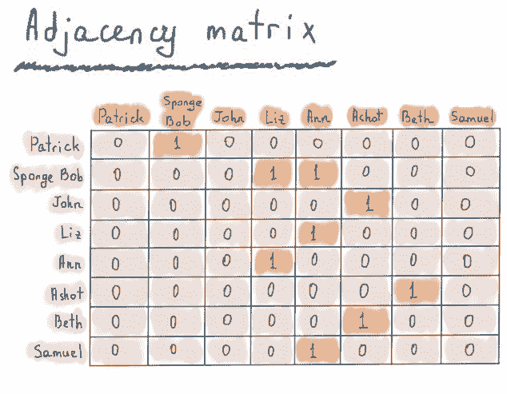

如你所见，这是一个十分稀疏的矩阵，其中的值代表是否有单向连接路径。如果我们需要了解 Patrick 是否关注了 Bob 的推特，那么我们只需要查看矩阵中 ["Patrick"]["Sponge Bob"] 的值是不是等于 1。而要查看 Ann 推特的关注者，我需要获得「Ann」的整个列；同样查看 Sponge Bob 正在关注的人只需要查看「Sponge Bob」的行就行。此外，邻接矩阵（Adjacency matrix）可以用来描述无向图，它不会在 v 到 u 的边选择值「0 或 1」来表示是否有连接，它会同时设置两个方向的值都为 1，即 adj_matrix[v][u] = 1 和 adj_matrix[u][v] = 1。因此，无向图的邻接矩阵为对称矩阵。

注意，在通常情况下我们在邻接矩阵中并不会只储存 0 和 1，我们可以储存一些更具信息的值，例如边权重等。最好的案例可能是带有距离信息的地图。

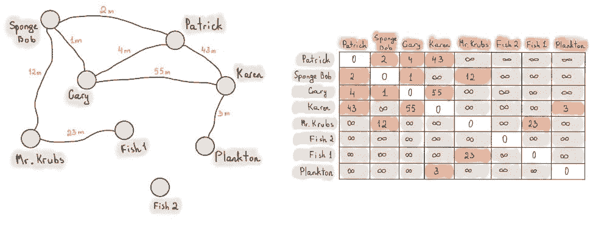

上图表示了 Patrick 和 Sponge Bob 等人之间的距离（也称为加权图）。如果节点间没有没有直接路径，那么我们就把它设为无穷大，它既不意味着根本没有路径，也不意味着一定有路径。它可以在应用算法搜索两个节点间路径时定义。当然，我们还有更好的方法来储存节点和边之间的关系，如关联矩阵。

尽管邻接矩阵对推特关注关系有很好的表征，但将 3 亿用户（每月活跃用户）储存在矩阵中需要 300*300*1（百万字节/布尔值）的储存空间。也就是约有 82000Tb（Terabyte）或需要 1024 * 82000 Gb 的储存空间。BitBoard 可以帮助我们减少一些空间需求，大约可以降低到 10000Tb，但还是太大。如上所述，邻接矩阵稀疏要求我们提供比实际需求更多的空间，这也就是为什么边的列表映射到节点可能会很有用。重点是，邻接矩阵允许保持关注和不关注的信息，而我们需要的仅仅是知道如下内容：

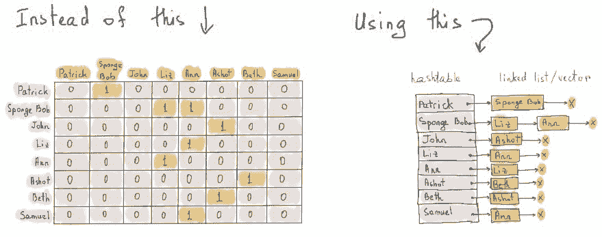

*邻接矩阵与邻接列表*

右图表示邻接列表（adjacency list），每个列表描述了图中的一组邻近节点。在图表中，我们突出了哈希表的用法，因为任何节点的访问复杂度都是 O（1）。而且对于邻近节点列表，我们并没有提到任何具体的数据结构，也不会从列表转化为向量。重点是，如果要确定 Patrick 是否关注 Liz，我们应该遍历哈希表中每一个元素（常数时间），而邻近矩阵需要查看每一个与 Liz 相关的元素（线性时间）。线性时间在这一点上并不是那么糟，因为我们经需要循环与 Patrick 相关的固定数目的节点。

如果我们用空间复杂度表示推特，这需要 3 亿个哈希表记录，每个记录指向一个向量（选择向量以避免链表的左/右指针所产生的内存开销）。此外，虽然没有统计数据，但平均推特关注的人数是 707 个。所以如果我们考虑每个哈希表记录指向一个有 707 个用户 ID 的数组，且每个 ID 有 8 个字节，那么现在我们可以计算出储存空间约为 12TB。

现在少很多了，但我们仍然不确定 12TB 是否是一个合理的数字。如果在 32Gb RAM 的专用服务器上一个月需要 30 美元，那么 12TB 加上一些控制服务器和备用服务器等（约需要额外两倍数量）核算下来需要 1500 台服务器，每月的成本达到了 45K 美元。这对于我们来说当然是难以接受的价格，但对于推特来说就非常便宜了。但推特需要提高响应的速度，即用户发的推文需要第一时间发送给关注的人。但理想的时间是多少？我们并不能作出任何假设和抽象，因此我们可以探讨一下现实世界产品系统的响应。以下是我们在推文时经常遇到情况。

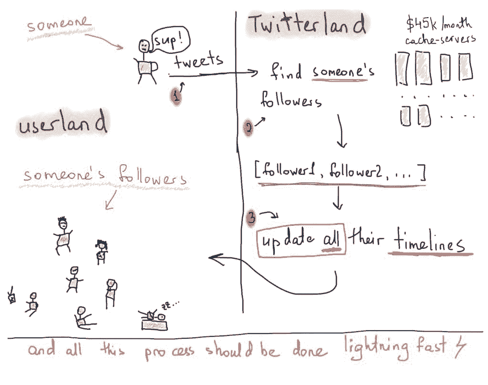

同样我们并不知道一条推文需要多少时间才能发送到所有的关注者，但公开的数据表明每天约有 500 亿条推文。所以经验看来一般推文的时间在 5 秒内，同时我们还要注意哪些拥有超百万粉丝的名人，推特可能会分配更多的资源来推送名人「超级有用」的内容。

为了解决推文的分发问题，我们并不需要以下的图，我们需要关注者的列表。前面的哈希表和一些列表允许我们高效地搜索特定关注者关注的所有用户，但它并不允许高效地搜索关注特定用户所有关注者，因此我们必须扫描所有的哈希表键值。这也就是为什么我们应该构建另一个图，它与以下我们展示的图对称相反。这个新的图由包含 3 亿个节点的哈希表组成，每个节点指向相邻节点的猎鸟（结构相同），但是这次相邻节点的列表将表示关注者。


因此基于该示例，无论何时 Liz 发推特，Spone Bob 和 Ann 都必须在他们的时间线上找到特定的推文。一项普遍使用的解决该问题的技术是为每个用户的时间线保持独立的结构。假设推特有 3 亿的用户，我们可以假定至少存在 3 亿个时间线（每人一个）。简单的说，无论何时发推，我们应该找到他的关注者并且更新他们的时间轴，时间线可以被表征成连结串列或平衡树（以推文的日期作为节点关键字）。

```py
// 'author' represents the User object, at this point we are interested only in author.id
//
// 'tw' is a Tweet object, at this point we are interested only in 'tw.id' 

void DeliverATweet(User* author, Tweet* tw)
{
  // we assume that 'tw' object is already stored in a database

  // 1\. Get the list of user's followers (author of the tweet)
  vector<User*> user_followers = GetUserFollowers(author->id);

  // 2\. insert tweet into each timeline
  for (auto follower : user_followers) {
    InsertTweetIntoUserTimeline(follower->id, tw->id);
  }
} 
```

这仅仅是基本思想，从真实的时间线表征抽象得到。当然如果使用多线程，我们可以将实际的传送过程变得更快。这对于大规模案例非常关键，因为对于百万级别的关注者，接近列表终点的用户在处理上通常慢于接近列表前面的用户。以下的伪代码将尝试解释该多线程传送思想。

```py
// Warning: a bunch of pseudocode ahead

void RangeInsertIntoTimelines(vector<long> user_ids, long tweet_id)
{
  for (auto id : user_ids) {
    InsertIntoUserTimeline(id, tweet_id);
  }
}

void DeliverATweet(User* author, Tweet* tw)
{
  // we assume that 'tw' object is already stored in a database

  // 1\. Get the list of user's (tweet author's) followers's ids
  vector<long> user_followers = GetUserFollowers(author->id);

  // 2\. Insert tweet into each timeline in parallel
  const int CHUNK_SIZE = 4000; // saw this somewhere
  for (each CHUNK_SIZE elements in user_followers) {
    Thread t = ThreadPool.GetAvailableThread(); // somehow
    t.Run(RangeInsertIntoTimelines, current_chunk, tw->id);
  }
} 
```

因此无论关注者在什么时候刷新推特，他们都能收到新的推文。当然，我们仅仅讨论了 Airbnb 或推特面临问题的冰山一角，还有很多问题需要各位读者共同探讨。


推特的推文分发问题关键在于对图的利用，即使我们不使用任何的图算法，仅用图表示。而真正的图算法是相当复杂的。在使用图表示之前，我们讨论了 Airbnb 房源和高效过滤的问题，主要困难在于当过滤器关键字超过一个的时候，就无法高效地过滤家园。那么使用图算法能带来什么好处吗？值得一试。我们可以将每个过滤器表示成一个独立的节点，每个过滤器可以代表特定的属性（价格、城市名、国家、生活设施等）。

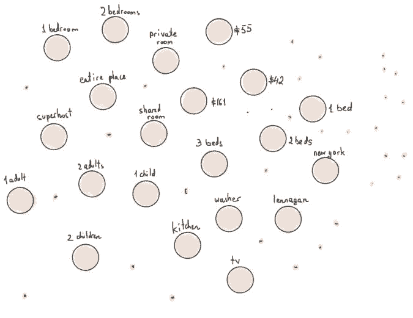

*Airbnb 过滤器节选*

我们还可以通过添加高层的节点，例如「生活设施」节点来连接所有生活设施类的节点（WiFi、电视等），使该集合更容易理解。

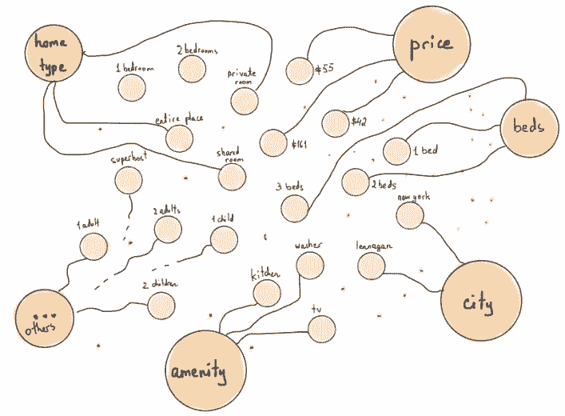

*拥有高级类型的 Airbnb 过滤器*

现在，我们可以将 Airbnb 房源（home）表示成节点，然后将这些节点和对应的属性节点连接起来。

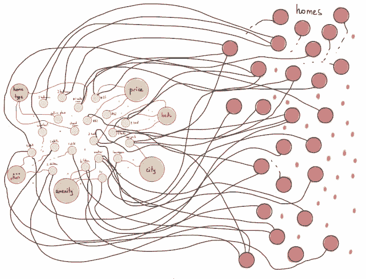

这个插图的微妙变化使它更像一种特殊类型的图形，称为偶图（bipartite graph）。

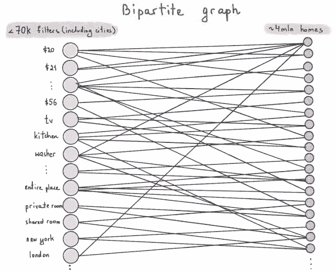

*节点的数量比看起来的更多*

偶图的节点可以分为两个不相交和独立的集合，这样每个边就将一个集合的节点连接到另一个集合的节点。在我们的例子中，其中一个表征过滤器（我们用 F 表示），另一个表征房源集合（H）。例如，如果有价值 62 美元的 10 万个房源，则标记为「$ 62」的价格节点将具有 10 万条边入射到每个房源的节点。

如果我们测量空间复杂度的最坏情况，即每个家庭具有满足所有过滤器的所有属性，则要存储的边总量将为 7 万×400 万。如果我们将每个边表示为一个 ID 对：{filter_id; home_id}，如果我们重新考虑 ID，并使用 4 个字节（int）数字 ID 为过滤器 ID，8 个字节（long）ID 为房源使用的 ID，那么每个边缘至少需要 12 个字节。因此，存储 7 万* 400 万个 12 字节值需要大约 3TB 的内存。我们在计算中犯了一个小错误，由于在 Airbnb 中有 65,000 个活跃城市，因此过滤器的数量约为 7 万个（统计数据）。

好消息是，同一个家庭不能位于不同的城市。也就是说，我们实际与城市边配对的数量是 400 万（每个家庭位于一个城市），因此我们将计算 70k-65k = 5000 个过滤器，这意味着我们需要 5000 * 400 万* 12 个字节的内存，小于 0.3Tb。听起来不错。但是什么给了我们这个偶图？最常见的网站/移动请求将由多个过滤器组成，例如：

```py
house_type: "entire_place",
adults_number: 2,
price_range_start: 56,
price_range_end: 80,
beds_number: 2,
amenities: ["tv", "wifi", "laptop friendly workspace"],
facilities: ["gym"] 
```

因此我们只需要找到上述所有「过滤器」的节点，并处理与其邻近所有「房源」的节点。

**图算法**

或许，任何用图执行的计算过程都可以分类为「图算法」，你可以实现一个输出图的所由节点的函数，然后将其命名为「<你的名字>的节点输出算法」。但真正可怕的是教科书中列出的图算法：

*   Coloring

*   Hopcroft–Karp

*   Hungarian

*   Prüfer coding

*   Tarjan's off-line least common ancestors

*   Topological sort

我们尝试使用偶图匹配算法，例如 Hopcroft–Karp 算法到 Airbnb 房源过滤问题：

> 给定一个 Airbnb 房源（H）的偶图和过滤器（F），其中 H 的每个节点可以多于 F 的一个相邻节点（共享一个公共边）。寻找 H 的由节点构成的子集，该子集和 F 的子集的节点相邻。

问题的定义很难理解，并且目前我们还不确定 Hopcroft-Karp 算法可以解决该问题，但我们可以在求解的过程中学到很多图算法的关键思想。这个过程不会很短，需要你有耐心。Hopcroft-Karp 算法以二分图为输入，并生成最大基数匹配的输出，该输出是一个包含尽可能多的边的集合，其中没有任何两条边共享同一个端点。熟悉该算法的读者已经注意到，这并不能解决我们的问题，因为匹配过程的条件是没有任何两条边共享同一个节点。我们来看一个示例展示，其中只有 4 个过滤器和 8 个房源（为简单起见）。这些房源用字母 A 到 H 标记，过滤器是随机选择的。从 A 到 H 的所有房源都是 50 美元每晚的价格和一张床，但很少有供应 WiFi 和/或电视的。因此以下的示例过程将尝试找到满足四个条件的房源（拥有 4 个过滤器）。

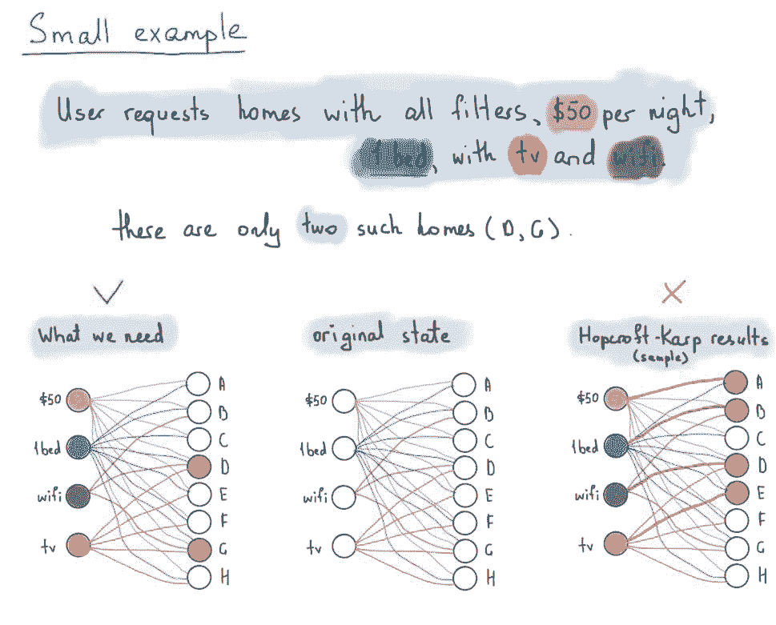

对该问题的求解需要找到和特定的房源连接的所有边，该房源节点和相同的过滤器子集关联。而 Hopcroft-Karp 算法将移除公共端点的边，并生成和两个子集都关联的边。

查看上图，我们需要寻找的是房源 D 和 G，它们满足了所有四个过滤器值。我们真正需要的是找到共享端点的所有匹配边。我们可以为该方法设计一个算法，但其处理时间可以说和用户需求并不相关（用户需求=快速）。也许创建一个平衡的多分类关键字的二值搜索树会更快，差不过类似于数据库索引文件，其将主关键字和外键映射到满足条件的记录集合。我们将在另一篇文章中独立讨论平衡二值搜索树和数据库索引，到时会再次返回到 Airbnb 房源问题上。

Hopcroft-Karp 算法（以及很多其它算法）都基于 DFS（深度优先搜索）和 BFS（广度优先搜索）的图遍历算法。说实话，这里介绍 Hopcroft-Karp 算法的真正原因是逐渐转换到图遍历算法的讨论，相比从二值树开始讨论会更好。

二值树遍历非常漂亮，这大多是因为它们的递归本质。有三种基本的遍历方式称为中序（in-order）、后序（post-order）和前序（pre-order）。如果你曾经遍历过连结串列，这些概念是很好懂的。在连结串列中，你只需要输出当前节点的值（在下方的代码中称为 item），并继续到达下一个节点。

```py
// struct ListNode {
//   ListNode* next;
//   T item;
// }; 

void TraverseRecursive(ListNode* node) // starting node, most commonly the list 'head'
{
  if (!node) return; // stop
  std::cout << node->item;
  TraverseRecursive(node->next); // recursive call
}

void TraverseIterative(ListNode* node)
{
  while (node) {
    std::cout << node->item;
    node = node->next;
  }
} 
```

这和二值树几乎相同，输出节点的值，然后到达下一个节点，但在这里，「下一个」指的是两个节点，左节点和右节点。因此你需要分别到达左节点和右节点。不过你有三个不同的选择：

*   输出节点值，然后到达左节点，再到达右节点。

*   到达左节点，然后输出节点值，再到达右节点。

*   到达左节点，然后到达右节点，再输出节点值。

```py
// struct TreeNode {
//   T item;
//   TreeNode* left;
//   TreeNode* right;
// }

// you cann pass a callback function to do whatever you want to do with the node's value
// in this particular example we are just printing its value.

// node is the "starting point", basically the first call is done with the "root" node
void PreOrderTraverse(TreeNode* node)
{
  if (!node) return; // stop
  std::cout << node->item;
  PreOrderTraverse(node->left); // do the same for the left sub-tree
  PreOrderTraverse(node->right); // do the same for the right sub-tree
}

void InOrderTraverse(TreeNode* node)
{
  if (!node) return; // stop
  InOrderTraverse(node->left);
  std::cout << node->item;
  InOrderTraverse(node->right);
}

void PostOrderTraverse(TreeNode* node)
{
  if (!node) return; // stop
  PostOrderTraverse(node->left);
  PostOrderTraverse(node->right);
  std::cout << node->item;
} 
```

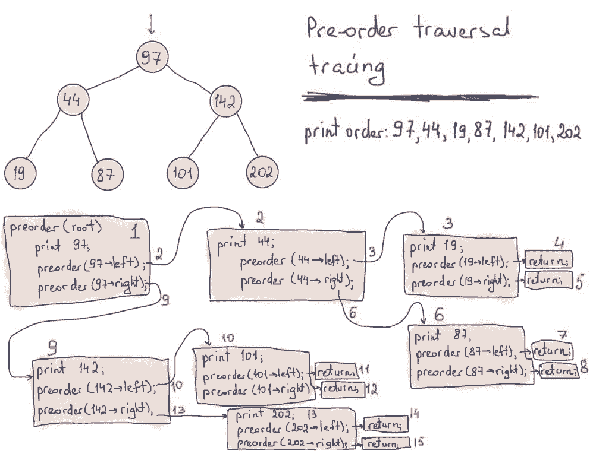

*前序遍历的细节追踪*

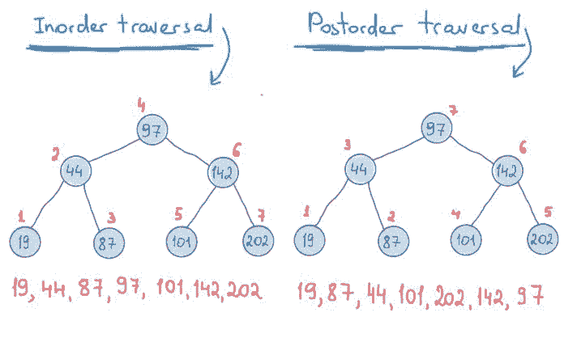

很明显递归函数的形式很优雅，虽然其计算成本很高。每次我们递归地调用一个函数，也就意味着我们调用了一个完全的新函数（如上图所示）。其中「新」的意思是函数变量和局域变量需要分配其它的堆栈内存空间。这正是为什么递归调用的成本如此高（额外的堆栈空间分配和多函数调用）和危险（堆栈溢出），很明显地使用迭代实现会更好。在关键任务（航空、NASA 探测车等）的系统编程中，递归调用是完全禁止的。

**实例：Netflix**

假设我们要将所有 Netflix 电影存储在二进制搜索树中，并将电影标题作为排序键。所以无论何时用户输入类似「Inter」的内容，我们都会返回一个以「Inter」开头的电影列表，举例，[「Interstellar」,「Interceptor」,「Interrogation of Walter White」]。如果我们将返回标题中包含「Inter」的所有电影（不仅仅是以「Inter」开头的电影）那就太好了，并且该列表将根据电影的评分或与该特定用户相关的内容进行排序（喜欢惊悚片比戏剧更多）。这个例子的重点在于对 BST 进行有效的范围查询，但像往常一样，我们不会深入探讨其余部分。基本上，我们需要通过搜索关键字进行快速查找，然后获得按关键字排序的结果列表，这很可能应该是电影评级和/或基于用户个性化数据的内部排名。我们会尽可能地坚持 KISK 原则（Keep It Simple，Karl）。

「KISK」或「让我们保持它的简单」或「为了简单起见」，这是教程编写者从真实问题中抽象出来的超级借口，并通过在伪代码中引入「abc」简单示例及其解决方案来做出大量假设，并且这些答案在很老的笔记本电脑上也能工作。

这个问题可以很容易地应用到亚马逊的产品搜索上，因为我们通常通过输入描述我们兴趣的文本（如「图算法」）来搜索亚马逊的东西，并根据产品的评分获得结果（我没有在亚马逊的个性化结果中体验过搜索结果，但我很确定亚马逊也是这样做的）。所以，为了公平将这个子标题改为...

Netflix 和亚马逊。Netflix 提供电影服务，亚马逊提供产品，我们会将它们命名为「物品」，所以每当你阅读「物品」时，都会想到 Netflix 中的电影或亚马逊的任何 [合格] 产品。这些物品最常用的是解析其标题和描述（我们只处理标题），所以如果一个操作员（通常是一个人通过管理仪表板将项目的数据插入 Netflix / Amazon 数据库）插入新项目到数据库中，它的标题正在被一些「ItemTitleProcessor」处理以产生关键字。

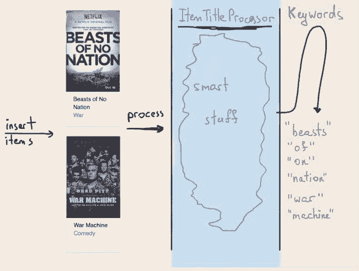

*我知道这并不是最好的图例（而且有一个书写错误）*

每一个物品都有专属 ID，这个 ID 也链接到了标题之中的关键字。这也是搜索引擎在爬全世界的网站时做的。他们分析每个文档的内容，对其进行标记（将其分解为更小的实体和单词）并添加到表中，该表将每个标记（词）映射到标记已被「看到」的文档标识（网站）。因此，无论何时搜索「hello」，搜索引擎都会获取映射到关键字「hello」的所有文档（实际情况非常复杂，因为最重要的是搜索相关性，这就是为什么谷歌搜索非常棒）。所以 Netflix /亚马逊的类似表格可能看起来像这样（再次，在阅读物品时想一想电影或产品）。


*倒排索引*

哈希表，再提一次。是的，我们将为此倒排索引（索引结构存储来自内容的映射）保留哈希表。哈希表会将关键字映射到物品的 BST。为什么选择 BST？因为我们希望保持它们的排序并同时提供连续排序的部分（响应前端请求），例如一次请求（分页）中的 100 个物品。这并不能说明 BST 的强大功能，但假设我们还需要在搜索结果中进行快速查找，例如，你需要关键字为「机器」的所有 3 星电影。

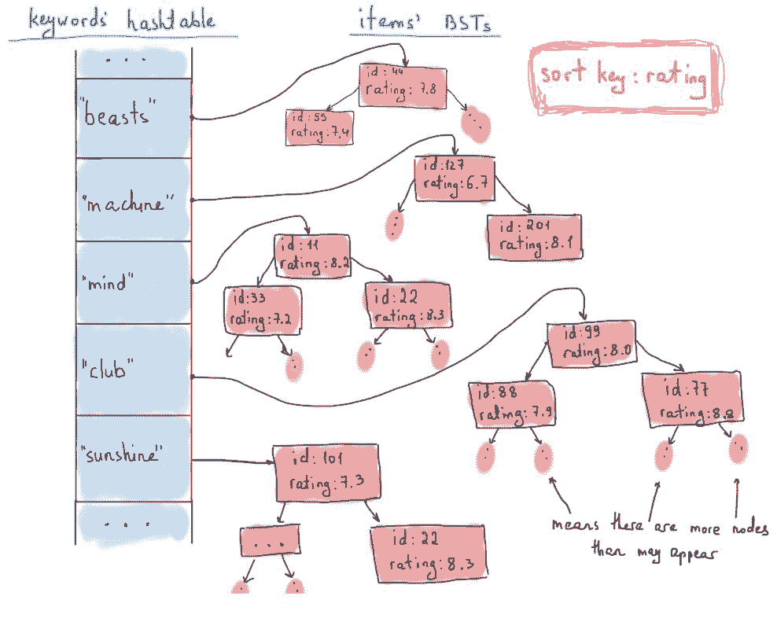

请注意，可以在不同的树中复制物品，因为通常可以使用多个关键字找到物品。我们将使用如下面定义的物品进行操作：

```py
// Cached representation of an Item
// Full Item object (with title, description, comments etc.) 
// could be fetched from the database
struct Item
{
  // ID_TYPE is the type of Item's unique id, might be an integer, or a string
  ID_TYPE id;
  int rating;
}; 
```

每次将新物品插入数据库时，其标题都将被处理并添加到大型索引表中，该表将关键字映射到物品。可能有许多物品共享相同的关键字，因此我们将这些物品保存在按照评分排序的 BST 中。当用户搜索某个关键字时，他们会得到按其评分排序的物品列表。我们如何从排序的树中获取列表？通过按顺序遍历。

```py
// this is a pseudocode, that's why I didn't bother with "const&"'s and "std::"'s
// though it could have look better, forgive me C++ fellows

vector<Item*> GetItemsByKeywordInSortedOrder(string keyword)
{
  // assuming IndexTable is a big hashtable mapping keywords to Item BSTs
  BST<Item*> items = IndexTable[keyword]; 

  // suppose BST has a function InOrderProduceVector(), which creates a vector and 
  // inserts into it items fetched via in-order traversing the tree
  vector<Item*> sorted_result = items.InOrderProduceVector();
  return sorted_result;
} 
```

这里是一种 InOrderProduceVector() 实现：

```py
template <typename BlaBla>
class BST
{
public:
  // other code ...
  vector<BlaBla*> InOrderProduceVector()
  {
    vector<BlaBla*> result;
    result.reserve(1000); // magic number, reserving a space to avoid reallocation on inserts
    InOrderProduceVectorHelper_(root_, result); // passing vector by reference
    return result;
  }

protected:
  // takes a reference to vector
  void InOrderProduceVectorHelper_(BSTNode* node, vector<BlaBla*>& destination)
  {
    if (!node) return;
    InOrderProduceVectorHelper_(node->left, destination);
    destination.push_back(node->item);
    InOrderProduceVectorHelper_(node->right, destination);
  }

private:
  BSTNode* root_;
}; 
```

但是呢，我们首先需要最高评价的物品，来替换掉按顺序遍历生成最低评级的物品。这是因为它的性质，是从低到高的顺序遍历物品，「自下而上」。为了得到我们想要的东西，即列表按降序而不是升序排列，我们应该仔细查看顺序遍历实现。我们所做的是通过左节点，然后打印当前节点的值和通过右边的节点。当我们第一次通过左节点时，这就是为什么我们首先获得了「最左」节点（最左节点），这是具有最小值的节点。因此，简单地将实现更改为首先通过正确的节点将导致我们按照列表的降序排列。我们会像其他人一样将其命名，这是一种逆序的遍历。让我们更新上面的代码（引入单个列表、警告、错误）：

```py
// Reminder: this is pseudocode, no bother with "const&", "std::" or others
// forgive me C++ fellows

template <typename BlaBla>
class BST
{
public:
  // other code ...

  vector<BlaBla*> ReverseInOrderProduceVector(int offset, int limit)
  {
    vector<BlaBla*> result;
    result.reserve(limit);
    // passing result vector by reference
    // and passing offset and limit
    ReverseInOrderProduceVectorHelper_(root_, result, offset, limit);
    return result;
  }

protected:
  // takes a reference to vector
  // skips 'offset' nodes and inserts up to 'limit' nodes
  void ReverseInOrderProduceVectorHelper_(BSTNode* node, vector<BlaBla*>& destination, int offset, int limit)
  {
    if (!node) return;
    if (limit == 0) return;
    --offset; // skipping current element
    ReverseInOrderProduceVectorHelper_(node->right, destination, offset, limit);
    if (offset <= 0) { // if skipped enough, insert
      destination.push_back(node->value);
      --limit; // keep the count of insertions
    }
    ReverseInOrderProduceVectorHelper_(node->left, destination, offset, limit);
  }

private:
  BSTNode* root_;
};

// ... other possibly useful code

// this is a pseudocode, that's why I didn't bother with "const&"'s and "std::"'s
// though it could have look better, forgive me C++ fellows

vector<Item*> GetItemsByKeywordInSortedOrder(string keyword, offset, limit) // pagination using offset and limit
{
  // assuming IndexTable is a big hashtable mapping keywords to Item BSTs
  BST<Item*> items = IndexTable[keyword]; 

  // suppose BST has a function InOrderProduceVector(), which creates a vector and 
  // inserts into it items fetched via reverse in-order traversing the tree
  // to get items in descending order (starting from the highest rated item)
  vector<Item*> sorted_result = items.ReverseInOrderProduceVector(offset, limit);
  return sorted_result;
} 
```

*通过排序关键词查找电影或产品*

这就对了，我们可以非常快速地提供物品搜索结果。如上所示，反转索引在搜索引擎中最常用，例如谷歌搜索。虽然谷歌搜索引擎非常复杂，它确实利用了某些简单的思想，来将搜索查询匹配到文档上，并尽可能快速地提供结果。

我们使用了树遍历来以分类排序提供结果。在这里，前序/顺序/后序遍历可能太多了，但有时候我们也需要应用其它类型的遍历。让我们来解决这个著名的编程面试问题：「如何按等级输出一个二值树等级？」


**DFS vs. BFS**

如果你对这个问题不熟悉，想想你在遍历树的时候可用于存储节点的数据结构。如果对比分层遍历树和上文介绍的其他方式（前序/顺序/后序遍历），就会发现两种主要的图遍历方法：深度优先搜索（DFS）和广度优先搜索（BFS）。

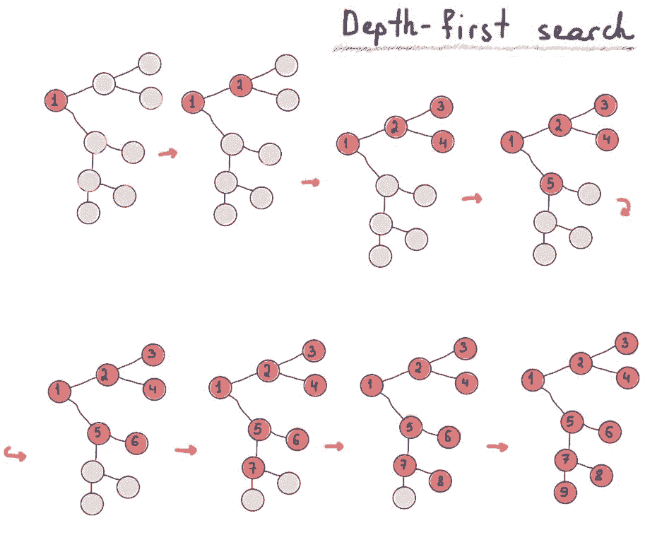

深度优先搜索寻找最远的节点，广度优先搜索先寻找最近的节点。

*   深度优先搜索——更多动作，更少思考。

*   广度优先搜索——在进一步行动之前先仔细观察四周。

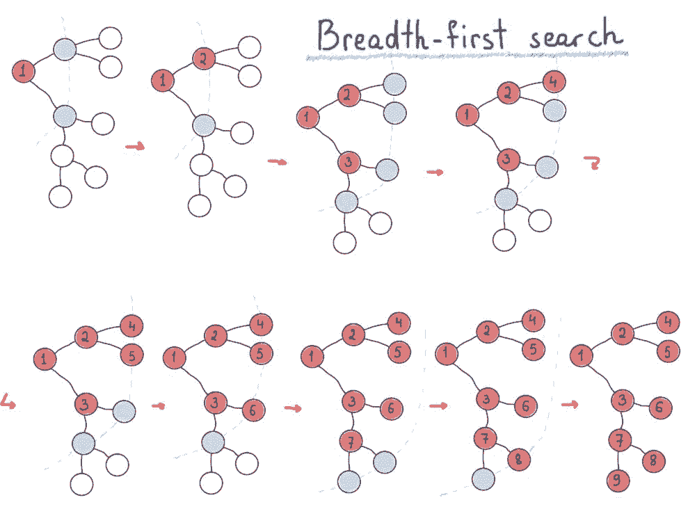

DFS 很像前序/顺序/后序遍历，而 BFS 用于分层输出树节点。我们需要一个队列（数据结构）来存储图的「层级」，同时输出（访问）其「父级」。在之前的插图中，节点是队列中浅蓝色的点。每一层的节点被从队列中取走，同时在访问每个被取走的节点时，我们还应该将其子节点插入队列（为下一层做准备）。下列代码很简单，可以帮助大家了解 BFS。代码假设图是连通的，尽管我们可以修改代码，使其应用于非连通图。

```py
// Assuming graph is connected 
// and a graph node is defined by this structure
// struct GraphNode {
//   T item;
//   vector<GraphNode*> children;
// }

// WARNING: untested code
void BreadthFirstSearch(GraphNode* node) // start node
{
  if (!node) return;
  queue<GraphNode*> q;
  q.push(node);
  while (!q.empty()) {
    GraphNode* cur = q.front(); // doesn't pop
    q.pop();
    for (auto child : cur->children) {
      q.push(child);
    }

    // do what you want with current node
    cout << cur->item;
  }
} 
```

在基于节点的连通图表示上可以轻松地了解基本思想。记住图遍历的实现因图表示而异。BFS 和 DFS 在解决图搜索问题中是重要的工具（但是存在大量图搜索算法）。尽管 DFS 具备优雅的递归实现，但进行迭代实现更合理。我们使用队列进行 BFS 的迭代实现，而 DFS 则需要堆栈。图领域中一个最流行的问题，同时也可能是你阅读本文的原因之一是寻找图节点之间的最短路径。这需要我们进行最后一个实验。

**示例：Uber**

Uber 有 5000 万用户、700 万司机，对于 Uber 来说，最重要的事情之一就是高效匹配司机和乘客。该问题首先是定位的问题。后端要处理数百万份用户请求，将每份请求发送至一或多（通常是多）位附近的司机。尽管将用户请求发送至所有附近司机更加简单，有时也更加智能，但是预处理通常会有所帮助。

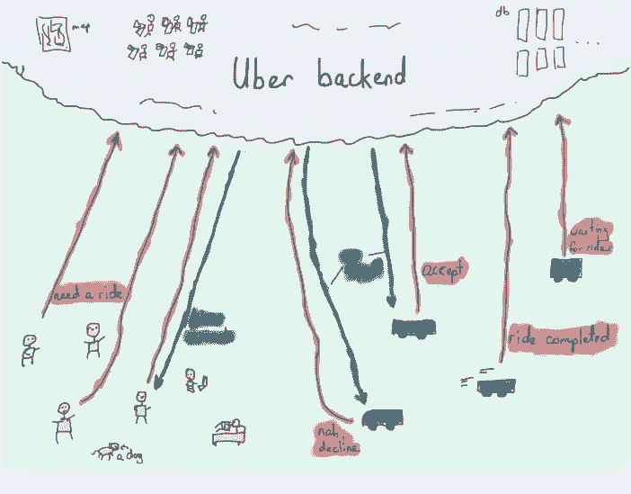

除了处理请求、基于用户坐标确定定位、寻找最近坐标的司机以外，我们还需要寻找最适合这趟行程的司机。为了避免地理空间请求处理（对比司机当前坐标和用户坐标，来获取附近车辆），我们假设已经分割了用户和多辆附近车辆的地图，如下图所示：

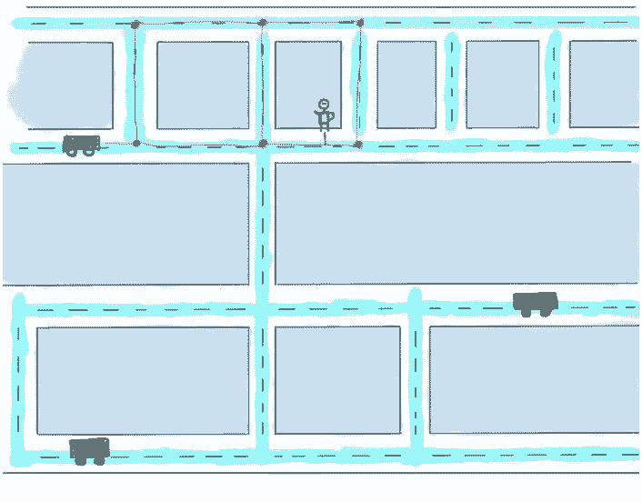

黄色路线是车辆到用户处的可能路径。问题在于计算车辆到达用户的最小距离，即寻找最短路径。尽管这更多地涉及谷歌地图而不是 Uber，我们仍然尝试解决这一特定和简化案例，其原因主要在于通常存在多辆车，Uber 可能需要计算离用户最近的车。就这张插图而言，这意味着计算全部三辆车的最短路径并确定哪辆车最适合该行程。为了使问题简洁，我们将讨论只有一辆车的情况。下图显示了一些到达用户的可能路径。

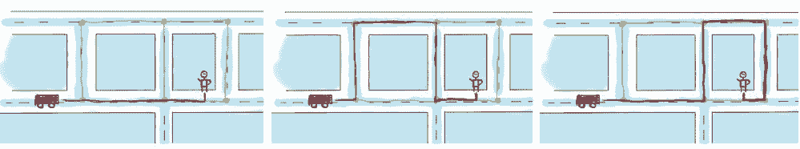

*车辆到达用户的可能路径*

我们将该地图分割表示为一个图：

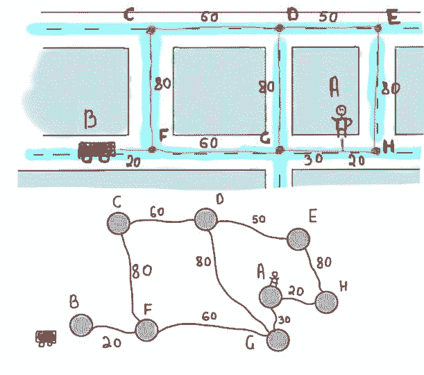

这是一个无定向的加权图（更具体地说是，边加权）。为了找到从 B（车）到 A（用户）的最短途径，我们应该找到他们之间的一条边权重最小的路。你可以自由的设计你自己版本的解决方案，我们还是使用 Dijkstra 的版本。下面的步骤是从维基百科上找到的 Dijkstra 的算法的步骤。

让我们把起始的节点叫做初始节点。节点距离 Y 表示初始节点到 Y 的距离。Dijkstra 的算法将分配一些初始距离值，并尝试一步步地改善它们。

1\. 标记所有未访问节点。创建所有未访问节点的集合「unvisited set」。

2\. 为每个节点分配一个实验距离值：初始节点的距离值设置为 0，其他节点设置为无穷大。将初始节点设置为当前节点。

3\. 对于当前节点，考虑其所有未访问近邻，通过当前节点计算它们的实验距离。对比新计算的实验距离和当前分配的值，分配较小的值。例如，如果当前节点 A 的距离是 6，连接 A 与近邻 B 的边长度为 2，则经过 A 到 B 的距离是 6 + 2 = 8。如果 B 之前标记的距离大于 8，则将其更改为 8。反之，保留当前值。

4\. 当我们考虑完当前节点的所有近邻之后，将当前节点标记为已访问，并从 unvisited set 中移除。已访问节点无需再检查。

5\. 如果目标节点已经标记为已访问（当规划两个特定节点之间路线的时候），或 unvisited set 中节点之间的最小实验距离是无穷大（当规划完整遍历时，初始节点和其余未访问节点之间没有连接时），则停止，算法结束。

6\. 反之，选择标记有最小实验距离的未访问节点，将其设置为新的「当前节点」，并返回第 3 步。

在我们的示例中，我们首先将节点 B（车辆）设置为初始节点。前两步：

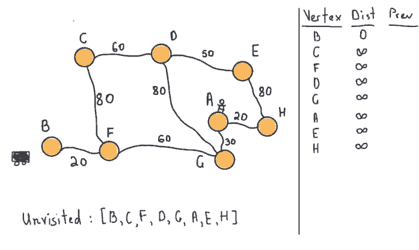

我们的 unvisited set 包含了所有的节点，同时也要注意图左边里显示的表格。所有的节点都包括了到 B 和到之前节点的最短距离。例如，从 B 到 F 的最短距离是 20，之前节点是 B。


我们把 B 标注为访问过的然后移动到它的近邻 F。

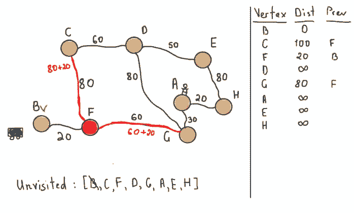

现在，我们把 F 标注已访问过的，然后在最小实验距离下选下一个没被访问过的节点，就是 G。

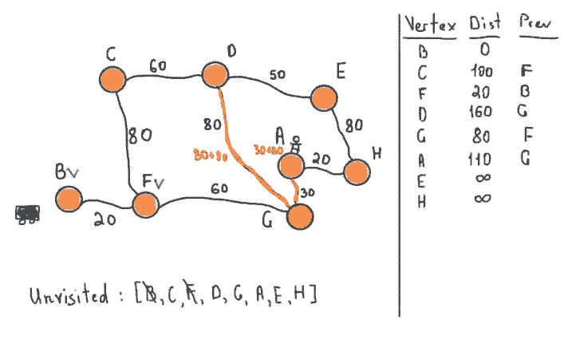

就像算法里说的，如果目标节点已经被标注为访问过的（当规划两个特定的节点间的路线时）那么我们可以停止。所以我们下一步用下面的值去停止算法。

所以我们已经有了从 B 到 A 并且经过 F 与 G 的两条最短距离。

这真的是 Uber 里最简单的问题的例子，和冰山类比相比较，我们在冰山的山尖上。然而，这对于我们探索图论应用的真实场景是个好的开始。我没有完成我一开始计划的文章，但在不久的将来这个文章最有可能继续下去（也包括数据库内部索引）。

关于图论有很多内容需要去学习，这篇文章只是冰山一角，非常感谢各位读者有耐心能阅读完 ~

*原文地址：https://medium.freecodecamp.org/i-dont-understand-graph-theory-1c96572a1401*

**点击阅读原文，从技术到产品体验搜狗机器翻译**

