# 从冷战到深度学习：一篇图文并茂的机器翻译史

选自 Vas3k.com

**作者：Ilya Pestov**

**英语版译者：Vasily Zubarev**

**中文版译者：Panda**

> 实现高质量机器翻译的梦想已经存在了很多年，很多科学家都为这一梦想贡献了自己的时间和心力。从早期的基于规则的机器翻译到如今广泛应用的神经机器翻译，机器翻译的水平不断提升，已经能满足很多场景的基本应用需求了。近日，Ilya Pestov 用俄语写的机器翻译介绍文章经 Vasily Zubarev 翻译后发表到了 Vas3k.com 上。机器之心又经授权将其转译成了汉语。希望有一天，机器自己就能帮助我们完成这样的任务。

*   俄语版：http://vas3k.ru/blog/machine_translation/ 

*   英语版：http://vas3k.com/blog/machine_translation/ 

我打开谷歌翻译的频率是打开 Facebook 的两倍，价格标签的即时翻译对我而言再也不是赛博朋克了。这已经成为了现实。很难想象这是机器翻译算法百年研发之战的结果，而且在那段时间的一半时间里其实都没什么明显的成功。

我在本文中讨论的确切发展将立足于所有的现代语言处理系统——从搜索引擎到声控微波。我将探讨的是当今的在线翻译技术的演化和结构。

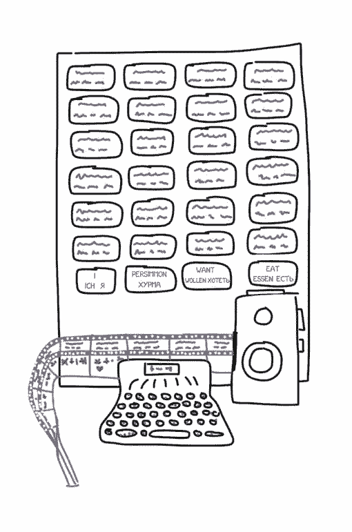

*P. P. Troyanskii 的翻译机器（根据描述绘制的图片。很遗憾没有照片留下。）*

**起初**

故事开始于 1933 年。苏联科学家 Peter Troyanskii 向苏联科学院提交了《用于在将一种语言翻译成另一种语言时选择和打印词的机器》。这项发明非常简单——它有四种语言的卡片、一台打字机和一台旧式胶片相机。

操作员先取文本的第一个词，然后找到对应的卡片，拍一张照片，再在打字机上键入其形态特征（名词、复数、性别等）。这台打字机的按键编码了其中一项特征。打字带和相机胶片是同时使用的，从而得到一组带有词及它们的形态的帧。

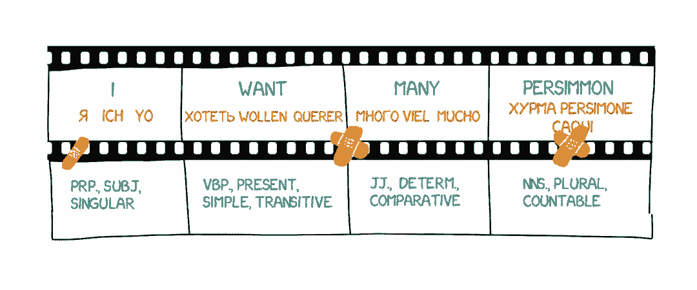

尽管看起来很不错，但和苏联的很多事情都一样，人们认为这项发明是「没用的」。Troyanskii 用了 20 年时间试图完成他的发明，之后因心绞痛逝世。在 1956 年两位苏联科学家找到他的父母之前，这世上没人知道这种机器。

那是冷战的铁幕刚刚降下的时候。在 1954 年 1 月 7 日，IBM 在纽约的总部启动了 Georgetown-IBM 实验。IBM 701 计算机有史以来第一次自动将 60 个俄语句子翻译成了英语。

「一位不认识任何一个苏联语言词汇的女孩在 IBM 卡片上敲出了这些俄语消息。这个「大脑」以每秒两行半的惊人速度在一台自动打印机上赶制出了它的英语翻译。」——IBM 的新闻稿

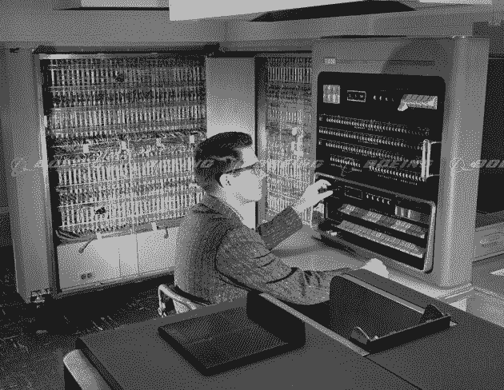

*IBM 701*

但是，宣告胜利的头条新闻里却隐藏了一个小小的细节。没人提到这些翻译得到的样本是经过精心挑选和测试过的，从而排除了歧义性。对于日常使用而言，该系统并不比口袋里的常用语手册更好。尽管如此，军备竞赛还是开始了：加拿大、德国、法国以及（特别是）日本全都加入到了机器翻译竞赛中。

**机器翻译竞赛**

改进机器翻译的徒劳工作持续了四十年之久。1966 年，US ALPAC 在其著名的报告中称机器翻译是昂贵的、不准确的和毫无希望的。他们转而建议将重点放在词典开发上，这将美国研究者排除在了竞赛之外近十年时间。

即便如此，仅凭科学家和他们的尝试、研究和开发，现代自然语言处理的基础还是建立了起来。多亏了这些彼此监视的国家，当今所有的搜索引擎、垃圾信息过滤器和个人助理都出现了。

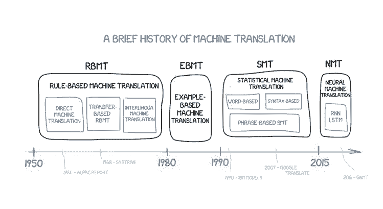

**基于规则的机器翻译（RBMT）**

最早的基于规则的机器翻译思想出现于 70 年代。科学家研究了翻译员的工作，试图让当时还极其缓慢的计算机也能重复这些行为。这些系统包含：

*   双语词典（比如，俄语->英语）

*   每种语言一套语言学规则（比如，以 -heit、-keit、-ung 等特定后缀结尾的名词都是阴性词）

这就是这种系统的全部。如有需要，该系统还能得到一些补充，比如增加姓名列表、拼写纠错器和音译功能。

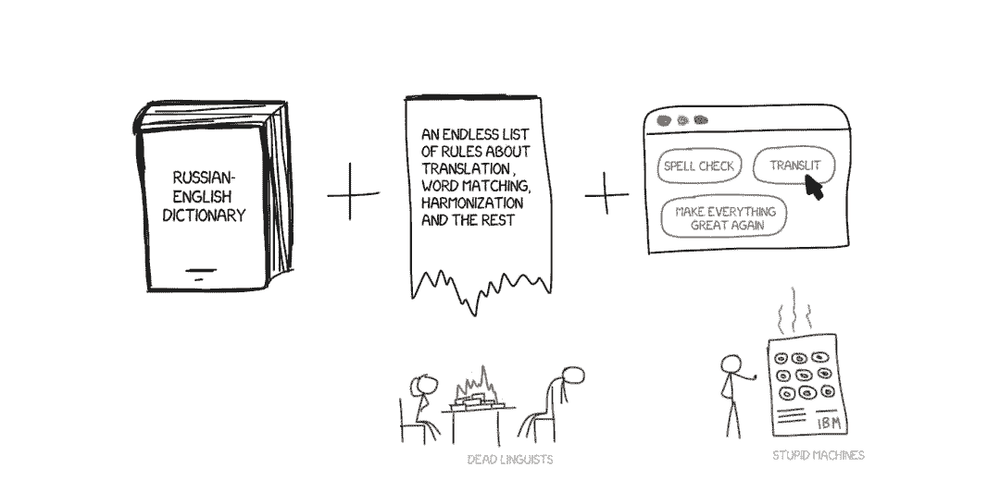

PROMPT 和 Systran 是 RBMT 系统中最有名的案例。如果你想感受下那个黄金时代的柔和气息，去试试 Aliexpress 吧。

但即使它们也有一些细微差别和亚种。

**直接机器翻译**

这是机器翻译中最直接的类型。它会将文本分成词，然后翻译这些词，再稍微校正一下形态，最后协调句法得到结果；或多或少听起来还行。当太阳落山后，训练有素的语言学家还在为每个词编写规则。

其输出会返回某种类型的翻译结果。通常情况下，结果很糟糕。就好像是这些语言学家白白浪费了自己的时间。

现代系统完全不会使用这种方法，现代语言学家对此感激不尽。

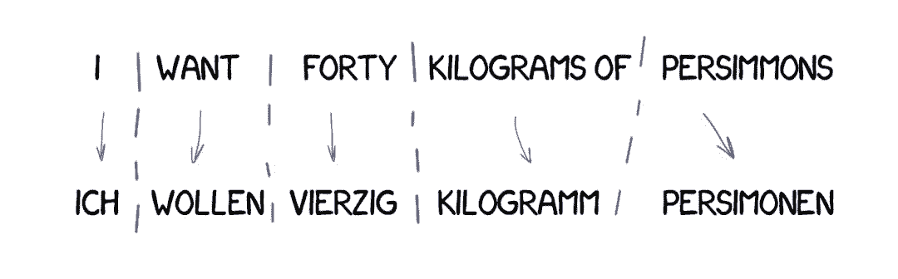

**基于迁移的机器翻译**

与直接翻译相比，我们翻译时要做准备——首先确定句子的语法结构，就像上学时老师教的那样。然后我们再操作整个结构，而不是一个个的词。这有助于在翻译中得到相当好的词序转换。理论上是这样。

但在实践中，这仍然会得到逐词翻译的结果并会让语言学家身疲力竭。一方面，它带来的是简化过的一般性语法规则。但另一方面，由于词结构的数量比单个的词要多得多，所以这又会变得更加复杂。

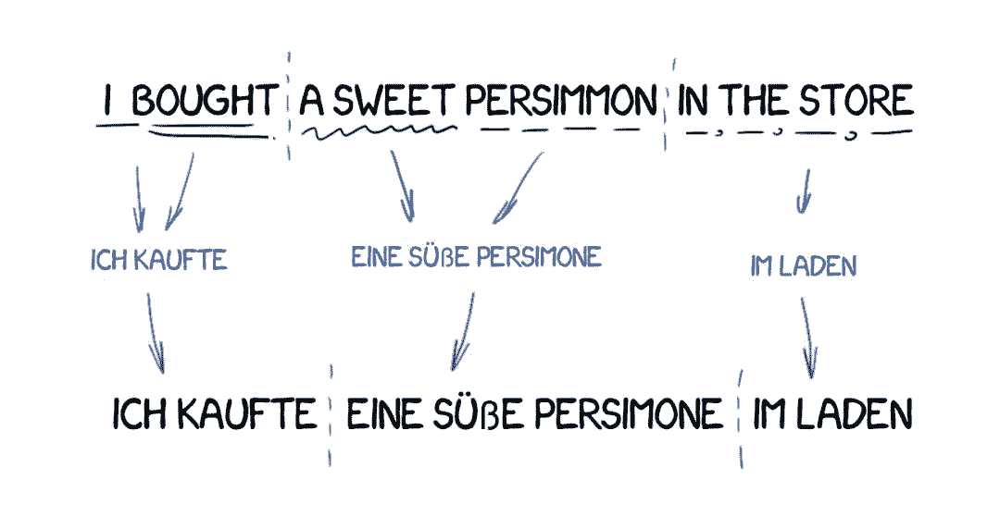

**语际机器翻译**

在这种方法中，源文本会被转换成中间表征，并且会被统一用于全世界的所有语言（中间语言）。这正是笛卡尔所梦想的那种中间语言：一种元语言，遵循普适的规则并且可以将翻译变成一种简单的「来回切换」任务。接下来，中间语言可以转换成任何目标语言，而这就是奇点！

正是由于存在这种转换，所以语际机器翻译常常会和基于迁移的系统混淆。语际机器翻译的不同之处是语言学规则是针对每种单独的语言和中间语言的，而不是针对语言对。这意味着我们可以向语际系统加入第三种语言并且在它们三者之间彼此翻译。而我们无法在基于迁移的系统中做到这一点。

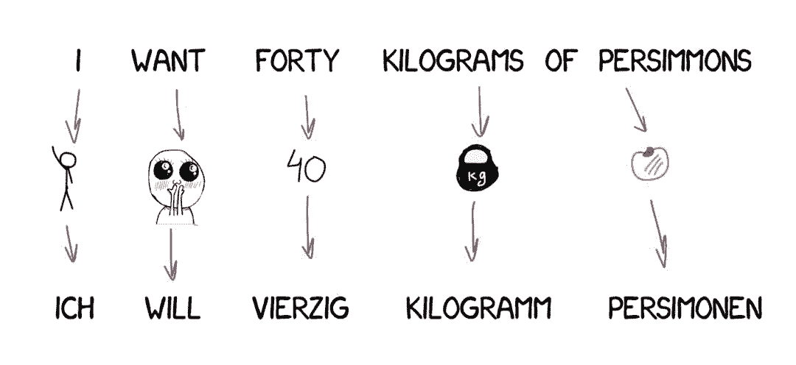

看起来很完美，但实际并不。创建这样一种通用的中间语言极其困难——很多科学家都在这上面投入了一生。他们还没有取得成功，但多亏了他们，我们现在有了形态层面、句法层面、甚至语义层面的表征。但只有语义-文本理论（Meaning-text theory）耗费了巨资！

中间语言的思想还会再回来的。让我们再等等看。

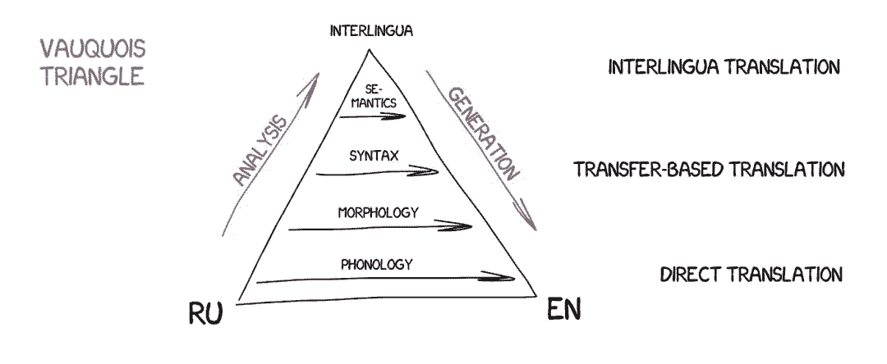

如你所见，所有的 RBMT 都很蠢笨和可怕，所以它们很少得到使用，除了一些特定的案例（比如天气报告翻译等）。RBMT 最常被提及的优点有形态准确性（不会混淆词）、结果的可再现性（所有翻译器的结果都一样）和调节到特定学科领域的能力（比如为了教授经济学家或特定于程序员的术语）。

就算有人真的成功创造出了一个完美的 RBMT，语言学家也用所有的拼写规则强化了它，但还是会存在某些例外情况：英语中的不规则动词、德语中的可分前缀、俄语中的后缀以及人们的表达方式存在差异的情况。任何试图涵盖所有细微差别的行为都会耗费数以百万小时计的工作时间。

还不要忘记多义词。同一个词在不同的语境中可能会具有不同的含义，这会得到不同的翻译结果。你试试能从这句话中理解到几种含义：I saw a man on a hill with a telescope?

语言不会按照什么固定的规则而发展——语言学家倒是喜欢这个事实。过去三百年中的侵略活动对语言的影响非常大。你怎么能向机器解释这一点？

四十年的冷战没能帮助找到任何明确的解决方案。RBMT 已死。

**基于实例的机器翻译（EBMT）**

日本对机器翻译竞赛尤其感兴趣。原因不是冷战，而另有其它：这个国家理解英语的人非常少。这在即将到来的全球化方面是一个很严重的问题。所以日本人非常积极地想要找到一种可行的机器翻译方法。

基于规则的英日翻译极其复杂。这两种语言的语言结构完全不一样，几乎所有词都需要重新排列，而且还需要添加新词。1984 年，京都大学的長尾真提出了一个思想：使用现成的短语而不是重复进行翻译。

假设我们想翻译一个简单的句子——「I'm going to the cinema.」而且我们之前已经翻译了一个类似的句子——「I'm going to the theater.」而且我们也能在词典中找到「cinema」这个词。

那么我们只需找到这两个句子的不同之处、翻译缺失的词、不要搞错了即可。我们拥有的实例越多，翻译结果就会越好。

我正是采用这种方式构建了下面的我不熟悉的外语短语！

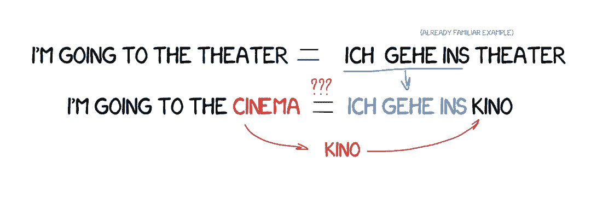

EBMT 让全世界的科学家看到了方向：事实证明，你可以直接向机器输入已有的翻译，而不必花费多年时间构建规则和例外。革命还没有发生，但显然已经迈出了第一步。革命性的统计机器翻译发明将在那之后短短五年内诞生。

**统计机器翻译（SMT）**

1990 年初，IBM 研究中心首次展示了一个对规则和语言学一无所知的机器翻译系统。它分析了两种语言的相似文本并且试图理解其中的模式。

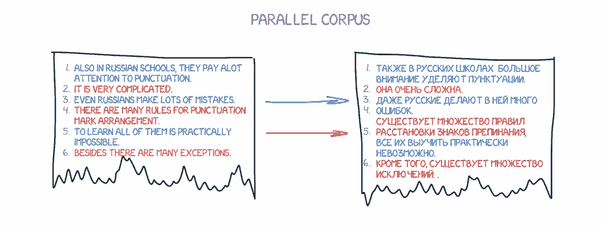

这是一个简洁而又优美的思想。两种语言中的同一句子被分成单词，然后再进行匹配。这种操作重复了近 5 亿次，记录下了很多模式，比如「Das Haus」被翻译成「house」或「building」或「construction」等词的次数。

如果大多数时候源词都被翻译成「house」，那么机器就会使用这一结果。注意我们没有使用任何规则，也没有使用任何词典——所有的结论都是由机器完成的，其指导方针是统计结果和这样的逻辑——「如果人们这样翻译，我也这样翻译」。统计翻译由此诞生。

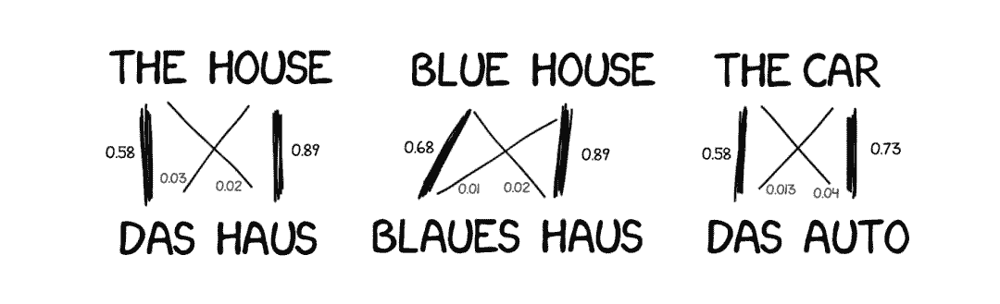

这个方法比之前的所有方法都更加有效和准确。而且无需语言学家。我们使用的文本越多，我们得到的翻译结果就越好。

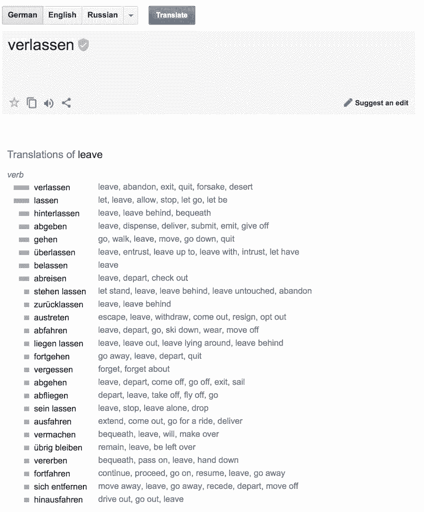

谷歌的统计翻译内部情况示例。它不仅给出了概率，而且还显示了反向翻译结果统计

仍然还有一个遗留问题：机器该怎样将「Das Haus」与「building」对应起来呢——我们又怎么知道翻译结果是正确的？

答案是我们没法知道。一开始，机器会假设「Das Haus」一词与来自翻译句子的任意词都有同等的关联。接下来，当「Das Haus」出现在其它句子中时，与「house」关联的数量会增多。这就是词对齐算法，这是大学级机器翻译的典型任务之一。

机器需要成百万上千万的双语句子才能收集到每个词的相关统计结果。我们如何得到这些数据？好吧，我们决定取用欧洲议会和联合国安理会会议的摘录，这些都是以所有成员国的语言提供的，而且可供下载：

*   UN Corpora：https://catalog.ldc.upenn.edu/LDC2013T06 

*   Europarl Corpora：http://www.statmt.org/europarl

**基于词的 SMT**

一开始的时候，最早期的统计翻译系统的工作方式是将句子分成词，因为这种方法很直观而且符合逻辑。IBM 的第一个统计翻译模型被称为 Model 1。名字也相当优雅，对吧？猜猜他们的第二个模型叫什么？

Model 1：逐词对应

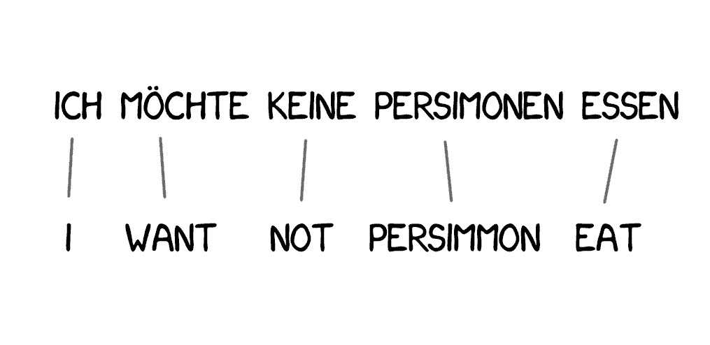

Model 1 使用了一种经典方法来将句子分成词和记录统计信息。这个过程不考虑词序。唯一要用的技巧是将一个词翻译成多个词。比如「Der Staubsauger」可能会变成「Vacuum Cleaner」，但并不意味着反过来也可以。

这里有一些基于 Python 的简单实现：https://github.com/shawa/IBM-Model-1

Model 2：考虑句子中的词序

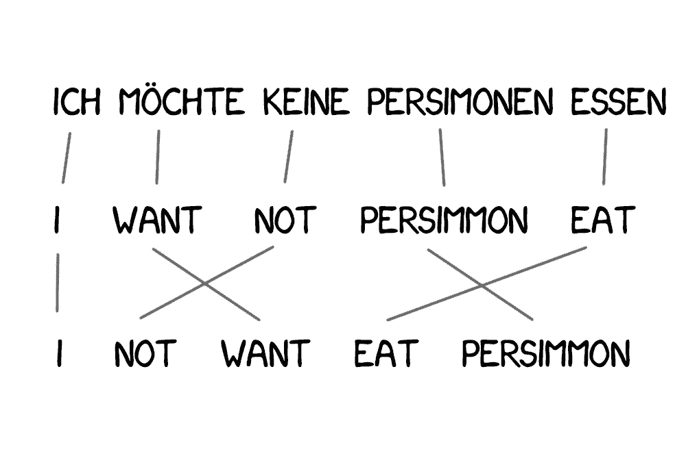

缺乏语言词序知识是 Model 1 的一个问题，而且这个问题在某些情况下很重要。

Model 2 解决了这个问题：它记忆了输出句子中词通常出现的位置，并且会通过一个中间步骤将词排列成更自然的形式。结果变得更好了，但仍然不尽人意。

Model 3：额外增添

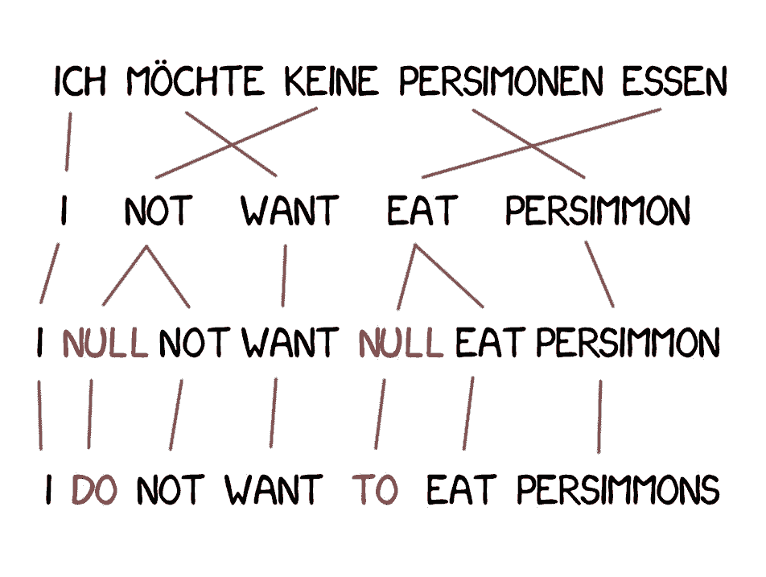

翻译结果中常常会出现新词，比如德语的冠词或英语否定句中的「do」。比如「Ich will keine Persimonen」→「I do not want Persimmons.」为了解决这个问题，Model 3 又增加了两个步骤：

*   如果机器认为有加入新词的必要性，则插入 NULL 标记

*   为每个标记词的对齐选择合适的小品词或词

Model 4：词对齐

Model 2 考虑了词对齐，但对词序重排一无所知。比如，形容词常会与名词交换位置，所以不管词序记忆得多好，都不会让输出结果更好。因此，Model 4 考虑了所谓的「相对顺序」——如果两个词总是交换位置，模型就能学到。

Model 5：修正错误

这里没什么新鲜的。Model 5 所要学习的参数更多了，而且修正了词位置冲突的问题。

尽管基于词的系统本身是革命性的，但它们仍然无法处理格、性和同义词。每一个词都只有单一一种翻译方式。现在我们已经不再使用这种系统了，因为它们已经被更为先进的基于短语的方法替代。

**基于短语的 SMT**

这种方法基于所有基于词的翻译原则：统计、重新排序和词法分析。但是，在学习时，它不仅会将文本分成词，还会分成短语。确切地说，这些是 n-gram，即 n 个词连在一起构成的连续序列。

因此，这个机器能学习翻译稳定的词组合，这能显著提升准确度。

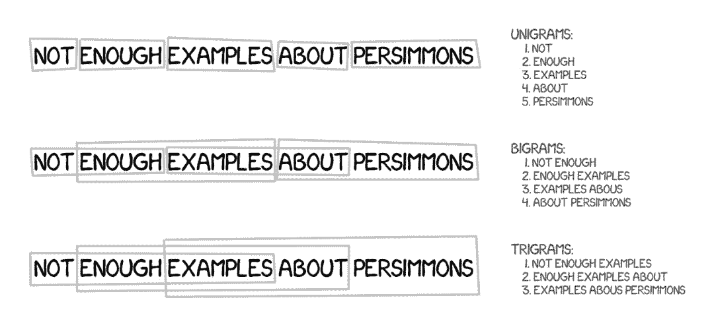

其中的诀窍在于，这里的短语并不总是简单的句法结构，而且如果有人明白语言学并干预了其中的句子结构，那么翻译的质量就会大幅下降。计算语言学先驱 Frederick Jelinek 曾经开玩笑地说：「每次我炒掉一个语言学家，语音识别器的表现就会上升一点。」

除了提升准确度，基于短语的翻译在选择所要学习的双语文本上提供了更多选择。对于基于词的翻译，源文本之间的准确匹配是至关重要的，这就排除了让任何文学翻译或自由翻译。基于短语的翻译则可以从中学习。为了提升翻译质量，研究者甚至开始解析不同语言的新闻网站。

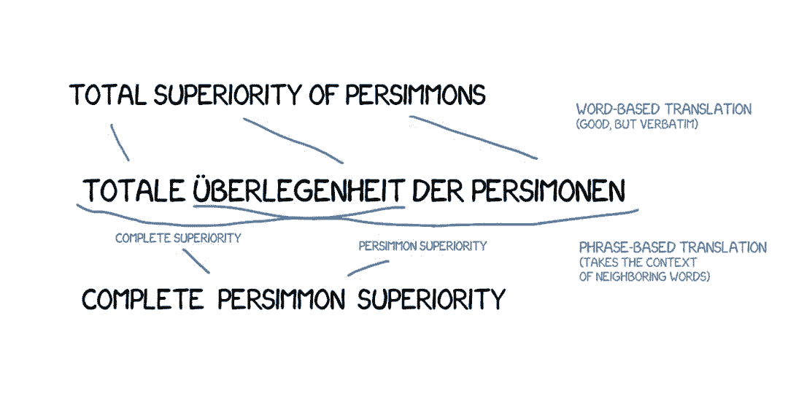

自 2006 年以来，每个人都开始使用这种方法。谷歌翻译、Yandex、必应等一些著名的在线翻译工具将基于短语的方法用到了 2016 年。你们可能都还记得谷歌要么得到毫无差错的翻译句子，要么得到毫无意义的结果的时候吧？这种毫无意义就来自基于短语的功能。

老一辈基于规则的方法总是会得到可预测的但也很糟糕的结果。统计方法则总是会得到出人意料和让人困惑的结果。谷歌翻译会毫不犹豫地将「three hundred」变成「300」。这就是所谓的统计异常（statistical anomaly）。

基于短语的翻译已经变得非常流行，当你听到人们说「统计机器翻译」时，多半就是指它。在 2016 年之前，所有的研究都称赞基于短语的翻译是表现最好的。那时候，甚至没人认为谷歌已经在燃起战火，准备改变整个机器翻译图景了。

**基于句法的 SMT**

这种方法应当被简要提及一下。在神经网络出现的很多年前，基于句法的翻译被认为是「翻译的未来」，但这一思想并未迎来腾飞。

基于句法的翻译的支持者相信它有可能与基于规则的方法融合。它需要对句子进行相当准确的句法分析——以确定主语、谓语和句子的其它部分，然后再构建一个句子树。机器可以使用它来学习转换语言之间的句法单元并根据词或短语来翻译其余部分。那应该可以一劳永逸地解决词对齐问题。

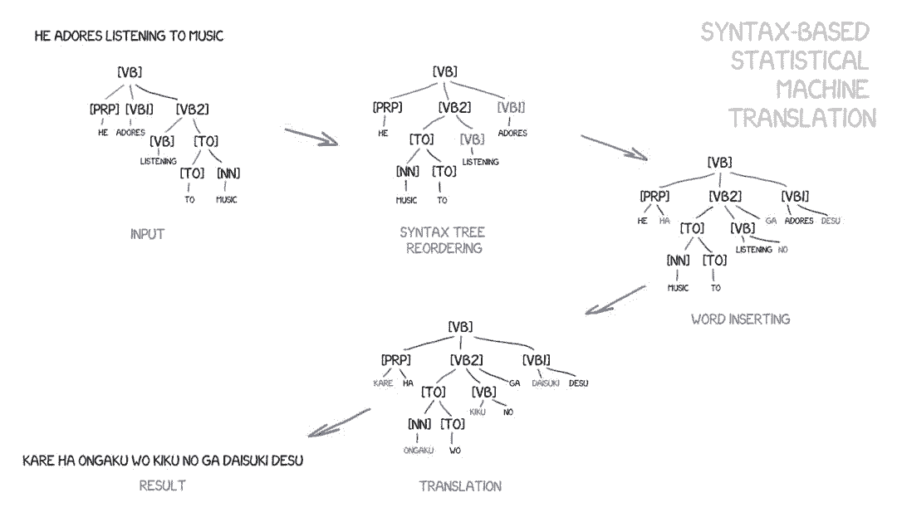

*来自 Yamada and Knight [2001] 的示例（http://www.aclweb.org/anthology/P01-1067）以及这个很棒的幻灯片（http://homepages.inf.ed.ac.uk/pkoehn/publications/esslli-slides-day5.pdf）*

问题是句法分析的效果很差，尽管事实上我们认为这在之前已经得到了解决（因为我们有很多语言的现成可用的库）。我曾经试过使用句法树来解决比单纯地解析主语和谓语更复杂的任务。但我每次都放弃了，然后使用了另一种方法。

如果你成功过至少一次，请让我知道。

**神经机器翻译（NMT）**

2014 年，一篇关于将神经网络用于机器翻译的出色论文发布：https://arxiv.org/abs/1406.1078。互联网并没关注这项研究，但谷歌除外——他们挽起袖子就干了起来。两年之后的 2016 年 9 月，谷歌发布了改变机器翻译领域的公告，参阅《[重磅 | 谷歌翻译整合神经网络：机器翻译实现颠覆性突破](http://mp.weixin.qq.com/s?__biz=MzA3MzI4MjgzMw==&mid=2650719470&idx=1&sn=3368dea980517ea7d7942967da2740dc&chksm=871b0090b06c89863620be4e75c757940d03d8a43cd3c1d9a8309b6594c1bccd769cab193177&scene=21#wechat_redirect)》。

这一思想接近照片之间的风格迁移。知道 Prisma 这样的应用吗？它能用某幅著名艺术作品的风格来渲染图片。但这不是魔法。是神经网络学会了识别艺术家的画作。接下来，包含网络决策的最后一层被移除了。所得到的风格化图像只是网络所得到的中间图像。这是网络自己的幻想，而我们觉得这很美。

如果我们可以迁移照片的风格，那我们能不能将另一种语言施加到源文本上呢？我们可以将文本看作是带有某种「艺术家风格」，我们希望在迁移这个风格的同时又保证这些文本的本质不变。

想象一下，假如我要描述我的狗——平均个头、尖鼻子、短尾巴、老是叫唤。如果我把这些狗的特征给你并且描述是准确的，你就可以画出它，即使你从没见过它。

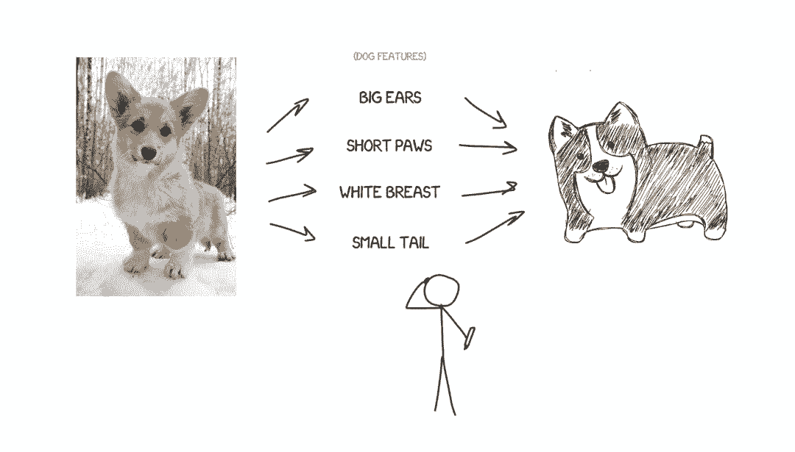

现在，再想象源文本是特定特征的集合。基本上而言，这意味着你可以编码它，然后再让其它神经网络将其解码回文本——但是另一种语言的文本。解码器只知道自己的语言。它对这些特征的来源一无所知，但它可以用西班牙语等语言将其表达出来。再继续前面的比喻，不管你是怎么画这条狗的（用蜡笔、水彩或你的手指），你都可以把它画出来。

再说明一次：一个神经网络只能将句子编码成特定的特征集合，另一个神经网络只能将其解码成文本。这两者彼此都不知情，而且都只各自了解自己的语言。想起什么没有？「中间语言」回来了！

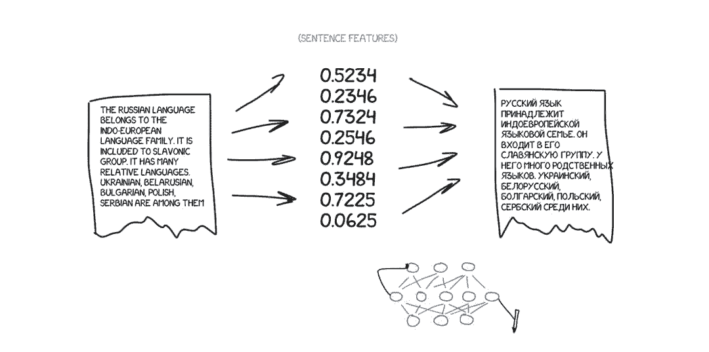

问题是，我们如何找到这些特征？对于狗来说，特征当然很明显，但文本的特征是怎样的？三十年前科学家就已经在尝试创建通用语言代码了，但最终以失败告终。

尽管如此，我们现在有深度学习了。寻找特征是它的基本任务！深度学习和经典神经网络之间的主要区别是搜索这些特定特征的能力，而无需对这些特征的本质有任何了解。如果神经网络足够大，而且有数千块显卡可用，那就能很好地找到文本中的这些特征。

理论上讲，我们可以将这些神经网络得到的特征交给语言学家，这样他们就可以为自己打开一片新视野了。

但问题是编码和解码应该使用哪种类型的神经网络呢？卷积神经网络（CNN）完美适用于图像，因为它们可以操作独立的像素块。

但文本中没有独立的块——每个词都取决于自己的语境。文本、语音、音乐都是连续的。所以循环神经网络（RNN）是处理它们的最佳选择，因为它们能记住之前的结果——在这里即是之前的词。

现在很多应用都已经使用了 RNN，包括 Siri 的语音识别（解析声音序列，其中后一个声音取决于前一个声音）、键盘提示（记住之前的经历，猜测下一个词）、音乐生成和聊天机器人。

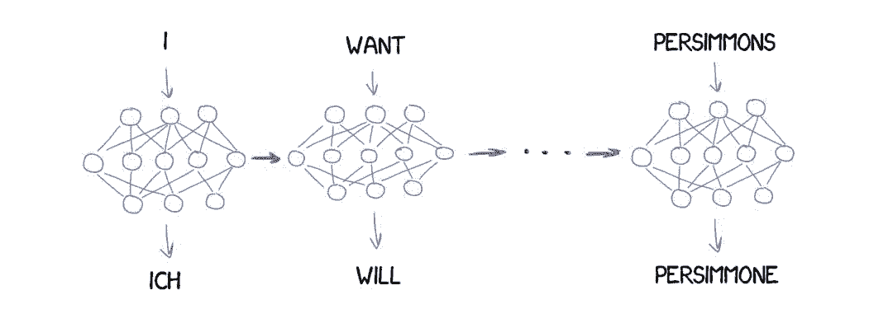

致像我一样的技术宅：事实上，神经翻译器的架构非常多样。一开始是用的常规 RNN，后来升级成了双向 RNN，其中翻译器不仅要考虑源词之前的词，还有考虑其后的词。这要高效得多。然后它又使用了带有 LSTM 单元的多层 RNN，可以实现翻译语境的长期存储。

短短两年时间，神经网络在翻译上的表现就超越了过去 20 年来的一切。神经翻译的词序错误少了 50%、词汇错误减少了 17%、语法错误减少了 19%。神经网络甚至学会了协调不同语言的性和格。而且并没有人教它们这样做。

这一领域最值得提及的进展是从没使用过直接翻译。统计机器翻译方法总是可以使用英语作为关键源。因此，如果你要将俄语翻译成德语，机器会首先将俄语翻译成英语，然后再将英语翻译成德语，这会造成双倍损失。

神经翻译无需这样做——只需要一个解码器就行了。没有共同词典的语言之间也能实现直接翻译，这是有史以来的第一次。

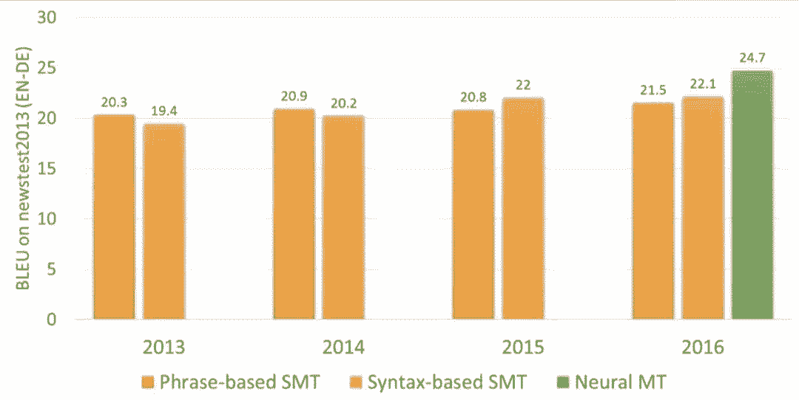

**谷歌翻译（自 2016 年以来）**

2016 年，谷歌为 9 种语言启用了神经翻译。他们开发出了名为谷歌神经机器翻译（GNMT）的系统。它由 8 个编码器和 8 个解码器 RNN 层构成，另外还有来自解码器网络的注意连接。

他们不仅会切分句子，而且还会切分词。这正是他们解决 NMT 一大主要难题的方法——即罕见词问题。但出现了它们词汇库中没有的词时，NMT 是无能为力的。比如说「Vas3k」。我估计没人让神经网络学习翻译我的昵称。在遇到罕见词时，GNMT 会尝试将词分解成词片段，然后根据这些片段得到翻译结果。很聪明的做法。

提示：浏览器中用于网站翻译的谷歌翻译仍然用的是老旧的基于短语的算法。不知为何谷歌没有升级，而且其翻译结果和在线版本谷歌翻译相比差距其实相当大。

在线版本的谷歌翻译使用了众包机制。人们可以选择他们认为最正确的版本，而且如果很多用户都认同，那么谷歌就会一直按这种方式翻译这个短语并将其标注为一个特例。对于「Let』s go to the cinema」或「I』m waiting for you」等日常使用的短句而言，这种做法效果很好。谷歌的英语会话水平比我还好，不开森～

微软必应的工作方式和谷歌翻译差不多。但 Yandex 不一样。

**Yandex Translate（自 2017 年以来）**

Yandex 于 2017 年推出了自己的神经翻译系统。该公司宣称其主要特色是混合性（hybridity）。Yandex 将神经方法和统计方法组合到了一起来执行翻译，然后再使用其最喜欢的 CatBoost 算法从中选出最好的一个。

问题是神经翻译在翻译短句时常常出错，因为它需要使用上下文来选择正确的词。如果一个词在训练数据中出现的次数非常少，那就很难得到正确的结果。在这种情况下，简单的统计翻译能轻松快捷地找到正确的词。

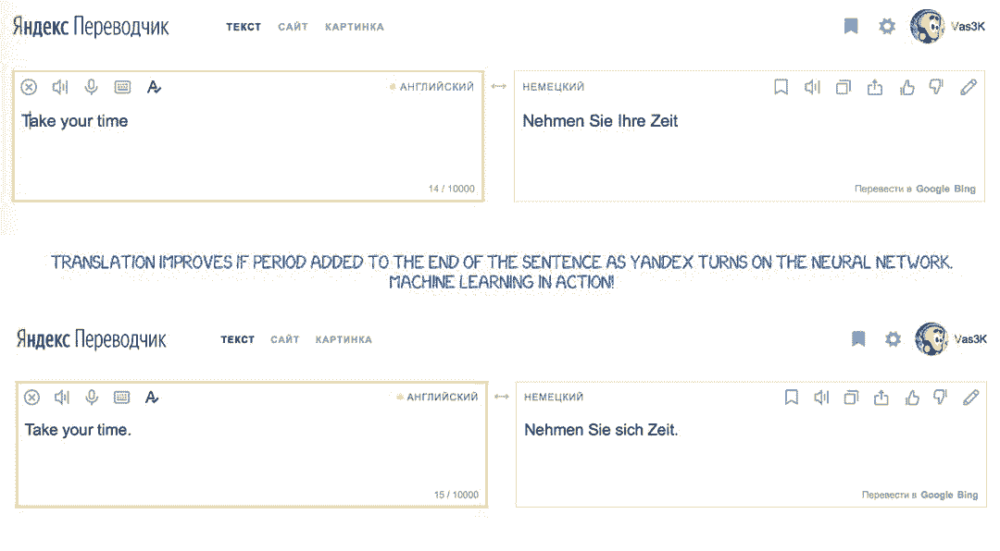

在句子末尾加上句号后，Yandex 的翻译结果更好了，因为这时候它启用了神经网络机器翻译。

Yandex 没有分享具体的技术细节。它用营销新闻稿搪塞了我们。好吧。

看起来谷歌使用了 SMT 来执行词和短句的翻译。他们没有在任何文章中提及这一点，但如果你查看短表达和长表达之间的差别，你就能相当明显地注意到。此外，SMT 也被用来展示词的统计情况。

**结论和未来**

每个人都仍然为「巴别鱼」（即时语音翻译）的构想感到兴奋。谷歌已经带着 Pixel Buds 耳机向这个方向迈出了一步，但事实上这仍然达不到我们梦想的效果。即时语音翻译与通常的翻译不同。系统需要知道何时开始翻译以及何时闭嘴聆听。我还没见到过任何能够解决这一问题的方法。也许，Skype 还行吧……

而且有待推进的领域不止这一个：所有的学习都受限于并列文本块的集合。最深度的神经网络仍然是在并列文本中学习。如果不向神经网络提供资源，它就无法学习。而人类可以通过阅读书籍和文章来扩增自己的词汇库，即使不会将其翻译成自己的母语。

如果人类能做到，神经网络就也能做到。理论上讲是这样。我只发现了一个原型设计试图开发出能让知晓一种语言的网络能通过阅读另一种语言的文本来获取经验：https://arxiv.org/abs/1710.04087。我倒是想自己试试看，但我很笨。好了，就这样吧。

**有用的链接**

*Philipp Koehn：统计机器翻译：https://www.amazon.com/dp/0521874157/。我发现方法的最完整的集合。*

*Moses：http://www.statmt.org/moses/。一个很受欢迎的库，可用于创建自己的统计翻译系统。*

*OpenNMT：http://opennmt.net/。另一个库，但是用来创建神经翻译器的*

*我最喜欢的博主的文章，解释了 RNN 和 LSTM：https://colah.github.io/posts/2015-08-Understanding-LSTMs/*

*视频「如何制作一个语言翻译器」：https://youtu.be/nRBnh4qbPHI。这家伙很有趣，解释得很不错，但不够充分。*

*来自 TensorFlow 的文本教程，教你如何创建神经翻译器：https://www.tensorflow.org/tutorials/seq2seq。想查看更多案例和尝试代码的人可以参考。*

**看完这篇文章是否想对神经机器翻译有更多了解？点击「阅读原文」报名参与机器之心 Interface#4**

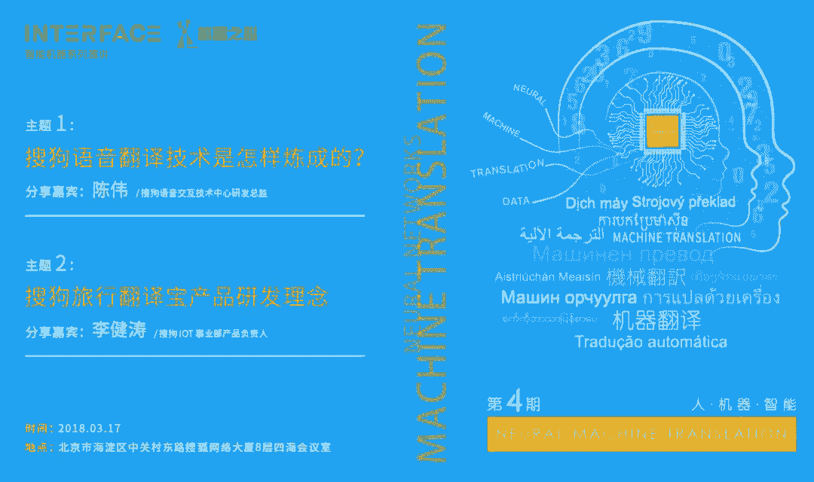