# 一图抵千言：带你了解最直观的神经网络架构可视化

选自 Medium

**作****者： Piotr Migdał**

**机器之心编译**

**参与****：李诗萌、路**

> 一张好的图抵得上一千个等式。

神经网络是复杂、多维、非线性的数组运算。如何在避免过于复杂或重复的情况下呈现深度学习模型架构的重要特征呢？又该以何种方式清晰直观、启发性地呈现它们呢？（好看也是加分项！）无论研究还是教学项目对此都没有固定标准。本文我们就来了解一下可视化整个神经网络架构和特定模块的工具和技巧。

**基线**

AlexNet 是突破性的架构，它使卷积网络（CNN）成为处理大型图像分类任务的主要机器学习算法。介绍 AlexNet 的论文呈现了一张很好的图，但是好像还缺点什么……

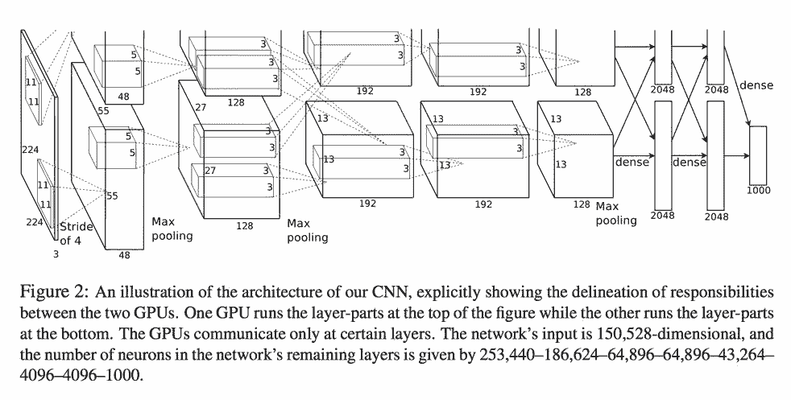

*AlexNet 架构图示。（图源：《ImageNet Classification with Deep Convolutional Neural Networks》http://www.cs.toronto.edu/~fritz/absps/imagenet.pdf）*

不需费力也能看出这张图的上半部分被意外裁掉了，而这张图会贯穿后续所有的幻灯片、参考文献等。在我看来，这说明在深度学习的研究中，可视化并不受重视（当然也有一些例外，比如线上期刊 Distill）。

有人会辩解：开发新算法和调参是真正的科学／工程，但视觉呈现则属于艺术领域，且毫无价值。我完全不同意这种观点！

当然，对于运行程序的计算机而言，代码没有缩进或者变量命名比较模糊可能无伤大雅。但对人类则不然。学术论文不是一种发现方式，而是交流方式。

以另一个复杂的理论——量子场论为例。如果你想要呈现电子-正电子的湮没过程，就要创建一个 μ 子-反 μ 子对，下图是费曼图（一阶项）：

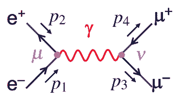

*图源：https://www.hep.phy.cam.ac.uk/~thomson/partIIIparticles/handouts/Handout_4_2011.pdf*

这很可爱对吧？但这张图没有什么艺术性可言。它只是散射振幅的图形表示，这张图中的每条线都是一个传播子，每一个顶点都表示点和点的交互。这张图可以直接变成下式：

我可能更偏向于「使事情更简单」，就像我在 JavaScript 中处理复杂张量运算一样，而且提前可视化结果是一件很酷的事情。在量子力学和深度学习中，我们都可以用张量结构做大量线性代数的运算。事实上，甚至有人用 Pytorch 实现爱因斯坦求和约定。

**解释神经网络的层**

在了解网络架构之前，我们先来关注一下网络的基本构建模块——层。例如，可以用下式描述长短期记忆模型（LSTM）单元：

当然，如果你对矩阵乘法熟悉的话，可以很容易地解出这些等式。但解出这些等式是一回事，理解它们就是另一回事了。我第一次看到 LSTM 的公式时就可以解出来，但我不知道它们是什么意思。

我所说的「理解」不是指精神上的启蒙，而是建立一个我们能够使用的心理模型（用于解释、简化、修改和预测 what-if 情景等）。一般而言，图表会比口头说明更清晰：

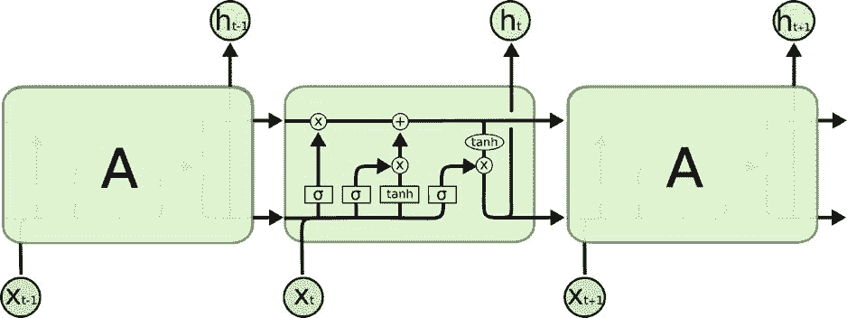

*图源：http://colah.github.io/posts/2015-08-Understanding-LSTMs/*

《理解 LSTM 网络》是一篇关于 LSTM 的好文章，这篇文章一步步解释了 LSTM 的原理。这篇文章使我灵光一现，将一组看似随机的乘法集合转换为写作（阅读）数据的合理方法。

下图是一个更清晰的 LSTM 图：

*图源：https://eli.thegreenplace.net/2018/minimal-character-based-lstm-implementation/*

我认为：一张好的图抵得上一千个公式。

这几乎适用于任何模块。我们可以将概念可视化，如 dropout：

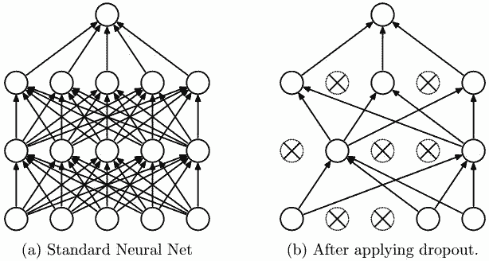

*图源：论文《Dropout: A Simple Way to Prevent Neural Networks from Overfitting》（http://www.cs.toronto.edu/~rsalakhu/papers/srivastava14a.pdf）*

图示可用于解释由更小的模块（例如几个后面的卷积）组成的复合模块。看一下这个 Inception 模块的图：

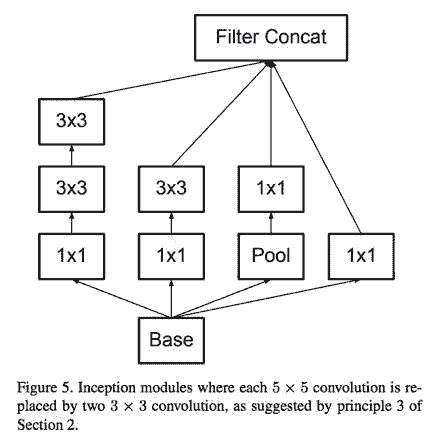

*图源：论文《Rethinking the Inception Architecture for Computer Vision》（https://arxiv.org/abs/1512.00567）*

每个可视化的图像都是不同的——不仅是风格不同，它强调的重点和抽象的内容也不同。那么哪些是重要的呢？层数、层与层之间的连接、卷积核大小还是激活函数？这都要视情况而定。抽象意味着「独立思考事物联系和属性的过程」。难点在于确定哪些要重点强调，以及哪些可以简要概括。

例如，在批归一化（Batch Normalization）的图中，重点是逆推过程：

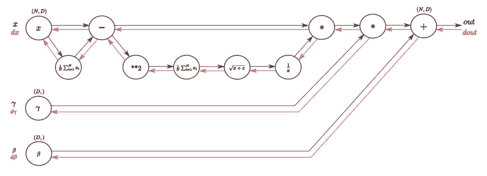

*图源：https://kratzert.github.io/2016/02/12/understanding-the-gradient-flow-through-the-batch-normalization-layer.html*

**数据可视化与数据艺术**

你可能觉得我是想让深度学习的文章看起来更具吸引力。可是让图表更好看也没什么坏处啊。当我在进行数据探索时，我一般会用好看的配色方案，以使读者获得更好的阅读体验。我的主要观点是将可视化图像转变为更高效的沟通手段。

所以，更好看就意味更好吗？不一定。Lisa Charlotte Rost 的文章《The Line between Data Vis and Data Art》就很有见地地解释了二者之间的区别。

*图源：https://lisacharlotterost.github.io/2015/12/19/Meaning-and-Beauty-in-Data-Vis/*

以下图为例：

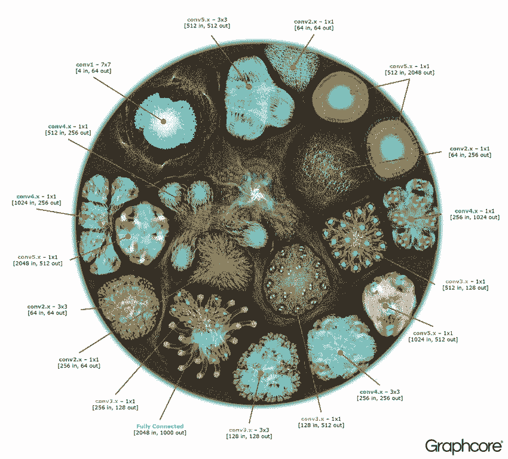

*图源：https://www.graphcore.ai/posts/what-does-machine-learning-look-like*

很美吧。对我来说，它看起来就像是有生命的——像是一个带有细胞器的细胞。但是我们能从中推断出什么吗？你猜得到它其实就是 AlexNet 吗？

举另一个例子，这是一个更注重美学而非其解释价值的多层感知器动图图示：

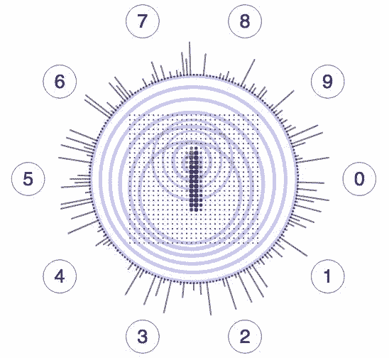

*图源：http://chumo.github.io/Sinapsis/*

要明确的是：只要我们不混淆艺术价值和教育价值，则数据艺术自身就有价值。如果你喜欢我的观点，那么我鼓励你用像火花或五颜六色的大脑这样的 3D 动画可视化真正的卷积网络。

有时候这种取舍也没那么明确。像下面这张图，它体现的是数据的可视化还是数据的艺术？

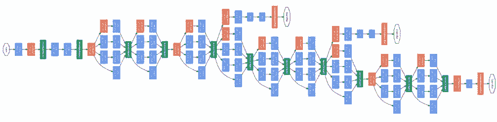

*图源：论文《Going Deeper with Convolutions》（https://arxiv.org/abs/1409.4842Christian）*

我猜你肯定会说：「这显然是数据可视化」。就本例而言，我们的意见出现了分歧。虽然这张图的配色方案很好，而且相似结构的重复看起来很愉快，但要根据这张图实现这个网络还是有难度的。当然，你能得到这个网络架构的重点——即层的数量以及模块的结构，但是要想重现该网络只有这些还不够（至少在没有放大镜的情况下是无法实现这个网络的）。

为了让图像变得清楚，出版物一般会为数据艺术留有一定的空间。例如，在一个用于检测皮肤状态的网络中，我们可以看到 Inception v3 特征提取层的图。很明显，作者只是使用该模型并用图表示了出来，而没有解释其内部工作原理：

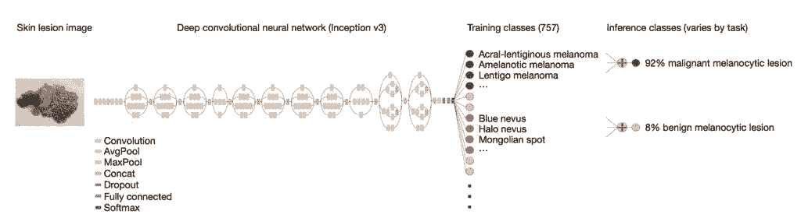

*图源：https://cs.stanford.edu/people/esteva/nature/*

为了研究激活所选通道的视觉模式，你要如何对下面的两幅图进行分类？

*图源：https://distill.pub/2017/feature-visualization/appendix/*

我会把下方的图作为数据可视化的很好示例。迷幻的图像不意味着就是数据艺术。这个例子的重点在于网络架构抽象化以及相关数据的呈现（激活给定通道的输入图像）。

**解释性架构图**

我们看了一些层图示的例子，以及与神经网络架构相关的数据艺术。

下面就来了解一下神经网络架构的（数据）可视化。下图是 VGG16 的架构，VGG 16 是用于图像分类的标准网络。

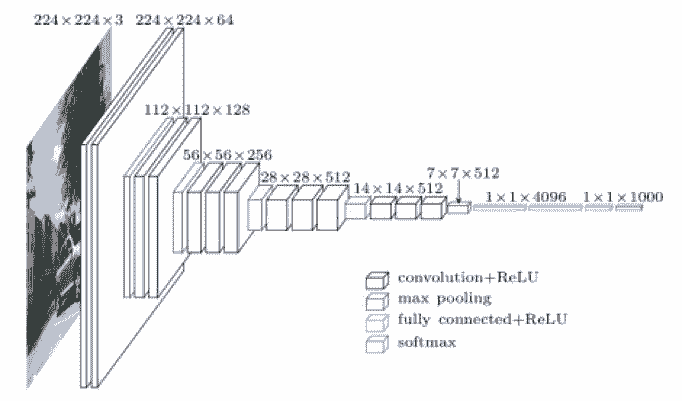

*图源：https://blog.heuritech.com/2016/02/29/a-brief-report-of-the-heuritech-deep-learning-meetup-5/*

我们可以看到每一步的张量大小以及操作（用颜色标记）。它不是抽象的——盒子大小与张量形状相关。但厚度和通道数量并不成比例。

还有类似的方式是显示每个通道的值，如 DeepFace 工作示例图： 

*图源：https://research.fb.com/publications/deepface-closing-the-gap-to-human-level-performance-in-face-verification/*

这样的图不仅限于计算机视觉。下面是一个将文本转换为颜色的例子：

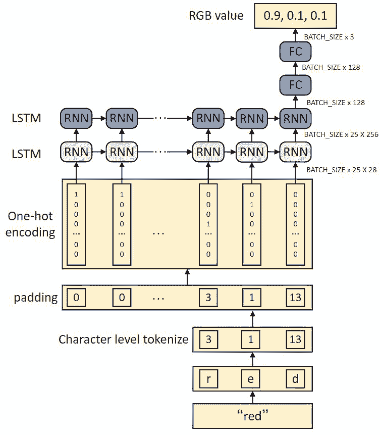

*图源：https://heartbeat.fritz.ai/how-to-train-a-keras-model-to-generate-colors-3bc79e54971b*

如果目的是呈现网络架构同时说明内部工作原理的话，这样的图就显得非常有用了。在教程中它们似乎尤其有用，例如 http://karpathy.github.io/2015/05/21/rnn-effectiveness/。

**抽象的架构图**

但对大型模型而言，解释性的图可能太过复杂或太过具体，以至于它们无法在一个图内呈现所有可能的层。所以就要用抽象图。一般而言，节点表示运算，箭头表示张量流。比较 VGG-19 和 ResNet-34：

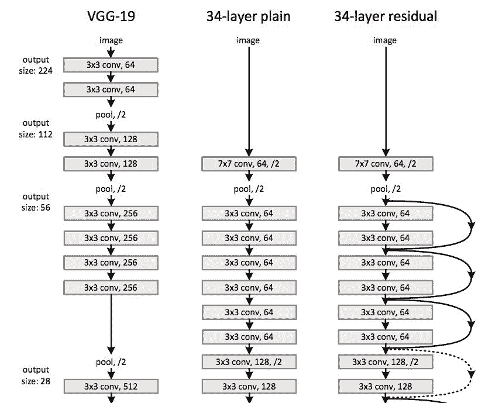

*图源：论文《Deep Residual Learning for Image Recognition》（https://arxiv.org/abs/1512.03385）*

我们可以看出，上图存在一些冗余，因为有一些重复使用的单元。由于图像可能很长，最好是找到其模式并对其进行合并。这样的层级结构使理解概念以及从视觉角度呈现它们变得更加简单（除非我们只想创建 GoogLeNet 的数据艺术图）。

举个例子，我们看一下 Inception-ResNet-v1 的图：

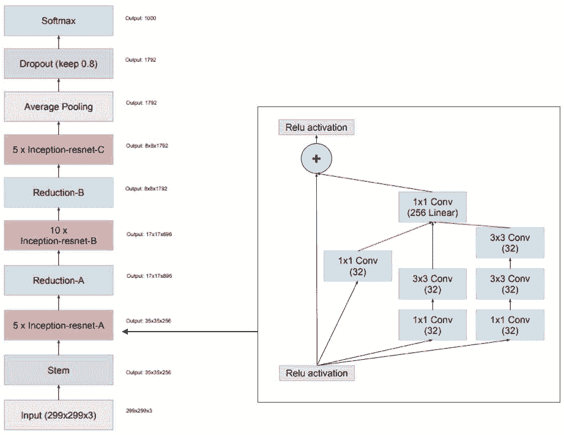

*图源：论文《Inception-v4, Inception-ResNet and the Impact of Residual Connections on Learning》（https://arxiv.org/abs/1602.07261）*

我喜欢这个图的构成——我们可以看到发生了什么以及重复使用了哪些模块。

另一个让我对概念更加明晰的图是用于图像分割的 U-Net 的图：

*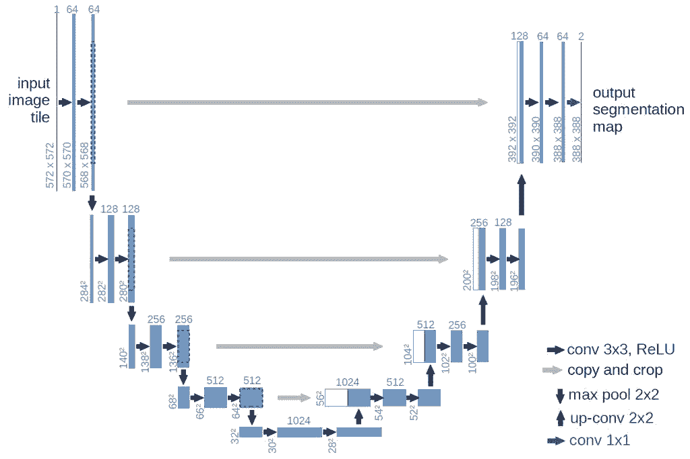*

*图源：https://lmb.informatik.uni-freiburg.de/people/ronneber/u-net/*

注意，这里的节点表示张量，箭头表示操作。我发现这张图非常清楚——我们可以看到张量的形状、卷积操作以及池化操作。因为原始的 U-Net 架构不是很复杂，因此我们可以不看它的层级结构。

当我们想用更复杂的构造块创建清晰的图的话会稍微复杂一点。如果要重现网络，我们需要了解网络的细节：

*   通道的数量；

*   每个最大池化中的卷积；

*   最大池化的数量；

*   批归一化或 dropout；

*   激活函数（是不是用 ReLu 函数？是在 BN 之前还是之后？）

下面就是一个很好的抽象图示例：

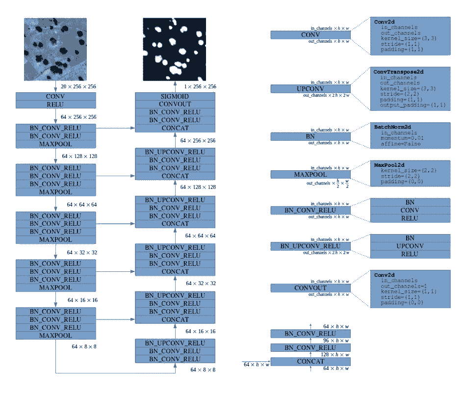

*图源：https://deepsense.ai/deep-learning-for-satellite-imagery-via-image-segmentation/）*

这张图在配色方面还可以做得更好，不过我喜欢它简洁的形式。图中还清晰地说明了通道数量，将每一个复杂的层清晰地分解为其构造块，保留了所有的细节（注意 3 级层级结构）。

还有一个表示神经网络模块层次的有趣方法：

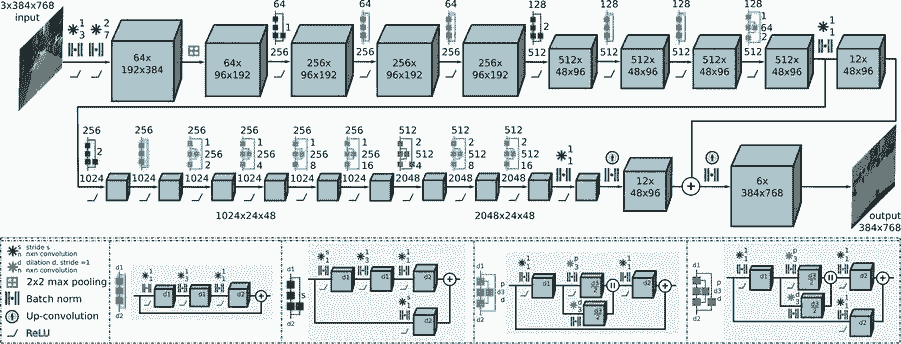

*图源：http://deepscene.cs.uni-freiburg.de/*

**神经网络架构可视化的自动化工具**

你可以手动绘制网络。像 Chris Olah 那样用 Inkscape、如果你喜欢 LaTeX 的话可以用 TikZ，也可以用其他工具。你也可以自动生成图像。

我希望你能意识到你已经在用视觉表示——代码（文本就是一种视觉表示！）——来与计算机进行交互。对某些项目而言，代码就足够了，尤其是如果你用的是简洁的框架（如 Keras 或 PyTorch）。对更复杂的架构来说，图会增加一些解释性的价值。

**TensorBoard：图**

TensorBoard 可以说是最常用的网络可视化工具。下图所示是一个 TensorFlow 网络图：

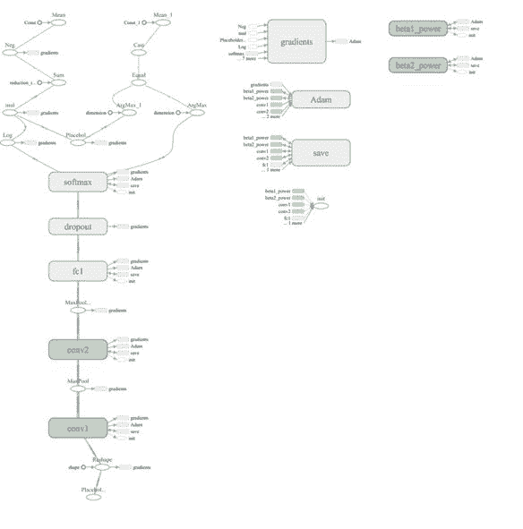

这张图是否提供了可读性较高的神经网络的概述？

我认为没有。

虽然这张图呈现了计算结构，但还是有些啰嗦（比如将偏置项作为单独的操作添加进去）。此外，它掩盖了网络最重要的部分：操作中的核心参数（如卷积核的大小）以及张量的大小。尽管有这么多的不足，我还是推荐大家阅读完整的论文：

Visualizing Dataflow Graphs of Deep Learning Models in TensorFlow（http://idl.cs.washington.edu/files/2018-TensorFlowGraph-VAST.pdf）

这篇文章提供了一些有关从下而上创建网络图所遇到的挑战的见解。虽然我们可以使用所有 TensorFlow 的操作，包括辅助操作（例如初始化工具以及日志工具），但做出一张通用的、可读的图依旧是个挑战。如果读者重视的东西我们却不重视，那就没法做出将 TensorFlow 计算图转变为有用的（比如发布就绪）图的通用工具。

**Keras**

Keras 是一个高级深度学习框架，因此它具有生成美观的可视化图的巨大潜力。（注：如果你想使用用于 Jupyter Notebook 的交互训练图，我写了一个：livelossplot（https://github.com/stared/livelossplot）。）然而在我看来，Keras 的默认可视化选项（使用 GraphViz）并非一流： 

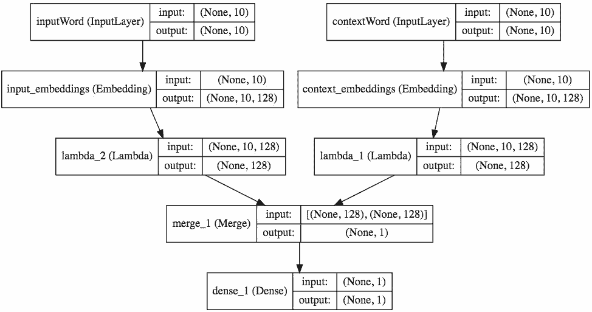

*图源：https://keras.io/visualization/*

我认为它不仅隐藏了重要的细节，还提供了冗余的数据（重复的张量大小）。从美学上讲，我也不喜欢它。

我试着写了另一个（pip install keras_sequential_ascii）用于训练：

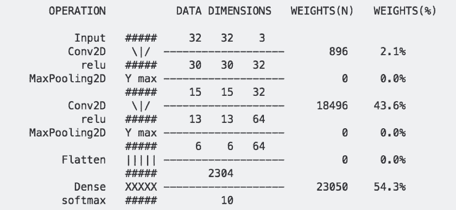

*图源：https://github.com/stared/keras-sequential-ascii (2017)*

这个结构适用于小型序列网络架构。我发现它对训练和「Starting deep learning hands-on: image classification on CIFAR-10」这样的课程很有用。但对更高级的项目则毫无用武之地（有人建议我用这篇 git 日志中的分支可视化工具（https://stackoverflow.com/questions/1057564/pretty-git-branch-graphs））。显而易见，我不是唯一一个试着用 ASCII 美化神经网络可视化图的人：

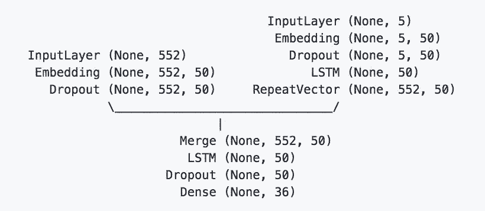

*图源：https://github.com/brianlow/keras_diagram*

我认为最美观的图是我在 Keras.js 中找到的：

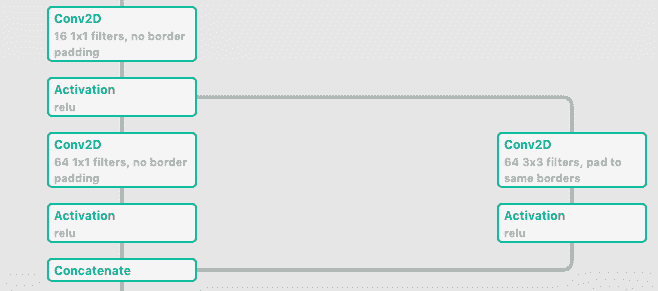

*图源：https://transcranial.github.io/keras-js/#/squeezenet-v1.1*

该项目没有处于积极开发状态，但它支持 TensorFlow.js。由于它是开源且模块化的（用了 Vue.js 框架），它可以作为创建独立的可视化项目的起点。在理想情况下，用 Jupyter Notebook 或单独的浏览器窗口工作，就像用 displaCy 分解句子一样。

**总结**

我们看了许多神经网络可视化的例子，这些例子都在以下方面做了取舍：

*   数据可视化 vs 数据艺术（有用性和美观性）

*   清晰 vs 模糊

*   浅层 vs 层级

*   静态（在出版物中效果很好）vs 交互（提供了更多信息）

*   特定 vs 通用（它是否适用于广泛的神经网络族？）

*   数据流方向（从上到下、从下到上还是从左到右？）

这些主题中的每一个都可以写一篇硕士论文，而将所有的合并在一起就可以写一篇博士论文（尤其是对人们如何进行可视化以及应该将哪些内容抽象进行细致的研究）。

**

**原文链接：https://medium.com/inbrowserai/simple-diagrams-of-convoluted-neural-networks-39c097d2925b**

 ****机器之心《全球 500 强上市公司人工智能战略适应性报告》重磅发布。17 个行业，140 家上市公司，纵览 500 强落地人工智能的成与败。**

**