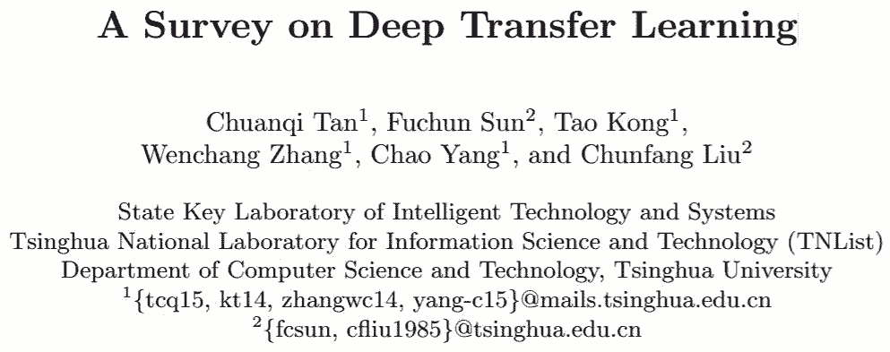
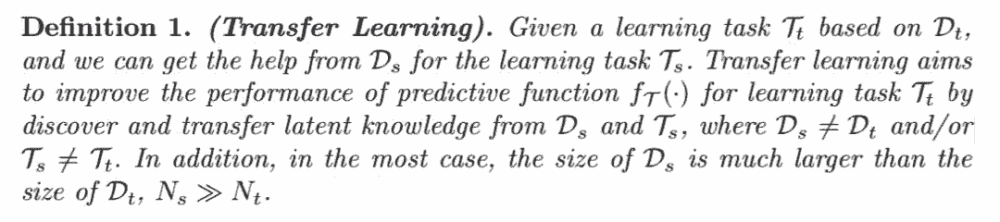
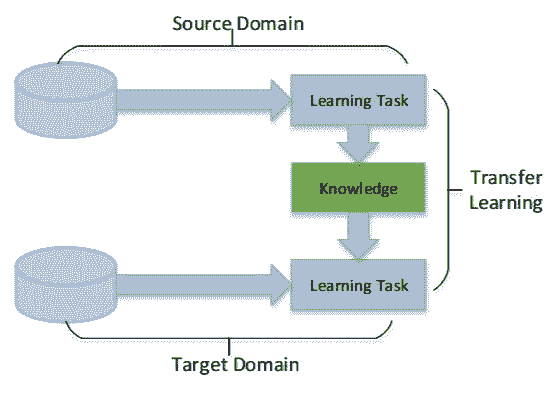
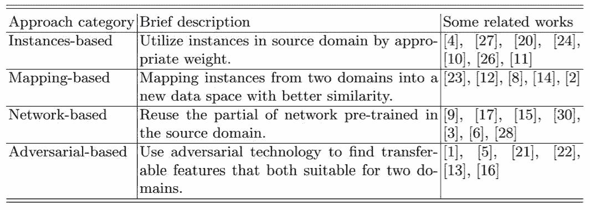
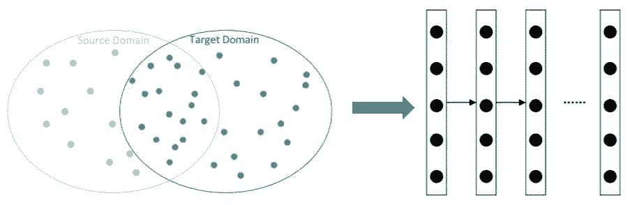
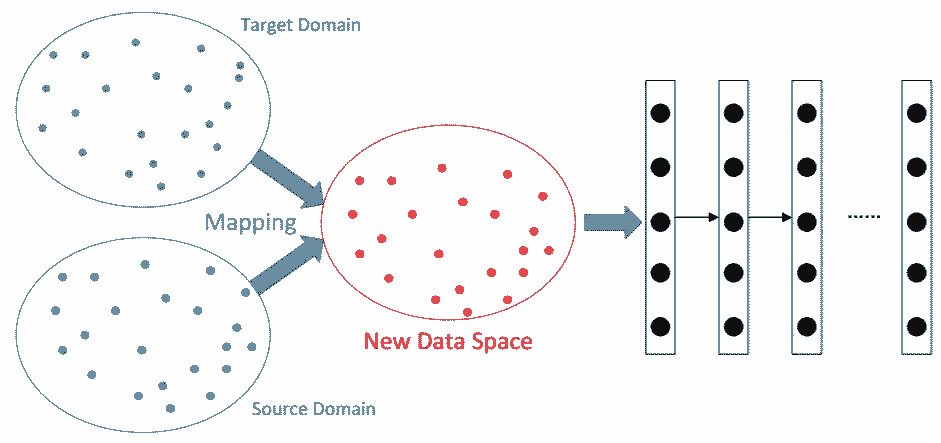
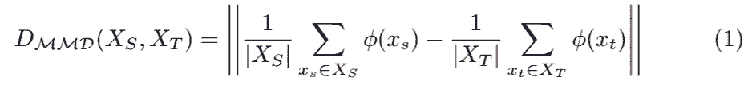
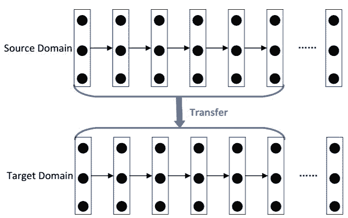
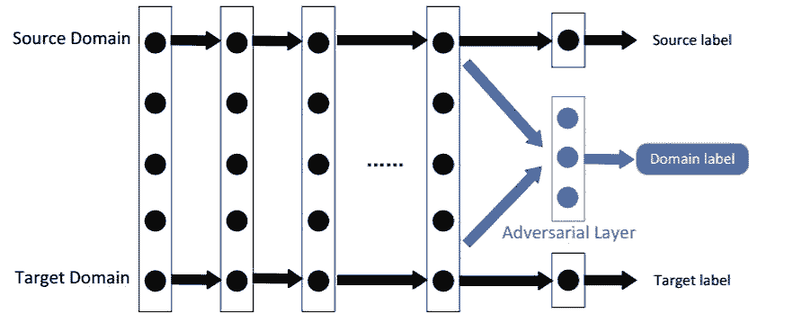

# 学界 | 综述论文：四大类深度迁移学习

选自 arXiv

**作者：****Chuanqi Tan、Fuchun Sun、Tao Kong、**

**Wenchang Zhang、Chao Yang、Chunfang Liu**

**机器之心编译**

**参****与：乾树、刘晓坤**

> 本文是清华大学智能技术与系统国家重点实验室近期发表的深度迁移学习综述，首次定义了深度迁移学习的四个分类，包括基于实例、映射、网络和对抗的迁移学习方法，并在每个方向上都给出了丰富的参考文献。机器之心对该综述进行了全文编译。

**论文：A Survey on Deep Transfer Learning**

论文地址：https://arxiv.org/pdf/1808.01974v1.pdf

**摘要**：作为一种新的分类方法，深度学习最近受到研究人员越来越多的关注，并已成功应用到诸多领域。在某些类似生物信息和机器人的领域，由于数据采集和标注费用高昂，构建大规模的标注良好的数据集非常困难，这限制了这些领域的发展。迁移学习放宽了训练数据必须与测试数据独立同分布（i.i.d.）的假设，这启发我们使用迁移学习来解决训练数据不足的问题。本篇综述的重点是回顾当前利用深度神经网络进行迁移学习的研究及其应用。我们根据深度迁移学习中使用的技术，给出了深度迁移学习的定义、类别并回顾了最近的研究工作。

**1 引言**

深度学习最近受到研究员越来越多的关注，并已成功应用于众多实践中。深度学习算法可以从海量数据中学习高级特征，这使得深度学习具备超越传统机器学习的优势。

深度学习可以通过无监督或半监督特征学习算法和分层特征提取来自动提取数据特征。相比之下，传统的机器学习方法需要手动设计特征，这会严重增加用户的负担。可以说深度学习是机器学习中一种基于大规模数据的表征学习算法。

数据依赖是深度学习中最严峻的问题之一。与传统的机器学习方法相比，深度学习极其依赖大规模训练数据，因为它需要大量数据去理解潜在的数据模式。我们可以发现一个有趣的现象，模型的规模和所需数据量的大小几乎呈线性关系。

一个合理的解释是，对于特定问题，模型的表达空间必须大到足以发现数据的模式。模型中的较底层可以识别训练数据的高级特征，之后的较高层可以识别帮助做出最终决策所需的信息。

在一些特殊领域，训练数据不足不可避免。数据收集复杂且昂贵，因此构建大规模、高质量的带标注数据集非常困难。

例如，生物信息数据集中的每个样本通常都代表一次临床试验或一名痛苦的患者。另外，即使我们以昂贵的价格获得训练数据集，也很容易过时，因此无法有效地应用于新任务中。

迁移学习放宽了训练数据必须与测试数据独立同分布（i.i.d.）这样的假设，这启发我们使用迁移学习来解决训练数据不足的问题。

在迁移学习中，训练数据和测试数据不需要是 i.i.d.，目标域中的模型也不需要从头开始训练，这可以显著降低目标域对训练数据和训练时间的需求。

过去，大多数迁移学习研究都是在传统的机器学习方法中进行的。由于深度学习在现代机器学习方法中的优势地位，深度迁移学习及其应用的概述尤为重要。这篇综述论文的贡献如下：

定义了深度迁移学习，并首次将其分为四类。我们回顾了目前关于每种深度迁移学习的研究工作，并给出了每个类别的标准化描述和示意图。

**2 深度迁移学习**

迁移学习是机器学习中解决训练数据不足问题的重要工具。它试图通过放宽训练数据和测试数据必须为 i.i.d 的假设，将知识从源域迁移到目标域。

这对由于训练数据不足而难以改善性能的许多研究领域产生巨大的积极影响。迁移学习的学习过程如图 1 所示。

这篇综述中使用的某些符号需要明确定义。首先，我们分别给出了域和任务的定义：域可以 用 D = {χ, P(X)} 表示，其包含两部分：特征空间 χ 和边缘概率分布 P(X) 其中 X = {x1, ..., xn} ∈ χ。

任务可以用 T = {y, f(x)} 表示。它由两部分组成：标签空间 y 和目标预测函数 f(x)。f(x) 也可看作条件概率函数 P(y|x)。最后，迁移学习 可以定义如下：

*定义 1：（迁移学习）。给定一个基于数据 Dt 的学习任务 Tt，我们可以从 Ds 中获取对任务 Ts 有用的知识。迁移学习旨在通过发现并转换 Ds 和 Ts 中的隐知识来提高任务 Tt 的预测函数 fT(.) 的表现，其中 Ds ≠ Dt 且/或 Ts ≠ Tt。此外，大多数情况下，Ds 的规模远大于 Dt 的规模。*

 *

*图 1：迁移学习的学习过程。*

综述 [19] 和 [25] 将迁移学习就源域和目标域之间的关系分为三个主要类别，这已被广泛接受。这些综述是对过去迁移学习工作的总结，它介绍了许多经典的迁移学习方法。

此外，人们最近提出了许多更新和更好的方法。近年来，迁移学习研究界主要关注以下两个方面：域适应和多源域迁移。

如今，深度学习近年来在许多研究领域取得了主导地位。重要的是要找到如何通过深度神经网络有效地传递知识，深度神经网络其定义如下：

*定义 2：（深度迁移学习）。给定一个由 <Ds, Ts, Dt, Tt, fT(.)>定义的迁移学习任务。这就是一个深度迁移学习任务，其中 fT(.) 是一个表示深度神经网络的非线性函数。*

**3 类别**

深度迁移学习研究如何通过深度神经网络利用其他领域的知识。由于深度神经网络在各个领域都很受欢迎，人们已经提出了相当多的深度迁移学习方法，对它们进行分类和总结非常重要。

基于深度迁移学习中使用的技术，本文将深度迁移学习分为四类：基于实例的深度迁移学习，基于映射的深度迁移学习，基于网络的深度迁移学习和基于对抗的深度迁移学习，如表 1 所示。

*表 1：深度迁移学习的分类。*

**3.1 基于实例的深度迁移学习**

基于实例的深度迁移学习是指使用特定的权重调整策略，通过为那些选中的实例分配适当的权重，从源域中选择部分实例作为目标域训练集的补充。

它基于这个假设：「尽管两个域之间存在差异，但源域中的部分实例可以分配适当权重供目标域使用。」基于实例的深度迁移学习的示意图如图 2 所示：

*图 2：基于实例的深度迁移学习的示意图。源域中的与目标域不相似的浅蓝色实例被排除在训练数据集之外；源域中与目标域类似的深蓝色实例以适当权重包括在训练数据集中。*

[4] 中提出的 TrAdaBoost 使用基于 AdaBoost 的技术来过滤掉源域中的与目标域不同的实例。在源域中对实例重新加权以构成类似于目标域的分布。最后，通过使用来自源域的重新加权实例和来自目标域的原始实例来训练模型。

它可以减少保持 AdaBoost 属性的不同分布域上的加权训练误差。[27] 提出的 TaskTrAdaBoost 是一种快速算法，可以促进对新目标域的快速再训练。与 TrAdaBoost 设计用于分类问题不同，[20] 提出了 ExpBoost.R2 和 TrAdaBoost.R2 来解决回归问题。

[24] 提出的双权重域自适应（BIW）可以将两个域的特征空间对齐到公共坐标系中，然后为源域的实例分配适当的权重。[10] 提出增强的 TrAdaBoost 来处理区域砂岩显微图像分类的问题。

[26] 提出了一个量度迁移学习框架，用于在并行框架中学习实例权重和两个不同域的距离，以使跨域的知识迁移更有效。[11] 将集成迁移学习引入可以利用源域实例的深度神经网络。

**3.2 基于映射的深度迁移学习**

基于映射的深度迁移学习是指将源域和目标域中的实例映射到新的数据空间。在这个新的数据空间中，来自两个域的实例都相似且适用于联合深度神经网络。

它基于假设：「尽管两个原始域之间存在差异，但它们在精心设计的新数据空间中可能更为相似。」基于映射的深度迁移学习的示意图如图 3 所示：

*图 3：基于映射的深度迁移学习的示意图。来自源域和目标域的实例同时以更相似的方式映射到新数据空间。将新数据空间中的所有实例视为神经网络的训练集。*

由 [18] 引入的迁移成分分析（TCA）和基于 TCA 的方法 [29] 已被广泛用于传统迁移学习的许多应用中。一个自然的想法是将 TCA 方法扩展到深度神经网络。

[23] 通过引入适应层和额外的域混淆损失来扩展 MMD 用以比较深度神经网络中的分布，以学习具有语义意义和域不变性的表示。该工作中使用的 MMD 距离定义为：

损失函数定义为：

[12] 通过用 [8] 中提出的多核变量 MMD（MK-MMD）距离代替 MMD 距离改进了以前的工作。与卷积神经网络（CNN）中的学习任务相关的隐藏层被映射到再生核 Hilbert 空间（RKHS），并且通过多核优化方法使不同域之间的距离最小化。

[14] 提出联合最大均值差异（JMMD）来衡量联合分布的关系。JMMD 用于泛化深度神经网络（DNN）的迁移学习能力，以适应不同领域的数据分布，并改进了以前的工作。由 [2] 提出的 Wasserstein 距离可以用作域的新距离度量，以便找到更好的映射。

**3.3 基于网络的深度迁移学习**

基于网络的深度迁移学习是指复用在源域中预先训练好的部分网络，包括其网络结构和连接参数，将其迁移到目标域中使用的深度神经网络的一部分。

它基于这个假设：「神经网络类似于人类大脑的处理机制，它是一个迭代且连续的抽象过程。网络的前面层可被视为特征提取器，提取的特征是通用的。「基于网络的深度迁移学习示意图如图 4 所示：

*图 4：基于网络的深度迁移学习的示意图。首先，在源域中使用大规模训练数据集训练网络。然后，基于源域预训练的部分网络被迁移到为目标域设计的新网络的一部分。最后，它就成了在微调策略中更新的子网络。*

[9] 将网络分为两部分，前者是与语言无关的特征变换，最后一层是与语言相关的分类器。语言独立的特征变换可以在多种语言之间迁移。[17] 反复使用 CNN 在 ImageNet 数据集上训练的前几层来提取其他数据集图像的中间图像表征，CNN 被训练去学习图像表征，它可以有效地迁移到其他训练数据量受限的视觉识别任务。

[15] 提出了一种联合学习源域中标记数据和目标域中未标记数据的自适应分类器和可迁移特征的方法，它通过将多个层插入深层网络，指引目标分类器显式学习残差函数。[30] 在 DNN 中同时学习域自适应和深度哈希特征。

[3] 提出了一种新颖的多尺度卷积稀疏编码方法。该方法可以以一种联合方式自动学习不同尺度的滤波器组，强制规定学习模式的明确尺度，并提供无监督的解决方案，用于学习可迁移的基础知识并将其微调到目标任务。

[6] 应用深度迁移学习将知识从现实世界的物体识别任务迁移到 glitch 分类器，用于多重力波信号的探测。它证明了 DNN 可以作为优秀的无监督聚类方法特征提取器，根据实例的形态识别新类，而无需任何标记示例。

另一个非常值得注意的结果是 [28] 指出了网络结构和可迁移性之间的关系。它证明了某些模块可能不会影响域内准确性，但会影响可迁移性。它指出哪些特征在深层网络中可以迁移，哪种类型的网络更适合迁移。得出的结论是，LeNet、AlexNet、VGG、Inception、ResNet 在基于网络的深度迁移学习中是很好的选择。

**3.4 基于对抗的深度迁移学习**

基于对抗的深度迁移学习是指引入受生成对抗网络（GAN）[7] 启发的对抗技术，以找到适用于源域和目标域的可迁移表征。它基于这个假设：「为了有效迁移，良好的表征应该为主要学习任务提供辨判别力，并且在源域和目标域之间不可区分。」基于对抗的深度迁移学习的示意图如图 5 所示。

*图 5：基于对抗的深度迁移学习的示意图。在源域大规模数据集的训练过程中，网络的前面层被视为特征提取器。它从两个域中提取特征并将它们输入到对抗层。*

对抗层试图区分特征的来源。如果对抗网络的表现很差，则意味着两种类型的特征之间存在细微差别，可迁移性更好，反之亦然。在以下训练过程中，将考虑对抗层的性能以迫使迁移网络发现更多具有可迁移性的通用特征。

基于对抗的深度迁移学习由于其良好的效果和较强的实用性，近年来取得了快速发展。[1] 通过在损失函数中使用域自适应正则化项，引入对抗技术来迁移域适应的知识。

[5] 提出了一种对抗训练方法，通过增加几个标准层和一个简单的新梯度翻转层，使其适用于大多数前馈神经模型。[21] 为稀疏标记的目标域数据提出了一种方法迁移同时跨域和跨任务的知识。在这项工作中使用了一种特殊的联合损失函数来迫使 CNN 优化域之间的距离，其定义为 LD = Lc +λLadver，其中 Lc 是分类损失，Ladver 是域对抗损失。

因为两个损失彼此直接相反，所以引入迭代优化算法，固定一个损失时更新另一个损失。[22] 提出了一种新的 GAN 损失，并将判别模型与新的域自适应方法相结合。

[13] 提出一个随机多线性对抗网络，其利用多个特征层和基于随机多线性对抗的分类器层来实现深度和判别对抗适应网络。[16] 利用域对抗性损失，并使用基于度量学习的方法将嵌入泛化到新任务，以在深度迁移学习中找到更易处理的特征。

**4 结论**

在本篇综述论文中，我们对深度迁移学习的当前研究进行了回顾和分类。并首次将深度迁移学习分为四类：基于实例的深度迁移学习，基于映射的深度迁移学习，基于网络的深度迁移学习和基于对抗的深度迁移学习。在大多数实际应用中，通常混合使用上述多种技术以获得更好的结果。

目前大多数研究都集中在监督学习上，如何通过深度神经网络在无监督或半监督学习中迁移知识，可能会在未来引发越来越多的关注。负迁移和可迁移性衡量标准是传统迁移学习的重要问题。这两个问题对深度迁移学习的影响也要求我们进行进一步的研究。

此外，为深层神经网络中的迁移知识找到更强大的物理支持是一个非常有吸引力的研究领域，但这需要物理学家、神经学家和计算机科学家的合作。可以预见，随着深度神经网络的发展，深度迁移学习将被广泛应用于解决许多具有挑战性的问题。

****本文为机器之心编译，**转载请联系本公众号获得授权****。**

✄------------------------------------------------

**加入机器之心（全职记者 / 实习生）：hr@jiqizhixin.com**

**投稿或寻求报道：**content**@jiqizhixin.com**

**广告 & 商务合作：bd@jiqizhixin.com***